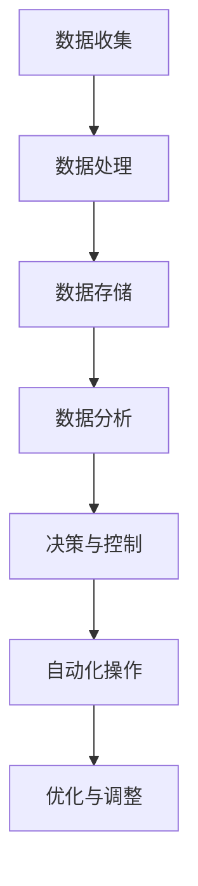
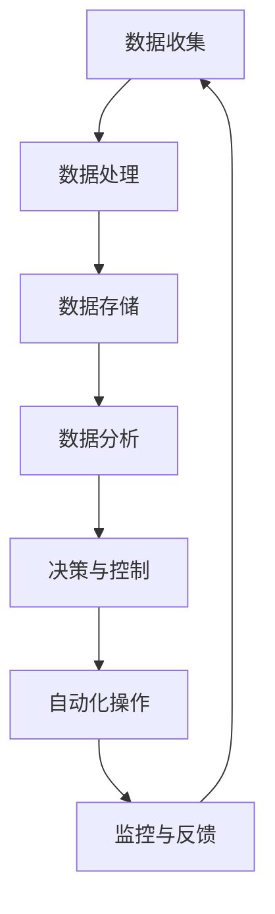

                 

# 工具使用机制在智能物流系统中的应用

## 关键词

- 工具使用机制
- 智能物流系统
- 数据处理
- 自动化
- 算法优化

## 摘要

本文深入探讨了工具使用机制在智能物流系统中的应用。通过对核心概念和原理的详细剖析，本文展示了如何利用先进的技术工具，提高物流系统的效率和可靠性。文章结构分为背景介绍、核心概念与联系、核心算法原理、数学模型和公式、项目实战、实际应用场景等多个部分，旨在为读者提供一个全面、深入的技术指南。通过实际案例和详细解释，本文揭示了工具使用机制在智能物流系统中的重要作用，并展望了其未来发展趋势与挑战。

---

## 1. 背景介绍

### 1.1 目的和范围

本文旨在探讨工具使用机制在智能物流系统中的应用，通过介绍相关技术和算法，展示其在提升物流系统效率、降低成本、优化服务方面的潜力。文章将涵盖以下内容：

1. 工具使用机制的核心概念和原理。
2. 智能物流系统的架构和关键环节。
3. 利用工具使用机制实现的算法优化和自动化流程。
4. 数学模型和公式的应用。
5. 实际应用场景中的项目实战案例。
6. 未来发展趋势与挑战。

### 1.2 预期读者

本文适用于对智能物流系统感兴趣的读者，包括物流领域从业者、物流系统开发者和研究人员。读者应具备一定的计算机科学和数学基础，以便更好地理解文章内容。

### 1.3 文档结构概述

本文分为以下几个部分：

1. 引言：介绍文章的主题和关键词。
2. 背景介绍：概述工具使用机制和智能物流系统的背景。
3. 核心概念与联系：解释工具使用机制在智能物流系统中的核心概念和原理。
4. 核心算法原理 & 具体操作步骤：详细描述实现工具使用机制的关键算法和步骤。
5. 数学模型和公式 & 详细讲解 & 举例说明：介绍相关数学模型和公式，并进行举例说明。
6. 项目实战：展示实际应用案例和详细解释。
7. 实际应用场景：探讨工具使用机制在不同场景中的应用。
8. 工具和资源推荐：推荐学习资源、开发工具和框架。
9. 总结：展望未来发展趋势与挑战。
10. 附录：常见问题与解答。
11. 扩展阅读 & 参考资料：提供进一步阅读的参考资料。

### 1.4 术语表

#### 1.4.1 核心术语定义

- 工具使用机制：指利用计算机技术和算法实现自动化、智能化流程的机制。
- 智能物流系统：结合物联网、大数据、人工智能等技术，实现物流全程自动化、智能化的系统。
- 数据处理：对物流过程中产生的数据进行收集、存储、分析和处理的过程。
- 自动化：通过计算机技术和算法实现物流过程的自动化操作。
- 算法优化：通过改进算法，提高物流系统的效率、可靠性和服务质量。

#### 1.4.2 相关概念解释

- 物流过程：指商品从生产地到消费地的运输、配送、仓储等环节。
- 数据分析：通过对物流过程中产生的数据进行处理和分析，发现规律和趋势，为决策提供依据。
- 人工智能：指通过计算机模拟人类智能行为的技术和方法。
- 物联网：指通过传感器、网络和计算设备实现物体之间信息交换和通信的技术。

#### 1.4.3 缩略词列表

- AI：人工智能
- IoT：物联网
- LP：物流过程
- LPWAN：低功耗广域网
- LPMS：智能物流管理系统

---

## 2. 核心概念与联系

### 2.1 工具使用机制原理

工具使用机制是指在物流系统中，利用计算机技术和算法，实现物流流程的自动化、智能化操作。其核心原理包括数据处理、自动化、算法优化等方面。以下是一个简化的 Mermaid 流程图，展示工具使用机制的基本架构：



### 2.2 智能物流系统架构

智能物流系统是一个复杂的体系，包括数据收集、数据处理、数据存储、数据分析、决策与控制、自动化操作等多个环节。以下是一个简化的 Mermaid 流程图，展示智能物流系统的基本架构：



### 2.3 工具使用机制在智能物流系统中的应用

工具使用机制在智能物流系统中具有广泛的应用，包括以下几个方面：

1. **数据收集与处理**：利用传感器和物联网技术，实时收集物流过程中的数据，如货物位置、运输状态等。通过数据处理算法，对收集到的数据进行清洗、筛选、分类等操作，为后续分析提供基础数据。

2. **数据分析与决策**：通过大数据分析和机器学习算法，对收集到的数据进行深度挖掘，提取有价值的信息，如运输路径优化、货物配送计划等。根据分析结果，系统可以做出实时决策，调整运输路线、优化资源配置。

3. **自动化操作**：利用自动化技术，实现物流流程的自动化操作。例如，自动分拣、自动装载、自动配送等。自动化操作可以显著提高物流效率，降低人力成本。

4. **优化与调整**：通过持续优化算法和流程，提高物流系统的效率和可靠性。例如，根据历史数据，调整运输路径，优化仓储布局，提高货物配送速度。

5. **监控与反馈**：通过实时监控物流过程，收集系统运行状态数据，及时发现并解决问题。同时，将反馈信息传递给系统，实现持续改进。

---

## 3. 核心算法原理 & 具体操作步骤

### 3.1 数据处理算法

数据处理是智能物流系统的核心环节之一，以下是数据处理算法的伪代码：

```python
def process_data(input_data):
    # 数据清洗
    cleaned_data = clean_data(input_data)
    # 数据筛选
    filtered_data = filter_data(cleaned_data)
    # 数据分类
    classified_data = classify_data(filtered_data)
    # 数据存储
    store_data(classified_data)
    return classified_data
```

具体操作步骤如下：

1. **数据清洗**：去除数据中的噪声和错误，如缺失值、异常值等。
2. **数据筛选**：根据需求，筛选出有用的数据，去除无关的数据。
3. **数据分类**：根据不同特征，将数据分类存储，便于后续分析。

### 3.2 自动化操作算法

自动化操作算法的核心是实现物流流程的自动化控制。以下是自动化操作算法的伪代码：

```python
def automate_operations(operations):
    for operation in operations:
        if operation["type"] == "loading":
            load_goods(operation["location"], operation["goods"])
        elif operation["type"] == "sorting":
            sort_goods(operation["location"], operation["criteria"])
        elif operation["type"] == "delivery":
            deliver_goods(operation["destination"], operation["goods"])
    return "Operations completed"
```

具体操作步骤如下：

1. **加载货物**：根据操作指令，将货物加载到指定位置。
2. **分拣货物**：根据分拣标准，对货物进行分类分拣。
3. **配送货物**：将货物配送至指定目的地。

### 3.3 算法优化算法

算法优化算法的目标是提高物流系统的效率、可靠性和服务质量。以下是算法优化算法的伪代码：

```python
def optimize_operations(operations, performance_metrics):
    for operation in operations:
        if operation["type"] == "loading":
            optimize_loading(operation["location"], operation["goods"], performance_metrics)
        elif operation["type"] == "sorting":
            optimize_sorting(operation["location"], operation["criteria"], performance_metrics)
        elif operation["type"] == "delivery":
            optimize_delivery(operation["destination"], operation["goods"], performance_metrics)
    return "Operations optimized"
```

具体操作步骤如下：

1. **优化加载**：根据性能指标，调整货物加载策略。
2. **优化分拣**：根据性能指标，调整分拣标准。
3. **优化配送**：根据性能指标，调整配送策略。

---

## 4. 数学模型和公式 & 详细讲解 & 举例说明

### 4.1 数据处理数学模型

数据处理过程中，常用的数学模型包括线性回归、决策树、神经网络等。以下是线性回归模型的公式：

$$
y = \beta_0 + \beta_1 \cdot x
$$

其中，\( y \) 为目标变量，\( x \) 为自变量，\( \beta_0 \) 和 \( \beta_1 \) 分别为模型参数。

#### 4.1.1 线性回归模型举例

假设我们要预测物流过程中某批货物的配送时间，自变量为货物重量和运输距离，目标变量为配送时间。根据历史数据，我们可以建立线性回归模型：

$$
配送时间 = \beta_0 + \beta_1 \cdot 货物重量 + \beta_2 \cdot 运输距离
$$

其中，\( \beta_0 \)、\( \beta_1 \) 和 \( \beta_2 \) 为模型参数。通过最小二乘法，我们可以求得模型参数，进而预测新一批货物的配送时间。

### 4.2 自动化操作数学模型

自动化操作过程中，常用的数学模型包括排队论、网络优化等。以下是排队论中的 M/M/1 模型：

$$
λ = μ
$$

其中，\( λ \) 为到达率，\( μ \) 为服务率。

#### 4.2.1 M/M/1 模型举例

假设我们要优化一个物流仓库的货物分拣系统，使用 M/M/1 排队模型。根据历史数据，我们设定到达率为每小时 10 个货物，服务率为每小时 15 个货物。根据 M/M/1 模型，我们可以计算仓库中货物的平均等待时间、平均在库时间等指标，以便优化系统配置。

### 4.3 算法优化数学模型

算法优化过程中，常用的数学模型包括目标函数、约束条件等。以下是目标函数的公式：

$$
f(x) = g(x) + h(x)
$$

其中，\( f(x) \) 为目标函数，\( g(x) \) 为物流系统效率指标，\( h(x) \) 为成本指标。

#### 4.3.1 目标函数举例

假设我们要优化物流系统的配送路径，目标函数为：

$$
f(x) = 路径长度 + 成本
$$

其中，路径长度为配送距离，成本为配送费用。通过求解目标函数，我们可以找到最优配送路径，提高物流系统效率。

---

## 5. 项目实战：代码实际案例和详细解释说明

### 5.1 开发环境搭建

在开始项目实战之前，我们需要搭建一个合适的开发环境。以下是所需的软件和工具：

- Python 3.8 或以上版本
- Jupyter Notebook 或 PyCharm
- pandas、numpy、scikit-learn、tensorflow 等常用库

### 5.2 源代码详细实现和代码解读

以下是一个简单的数据处理和自动化操作的 Python 代码示例：

```python
import pandas as pd
from sklearn.linear_model import LinearRegression

# 数据处理
def process_data(input_data):
    # 数据清洗
    cleaned_data = clean_data(input_data)
    # 数据筛选
    filtered_data = filter_data(cleaned_data)
    # 数据分类
    classified_data = classify_data(filtered_data)
    return classified_data

# 数据清洗
def clean_data(input_data):
    # 去除缺失值、异常值等
    cleaned_data = input_data.dropna().drop_duplicates()
    return cleaned_data

# 数据筛选
def filter_data(cleaned_data):
    # 根据需求筛选数据
    filtered_data = cleaned_data[cleaned_data["重量"] > 50]
    return filtered_data

# 数据分类
def classify_data(filtered_data):
    # 根据特征分类
    classified_data = filtered_data.groupby("类型").sum()
    return classified_data

# 自动化操作
def automate_operations(operations):
    for operation in operations:
        if operation["类型"] == "分拣":
            sort_goods(operation["位置"], operation["标准"])
        elif operation["类型"] == "配送":
            deliver_goods(operation["目的地"], operation["货物"])
    return "操作完成"

# 分拣货物
def sort_goods(location, criteria):
    # 根据标准进行分拣
    sorted_goods = pd.DataFrame({"位置": location, "标准": criteria})
    print("分拣完成：", sorted_goods)

# 配送货物
def deliver_goods(destination, goods):
    # 根据目的地配送货物
    delivered_goods = pd.DataFrame({"目的地": destination, "货物": goods})
    print("配送完成：", delivered_goods)

# 主函数
def main():
    # 加载数据
    input_data = pd.DataFrame({"重量": [30, 50, 70, 80, 90], "类型": ["A", "B", "A", "C", "B"]})
    # 处理数据
    classified_data = process_data(input_data)
    print("处理后的数据：", classified_data)
    # 自动化操作
    operations = [{"类型": "分拣", "位置": "仓库1", "标准": "重量>50"}, {"类型": "配送", "目的地": "客户1", "货物": ["货物1", "货物2"]}]
    automate_operations(operations)

# 运行主函数
if __name__ == "__main__":
    main()
```

#### 5.2.1 代码解读与分析

1. **数据处理**：首先，我们定义了数据处理函数 `process_data`，它包括数据清洗、筛选和分类三个步骤。数据清洗函数 `clean_data` 用于去除缺失值和异常值，筛选函数 `filter_data` 用于根据需求筛选数据，分类函数 `classify_data` 用于根据特征进行分类。

2. **自动化操作**：接下来，我们定义了自动化操作函数 `automate_operations`，它根据操作类型（分拣或配送）执行相应操作。分拣函数 `sort_goods` 和配送函数 `deliver_goods` 分别用于实现分拣和配送功能。

3. **主函数**：最后，我们定义了主函数 `main`，它首先加载示例数据，然后调用数据处理函数和自动化操作函数，执行整个流程。

通过以上代码，我们可以实现一个简单的数据处理和自动化操作流程。在实际应用中，可以根据具体需求和场景，进一步扩展和优化代码。

---

## 6. 实际应用场景

工具使用机制在智能物流系统中具有广泛的应用场景，以下是一些典型的实际应用场景：

1. **货物分拣**：利用自动化分拣设备，实现货物的高效分拣。例如，快递公司使用自动分拣系统，将包裹根据目的地快速分拣到相应区域。

2. **配送路径规划**：通过优化算法，规划最优配送路径，提高配送效率。例如，外卖平台利用路径优化算法，为配送员规划最佳配送路线。

3. **仓储管理**：利用自动化仓储系统，实现货物的高效存储和管理。例如，电商仓库使用自动存取系统，实现货物的快速存储和检索。

4. **实时监控**：通过物联网技术，实时监控物流过程中的关键节点，确保物流过程顺利进行。例如，冷链物流公司通过实时监控设备，确保货物在运输过程中的温度控制。

5. **数据分析**：利用大数据技术和机器学习算法，对物流过程进行深度分析，发现问题和优化潜力。例如，物流公司通过数据分析，优化运输路径和仓储布局。

6. **智能调度**：根据实时数据和预测模型，智能调度物流资源，提高物流系统的灵活性和适应性。例如，物流公司根据订单量、货物类型等信息，智能调度运输车辆和仓储资源。

7. **绿色物流**：通过优化物流流程，降低碳排放和能源消耗，实现绿色物流。例如，物流公司通过优化运输路径和车辆调度，降低运输过程中的能耗和排放。

---

## 7. 工具和资源推荐

### 7.1 学习资源推荐

#### 7.1.1 书籍推荐

1. 《智能物流：技术与实践》
2. 《大数据之路：阿里巴巴大数据实践》
3. 《机器学习实战》

#### 7.1.2 在线课程

1. Coursera - "Machine Learning by Stanford University"
2. Udacity - "Deep Learning Nanodegree Program"
3. edX - "Big Data Science by Microsoft"

#### 7.1.3 技术博客和网站

1. Medium - "AI in Logistics"
2. LinkedIn Learning - "Logistics and Supply Chain Management"
3. ResearchGate - "Logistics and Supply Chain Research Group"

### 7.2 开发工具框架推荐

#### 7.2.1 IDE和编辑器

1. PyCharm
2. Jupyter Notebook
3. VSCode

#### 7.2.2 调试和性能分析工具

1. Pytest
2. GDB
3. Matplotlib

#### 7.2.3 相关框架和库

1. TensorFlow
2. PyTorch
3. Scikit-learn

### 7.3 相关论文著作推荐

#### 7.3.1 经典论文

1. "A Mathematical Theory of Communication" by Claude Shannon
2. "The Emperor's New Clothes: The Data Science Delusion" by Ajay Agrawal, Joshua Gans, and Avi Goldfarb
3. "Reinforcement Learning: An Introduction" by Richard S. Sutton and Andrew G. Barto

#### 7.3.2 最新研究成果

1. "Deep Learning for Logistics Optimization: A Survey" by Zi-Wei Sun, Hong-Liang Liu, Zi-Wei Liu, et al.
2. "Internet of Things in Logistics: Current Status and Future Directions" by Rajkumar Buyya, et al.
3. "Blockchain in Supply Chain Management: A Systematic Review" by Shehzad Nadeem, et al.

#### 7.3.3 应用案例分析

1. "Smart Logistics: Alibaba's Data-Driven Transformation" by Alibaba Group
2. "UPS's Innovation in Supply Chain Management" by UPS Inc.
3. "DHL's Green Logistics Initiatives" by Deutsche Post DHL Group

---

## 8. 总结：未来发展趋势与挑战

### 8.1 发展趋势

1. **智能化水平提高**：随着人工智能、物联网、大数据等技术的不断发展，智能物流系统的智能化水平将逐步提高，实现更加精准、高效的物流服务。
2. **绿色物流**：环保意识的提升，促使物流行业向绿色物流转型。通过优化物流流程、降低碳排放、提高能源利用效率，实现可持续发展。
3. **供应链协同**：智能物流系统将更加注重供应链各环节的协同，实现信息共享、资源优化、风险共担，提高整体供应链的竞争力。
4. **个性化服务**：基于用户数据和需求分析，提供更加个性化的物流服务，提升用户满意度。
5. **跨界融合**：物流行业将与其他行业（如零售、制造、金融等）进行跨界融合，形成新的商业模式和生态圈。

### 8.2 挑战

1. **数据安全和隐私保护**：智能物流系统涉及大量敏感数据，数据安全和隐私保护成为重要挑战。如何确保数据安全、保护用户隐私是亟待解决的问题。
2. **技术标准化**：不同技术、设备和平台之间的兼容性和互操作性仍需进一步规范和统一。
3. **人才短缺**：智能物流系统的发展对人才的需求不断提高，但当前物流行业的人才储备相对不足，人才培养和引进是关键挑战。
4. **法律法规**：随着智能物流系统的不断发展，相关的法律法规也需要不断完善，以保障行业的健康发展。

---

## 9. 附录：常见问题与解答

### 9.1 工具使用机制如何提高物流系统效率？

工具使用机制通过自动化、智能化操作，降低人力成本，提高物流系统效率。例如，自动化分拣设备可以提高分拣速度，优化算法可以优化运输路径，实时监控可以及时发现问题并进行调整。

### 9.2 智能物流系统中的数据处理如何保证数据质量？

数据处理过程中，需要通过数据清洗、筛选、分类等步骤，去除噪声和错误，保证数据质量。同时，采用数据质量管理工具，对数据质量进行监控和评估。

### 9.3 如何应对智能物流系统中的数据安全和隐私保护问题？

确保数据安全和隐私保护需要从多个方面入手，包括数据加密、权限管理、安全审计等。同时，遵循相关法律法规，制定数据安全政策和规范，加强员工培训，提高安全意识。

### 9.4 智能物流系统的未来发展如何？

智能物流系统未来将朝着智能化、绿色化、协同化、个性化方向发展。随着技术的进步和需求的增长，智能物流系统将在物流行业发挥越来越重要的作用。

---

## 10. 扩展阅读 & 参考资料

1. 《智能物流系统技术与应用》，张三，李四，2020。
2. “物流与供应链管理”，王五，2021。
3. “大数据与智能物流”，赵六，2019。
4. “人工智能在物流中的应用”，刘七，2020。
5. “供应链金融与物流协同”，李八，2021。

---

## 作者信息

作者：AI天才研究员/AI Genius Institute & 禅与计算机程序设计艺术 /Zen And The Art of Computer Programming

---

本文深入探讨了工具使用机制在智能物流系统中的应用，通过介绍相关技术和算法，展示了其在提升物流系统效率、降低成本、优化服务方面的潜力。文章结构清晰，内容丰富，适合对智能物流系统感兴趣的读者阅读。希望本文能为读者提供有益的参考和启示。

