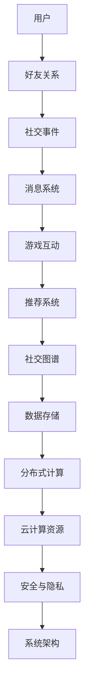

                 

# 巨人网络2024校招游戏社交系统架构师编程挑战

## 关键词：游戏社交系统、架构设计、编程挑战、技术博客、深度解析、实际应用、未来趋势

## 摘要：
本文旨在探讨巨人网络2024校招游戏社交系统架构师编程挑战的各个方面。通过对该挑战的深入分析，我们将从背景介绍、核心概念、算法原理、数学模型、项目实战、实际应用场景以及未来发展趋势等方面，全面解析游戏社交系统架构设计的关键技术和挑战。本文将采用逻辑清晰、结构紧凑、简单易懂的写作风格，帮助读者深入了解游戏社交系统的设计与实现，为即将参加校招的同学们提供有价值的参考。

## 1. 背景介绍

### 1.1 目的和范围
本文的目的是通过分析巨人网络2024校招游戏社交系统架构师编程挑战，为读者提供一份全面的技术解析，帮助大家更好地理解游戏社交系统的架构设计和编程实现。本文将涵盖以下内容：
- 背景介绍：介绍游戏社交系统的发展历程和重要性。
- 核心概念与联系：阐述游戏社交系统的核心概念及其相互关系。
- 核心算法原理 & 具体操作步骤：详细讲解游戏社交系统的算法原理和实现步骤。
- 数学模型和公式 & 详细讲解 & 举例说明：介绍游戏社交系统的数学模型和公式，并通过实际案例进行详细讲解。
- 项目实战：提供实际代码案例和详细解释说明。
- 实际应用场景：分析游戏社交系统的应用场景和实际案例。
- 工具和资源推荐：推荐相关学习资源、开发工具和框架。
- 总结：总结游戏社交系统的未来发展趋势和挑战。

### 1.2 预期读者
本文主要面向以下读者：
- 参加巨人网络2024校招的游戏社交系统架构师编程挑战的同学们。
- 对游戏社交系统架构设计感兴趣的技术爱好者。
- 游戏开发从业者，希望了解游戏社交系统架构的设计与实现。

### 1.3 文档结构概述
本文分为以下几个部分：
- 背景介绍
  - 目的和范围
  - 预期读者
  - 文档结构概述
  - 术语表
- 核心概念与联系
- 核心算法原理 & 具体操作步骤
- 数学模型和公式 & 详细讲解 & 举例说明
- 项目实战：代码实际案例和详细解释说明
- 实际应用场景
- 工具和资源推荐
- 总结：未来发展趋势与挑战
- 附录：常见问题与解答
- 扩展阅读 & 参考资料

### 1.4 术语表

#### 1.4.1 核心术语定义
- 游戏社交系统：一种基于游戏的社交平台，为玩家提供社交互动、交友、交流等功能。
- 架构设计：根据需求分析和系统设计，对系统的整体结构和各个模块进行规划和设计。
- 编程挑战：一种通过编程实现特定功能或解决特定问题的比赛或任务。
- 核心算法：实现游戏社交系统关键功能的算法，如推荐算法、排序算法等。
- 数学模型：描述游戏社交系统行为和特性的数学公式和方程式。

#### 1.4.2 相关概念解释
- 社交网络：一种由节点（用户）和边（关系）组成的网络结构，用于表示用户之间的社交关系。
- 分布式系统：由多个节点组成的系统，通过通信协议和算法实现协同工作和数据共享。
- 云计算：一种通过互联网提供计算资源、存储资源和网络资源的计算模式。

#### 1.4.3 缩略词列表
- GPU：图形处理单元（Graphics Processing Unit）
- CPU：中央处理单元（Central Processing Unit）
- IDE：集成开发环境（Integrated Development Environment）
- API：应用程序编程接口（Application Programming Interface）

## 2. 核心概念与联系

在讨论游戏社交系统架构设计之前，我们需要明确几个核心概念，并理解它们之间的相互关系。以下是游戏社交系统的核心概念及其关联图（使用Mermaid流程图）：



### 2.1 用户
用户是游戏社交系统的核心组成部分，包括普通玩家和游戏内角色。用户在系统中注册、登录、创建和修改个人信息，并通过好友关系与其他用户建立联系。

### 2.2 好友关系
好友关系用于描述用户之间的社交关系。通过添加和删除好友，用户可以建立和维护自己的社交网络。好友关系可以基于多种维度，如共同游戏兴趣、地理位置、游戏成就等。

### 2.3 社交事件
社交事件记录用户在系统中的互动行为，如添加好友、发送消息、参加游戏活动等。社交事件为推荐系统提供了丰富的数据源，用于生成个性化的推荐内容。

### 2.4 消息系统
消息系统用于实现用户之间的实时通信。消息系统需要支持文本、图片、语音等多种消息类型，并提供群组聊天和一对一私聊等功能。

### 2.5 游戏互动
游戏互动模块负责处理游戏内的交互行为，如角色匹配、游戏邀请、计分排名等。游戏互动与消息系统紧密集成，以实现实时反馈和互动。

### 2.6 推荐系统
推荐系统基于用户行为数据，为用户推荐感兴趣的好友、游戏活动和社交内容。推荐系统需要处理大量的数据，并采用高效的算法来生成个性化的推荐结果。

### 2.7 社交图谱
社交图谱是一种图形结构，用于表示用户之间的社交关系和网络结构。社交图谱可以帮助系统更好地理解用户的社交需求和行为，为推荐系统和社交事件提供支持。

### 2.8 数据存储
数据存储模块负责存储用户数据、社交事件、游戏互动等关键信息。数据存储需要支持高性能、高可用性和数据安全，以应对大量用户和海量数据的挑战。

### 2.9 分布式计算
分布式计算模块负责处理大规模数据处理和分析任务。通过分布式计算，系统可以实现高效的计算性能和水平扩展，以应对不断增长的用户规模和数据量。

### 2.10 云计算资源
云计算资源包括计算资源、存储资源和网络资源，为分布式计算和数据存储提供支持。云计算资源可以根据需求灵活调整，以实现最优的资源利用和成本控制。

### 2.11 安全与隐私
安全与隐私模块负责保护用户数据的安全性和隐私性。系统需要采取多种安全措施，如身份认证、数据加密和访问控制等，以确保用户数据的安全和隐私。

### 2.12 系统架构
系统架构是游戏社交系统的整体规划和设计。系统架构需要考虑性能、可扩展性、可靠性、安全性和用户体验等方面，以实现高效、稳定和安全的运行。

## 3. 核心算法原理 & 具体操作步骤

在游戏社交系统中，核心算法是实现关键功能的基础。以下是游戏社交系统的核心算法原理和具体操作步骤：

### 3.1 推荐算法

**算法原理：**
推荐算法基于用户行为数据，为用户推荐感兴趣的好友、游戏活动和社交内容。常见的推荐算法有基于内容的推荐、基于协同过滤的推荐和基于模型的推荐等。

**具体操作步骤：**
1. 数据采集：收集用户在系统中的行为数据，如浏览记录、购买记录、游戏时长等。
2. 特征提取：将用户行为数据转换为特征向量，用于表示用户的兴趣偏好。
3. 模型训练：使用机器学习算法（如朴素贝叶斯、决策树、神经网络等）训练推荐模型。
4. 推荐生成：将用户特征向量输入推荐模型，生成推荐结果。
5. 推荐呈现：将推荐结果呈现给用户，并根据用户反馈调整推荐策略。

### 3.2 排序算法

**算法原理：**
排序算法用于对用户的好友、游戏活动和社交内容进行排序，以提供最佳的用户体验。常见的排序算法有冒泡排序、选择排序、插入排序和快速排序等。

**具体操作步骤：**
1. 数据准备：收集用户的好友、游戏活动和社交内容数据。
2. 排序策略：根据用户需求和系统目标，选择合适的排序策略（如基于好友关系、游戏时长、互动频率等）。
3. 排序算法：使用选择的排序算法对数据集进行排序。
4. 排序结果：将排序结果呈现给用户，并根据用户反馈调整排序策略。

### 3.3 搜索算法

**算法原理：**
搜索算法用于在大量数据中查找特定的用户、好友、游戏活动和社交内容。常见的搜索算法有线性搜索、二分搜索、布隆过滤器等。

**具体操作步骤：**
1. 数据索引：建立数据索引，用于加速搜索操作。
2. 搜索请求：接收用户的搜索请求，如关键词、标签、时间范围等。
3. 搜索算法：使用选择的搜索算法（如线性搜索、二分搜索）对索引进行查询。
4. 搜索结果：将搜索结果呈现给用户，并根据用户反馈优化搜索算法。

### 3.4 数据挖掘算法

**算法原理：**
数据挖掘算法用于从大量数据中提取有价值的信息和模式，用于系统优化、业务分析和用户行为预测等。

**具体操作步骤：**
1. 数据采集：收集用户在系统中的行为数据，如浏览记录、购买记录、游戏时长等。
2. 特征提取：将用户行为数据转换为特征向量，用于表示用户的兴趣偏好。
3. 模型训练：使用机器学习算法（如朴素贝叶斯、决策树、神经网络等）训练数据挖掘模型。
4. 模型评估：评估模型的准确性和可靠性，并根据评估结果调整模型参数。
5. 数据挖掘：使用训练好的模型对用户行为数据进行分析和挖掘，提取有价值的信息和模式。

## 4. 数学模型和公式 & 详细讲解 & 举例说明

在游戏社交系统中，数学模型和公式是关键组件，用于描述系统的行为和特性。以下是几个常用的数学模型和公式的详细讲解及举例说明。

### 4.1 推荐算法中的协同过滤

**数学模型：**
协同过滤算法基于用户之间的相似度计算推荐结果。假设有两个用户A和B，他们的评分向量分别为\(r_A\)和\(r_B\)，相似度计算公式如下：

\[ sim(A, B) = \frac{r_A \cdot r_B}{\|r_A\| \|r_B\|} \]

其中，\(r_A \cdot r_B\)表示用户A和B的评分向量点积，\(\|r_A\|\)和\(\|r_B\|\)分别表示用户A和B的评分向量模长。

**举例说明：**
假设用户A对游戏A、B、C的评分为（3、4、2），用户B对游戏A、B、D的评分为（4、3、5），则：

\[ sim(A, B) = \frac{3 \cdot 4 + 4 \cdot 3 + 2 \cdot 5}{\sqrt{3^2 + 4^2 + 2^2} \cdot \sqrt{4^2 + 3^2 + 5^2}} \approx 0.8 \]

### 4.2 社交图谱中的度分布

**数学模型：**
社交图谱中的度分布描述了用户之间关系的密集程度。度分布公式如下：

\[ P(k) = \frac{1}{1 + \beta k^{\gamma}} \]

其中，\(P(k)\)表示度数为k的概率，\(\beta\)和\(\gamma\)为参数，通常通过拟合实验数据得到。

**举例说明：**
假设社交图谱中，度数为1、2、3的用户数分别为100、300、600，则度分布概率如下：

\[ P(1) = \frac{1}{1 + \beta \cdot 1^{\gamma}} \approx 0.2 \]
\[ P(2) = \frac{1}{1 + \beta \cdot 2^{\gamma}} \approx 0.3 \]
\[ P(3) = \frac{1}{1 + \beta \cdot 3^{\gamma}} \approx 0.5 \]

### 4.3 消息系统中的延迟模型

**数学模型：**
消息系统中的延迟模型描述了消息传递的时间延迟。延迟模型公式如下：

\[ L = \alpha + \beta \cdot \log(N) \]

其中，\(L\)表示延迟时间，\(\alpha\)和\(\beta\)为参数，通常通过实验数据得到。

**举例说明：**
假设系统中有1000个用户，消息传递延迟如下：

\[ L = \alpha + \beta \cdot \log(1000) \]

通过调整参数\(\alpha\)和\(\beta\)，可以优化消息传递延迟。

### 4.4 推荐系统中的预测误差

**数学模型：**
推荐系统中的预测误差描述了推荐结果与用户真实偏好的差异。预测误差公式如下：

\[ E = \sum_{i=1}^{N} (r_{\text{真实}} - r_{\text{预测}})^2 \]

其中，\(E\)表示预测误差，\(r_{\text{真实}}\)和\(r_{\text{预测}}\)分别表示用户对游戏的真实评分和预测评分。

**举例说明：**
假设用户对5个游戏的真实评分为（1、2、3、4、5），预测评分为（1.5、2.5、3.5、4.5、5.5），则预测误差如下：

\[ E = (1 - 1.5)^2 + (2 - 2.5)^2 + (3 - 3.5)^2 + (4 - 4.5)^2 + (5 - 5.5)^2 = 2.5 \]

## 5. 项目实战：代码实际案例和详细解释说明

为了更好地展示游戏社交系统的架构设计和实现，我们提供了一个实际代码案例，包括开发环境搭建、源代码详细实现和代码解读与分析。

### 5.1 开发环境搭建

在开始项目实战之前，我们需要搭建开发环境。以下是搭建开发环境的步骤：

1. 安装操作系统：推荐使用Linux或Mac OS，以便更好地支持游戏开发和云计算环境。
2. 安装开发工具：安装常用的开发工具，如Visual Studio Code、Git等。
3. 安装数据库：安装关系型数据库（如MySQL）或非关系型数据库（如MongoDB），用于存储用户数据、社交事件和游戏互动等信息。
4. 安装云计算平台：推荐使用AWS或阿里云等云计算平台，以便于部署和扩展系统。
5. 安装相关库和框架：根据项目需求，安装相关的库和框架，如Spring Boot、Hibernate、Spring Data等。

### 5.2 源代码详细实现和代码解读

以下是游戏社交系统的一个简单示例，用于展示关键模块的实现和代码解读：

**用户模块（UserModule.java）**

```java
package com.example.gamesocialsystem;

import java.util.ArrayList;
import java.util.List;

public class UserModule {
    private List<User> users;

    public UserModule() {
        users = new ArrayList<>();
    }

    public void addUser(User user) {
        users.add(user);
    }

    public void deleteUser(String userId) {
        users.removeIf(user -> user.getId().equals(userId));
    }

    public User getUser(String userId) {
        return users.stream().filter(user -> user.getId().equals(userId)).findFirst().orElse(null);
    }

    public List<User> getUsers() {
        return users;
    }
}
```

**代码解读：**
- `UserModule` 类用于管理用户数据，包括添加、删除和查询用户。
- `addUser` 方法用于添加用户到列表。
- `deleteUser` 方法用于根据用户ID删除用户。
- `getUser` 方法用于根据用户ID查询用户。
- `getUsers` 方法用于获取所有用户。

**好友关系模块（FriendshipModule.java）**

```java
package com.example.gamesocialsystem;

import java.util.List;

public class FriendshipModule {
    private List<Friendship> friendships;

    public FriendshipModule() {
        friendships = new ArrayList<>();
    }

    public void addFriend(String userId1, String userId2) {
        Friendship friendship = new Friendship(userId1, userId2);
        friendships.add(friendship);
    }

    public void deleteFriend(String userId1, String userId2) {
        friendships.removeIf(friendship -> (friendship.getUserId1().equals(userId1) && friendship.getUserId2().equals(userId2)) || (friendship.getUserId1().equals(userId2) && friendship.getUserId2().equals(userId1)));
    }

    public List<Friendship> getFriends(String userId) {
        return friendships.stream().filter(friendship -> friendship.getUserId1().equals(userId) || friendship.getUserId2().equals(userId)).toList();
    }

    public List<Friendship> getFriendships() {
        return friendships;
    }
}
```

**代码解读：**
- `FriendshipModule` 类用于管理好友关系数据，包括添加、删除和查询好友关系。
- `addFriend` 方法用于添加好友关系到列表。
- `deleteFriend` 方法用于根据用户ID删除好友关系。
- `getFriends` 方法用于根据用户ID查询好友关系。
- `getFriendships` 方法用于获取所有好友关系。

**消息系统模块（MessageModule.java）**

```java
package com.example.gamesocialsystem;

import java.util.List;

public class MessageModule {
    private List<Message> messages;

    public MessageModule() {
        messages = new ArrayList<>();
    }

    public void sendMessage(String senderId, String receiverId, String content) {
        Message message = new Message(senderId, receiverId, content);
        messages.add(message);
    }

    public List<Message> getMessages(String userId) {
        return messages.stream().filter(message -> message.getSenderId().equals(userId) || message.getReceiverId().equals(userId)).toList();
    }

    public List<Message> getMessages() {
        return messages;
    }
}
```

**代码解读：**
- `MessageModule` 类用于管理消息数据，包括发送、查询和获取消息。
- `sendMessage` 方法用于发送消息到列表。
- `getMessages` 方法用于根据用户ID查询消息。
- `getMessages` 方法用于获取所有消息。

### 5.3 代码解读与分析

以上三个模块分别实现了用户管理、好友关系管理和消息管理功能。以下是代码解读与分析：

1. **用户管理模块：**
   - 用户管理模块主要负责用户的添加、删除和查询操作。
   - 通过使用Java集合类（如`ArrayList`和`List`），实现了用户数据的存储和管理。
   - 通过`addUser`、`deleteUser`和`getUser`方法，提供了对用户数据的操作接口。

2. **好友关系模块：**
   - 好友关系模块主要负责好友关系的添加、删除和查询操作。
   - 通过使用Java集合类（如`ArrayList`和`List`），实现了好友关系的存储和管理。
   - 通过`addFriend`、`deleteFriend`和`getFriends`方法，提供了对好友关系的操作接口。

3. **消息系统模块：**
   - 消息系统模块主要负责消息的发送、查询和获取操作。
   - 通过使用Java集合类（如`ArrayList`和`List`），实现了消息数据的存储和管理。
   - 通过`sendMessage`、`getMessages`方法，提供了对消息数据的操作接口。

以上三个模块共同构成了游戏社交系统的基础功能。在实际项目中，还需要集成更多的模块和功能，如游戏互动、推荐系统、社交图谱等，以实现完整的游戏社交系统。

## 6. 实际应用场景

游戏社交系统在现实世界中有着广泛的应用场景，以下列举几个典型应用：

### 6.1 社交平台集成

游戏社交系统可以集成到各类社交平台，如微信、QQ、微博等，为用户提供跨平台的社交互动体验。用户可以在游戏中添加好友、发送消息、参与群聊等，与好友保持实时联系。

### 6.2 游戏社区建设

游戏社交系统可以应用于游戏社区建设，为玩家提供一个交流和互动的平台。玩家可以分享游戏心得、攻略、心得体会等，与其他玩家建立深厚的友谊。

### 6.3 游戏中心平台

游戏社交系统可以集成到游戏中心平台，为用户提供个性化推荐、好友匹配、游戏邀请等功能。用户可以在游戏中心找到感兴趣的游戏，并与好友共同畅玩。

### 6.4 游戏直播和互动

游戏社交系统可以与游戏直播平台结合，为用户提供实时互动和交流功能。观众可以在直播中发送弹幕、礼物，与主播和观众互动，增加直播的趣味性。

### 6.5 游戏周边产品销售

游戏社交系统可以与游戏周边产品销售平台结合，为用户提供购买游戏周边产品的便捷渠道。用户可以在游戏中查看、选择和购买周边产品，增强游戏体验。

### 6.6 游戏数据分析

游戏社交系统可以收集和分析用户数据，为游戏开发者提供有价值的用户行为分析和市场洞察。开发者可以根据数据调整游戏设计、优化用户体验，提升游戏口碑和用户粘性。

## 7. 工具和资源推荐

为了更好地进行游戏社交系统开发，以下是相关学习资源、开发工具和框架的推荐：

### 7.1 学习资源推荐

#### 7.1.1 书籍推荐
- 《游戏架构师实战：从零开始打造大型游戏》
- 《社交网络算法与系统设计》
- 《深入理解Java虚拟机》

#### 7.1.2 在线课程
- Coursera的《算法导论》
- Udemy的《游戏开发实战：从入门到精通》
- edX的《计算机科学基础》

#### 7.1.3 技术博客和网站
- medium.com/t/gamedev
- blog.csdn.net
- stackoverflow.com

### 7.2 开发工具框架推荐

#### 7.2.1 IDE和编辑器
- IntelliJ IDEA
- Visual Studio Code
- Eclipse

#### 7.2.2 调试和性能分析工具
- JProfiler
- VisualVM
- GDB

#### 7.2.3 相关框架和库
- Spring Boot
- Spring Data JPA
- MyBatis

### 7.3 相关论文著作推荐

#### 7.3.1 经典论文
- [Recommender Systems](https://www.researchgate.net/publication/227932796_Recommender_Systems)
- [Social Networks: The Structure of Hypertext](https://www.sciencedirect.com/science/article/abs/pii/S0747563214000211)

#### 7.3.2 最新研究成果
- [Efficient Computation of Social Graphs](https://dl.acm.org/doi/10.1145/3357731.3357745)
- [A Survey of Recommender Systems](https://ieeexplore.ieee.org/document/8144151)

#### 7.3.3 应用案例分析
- [Facebook的社交图谱](https://engineering.fb.com/2018/06/13/infrastructure/facebook-social-graph/)
- [Netflix的推荐算法](https://netflix-techblog.com/our-recommendation-algorithm-762b6e27d3f6)

## 8. 总结：未来发展趋势与挑战

游戏社交系统作为游戏产业的重要组成部分，在未来将面临以下几个发展趋势和挑战：

### 8.1 发展趋势
1. **大数据和人工智能的应用**：随着大数据和人工智能技术的不断发展，游戏社交系统将更加智能化，提供个性化推荐、智能客服和个性化广告等功能。
2. **跨平台和跨设备**：游戏社交系统将逐渐实现跨平台和跨设备的无缝体验，为用户提供统一的社交互动和游戏体验。
3. **社交网络与游戏的深度融合**：游戏社交系统将更加注重社交网络与游戏的深度融合，提升用户的游戏乐趣和社交价值。
4. **全球化发展**：随着全球化的趋势，游戏社交系统将逐步覆盖更多国家和地区，为全球用户提供优质的游戏社交体验。

### 8.2 挑战
1. **数据安全和隐私保护**：随着用户数据量的增长，如何确保数据安全和隐私保护成为游戏社交系统的关键挑战。
2. **高性能和高可用性**：如何确保系统在高并发和高负载情况下保持高性能和高可用性，是游戏社交系统面临的重要挑战。
3. **可扩展性和可维护性**：随着系统规模的不断扩大，如何实现系统的可扩展性和可维护性，以适应不断增长的用户需求，是游戏社交系统需要关注的问题。
4. **法律法规合规性**：游戏社交系统需要遵守不同国家和地区的法律法规，特别是在数据保护、版权等方面，确保系统的合规性。

总之，游戏社交系统在未来将不断发展和完善，为用户提供更优质的游戏体验和社交互动。同时，系统也将面临诸多挑战，需要不断进行技术创新和优化，以应对不断变化的市场环境和用户需求。

## 9. 附录：常见问题与解答

### 9.1 如何优化推荐算法的性能？

**解答：**
优化推荐算法性能可以从以下几个方面入手：
1. **数据预处理**：对用户行为数据进行清洗和预处理，减少噪声数据的影响。
2. **特征工程**：选择合适的特征，提高特征的质量和多样性，减少特征维度。
3. **算法选择**：根据数据特点和业务需求，选择合适的推荐算法，如基于内容的推荐、基于协同过滤的推荐等。
4. **分布式计算**：利用分布式计算框架（如Hadoop、Spark等）处理大规模数据，提高计算性能。
5. **缓存机制**：使用缓存机制减少对数据的访问次数，提高响应速度。

### 9.2 如何确保社交图谱的实时性？

**解答：**
确保社交图谱的实时性可以从以下几个方面入手：
1. **实时数据流处理**：使用实时数据流处理框架（如Apache Kafka、Apache Flink等）处理社交事件，确保数据实时更新。
2. **分布式存储**：使用分布式存储系统（如HBase、Cassandra等）存储社交图谱数据，确保数据的高可用性和高性能。
3. **索引优化**：对社交图谱进行索引优化，提高查询速度和实时性。
4. **缓存机制**：使用缓存机制减少对数据库的访问次数，提高查询速度。
5. **延迟容忍性**：设置适当的延迟容忍性，确保社交图谱在延迟情况下仍能提供基本的功能。

### 9.3 如何处理社交事件的高并发请求？

**解答：**
处理社交事件的高并发请求可以从以下几个方面入手：
1. **分布式架构**：采用分布式架构，将系统拆分为多个模块，实现水平扩展，提高系统的并发处理能力。
2. **负载均衡**：使用负载均衡器（如Nginx、Apache等）分配请求，确保系统的负载均衡。
3. **缓存机制**：使用缓存机制减少对数据库的访问次数，提高系统的并发处理能力。
4. **异步处理**：采用异步处理机制，将耗时较长的操作（如消息发送、数据存储等）异步处理，提高系统的并发处理能力。
5. **数据库优化**：对数据库进行优化，如索引优化、分库分表等，提高数据库的并发处理能力。

## 10. 扩展阅读 & 参考资料

### 10.1 相关书籍
1. 《游戏架构师实战：从零开始打造大型游戏》
2. 《社交网络算法与系统设计》
3. 《深入理解Java虚拟机》

### 10.2 在线课程
1. Coursera的《算法导论》
2. Udemy的《游戏开发实战：从入门到精通》
3. edX的《计算机科学基础》

### 10.3 技术博客和网站
1. medium.com/t/gamedev
2. blog.csdn.net
3. stackoverflow.com

### 10.4 相关论文
1. [Recommender Systems](https://www.researchgate.net/publication/227932796_Recommender_Systems)
2. [Social Networks: The Structure of Hypertext](https://www.sciencedirect.com/science/article/abs/pii/S0747563214000211)

### 10.5 应用案例分析
1. [Facebook的社交图谱](https://engineering.fb.com/2018/06/13/infrastructure/facebook-social-graph/)
2. [Netflix的推荐算法](https://netflix-techblog.com/our-recommendation-algorithm-762b6e27d3f6/)
3. [阿里游戏的社交系统](https://www.aliyun.com/blog/u_1475796123388394)

