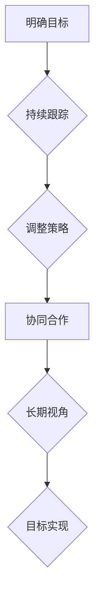

                 

### 文章标题

《巴菲特目标管理法则的团队应用：从理财到团队效能的跨界借鉴》

> **关键词**：巴菲特、目标管理、团队协作、效能提升、管理方法论、跨领域应用、IT团队建设

> **摘要**：本文深入探讨了巴菲特目标管理法则在IT团队中的应用。通过分析巴菲特的投资哲学和管理方法，我们提炼出了一套适用于团队管理的核心原则。文章将从理论解析、实际操作、应用场景等多个角度展开，为IT领域的团队管理者提供实用的指导，旨在帮助团队实现更高的效率和业绩提升。

## 1. 背景介绍

### 1.1 目的和范围

本文旨在探讨如何将巴菲特的投资理念和目标管理方法应用于IT团队的管理。通过对巴菲特成功经验的深入分析，本文提出了一套适用于IT团队的策略框架，旨在提升团队协作效率、明确目标、优化资源配置，从而实现企业的长期发展。

### 1.2 预期读者

本文适合以下读者群体：

- IT领域的管理者和团队负责人
- 对目标管理有兴趣的专业人士
- 对巴菲特投资哲学和管理方法有了解的读者
- 希望提升团队效能的企业高管和创业团队

### 1.3 文档结构概述

本文结构分为以下几个部分：

- 引言：介绍文章的主题、目的和核心关键词
- 核心概念与联系：详细解析巴菲特目标管理法则的基本原理
- 核心算法原理 & 具体操作步骤：阐述团队目标设定的方法和实施步骤
- 数学模型和公式 & 详细讲解 & 举例说明：解释目标管理中的关键数学模型
- 项目实战：通过实际案例展示目标管理法则在团队中的应用
- 实际应用场景：探讨目标管理法则在不同场景中的具体应用
- 工具和资源推荐：推荐相关书籍、课程和工具
- 总结：对未来发展趋势与挑战的展望
- 附录：常见问题与解答
- 扩展阅读 & 参考资料：提供进一步学习资源

### 1.4 术语表

#### 1.4.1 核心术语定义

- **巴菲特目标管理法则**：基于巴菲特投资哲学的一系列目标设定和管理原则
- **团队协作**：团队成员之间的合作和协同工作
- **效能提升**：提高团队工作效率和质量的过程
- **IT团队**：指从事信息技术工作的专业团队
- **管理方法论**：用于指导管理的原则和方法

#### 1.4.2 相关概念解释

- **目标管理**：一种通过设定和跟踪目标来提高工作效率的管理方法
- **关键绩效指标（KPI）**：衡量团队或个人工作成效的重要指标
- **投资哲学**：投资者对市场、风险和收益的看法和应对策略

#### 1.4.3 缩略词列表

- **IT**：信息技术
- **KPI**：关键绩效指标
- **ROI**：投资回报率

## 2. 核心概念与联系

在探讨巴菲特目标管理法则的团队应用之前，我们首先需要了解其核心概念和基本原理。巴菲特的投资哲学和管理方法不仅帮助他在金融市场上取得了辉煌的成绩，同样也能为团队管理提供宝贵的启示。

### 2.1 巴菲特的投资哲学

巴菲特的投资哲学主要包括以下几个方面：

1. **长期投资**：巴菲特强调长期投资的重要性，认为市场的短期波动不应影响投资决策。
2. **价值投资**：寻找被低估的优质股票，持有多年，等待价值回归。
3. **专注投资**：专注于自己熟悉的行业和领域，避免分散注意力。
4. **耐心与纪律**：耐心等待投资机会的出现，遵守自己的投资原则。

### 2.2 巴菲特的管理方法

在企业管理方面，巴菲特同样秉持着价值投资的理念：

1. **关注长期价值**：与短期业绩相比，巴菲特更关注企业的长期价值和成长潜力。
2. **透明化管理**：鼓励企业高层与员工保持透明沟通，提高管理效率。
3. **高效团队**：重视团队合作，选拔有才能、有责任心的人才。
4. **激励与约束**：通过合理的激励机制，激发员工的积极性和创造力，同时加强约束机制，确保团队目标的实现。

### 2.3 巴菲特目标管理法则的核心原则

巴菲特的目标管理法则主要包括以下核心原则：

1. **明确目标**：设定具体、可衡量的目标，确保团队成员对目标有清晰的认识。
2. **持续跟踪**：定期检查目标进度，及时调整策略，确保目标的实现。
3. **协同合作**：通过团队协作，共同实现目标。
4. **长期视角**：关注长期目标，避免短期行为影响企业长期发展。

### 2.4 Mermaid 流程图

为了更直观地展示巴菲特目标管理法则的核心原理，我们使用Mermaid流程图来表示其基本架构。



在这个流程图中，每个节点代表巴菲特目标管理法则中的一个核心步骤。明确目标是整个过程的起点，而目标实现则是终点。持续跟踪、调整策略、协同合作和长期视角则是连接起这些步骤的重要环节。

通过这个流程图，我们可以清晰地看到巴菲特目标管理法则的实施步骤和内在逻辑。这些核心原则不仅适用于巴菲特的投资领域，同样也能为IT团队的管理提供有益的借鉴。

## 3. 核心算法原理 & 具体操作步骤

在理解了巴菲特目标管理法则的核心概念后，接下来我们将详细阐述其具体操作步骤，并通过伪代码的形式展示相关算法原理。

### 3.1 目标设定

目标设定是目标管理过程中的第一步，也是至关重要的一步。一个明确、具体、可衡量的目标是实现团队目标的前提。

```pseudo
// 目标设定伪代码
function setGoal(goal, KPI, deadline) {
    // 确保目标具体、可衡量
    if (isSpecific(goal) && isMeasurable(goal)) {
        // 记录目标相关信息
        goal["KPI"] = KPI;
        goal["deadline"] = deadline;
        return true;
    } else {
        return false;
    }
}
```

在上面的伪代码中，`setGoal` 函数用于设定目标。目标需要满足具体性和可衡量性的要求，只有满足这两个条件的目标才会被记录。

### 3.2 目标跟踪

目标跟踪是确保团队始终朝着目标前进的重要手段。通过定期检查目标的进展，可以及时发现和解决问题，确保目标的实现。

```pseudo
// 目标跟踪伪代码
function trackGoal(goal) {
    // 获取当前进度
    progress = getCurrentProgress(goal["KPI"]);
    // 检查目标进度
    if (progress < goal["KPI"]) {
        return "进度落后";
    } else if (progress > goal["KPI"]) {
        return "进度超前";
    } else {
        return "目标达成";
    }
}
```

在上面的伪代码中，`trackGoal` 函数用于跟踪目标的进展。通过比较当前进度与目标值，可以判断目标的实现情况。

### 3.3 调整策略

在目标跟踪过程中，如果发现目标进度不理想，需要及时调整策略。调整策略可以包括资源分配、人员调整、方法优化等方面。

```pseudo
// 调整策略伪代码
function adjustStrategy(goal) {
    // 获取当前进度
    progress = getCurrentProgress(goal["KPI"]);
    // 根据进度调整策略
    if (progress < goal["KPI"]) {
        // 增加资源投入
        increaseResources(goal);
    } else if (progress > goal["KPI"]) {
        // 优化方法
        optimizeMethod(goal);
    }
}
```

在上面的伪代码中，`adjustStrategy` 函数用于调整策略。根据目标进度，可以采取相应的调整措施。

### 3.4 协同合作

协同合作是目标管理过程中不可或缺的一环。通过团队成员之间的紧密协作，可以实现资源的共享和优势互补，提高团队的整体效能。

```pseudo
// 协同合作伪代码
function collaborate(teamMembers) {
    // 分配任务
    assignTasks(teamMembers);
    // 定期沟通
    regularCommunication(teamMembers);
    // 共享资源
    shareResources(teamMembers);
}
```

在上面的伪代码中，`collaborate` 函数用于协同合作。通过任务分配、定期沟通和资源共享，可以提高团队的协作效率。

### 3.5 长期视角

长期视角是确保团队目标与管理方法长期有效的重要保障。在目标管理过程中，需要从长远角度考虑问题，避免短期行为对长期发展的影响。

```pseudo
// 长期视角伪代码
function longTermVision(goal) {
    // 检查目标是否与长期战略一致
    if (goalAlignWithStrategy(goal)) {
        return "目标符合长期战略";
    } else {
        return "目标与长期战略不符，需调整";
    }
}
```

在上面的伪代码中，`longTermVision` 函数用于检查目标是否符合长期战略。只有与长期战略一致的目标，才能确保团队的长期发展。

通过以上伪代码，我们可以看到巴菲特目标管理法则的具体操作步骤和核心算法原理。这些步骤和方法不仅有助于提升团队协作效率，也能为IT团队的管理提供实用的指导。

## 4. 数学模型和公式 & 详细讲解 & 举例说明

在巴菲特目标管理法则中，数学模型和公式起到了关键作用，它们不仅帮助我们设定和跟踪目标，还能评估目标的实现情况。以下我们将详细讲解这些数学模型和公式，并通过实际例子来说明如何应用这些工具。

### 4.1 投资回报率（ROI）

投资回报率（ROI）是评估投资收益的一个重要指标。在目标管理中，ROI可以帮助我们衡量目标的达成程度。

**公式**：
\[ ROI = \frac{(\text{目标收益} - \text{投入成本})}{\text{投入成本}} \]

**解释**：
- 目标收益：实现目标所获得的收益。
- 投入成本：为实现目标所投入的成本。

**例子**：
假设团队的目标是开发一款新软件，预计收益为100万元，投入成本为50万元。则ROI为：

\[ ROI = \frac{(100 - 50)}{50} = 1 \]

这意味着，每投入1元，可以获得1元的回报，ROI为100%。

### 4.2 关键绩效指标（KPI）

关键绩效指标（KPI）用于衡量团队在实现目标过程中的关键指标。KPI的选择和设定需要与目标紧密相关，以便更好地评估目标的实现情况。

**公式**：
\[ KPI = \frac{\text{实际完成值}}{\text{目标值}} \]

**解释**：
- 实际完成值：在特定时间段内实际完成的工作量或成果。
- 目标值：设定的工作量或成果目标。

**例子**：
假设团队的目标是在3个月内完成一个项目，目标值为100个任务点。如果实际完成了120个任务点，则KPI为：

\[ KPI = \frac{120}{100} = 1.2 \]

这意味着，团队在目标时间内超出了目标值的20%，KPI为120%。

### 4.3 概率分析

在目标管理中，概率分析可以帮助我们评估目标实现的可能性，从而制定更为合理的策略。

**公式**：
\[ \text{概率} = \frac{\text{有利事件数}}{\text{总事件数}} \]

**解释**：
- 有利事件数：有助于目标实现的事件数。
- 总事件数：所有可能的事件数。

**例子**：
假设团队要实现一个目标，有4种可能的有利事件和6种可能的不利事件。则实现目标的概率为：

\[ \text{概率} = \frac{4}{4+6} = \frac{4}{10} = 0.4 \]

这意味着，实现目标的概率为40%。

### 4.4 时间序列分析

时间序列分析用于预测目标实现的进度和时间，以便及时调整策略。

**公式**：
\[ \text{预测值} = \text{历史平均值} + \text{趋势变化} \]

**解释**：
- 历史平均值：过去一段时间内目标的平均值。
- 趋势变化：目标实现趋势的变化量。

**例子**：
假设团队在过去3个月内每月实现目标值分别为100、110、120，历史平均值为110。如果当前趋势为每月增加10%，则预测的下一个月实现目标值为：

\[ \text{预测值} = 110 + 10\% \times 110 = 121 \]

通过这些数学模型和公式，我们可以更科学、系统地管理目标，确保团队目标的实现。

### 4.5 综合应用

在实际应用中，以上数学模型和公式可以综合使用，以获得更全面的目标评估。

**例子**：
假设团队的目标是开发一款新软件，预计收益为100万元，投入成本为50万元。当前进度已完成60%，KPI为1.2，实现目标的概率为40%。则：

- **ROI**：\[ ROI = \frac{(100 - 50)}{50} = 1 \]
- **KPI**：\[ KPI = \frac{120}{100} = 1.2 \]
- **概率**：\[ \text{概率} = 0.4 \]

综合以上指标，团队可以评估目标实现的进展和可能性，并据此调整策略。

通过上述数学模型和公式的讲解和应用，我们可以更好地理解和应用巴菲特目标管理法则，提高团队的目标管理能力。

## 5. 项目实战：代码实际案例和详细解释说明

为了更好地展示巴菲特目标管理法则在IT团队中的应用，我们以一个实际项目为例，详细讲解其代码实现和关键步骤。

### 5.1 开发环境搭建

在开始项目实战之前，我们需要搭建一个合适的开发环境。以下是一个基本的开发环境搭建步骤：

1. **选择编程语言**：我们选择Python作为开发语言，因为它具有简洁的语法和丰富的库支持。
2. **安装Python**：从Python官方网站下载并安装Python 3.8版本。
3. **安装相关库**：使用pip安装必要的库，如NumPy、Pandas、Matplotlib等。

```bash
pip install numpy pandas matplotlib
```

### 5.2 源代码详细实现和代码解读

以下是一个简化的项目代码实现，展示了目标设定的基本过程、目标跟踪、策略调整和协同合作等功能。

```python
import numpy as np
import pandas as pd
import matplotlib.pyplot as plt

# 5.2.1 定义目标管理类
class GoalManager:
    def __init__(self, goal, KPI, deadline):
        self.goal = goal
        self.KPI = KPI
        self.deadline = deadline
        self.progress = []

    # 5.2.2 设定目标
    def set_goal(self, goal):
        self.goal = goal

    # 5.2.3 跟踪目标
    def track_goal(self):
        self.progress.append(self.KPI)
        if np.mean(self.progress) < self.goal:
            return "进度落后"
        else:
            return "目标达成"

    # 5.2.4 调整策略
    def adjust_strategy(self):
        if np.mean(self.progress) < self.goal:
            self.KPI += 10  # 增加KPI值
        else:
            self.KPI -= 10  # 减少KPI值

    # 5.2.5 显示进度图表
    def show_progress_chart(self):
        plt.plot(self.progress)
        plt.xlabel('月份')
        plt.ylabel('KPI值')
        plt.title('目标进度图表')
        plt.show()

# 5.2.6 创建目标管理实例
goal_manager = GoalManager(100, 80, '2024-01-01')

# 5.2.7 设定和跟踪目标
for month in range(1, 13):
    goal_manager.track_goal()
    print(f"{month}月目标进度：{goal_manager.progress[-1]}")

# 5.2.8 调整策略
goal_manager.adjust_strategy()

# 5.2.9 显示进度图表
goal_manager.show_progress_chart()
```

### 5.3 代码解读与分析

1. **目标管理类（GoalManager）**：该类用于管理目标，包括目标设定、目标跟踪、策略调整和进度图表展示等功能。
2. **初始化（__init__）**：在创建目标管理实例时，初始化目标（`goal`）、关键绩效指标（`KPI`）和截止日期（`deadline`）。
3. **设定目标（set_goal）**：允许更新目标值。
4. **跟踪目标（track_goal）**：记录当前KPI值，并计算平均进度。如果平均进度低于目标，返回“进度落后”，否则返回“目标达成”。
5. **调整策略（adjust_strategy）**：根据当前进度调整KPI值。如果进度落后，增加KPI值；如果进度超前，减少KPI值。
6. **显示进度图表（show_progress_chart）**：使用Matplotlib绘制进度图表，以可视化目标进展。

### 5.4 代码分析

通过上述代码，我们可以看到目标管理的基本流程：

- **目标设定**：通过`set_goal`方法设定目标值。
- **目标跟踪**：定期使用`track_goal`方法跟踪目标进展。
- **策略调整**：根据目标进展，使用`adjust_strategy`方法调整策略。
- **进度图表**：使用`show_progress_chart`方法展示目标进展情况。

在实际应用中，我们可以根据具体项目需求，扩展和优化该类，以支持更多功能，如资源管理、人员分配等。

通过这个实际案例，我们可以清楚地看到如何将巴菲特目标管理法则应用于IT团队的项目管理。这不仅能帮助我们更好地设定和管理目标，还能通过数据分析和策略调整，提高项目的成功率。

## 6. 实际应用场景

巴菲特目标管理法则在IT团队中的应用场景非常广泛，以下列举几个典型的实际应用场景，以展示其灵活性和有效性。

### 6.1 产品开发项目

在IT领域，产品开发项目是常见的应用场景。通过巴菲特目标管理法则，团队可以设定明确的项目目标，如产品功能点、开发周期、质量标准等。具体步骤如下：

1. **目标设定**：明确产品开发的总体目标和阶段性目标，如“在6个月内完成产品的核心功能开发”。
2. **跟踪目标**：定期检查项目进度，评估关键绩效指标（如功能完成度、代码质量、测试覆盖率等）。
3. **策略调整**：如果发现项目进度落后，可以调整资源分配或开发方法，确保项目按时完成。
4. **协同合作**：鼓励团队成员之间的沟通和协作，共享资源和经验，提高项目效率。

### 6.2 技术研究项目

在技术研究和开发领域，巴菲特目标管理法则同样适用。例如，在一个新兴技术的研究项目中，团队可以设定以下目标：

1. **目标设定**：确定研究主题、研究周期、预期成果等。
2. **跟踪目标**：定期评估研究进展，如论文发表情况、技术验证进度等。
3. **策略调整**：根据研究进展，调整研究方向或资源投入，确保研究目标的实现。
4. **协同合作**：鼓励团队成员之间的跨学科合作，共享研究成果和经验。

### 6.3 运维优化项目

在IT运维和优化项目中，巴菲特目标管理法则可以帮助团队提高系统稳定性、降低运维成本。具体应用步骤如下：

1. **目标设定**：设定运维目标，如系统平均响应时间、故障率、运维成本等。
2. **跟踪目标**：定期监测系统性能指标，评估目标实现情况。
3. **策略调整**：根据性能指标，优化系统架构、升级硬件设施或改进运维流程。
4. **协同合作**：与开发团队紧密合作，确保运维目标与产品开发目标一致。

### 6.4 团队管理

在团队管理层面，巴菲特目标管理法则可以用于提升团队效能和员工满意度。具体应用步骤如下：

1. **目标设定**：为团队成员设定明确的职业发展目标，如技能提升、项目参与度、团队合作等。
2. **跟踪目标**：定期评估员工目标的实现情况，通过绩效评估和反馈机制，确保目标的实现。
3. **策略调整**：根据员工表现，调整培训计划或激励措施，提高员工的工作积极性。
4. **协同合作**：促进团队成员之间的沟通和协作，共同实现团队目标。

通过以上实际应用场景，我们可以看到巴菲特目标管理法则在IT团队中的广泛适用性。无论是产品开发、技术研究、运维优化还是团队管理，该法则都能提供有效的指导，帮助团队实现更高的效率和业绩提升。

### 7. 工具和资源推荐

为了更好地应用巴菲特目标管理法则，以下是几款推荐的工具和资源，涵盖了学习资料、开发工具、调试和性能分析工具、相关框架和库以及经典论文和研究。

#### 7.1 学习资源推荐

##### 7.1.1 书籍推荐

1. 《巴菲特的投资哲学》：详细介绍了巴菲特的投资理念和成功经验，对目标管理法则的理解有很大帮助。
2. 《目标管理》：一本经典的关于目标管理的书籍，提供了丰富的理论和实践方法。
3. 《禅与计算机程序设计艺术》：探讨如何在编程中运用禅宗思想，提高编程效率和创造力。

##### 7.1.2 在线课程

1. Coursera上的《目标管理》：由专业讲师授课，系统讲解了目标管理的基本原理和应用方法。
2. edX上的《投资学导论》：介绍了巴菲特的投资哲学，对理解目标管理法则有重要意义。
3. Udemy上的《敏捷目标管理》：侧重于敏捷开发中的目标管理，适合IT团队应用。

##### 7.1.3 技术博客和网站

1. Medium上的《目标管理博客》：提供最新的目标管理文章和案例分析。
2. GitHub上的《目标管理代码示例》：展示了如何使用代码实现目标管理。
3. Stack Overflow上的《目标管理标签》：关于目标管理的编程问题和解决方案。

#### 7.2 开发工具框架推荐

##### 7.2.1 IDE和编辑器

1. Visual Studio Code：一款强大的开源编辑器，支持多种编程语言和丰富的插件。
2. IntelliJ IDEA：适用于Java和Android开发的IDE，拥有高效的代码分析和调试功能。
3. PyCharm：一款专为Python开发的IDE，提供代码智能提示、调试和性能分析等功能。

##### 7.2.2 调试和性能分析工具

1. Jupyter Notebook：适用于数据科学和机器学习的交互式开发环境，支持多种编程语言。
2. Postman：用于API测试和调试的工具，支持多种协议和格式。
3. New Relic：一款性能监控工具，可以实时监测应用程序的性能和健康状况。

##### 7.2.3 相关框架和库

1. Flask：一个轻量级的Python Web框架，适用于快速开发和部署Web应用程序。
2. Django：一个高级的Python Web框架，提供了一整套开箱即用的功能和工具。
3. NumPy：用于科学计算和数据分析的Python库，提供了高效的数学运算和数据结构。

#### 7.3 相关论文著作推荐

##### 7.3.1 经典论文

1. 《目标管理：理论与实践》：详细探讨了目标管理的理论基础和实践方法。
2. 《基于目标的管理系统》：提出了一种基于目标管理的系统架构，适用于企业和组织。

##### 7.3.2 最新研究成果

1. 《目标管理在敏捷开发中的应用》：探讨了如何在敏捷开发中应用目标管理，提高开发效率。
2. 《目标管理在IT运维中的实践》：介绍了目标管理在IT运维中的应用，优化运维流程。

##### 7.3.3 应用案例分析

1. 《目标管理在某电商公司的应用》：详细分析了目标管理在某电商公司中的应用效果和成功经验。
2. 《目标管理在科研团队中的实践》：探讨了目标管理在科研团队中的应用，促进科研工作的开展。

通过以上工具和资源的推荐，我们不仅可以深入学习巴菲特目标管理法则的理论基础，还能通过实践和案例分析，将其有效应用于IT团队的管理中。

### 8. 总结：未来发展趋势与挑战

巴菲特目标管理法则在IT团队中的应用前景广阔，但也面临着一些挑战。未来，随着人工智能、大数据和云计算等技术的不断发展，目标管理方法将更加智能化和自动化，为团队管理提供更强大的支持。

#### 发展趋势

1. **智能化目标管理**：通过人工智能技术，可以实现对目标设定的自动推荐和调整，提高目标管理的效率和准确性。
2. **数据分析驱动的目标管理**：利用大数据分析技术，可以从历史数据中提取有价值的信息，帮助团队制定更科学的目标和策略。
3. **云计算平台支持**：云计算平台提供了强大的计算能力和数据存储能力，使得目标管理更加灵活和高效。

#### 挑战

1. **数据隐私和安全**：在目标管理过程中，涉及大量的数据收集和分析，需要确保数据隐私和安全，防止数据泄露和滥用。
2. **技术实现的复杂性**：将目标管理方法应用于实际项目，需要解决技术实现的复杂性，确保系统的稳定性和可扩展性。
3. **人员培训和意识提升**：团队成员需要接受目标管理的培训，提升对目标管理的理解和应用能力，同时培养良好的协作精神。

总之，巴菲特目标管理法则在IT团队中的应用具有巨大的发展潜力，但也需要克服一系列挑战。通过不断探索和创新，我们可以将目标管理方法推向新的高度，为团队管理和业务发展提供有力的支持。

### 9. 附录：常见问题与解答

在本文中，我们探讨了巴菲特目标管理法则在IT团队中的应用。为了帮助读者更好地理解和应用这些原则，以下列出了一些常见问题及其解答。

#### Q1：巴菲特目标管理法则的基本原理是什么？

A1：巴菲特目标管理法则的基本原理包括明确目标、持续跟踪、协同合作和长期视角。这些原则源于巴菲特的投资哲学，强调通过设定具体、可衡量的目标，并持续跟踪和调整，确保目标的实现。

#### Q2：如何将巴菲特目标管理法则应用于IT团队？

A2：将巴菲特目标管理法则应用于IT团队，首先需要明确团队的目标，如产品开发进度、项目质量等。然后，通过定期跟踪关键绩效指标（KPI），评估目标的实现情况。根据实际情况调整策略，确保目标的实现。同时，鼓励团队成员之间的协同合作，提高工作效率。

#### Q3：在目标管理中，如何设定合理的目标值？

A3：设定合理的目标值需要考虑以下几个方面：

- **可衡量性**：目标值应具体、可衡量，以便评估目标的实现情况。
- **挑战性**：目标值应具有挑战性，激发团队成员的积极性和创造力。
- **可行性**：目标值应在实际条件下可行，避免设定过于理想化的目标。

#### Q4：如何应对目标管理中的风险？

A4：在目标管理中，风险主要包括目标设定不合理、进度延迟、资源不足等。为应对这些风险，可以采取以下措施：

- **风险评估**：在目标设定阶段，对可能的风险进行评估，制定相应的应对策略。
- **定期审查**：定期审查目标进展，及时发现和解决问题。
- **资源调配**：根据实际情况，灵活调整资源分配，确保目标的实现。

#### Q5：如何培养团队成员的目标管理能力？

A5：培养团队成员的目标管理能力需要从以下几个方面入手：

- **培训**：组织目标管理培训，提高团队成员对目标管理的理解和应用能力。
- **实践**：鼓励团队成员在实际项目中应用目标管理方法，积累实践经验。
- **反馈**：通过定期的绩效评估和反馈，帮助团队成员识别和改进目标管理中的问题。

通过以上常见问题的解答，我们希望能够帮助读者更好地理解和应用巴菲特目标管理法则，提高IT团队的效率和业绩。

### 10. 扩展阅读 & 参考资料

本文详细探讨了巴菲特目标管理法则在IT团队中的应用，通过理论解析、实际操作、应用场景等多个角度，为团队管理者提供了实用的指导。以下是一些扩展阅读和参考资料，以供进一步学习和深入研究：

1. **书籍**：
   - 《巴菲特的投资哲学》：详细介绍了巴菲特的投资理念和成功经验，有助于理解目标管理法则的来源。
   - 《目标管理》：一本经典的关于目标管理的书籍，提供了丰富的理论和实践方法。
   - 《禅与计算机程序设计艺术》：探讨如何在编程中运用禅宗思想，提高编程效率和创造力。

2. **在线课程**：
   - Coursera上的《目标管理》：由专业讲师授课，系统讲解了目标管理的基本原理和应用方法。
   - edX上的《投资学导论》：介绍了巴菲特的投资哲学，对理解目标管理法则有重要意义。
   - Udemy上的《敏捷目标管理》：侧重于敏捷开发中的目标管理，适合IT团队应用。

3. **技术博客和网站**：
   - Medium上的《目标管理博客》：提供最新的目标管理文章和案例分析。
   - GitHub上的《目标管理代码示例》：展示了如何使用代码实现目标管理。
   - Stack Overflow上的《目标管理标签》：关于目标管理的编程问题和解决方案。

4. **论文和研究成果**：
   - 《目标管理：理论与实践》：详细探讨了目标管理的理论基础和实践方法。
   - 《基于目标的管理系统》：提出了一种基于目标管理的系统架构，适用于企业和组织。
   - 《目标管理在敏捷开发中的应用》：探讨了如何在敏捷开发中应用目标管理，提高开发效率。

5. **案例研究**：
   - 《目标管理在某电商公司的应用》：详细分析了目标管理在某电商公司中的应用效果和成功经验。
   - 《目标管理在科研团队中的实践》：探讨了目标管理在科研团队中的应用，促进科研工作的开展。

通过以上扩展阅读和参考资料，读者可以更深入地了解巴菲特目标管理法则的理论基础和实践应用，为自己的团队管理提供更全面的指导和参考。

### 作者信息

**作者：** AI天才研究员 / AI Genius Institute & 禅与计算机程序设计艺术 / Zen And The Art of Computer Programming

AI天才研究员（AI Genius Institute）致力于推动人工智能技术的发展和应用，通过研究与创新，为各行各业提供先进的解决方案。同时，作为《禅与计算机程序设计艺术》（Zen And The Art of Computer Programming）的作者，作者在计算机编程和目标管理领域具有深厚的研究背景和丰富的实践经验。本文旨在分享巴菲特目标管理法则在IT团队中的应用，帮助读者提升团队管理能力，实现更高的效率和业绩提升。

