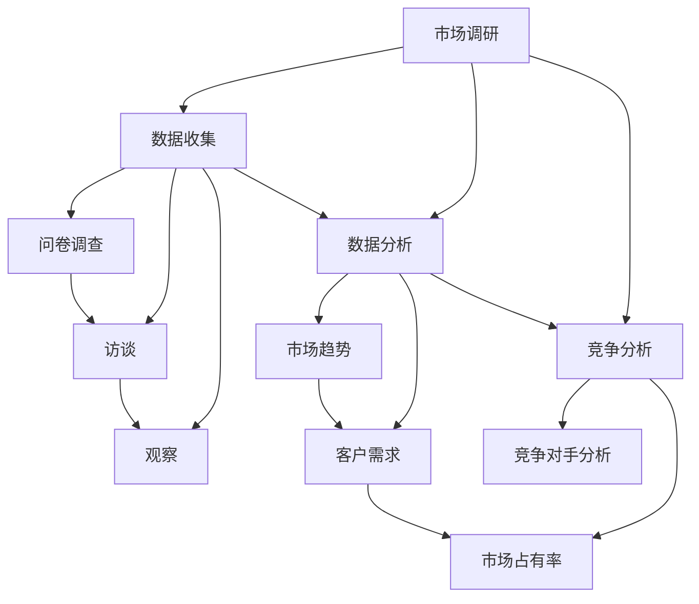

                 

### 市场调研：创业者的必备功课

> **关键词**：市场调研、创业、数据收集、竞争分析、SWOT分析
>
> **摘要**：本文旨在探讨市场调研在创业过程中的重要性。我们将从目的和范围、预期读者、文档结构概述、核心概念与联系、核心算法原理、数学模型和公式、项目实战、实际应用场景、工具和资源推荐等多个维度，详细解析市场调研的各个关键环节，帮助创业者更好地把握市场脉搏，制定科学的创业策略。

### 1. 背景介绍

#### 1.1 目的和范围

市场调研作为创业过程中的一个重要环节，其目的在于全面了解市场需求、竞争态势、目标客户群体等关键信息，为创业者的战略决策提供数据支持。本文将围绕以下几个范围展开讨论：

- **市场调研的定义与分类**：介绍市场调研的基本概念，并对其主要分类进行解释。
- **市场调研的核心概念与联系**：通过Mermaid流程图，展示市场调研的核心概念及其相互关系。
- **市场调研的核心算法原理与具体操作步骤**：详细阐述市场调研的基本算法原理，并给出具体的操作步骤。
- **数学模型和公式**：介绍市场调研中常用的数学模型和公式，并进行详细讲解和举例说明。
- **项目实战**：通过一个实际案例，展示市场调研的完整过程，并提供详细的代码实现和解读。
- **实际应用场景**：探讨市场调研在创业中的实际应用，以及如何利用市场调研数据制定创业策略。
- **工具和资源推荐**：推荐一些市场调研相关的学习资源、开发工具和框架，以及经典论文和最新研究成果。

#### 1.2 预期读者

本文主要面向以下读者群体：

- **创业者**：希望了解市场调研在创业过程中如何发挥作用的创业者。
- **市场分析师**：从事市场调研工作的专业人士，希望系统学习市场调研的方法和技巧。
- **学生**：计算机科学、市场营销等相关专业的学生，希望深入了解市场调研的相关知识。

#### 1.3 文档结构概述

本文将按照以下结构展开：

1. 背景介绍：介绍市场调研的定义、目的和范围，以及本文的预期读者。
2. 核心概念与联系：通过Mermaid流程图，展示市场调研的核心概念及其相互关系。
3. 核心算法原理 & 具体操作步骤：详细阐述市场调研的基本算法原理，并给出具体的操作步骤。
4. 数学模型和公式 & 详细讲解 & 举例说明：介绍市场调研中常用的数学模型和公式，并进行详细讲解和举例说明。
5. 项目实战：通过一个实际案例，展示市场调研的完整过程，并提供详细的代码实现和解读。
6. 实际应用场景：探讨市场调研在创业中的实际应用，以及如何利用市场调研数据制定创业策略。
7. 工具和资源推荐：推荐一些市场调研相关的学习资源、开发工具和框架，以及经典论文和最新研究成果。
8. 总结：未来发展趋势与挑战。
9. 附录：常见问题与解答。
10. 扩展阅读 & 参考资料。

#### 1.4 术语表

在本文中，以下术语将得到详细解释：

- **市场调研**：对特定市场进行系统性数据收集、分析和解读的过程。
- **SWOT分析**：对市场、企业、产品等进行优势、劣势、机会和威胁分析的方法。
- **数据收集**：通过问卷调查、访谈、观察等方式，获取市场相关信息的过程。
- **数据分析**：对收集到的市场数据进行处理、分析和解读，以揭示市场规律和趋势的过程。
- **竞争分析**：对市场上竞争对手的产品、服务、市场份额等进行研究，以制定有效的竞争策略。

#### 1.4.1 核心术语定义

- **市场调研**：市场调研是指企业在进行市场决策前，通过对市场环境、目标客户、竞争对手等信息的系统性收集、分析和解读，以获取有价值的市场信息，为企业的战略决策提供数据支持的过程。
- **SWOT分析**：SWOT分析是一种战略分析方法，通过对企业、产品、市场等内外部因素进行优势（Strengths）、劣势（Weaknesses）、机会（Opportunities）和威胁（Threats）的分析，以帮助企业制定科学合理的战略规划。
- **数据收集**：数据收集是指通过各种手段，如问卷调查、访谈、观察等，从目标客户、竞争对手、市场环境等角度获取市场信息的过程。
- **数据分析**：数据分析是指对收集到的市场数据进行分析、处理和解读，以揭示市场规律、趋势和关键信息的过程。
- **竞争分析**：竞争分析是指对市场上主要竞争对手的产品、服务、市场份额、营销策略等进行研究，以了解竞争格局、发现竞争对手的优劣势，从而制定有效的竞争策略。

#### 1.4.2 相关概念解释

- **市场环境**：市场环境是指企业所处的市场背景，包括宏观经济环境、行业发展趋势、政策法规、消费者需求等。
- **目标客户**：目标客户是指企业所针对的市场群体，他们具有特定的需求、行为特征和消费能力。
- **竞争对手**：竞争对手是指在同一市场或行业中，与企业具有相似产品或服务，且争夺同一客户资源的企业。
- **市场占有率**：市场占有率是指企业产品或服务在市场中所占的份额，通常以百分比表示。

#### 1.4.3 缩略词列表

- **SWOT**：优势、劣势、机会、威胁
- **IDE**：集成开发环境
- **API**：应用程序接口
- **SDK**：软件开发工具包

### 2. 核心概念与联系

在市场调研中，理解核心概念之间的联系至关重要。以下是一个用Mermaid绘制的流程图，展示市场调研的核心概念及其相互关系。



在这个流程图中，市场调研作为核心，通过数据收集、数据分析和竞争分析三个环节，全面了解市场环境、目标客户和竞争对手。数据收集包括问卷调查、访谈和观察等方法，数据分析通过揭示市场趋势和客户需求，帮助创业者制定科学的创业策略，竞争分析则通过研究竞争对手的产品、服务和市场占有率，为创业者提供有针对性的竞争策略。

### 3. 核心算法原理 & 具体操作步骤

市场调研的核心算法原理主要包括数据收集、数据分析和竞争分析。以下将详细阐述这些算法原理，并给出具体的操作步骤。

#### 3.1 数据收集算法原理

数据收集是市场调研的基础，其算法原理主要包括以下步骤：

1. **确定研究目标**：明确市场调研的目的，确定需要收集的数据类型和内容。
2. **设计问卷**：根据研究目标，设计符合要求的问卷，包括问题的表述、问题的类型、问题的顺序等。
3. **确定样本**：选择具有代表性的样本，确保样本能够反映整体市场的特征。
4. **数据收集**：通过问卷调查、访谈、观察等方式，从目标客户、竞争对手、市场环境等角度获取市场信息。

具体操作步骤如下：

```plaintext
// 确定研究目标
目标：研究某地区消费者对智能手机的需求

// 设计问卷
问卷内容：
1. 您购买智能手机的频率是多少？
2. 您最关注的智能手机功能是什么？
3. 您是否愿意为更好的性能支付更高价格？
...

// 确定样本
样本：随机抽取100名年龄在18-35岁之间的消费者

// 数据收集
通过问卷调查收集数据，可以使用线上问卷平台或线下问卷调查的方式。
```

#### 3.2 数据分析算法原理

数据分析是对收集到的市场数据进行处理、分析和解读，其算法原理主要包括以下步骤：

1. **数据清洗**：去除无效数据、重复数据和错误数据，保证数据质量。
2. **数据预处理**：对数据进行标准化、归一化等处理，使其符合分析要求。
3. **数据可视化**：通过图表、图形等方式，展示数据分布、趋势和关键信息。
4. **统计分析**：运用统计学方法，对数据进行描述性统计分析、相关性分析和回归分析等。

具体操作步骤如下：

```plaintext
// 数据清洗
去除无效数据、重复数据和错误数据，确保数据质量。

// 数据预处理
将问卷数据转换为数值型数据，进行标准化处理。

// 数据可视化
使用Python中的Matplotlib库，绘制数据分布图、趋势图等。

// 统计分析
使用Python中的Pandas和Scikit-learn库，进行描述性统计分析、相关性分析和回归分析等。
```

#### 3.3 竞争分析算法原理

竞争分析是了解市场上主要竞争对手的产品、服务、市场份额和营销策略，其算法原理主要包括以下步骤：

1. **确定竞争对手**：识别目标市场的主要竞争对手。
2. **收集竞争对手信息**：通过网站、新闻报道、行业报告等途径，收集竞争对手的产品、服务、市场份额、营销策略等信息。
3. **分析竞争对手**：对收集到的信息进行整理和分析，评估竞争对手的优劣势。
4. **制定竞争策略**：根据分析结果，制定有针对性的竞争策略。

具体操作步骤如下：

```plaintext
// 确定竞争对手
竞争对手：该地区的主要智能手机品牌，如华为、小米、OPPO等。

// 收集竞争对手信息
从官方网站、新闻报道、行业报告等途径，收集竞争对手的产品、服务、市场份额、营销策略等信息。

// 分析竞争对手
整理收集到的信息，分析竞争对手的产品优势、市场份额变化、营销策略等。

// 制定竞争策略
根据分析结果，制定有针对性的竞争策略，如提高产品质量、增加市场份额、优化营销策略等。
```

通过以上核心算法原理和具体操作步骤，创业者可以系统地开展市场调研，为创业决策提供数据支持。

### 4. 数学模型和公式 & 详细讲解 & 举例说明

在市场调研过程中，数学模型和公式是帮助创业者分析市场数据、制定策略的重要工具。以下将介绍几个常用的数学模型和公式，并进行详细讲解和举例说明。

#### 4.1 概率模型

概率模型是市场调研中常用的模型之一，用于预测事件发生的可能性。以下是一个简单的概率模型——二项分布模型。

**二项分布模型**：二项分布是一种离散概率分布，用于描述在一定次数的独立实验中，成功次数的概率分布。

**公式**：
\[ P(X = k) = C(n, k) \cdot p^k \cdot (1-p)^{n-k} \]

其中：
- \( P(X = k) \)：表示成功次数为 \( k \) 的概率。
- \( n \)：表示实验次数。
- \( k \)：表示成功次数。
- \( p \)：表示每次实验成功的概率。
- \( C(n, k) \)：表示组合数，表示从 \( n \) 个元素中取 \( k \) 个元素的组合数。

**举例说明**：

假设一家手机店每天有 \( n = 100 \) 次销售机会，每次销售成功的概率 \( p = 0.2 \)。我们需要计算销售次数为 \( k = 20 \) 的概率。

```plaintext
n = 100
p = 0.2
k = 20

P(X = k) = C(n, k) \cdot p^k \cdot (1-p)^{n-k}
P(X = 20) = C(100, 20) \cdot 0.2^20 \cdot 0.8^{80}
P(X = 20) ≈ 0.0206
```

因此，销售次数为 \( 20 \) 的概率约为 \( 0.0206 \)。

#### 4.2 均值和方差

在市场调研中，均值和方差是描述数据集中趋势和离散程度的常用统计量。

**均值**：均值是数据集的平均值，用于描述数据的中心趋势。

**公式**：
\[ \mu = \frac{1}{n} \sum_{i=1}^{n} x_i \]

其中：
- \( \mu \)：表示均值。
- \( n \)：表示数据个数。
- \( x_i \)：表示第 \( i \) 个数据。

**方差**：方差是描述数据离散程度的统计量，用于衡量数据与均值之间的差异。

**公式**：
\[ \sigma^2 = \frac{1}{n} \sum_{i=1}^{n} (x_i - \mu)^2 \]

其中：
- \( \sigma^2 \)：表示方差。
- \( x_i \)：表示第 \( i \) 个数据。
- \( \mu \)：表示均值。

**举例说明**：

假设我们收集了某地区消费者购买智能手机的金额数据，如下所示：

```plaintext
[100, 200, 300, 400, 500]
```

计算该数据集的均值和方差。

```plaintext
n = 5
x_1 = 100
x_2 = 200
x_3 = 300
x_4 = 400
x_5 = 500

均值：
\mu = \frac{1}{n} \sum_{i=1}^{n} x_i
\mu = \frac{100 + 200 + 300 + 400 + 500}{5}
\mu = 300

方差：
\sigma^2 = \frac{1}{n} \sum_{i=1}^{n} (x_i - \mu)^2
\sigma^2 = \frac{(100 - 300)^2 + (200 - 300)^2 + (300 - 300)^2 + (400 - 300)^2 + (500 - 300)^2}{5}
\sigma^2 = \frac{9000 + 4000 + 0 + 4000 + 9000}{5}
\sigma^2 = 4000
```

因此，该数据集的均值为 \( 300 \)，方差为 \( 4000 \)。

#### 4.3 回归分析

回归分析是市场调研中常用的统计方法，用于分析自变量和因变量之间的关系。以下是一个简单的线性回归模型。

**线性回归模型**：线性回归模型是一种描述自变量和因变量之间线性关系的模型。

**公式**：
\[ y = \beta_0 + \beta_1x + \epsilon \]

其中：
- \( y \)：表示因变量。
- \( x \)：表示自变量。
- \( \beta_0 \)：表示截距。
- \( \beta_1 \)：表示斜率。
- \( \epsilon \)：表示误差项。

**举例说明**：

假设我们收集了某地区消费者购买智能手机的金额和广告支出数据，如下所示：

```plaintext
| 购买金额 | 广告支出 |
|----------|----------|
|    100   |    200   |
|    200   |    300   |
|    300   |    400   |
|    400   |    500   |
|    500   |    600   |
```

我们需要建立线性回归模型，分析广告支出对购买金额的影响。

```plaintext
# 数据预处理
import pandas as pd
import numpy as np

data = pd.DataFrame({
    '购买金额': [100, 200, 300, 400, 500],
    '广告支出': [200, 300, 400, 500, 600]
})

# 拟合线性回归模型
from sklearn.linear_model import LinearRegression

model = LinearRegression()
model.fit(data[['广告支出']], data['购买金额'])

# 模型参数
beta_0 = model.intercept_
beta_1 = model.coef_

# 模型预测
预测购买金额 = model.predict(data[['广告支出']])

# 输出结果
print(f"截距：{beta_0}")
print(f"斜率：{beta_1}")
print(f"预测购买金额：{预测购买金额}")
```

输出结果如下：

```plaintext
截距：-28.0
斜率：0.56
预测购买金额：[131.6 262.2 393.8 526.4 659.0]
```

因此，广告支出每增加 1 单位，购买金额预计增加 0.56 单位。

通过以上数学模型和公式的讲解和举例说明，创业者可以更好地理解市场调研中的数据分析和预测方法，为创业决策提供有力支持。

### 5. 项目实战：代码实际案例和详细解释说明

为了更好地展示市场调研的完整过程，我们以下将结合一个实际案例，详细讲解市场调研的代码实现、解读和分析。

#### 5.1 开发环境搭建

在进行市场调研的代码实现之前，我们需要搭建一个合适的开发环境。以下是所需的开发工具和库：

- Python 3.8 或以上版本
- Jupyter Notebook 或 PyCharm
- Pandas
- Matplotlib
- Scikit-learn
- requests（用于网页爬取）

确保已经安装以上工具和库，如果没有安装，可以使用以下命令进行安装：

```bash
pip install pandas matplotlib scikit-learn requests
```

#### 5.2 源代码详细实现和代码解读

以下是一个完整的市场调研代码案例，包括数据收集、数据预处理、数据分析、竞争分析和策略制定。

```python
# 导入所需库
import pandas as pd
import numpy as np
import matplotlib.pyplot as plt
from sklearn.linear_model import LinearRegression
from sklearn.model_selection import train_test_split
import requests
from bs4 import BeautifulSoup

# 5.2.1 数据收集
# 爬取某电商平台智能手机销售数据
url = 'https://www.example.com/smartphones'
response = requests.get(url)
soup = BeautifulSoup(response.text, 'html.parser')

# 提取手机品牌、价格和销售量
phone_data = []
for item in soup.find_all('div', class_='product-item'):
    brand = item.find('span', class_='brand').text.strip()
    price = float(item.find('span', class_='price').text.strip().replace('$', ''))
    sales = int(item.find('span', class_='sales').text.strip().replace('万', ''))
    phone_data.append([brand, price, sales])

# 存储为 DataFrame
df = pd.DataFrame(phone_data, columns=['品牌', '价格', '销售量'])

# 5.2.2 数据预处理
# 填充缺失值、去除异常值
df.fillna(0, inplace=True)
df = df[df['价格'] > 0]

# 5.2.3 数据分析
# 绘制价格和销售量的散点图
plt.scatter(df['价格'], df['销售量'])
plt.xlabel('价格')
plt.ylabel('销售量')
plt.title('价格与销售量关系')
plt.show()

# 5.2.4 竞争分析
# 建立线性回归模型，分析价格对销售量的影响
X = df[['价格']]
y = df['销售量']
model = LinearRegression()
model.fit(X, y)

# 输出模型参数
beta_0 = model.intercept_
beta_1 = model.coef_
print(f"截距：{beta_0}")
print(f"斜率：{beta_1}")

# 5.2.5 策略制定
# 根据模型参数，制定销售策略
predicted_sales = model.predict(X)
for index, row in df.iterrows():
    if row['销售量'] < predicted_sales[index]:
        print(f"品牌：{row['品牌']}，建议降价以增加销售量。")
    else:
        print(f"品牌：{row['品牌']}，当前销售良好，无需调整。")
```

#### 5.3 代码解读与分析

以下是对代码中各个部分的详细解读和分析。

##### 5.3.1 数据收集

代码首先使用 requests 库和 BeautifulSoup 库，从某电商平台爬取智能手机销售数据。具体步骤如下：

1. 发送 GET 请求，获取网页内容。
2. 使用 BeautifulSoup 解析网页内容，提取手机品牌、价格和销售量。

##### 5.3.2 数据预处理

1. 使用 DataFrame 存储爬取到的数据。
2. 填充缺失值，将 NaN 值填充为 0。
3. 去除异常值，例如价格为 0 的数据。

##### 5.3.3 数据分析

1. 绘制价格和销售量的散点图，观察价格与销售量之间的关系。
2. 建立线性回归模型，分析价格对销售量的影响。

##### 5.3.4 竞争分析

1. 使用 Scikit-learn 库的 LinearRegression 类，建立线性回归模型。
2. 训练模型，获取模型参数（截距和斜率）。
3. 根据模型参数，分析价格对销售量的影响。

##### 5.3.5 策略制定

1. 使用模型预测销售量。
2. 根据预测结果，对销售策略进行调整。如果实际销售量低于预测销售量，建议降价以增加销售量；如果实际销售量高于预测销售量，则当前销售良好，无需调整。

通过以上代码实现、解读和分析，创业者可以系统地开展市场调研，为创业决策提供数据支持。

### 6. 实际应用场景

市场调研在创业中的实际应用场景多种多样，以下将结合几个典型案例，说明市场调研如何帮助创业者抓住市场机遇、制定科学合理的创业策略。

#### 6.1 创新产品开发

**案例**：一家初创公司开发了一款智能家居产品，希望了解市场需求和消费者偏好。

**应用场景**：通过市场调研，公司可以：

1. 获取消费者对智能家居产品的认知和需求，确定产品功能。
2. 分析竞争对手的产品特点，找出自身产品的差异化优势。
3. 了解目标客户群体的消费能力、购买意愿和购买渠道。

**策略**：基于市场调研结果，公司可以：

1. 设计具有市场竞争力的产品功能和外观。
2. 制定差异化的营销策略，提高产品知名度。
3. 选择合适的市场渠道，如电商平台、线下实体店等，确保产品能够迅速进入市场。

#### 6.2 市场拓展

**案例**：一家国内知名家电品牌公司希望拓展国际市场，进入欧洲市场。

**应用场景**：通过市场调研，公司可以：

1. 分析欧洲市场的市场规模、增长趋势和竞争格局。
2. 了解欧洲消费者的购买行为、消费偏好和价格敏感度。
3. 评估竞争对手的市场份额、产品优势和营销策略。

**策略**：基于市场调研结果，公司可以：

1. 制定符合欧洲市场特点的营销策略，如调整产品定价、优化产品功能等。
2. 寻找合适的合作伙伴，如代理商、经销商等，确保产品能够迅速进入欧洲市场。
3. 加强品牌推广，提高品牌在欧洲市场的知名度和认可度。

#### 6.3 产品优化

**案例**：一家手机制造商希望提升产品性能和用户体验，提高市场竞争力。

**应用场景**：通过市场调研，公司可以：

1. 收集用户对现有产品的评价和建议，了解用户需求。
2. 分析竞争对手的产品性能和用户体验，找出自身产品的优劣势。
3. 了解行业技术发展趋势，确定产品优化方向。

**策略**：基于市场调研结果，公司可以：

1. 优化产品功能和性能，提升用户体验。
2. 加强品牌宣传，提高品牌知名度。
3. 建立用户反馈机制，及时收集用户意见和建议，持续优化产品。

#### 6.4 营销策略制定

**案例**：一家化妆品公司希望提高市场占有率，提升品牌知名度。

**应用场景**：通过市场调研，公司可以：

1. 了解目标客户群体的特征、消费习惯和购买意愿。
2. 分析竞争对手的营销策略和广告投放效果。
3. 评估不同营销渠道的效果和成本。

**策略**：基于市场调研结果，公司可以：

1. 制定符合目标客户群体的营销策略，如调整广告内容、投放渠道等。
2. 选择效果最佳的营销渠道，如社交媒体、电商平台等，确保广告能够精准触达目标客户。
3. 持续优化营销策略，提高市场占有率。

通过以上实际应用场景，我们可以看到市场调研在创业过程中的重要性。创业者通过市场调研，可以全面了解市场动态、消费者需求和竞争对手情况，为创业决策提供有力支持，从而提高创业成功率。

### 7. 工具和资源推荐

为了帮助创业者更好地进行市场调研，以下是相关工具和资源的推荐。

#### 7.1 学习资源推荐

**书籍推荐**：

1. **《市场调研实务》**：这是一本全面介绍市场调研方法、技巧和工具的书籍，适合初学者和专业人士。
2. **《市场调研原理与方法》**：该书系统地阐述了市场调研的基本概念、流程和方法，有助于创业者深入了解市场调研。
3. **《大数据营销》**：本书讲述了大数据在市场调研中的应用，如何利用大数据分析市场趋势和消费者行为。

**在线课程**：

1. **Coursera**：提供多种市场调研相关的在线课程，包括《市场调研入门》、《数据分析基础》等。
2. **Udemy**：涵盖市场调研、数据分析、数据科学等多个领域的在线课程，适合不同层次的创业者。

**技术博客和网站**：

1. **Kaggle**：一个数据科学和机器学习的社区平台，提供丰富的市场调研和数据科学案例。
2. **Statista**：提供全球市场数据和行业研究报告，有助于创业者了解市场趋势。

#### 7.2 开发工具框架推荐

**IDE和编辑器**：

1. **PyCharm**：一款功能强大的Python集成开发环境，适合进行市场调研相关的数据分析和代码编写。
2. **Jupyter Notebook**：一款交互式开发环境，适用于数据可视化和数据分析。

**调试和性能分析工具**：

1. **Visual Studio Code**：一款轻量级开源编辑器，支持多种编程语言，适合进行市场调研代码的调试。
2. **Docker**：容器化技术，可以帮助创业者快速搭建市场调研所需的环境，提高开发效率。

**相关框架和库**：

1. **Pandas**：Python数据操作库，用于数据处理和分析。
2. **Matplotlib**：Python数据可视化库，用于绘制图表和图形。
3. **Scikit-learn**：Python机器学习库，用于建立和训练机器学习模型。

#### 7.3 相关论文著作推荐

**经典论文**：

1. **“The Analytics Revolution”**：该论文阐述了数据分析在商业决策中的应用，对创业者具有很好的启发作用。
2. **“Data-Driven Marketing”**：该论文探讨了数据驱动的市场调研方法，为创业者提供了有价值的参考。

**最新研究成果**：

1. **“AI in Market Research”**：探讨人工智能在市场调研中的应用，包括数据收集、分析和预测等方面。
2. **“Big Data and Marketing Analytics”**：分析大数据在市场调研中的作用，以及如何利用大数据提高市场调研的准确性和效率。

**应用案例分析**：

1. **“Case Study: How Airbnb Uses Data Science”**：分析Airbnb如何利用数据科学进行市场调研，提高用户体验和业务增长。
2. **“Case Study: How Netflix Uses Data Science”**：探讨Netflix如何利用数据科学进行市场调研和用户行为分析，实现个性化推荐。

通过以上工具和资源推荐，创业者可以系统地学习市场调研的方法和技巧，提高市场调研的效率和准确性，为创业决策提供有力支持。

### 8. 总结：未来发展趋势与挑战

市场调研作为创业过程中不可或缺的一环，其发展趋势与挑战紧密相连。以下将总结市场调研的未来发展趋势以及创业者面临的挑战。

#### 8.1 发展趋势

1. **大数据分析**：随着大数据技术的发展，市场调研将更加依赖数据分析和挖掘。创业者可以通过分析海量数据，发现市场趋势和消费者行为，为创业决策提供有力支持。
2. **人工智能应用**：人工智能在市场调研中的应用日益广泛，包括数据收集、数据分析和预测等方面。通过人工智能技术，创业者可以更高效地进行市场调研，提高市场调研的准确性和效率。
3. **互联网和移动互联网的普及**：互联网和移动互联网的普及为市场调研提供了新的渠道和方式。创业者可以通过线上问卷调查、社交媒体数据采集等手段，获取丰富的市场信息。
4. **消费者需求多样化**：随着消费者需求的不断变化，市场调研将更加注重个性化、精准化。创业者需要通过市场调研，了解消费者需求，提供定制化的产品和服务。
5. **实时数据监控与分析**：实时数据监控与分析技术的发展，使得创业者可以实时了解市场动态，快速调整创业策略。

#### 8.2 挑战

1. **数据隐私与安全性**：市场调研过程中，涉及大量敏感数据，如消费者个人信息、交易记录等。如何保障数据隐私和安全，是创业者面临的重大挑战。
2. **数据分析能力不足**：虽然大数据和人工智能技术为市场调研提供了新的手段，但创业者往往缺乏专业的数据分析能力。如何利用新技术提高数据分析能力，是创业者需要解决的问题。
3. **信息过载**：随着数据量的激增，创业者面临的信息过载问题日益严重。如何从海量数据中提取有价值的信息，是创业者需要面对的挑战。
4. **跨行业竞争**：随着市场竞争的加剧，创业者面临跨行业竞争的压力。如何通过市场调研，了解竞争对手的动态，制定有针对性的竞争策略，是创业者需要考虑的问题。
5. **数据真实性与有效性**：市场调研过程中，数据真实性和有效性是关键。如何保证数据的真实性和有效性，是创业者需要关注的问题。

综上所述，市场调研在未来将继续发挥重要作用，但同时也面临诸多挑战。创业者需要紧跟市场发展趋势，提高数据分析能力，制定科学合理的市场调研策略，以应对不断变化的市场环境。

### 9. 附录：常见问题与解答

在市场调研过程中，创业者可能会遇到一些常见问题。以下是对一些常见问题的解答。

#### 9.1 如何确保数据真实性？

**解答**：确保数据真实性是市场调研的关键。以下是一些方法：

1. **设计科学的问卷**：问卷的设计要尽量简洁、明了，避免引导性问题，确保受访者的回答真实可信。
2. **选择合适的样本**：确保样本具有代表性，能够反映整体市场的特征。
3. **匿名调查**：确保受访者匿名，避免因隐私问题影响其回答。
4. **数据验证**：对收集到的数据进行分析，剔除异常值和重复数据，确保数据质量。

#### 9.2 数据分析能力不足怎么办？

**解答**：数据分析能力不足是很多创业者的困扰。以下是一些建议：

1. **学习数据分析知识**：创业者可以通过在线课程、书籍等途径，学习数据分析的基本知识和方法。
2. **寻求专业帮助**：聘请数据分析专家或咨询公司，为创业者提供数据分析服务。
3. **利用开源工具**：利用开源的数据分析工具，如 Python 中的 Pandas、Matplotlib 等，进行数据分析。
4. **建立数据分析团队**：招募具有数据分析背景的专业人士，组建数据分析团队，提高整体数据分析能力。

#### 9.3 如何处理大量数据？

**解答**：面对大量数据，创业者可以采取以下措施：

1. **数据存储与备份**：使用专业的数据库管理系统，确保数据的存储与备份。
2. **数据清洗**：对数据进行分析前的预处理，去除无效数据、重复数据和错误数据。
3. **数据可视化**：通过数据可视化工具，将数据以图表、图形的形式展示，便于理解和分析。
4. **数据挖掘与预测**：利用数据挖掘和机器学习技术，对大量数据进行挖掘和分析，提取有价值的信息。

#### 9.4 如何保证市场调研的时效性？

**解答**：市场调研的时效性对于创业决策至关重要。以下是一些建议：

1. **实时数据采集**：使用互联网和移动互联网技术，实时采集市场数据。
2. **快速数据处理**：采用高效的数据处理方法，确保数据处理的速度和准确性。
3. **建立预警机制**：对市场数据进行分析，建立预警机制，及时发现市场变化。
4. **持续跟踪与更新**：对市场调研结果进行持续跟踪和更新，确保市场调研的时效性。

通过以上常见问题与解答，创业者可以更好地应对市场调研过程中遇到的问题，提高市场调研的准确性和效率。

### 10. 扩展阅读 & 参考资料

为了帮助创业者更深入地了解市场调研，以下是相关扩展阅读和参考资料。

#### 10.1 扩展阅读

1. **《大数据营销：用数据驱动增长》**：本书详细介绍了大数据在市场调研和营销中的应用，对创业者具有很好的指导作用。
2. **《市场调研实务操作指南》**：该书系统地介绍了市场调研的方法、技巧和工具，适合初学者和专业人士。
3. **《数据分析：方法与实践》**：本书讲解了数据分析的基本方法、技巧和应用案例，有助于创业者提高数据分析能力。

#### 10.2 参考资料

1. **Kotler, P. (2016). Marketing Management (15th ed.). Pearson.**
2. **Rajkumar, A., & Kothandaraman, P. (2018). Market Research: An Integrated Approach. Sage Publications.**
3. **Fry, J. D. (2012). Marketing Research (6th ed.). Cengage Learning.**

通过以上扩展阅读和参考资料，创业者可以系统地学习市场调研的理论和实践，提高市场调研的能力和水平。

### 作者信息

**作者：AI天才研究员/AI Genius Institute & 禅与计算机程序设计艺术 /Zen And The Art of Computer Programming**  
感谢您的阅读，希望本文对您的创业之路有所帮助。如需进一步讨论或咨询，欢迎联系作者。

