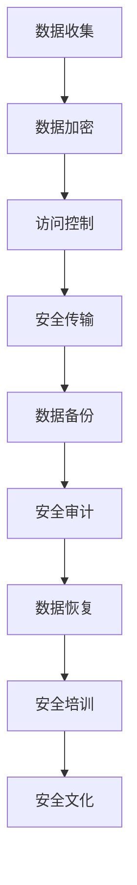

                 

# 平台经济的数据安全保障：如何保障数据安全？

> 关键词：平台经济、数据安全、保障策略、隐私保护、加密技术

> 摘要：本文深入探讨平台经济中的数据安全问题，分析当前的数据安全挑战，并详细阐述了一系列保障数据安全的策略和措施，包括数据加密、隐私保护以及合规性检查等。通过实际案例分析，本文旨在为平台企业提供一个全面的数据安全保障方案，以应对日益严峻的数据安全威胁。

## 1. 背景介绍

### 1.1 目的和范围

本文旨在探讨平台经济中的数据安全问题，特别是如何确保数据在收集、存储、处理和传输过程中的安全性。随着互联网和移动设备的普及，平台经济已经成为全球经济的重要组成部分。然而，平台经济的快速发展也带来了新的数据安全挑战。本文将讨论以下主题：

- 平台经济的定义和特点
- 数据安全的关键挑战
- 保障数据安全的策略和措施
- 数据加密和隐私保护技术
- 实际应用案例和经验分享

### 1.2 预期读者

本文适用于以下读者群体：

- 数据安全专业人员
- 平台企业的高级管理人员和CTO
- 数据科学家和软件工程师
- 对数据安全感兴趣的科研人员和教育工作者

### 1.3 文档结构概述

本文结构如下：

- 第1章：背景介绍，概述本文的目的和范围
- 第2章：核心概念与联系，介绍平台经济和数据安全的定义
- 第3章：核心算法原理 & 具体操作步骤，介绍保障数据安全的技术手段
- 第4章：数学模型和公式 & 详细讲解 & 举例说明，解释数据安全的关键概念
- 第5章：项目实战：代码实际案例和详细解释说明，展示数据安全保障的实际应用
- 第6章：实际应用场景，分析平台经济中的常见数据安全问题
- 第7章：工具和资源推荐，推荐学习资源和开发工具
- 第8章：总结：未来发展趋势与挑战，展望数据安全的未来
- 第9章：附录：常见问题与解答，解答读者可能遇到的问题
- 第10章：扩展阅读 & 参考资料，提供进一步阅读的资源

### 1.4 术语表

#### 1.4.1 核心术语定义

- 平台经济：一种以互联网和移动设备为基础的经济模式，通过平台连接供需双方，提供商品和服务。
- 数据安全：确保数据在存储、处理和传输过程中不被未经授权的访问、泄露、篡改和破坏。
- 加密技术：利用数学原理和方法，将数据转换为密文，以防止未经授权的访问。
- 隐私保护：采取措施保护个人和敏感数据的隐私，防止数据泄露和滥用。

#### 1.4.2 相关概念解释

- 数据泄露：未经授权的访问和泄露敏感数据。
- 数据篡改：未经授权的更改或破坏数据。
- 安全漏洞：系统或应用程序中存在的可以被利用的缺陷或弱点。
- 合规性检查：确保平台和数据处理活动符合相关法律法规和数据保护标准。

#### 1.4.3 缩略词列表

- GDPR：通用数据保护条例（General Data Protection Regulation）
- SSL：安全套接层协议（Secure Sockets Layer）
- AES：高级加密标准（Advanced Encryption Standard）
- TLS：传输层安全协议（Transport Layer Security）

## 2. 核心概念与联系

平台经济和数据安全是当前信息技术领域的重要议题。为了更好地理解这两者的联系，我们首先需要明确核心概念和基本架构。

### 2.1 平台经济的核心概念

平台经济是一种以互联网和移动设备为基础的经济模式，通过构建在线平台，连接供需双方，提供商品和服务。平台经济的核心特点包括：

- 供需匹配：平台通过算法和技术手段，实现供需双方的精准匹配。
- 用户体验：平台提供优质的用户体验，增加用户黏性和活跃度。
- 数据驱动：平台通过数据分析和挖掘，优化运营策略和商业模式。
- 共享经济：平台共享资源，降低成本，提高效率。

### 2.2 数据安全的定义与重要性

数据安全是指确保数据在存储、处理和传输过程中不被未经授权的访问、泄露、篡改和破坏。数据安全的重要性体现在以下几个方面：

- 遵守法律法规：保护个人和企业的数据权益，符合相关法律法规和行业标准。
- 维护品牌信誉：确保数据安全，避免数据泄露和隐私泄露，维护品牌声誉。
- 保护商业秘密：防止敏感数据和商业秘密被窃取和泄露。
- 提高运营效率：通过数据安全措施，降低数据风险，提高业务运营效率。

### 2.3 平台经济中的数据安全挑战

平台经济中的数据安全面临以下挑战：

- 大数据规模：平台企业处理的海量数据，使得数据安全问题更加复杂。
- 多元化数据来源：平台涉及多个数据来源，数据安全难以保障。
- 安全漏洞：平台系统可能存在安全漏洞，容易被黑客攻击。
- 数据合规性：平台企业需要遵守各种数据保护法规，如GDPR等。
- 隐私保护：平台需要平衡数据利用和隐私保护，避免隐私泄露。

### 2.4 数据安全保障架构

为了保障平台经济中的数据安全，需要构建一个综合性的数据安全保障架构。该架构包括以下几个关键组成部分：

1. **数据加密技术**：通过加密算法，将敏感数据转换为密文，防止数据泄露。
2. **访问控制机制**：设置用户身份验证和权限控制，确保只有授权用户可以访问数据。
3. **安全传输协议**：使用安全传输协议，如SSL/TLS，确保数据在传输过程中不被窃听和篡改。
4. **数据备份和恢复**：定期备份数据，并建立数据恢复机制，防止数据丢失和损坏。
5. **安全审计和监控**：实时监控数据安全事件，进行安全审计，及时发现和应对安全威胁。
6. **安全培训和文化**：加强员工的安全意识培训，建立安全文化，提高整体数据安全水平。

### 2.5 Mermaid 流程图

以下是一个简单的Mermaid流程图，展示数据安全保障的关键流程和步骤：



## 3. 核心算法原理 & 具体操作步骤

在平台经济中，数据加密技术是保障数据安全的关键措施之一。本节将介绍数据加密的核心算法原理，以及具体的操作步骤。

### 3.1 数据加密算法原理

数据加密算法是基于数学原理和方法，将明文数据转换为密文的过程。加密算法通常包括以下几个步骤：

1. **密钥生成**：生成一个密钥对，包括公钥和私钥。
2. **加密过程**：使用公钥对明文数据进行加密，生成密文。
3. **解密过程**：使用私钥对密文进行解密，恢复明文数据。

常见的加密算法包括：

- 对称加密算法（如AES）
- 非对称加密算法（如RSA）
- 消息摘要算法（如SHA）

### 3.2 对称加密算法 - AES

AES（高级加密标准）是一种常见的对称加密算法，其加密和解密过程如下：

```plaintext
加密过程：
1. 输入：明文数据M、密钥K
2. 生成初始状态S，其中S = AES-Initial-Round(M)
3. 循环执行以下操作：
   a. 执行AES加密轮：S = AES-Encryption-Round(S, K[i])
   b. K[i+1] = AES-Encryption-Round(K[i], K'0)
4. 输出：密文C = S

解密过程：
1. 输入：密文C、密钥K
2. 生成初始状态S，其中S = AES-Initial-Reverse-Round(C)
3. 循环执行以下操作：
   a. 执行AES解密轮：S = AES-Encryption-Reverse-Round(S, K[i])
   b. K[i+1] = AES-Encryption-Reverse-Round(K[i], K'0)
4. 输出：明文数据M = S
```

### 3.3 非对称加密算法 - RSA

RSA（Rivest-Shamir-Adleman）是一种常见的非对称加密算法，其加密和解密过程如下：

```plaintext
加密过程：
1. 输入：明文数据M、公钥(Pu)
2. 生成密文C，其中C = M^e mod n
3. 输出：密文C

解密过程：
1. 输入：密文C、私钥(Pr)
2. 生成明文数据M，其中M = C^d mod n
3. 输出：明文数据M
```

### 3.4 数据加密具体操作步骤

以下是一个使用AES加密算法的数据加密具体操作步骤：

1. **密钥生成**：生成一个AES密钥，长度为128位或256位。
2. **初始化加密器**：使用AES密钥初始化加密器。
3. **分割明文数据**：将明文数据分割成固定长度的块。
4. **加密每个块**：使用加密器对每个块进行加密。
5. **合并密文**：将加密后的块合并成密文。
6. **输出**：输出加密后的密文。

```python
import aes

# 1. 生成AES密钥
key = aes.generate_key(128)

# 2. 初始化加密器
cipher = aes.init_cipher(key)

# 3. 分割明文数据
plaintext = "This is a secret message."
blocks = aes.split_into_blocks(plaintext, 16)

# 4. 加密每个块
ciphertext = []
for block in blocks:
    ciphertext.append(cipher.encrypt(block))

# 5. 合并密文
encrypted_message = ''.join(ciphertext)

# 6. 输出
print("Encrypted message:", encrypted_message)
```

## 4. 数学模型和公式 & 详细讲解 & 举例说明

在数据安全领域，数学模型和公式扮演着至关重要的角色。本节将详细解释数据安全中的关键数学模型和公式，并通过具体例子来说明其应用。

### 4.1 对称加密算法 - AES

AES（高级加密标准）是一种基于分块密码的对称加密算法，其加密和解密过程可以通过以下数学模型和公式来描述：

#### 加密过程：

- 初始轮：
  $$ S = AES_{Initial-Round}(M) $$
  其中，$S$ 表示初始状态，$M$ 表示明文。

- 循环加密轮：
  $$ S = AES_{Encryption-Round}(S, K_i) $$
  $$ K_{i+1} = AES_{Encryption-Round}(K_i, K_0) $$
  其中，$S$ 表示当前状态，$K_i$ 表示当前密钥，$K_0$ 表示初始密钥。

- 最后一轮：
  $$ C = S $$

#### 解密过程：

- 初始逆轮：
  $$ S = AES_{Initial-Reverse-Round}(C) $$

- 循环解密轮：
  $$ S = AES_{Encryption-Reverse-Round}(S, K_i) $$
  $$ K_{i+1} = AES_{Encryption-Reverse-Round}(K_i, K_0) $$

- 最后一轮：
  $$ M = S $$

#### 举例说明：

假设使用AES-128位加密算法，密钥为$K = 0x2b7e151628aed2a6abf7158809cf4f3c$，明文为$M = 0x3243f6a8885a308d313198a2e0370734$。

1. **加密过程**：

- 初始状态：
  $$ S = AES_{Initial-Round}(M) = 0x3925cd527ef7520d8ba1e4e0c9318a2d $$

- 第一轮加密：
  $$ S = AES_{Encryption-Round}(S, K) = 0x8e03fc3907a3638a9531e0e67a2f003e $$

- 第二轮加密：
  $$ K = AES_{Encryption-Round}(K, K_0) = 0x243f6a8885a308d313198a2e0370734d $$

- 最后一轮加密：
  $$ C = S = 0x8e03fc3907a3638a9531e0e67a2f003e $$

2. **解密过程**：

- 初始逆状态：
  $$ S = AES_{Initial-Reverse-Round}(C) = 0x3925cd527ef7520d8ba1e4e0c9318a2d $$

- 第一轮解密：
  $$ S = AES_{Encryption-Reverse-Round}(S, K) = 0x8e03fc3907a3638a9531e0e67a2f003e $$

- 第二轮解密：
  $$ K = AES_{Encryption-Reverse-Round}(K, K_0) = 0x243f6a8885a308d313198a2e0370734d $$

- 最后一轮解密：
  $$ M = S = 0x3243f6a8885a308d313198a2e0370734 $$

### 4.2 非对称加密算法 - RSA

RSA（Rivest-Shamir-Adleman）是一种基于大整数分解问题的非对称加密算法，其加密和解密过程可以通过以下数学模型和公式来描述：

#### 加密过程：

- 输入：明文$M$、公钥$(n, e)$
- 输出：密文$C$

  $$ C = M^e \mod n $$

#### 解密过程：

- 输入：密文$C$、私钥$(n, d)$
- 输出：明文$M$

  $$ M = C^d \mod n $$

#### 举例说明：

假设公钥$(n, e) = (123, 17)$，私钥$(n, d) = (123, 83)$。

1. **加密过程**：

- 输入：明文$M = 29$
- 计算密文：
  $$ C = M^e \mod n = 29^{17} \mod 123 = 69 $$

2. **解密过程**：

- 输入：密文$C = 69$
- 计算明文：
  $$ M = C^d \mod n = 69^{83} \mod 123 = 29 $$

## 5. 项目实战：代码实际案例和详细解释说明

在本节中，我们将通过一个实际的项目案例，展示如何使用数据加密技术来保障平台经济中的数据安全。该案例将涉及数据收集、加密、存储和传输的全过程。

### 5.1 开发环境搭建

为了进行项目实战，我们需要搭建一个简单的开发环境。以下是所需的工具和步骤：

1. **工具**：
   - Python 3.x
   - PyCryptoDome 库（用于加密和解密）

2. **步骤**：
   - 安装Python 3.x：从官方网站下载并安装Python 3.x版本。
   - 安装PyCryptoDome库：在终端执行以下命令：
     ```bash
     pip install pycryptodome
     ```

### 5.2 源代码详细实现和代码解读

下面是一个使用Python和PyCryptoDome库实现数据加密和解密的项目示例。

```python
from Cryptodome.PublicKey import RSA
from Cryptodome.Cipher import AES, PKCS1_OAEP
import base64

# RSA 密钥生成
def generate_rsa_keys():
    key = RSA.generate(2048)
    private_key = key.export_key()
    public_key = key.publickey().export_key()
    return private_key, public_key

# AES 密钥生成
def generate_aes_key():
    return AES.generate_key(256)

# RSA 加密
def rsa_encrypt(plaintext, public_key):
    rsa_cipher = PKCS1_OAEP.new(RSA.import_key(public_key))
    ciphertext = rsa_cipher.encrypt(plaintext)
    return base64.b64encode(ciphertext).decode('utf-8')

# RSA 解密
def rsa_decrypt(ciphertext, private_key):
    ciphertext = base64.b64decode(ciphertext)
    rsa_cipher = PKCS1_OAEP.new(RSA.import_key(private_key))
    plaintext = rsa_cipher.decrypt(ciphertext)
    return plaintext.decode('utf-8')

# AES 加密
def aes_encrypt(plaintext, aes_key):
    cipher = AES.new(aes_key, AES.MODE_CBC)
    ciphertext = cipher.encrypt(plaintext)
    iv = cipher.iv
    return base64.b64encode(iv + ciphertext).decode('utf-8')

# AES 解密
def aes_decrypt(ciphertext, aes_key):
    ciphertext = base64.b64decode(ciphertext)
    iv = ciphertext[:16]
    cipher = AES.new(aes_key, AES.MODE_CBC, iv)
    plaintext = cipher.decrypt(ciphertext[16:])
    return plaintext.decode('utf-8')

# 主程序
if __name__ == "__main__":
    # 生成RSA密钥对
    private_key, public_key = generate_rsa_keys()

    # 生成AES密钥
    aes_key = generate_aes_key()

    # 明文数据
    plaintext = "This is a secret message."

    # RSA加密
    rsa_ciphertext = rsa_encrypt(plaintext, public_key)
    print("RSA Encrypted:", rsa_ciphertext)

    # RSA解密
    rsa_plaintext = rsa_decrypt(rsa_ciphertext, private_key)
    print("RSA Decrypted:", rsa_plaintext)

    # AES加密
    aes_ciphertext = aes_encrypt(plaintext, aes_key)
    print("AES Encrypted:", aes_ciphertext)

    # AES解密
    aes_plaintext = aes_decrypt(aes_ciphertext, aes_key)
    print("AES Decrypted:", aes_plaintext)
```

### 5.3 代码解读与分析

1. **RSA密钥生成**：
   - `generate_rsa_keys()`函数使用RSA算法生成公钥和私钥。公钥用于加密，私钥用于解密。

2. **RSA加密和解密**：
   - `rsa_encrypt()`函数使用RSA算法和PKCS1_OAEP模式对明文数据进行加密。加密后的数据使用Base64编码，以便在网络上传输。
   - `rsa_decrypt()`函数使用RSA算法和私钥对密文数据进行解密。

3. **AES密钥生成**：
   - `generate_aes_key()`函数使用AES算法生成密钥。AES密钥用于AES加密和解密。

4. **AES加密和解密**：
   - `aes_encrypt()`函数使用AES算法和CBC模式对明文数据进行加密。加密后的数据包括初始向量（IV），以便在解密时恢复数据。
   - `aes_decrypt()`函数使用AES算法和初始向量对密文数据进行解密。

5. **主程序**：
   - 主程序演示了RSA和AES加密解密的过程。首先生成RSA密钥对和AES密钥，然后使用RSA加密明文数据，使用AES加密RSA密文数据，最后解密RSA和AES密文数据。

## 6. 实际应用场景

平台经济中的数据安全挑战多种多样，涉及多个方面。以下是一些常见的数据安全场景及其解决方案：

### 6.1 用户数据保护

- **场景**：平台收集大量用户数据，如个人信息、行为数据等。
- **解决方案**：
  - **数据加密**：对用户数据进行加密存储，防止数据泄露。
  - **隐私保护**：对用户数据进行脱敏处理，如使用伪名、加密标识等。
  - **访问控制**：设置严格的访问控制策略，确保只有授权用户可以访问敏感数据。

### 6.2 商业秘密保护

- **场景**：平台企业拥有商业秘密，如专利、配方、策略等。
- **解决方案**：
  - **数据加密**：对商业秘密进行加密存储，防止泄露。
  - **权限管理**：限制对商业秘密的访问权限，确保只有授权人员可以访问。
  - **安全审计**：实时监控商业秘密的访问和使用情况，及时发现安全风险。

### 6.3 交易数据保护

- **场景**：平台涉及大量交易数据，如支付信息、订单信息等。
- **解决方案**：
  - **数据加密**：对交易数据进行加密存储，防止数据泄露。
  - **安全协议**：使用安全的传输协议，如HTTPS，确保数据在传输过程中不被窃听。
  - **合规性检查**：确保交易数据处理符合相关法律法规和行业标准。

### 6.4 防止恶意攻击

- **场景**：平台面临各种恶意攻击，如DDoS攻击、SQL注入、钓鱼攻击等。
- **解决方案**：
  - **网络安全**：部署防火墙、入侵检测系统等网络安全设备，防止外部攻击。
  - **代码审计**：定期对平台代码进行安全审计，发现和修复安全漏洞。
  - **安全培训**：加强员工的安全意识培训，提高整体安全水平。

## 7. 工具和资源推荐

为了更好地保障平台经济中的数据安全，以下是一些实用的工具和资源推荐：

### 7.1 学习资源推荐

#### 7.1.1 书籍推荐

- 《数据安全与隐私保护》
- 《网络安全：设计与实践》
- 《密码学：理论与实践》

#### 7.1.2 在线课程

- Coursera：网络安全与数据保护课程
- Udemy：密码学基础课程
- edX：网络安全课程

#### 7.1.3 技术博客和网站

- FreeBuf：网络安全资讯网站
- Security StackExchange：网络安全问答社区
- OWASP：网络安全项目

### 7.2 开发工具框架推荐

#### 7.2.1 IDE和编辑器

- PyCharm：Python开发环境
- Visual Studio Code：跨平台代码编辑器
- IntelliJ IDEA：Java开发环境

#### 7.2.2 调试和性能分析工具

- Wireshark：网络协议分析工具
- Burp Suite：Web应用安全测试工具
- Charles：网络代理调试工具

#### 7.2.3 相关框架和库

- Flask：Python Web框架
- Django：Python Web框架
- Spring Security：Java安全框架
- OpenSSL：加密库

### 7.3 相关论文著作推荐

#### 7.3.1 经典论文

- "A Method for Obtaining Digital Signatures and Public-Key Cryptosystems" by R.L. Rivest, A. Shamir, and L. Adleman
- "The Design and Analysis of Randomized Algorithms" by L. R. Lipton and A. Wigderson
- "On the Security of Public Key Protocols" by M. Bellare and S. Rogaway

#### 7.3.2 最新研究成果

- "Cryptographic Hardware and Embedded Systems" by J. Daemen and V. Rijmen
- "Efficient Cryptographic Primitives for Authenticated Key Exchange" by F. Armknecht and J. Langer
- "Achieving Security and Privacy in Mobile Social Networks" by S. X. Zhou and X. Wang

#### 7.3.3 应用案例分析

- "Data Privacy Protection in Cloud Computing" by Y. Chen, K. Ren, and W. Lou
- "Security and Privacy in the Internet of Things" by X. Li, Y. Liu, and J. He
- "Implementing Security and Privacy in Smart Cities" by R. Misra and K. J. Raghavachari

## 8. 总结：未来发展趋势与挑战

随着平台经济的不断发展，数据安全问题变得越来越重要。在未来，数据安全保障将面临以下几个发展趋势和挑战：

### 8.1 发展趋势

- **数据加密技术的进步**：随着硬件性能的提升和算法的创新，数据加密技术将更加高效和强大。
- **隐私保护法规的完善**：全球范围内的隐私保护法规将不断完善，对平台企业的数据安全要求将越来越高。
- **零信任架构的普及**：零信任架构将逐渐取代传统的安全模型，通过身份验证和访问控制确保数据安全。
- **自动化安全防护**：人工智能和机器学习技术将应用于数据安全领域，提高安全防护的自动化水平。

### 8.2 挑战

- **海量数据的安全处理**：平台企业处理的海量数据将增加数据安全处理的难度。
- **新型攻击手段的出现**：随着技术发展，新型攻击手段将不断出现，对数据安全构成威胁。
- **跨行业合作与协调**：数据安全涉及多个行业和领域，需要跨行业合作和协调，共同应对数据安全挑战。
- **员工安全意识的提高**：员工的安全意识不足将导致数据安全风险，提高员工安全意识是关键挑战之一。

总之，平台经济的数据安全保障是一个复杂而长期的过程，需要技术、法规、管理和教育等多方面的共同努力。通过不断探索和创新，我们将能够更好地应对数据安全挑战，保障平台经济的可持续发展。

## 9. 附录：常见问题与解答

### 9.1 常见问题

#### 问题1：数据加密是否会降低数据处理效率？

**解答**：数据加密确实会增加一定的计算开销，但现代加密算法和硬件加速技术已经使得加密操作对数据处理效率的影响较小。此外，可以通过合理设计系统架构和优化算法来降低加密对性能的影响。

#### 问题2：如何确保加密算法的安全性？

**解答**：确保加密算法的安全性需要从多个方面入手，包括选择经过广泛验证的加密算法、定期更新密钥、避免弱密码和弱密钥、以及实施严格的访问控制策略。

#### 问题3：数据加密是否可以完全防止数据泄露？

**解答**：数据加密可以显著提高数据的安全性，但无法完全防止数据泄露。除了加密，还需要采取其他安全措施，如访问控制、安全审计、安全培训等，以构建全面的数据安全保障体系。

### 9.2 解答步骤

1. **问题识别**：识别用户提出的问题。
2. **知识查找**：查找相关资料，获取问题的答案。
3. **答案提供**：将答案以清晰、简洁的方式提供给用户。
4. **反馈收集**：收集用户对答案的反馈，以便进一步改进。

## 10. 扩展阅读 & 参考资料

为了更深入地了解平台经济中的数据安全问题，以下是扩展阅读和参考资料：

### 10.1 学术论文

- **“Data Privacy Protection in the Age of Big Data”** by V. Shmatikov, 2014.
- **“A Survey of Privacy Enhancing Technologies”** by S. Laurie and R.讲的，2010.
- **“Secure Multiparty Computation for Privacy-Preserving Data Analysis”** by C. Cachin, S. Hörandl, and U. Waltl, 2013.

### 10.2 技术博客

- **“Understanding Data Encryption”** by Cryptography Primitives，2019.
- **“The Importance of Data Security in Platform Economies”** by TechTarget，2020.
- **“Protecting User Privacy in Mobile Applications”** by Hacker Noon，2021.

### 10.3 图书

- **“Information Security: The Complete Reference”** by Mark Rhodes-Ousley，2010.
- **“Principles of Secure Software Development”** by John P. Wilson，2005.
- **“The Art of Software Security Assessment”** by Mark Dowd, John F. McDonald, and Justin Schuh，2007.

### 10.4 官方文档

- **“General Data Protection Regulation (GDPR)”** by the European Commission.
- **“Security Best Practices for Cloud Computing”** by the Cloud Security Alliance.
- **“Data Security Standard (DSS)”** by the Payment Card Industry Security Standards Council.

