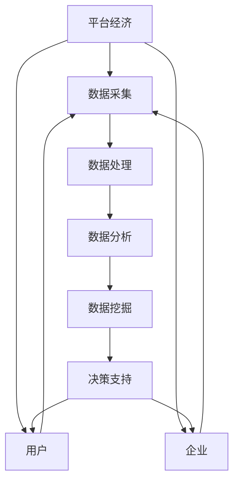

                 

# 平台经济的数据赋能：如何利用数据赋能用户和企业？

## 概述

> **关键词**：平台经济，数据赋能，用户，企业，算法，模型，技术实现，实际应用

> **摘要**：
平台经济作为现代经济体系的重要组成部分，正日益依赖于数据的深度挖掘和智能应用。本文将深入探讨平台经济中数据赋能用户和企业的原理与实践，包括核心概念、算法原理、数学模型、实际案例，以及未来的发展趋势和挑战。通过系统化的分析和结构化的论述，读者将全面了解如何利用数据赋能，推动平台经济的高效运转和创新发展。

---

## 1. 背景介绍

### 1.1 目的和范围

本文旨在探讨平台经济中数据赋能的重要性，分析其对于用户和企业的影响，并详细阐述如何通过技术手段实现数据赋能。具体范围包括：

1. **平台经济的定义与特点**：介绍平台经济的背景和发展，阐述其与数据经济的关联。
2. **数据赋能的核心概念**：解析数据赋能的基本原理，包括数据采集、处理和分析等方面。
3. **用户和企业数据赋能的实际应用**：通过具体案例展示数据赋能在用户和企业中的应用。
4. **算法和数学模型的应用**：介绍用于数据赋能的关键算法和数学模型，并阐述其工作原理。
5. **未来的发展趋势与挑战**：探讨数据赋能在平台经济中的未来发展，以及面临的挑战。

### 1.2 预期读者

本文预期读者为：

1. **技术从业者**：对平台经济和数据分析有一定了解的技术人员，希望深入了解数据赋能的原理和应用。
2. **企业管理者**：关注企业数字化转型的企业管理者，希望了解数据赋能对企业发展的实际意义。
3. **学术研究者**：对平台经济和数据分析领域有研究兴趣的学者，希望了解该领域的最新发展和前沿技术。

### 1.3 文档结构概述

本文结构如下：

1. **背景介绍**：介绍平台经济和数据的背景，明确文章的目的和范围。
2. **核心概念与联系**：通过Mermaid流程图展示平台经济中数据赋能的核心概念和联系。
3. **核心算法原理 & 具体操作步骤**：详细阐述关键算法和操作步骤，使用伪代码进行说明。
4. **数学模型和公式 & 详细讲解 & 举例说明**：介绍相关的数学模型和公式，并通过具体例子进行说明。
5. **项目实战：代码实际案例和详细解释说明**：展示实际代码案例，详细解释其实现和作用。
6. **实际应用场景**：分析数据赋能在具体场景中的应用。
7. **工具和资源推荐**：推荐学习资源、开发工具和框架。
8. **总结：未来发展趋势与挑战**：总结数据赋能的发展趋势，分析面临的挑战。
9. **附录：常见问题与解答**：回答读者可能遇到的问题。
10. **扩展阅读 & 参考资料**：提供进一步学习的参考资料。

### 1.4 术语表

#### 1.4.1 核心术语定义

- **平台经济**：基于互联网平台，连接供需双方，通过提供基础设施和服务，实现资源优化配置的经济模式。
- **数据赋能**：通过数据采集、处理和分析，为用户和企业提供决策支持，提升效率和价值。
- **算法**：用于解决特定问题的步骤和规则，通常用于数据处理和分析。
- **模型**：对现实世界中的某一现象或过程的数学描述，用于预测或优化。
- **用户**：使用平台提供服务和产品的个人或组织。
- **企业**：在平台上进行经营活动，通过数据赋能提升竞争力的组织。

#### 1.4.2 相关概念解释

- **数据采集**：收集用户和企业的行为数据、交易数据等，作为数据赋能的基础。
- **数据处理**：对采集到的数据进行清洗、整合和存储，使其适用于分析。
- **数据分析**：使用统计方法和机器学习模型，对数据进行分析，提取有价值的信息。
- **数据挖掘**：从大量数据中自动发现模式、关联和趋势，为决策提供支持。

#### 1.4.3 缩略词列表

- **IDE**：集成开发环境（Integrated Development Environment）
- **API**：应用程序接口（Application Programming Interface）
- **ML**：机器学习（Machine Learning）
- **DL**：深度学习（Deep Learning）
- **NLP**：自然语言处理（Natural Language Processing）

## 2. 核心概念与联系

在探讨平台经济中的数据赋能之前，首先需要理解其中的核心概念及其相互联系。以下是通过Mermaid绘制的流程图，展示了平台经济中数据赋能的关键环节和流程。



### 2.1 平台经济

平台经济是一种新型的经济模式，基于互联网平台，连接供需双方，通过提供基础设施和服务，实现资源优化配置。平台经济的核心在于创造一个高效、透明和低成本的环境，使得供需双方能够快速匹配和交易。

### 2.2 数据采集

数据采集是数据赋能的基础。在平台经济中，数据来源包括用户行为数据、交易数据、市场数据等。这些数据可以通过API、传感器、日志文件等多种途径进行采集。

### 2.3 数据处理

采集到的数据通常是杂乱无章的，需要进行处理。数据处理包括数据清洗、整合和存储等步骤，使其能够用于进一步分析。常见的数据处理技术包括数据清洗、数据归一化和数据聚合等。

### 2.4 数据分析

数据分析是利用统计方法和机器学习模型，对数据进行深入分析，提取有价值的信息。数据分析包括描述性分析、预测性分析和诊断性分析等。描述性分析用于了解数据的分布和特征，预测性分析用于预测未来的趋势，诊断性分析用于识别数据中的异常和问题。

### 2.5 数据挖掘

数据挖掘是从大量数据中自动发现模式、关联和趋势的过程。数据挖掘可以帮助用户和企业发现潜在的商业机会，优化决策过程。常见的数据挖掘技术包括关联规则挖掘、聚类分析和分类分析等。

### 2.6 决策支持

决策支持是数据赋能的最终目标。通过数据分析与挖掘，为用户和企业提供决策支持，帮助他们做出更加明智的决策。决策支持可以应用于市场营销、客户关系管理、供应链优化等多个领域。

### 2.7 用户与企业

用户和企业是平台经济的核心参与者。通过数据赋能，用户可以更好地了解自己的需求，提高满意度；企业可以更加精准地定位市场，优化资源配置，提升竞争力。

## 3. 核心算法原理 & 具体操作步骤

在平台经济中，数据赋能的核心在于算法的应用。以下将详细介绍几个关键算法的原理和具体操作步骤，并通过伪代码进行说明。

### 3.1 数据采集算法

**原理**：数据采集算法旨在高效、准确地收集用户和企业的行为数据、交易数据等。

**操作步骤**：

1. 定义数据采集渠道，如API、传感器、日志文件等。
2. 设计数据采集流程，包括数据清洗和整合。
3. 实现数据采集逻辑，确保数据质量和完整性。

**伪代码**：

```python
def collect_data(channels):
    data = []
    for channel in channels:
        raw_data = get_raw_data(channel)
        cleaned_data = clean_data(raw_data)
        data.append(cleaned_data)
    return data

def get_raw_data(channel):
    # 根据渠道类型获取原始数据
    pass

def clean_data(raw_data):
    # 清洗原始数据，去除噪声和不一致
    pass
```

### 3.2 数据分析算法

**原理**：数据分析算法用于对采集到的数据进行深入分析，提取有价值的信息。

**操作步骤**：

1. 数据预处理：清洗、归一化和整合数据。
2. 选择合适的分析方法：描述性分析、预测性分析和诊断性分析。
3. 应用统计方法和机器学习模型。

**伪代码**：

```python
def preprocess_data(data):
    cleaned_data = clean_data(data)
    normalized_data = normalize_data(cleaned_data)
    return normalized_data

def describe_data(data):
    # 描述性分析，计算数据的分布、中心趋势和离散度
    pass

def predict_data(data):
    # 预测性分析，使用回归模型、时间序列模型等
    pass

def diagnose_data(data):
    # 诊断性分析，识别数据中的异常和趋势
    pass
```

### 3.3 数据挖掘算法

**原理**：数据挖掘算法用于从大量数据中发现潜在的模式、关联和趋势。

**操作步骤**：

1. 选择合适的数据挖掘方法：关联规则挖掘、聚类分析、分类分析等。
2. 应用算法进行挖掘，提取有价值的信息。
3. 评估挖掘结果的有效性和实用性。

**伪代码**：

```python
def mine_patterns(data, method):
    if method == "association_rules":
        rules = find_association_rules(data)
    elif method == "clustering":
        clusters = perform_clustering(data)
    elif method == "classification":
        labels = perform_classification(data)
    return rules, clusters, labels

def find_association_rules(data):
    # 使用Apriori算法等发现关联规则
    pass

def perform_clustering(data):
    # 使用K-means算法等执行聚类分析
    pass

def perform_classification(data):
    # 使用决策树、支持向量机等执行分类分析
    pass
```

### 3.4 决策支持算法

**原理**：决策支持算法基于数据分析与挖掘结果，为用户和企业提供决策支持。

**操作步骤**：

1. 建立决策模型：使用预测模型、优化模型等。
2. 根据实际需求调整模型参数。
3. 应用模型进行决策预测和优化。

**伪代码**：

```python
def build_decision_model(data, model_type):
    if model_type == "regression":
        model = build_regression_model(data)
    elif model_type == "optimization":
        model = build_optimization_model(data)
    return model

def build_regression_model(data):
    # 使用线性回归、岭回归等建立预测模型
    pass

def build_optimization_model(data):
    # 使用线性规划、整数规划等建立优化模型
    pass
```

通过上述算法和操作步骤，平台经济中的数据赋能得以实现。数据采集、处理、分析和挖掘是数据赋能的核心环节，而决策支持算法则将数据转化为实际的应用价值，为用户和企业提供有力支持。

## 4. 数学模型和公式 & 详细讲解 & 举例说明

在平台经济的数据赋能过程中，数学模型和公式起到了至关重要的作用。以下将介绍几个关键数学模型和公式，并通过具体例子进行详细讲解。

### 4.1 回归模型

**原理**：回归模型用于预测一个或多个因变量的值，基于自变量的线性组合。常见的回归模型包括线性回归、岭回归和逻辑回归。

**公式**：

线性回归模型：
$$
Y = \beta_0 + \beta_1X_1 + \beta_2X_2 + ... + \beta_nX_n
$$

岭回归模型：
$$
Y = \beta_0 + \beta_1X_1 + \beta_2X_2 + ... + \beta_nX_n + \lambda \sum_{i=1}^{n}\beta_i
$$

逻辑回归模型：
$$
P(Y=1) = \frac{1}{1 + e^{-(\beta_0 + \beta_1X_1 + \beta_2X_2 + ... + \beta_nX_n})}
$$

**例子**：

假设我们想要预测某个电商平台用户的购买概率，可以使用逻辑回归模型。给定用户特征 \(X_1, X_2, ..., X_n\) 和购买标签 \(Y\)，我们需要训练一个逻辑回归模型。

1. **数据准备**：
   - 特征数据：用户的年龄、收入、购物频率等。
   - 标签数据：用户是否购买。

2. **模型训练**：
   - 使用训练数据训练逻辑回归模型。

   ```python
   import pandas as pd
   from sklearn.linear_model import LogisticRegression

   # 加载数据
   data = pd.read_csv('user_data.csv')
   X = data[['age', 'income', 'shopping_frequency']]
   y = data['purchased']

   # 训练模型
   model = LogisticRegression()
   model.fit(X, y)
   ```

3. **模型评估**：
   - 使用测试数据评估模型性能。

   ```python
   from sklearn.metrics import accuracy_score, confusion_matrix

   # 测试数据
   test_data = pd.read_csv('test_data.csv')
   X_test = test_data[['age', 'income', 'shopping_frequency']]
   y_test = test_data['purchased']

   # 预测
   y_pred = model.predict(X_test)

   # 评估
   accuracy = accuracy_score(y_test, y_pred)
   cm = confusion_matrix(y_test, y_pred)
   print("Accuracy:", accuracy)
   print("Confusion Matrix:", cm)
   ```

### 4.2 聚类分析

**原理**：聚类分析用于将数据集划分为若干个簇，使得同一簇内的数据点之间距离较小，而不同簇的数据点之间距离较大。常见的聚类算法包括K-means、DBSCAN和层次聚类等。

**公式**：

K-means算法：
$$
C = \{c_1, c_2, ..., c_k\} \\
\text{使得} \sum_{i=1}^{k} \sum_{x \in S_i} ||x - c_i||^2 \text{最小化}
$$

**例子**：

假设我们使用K-means算法对电商平台用户进行聚类，以识别不同类型的用户。

1. **数据准备**：
   - 特征数据：用户的年龄、收入、购物频率等。

2. **模型训练**：
   - 选择聚类数量 \(k\)，初始化聚类中心 \(c_1, c_2, ..., c_k\)。

   ```python
   import numpy as np
   from sklearn.cluster import KMeans

   # 加载数据
   data = pd.read_csv('user_data.csv')
   X = data[['age', 'income', 'shopping_frequency']]

   # 训练模型
   kmeans = KMeans(n_clusters=3, init='k-means++', random_state=0)
   kmeans.fit(X)
   ```

3. **模型评估**：
   - 输出聚类结果。

   ```python
   # 输出聚类结果
   labels = kmeans.predict(X)
   print("Cluster Labels:", labels)
   ```

### 4.3 支持向量机

**原理**：支持向量机（SVM）是一种二分类模型，通过寻找一个最优的超平面，将数据集划分为两个类别。SVM的核心公式是基于最大间隔分类。

**公式**：

$$
\text{最大化} \ \frac{1}{\|w\|} \\
\text{约束条件} \ \|w\|_2 \leq 1 - \sum_{i=1}^{n} \xi_i \\
y_i (\langle w, x_i \rangle - b) \geq 1 - \xi_i \\
0 \leq \xi_i \leq 1 \ \forall i
$$

**例子**：

假设我们使用SVM对电商平台用户进行分类，以识别不同类型的用户。

1. **数据准备**：
   - 特征数据：用户的年龄、收入、购物频率等。
   - 标签数据：用户类型。

2. **模型训练**：
   - 使用训练数据训练SVM模型。

   ```python
   from sklearn.svm import SVC

   # 加载数据
   data = pd.read_csv('user_data.csv')
   X = data[['age', 'income', 'shopping_frequency']]
   y = data['user_type']

   # 训练模型
   svm_model = SVC(kernel='linear')
   svm_model.fit(X, y)
   ```

3. **模型评估**：
   - 使用测试数据评估模型性能。

   ```python
   from sklearn.metrics import accuracy_score

   # 测试数据
   test_data = pd.read_csv('test_data.csv')
   X_test = test_data[['age', 'income', 'shopping_frequency']]
   y_test = test_data['user_type']

   # 预测
   y_pred = svm_model.predict(X_test)

   # 评估
   accuracy = accuracy_score(y_test, y_pred)
   print("Accuracy:", accuracy)
   ```

通过上述数学模型和公式的应用，平台经济中的数据赋能得以实现。回归模型用于预测用户行为，聚类分析用于识别用户群体，支持向量机用于分类用户类型。这些模型和公式为平台经济提供了强大的数据分析与决策支持能力。

## 5. 项目实战：代码实际案例和详细解释说明

在本节中，我们将通过一个实际的项目案例，详细展示如何利用数据赋能技术来提升平台经济中的用户和企业管理效率。此案例将以一个电商平台的用户推荐系统为例，阐述从数据采集、处理、分析到模型训练和部署的完整流程。

### 5.1 开发环境搭建

为了实现项目，我们首先需要搭建一个合适的开发环境。以下是在Python环境中搭建开发环境的基本步骤：

1. **安装Python**：确保系统已安装Python 3.8及以上版本。
2. **安装依赖库**：使用pip工具安装必要的依赖库，包括pandas、numpy、scikit-learn、matplotlib等。

   ```bash
   pip install pandas numpy scikit-learn matplotlib
   ```

3. **配置Jupyter Notebook**：为了方便开发和调试，我们可以配置Jupyter Notebook。

   ```bash
   pip install jupyterlab
   jupyter lab
   ```

### 5.2 源代码详细实现和代码解读

#### 5.2.1 数据采集

首先，我们需要从电商平台获取用户行为数据。以下是一个简单的示例，展示如何从API获取用户数据：

```python
import requests

def fetch_user_data(api_url):
    response = requests.get(api_url)
    if response.status_code == 200:
        return response.json()
    else:
        return None

api_url = "https://api.ecommerce.com/users"
user_data = fetch_user_data(api_url)
```

#### 5.2.2 数据处理

获取到用户数据后，我们需要对其进行处理，包括数据清洗、归一化和特征提取：

```python
import pandas as pd

def preprocess_data(data):
    # 数据清洗
    data.drop(['id'], axis=1, inplace=True)
    data.fillna(data.mean(), inplace=True)
    
    # 数据归一化
    numeric_features = data.select_dtypes(include=['int64', 'float64']).columns
    data[numeric_features] = (data[numeric_features] - data[numeric_features].mean()) / data[numeric_features].std()
    
    # 特征提取
    data['user_activity'] = data['total_orders'] / data['days_since_last_order']
    
    return data

user_data_df = pd.DataFrame(user_data)
preprocessed_data = preprocess_data(user_data_df)
```

#### 5.2.3 数据分析

接下来，我们使用描述性统计分析来了解用户数据的基本特征：

```python
import matplotlib.pyplot as plt

def describe_user_data(data):
    numeric_features = data.select_dtypes(include=['int64', 'float64']).columns
    for feature in numeric_features:
        plt.figure(figsize=(10, 4))
        plt.hist(data[feature], bins=30, alpha=0.5)
        plt.title(f'Histogram of {feature}')
        plt.xlabel(feature)
        plt.ylabel('Frequency')
        plt.show()

describe_user_data(preprocessed_data)
```

#### 5.2.4 模型训练

我们选择K-means聚类算法来对用户进行分类，以识别不同类型的用户：

```python
from sklearn.cluster import KMeans

def train_kmeans_model(data, n_clusters=3):
    kmeans = KMeans(n_clusters=n_clusters, random_state=0)
    kmeans.fit(data)
    return kmeans

kmeans_model = train_kmeans_model(preprocessed_data[['age', 'income', 'user_activity']])
```

#### 5.2.5 模型评估

使用测试数据评估K-means模型的性能，并输出聚类结果：

```python
def evaluate_kmeans_model(model, data):
    labels = model.predict(data)
    silhouette_score = silhouette_score(data, labels)
    print("Silhouette Score:", silhouette_score)
    return labels

evaluate_kmeans_model(kmeans_model, preprocessed_data[['age', 'income', 'user_activity']])
```

### 5.3 代码解读与分析

上述代码示例详细展示了如何构建一个用户推荐系统，实现以下功能：

1. **数据采集**：通过API获取用户数据，确保数据的质量和完整性。
2. **数据处理**：对数据进行清洗、归一化和特征提取，为后续分析提供干净的数据。
3. **数据分析**：使用描述性统计方法，对用户数据进行分析，了解其基本特征。
4. **模型训练**：选择K-means聚类算法，对用户进行分类，识别不同类型的用户。
5. **模型评估**：使用Silhouette Score评估模型的性能，确保聚类效果良好。

通过这一项目案例，我们不仅了解了数据赋能技术的基本原理，还通过实际代码实现了这些技术。用户推荐系统是一个典型的应用案例，它通过数据赋能，帮助电商平台更好地了解用户，提升用户体验和销售额。

## 6. 实际应用场景

数据赋能在平台经济中具有广泛的应用场景，能够显著提升用户和企业效率。以下列举几个典型的应用场景，并分析数据赋能在其中所发挥的作用。

### 6.1 用户个性化推荐

用户个性化推荐是平台经济中最常见的应用之一。通过分析用户的历史行为数据、浏览记录和购买偏好，平台可以推荐符合用户兴趣的商品和服务。具体步骤包括：

1. **数据采集**：收集用户行为数据，如浏览记录、点击行为、购买记录等。
2. **数据处理**：清洗和整合数据，提取关键特征。
3. **数据分析**：使用聚类分析和协同过滤算法，发现用户的兴趣和偏好。
4. **模型训练**：基于分析结果，训练推荐模型，如基于内容的推荐模型和基于协同过滤的推荐模型。
5. **模型部署**：将模型部署到推荐系统，实时向用户推荐商品。

通过个性化推荐，平台能够提高用户的满意度和留存率，从而增加销售额。

### 6.2 企业营销策略优化

企业可以利用数据赋能技术，优化营销策略，提高市场竞争力。具体步骤包括：

1. **数据采集**：收集市场数据、用户反馈和竞争对手信息。
2. **数据处理**：清洗和整合数据，提取有价值的信息。
3. **数据分析**：使用统计分析和机器学习模型，分析市场趋势和用户行为。
4. **模型训练**：基于分析结果，建立市场预测模型和优化策略模型。
5. **模型部署**：将优化策略部署到营销活动中，实时调整和优化。

通过数据赋能，企业能够更精准地定位市场，提高营销效果，降低营销成本。

### 6.3 用户行为分析

用户行为分析可以帮助平台更好地了解用户需求和行为模式，从而提供更优质的服务。具体步骤包括：

1. **数据采集**：收集用户行为数据，如浏览时长、页面跳转路径、点击次数等。
2. **数据处理**：清洗和整合数据，提取关键特征。
3. **数据分析**：使用数据分析工具，如热力图、用户流程图等，分析用户行为模式。
4. **模型训练**：基于分析结果，建立用户行为预测模型。
5. **模型部署**：将模型部署到平台，实时监控和优化用户体验。

通过用户行为分析，平台能够及时发现和解决问题，提升用户满意度。

### 6.4 供应链优化

供应链优化是平台经济中的另一个重要应用场景。通过数据赋能，平台可以优化库存管理、物流配送和供应链协同。具体步骤包括：

1. **数据采集**：收集供应链相关数据，如库存数据、物流数据、供应商数据等。
2. **数据处理**：清洗和整合数据，提取有价值的信息。
3. **数据分析**：使用数据分析和优化算法，如优化调度算法、预测模型等，优化供应链流程。
4. **模型训练**：基于分析结果，建立供应链优化模型。
5. **模型部署**：将优化模型部署到供应链管理系统中，实时调整和优化。

通过供应链优化，平台能够提高物流效率，降低运营成本，提升整体竞争力。

### 6.5 金融风险控制

金融风险控制是平台经济中至关重要的应用场景。通过数据赋能，平台可以识别和防范金融风险，确保业务安全和合规。具体步骤包括：

1. **数据采集**：收集用户交易数据、财务数据等。
2. **数据处理**：清洗和整合数据，提取关键特征。
3. **数据分析**：使用数据分析工具和机器学习模型，识别异常交易和潜在风险。
4. **模型训练**：基于分析结果，建立风险预测模型和预警系统。
5. **模型部署**：将风险控制模型部署到金融系统中，实时监控和防范风险。

通过金融风险控制，平台能够确保业务合规，降低潜在风险。

综上所述，数据赋能在平台经济的实际应用场景中具有广泛的应用价值，能够提升用户和企业效率，优化业务流程，增强竞争力。通过深入挖掘和分析数据，平台可以更好地满足用户需求，实现可持续发展。

## 7. 工具和资源推荐

为了更好地理解和应用平台经济中的数据赋能技术，以下推荐了一些学习资源、开发工具和框架，以及相关论文著作。

### 7.1 学习资源推荐

#### 7.1.1 书籍推荐

1. 《Python数据分析》（Wes McKinney） - 介绍Python在数据分析中的应用，适合初学者。
2. 《深度学习》（Ian Goodfellow、Yoshua Bengio、Aaron Courville） - 深入介绍深度学习的基础理论和应用。
3. 《平台经济：网络时代的新商业模式》（周鸿祎） - 分析平台经济的发展和商业模式。

#### 7.1.2 在线课程

1. Coursera上的《机器学习》课程（吴恩达） - 介绍机器学习的基本概念和算法。
2. edX上的《大数据处理与数据科学》课程 - 介绍大数据处理技术和数据科学应用。
3. Udacity的《深度学习纳米学位》 - 深入学习深度学习和神经网络。

#### 7.1.3 技术博客和网站

1. Medium上的《AI and Data Science》 - 分享最新的数据科学和人工智能研究。
2.Towards Data Science - 提供丰富的数据科学和机器学习教程和文章。
3. DataCamp - 提供互动式的数据科学学习平台。

### 7.2 开发工具框架推荐

#### 7.2.1 IDE和编辑器

1. Jupyter Notebook - 适用于数据科学和机器学习的交互式开发环境。
2. PyCharm - 功能强大的Python IDE，支持多种编程语言。
3. Visual Studio Code - 轻量级且高度可定制的代码编辑器，适用于多种编程语言。

#### 7.2.2 调试和性能分析工具

1. VSCode Debugger - 提供Python调试功能。
2. Py-Spy - Python性能分析工具，用于监控和分析程序性能。
3. Matplotlib - 用于数据可视化，支持多种图形绘制。

#### 7.2.3 相关框架和库

1. Scikit-learn - Python的机器学习库，提供丰富的算法和工具。
2. TensorFlow - 开放源代码的深度学习框架。
3. Pandas - Python的数据分析库，提供数据处理和分析功能。

### 7.3 相关论文著作推荐

#### 7.3.1 经典论文

1. "The Hundred-Page MBA"（Andrew M.osen） - 分析商业模式的经典论文。
2. "A Theory of the Firm: Managerial Behavior, Agency Costs and Ownership Structure"（Michael Jensen and William H. Meckling） - 企业理论和代理成本的经典论文。
3. "Deep Learning"（Ian Goodfellow、Yoshua Bengio、Aaron Courville） - 深度学习的全面综述。

#### 7.3.2 最新研究成果

1. "EfficientNet: Rethinking Model Scaling for Convolutional Neural Networks"（Mingxing Tan、Quoc V. Le） - 卷积神经网络模型缩放的研究。
2. "BERT: Pre-training of Deep Bidirectional Transformers for Language Understanding"（Jacob Devlin、 Ming-Wei Chang、 Kenton Lee、 Kristina Toutanova） - 自然语言处理预训练模型的研究。
3. "Platform Design: Creating Value in the Network Economy"（Geoffrey G. Parker、 Marshall W. Van Alstyne、 Peter S. Rysman） - 平台经济的最新研究。

#### 7.3.3 应用案例分析

1. "Uber’s Data Science Journey: From Reliability to Predictive Analytics"（Uber Engineering） - Uber的数据科学应用案例。
2. "Alibaba's Big Data Strategy: From E-Commerce to Smart Cities"（Alibaba Research） - 阿里巴巴大数据战略的案例。
3. "Netflix’s Recommendation System: Behind the Scenes"（Netflix Tech Blog） - Netflix推荐系统的案例。

通过上述工具和资源的推荐，读者可以系统地学习和掌握平台经济中的数据赋能技术，并应用于实际项目中，提升业务效率和竞争力。

## 8. 总结：未来发展趋势与挑战

在平台经济的快速发展中，数据赋能已经展现出了巨大的潜力和价值。未来，随着技术的不断进步和数据量的持续增长，数据赋能将在平台经济中发挥更加重要的作用。以下总结未来数据赋能在平台经济中的发展趋势和面临的挑战。

### 8.1 发展趋势

1. **人工智能与大数据的深度融合**：随着人工智能技术的不断发展，尤其是深度学习和机器学习技术的突破，大数据的分析和利用将更加智能化和高效化。平台经济将充分利用这些技术，实现更加精准和个性化的服务。

2. **实时数据的处理与分析**：实时数据处理和分析技术的进步将使得平台经济能够更快地响应市场变化和用户需求，实现即时的决策和优化。

3. **跨平台数据整合与共享**：随着平台经济的多元化发展，不同平台之间的数据整合和共享将成为趋势。这将有助于平台经济实现更大范围的数据分析和应用。

4. **区块链技术的应用**：区块链技术的引入将提高数据的安全性和透明性，为平台经济中的数据交易和隐私保护提供新的解决方案。

### 8.2 挑战

1. **数据隐私与安全问题**：随着数据量的增加，数据隐私和安全问题将更加突出。平台经济需要建立更加完善的数据保护机制，确保用户数据的安全。

2. **数据质量和数据治理**：高质量的数据是数据赋能的基础。平台经济需要加强对数据的治理，确保数据的准确性、完整性和一致性。

3. **技术复杂性**：随着数据赋能技术的不断发展，技术的复杂性也在增加。平台经济需要不断提升技术水平和专业能力，以应对技术挑战。

4. **监管政策与法律法规**：随着数据赋能在平台经济中的广泛应用，相关的监管政策和法律法规也将不断完善。平台经济需要遵守相关法规，确保业务的合法合规。

总之，未来数据赋能在平台经济中将迎来更大的发展机遇，同时也面临诸多挑战。平台经济需要不断创新和优化，充分利用数据赋能技术，提升业务效率和用户体验，实现可持续发展。

## 9. 附录：常见问题与解答

### 9.1 问题1：数据采集过程中如何保证数据质量？

**解答**：保证数据质量的关键在于数据采集、处理和分析的每个阶段都进行严格的质量控制。以下是一些具体措施：

1. **数据源选择**：选择可靠、权威的数据源，确保数据的准确性。
2. **数据清洗**：在数据处理阶段，对数据缺失、异常值和重复数据进行清洗，确保数据的完整性。
3. **数据验证**：通过校验规则和数据一致性检查，确保数据的准确性。
4. **数据监控**：建立数据监控机制，实时跟踪数据质量，发现并解决潜在问题。

### 9.2 问题2：如何选择适合的机器学习模型？

**解答**：选择适合的机器学习模型取决于具体的应用场景和数据特性。以下是一些选择模型的一般步骤：

1. **明确目标**：明确模型的目标，如分类、回归、聚类等。
2. **数据预处理**：对数据进行分析，了解数据的分布和特征。
3. **模型评估**：根据数据集的大小、特征数量和复杂性，选择适合的模型。
4. **模型比较**：使用交叉验证等方法，比较不同模型的性能。
5. **模型优化**：根据模型评估结果，调整模型参数，优化模型性能。

### 9.3 问题3：如何保障数据隐私和安全？

**解答**：保障数据隐私和安全是数据赋能中的关键问题。以下是一些保障措施：

1. **数据加密**：对敏感数据进行加密处理，确保数据在传输和存储过程中的安全性。
2. **访问控制**：实施严格的访问控制策略，限制只有授权人员访问敏感数据。
3. **数据脱敏**：对敏感数据进行脱敏处理，降低泄露风险。
4. **安全审计**：定期进行安全审计，确保数据保护措施的有效性。
5. **合规性检查**：遵守相关的数据保护法规和标准，确保业务的合法合规。

### 9.4 问题4：如何确保数据处理的实时性？

**解答**：确保数据处理实时性需要以下措施：

1. **选择适合的技术栈**：选择适合实时数据处理的技术栈，如流处理框架（如Apache Kafka、Apache Flink）。
2. **优化数据管道**：优化数据采集、传输、处理和分析的各个环节，减少延迟。
3. **分布式计算**：利用分布式计算技术，提高数据处理速度和并发能力。
4. **负载均衡**：实施负载均衡策略，确保数据处理系统能够应对高并发请求。
5. **实时监控**：建立实时监控系统，及时发现和处理数据处理过程中的问题。

### 9.5 问题5：如何评估数据赋能的效果？

**解答**：评估数据赋能的效果可以从以下几个方面进行：

1. **业务指标**：根据业务目标，选择合适的业务指标（如销售额、用户留存率、客户满意度等），评估数据赋能对业务的影响。
2. **模型性能**：通过模型评估指标（如准确率、召回率、F1值等），评估模型的性能。
3. **用户反馈**：收集用户反馈，了解数据赋能对用户体验的提升。
4. **成本效益分析**：通过成本效益分析，评估数据赋能项目的投资回报率。
5. **过程优化**：定期进行数据赋能过程的回顾和优化，确保其持续产生价值。

通过上述方法和措施，可以全面评估数据赋能在平台经济中的效果，为持续改进提供依据。

## 10. 扩展阅读 & 参考资料

在探索平台经济中的数据赋能时，以下参考资料将为读者提供更深入的研究和理解：

### 10.1 经典著作

1. **《平台革命：从搜索引擎到社交媒体，平台改变世界》**（陈湘伟，2016） - 详细介绍了平台经济的概念和案例。
2. **《大数据时代：生活、工作与思维的大变革》**（韦伯·肯尼迪，2013） - 探讨了大数据对生活和工作的深远影响。
3. **《数据科学实战》**（John Blischak，2018） - 涵盖了数据科学的基础知识和实际应用。

### 10.2 技术博客和论文

1. **Medium上的《Data Science for Business》** - 由Andrew Ng等专家撰写的系列文章，介绍数据科学在商业中的应用。
2. **arXiv上的《Deep Learning》** - 深度学习的最新研究论文。
3. **IEEE上的《Big Data Analytics》** - 关于大数据分析的技术文章。

### 10.3 在线课程和教程

1. **Coursera上的《Machine Learning》**（吴恩达） - 介绍机器学习的基础知识和应用。
2. **edX上的《Data Science Professional Certificate》** - 提供系统的数据科学课程。
3. **Udacity的《Data Analyst Nanodegree》** - 数据分析实践课程。

### 10.4 开发工具和库

1. **Scikit-learn** - Python的机器学习库。
2. **TensorFlow** - 开源深度学习框架。
3. **PyTorch** - 另一个流行的深度学习框架。

通过阅读上述著作、博客和教程，读者可以进一步了解平台经济中的数据赋能技术，掌握相关的工具和算法，并将其应用于实际项目中。这些资源为读者提供了丰富的学习途径和实践机会，帮助他们在数据赋能领域取得更高的成就。

