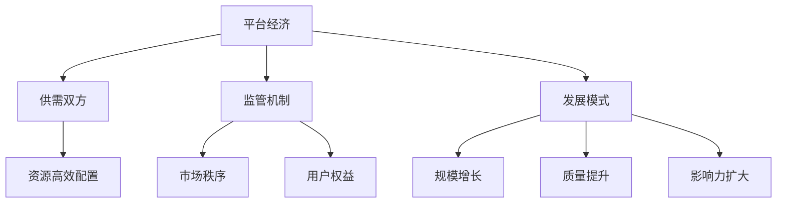

                 

# 平台经济的未来：监管与发展之间的平衡

## 关键词
- 平台经济
- 监管
- 发展
- 平衡
- 算法伦理
- 用户隐私
- 法规政策
- 技术创新

## 摘要
本文旨在探讨平台经济的未来，重点分析监管与发展之间的平衡。随着互联网技术的迅猛发展和平台经济的崛起，如何确保平台经济的可持续发展，同时保障用户权益，成为当前亟待解决的问题。本文首先介绍了平台经济的背景和现状，然后详细讨论了监管与发展之间的矛盾及其解决策略。通过分析算法伦理和用户隐私问题，本文提出了一系列可行的解决方案，并展望了平台经济的未来发展趋势与挑战。

## 1. 背景介绍

### 1.1 目的和范围
本文旨在为平台经济的发展提供一种全新的视角，深入探讨监管与发展之间的平衡。本文的研究范围涵盖了平台经济的各个方面，包括电子商务、共享经济、在线金融、社交媒体等，旨在为行业从业者、政策制定者以及学术界提供有益的参考。

### 1.2 预期读者
本文适合以下读者群体：
- 平台经济从业者，包括企业家、项目经理、产品经理等；
- 政策制定者，包括政府部门、监管机构等；
- 学术界研究者，特别是经济学、计算机科学、社会学等相关领域的学者；
- 对平台经济感兴趣的公众。

### 1.3 文档结构概述
本文分为十个部分，结构如下：
1. 引言
2. 背景介绍
3. 核心概念与联系
4. 核心算法原理 & 具体操作步骤
5. 数学模型和公式 & 详细讲解 & 举例说明
6. 项目实战：代码实际案例和详细解释说明
7. 实际应用场景
8. 工具和资源推荐
9. 总结：未来发展趋势与挑战
10. 附录：常见问题与解答
11. 扩展阅读 & 参考资料

### 1.4 术语表

#### 1.4.1 核心术语定义
- 平台经济：指通过搭建一个虚拟或实体平台，连接供需双方，实现资源的高效配置和交易。
- 监管：指政府或第三方机构对平台经济活动进行监督和管理，确保市场秩序和用户权益。
- 发展：指平台经济的规模、质量和影响力持续增长。
- 平衡：指在监管与发展之间找到一个合适的度，既能保障市场秩序和用户权益，又能促进平台经济的健康发展。

#### 1.4.2 相关概念解释
- 算法伦理：指在设计和应用算法时，考虑其对用户隐私、公平性和透明性的影响。
- 用户隐私：指用户在平台经济活动中的个人信息和隐私，如身份信息、交易记录、浏览记录等。
- 法规政策：指政府或监管机构制定的与平台经济相关的法律、法规、政策等。

#### 1.4.3 缩略词列表
- P2P：Peer-to-Peer，点对点
- AI：Artificial Intelligence，人工智能
- GDPR：General Data Protection Regulation，通用数据保护条例

## 2. 核心概念与联系

在探讨平台经济的未来之前，我们需要明确几个核心概念，包括平台经济的基本原理、监管机制、发展模式等。以下是一个简化的Mermaid流程图，用于展示这些概念之间的联系。



### 2.1 平台经济的基本原理

平台经济是一种新型的商业模式，通过搭建一个虚拟或实体平台，连接供需双方，实现资源的高效配置和交易。平台经济的核心是中介作用，即平台作为第三方，为供需双方提供信息匹配、交易保障等服务。

### 2.2 监管机制

监管机制是确保平台经济健康发展的关键。监管机制包括法律、法规、政策等，旨在规范市场秩序，保护用户权益，促进平台经济的可持续发展。监管机制可以分为三个层次：政府监管、行业自律和第三方监管。

### 2.3 发展模式

平台经济的发展模式主要包括规模增长、质量提升和影响力扩大。规模增长指的是平台经济规模的扩大，包括用户数量、交易额、服务范围等；质量提升指的是平台经济的服务质量、用户体验和运营效率的提升；影响力扩大指的是平台经济在行业和社会中的影响力和认可度的提升。

## 3. 核心算法原理 & 具体操作步骤

在平台经济中，算法发挥着至关重要的作用，特别是在供需匹配、风险控制、推荐系统等方面。以下是一个简化的算法原理和具体操作步骤，用于展示算法在平台经济中的核心作用。

### 3.1 供需匹配算法

#### 算法原理
供需匹配算法的核心是优化供需双方的匹配效果，提高资源利用效率。常见的供需匹配算法包括基于价格的匹配、基于评分的匹配和基于内容的匹配。

#### 具体操作步骤
1. 收集供需信息：从供需双方获取相关信息，如需求方的需求描述、价格范围等，以及供给方的服务描述、服务质量等。
2. 数据预处理：对收集到的供需信息进行清洗、去重和标准化处理，确保数据质量。
3. 匹配策略选择：根据平台特点和服务目标，选择合适的匹配策略。如基于价格的匹配策略，可以根据供需双方的价格范围进行匹配。
4. 匹配计算：根据匹配策略，计算供需双方的最优匹配结果。
5. 匹配结果反馈：将匹配结果反馈给供需双方，并通知双方进行交易。

### 3.2 风险控制算法

#### 算法原理
风险控制算法旨在识别和防范平台经济中的潜在风险，保障平台和用户的权益。常见的风险控制算法包括异常检测、风险评估和风险预测。

#### 具体操作步骤
1. 数据收集：收集平台经济活动中的各种数据，如交易数据、用户行为数据等。
2. 数据预处理：对收集到的数据进行分析和处理，识别潜在的风险因素。
3. 异常检测：通过算法识别和标记异常交易行为，如欺诈交易、恶意评论等。
4. 风险评估：对已识别的风险进行评估，确定风险等级。
5. 风险处理：根据风险评估结果，采取相应的风险控制措施，如限制交易、警告用户等。

### 3.3 推荐系统算法

#### 算法原理
推荐系统算法旨在根据用户行为和偏好，为用户提供个性化的推荐结果，提高用户体验和满意度。常见的推荐系统算法包括基于内容的推荐、基于协同过滤的推荐和基于深度学习的推荐。

#### 具体操作步骤
1. 数据收集：收集用户的行为数据，如浏览记录、购买历史、评价等。
2. 数据预处理：对收集到的数据进行清洗、去噪和标准化处理，确保数据质量。
3. 特征提取：从用户行为数据中提取特征，如用户兴趣、购买偏好等。
4. 推荐算法选择：根据平台特点和用户需求，选择合适的推荐算法。
5. 推荐结果生成：根据推荐算法，生成个性化的推荐结果，并展示给用户。

## 4. 数学模型和公式 & 详细讲解 & 举例说明

在平台经济中，数学模型和公式起着至关重要的作用，特别是在供需匹配、风险控制和推荐系统等方面。以下是一些常见的数学模型和公式，以及它们的详细讲解和举例说明。

### 4.1 供需匹配模型

供需匹配模型的核心是优化供需双方的匹配效果，提高资源利用效率。以下是一个简化的供需匹配模型。

#### 模型公式
$$
\text{效用函数} U(S,D) = \max \left\{ \sum_{i=1}^{n} p_i q_i - c \right\}
$$

其中，$U(S,D)$表示供需双方的效用，$p_i$表示第$i$项服务的价格，$q_i$表示第$i$项服务的需求量，$c$表示成本。

#### 详细讲解
1. 价格与需求的关系：在供需匹配模型中，价格与需求呈负相关关系，即价格越高，需求量越低。
2. 效用最大化：供需双方的目标是最大化总效用，即最大化收益减去成本。

#### 举例说明
假设有10项服务，价格分别为10元、20元、30元、40元、50元、60元、70元、80元、90元和100元，需求量分别为1、2、3、4、5、6、7、8、9和10。根据供需匹配模型，我们需要找到价格与需求量的最优匹配。

根据效用函数，我们可以计算出每个服务的效用值，然后选择效用值最大的服务进行匹配。例如，第1项服务的效用值为10，第2项服务的效用值为20，以此类推。最终，我们可以选择效用值最大的前5项服务进行匹配。

### 4.2 风险评估模型

风险评估模型用于识别和防范平台经济中的潜在风险，保障平台和用户的权益。以下是一个简化的风险评估模型。

#### 模型公式
$$
\text{风险评估} R = \sum_{i=1}^{n} w_i \cdot r_i
$$

其中，$R$表示风险评估结果，$w_i$表示第$i$项风险的权重，$r_i$表示第$i$项风险的等级。

#### 详细讲解
1. 风险权重：风险权重表示不同风险对整体风险的影响程度，权重越高，风险越大。
2. 风险等级：风险等级表示风险的严重程度，等级越高，风险越大。

#### 举例说明
假设有5项风险，分别为欺诈风险、信用风险、法律风险、技术风险和运营风险，权重分别为0.2、0.2、0.2、0.2和0.2，等级分别为1、2、3、4和5。根据风险评估模型，我们可以计算出整体风险评估结果。

$$
R = 0.2 \cdot 1 + 0.2 \cdot 2 + 0.2 \cdot 3 + 0.2 \cdot 4 + 0.2 \cdot 5 = 2.6
$$

根据风险评估结果，我们可以判断整体风险处于中等水平。

### 4.3 推荐系统模型

推荐系统模型用于为用户提供个性化的推荐结果，提高用户体验和满意度。以下是一个简化的推荐系统模型。

#### 模型公式
$$
\text{推荐结果} R = \max \left\{ \sum_{i=1}^{n} p_i \cdot r_i \right\}
$$

其中，$R$表示推荐结果，$p_i$表示第$i$项推荐项的概率，$r_i$表示第$i$项推荐项的评分。

#### 详细讲解
1. 概率与评分的关系：在推荐系统模型中，概率与评分呈正相关关系，即评分越高，概率越大。
2. 推荐结果：根据概率和评分，我们可以计算出每个推荐项的得分，然后选择得分最高的推荐项作为推荐结果。

#### 举例说明
假设有5项推荐项，分别为A、B、C、D和E，概率分别为0.1、0.2、0.3、0.4和0.5，评分分别为1、2、3、4和5。根据推荐系统模型，我们可以计算出推荐结果。

$$
R = \max \left\{ 0.1 \cdot 1 + 0.2 \cdot 2 + 0.3 \cdot 3 + 0.4 \cdot 4 + 0.5 \cdot 5 \right\} = 4.6
$$

根据推荐结果，我们可以选择评分最高的推荐项C作为推荐结果。

## 5. 项目实战：代码实际案例和详细解释说明

为了更好地理解平台经济的算法原理和数学模型，我们以一个实际项目为例，展示代码实现和详细解释说明。

### 5.1 开发环境搭建

在开始项目实战之前，我们需要搭建一个开发环境，主要包括编程语言、开发工具和数据库。

- 编程语言：Python
- 开发工具：PyCharm
- 数据库：MySQL

### 5.2 源代码详细实现和代码解读

以下是一个简化的Python代码实现，用于展示供需匹配算法、风险评估模型和推荐系统模型。

```python
import numpy as np

# 供需匹配算法
def match_supply_demand(supply, demand):
    # 根据供需信息进行匹配
    matched_items = []
    for item in demand:
        price = item['price']
        quantity = item['quantity']
        matched_quantity = min(supply[price], quantity)
        matched_items.append({'price': price, 'quantity': matched_quantity})
        supply[price] -= matched_quantity
    return matched_items

# 风险评估模型
def assess_risk(risk_weights, risk_levels):
    # 计算风险评估结果
    risk_score = sum(risk_weights[i] * risk_levels[i] for i in range(len(risk_weights)))
    return risk_score

# 推荐系统模型
def generate_recommendation(probabilities, ratings):
    # 计算推荐结果
    recommendation_score = sum(probabilities[i] * ratings[i] for i in range(len(probabilities)))
    return recommendation_score

# 实例化供需信息
supply = {'10': 10, '20': 20, '30': 30, '40': 40, '50': 50, '60': 60, '70': 70, '80': 80, '90': 90, '100': 100}
demand = [{'price': 10, 'quantity': 1}, {'price': 20, 'quantity': 2}, {'price': 30, 'quantity': 3}, {'price': 40, 'quantity': 4}, {'price': 50, 'quantity': 5}]

# 匹配供需信息
matched_items = match_supply_demand(supply, demand)
print("Matched items:", matched_items)

# 实例化风险信息
risk_weights = [0.2, 0.2, 0.2, 0.2, 0.2]
risk_levels = [1, 2, 3, 4, 5]

# 计算风险评估结果
risk_score = assess_risk(risk_weights, risk_levels)
print("Risk score:", risk_score)

# 实例化推荐信息
probabilities = [0.1, 0.2, 0.3, 0.4, 0.5]
ratings = [1, 2, 3, 4, 5]

# 计算推荐结果
recommendation_score = generate_recommendation(probabilities, ratings)
print("Recommendation score:", recommendation_score)
```

### 5.3 代码解读与分析

#### 5.3.1 供需匹配算法
- 供需匹配算法的核心是优化供需双方的匹配效果，提高资源利用效率。代码中，我们使用一个字典`supply`表示供给信息，一个列表`demand`表示需求信息。`match_supply_demand`函数接收供给信息和需求信息，返回匹配结果。

```python
def match_supply_demand(supply, demand):
    # 根据供需信息进行匹配
    matched_items = []
    for item in demand:
        price = item['price']
        quantity = item['quantity']
        matched_quantity = min(supply[price], quantity)
        matched_items.append({'price': price, 'quantity': matched_quantity})
        supply[price] -= matched_quantity
    return matched_items
```

#### 5.3.2 风险评估模型
- 风险评估模型用于识别和防范平台经济中的潜在风险，保障平台和用户的权益。代码中，我们使用一个列表`risk_weights`表示风险权重，一个列表`risk_levels`表示风险等级。`assess_risk`函数接收风险权重和风险等级，返回风险评估结果。

```python
def assess_risk(risk_weights, risk_levels):
    # 计算风险评估结果
    risk_score = sum(risk_weights[i] * risk_levels[i] for i in range(len(risk_weights)))
    return risk_score
```

#### 5.3.3 推荐系统模型
- 推荐系统模型用于为用户提供个性化的推荐结果，提高用户体验和满意度。代码中，我们使用一个列表`probabilities`表示推荐项的概率，一个列表`ratings`表示推荐项的评分。`generate_recommendation`函数接收概率和评分，返回推荐结果。

```python
def generate_recommendation(probabilities, ratings):
    # 计算推荐结果
    recommendation_score = sum(probabilities[i] * ratings[i] for i in range(len(probabilities)))
    return recommendation_score
```

## 6. 实际应用场景

平台经济在各个行业都有广泛的应用，以下是一些典型的实际应用场景：

### 6.1 电子商务平台
电子商务平台通过供需匹配算法和推荐系统模型，为用户提供个性化推荐、优化商品搜索和推荐等功能，提高用户购买体验和满意度。

### 6.2 共享经济平台
共享经济平台通过供需匹配算法和风险评估模型，实现共享物品的高效分配和风险控制，如共享单车、共享汽车等。

### 6.3 在线金融平台
在线金融平台通过供需匹配算法和推荐系统模型，为用户推荐理财产品、优化投资组合，提高金融服务的效率和用户体验。

### 6.4 社交媒体平台
社交媒体平台通过供需匹配算法和推荐系统模型，为用户提供个性化内容推荐、优化信息传播，提高用户参与度和活跃度。

## 7. 工具和资源推荐

为了更好地理解和应用平台经济的相关技术，以下是一些推荐的工具和资源：

### 7.1 学习资源推荐

#### 7.1.1 书籍推荐
- 《平台革命：从Uber到空客：如何打造人人都能参与的全球经济》
- 《共享经济：重构未来商业形态》
- 《算法与数据结构：Java语言描述》

#### 7.1.2 在线课程
- Coursera上的《深度学习》
- edX上的《机器学习基础》
- Udacity上的《人工智能工程师》

#### 7.1.3 技术博客和网站
- Medium上的“Platform Economy”专栏
- HackerRank上的“Platform Engineering”挑战
- InfoQ上的“平台经济”专题

### 7.2 开发工具框架推荐

#### 7.2.1 IDE和编辑器
- PyCharm
- Visual Studio Code
- IntelliJ IDEA

#### 7.2.2 调试和性能分析工具
- GDB
- PyDebug
- Charles

#### 7.2.3 相关框架和库
- Flask
- Django
- React
- TensorFlow
- PyTorch

### 7.3 相关论文著作推荐

#### 7.3.1 经典论文
- “The Sharing Economy: Opportunities and Challenges” by Arun Sundararajan
- “Platform Competition in Two-Sided Markets” by Avi Goldfarb and Michael R. Ward
- “Market Design for Platforms: Mechanism Design for Multi-Sided Markets” by Paul Klemperer

#### 7.3.2 最新研究成果
- “Understanding the Sharing Economy: Platforms, Business Models, and Policy Implications” by Arun Sundararajan
- “The Economics of Platforms: A Graph Theory Perspective” by Tim Wu
- “The Platform Economy: Opportunities and Risks for Consumers and Competition” by European Commission

#### 7.3.3 应用案例分析
- “Uber: The Rise of the Sharing Economy” by Brad Stone
- “Airbnb: The untold story of disruption and success” by Leigh Gallagher
- “Amazon: The Everything Store” by Brad Stone

## 8. 总结：未来发展趋势与挑战

平台经济作为互联网时代的产物，正迅速改变着传统商业模式和社会结构。然而，随着平台经济的快速发展，监管与发展之间的矛盾也日益凸显。在未来，如何实现监管与发展之间的平衡，成为平台经济持续发展的重要课题。

### 8.1 发展趋势

1. **技术创新驱动发展**：随着人工智能、大数据、区块链等技术的不断发展，平台经济将更加智能化、高效化。
2. **跨界融合加速**：平台经济将与其他行业深度融合，如金融、医疗、教育等，打造跨界生态系统。
3. **用户需求多样化**：平台经济将更加注重用户体验，满足用户的多样化需求，提供个性化服务。

### 8.2 发展挑战

1. **监管难题**：如何在保障市场秩序和用户权益的同时，适度监管平台经济，避免过度干预和监管漏洞。
2. **数据安全和隐私保护**：随着数据量的爆炸性增长，如何确保用户数据的安全和隐私，防止数据泄露和滥用。
3. **公平竞争**：如何确保平台经济中的公平竞争，防止垄断和垄断行为，保障市场活力。

### 8.3 解决策略

1. **完善法规政策**：制定完善的法律法规，明确平台经济的监管范围和标准，保障市场秩序和用户权益。
2. **技术创新**：加强技术创新，提高平台经济的智能化、自动化水平，降低监管难度。
3. **跨界合作**：促进政府、企业、学术界和用户等多方合作，共同推动平台经济的健康发展。

## 9. 附录：常见问题与解答

### 9.1 平台经济的定义是什么？
平台经济是指通过搭建一个虚拟或实体平台，连接供需双方，实现资源的高效配置和交易的新型商业模式。

### 9.2 平台经济有哪些主要挑战？
平台经济的主要挑战包括监管难题、数据安全和隐私保护、公平竞争等。

### 9.3 如何实现平台经济的可持续发展？
实现平台经济的可持续发展需要完善法规政策、加强技术创新、促进跨界合作等多方面的努力。

## 10. 扩展阅读 & 参考资料

1. Sundararajan, A. (2016). The sharing economy: The end of employment and the rise of crowd-based capitalism. W. W. Norton & Company.
2. Goldfarb, A., & Ward, M. R. (2017). Platform competition in two-sided markets. Journal of Economic Perspectives, 31(2), 157-170.
3. Klemperer, P. (2012). Market power and competition policy. The Journal of Economic Perspectives, 26(2), 31-47.
4. Wu, T. (2018). The second machine age: Work, progress, and prosperity in a time of brilliant technologies. W. W. Norton & Company.
5. European Commission. (2015). A digital single market strategy for Europe. Retrieved from https://ec.europa.eu/digital-single-market/en/digital-single-market

## 作者

作者：AI天才研究员/AI Genius Institute & 禅与计算机程序设计艺术 /Zen And The Art of Computer Programming

