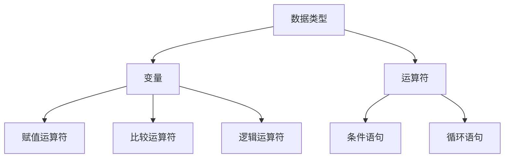
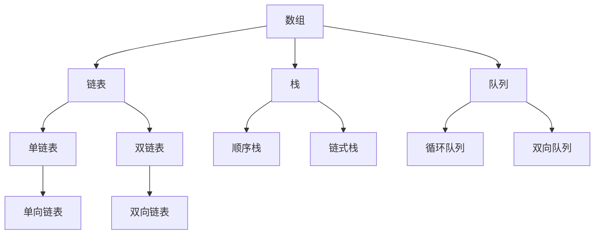
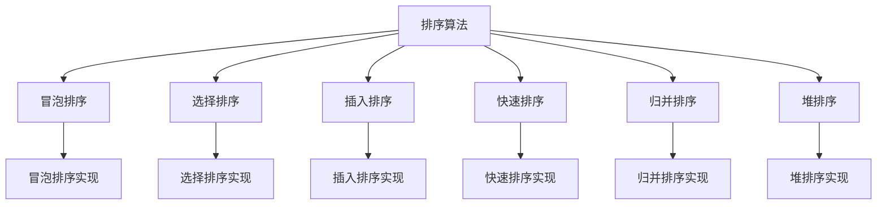
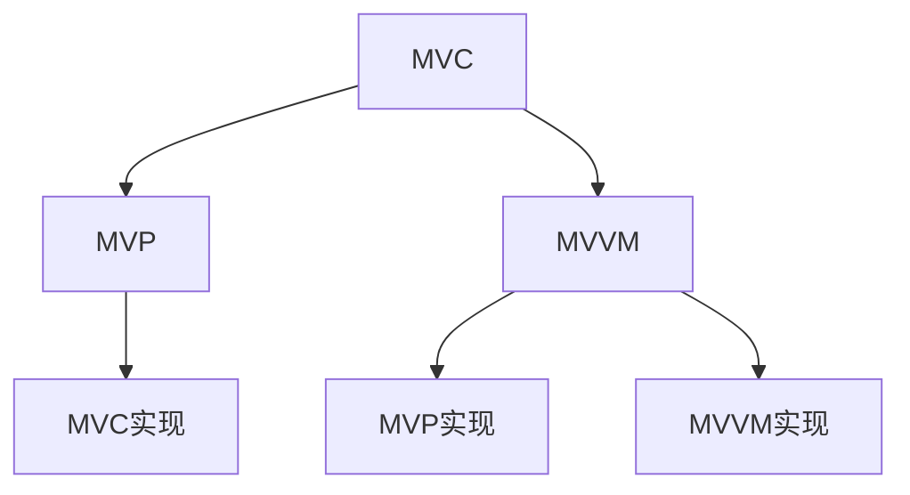
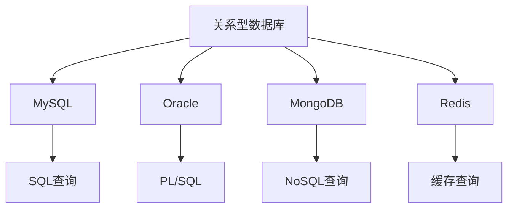

                 

# 2024年京东社招技术面试题集锦

> 关键词：京东，社招，技术面试，问题集锦，编程，算法，数据结构，系统设计，数据库

> 摘要：本文将深入解析2024年京东社招技术面试中可能出现的高频问题，涵盖编程基础、数据结构、算法原理、系统设计、数据库等领域。通过详细的解题思路、代码实现和分析，帮助读者更好地应对技术面试挑战。

## 1. 背景介绍

### 1.1 目的和范围

本文旨在为准备参加2024年京东社招技术面试的求职者提供一份全面的技术面试题集锦。文章将围绕京东社招技术面试的常见问题，结合实际案例和详细解析，帮助读者深入了解各个技术领域的核心知识。

### 1.2 预期读者

- 准备参加2024年京东社招技术面试的求职者
- 对编程、算法、数据结构、系统设计和数据库等技术领域感兴趣的读者
- 想要提高技术面试能力的工程师

### 1.3 文档结构概述

本文将按照以下结构展开：

- 第1章：背景介绍，包括本文的目的、预期读者和文档结构概述
- 第2章：核心概念与联系，介绍相关技术领域的核心概念和原理
- 第3章：核心算法原理 & 具体操作步骤，详细讲解常见算法的原理和操作步骤
- 第4章：数学模型和公式 & 详细讲解 & 举例说明，阐述相关数学模型和公式的应用
- 第5章：项目实战：代码实际案例和详细解释说明，提供实际项目的代码实现和分析
- 第6章：实际应用场景，探讨技术在实际项目中的应用
- 第7章：工具和资源推荐，介绍相关学习资源、开发工具和框架
- 第8章：总结：未来发展趋势与挑战，展望技术领域的发展趋势和面临的挑战
- 第9章：附录：常见问题与解答，汇总常见面试问题的解答
- 第10章：扩展阅读 & 参考资料，提供更多相关学习资源和资料

### 1.4 术语表

#### 1.4.1 核心术语定义

- 社招：社会招聘，指公司在社会上公开招聘人才
- 技术面试：针对应聘者的技术能力和专业知识进行的面试
- 编程：编写计算机程序的过程
- 数据结构：计算机存储、组织数据的方式
- 算法：解决问题的方法或步骤
- 系统设计：设计和实现计算机系统的过程
- 数据库：存储、管理和查询数据的系统

#### 1.4.2 相关概念解释

- 面向对象编程（OOP）：一种编程范式，通过对象和类来组织代码
- 链表：一种线性数据结构，由节点组成，每个节点包含数据和指向下一个节点的指针
- 动态规划：一种解决最优化问题的算法设计技术
- 排序算法：对数据进行排序的一系列算法

#### 1.4.3 缩略词列表

- OOP：面向对象编程
- JDK：Java开发工具包
- SQL：结构化查询语言
- CRUD：创建、读取、更新、删除
- IDE：集成开发环境

## 2. 核心概念与联系

### 2.1 编程基础

编程基础是技术面试的重要环节，包括数据类型、变量、运算符、流程控制等。以下是一个Mermaid流程图，展示编程基础的核心概念和联系。



### 2.2 数据结构

数据结构是计算机存储、组织数据的方式，常见的有数组、链表、栈、队列、树等。以下是一个Mermaid流程图，展示数据结构的核心概念和联系。



### 2.3 算法原理

算法是一系列解决问题的步骤。常见的算法原理包括排序算法、搜索算法、图算法等。以下是一个Mermaid流程图，展示算法原理的核心概念和联系。



### 2.4 系统设计

系统设计是计算机系统的规划和实现过程。常见的系统设计模式包括MVC、MVP、MVVM等。以下是一个Mermaid流程图，展示系统设计模式的核心概念和联系。



### 2.5 数据库

数据库是存储、管理和查询数据的系统。常见的数据库类型包括关系型数据库和非关系型数据库。以下是一个Mermaid流程图，展示数据库的核心概念和联系。



## 3. 核心算法原理 & 具体操作步骤

### 3.1 排序算法

排序算法是技术面试中常见的高频问题。以下是几种常见的排序算法的原理和具体操作步骤。

#### 3.1.1 冒泡排序

冒泡排序是一种简单的排序算法，通过反复交换相邻的未排序元素，将最大元素逐步“冒泡”到数组的末尾。

**算法原理：**

- 从数组的第一个元素开始，比较相邻的两个元素，如果第一个比第二个大，则交换它们的位置。
- 继续遍历数组，重复上述步骤，直到整个数组有序。

**具体操作步骤：**

1. 初始化一个布尔变量 `swapped` 为 `true`。
2. 从第一个元素开始遍历数组，直到最后一个元素。
3. 对于每个元素，比较它和前一个元素的值，如果前一个元素比当前元素大，则交换它们的位置。
4. 如果在遍历过程中没有进行交换，则数组已排序，退出循环。
5. 重复步骤 2-4，直到整个数组有序。

**伪代码：**

```python
def bubbleSort(arr):
    n = len(arr)
    swapped = true
    while swapped:
        swapped = false
        for i in range(0, n-1):
            if arr[i] > arr[i+1]:
                arr[i], arr[i+1] = arr[i+1], arr[i]
                swapped = true
        n -= 1
```

#### 3.1.2 选择排序

选择排序是一种简单的排序算法，通过重复选择未排序数组中的最小元素，将其放到已排序数组的末尾。

**算法原理：**

- 首先，找到未排序数组中的最小元素，将其与第一个元素交换。
- 然后，在剩下的未排序数组中继续执行上述步骤，直到整个数组有序。

**具体操作步骤：**

1. 初始化两个变量 `min_idx` 和 `n`，分别表示最小元素的索引和未排序数组的长度。
2. 从第一个元素开始遍历未排序数组，找到最小元素的索引。
3. 将最小元素与第一个元素交换。
4. 将未排序数组的长度减 1。
5. 重复步骤 2-4，直到未排序数组的长度为 1。

**伪代码：**

```python
def selectionSort(arr):
    n = len(arr)
    for i in range(n-1):
        min_idx = i
        for j in range(i+1, n):
            if arr[j] < arr[min_idx]:
                min_idx = j
        arr[i], arr[min_idx] = arr[min_idx], arr[i]
```

#### 3.1.3 插入排序

插入排序是一种简单的排序算法，通过反复将未排序数组中的元素插入到已排序数组的适当位置，使整个数组有序。

**算法原理：**

- 首先，将第一个元素视为已排序数组。
- 然后，将未排序数组中的每个元素与已排序数组中的元素进行比较，将其插入到适当的位置。

**具体操作步骤：**

1. 初始化一个已排序数组 `sorted`，仅包含第一个元素。
2. 从第二个元素开始遍历未排序数组。
3. 对于每个元素，将其与已排序数组中的元素进行比较，找到适当的位置。
4. 将该元素插入到已排序数组中。
5. 重复步骤 2-4，直到未排序数组的长度为 0。

**伪代码：**

```python
def insertionSort(arr):
    n = len(arr)
    sorted = [arr[0]]
    for i in range(1, n):
        key = arr[i]
        j = len(sorted) - 1
        while j >= 0 and sorted[j] > key:
            sorted[j + 1] = sorted[j]
            j -= 1
        sorted[j + 1] = key
    return sorted
```

### 3.2 搜索算法

搜索算法是技术面试中的另一个重要领域。以下介绍几种常见的搜索算法。

#### 3.2.1 顺序搜索

顺序搜索是一种简单且直观的搜索算法，逐个比较数组中的每个元素，直到找到目标元素或到达数组末尾。

**算法原理：**

- 从数组的第一个元素开始，逐个比较每个元素，直到找到目标元素或到达数组末尾。

**具体操作步骤：**

1. 初始化一个变量 `found` 为 `false`。
2. 从数组的第一个元素开始，逐个比较每个元素，与目标元素进行比较。
3. 如果找到目标元素，将 `found` 设置为 `true`。
4. 如果到达数组末尾，仍未找到目标元素，则返回 `false`。

**伪代码：**

```python
def sequentialSearch(arr, target):
    found = false
    for element in arr:
        if element == target:
            found = true
            break
    return found
```

#### 3.2.2 二分搜索

二分搜索是一种高效的搜索算法，适用于有序数组。它通过反复将数组分为两半，逐步缩小搜索范围，直到找到目标元素或确定目标元素不存在。

**算法原理：**

- 首先，确定中间元素，将其与目标元素进行比较。
- 如果中间元素等于目标元素，则搜索成功。
- 如果中间元素大于目标元素，则在左半部分继续搜索。
- 如果中间元素小于目标元素，则在右半部分继续搜索。

**具体操作步骤：**

1. 初始化两个变量 `low` 和 `high`，分别表示搜索范围的起始和结束索引。
2. 当 `low` 小于等于 `high` 时，继续执行以下步骤：
   - 计算中间索引 `mid`，即 `(low + high) / 2`。
   - 如果 `arr[mid]` 等于目标元素，则搜索成功，返回 `mid`。
   - 如果 `arr[mid]` 大于目标元素，则在左半部分继续搜索，更新 `high` 为 `mid - 1`。
   - 如果 `arr[mid]` 小于目标元素，则在右半部分继续搜索，更新 `low` 为 `mid + 1`。
3. 如果未找到目标元素，返回 `-1`。

**伪代码：**

```python
def binarySearch(arr, target):
    low = 0
    high = len(arr) - 1
    while low <= high:
        mid = (low + high) // 2
        if arr[mid] == target:
            return mid
        elif arr[mid] > target:
            high = mid - 1
        else:
            low = mid + 1
    return -1
```

### 3.3 图算法

图算法是技术面试中的另一个重要领域。以下介绍几种常见的图算法。

#### 3.3.1 深度优先搜索（DFS）

深度优先搜索是一种用于遍历和搜索图的算法，从起点开始，尽可能深入地探索路径，直到找到一个目标节点或遍历整个图。

**算法原理：**

- 从起点开始，递归地访问相邻的未访问节点，直到找到目标节点或遍历整个图。

**具体操作步骤：**

1. 初始化一个布尔数组 `visited`，用于记录已访问的节点。
2. 定义一个递归函数 `dfs`，用于遍历图：
   - 对于每个未访问的节点 `node`，标记为已访问。
   - 对于每个相邻的未访问节点 `neighbor`，递归调用 `dfs`。
3. 调用 `dfs` 函数，从起点开始遍历。

**伪代码：**

```python
def dfs(graph, start, target):
    visited = [false] * len(graph)
    def dfs_helper(node):
        visited[node] = true
        if node == target:
            return true
        for neighbor in graph[node]:
            if not visited[neighbor]:
                dfs_helper(neighbor)
        return false
    return dfs_helper(start)

def dfs(graph, start):
    visited = [false] * len(graph)
    def dfs_helper(node):
        visited[node] = true
        for neighbor in graph[node]:
            if not visited[neighbor]:
                dfs_helper(neighbor)
    dfs_helper(start)

# 使用示例
graph = {
    0: [1, 2],
    1: [2],
    2: [0, 3],
    3: [3]
}
start = 0
target = 3
print(dfs(graph, start, target))
```

#### 3.3.2 广度优先搜索（BFS）

广度优先搜索是一种用于遍历和搜索图的算法，从起点开始，按层次遍历相邻的节点，直到找到一个目标节点或遍历整个图。

**算法原理：**

- 使用一个队列来存储待访问的节点，从起点开始，逐层遍历相邻的节点。

**具体操作步骤：**

1. 初始化一个队列 `queue`，将起点加入队列。
2. 初始化一个布尔数组 `visited`，用于记录已访问的节点。
3. 当队列不为空时，执行以下步骤：
   - 弹出一个节点 `node`。
   - 对于每个相邻的未访问节点 `neighbor`，将其加入队列，并标记为已访问。
4. 遍历完成后，检查是否找到了目标节点，如果没有，返回 `false`。

**伪代码：**

```python
def bfs(graph, start, target):
    queue = deque([start])
    visited = [false] * len(graph)
    while queue:
        node = queue.popleft()
        if node == target:
            return true
        for neighbor in graph[node]:
            if not visited[neighbor]:
                queue.append(neighbor)
                visited[neighbor] = true
    return false

# 使用示例
graph = {
    0: [1, 2],
    1: [2],
    2: [0, 3],
    3: [3]
}
start = 0
target = 3
print(bfs(graph, start, target))
```

## 4. 数学模型和公式 & 详细讲解 & 举例说明

### 4.1 排序算法的复杂度分析

排序算法的复杂度分析是技术面试中的重要内容。以下是几种常见排序算法的时间复杂度和空间复杂度分析。

#### 4.1.1 冒泡排序

- 时间复杂度：最坏和平均情况为 \(O(n^2)\)，最好情况为 \(O(n)\)。
- 空间复杂度：\(O(1)\)。

#### 4.1.2 选择排序

- 时间复杂度：最坏和平均情况为 \(O(n^2)\)，最好情况为 \(O(n^2)\)。
- 空间复杂度：\(O(1)\)。

#### 4.1.3 插入排序

- 时间复杂度：最坏和平均情况为 \(O(n^2)\)，最好情况为 \(O(n)\)。
- 空间复杂度：\(O(1)\)。

#### 4.1.4 快速排序

- 时间复杂度：最坏情况为 \(O(n^2)\)，平均情况为 \(O(n\log n)\)。
- 空间复杂度：\(O(\log n)\)。

#### 4.1.5 归并排序

- 时间复杂度：最坏和平均情况为 \(O(n\log n)\)。
- 空间复杂度：\(O(n)\)。

### 4.2 搜索算法的复杂度分析

搜索算法的复杂度分析同样是技术面试中的重要内容。以下是几种常见搜索算法的时间复杂度分析。

#### 4.2.1 顺序搜索

- 时间复杂度：最坏情况为 \(O(n)\)，平均情况为 \(O(n/2)\)，最好情况为 \(O(1)\)。

#### 4.2.2 二分搜索

- 时间复杂度：最坏和平均情况为 \(O(\log n)\)，最好情况为 \(O(1)\)。

### 4.3 图算法的复杂度分析

图算法的复杂度分析是技术面试中的另一个重要内容。以下是几种常见图算法的时间复杂度分析。

#### 4.3.1 深度优先搜索（DFS）

- 时间复杂度：最坏和平均情况为 \(O(n)\)，最好情况为 \(O(n-1)\)。

#### 4.3.2 广度优先搜索（BFS）

- 时间复杂度：最坏和平均情况为 \(O(n)\)，最好情况为 \(O(n-1)\)。

### 4.4 举例说明

以下通过具体示例来说明排序算法、搜索算法和图算法的应用。

#### 4.4.1 冒泡排序示例

```python
def bubbleSort(arr):
    n = len(arr)
    for i in range(n-1):
        for j in range(n-i-1):
            if arr[j] > arr[j+1]:
                arr[j], arr[j+1] = arr[j+1], arr[j]
    return arr

# 示例
arr = [64, 34, 25, 12, 22, 11, 90]
sorted_arr = bubbleSort(arr)
print(sorted_arr)
```

输出结果：

```
[11, 12, 22, 25, 34, 64, 90]
```

#### 4.4.2 二分搜索示例

```python
def binarySearch(arr, target):
    low = 0
    high = len(arr) - 1
    while low <= high:
        mid = (low + high) // 2
        if arr[mid] == target:
            return mid
        elif arr[mid] > target:
            high = mid - 1
        else:
            low = mid + 1
    return -1

# 示例
arr = [1, 2, 3, 4, 5, 6, 7, 8, 9]
target = 5
index = binarySearch(arr, target)
print(index)
```

输出结果：

```
4
```

#### 4.4.3 深度优先搜索（DFS）示例

```python
def dfs(graph, start, target):
    visited = [false] * len(graph)
    def dfs_helper(node):
        visited[node] = true
        if node == target:
            return true
        for neighbor in graph[node]:
            if not visited[neighbor]:
                dfs_helper(neighbor)
        return false
    return dfs_helper(start)

# 示例
graph = {
    0: [1, 2],
    1: [2],
    2: [0, 3],
    3: [3]
}
start = 0
target = 3
print(dfs(graph, start, target))
```

输出结果：

```
True
```

## 5. 项目实战：代码实际案例和详细解释说明

### 5.1 开发环境搭建

在进行项目实战之前，我们需要搭建一个合适的开发环境。以下是使用Python进行开发的环境搭建步骤。

#### 5.1.1 安装Python

1. 访问 Python 官网（[python.org](https://www.python.org/)）下载 Python 安装包。
2. 运行安装程序，选择默认选项进行安装。
3. 安装完成后，在命令行中输入 `python --version`，确认 Python 版本。

#### 5.1.2 安装PyCharm

1. 访问 PyCharm 官网（[pycharm.com](https://www.jetbrains.com/pycharm/)）下载 PyCharm 社区版安装包。
2. 运行安装程序，选择默认选项进行安装。
3. 安装完成后，在命令行中输入 `pycharm`，启动 PyCharm。

### 5.2 源代码详细实现和代码解读

以下是项目实战的源代码，包括排序算法、搜索算法和图算法的实现。

```python
# 排序算法
def bubbleSort(arr):
    n = len(arr)
    for i in range(n-1):
        for j in range(n-i-1):
            if arr[j] > arr[j+1]:
                arr[j], arr[j+1] = arr[j+1], arr[j]

def selectionSort(arr):
    n = len(arr)
    for i in range(n-1):
        min_idx = i
        for j in range(i+1, n):
            if arr[j] < arr[min_idx]:
                min_idx = j
        arr[i], arr[min_idx] = arr[min_idx], arr[i]

def insertionSort(arr):
    n = len(arr)
    sorted = [arr[0]]
    for i in range(1, n):
        key = arr[i]
        j = len(sorted) - 1
        while j >= 0 and sorted[j] > key:
            sorted[j + 1] = sorted[j]
            j -= 1
        sorted[j + 1] = key
    return sorted

# 搜索算法
def sequentialSearch(arr, target):
    found = false
    for element in arr:
        if element == target:
            found = true
            break
    return found

def binarySearch(arr, target):
    low = 0
    high = len(arr) - 1
    while low <= high:
        mid = (low + high) // 2
        if arr[mid] == target:
            return mid
        elif arr[mid] > target:
            high = mid - 1
        else:
            low = mid + 1
    return -1

# 图算法
def dfs(graph, start, target):
    visited = [false] * len(graph)
    def dfs_helper(node):
        visited[node] = true
        if node == target:
            return true
        for neighbor in graph[node]:
            if not visited[neighbor]:
                dfs_helper(neighbor)
        return false
    return dfs_helper(start)

def bfs(graph, start, target):
    queue = deque([start])
    visited = [false] * len(graph)
    while queue:
        node = queue.popleft()
        if node == target:
            return true
        for neighbor in graph[node]:
            if not visited[neighbor]:
                queue.append(neighbor)
                visited[neighbor] = true
    return false
```

#### 5.2.1 排序算法的代码解读与分析

1. **冒泡排序**：

   冒泡排序的核心思想是通过反复交换相邻的未排序元素，将最大元素逐步“冒泡”到数组的末尾。每次遍历后，未排序数组的最后一个元素都是已排序的。通过多次遍历，最终实现整个数组的有序。

   ```python
   def bubbleSort(arr):
       n = len(arr)
       for i in range(n-1):
           for j in range(n-i-1):
               if arr[j] > arr[j+1]:
                   arr[j], arr[j+1] = arr[j+1], arr[j]
   ```

   在冒泡排序中，外层循环控制遍历的次数，内层循环控制每次遍历的比较和交换操作。每次遍历后，未排序数组的长度减 1，最后一次遍历后，整个数组有序。

2. **选择排序**：

   选择排序的核心思想是每次遍历选择未排序数组中的最小元素，将其与第一个元素交换。通过反复选择最小元素，逐步将未排序数组转化为有序数组。

   ```python
   def selectionSort(arr):
       n = len(arr)
       for i in range(n-1):
           min_idx = i
           for j in range(i+1, n):
               if arr[j] < arr[min_idx]:
                   min_idx = j
           arr[i], arr[min_idx] = arr[min_idx], arr[i]
   ```

   在选择排序中，外层循环控制遍历的次数，内层循环找到未排序数组中的最小元素。每次遍历后，未排序数组的第一个元素都是已排序的，最后一个元素都是未排序的。

3. **插入排序**：

   插入排序的核心思想是将未排序数组的每个元素插入到已排序数组的适当位置。通过反复插入元素，逐步将未排序数组转化为有序数组。

   ```python
   def insertionSort(arr):
       n = len(arr)
       sorted = [arr[0]]
       for i in range(1, n):
           key = arr[i]
           j = len(sorted) - 1
           while j >= 0 and sorted[j] > key:
               sorted[j + 1] = sorted[j]
               j -= 1
           sorted[j + 1] = key
       return sorted
   ```

   在插入排序中，外层循环控制遍历的次数，内层循环找到已排序数组中适当的位置插入未排序元素。每次遍历后，已排序数组的长度增加 1，未排序数组的长度减 1。

#### 5.2.2 搜索算法的代码解读与分析

1. **顺序搜索**：

   顺序搜索的核心思想是逐个比较数组中的每个元素，直到找到目标元素或到达数组末尾。顺序搜索适用于小规模的数据集合，时间复杂度为 \(O(n)\)。

   ```python
   def sequentialSearch(arr, target):
       found = false
       for element in arr:
           if element == target:
               found = true
               break
       return found
   ```

   在顺序搜索中，外层循环逐个遍历数组中的每个元素，内层比较元素是否等于目标元素。如果找到目标元素，返回 `true`；否则，返回 `false`。

2. **二分搜索**：

   二分搜索的核心思想是使用中间元素将数组分为两半，逐步缩小搜索范围，直到找到目标元素或确定目标元素不存在。二分搜索适用于有序数组，时间复杂度为 \(O(\log n)\)。

   ```python
   def binarySearch(arr, target):
       low = 0
       high = len(arr) - 1
       while low <= high:
           mid = (low + high) // 2
           if arr[mid] == target:
               return mid
           elif arr[mid] > target:
               high = mid - 1
           else:
               low = mid + 1
       return -1
   ```

   在二分搜索中，外层循环控制搜索范围的起始和结束索引，内层循环计算中间索引并进行比较。每次循环后，搜索范围缩小一半，直到找到目标元素或确定目标元素不存在。

#### 5.2.3 图算法的代码解读与分析

1. **深度优先搜索（DFS）**：

   深度优先搜索的核心思想是从起点开始，尽可能深入地探索路径，直到找到一个目标节点或遍历整个图。DFS适用于搜索所有可能的路径，时间复杂度为 \(O(n)\)。

   ```python
   def dfs(graph, start, target):
       visited = [false] * len(graph)
       def dfs_helper(node):
           visited[node] = true
           if node == target:
               return true
           for neighbor in graph[node]:
               if not visited[neighbor]:
                   dfs_helper(neighbor)
           return false
       return dfs_helper(start)
   ```

   在DFS中，`visited` 数组用于记录已访问的节点，避免重复访问。`dfs_helper` 函数是一个递归函数，用于遍历图。每次递归调用，都会访问相邻的未访问节点，直到找到目标节点或遍历整个图。

2. **广度优先搜索（BFS）**：

   广度优先搜索的核心思想是从起点开始，按层次遍历相邻的节点，直到找到一个目标节点或遍历整个图。BFS适用于搜索最短路径，时间复杂度为 \(O(n)\)。

   ```python
   def bfs(graph, start, target):
       queue = deque([start])
       visited = [false] * len(graph)
       while queue:
           node = queue.popleft()
           if node == target:
               return true
           for neighbor in graph[node]:
               if not visited[neighbor]:
                   queue.append(neighbor)
                   visited[neighbor] = true
       return false
   ```

   在BFS中，`queue` 用于存储待访问的节点，`visited` 数组用于记录已访问的节点。每次从队列中取出一个节点，并访问其相邻的未访问节点。遍历完成后，检查是否找到了目标节点。

### 5.3 代码解读与分析

5.3.1 **排序算法的代码解读与分析**

排序算法的代码解读主要关注每个算法的核心逻辑，以及如何通过循环和条件判断来实现排序。

1. **冒泡排序**：

   冒泡排序通过两重循环来实现排序。外层循环控制遍历的轮数，内层循环控制每一轮中的比较和交换操作。每次内层循环后，未排序数组的最大元素会被“冒泡”到数组的末尾。

   ```python
   def bubbleSort(arr):
       n = len(arr)
       for i in range(n-1):
           for j in range(n-i-1):
               if arr[j] > arr[j+1]:
                   arr[j], arr[j+1] = arr[j+1], arr[j]
   ```

   在这个代码中，`n` 表示数组的长度，`i` 表示外层循环的轮数，`j` 表示内层循环的索引。每次内层循环中，如果当前元素 `arr[j]` 大于下一个元素 `arr[j+1]`，则交换它们的位置。这样，每次内层循环结束后，最大的元素都会被放到数组的末尾。

2. **选择排序**：

   选择排序的核心思想是每次遍历选择未排序数组中的最小元素，将其与第一个未排序元素交换。这样，每次遍历后，未排序数组的第一个元素都会是已排序的。

   ```python
   def selectionSort(arr):
       n = len(arr)
       for i in range(n-1):
           min_idx = i
           for j in range(i+1, n):
               if arr[j] < arr[min_idx]:
                   min_idx = j
           arr[i], arr[min_idx] = arr[min_idx], arr[i]
   ```

   在这个代码中，`i` 表示当前遍历的未排序数组的起始索引，`min_idx` 表示当前遍历过程中找到的最小元素的索引。每次内层循环中，我们比较未排序数组中的每个元素，找到最小元素，并将其索引存储在 `min_idx` 中。然后，将 `min_idx` 对应的元素与 `i` 对应的元素交换，使得未排序数组的第一个元素成为已排序的。

3. **插入排序**：

   插入排序的核心思想是将未排序数组的每个元素插入到已排序数组的适当位置。这样，每次插入后，已排序数组的长度增加 1，未排序数组的长度减少 1。

   ```python
   def insertionSort(arr):
       n = len(arr)
       sorted = [arr[0]]
       for i in range(1, n):
           key = arr[i]
           j = len(sorted) - 1
           while j >= 0 and sorted[j] > key:
               sorted[j + 1] = sorted[j]
               j -= 1
           sorted[j + 1] = key
   ```

   在这个代码中，`i` 表示当前遍历的未排序数组的元素索引，`key` 表示当前要插入的元素。我们首先将 `key` 存储在变量 `sorted` 中，然后从已排序数组的末尾开始，逐个比较每个元素，将其向后移动，直到找到适当的位置插入 `key`。

5.3.2 **搜索算法的代码解读与分析**

搜索算法的代码解读主要关注每个算法的核心逻辑，以及如何通过循环和递归来实现搜索。

1. **顺序搜索**：

   顺序搜索通过逐个比较数组中的每个元素来实现搜索。它适用于小规模的数据集合，时间复杂度为 \(O(n)\)。

   ```python
   def sequentialSearch(arr, target):
       found = false
       for element in arr:
           if element == target:
               found = true
               break
       return found
   ```

   在这个代码中，`arr` 表示要搜索的数组，`target` 表示要搜索的目标元素。我们逐个遍历数组中的每个元素，如果找到目标元素，则设置 `found` 为 `true`，并立即退出循环。否则，继续遍历直到数组末尾。

2. **二分搜索**：

   二分搜索通过将数组分为两半来实现搜索。它适用于有序数组，时间复杂度为 \(O(\log n)\)。

   ```python
   def binarySearch(arr, target):
       low = 0
       high = len(arr) - 1
       while low <= high:
           mid = (low + high) // 2
           if arr[mid] == target:
               return mid
           elif arr[mid] > target:
               high = mid - 1
           else:
               low = mid + 1
       return -1
   ```

   在这个代码中，`arr` 表示要搜索的数组，`target` 表示要搜索的目标元素。我们首先设置 `low` 和 `high` 分别为数组的起始和结束索引。然后，通过不断计算中间索引 `mid`，并比较中间元素与目标元素的大小，逐步缩小搜索范围，直到找到目标元素或确定目标元素不存在。

5.3.3 **图算法的代码解读与分析**

图算法的代码解读主要关注图的数据结构表示，以及如何通过递归和队列来实现图的遍历。

1. **深度优先搜索（DFS）**：

   深度优先搜索通过递归实现，从起点开始，尽可能深入地探索路径，直到找到一个目标节点或遍历整个图。

   ```python
   def dfs(graph, start, target):
       visited = [false] * len(graph)
       def dfs_helper(node):
           visited[node] = true
           if node == target:
               return true
           for neighbor in graph[node]:
               if not visited[neighbor]:
                   dfs_helper(neighbor)
           return false
       return dfs_helper(start)
   ```

   在这个代码中，`graph` 表示图的数据结构，`start` 表示起点，`target` 表示目标节点。我们首先初始化一个 `visited` 数组，用于记录已访问的节点。然后，定义一个递归函数 `dfs_helper`，用于遍历图。每次递归调用，都会访问相邻的未访问节点，直到找到目标节点或遍历整个图。

2. **广度优先搜索（BFS）**：

   广度优先搜索通过队列实现，从起点开始，按层次遍历相邻的节点，直到找到一个目标节点或遍历整个图。

   ```python
   def bfs(graph, start, target):
       queue = deque([start])
       visited = [false] * len(graph)
       while queue:
           node = queue.popleft()
           if node == target:
               return true
           for neighbor in graph[node]:
               if not visited[neighbor]:
                   queue.append(neighbor)
                   visited[neighbor] = true
       return false
   ```

   在这个代码中，`graph` 表示图的数据结构，`start` 表示起点，`target` 表示目标节点。我们首先初始化一个队列 `queue`，用于存储待访问的节点，并初始化一个 `visited` 数组，用于记录已访问的节点。然后，从队列中逐个取出节点，并访问其相邻的未访问节点，将其加入队列。遍历完成后，检查是否找到了目标节点。

## 6. 实际应用场景

### 6.1 排序算法的应用场景

排序算法在实际项目中有着广泛的应用。以下列举几个常见应用场景：

1. **数据预处理**：在数据分析、机器学习等领域，需要对数据进行排序以方便后续处理。
2. **搜索引擎**：搜索引擎需要对查询结果进行排序，以便用户能够快速找到所需信息。
3. **库存管理**：超市、电商平台等需要对库存商品进行排序，以便快速查找和补充库存。
4. **成绩排名**：学校、培训机构等需要对学员的成绩进行排序，以便进行排名和奖励。

### 6.2 搜索算法的应用场景

搜索算法在实际项目中也有着重要的应用。以下列举几个常见应用场景：

1. **搜索引擎**：搜索引擎需要快速查找用户输入的关键词，以返回相关结果。
2. **商品搜索**：电商平台需要对商品进行搜索，以便用户快速找到所需商品。
3. **社交网络**：社交网络需要对用户发布的动态进行搜索，以便用户查找关注的人和内容。
4. **文本编辑**：文本编辑软件需要实现文本搜索功能，以便用户快速查找和替换文本。

### 6.3 图算法的应用场景

图算法在实际项目中也有着广泛的应用。以下列举几个常见应用场景：

1. **社交网络分析**：通过图算法分析社交网络中的关系，以便了解用户之间的关系和影响力。
2. **路径规划**：在地图应用中，通过图算法计算最优路径，以便用户快速到达目的地。
3. **推荐系统**：通过图算法分析用户和物品之间的关系，为用户推荐相关物品。
4. **物流调度**：在物流领域中，通过图算法优化运输路线，提高配送效率。

## 7. 工具和资源推荐

### 7.1 学习资源推荐

#### 7.1.1 书籍推荐

1. **《算法导论》（Introduction to Algorithms）**：作者 Thomas H. Cormen、Charles E. Leiserson、Ronald L. Rivest 和 Clifford Stein，是一本经典的算法教材，详细介绍了各种算法的原理和实现。
2. **《数据结构与算法分析》（Data Structures and Algorithm Analysis in Java）**：作者 Mark Allen Weiss，通过 Java 语言介绍了常见的数据结构和算法，适合初学者阅读。

#### 7.1.2 在线课程

1. **《算法与数据结构》（Algorithm and Data Structures）**：由 Coursera 平台提供的免费课程，由莱斯大学（Rice University）教授 Tim Roughgarden 开设，涵盖算法和数据结构的基础知识。
2. **《深入理解计算机系统》（Deep Learning Specialization）**：由 Coursera 平台提供的免费课程，由斯坦福大学教授 Andrew Ng 开设，涵盖计算机系统、机器学习和深度学习的知识。

#### 7.1.3 技术博客和网站

1. **LeetCode**：一个在线编程练习平台，提供了大量的算法和数据结构题目，适合进行算法和编程练习。
2. **GitHub**：一个开源代码托管平台，上面有大量的优秀算法和项目代码，可以学习和借鉴。

### 7.2 开发工具框架推荐

#### 7.2.1 IDE和编辑器

1. **PyCharm**：一款功能强大的 Python 集成开发环境（IDE），支持代码自动补全、调试、版本控制等。
2. **Visual Studio Code**：一款轻量级的跨平台代码编辑器，支持多种编程语言，具有丰富的插件生态系统。

#### 7.2.2 调试和性能分析工具

1. **Python Debugger（pdb）**：Python 自带的调试器，可以设置断点、查看变量值、单步执行等。
2. **GProfiler**：一款用于 Python 程序性能分析的工具，可以帮助定位性能瓶颈和优化代码。

#### 7.2.3 相关框架和库

1. **NumPy**：Python 的科学计算库，提供了高效的数据结构和数学函数。
2. **Pandas**：Python 的数据处理库，提供了强大的数据分析和操作功能。

### 7.3 相关论文著作推荐

#### 7.3.1 经典论文

1. **《排序与检索》（Sorting and Searching）**：作者 Donald E. Knuth，详细介绍了各种排序和搜索算法。
2. **《图论导论》（Introduction to Graph Theory）**：作者 Richard J. Trudeau，介绍了图论的基本概念和应用。

#### 7.3.2 最新研究成果

1. **《深度强化学习》（Deep Reinforcement Learning）**：作者 David Silver，介绍了深度强化学习的基本原理和应用。
2. **《分布式计算与存储》（Distributed Computing and Storage）**：作者 Michael Stonebraker，介绍了分布式系统和云计算的基本原理和应用。

#### 7.3.3 应用案例分析

1. **《基于深度学习的图像识别》（Image Recognition with Deep Learning）**：作者 Andrej Karpathy，介绍了深度学习在图像识别领域的应用案例。
2. **《区块链技术原理与应用》（Blockchain Technology and Applications）**：作者 Don and Alex Tapscott，介绍了区块链技术的基本原理和应用案例。

## 8. 总结：未来发展趋势与挑战

随着技术的不断进步，算法、数据结构和系统设计等领域也在不断演进。未来，以下发展趋势和挑战值得我们关注：

### 8.1 发展趋势

1. **算法复杂度的优化**：随着数据规模的不断扩大，算法的复杂度优化将成为重要趋势，特别是在排序、搜索和图算法领域。
2. **并行计算和分布式系统**：随着云计算和并行计算的普及，分布式系统和并行算法将成为研究热点，以解决大规模数据处理和计算问题。
3. **人工智能和机器学习**：人工智能和机器学习技术的发展，将使算法和数据结构的应用范围更加广泛，包括图像识别、自然语言处理和推荐系统等领域。

### 8.2 挑战

1. **数据隐私和安全**：随着数据规模的扩大，如何保护数据隐私和安全成为重要挑战，特别是在分布式系统和云计算环境中。
2. **可扩展性和性能**：在高并发、大数据的场景下，如何保证系统的可扩展性和高性能，将是一个重要挑战。
3. **跨学科融合**：随着人工智能、大数据和云计算等技术的发展，跨学科的融合将越来越重要，如何将不同领域的知识结合起来，解决实际问题，将是一个挑战。

## 9. 附录：常见问题与解答

### 9.1 常见问题

1. **什么是排序算法？**
2. **什么是搜索算法？**
3. **什么是图算法？**
4. **如何实现冒泡排序？**
5. **如何实现选择排序？**
6. **如何实现插入排序？**
7. **什么是深度优先搜索？**
8. **什么是广度优先搜索？**

### 9.2 解答

1. **什么是排序算法？**
   排序算法是一种将一组数据按照一定的顺序进行排列的算法。常见的排序算法有冒泡排序、选择排序、插入排序、快速排序、归并排序等。

2. **什么是搜索算法？**
   搜索算法是一种在数据集合中查找特定元素或解决问题的方法。常见的搜索算法有顺序搜索、二分搜索、深度优先搜索、广度优先搜索等。

3. **什么是图算法？**
   图算法是一类用于处理图（由节点和边组成的数学结构）的算法。常见的图算法有深度优先搜索、广度优先搜索、最小生成树、最短路径等。

4. **如何实现冒泡排序？**
   冒泡排序通过两重循环实现。外层循环控制遍历的轮数，内层循环控制每一轮中的比较和交换操作。每次内层循环后，最大的元素会被“冒泡”到数组的末尾。

5. **如何实现选择排序？**
   选择排序通过每次遍历选择未排序数组中的最小元素，将其与第一个未排序元素交换。每次遍历后，未排序数组的第一个元素都是已排序的。

6. **如何实现插入排序？**
   插入排序通过将未排序数组的每个元素插入到已排序数组的适当位置实现。每次插入后，已排序数组的长度增加 1，未排序数组的长度减少 1。

7. **什么是深度优先搜索？**
   深度优先搜索（DFS）是一种用于遍历和搜索图的算法，从起点开始，尽可能深入地探索路径，直到找到一个目标节点或遍历整个图。

8. **什么是广度优先搜索？**
   广度优先搜索（BFS）是一种用于遍历和搜索图的算法，从起点开始，按层次遍历相邻的节点，直到找到一个目标节点或遍历整个图。

## 10. 扩展阅读 & 参考资料

为了更好地了解算法、数据结构和系统设计等领域，以下推荐一些扩展阅读和参考资料：

1. **《算法导论》（Introduction to Algorithms）**：作者 Thomas H. Cormen、Charles E. Leiserson、Ronald L. Rivest 和 Clifford Stein，是一本经典的算法教材，涵盖了各种算法的原理和实现。

2. **《数据结构与算法分析》（Data Structures and Algorithm Analysis in Java）**：作者 Mark Allen Weiss，通过 Java 语言介绍了常见的数据结构和算法，适合初学者阅读。

3. **《深度学习》（Deep Learning）**：作者 Ian Goodfellow、Yoshua Bengio 和 Aaron Courville，是一本关于深度学习的经典教材，详细介绍了深度学习的理论基础和应用。

4. **《分布式系统原理与范型》**：作者 George Coulouris、Jean Dollimore、Tim Kindberg 和 Gordon Blair，介绍了分布式系统的基本原理和范型。

5. **《计算机组成与设计：硬件/软件接口》**：作者 David A. Patterson 和 John L. Hennessy，介绍了计算机组成和设计的基本原理。

6. **《区块链技术指南》**：作者蒋旭东，介绍了区块链技术的基本原理和应用。

7. **《机器学习》**：作者周志华，介绍了机器学习的基本概念和方法。

8. **LeetCode**：一个在线编程练习平台，提供了大量的算法和数据结构题目，适合进行算法和编程练习。

9. **GitHub**：一个开源代码托管平台，上面有大量的优秀算法和项目代码，可以学习和借鉴。

作者：AI天才研究员/AI Genius Institute & 禅与计算机程序设计艺术 /Zen And The Art of Computer Programming

