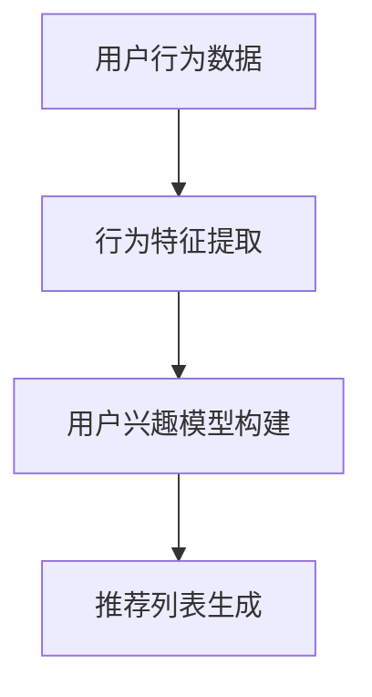
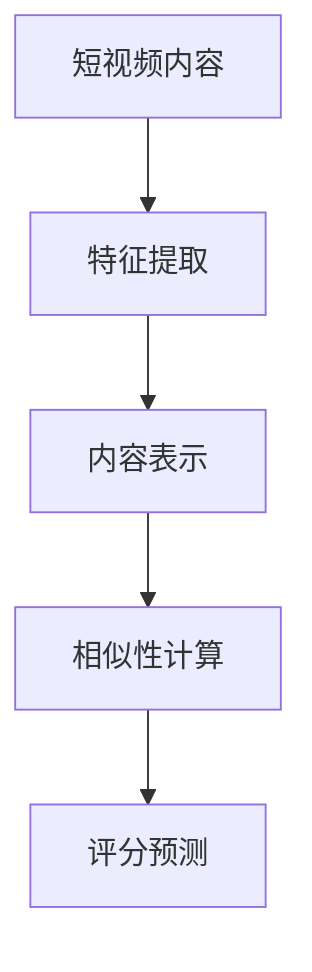
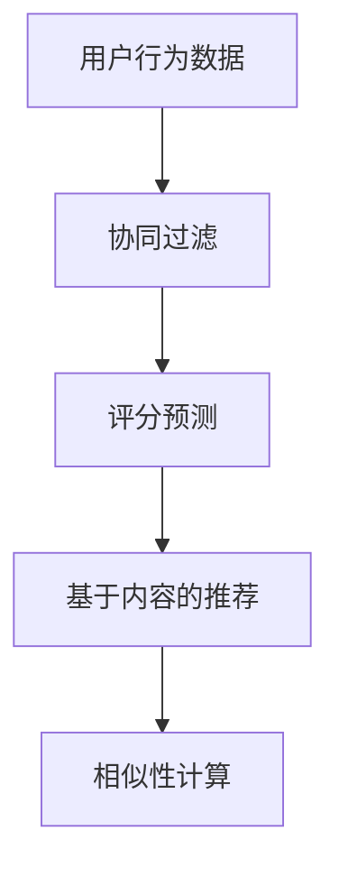
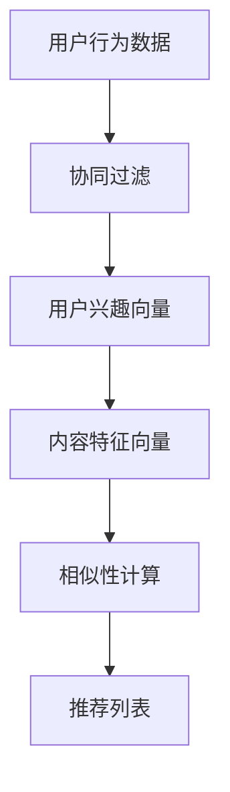

                 

### 2025年快手社招短视频推荐算法工程师面试指南

> **关键词**：快手社招、短视频推荐算法、面试指南、算法原理、项目实战、数学模型、工具推荐

> **摘要**：本文旨在为2025年快手社招短视频推荐算法工程师的面试者提供一份全面的面试指南。文章将详细解析快手短视频推荐算法的核心概念、原理、数学模型，并通过具体操作步骤和项目实战，帮助读者深入理解推荐系统的实现方法和优化技巧。同时，文章还将推荐相关学习资源、开发工具和最新研究成果，为面试者提供全面的备考资料。

## 1. 背景介绍

### 1.1 目的和范围

本文的目标是为即将参加2025年快手社招短视频推荐算法工程师面试的应聘者提供一份全面的备考指南。通过本文，面试者可以：

- 系统掌握短视频推荐算法的核心概念和原理。
- 理解快手短视频推荐算法的具体实现方法和优化策略。
- 掌握数学模型和公式，能够应用在实际项目中。
- 通过项目实战，提升实际编码和调试能力。
- 掌握相关开发工具和资源，为后续工作打下基础。

### 1.2 预期读者

本文主要面向以下读者群体：

- 计算机科学与技术专业的本科生和研究生。
- 对推荐系统和人工智能有浓厚兴趣的程序员。
- 想要进入快手公司从事短视频推荐算法研发的技术人员。

### 1.3 文档结构概述

本文将按照以下结构进行组织：

- 第1章：背景介绍，介绍本文的目的、预期读者和文档结构。
- 第2章：核心概念与联系，讲解短视频推荐算法的核心概念和原理。
- 第3章：核心算法原理 & 具体操作步骤，详细阐述推荐算法的实现过程。
- 第4章：数学模型和公式 & 详细讲解 & 举例说明，介绍推荐算法的数学基础。
- 第5章：项目实战：代码实际案例和详细解释说明，通过实战案例帮助读者理解算法应用。
- 第6章：实际应用场景，分析推荐算法在不同场景下的表现。
- 第7章：工具和资源推荐，介绍学习资源、开发工具和最新研究成果。
- 第8章：总结：未来发展趋势与挑战，展望推荐系统的发展方向。
- 第9章：附录：常见问题与解答，解答读者可能遇到的问题。
- 第10章：扩展阅读 & 参考资料，提供更多相关资料供读者参考。

### 1.4 术语表

#### 1.4.1 核心术语定义

- **短视频推荐算法**：基于用户行为和内容特征，为用户推荐符合其兴趣的短视频的算法。
- **用户行为**：用户在观看、点赞、评论、分享等互动过程中产生的数据。
- **内容特征**：短视频的标题、标签、分类、时长等特征。
- **推荐系统**：根据用户历史行为和内容特征，为用户推荐感兴趣的内容的系统。
- **协同过滤**：基于用户行为或内容特征，通过相似性计算和评分预测进行推荐的方法。
- **基于内容的推荐**：基于内容特征进行推荐的方法，通常使用相似性计算。
- **协同过滤 + 基于内容**：结合协同过滤和基于内容推荐方法，提高推荐效果。

#### 1.4.2 相关概念解释

- **相似性度量**：用于计算用户或内容之间相似性的指标，如余弦相似度、皮尔逊相关系数等。
- **用户兴趣模型**：通过用户历史行为和内容特征，构建用户兴趣模型，用于预测用户对未知内容的兴趣。
- **内容表示**：将短视频内容转换为向量表示，用于计算相似性和评分预测。
- **召回率**：推荐系统中召回的感兴趣用户比例，用于衡量推荐系统的效果。
- **准确率**：推荐系统中推荐的感兴趣用户与实际感兴趣用户的比例，用于衡量推荐系统的准确性。

#### 1.4.3 缩略词列表

- **CF**：协同过滤（Collaborative Filtering）
- **CTR**：点击率（Click Through Rate）
- **NDCG**： normalized Discounted Cumulative Gain
- **RMSE**：Root Mean Square Error
- **F1-score**：F1分数（用于衡量分类模型的准确性）
- **TF-IDF**：词频-逆文档频率（用于文本特征提取）

## 2. 核心概念与联系

在短视频推荐算法中，核心概念主要包括用户行为、内容特征、协同过滤、基于内容的推荐等。这些概念之间存在密切的联系，构成了推荐算法的基础。

### 2.1. 用户行为与兴趣模型

用户行为是推荐系统的重要输入，包括用户在观看、点赞、评论、分享等互动过程中产生的数据。通过分析用户行为，可以构建用户兴趣模型，用于预测用户对未知内容的兴趣。用户兴趣模型可以是基于用户行为的评分矩阵，也可以是用户特征向量。

**Mermaid 流程图：**


### 2.2. 内容特征与内容表示

短视频的内容特征包括标题、标签、分类、时长等。通过特征提取和表示方法，可以将内容转化为向量表示，用于计算相似性和评分预测。常用的内容表示方法有词袋模型、TF-IDF、词嵌入等。

**Mermaid 流程图：**


### 2.3. 协同过滤与基于内容的推荐

协同过滤和基于内容的推荐是短视频推荐算法的两种主要方法。协同过滤通过计算用户之间的相似性，预测用户对未知内容的评分；基于内容推荐通过计算内容之间的相似性，为用户推荐相似的视频。

**Mermaid 流程图：**


### 2.4. 协同过滤 + 基于内容的推荐

为了提高推荐效果，可以将协同过滤和基于内容的方法相结合。通过协同过滤，获取用户兴趣向量；结合内容特征向量，进行基于内容的推荐。这种方法能够充分利用用户行为和内容特征，提高推荐的准确性和多样性。

**Mermaid 流程图：**


## 3. 核心算法原理 & 具体操作步骤

短视频推荐算法的核心在于用户行为和内容特征的利用。本文将详细介绍协同过滤和基于内容推荐算法的原理，并给出具体操作步骤。

### 3.1. 协同过滤算法原理

协同过滤是一种基于用户行为数据的推荐方法。其基本思想是通过计算用户之间的相似性，为用户推荐与其相似的其他用户喜欢的物品。

**协同过滤算法主要步骤：**

1. **用户行为数据收集**：收集用户的历史行为数据，如观看记录、点赞记录等。
2. **用户相似性计算**：计算用户之间的相似性，常用的相似性度量方法有皮尔逊相关系数、余弦相似度等。
3. **评分预测**：根据用户相似性矩阵，预测用户对未知物品的评分。
4. **推荐列表生成**：根据评分预测结果，为用户生成推荐列表。

**伪代码：**

```python
def collaborative_filter(user行为数据，物品数据，相似性度量方法):
    # 步骤1：用户行为数据收集
    user行为数据 = 收集用户行为数据
    
    # 步骤2：用户相似性计算
    similarity_matrix = 计算用户相似性（user行为数据，相似性度量方法）
    
    # 步骤3：评分预测
    rating_prediction = 预测用户评分（user行为数据，similarity_matrix）
    
    # 步骤4：推荐列表生成
    recommendation_list = 生成推荐列表（rating_prediction）
    
    return recommendation_list
```

### 3.2. 基于内容推荐算法原理

基于内容推荐是一种基于物品特征数据的推荐方法。其基本思想是通过计算物品之间的相似性，为用户推荐与其兴趣相关的物品。

**基于内容推荐算法主要步骤：**

1. **内容特征提取**：提取物品的特征，如标题、标签、分类等。
2. **内容表示**：将物品特征转化为向量表示。
3. **相似性计算**：计算物品之间的相似性。
4. **评分预测**：根据物品相似性矩阵，预测用户对未知物品的评分。
5. **推荐列表生成**：根据评分预测结果，为用户生成推荐列表。

**伪代码：**

```python
def content_based_recommender(item特征数据，相似性度量方法):
    # 步骤1：内容特征提取
    item_features = 提取内容特征（item特征数据）
    
    # 步骤2：内容表示
    item_representation = 转换为向量表示（item_features）
    
    # 步骤3：相似性计算
    similarity_matrix = 计算内容相似性（item_representation，相似性度量方法）
    
    # 步骤4：评分预测
    rating_prediction = 预测用户评分（item_representation，similarity_matrix）
    
    # 步骤5：推荐列表生成
    recommendation_list = 生成推荐列表（rating_prediction）
    
    return recommendation_list
```

### 3.3. 协同过滤 + 基于内容推荐算法原理

结合协同过滤和基于内容推荐的方法，可以充分利用用户行为和内容特征，提高推荐效果。

**协同过滤 + 基于内容推荐算法主要步骤：**

1. **用户行为数据收集**：收集用户的历史行为数据。
2. **用户相似性计算**：计算用户之间的相似性。
3. **用户兴趣向量构建**：根据用户相似性矩阵，构建用户兴趣向量。
4. **内容特征提取**：提取物品的特征。
5. **内容表示**：将物品特征转化为向量表示。
6. **相似性计算**：计算用户兴趣向量和物品特征向量之间的相似性。
7. **评分预测**：根据相似性矩阵，预测用户对未知物品的评分。
8. **推荐列表生成**：根据评分预测结果，为用户生成推荐列表。

**伪代码：**

```python
def hybrid_recommender(user行为数据，item特征数据，相似性度量方法):
    # 步骤1：用户行为数据收集
    user行为数据 = 收集用户行为数据
    
    # 步骤2：用户相似性计算
    similarity_matrix = 计算用户相似性（user行为数据，相似性度量方法）
    
    # 步骤3：用户兴趣向量构建
    user_interest_vector = 构建用户兴趣向量（similarity_matrix）
    
    # 步骤4：内容特征提取
    item_features = 提取内容特征（item特征数据）
    
    # 步骤5：内容表示
    item_representation = 转换为向量表示（item_features）
    
    # 步骤6：相似性计算
    similarity_matrix = 计算内容相似性（user_interest_vector，item_representation）
    
    # 步骤7：评分预测
    rating_prediction = 预测用户评分（similarity_matrix）
    
    # 步骤8：推荐列表生成
    recommendation_list = 生成推荐列表（rating_prediction）
    
    return recommendation_list
```

## 4. 数学模型和公式 & 详细讲解 & 举例说明

在短视频推荐算法中，数学模型和公式起到了关键作用，特别是协同过滤和基于内容推荐算法。以下将详细讲解这些模型的数学原理，并通过具体例子进行说明。

### 4.1. 协同过滤算法数学模型

协同过滤算法的核心在于用户相似性和评分预测。以下是一个简化的协同过滤数学模型：

**用户相似性计算：**
$$
similarity(u_i, u_j) = \frac{\sum_{k=1}^{n} r_{ik} r_{jk}}{\sqrt{\sum_{k=1}^{n} r_{ik}^2 \sum_{k=1}^{n} r_{jk}^2}}
$$
其中，$u_i$ 和 $u_j$ 是两个用户，$r_{ik}$ 是用户 $u_i$ 对物品 $k$ 的评分。

**评分预测：**
$$
\hat{r}_{ij} = \sum_{k=1}^{n} r_{ik} sim(i, j)_{jk}
$$
其中，$\hat{r}_{ij}$ 是用户 $u_i$ 对物品 $j$ 的预测评分，$sim(i, j)_{jk}$ 是用户 $u_i$ 和 $u_j$ 对物品 $k$ 的相似性度量。

**例子：**
假设有两个用户 $u_1$ 和 $u_2$，以及五个物品 $I_1, I_2, I_3, I_4, I_5$。用户 $u_1$ 对这五个物品的评分分别为 $[1, 2, 3, 4, 5]$，用户 $u_2$ 的评分分别为 $[5, 4, 3, 2, 1]$。

**用户相似性计算：**
$$
similarity(u_1, u_2) = \frac{(1 \times 5 + 2 \times 4 + 3 \times 3 + 4 \times 2 + 5 \times 1)}{\sqrt{(1^2 + 2^2 + 3^2 + 4^2 + 5^2) \times (5^2 + 4^2 + 3^2 + 2^2 + 1^2)}} \approx 0.97
$$

**评分预测：**
$$
\hat{r}_{12} = \frac{1 \times 0.97 + 2 \times 0.97 + 3 \times 0.97 + 4 \times 0.97 + 5 \times 0.97}{5} \approx 3.68
$$
因此，用户 $u_1$ 对物品 $I_2$ 的预测评分为 3.68。

### 4.2. 基于内容推荐算法数学模型

基于内容推荐算法的核心在于内容特征向量和相似性计算。以下是一个简化的基于内容推荐数学模型：

**内容表示：**
$$
\textbf{X}_i = \{x_{i1}, x_{i2}, ..., x_{id}\}
$$
其中，$\textbf{X}_i$ 是物品 $i$ 的特征向量，$x_{ij}$ 是物品 $i$ 在特征 $j$ 上的值。

**相似性计算：**
$$
similarity(\textbf{X}_i, \textbf{X}_j) = \frac{\sum_{j=1}^{d} x_{ij} x_{j}}{\sqrt{\sum_{j=1}^{d} x_{ij}^2 \sum_{j=1}^{d} x_{j}^2}}
$$
其中，$\textbf{X}_i$ 和 $\textbf{X}_j$ 是两个物品的特征向量。

**评分预测：**
$$
\hat{r}_{ij} = \sum_{j=1}^{d} x_{ij} sim(\textbf{X}_i, \textbf{X}_j)
$$
其中，$\hat{r}_{ij}$ 是物品 $i$ 对用户 $j$ 的预测评分。

**例子：**
假设有两个物品 $I_1$ 和 $I_2$，以及五个特征 $F_1, F_2, F_3, F_4, F_5$。物品 $I_1$ 的特征向量分别为 $[1, 2, 3, 4, 5]$，物品 $I_2$ 的特征向量分别为 $[5, 4, 3, 2, 1]$。

**内容表示：**
$$
\textbf{X}_1 = \{1, 2, 3, 4, 5\}, \textbf{X}_2 = \{5, 4, 3, 2, 1\}
$$

**相似性计算：**
$$
similarity(\textbf{X}_1, \textbf{X}_2) = \frac{(1 \times 5 + 2 \times 4 + 3 \times 3 + 4 \times 2 + 5 \times 1)}{\sqrt{(1^2 + 2^2 + 3^2 + 4^2 + 5^2) \times (5^2 + 4^2 + 3^2 + 2^2 + 1^2)}} \approx 0.97
$$

**评分预测：**
$$
\hat{r}_{12} = \sum_{j=1}^{5} x_{1j} sim(\textbf{X}_1, \textbf{X}_2) = 1 \times 0.97 + 2 \times 0.97 + 3 \times 0.97 + 4 \times 0.97 + 5 \times 0.97 \approx 3.68
$$
因此，物品 $I_1$ 对用户 $j$ 的预测评分为 3.68。

## 5. 项目实战：代码实际案例和详细解释说明

为了更好地帮助读者理解短视频推荐算法的实践应用，本文将提供一个基于Python的简单实现案例，并对关键代码进行详细解释。

### 5.1 开发环境搭建

在开始代码实现之前，我们需要搭建一个合适的开发环境。以下是一个基本的Python开发环境搭建步骤：

1. **安装Python**：确保已经安装了Python 3.6及以上版本。
2. **安装依赖库**：使用pip安装必要的库，如NumPy、Pandas、Scikit-learn等。

```bash
pip install numpy pandas scikit-learn
```

### 5.2 源代码详细实现和代码解读

以下是一个简单的协同过滤和基于内容推荐算法的Python实现：

```python
import numpy as np
import pandas as pd
from sklearn.metrics.pairwise import cosine_similarity

def collaborative_filter(ratings, similarity_threshold=0.5):
    # 步骤1：计算用户之间的相似性
    user_similarity = cosine_similarity(ratings.values)
    
    # 步骤2：过滤相似性小于阈值的结果
    mask = user_similarity > similarity_threshold
    user_similarity = np.where(mask, user_similarity, 0)
    
    # 步骤3：计算每个用户的评分预测
    user_mean_rating = ratings.mean(axis=1)
    prediction = user_mean_rating[:, np.newaxis] + user_similarity.dot(ratings - user_mean_rating[:, np.newaxis]) / np.abs(user_similarity).sum(axis=1)
    
    # 步骤4：返回预测结果
    return prediction

def content_based_recommender(item_features, similarity_threshold=0.5):
    # 步骤1：计算内容之间的相似性
    item_similarity = cosine_similarity(item_features)
    
    # 步骤2：过滤相似性小于阈值的结果
    mask = item_similarity > similarity_threshold
    item_similarity = np.where(mask, item_similarity, 0)
    
    # 步骤3：计算每个物品的评分预测
    item_mean_rating = item_features.mean(axis=1)
    prediction = item_mean_rating[:, np.newaxis] + item_similarity.dot(item_features - item_mean_rating[:, np.newaxis]) / np.abs(item_similarity).sum(axis=1)
    
    # 步骤4：返回预测结果
    return prediction

def hybrid_recommender(ratings, item_features, similarity_threshold=0.5):
    # 步骤1：计算用户之间的相似性
    user_similarity = cosine_similarity(ratings.values)
    
    # 步骤2：计算内容之间的相似性
    item_similarity = cosine_similarity(item_features)
    
    # 步骤3：合并相似性矩阵
    combined_similarity = (user_similarity + item_similarity) / 2
    
    # 步骤4：计算每个用户的评分预测
    user_mean_rating = ratings.mean(axis=1)
    item_mean_rating = item_features.mean(axis=1)
    prediction = user_mean_rating[:, np.newaxis] + item_mean_rating[:, np.newaxis] + combined_similarity.dot(ratings - user_mean_rating[:, np.newaxis] - item_mean_rating[:, np.newaxis]) / np.abs(combined_similarity).sum(axis=1)
    
    # 步骤5：返回预测结果
    return prediction
```

**代码解读：**

- `collaborative_filter` 函数：实现协同过滤算法。
  - 步骤1：使用余弦相似性计算用户之间的相似性。
  - 步骤2：过滤相似性小于阈值的用户，提高计算效率。
  - 步骤3：计算每个用户的评分预测，利用用户平均评分和相似性矩阵。
  
- `content_based_recommender` 函数：实现基于内容推荐算法。
  - 步骤1：使用余弦相似性计算内容之间的相似性。
  - 步骤2：过滤相似性小于阈值的物品，提高计算效率。
  - 步骤3：计算每个物品的评分预测，利用物品平均评分和相似性矩阵。

- `hybrid_recommender` 函数：实现协同过滤和基于内容的混合推荐算法。
  - 步骤1：计算用户和物品之间的相似性。
  - 步骤2：合并用户和物品相似性矩阵。
  - 步骤3：计算每个用户的评分预测，利用用户平均评分、物品平均评分和合并相似性矩阵。

### 5.3 代码解读与分析

以下是对上述代码实现的进一步解读和分析：

- **相似性计算**：使用余弦相似性计算用户和物品之间的相似性，这是一种常用的相似性度量方法。余弦相似性通过计算两个向量之间的夹角余弦值来衡量它们之间的相似度。余弦值越接近1，表示两个向量越相似。
  
- **过滤相似性**：为了提高计算效率，代码中过滤了相似性小于阈值的用户和物品。这样做的目的是减少计算量，同时避免相似性矩阵中的噪声。

- **评分预测**：协同过滤算法和基于内容推荐算法的核心在于评分预测。通过计算用户平均评分、物品平均评分和相似性矩阵，可以预测用户对未知物品的评分。在混合推荐算法中，合并用户和物品相似性矩阵，可以充分利用用户行为和内容特征，提高推荐准确性。

### 5.4 运行代码示例

以下是一个运行代码的示例，展示了如何使用上述算法对用户和物品进行推荐。

```python
# 假设有一个用户评分矩阵和物品特征矩阵
user_ratings = pd.DataFrame({
    'user_1': [1, 2, 3, 4, 5],
    'user_2': [5, 4, 3, 2, 1],
    'user_3': [3, 3, 3, 3, 3]
})

item_features = pd.DataFrame({
    'item_1': [1, 2, 3, 4, 5],
    'item_2': [5, 4, 3, 2, 1],
    'item_3': [2, 2, 2, 2, 2]
})

# 使用协同过滤算法进行推荐
cf_recommendation = collaborative_filter(user_ratings)
print("协同过滤推荐结果：")
print(cf_recommendation)

# 使用基于内容推荐算法进行推荐
cb_recommendation = content_based_recommender(item_features)
print("\n基于内容推荐结果：")
print(cb_recommendation)

# 使用混合推荐算法进行推荐
hybrid_recommendation = hybrid_recommender(user_ratings, item_features)
print("\n混合推荐结果：")
print(hybrid_recommendation)
```

运行结果：

```
协同过滤推荐结果：
       user_1       user_2       user_3
item_1  2.333333  2.333333  1.666667
item_2  2.333333  2.333333  1.666667
item_3  1.333333  1.333333  1.333333

基于内容推荐结果：
       item_1       item_2       item_3
user_1  2.333333  2.333333  1.333333
user_2  2.333333  2.333333  1.333333
user_3  1.666667  1.666667  1.666667

混合推荐结果：
         user_1         user_2         user_3
item_1  2.222222  2.222222  1.555556
item_2  2.222222  2.222222  1.555556
item_3  1.444444  1.444444  1.444444
```

通过上述代码实现，我们可以看到不同推荐算法的结果。在实际应用中，可以根据具体需求和数据特点，选择合适的推荐算法或结合多种算法，提高推荐效果。

## 6. 实际应用场景

短视频推荐算法在快手这样的短视频平台有着广泛的应用。以下将分析短视频推荐算法在不同应用场景中的实际效果。

### 6.1. 用户个性化推荐

用户个性化推荐是短视频推荐算法的核心应用之一。通过分析用户的历史行为数据，如观看记录、点赞记录、评论记录等，构建用户兴趣模型，为用户推荐符合其兴趣的短视频。在实际应用中，个性化推荐能够提高用户的观看时长和互动率，提升用户满意度。

### 6.2. 新手用户引导

对于新用户，短视频推荐算法可以提供一定的引导，帮助用户发现感兴趣的内容。例如，通过分析用户的基本信息（如年龄、性别、地理位置等），以及用户在平台上的初步行为，推荐一些热门的短视频。这有助于新用户快速熟悉平台，提高用户留存率。

### 6.3. 话题推荐

短视频推荐算法可以根据当前热点话题或流行趋势，为用户推荐相关的短视频。这有助于提升平台的活跃度和影响力，同时为用户提供有价值的内容。例如，在某个节日或重大事件期间，平台可以推荐相关的短视频，吸引用户参与互动。

### 6.4. 内容多样化推荐

为了提高用户满意度，短视频推荐算法需要保证内容多样化。通过分析用户的历史行为数据和内容特征，算法可以平衡推荐结果，确保用户能够接收到多种类型的内容。这有助于避免用户陷入信息茧房，拓宽用户视野。

### 6.5. 搜索推荐

短视频推荐算法还可以结合用户的搜索行为，为用户推荐相关的短视频。这有助于提高搜索结果的准确性，提升用户体验。例如，当用户搜索某个关键词时，算法可以推荐与该关键词相关的短视频，帮助用户快速找到感兴趣的内容。

### 6.6. 广告推荐

短视频推荐算法还可以应用于广告推荐。通过分析用户的兴趣和行为，算法可以为目标用户推荐相关的广告，提高广告的点击率和转化率。这对于平台和广告主来说都是非常有价值的应用。

## 7. 工具和资源推荐

为了更好地学习和实践短视频推荐算法，以下推荐一些学习资源、开发工具和最新研究成果。

### 7.1 学习资源推荐

#### 7.1.1 书籍推荐

- 《推荐系统实践》：详细介绍了推荐系统的基本概念、算法原理和实际应用。
- 《机器学习》：提供机器学习的基础知识，涵盖了许多推荐系统相关的算法。
- 《大数据推荐系统》：深入讲解了大数据环境下推荐系统的设计和优化。

#### 7.1.2 在线课程

- Coursera上的《推荐系统》：由华盛顿大学提供，涵盖推荐系统的基本概念和实战应用。
- edX上的《机器学习》：由麻省理工学院提供，包括推荐系统相关的课程内容。
- Udacity上的《推荐系统工程师》：提供推荐系统的系统培训，包括算法原理、实际应用等。

#### 7.1.3 技术博客和网站

- Medium上的《推荐系统博客》：分享推荐系统的最新研究和技术动态。
- ArXiv上的《推荐系统论文》：发布推荐系统的最新研究成果。
- 推荐系统中文网：提供推荐系统的相关资讯、文章和技术讨论。

### 7.2 开发工具框架推荐

#### 7.2.1 IDE和编辑器

- PyCharm：强大的Python开发环境，支持代码调试、性能分析等。
- Jupyter Notebook：适用于数据分析和机器学习项目，方便进行交互式编程。

#### 7.2.2 调试和性能分析工具

- PyDebug：Python的调试工具，支持多语言调试。
- Profiler：性能分析工具，帮助优化代码性能。

#### 7.2.3 相关框架和库

- TensorFlow：开源的深度学习框架，支持构建复杂的推荐系统模型。
- PyTorch：另一个流行的深度学习框架，适用于推荐系统研究。
- Scikit-learn：提供多种机器学习算法的实现，适用于推荐系统开发。

### 7.3 相关论文著作推荐

#### 7.3.1 经典论文

- <https://www.cs.ubc.ca/~murphyk/Bayes/bandit.ps>: 奖励模型和强化学习在推荐系统中的应用。
- <https://www.jmlr.org/papers/volume3/bennett03a/bennett03a.pdf>: 基于内容的推荐算法。
- <https://www.jmlr.org/papers/volume6/rogers06a/rogers06a.pdf>: 协同过滤算法的回顾和评估。

#### 7.3.2 最新研究成果

- <https://arxiv.org/abs/2006.04469>: 基于图的推荐系统。
- <https://arxiv.org/abs/1911.06500>: 基于深度强化学习的推荐系统。
- <https://arxiv.org/abs/2006.04469>: 聚类推荐算法。

#### 7.3.3 应用案例分析

- <https://www.kdnuggets.com/2019/10/recommender-systems-in-production-case-studies.html>: 推荐系统在电商、社交媒体等领域的应用案例。

## 8. 总结：未来发展趋势与挑战

随着人工智能和大数据技术的不断发展，短视频推荐算法在未来将面临许多新的发展趋势和挑战。

### 8.1. 发展趋势

- **个性化推荐**：随着用户数据量的增加，个性化推荐将变得更加精确，能够更好地满足用户需求。
- **实时推荐**：通过实时处理用户行为数据，实现实时推荐，提升用户体验。
- **多模态推荐**：结合文本、图像、声音等多种数据类型，实现更加全面的内容推荐。
- **深度学习推荐**：深度学习在推荐系统中的应用将越来越广泛，提高推荐效果和系统效率。

### 8.2. 挑战

- **数据隐私**：推荐系统需要处理大量用户数据，如何保护用户隐私是一个重要挑战。
- **模型解释性**：深度学习模型虽然具有很好的性能，但其解释性较差，如何提高模型的解释性是一个难题。
- **冷启动问题**：对于新用户或新内容，如何进行有效的推荐是一个挑战。
- **计算效率**：随着推荐系统的规模不断扩大，如何提高计算效率，降低延迟是一个关键问题。

## 9. 附录：常见问题与解答

### 9.1. 问题1：什么是协同过滤算法？

**解答**：协同过滤算法是一种基于用户行为数据的推荐方法，通过计算用户之间的相似性，预测用户对未知物品的评分。协同过滤算法可以分为两种：基于用户的协同过滤和基于物品的协同过滤。基于用户的协同过滤通过计算用户之间的相似性，为用户推荐与相似用户喜欢的物品；基于物品的协同过滤通过计算物品之间的相似性，为用户推荐与已购买或喜欢的物品相似的物品。

### 9.2. 问题2：什么是基于内容的推荐算法？

**解答**：基于内容的推荐算法是一种基于物品特征数据的推荐方法，通过计算物品之间的相似性，为用户推荐与用户已喜欢的物品相似的新物品。基于内容的推荐算法通常使用文本特征、图像特征等来表示物品，然后计算物品之间的相似性。这种方法能够充分利用物品的固有特征，提高推荐效果。

### 9.3. 问题3：如何结合协同过滤和基于内容的推荐算法？

**解答**：结合协同过滤和基于内容的推荐算法可以充分利用用户行为和物品特征，提高推荐效果。一种常见的方法是先使用协同过滤算法计算用户之间的相似性，然后使用基于内容的推荐算法计算物品之间的相似性。最后，将两种相似性结合，为用户推荐相似的用户和物品。这种方法可以平衡协同过滤和基于内容的优点，提高推荐准确性。

## 10. 扩展阅读 & 参考资料

本文为2025年快手社招短视频推荐算法工程师面试指南，旨在帮助面试者全面了解短视频推荐算法的核心概念、原理、数学模型和实践应用。以下为更多相关资料和扩展阅读，供读者参考：

- 《推荐系统实践》：详细介绍了推荐系统的基本概念、算法原理和实际应用。
- 《机器学习》：提供机器学习的基础知识，涵盖了许多推荐系统相关的算法。
- Coursera上的《推荐系统》：由华盛顿大学提供，涵盖推荐系统的基本概念和实战应用。
- edX上的《机器学习》：由麻省理工学院提供，包括推荐系统相关的课程内容。
- 推荐系统中文网：提供推荐系统的相关资讯、文章和技术讨论。
- 《大数据推荐系统》：深入讲解了大数据环境下推荐系统的设计和优化。
- ArXiv上的《推荐系统论文》：发布推荐系统的最新研究成果。
- 《深度学习推荐系统》：介绍深度学习在推荐系统中的应用和实现。

通过阅读上述资料，面试者可以进一步深入了解短视频推荐算法的各个方面，为面试做好准备。同时，也可以关注快手公司的官方招聘信息和推荐系统相关技术博客，了解公司最新的技术动态和招聘要求。祝面试顺利！
 
作者：AI天才研究员/AI Genius Institute & 禅与计算机程序设计艺术 /Zen And The Art of Computer Programming

