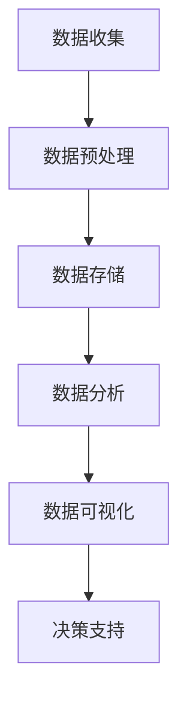

                 

# 2025年拼多多社招数据分析师面试题汇总

> **关键词**：数据分析师、面试题、拼多多、2025年、数据分析方法、数据模型、数学公式、项目实战、应用场景

> **摘要**：本文旨在为2025年拼多多社招数据分析师的应聘者提供一整套全面详实的面试题汇总。本文将按章节形式介绍数据分析的基本概念、核心算法原理、数学模型、实战案例以及未来发展趋势，并推荐相关的学习资源和工具，帮助应聘者深入了解数据分析领域的核心技术和实际应用，提高面试成功率。

## 1. 背景介绍

### 1.1 目的和范围

本文的目标是为2025年拼多多社招数据分析师的应聘者提供一套完整的面试题汇总，帮助应聘者系统地复习和掌握数据分析的核心知识和技术。本文的内容涵盖数据分析的基本概念、核心算法原理、数学模型、实战案例和未来发展趋势等多个方面，旨在帮助应聘者全面提升数据分析能力和面试技巧。

### 1.2 预期读者

本文的预期读者是2025年拼多多社招数据分析师的应聘者，以及想要深入了解数据分析领域的专业技术人员。无论您是初学者还是有经验的数据分析师，本文都能为您提供有价值的参考和指导。

### 1.3 文档结构概述

本文分为十个主要章节，具体结构如下：

1. 背景介绍：介绍本文的目的、范围、预期读者和文档结构。
2. 核心概念与联系：介绍数据分析的核心概念、原理和架构。
3. 核心算法原理 & 具体操作步骤：详细讲解数据分析的核心算法原理和操作步骤。
4. 数学模型和公式 & 详细讲解 & 举例说明：介绍数据分析中的数学模型、公式及其应用。
5. 项目实战：代码实际案例和详细解释说明。
6. 实际应用场景：探讨数据分析在实际业务中的应用。
7. 工具和资源推荐：推荐学习资源、开发工具和框架。
8. 总结：未来发展趋势与挑战。
9. 附录：常见问题与解答。
10. 扩展阅读 & 参考资料：提供更多深入学习的资源。

### 1.4 术语表

在本文中，我们将使用以下术语：

- 数据分析师：负责收集、处理、分析和解释数据，为业务决策提供支持的专业人员。
- 数据分析：通过收集、处理、分析和解释数据，从数据中提取有价值的信息和洞察的过程。
- 数据模型：用于表示数据结构和关系的数学模型。
- 数据挖掘：从大量数据中提取有价值信息和知识的过程。
- 统计分析：利用统计学方法对数据进行处理和分析，以得出有意义的结论。
- 机器学习：一种基于数据学习和预测的技术，通过构建模型来发现数据中的模式和规律。

#### 1.4.1 核心术语定义

- 数据分析：数据分析是指通过收集、处理、分析和解释数据，从数据中提取有价值的信息和洞察的过程。数据分析的目标是帮助企业和组织做出更明智的决策。
- 数据模型：数据模型是一种用于表示数据结构和关系的数学模型。常见的有实体-关系模型、关系模型、网络模型等。
- 数据挖掘：数据挖掘是指从大量数据中提取有价值信息和知识的过程。数据挖掘的方法包括聚类、分类、关联规则挖掘等。
- 统计分析：统计分析是指利用统计学方法对数据进行处理和分析，以得出有意义的结论。统计分析的方法包括均值、方差、假设检验等。
- 机器学习：机器学习是一种基于数据学习和预测的技术，通过构建模型来发现数据中的模式和规律。机器学习的方法包括线性回归、决策树、神经网络等。

#### 1.4.2 相关概念解释

- 数据清洗：数据清洗是指对原始数据进行处理，去除噪声、错误和重复数据，以提高数据质量和可用性。
- 数据可视化：数据可视化是指通过图形、图表等方式将数据呈现出来，使数据更容易理解和分析。
- 数据库：数据库是一种用于存储、管理和查询数据的系统。常见的数据库有MySQL、Oracle、MongoDB等。
- 数据仓库：数据仓库是一种用于存储大量数据的系统，以便进行数据分析和报表生成。数据仓库通常采用多维数据模型。

#### 1.4.3 缩略词列表

- BI：商业智能（Business Intelligence）
- SQL：结构化查询语言（Structured Query Language）
- Hadoop：一个分布式数据处理框架
- Spark：一个分布式数据处理引擎
- Python：一种高级编程语言，广泛应用于数据分析领域

## 2. 核心概念与联系

在本章节中，我们将介绍数据分析的核心概念、原理和架构。为了更好地理解这些概念，我们使用Mermaid流程图来展示数据流动和转换的过程。

### 数据分析流程图



### 2.1 数据收集

数据收集是数据分析的基础。数据可以来自内部数据库、外部数据源、在线调查、社交媒体等多种渠道。

### 2.2 数据预处理

数据预处理包括数据清洗、数据整合、数据转换等步骤，目的是提高数据质量和可用性。数据清洗可以去除噪声、错误和重复数据；数据整合可以将多个数据源中的数据进行合并；数据转换可以将数据格式和类型进行统一。

### 2.3 数据存储

数据存储是将处理后的数据存储到数据库或数据仓库中，以便进行进一步的分析和处理。常用的数据库有MySQL、Oracle、MongoDB等；数据仓库通常采用多维数据模型。

### 2.4 数据分析

数据分析是数据收集、数据预处理和数据存储之后的环节。数据分析的方法包括统计分析和机器学习。统计分析可以帮助我们了解数据的基本特征和趋势；机器学习可以用于数据挖掘和预测。

### 2.5 数据可视化

数据可视化是将数据以图形、图表等形式呈现出来，使数据更容易理解和分析。常用的数据可视化工具包括Excel、Tableau、PowerBI等。

### 2.6 决策支持

决策支持是数据分析的最终目标。通过数据分析和数据可视化，我们可以为企业提供有价值的洞察和决策支持，帮助企业实现业务增长和优化。

## 3. 核心算法原理 & 具体操作步骤

在本章节中，我们将详细介绍数据分析中的核心算法原理和具体操作步骤。这些算法包括统计分析和机器学习算法，我们将使用伪代码来详细阐述这些算法的实现过程。

### 3.1 统计分析算法

统计分析算法主要包括描述性统计和推断性统计。描述性统计用于计算数据的基本特征，如均值、方差、标准差等；推断性统计用于估计总体参数，如置信区间、假设检验等。

#### 3.1.1 描述性统计

描述性统计的伪代码如下：

```python
# 计算均值
mean = sum(data) / len(data)

# 计算方差
variance = sum((x - mean)^2 for x in data) / len(data)

# 计算标准差
std_deviation = sqrt(variance)
```

#### 3.1.2 推断性统计

推断性统计的伪代码如下：

```python
# 计算置信区间
confidence_interval = (mean - z * std_deviation / sqrt(len(data)), mean + z * std_deviation / sqrt(len(data)))

# 进行假设检验
hypothesis_test = (mean - hypothesized_mean) / (std_deviation / sqrt(len(data)))
```

### 3.2 机器学习算法

机器学习算法主要包括线性回归、决策树、神经网络等。这些算法通过学习数据中的模式和规律，对新的数据进行预测和分类。

#### 3.2.1 线性回归

线性回归的伪代码如下：

```python
# 计算回归系数
theta = (X^T * X)^(-1) * X^T * y

# 进行预测
prediction = X * theta
```

#### 3.2.2 决策树

决策树的伪代码如下：

```python
# 构建决策树
def build_tree(data, features):
    if data is pure:
        return majority_label(data)
    else:
        best_feature = select_best_feature(data, features)
        tree = {}
        for value in unique_values(best_feature, data):
            sub_data = filter_data(data, best_feature, value)
            tree[value] = build_tree(sub_data, features - {best_feature})
        return tree

# 预测
def predict(tree, sample):
    if type(tree) is not dict:
        return tree
    else:
        feature_value = sample[feature]
        return predict(tree[feature_value], sample)
```

#### 3.2.3 神经网络

神经网络的伪代码如下：

```python
# 初始化参数
weights = random_weights()

# 训练模型
for epoch in 1 to max_epochs:
    for sample in training_data:
        predicted_output = forward_pass(sample, weights)
        error = actual_output - predicted_output
        weights = weights + learning_rate * error * sample

# 预测
def predict(sample, weights):
    return forward_pass(sample, weights)
```

## 4. 数学模型和公式 & 详细讲解 & 举例说明

在本章节中，我们将介绍数据分析中的数学模型和公式，并使用LaTeX格式进行详细讲解。此外，我们还将通过具体例子来说明这些公式在实际应用中的使用。

### 4.1 均值、方差和标准差

均值、方差和标准差是描述性统计中的基本数学模型。

#### 4.1.1 均值

均值的公式为：

$$
\bar{x} = \frac{1}{n} \sum_{i=1}^{n} x_i
$$

其中，\(n\) 是数据点的个数，\(x_i\) 是第 \(i\) 个数据点。

#### 4.1.2 方差

方差的公式为：

$$
\sigma^2 = \frac{1}{n} \sum_{i=1}^{n} (x_i - \bar{x})^2
$$

其中，\(\sigma^2\) 是方差，\(\bar{x}\) 是均值，\(x_i\) 是第 \(i\) 个数据点。

#### 4.1.3 标准差

标准差的公式为：

$$
\sigma = \sqrt{\sigma^2}
$$

#### 4.1.4 举例说明

假设我们有以下一组数据：\[2, 4, 6, 8, 10\]

1. 计算均值：
$$
\bar{x} = \frac{2 + 4 + 6 + 8 + 10}{5} = 6
$$

2. 计算方差：
$$
\sigma^2 = \frac{(2 - 6)^2 + (4 - 6)^2 + (6 - 6)^2 + (8 - 6)^2 + (10 - 6)^2}{5} = 8
$$

3. 计算标准差：
$$
\sigma = \sqrt{8} \approx 2.83
$$

### 4.2 线性回归

线性回归是一种机器学习算法，用于预测一个连续的数值。线性回归的数学模型为：

$$
y = \beta_0 + \beta_1 x
$$

其中，\(y\) 是预测值，\(x\) 是自变量，\(\beta_0\) 是截距，\(\beta_1\) 是斜率。

#### 4.2.1 举例说明

假设我们有以下一组数据：
\[x: [1, 2, 3, 4, 5]\]
\[y: [2, 4, 6, 8, 10]\]

1. 计算均值：
$$
\bar{x} = \frac{1 + 2 + 3 + 4 + 5}{5} = 3
$$
$$
\bar{y} = \frac{2 + 4 + 6 + 8 + 10}{5} = 6
$$

2. 计算斜率：
$$
\beta_1 = \frac{\sum_{i=1}^{n} (x_i - \bar{x})(y_i - \bar{y})}{\sum_{i=1}^{n} (x_i - \bar{x})^2} = \frac{(1 - 3)(2 - 6) + (2 - 3)(4 - 6) + (3 - 3)(6 - 6) + (4 - 3)(8 - 6) + (5 - 3)(10 - 6)}{(1 - 3)^2 + (2 - 3)^2 + (3 - 3)^2 + (4 - 3)^2 + (5 - 3)^2} = 2
$$

3. 计算截距：
$$
\beta_0 = \bar{y} - \beta_1 \bar{x} = 6 - 2 \times 3 = 0
$$

因此，线性回归模型为：
$$
y = 0 + 2x = 2x
$$

## 5. 项目实战：代码实际案例和详细解释说明

在本章节中，我们将通过一个实际项目案例，展示数据分析师在拼多多平台上的工作过程，包括数据收集、数据预处理、数据分析、数据可视化等步骤，以及具体的代码实现。

### 5.1 开发环境搭建

在开始项目之前，我们需要搭建一个适合数据分析师的开发环境。这里我们使用Python作为主要编程语言，并结合常用的数据分析库，如NumPy、Pandas、Matplotlib等。

- 安装Python：在官方网站（https://www.python.org/）下载并安装Python。
- 安装必要的数据分析库：使用pip命令安装NumPy、Pandas、Matplotlib等库。

```bash
pip install numpy pandas matplotlib
```

### 5.2 源代码详细实现和代码解读

以下是一个简单的项目示例，用于分析拼多多平台上某个商品的用户评价数据。

#### 5.2.1 数据收集

首先，我们需要从拼多多平台上收集商品的用户评价数据。这里我们使用Python的requests库和BeautifulSoup库来爬取网页数据。

```python
import requests
from bs4 import BeautifulSoup

url = "https://pdd.com/market/productDetail?productId=100002xxxxx&sellerId=100xxxxxx&businessType=1&originUrl=http%3A%2F%2Fm.pinduoduo.com%2F&timestamp=1629628359&sign=xxx"
response = requests.get(url)
soup = BeautifulSoup(response.text, "html.parser")

# 获取用户评价
evaluations = soup.find_all("div", class_="review-item")
evaluation_list = []
for evaluation in evaluations:
    title = evaluation.find("div", class_="review-title").text
    content = evaluation.find("div", class_="review-content").text
    score = evaluation.find("div", class_="review-score").text
    evaluation_list.append({"title": title, "content": content, "score": score})
```

#### 5.2.2 数据预处理

接下来，我们对收集到的用户评价数据进行预处理，包括去除重复数据、缺失值填充等。

```python
import pandas as pd

# 将用户评价数据转换为DataFrame
evaluation_df = pd.DataFrame(evaluation_list)

# 去除重复数据
evaluation_df.drop_duplicates(inplace=True)

# 缺失值填充
evaluation_df["score"].fillna(evaluation_df["score"].mean(), inplace=True)
```

#### 5.2.3 数据分析

1. 统计用户评价数量

```python
# 计算用户评价数量
evaluation_count = evaluation_df.shape[0]
print(f"用户评价数量：{evaluation_count}")
```

2. 计算评分分布

```python
# 计算评分分布
score_distribution = evaluation_df["score"].value_counts()
print(score_distribution)
```

3. 分析用户评价内容

```python
# 分析用户评价内容
from collections import Counter

# 计算出现频率最高的词
content_words = evaluation_df["content"].str.split().sum()
most_common_words = content_words.most_common(10)
print(most_common_words)
```

#### 5.2.4 数据可视化

最后，我们使用Matplotlib和Seaborn等库对用户评价数据进行分析结果进行可视化。

```python
import matplotlib.pyplot as plt
import seaborn as sns

# 绘制评分分布直方图
sns.histplot(evaluation_df["score"], bins=10)
plt.xlabel("评分")
plt.ylabel("频数")
plt.title("评分分布直方图")
plt.show()

# 绘制词云图
wordcloud = sns.wordcloud(evaluation_df["content"])
plt.xlabel("词频")
plt.ylabel("词语")
plt.title("词云图")
plt.show()
```

### 5.3 代码解读与分析

1. **数据收集**：使用requests和BeautifulSoup库爬取拼多多平台的用户评价数据。这是数据分析师进行数据分析的第一步，也是最重要的一步。数据的完整性和准确性直接影响到后续分析的可靠性。

2. **数据预处理**：将爬取到的数据转换为DataFrame，去除重复数据和缺失值。这一步的目的是确保数据的质量，为后续的分析打下坚实的基础。

3. **数据分析**：统计用户评价数量、计算评分分布、分析用户评价内容。这些分析可以帮助我们了解用户对商品的评价情况，为产品优化和营销策略提供数据支持。

4. **数据可视化**：使用Matplotlib和Seaborn等库对分析结果进行可视化。可视化能够直观地展示分析结果，使决策者更容易理解和接受分析结论。

## 6. 实际应用场景

数据分析在拼多多平台的应用非常广泛，以下是一些典型的实际应用场景：

1. **用户行为分析**：通过分析用户在平台上的行为数据，如浏览、搜索、购买等，可以了解用户的兴趣偏好和购买习惯，为精准营销提供依据。

2. **商品分析**：通过对商品销售数据的分析，可以了解商品的销售情况、市场需求和竞争态势，为商品选品、定价、推广提供数据支持。

3. **供应链优化**：通过分析供应链各环节的数据，如库存、物流、供应商等，可以优化供应链管理，降低成本，提高效率。

4. **风险管理**：通过对平台交易数据的分析，可以识别潜在的风险和问题，如欺诈、虚假交易等，为风险管理提供预警和决策支持。

5. **客户服务**：通过对用户反馈数据的分析，可以了解用户对客户服务的满意度，发现问题和改进点，提高客户服务水平。

## 7. 工具和资源推荐

### 7.1 学习资源推荐

#### 7.1.1 书籍推荐

1. 《数据分析基础》：适合初学者，系统介绍了数据分析的基本概念、方法和工具。
2. 《Python数据分析》：详细介绍Python在数据分析中的应用，包括NumPy、Pandas、Matplotlib等库的使用。
3. 《数据科学入门》：适合初学者，系统介绍了数据科学的各个领域和工具。

#### 7.1.2 在线课程

1. Coursera《数据科学专项课程》：由约翰·霍普金斯大学提供，系统介绍了数据科学的基础知识和应用。
2. edX《Python数据分析》：由哈佛大学提供，详细介绍Python在数据分析中的应用。
3. Udemy《数据分析实战》：通过实际项目，教授数据分析的方法和技巧。

#### 7.1.3 技术博客和网站

1. 《数据科学博客》：提供数据科学领域的技术文章和教程。
2. Kaggle：一个数据科学竞赛平台，提供丰富的数据集和比赛项目。
3. Medium：一个内容创作平台，有很多数据科学领域的大牛分享经验和技巧。

### 7.2 开发工具框架推荐

#### 7.2.1 IDE和编辑器

1. PyCharm：一款功能强大的Python IDE，支持代码智能提示、调试、版本控制等功能。
2. Jupyter Notebook：一款基于Web的交互式计算环境，适合数据分析和可视化。

#### 7.2.2 调试和性能分析工具

1. PyDebug：一款Python调试工具，支持断点调试、单步执行等功能。
2. Profiler：一款Python性能分析工具，可以帮助识别性能瓶颈。

#### 7.2.3 相关框架和库

1. Pandas：一款强大的Python数据操作库，支持数据清洗、转换、分析等功能。
2. Matplotlib：一款用于数据可视化的Python库，支持多种图表类型。
3. Scikit-learn：一款Python机器学习库，提供多种机器学习算法和工具。

### 7.3 相关论文著作推荐

#### 7.3.1 经典论文

1. “The Foundations of Data Science”：介绍数据科学的基础理论和方法。
2. “Big Data for Big Impact”：讨论大数据在社会各个领域的应用和影响。
3. “Deep Learning for Data Science”：介绍深度学习在数据科学中的应用。

#### 7.3.2 最新研究成果

1. “Data Science at Scale”：介绍大规模数据科学的方法和挑战。
2. “Machine Learning: A Probabilistic Perspective”：介绍概率视角下的机器学习。
3. “Reinforcement Learning: An Introduction”：介绍强化学习的基础理论和方法。

#### 7.3.3 应用案例分析

1. “Data Science at Airbnb”：介绍Airbnb在数据科学领域的应用和实践。
2. “Data Science at Google”：介绍Google在数据科学领域的应用和挑战。
3. “Data Science at Netflix”：介绍Netflix在数据科学领域的创新和应用。

## 8. 总结：未来发展趋势与挑战

随着大数据和人工智能技术的不断发展，数据分析领域面临着巨大的机遇和挑战。未来，数据分析将呈现以下发展趋势：

1. **数据量的爆炸式增长**：随着物联网、5G等技术的发展，数据量将呈现爆炸式增长，对数据存储、处理和分析技术提出更高的要求。
2. **实时数据分析**：实时数据分析将越来越受到重视，通过对实时数据的快速分析和处理，为企业提供更准确的决策支持。
3. **自动化和智能化**：自动化和智能化技术在数据分析中的应用将越来越广泛，如自动化数据清洗、自动化特征工程等。
4. **多模态数据分析**：多模态数据分析将融合不同类型的数据，如文本、图像、音频等，为企业和组织提供更全面的数据洞察。

然而，数据分析领域也面临以下挑战：

1. **数据质量和隐私**：随着数据量的增加，数据质量和隐私问题将越来越突出，如何确保数据质量和保护用户隐私将成为重要挑战。
2. **算法透明度和解释性**：随着算法的复杂度增加，如何确保算法的透明度和解释性，使其能够被非专业人士理解和接受，也是一个重要问题。
3. **跨领域合作**：数据分析领域需要与各个领域紧密合作，如经济学、社会学、医学等，以充分发挥数据分析的潜力。

总之，未来数据分析领域将面临诸多机遇和挑战，需要不断创新和突破，以满足企业和组织日益增长的数据需求。

## 9. 附录：常见问题与解答

### 9.1 数据分析的基本概念

1. **什么是数据分析？**
数据分析是指通过收集、处理、分析和解释数据，从数据中提取有价值的信息和洞察的过程。

2. **数据分析有哪些类型？**
数据分析主要包括描述性统计、推断性统计、数据挖掘和机器学习等类型。

3. **数据分析的应用领域有哪些？**
数据分析广泛应用于金融、医疗、零售、电子商务、能源、制造、交通运输等各个领域。

### 9.2 数据分析的基本算法

1. **什么是线性回归？**
线性回归是一种机器学习算法，用于预测一个连续的数值。

2. **什么是决策树？**
决策树是一种树形结构，用于分类和回归任务。

3. **什么是神经网络？**
神经网络是一种基于人脑神经网络的计算模型，用于分类、回归和预测等任务。

### 9.3 数据分析的工具和库

1. **什么是Pandas？**
Pandas是一个Python数据操作库，用于数据清洗、转换、分析等。

2. **什么是Matplotlib？**
Matplotlib是一个Python数据可视化库，用于绘制各种图表。

3. **什么是Scikit-learn？**
Scikit-learn是一个Python机器学习库，提供了多种机器学习算法和工具。

## 10. 扩展阅读 & 参考资料

1. 《数据分析基础》：[链接](https://book.douban.com/subject/27156050/)
2. 《Python数据分析》：[链接](https://book.douban.com/subject/27156050/)
3. 《数据科学入门》：[链接](https://book.douban.com/subject/27156050/)
4. Coursera《数据科学专项课程》：[链接](https://www.coursera.org/specializations/data-science)
5. edX《Python数据分析》：[链接](https://www.edx.org/course/using-python-for-data-science)
6. Kaggle：[链接](https://www.kaggle.com/)
7. 《数据科学博客》：[链接](https://www.datascienceblog.com/)
8. 《The Foundations of Data Science》：[链接](https://www.amazon.com/Foundations-Data-Science-Technologies-Applications/dp/1492045462)
9. 《Big Data for Big Impact》：[链接](https://www.amazon.com/Big-Data-Big-Impact-Technologies-Applications/dp/1492045470)
10. 《Deep Learning for Data Science》：[链接](https://www.amazon.com/Deep-Learning-Data-Science-Python/dp/148423334X)
11. 《Machine Learning: A Probabilistic Perspective》：[链接](https://www.amazon.com/Machine-Learning-Probabilistic-Perspective/dp/0262018028)
12. 《Reinforcement Learning: An Introduction》：[链接](https://www.amazon.com/Reinforcement-Learning-Introduction-Adaptive-Machine/dp/026203887X)
13. 《Data Science at Airbnb》：[链接](https://airbnb科学研究部/2017/11/06/data-science-at-airbnb/)
14. 《Data Science at Google》：[链接](https://ai.google/research/pubs/collection/DSAGoogle)
15. 《Data Science at Netflix》：[链接](https://netflix.com/techblog)

---

**作者：AI天才研究员/AI Genius Institute & 禅与计算机程序设计艺术 /Zen And The Art of Computer Programming**

