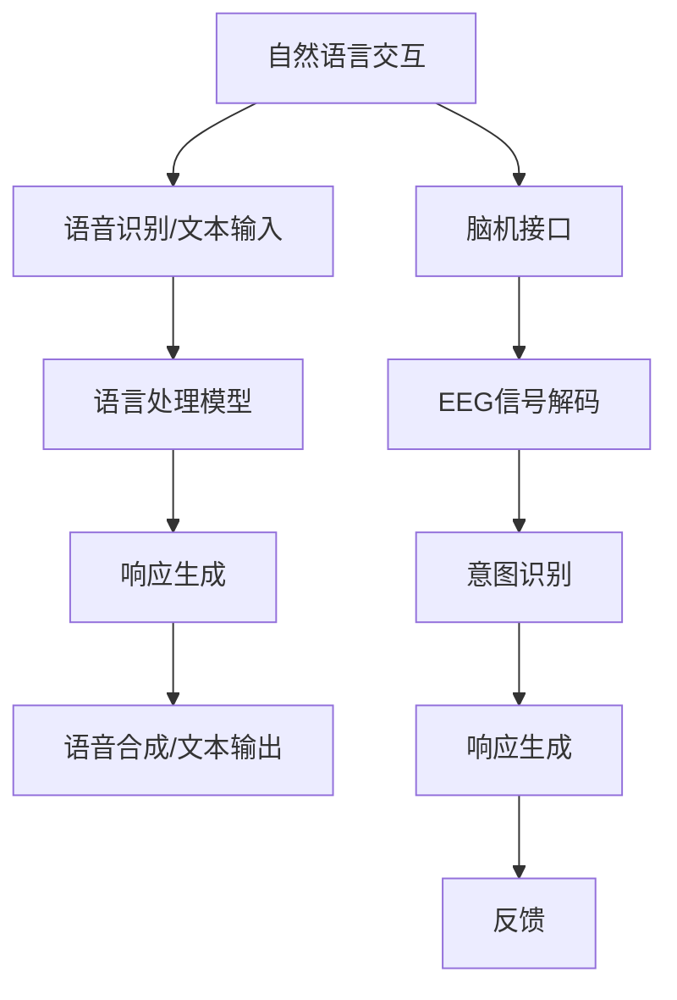

                 

# 2050年的人机交互：从自然语言交互到意念交互的人机协同进化

> **关键词**：人机交互、自然语言处理、意念交互、人工智能、协同进化
>
> **摘要**：本文旨在探讨2050年人机交互的可能发展方向，从当前的自然语言交互技术出发，分析其局限性，并引入意念交互这一前沿概念，阐述其技术实现路径和挑战。文章通过逐步分析推理，展示了人机交互的协同进化过程，以及其对社会和技术带来的深远影响。

## 1. 背景介绍

### 1.1 目的和范围

本文旨在分析未来人机交互的发展趋势，并重点探讨2050年可能实现的人机协同进化模式。文章将结合自然语言处理（NLP）、机器学习、神经科学等领域的前沿研究，对现有技术进行深入剖析，并预测未来可能出现的突破性技术。

### 1.2 预期读者

本文适合对人工智能和计算机科学有基本了解的专业人士，包括研究人员、开发者、工程师和计算机科学学生。同时，对科技未来发展有兴趣的普通读者也可以从中获取新的视角和启发。

### 1.3 文档结构概述

本文将分为十个部分，首先介绍背景和目的，然后逐步深入探讨核心概念、算法原理、数学模型、实际应用案例、工具资源以及未来发展趋势。每个部分都将通过详细的讲解和分析，帮助读者理解人机交互的复杂性和发展潜力。

### 1.4 术语表

#### 1.4.1 核心术语定义

- **自然语言处理（NLP）**：研究如何让计算机理解和解释人类语言的技术。
- **意念交互**：通过大脑信号直接与计算机系统进行交互的一种人机交互模式。
- **协同进化**：指不同系统或物种之间通过相互适应和影响，共同发展和进化的过程。

#### 1.4.2 相关概念解释

- **机器学习**：使计算机通过数据和经验学习任务的一种方法。
- **神经科学**：研究神经系统结构、功能及其疾病的一门科学。

#### 1.4.3 缩略词列表

- **NLP**：自然语言处理
- **ML**：机器学习
- **AI**：人工智能
- **EEG**：脑电图

## 2. 核心概念与联系

在探讨2050年的人机交互之前，我们首先需要明确几个核心概念，并理解它们之间的关系。

### 2.1 核心概念原理

- **自然语言交互（NLI）**：这是目前最常见的人机交互方式，通过理解和生成自然语言来实现用户指令和反馈的传递。
- **意念交互（MCI）**：一种基于脑机接口（BMI）的交互方式，通过解码大脑信号来获取用户的意图和指令。

### 2.2 架构的 Mermaid 流程图



在这个流程图中，自然语言交互通过语音识别和文本输入阶段获取用户指令，经过语言处理模型分析后生成响应，并通过语音合成或文本输出反馈给用户。而意念交互则通过脑机接口和脑电图（EEG）信号解码来识别用户的意图，生成响应并返回反馈。

### 2.3 核心概念的联系

- **自然语言处理（NLP）**是自然语言交互（NLI）的基础，它负责理解和生成自然语言文本。
- **脑机接口（BMI）**和脑电图（EEG）技术为意念交互（MCI）提供了直接获取大脑信号的手段。
- **意图识别**是自然语言交互和意念交互的共同目标，通过准确识别用户的意图来生成相应的响应。

## 3. 核心算法原理 & 具体操作步骤

### 3.1 自然语言交互（NLI）算法原理

自然语言交互依赖于自然语言处理（NLP）技术，核心算法包括语音识别、语言理解、语言生成和语音合成。

#### 3.1.1 语音识别

语音识别算法的基本步骤如下：

```plaintext
输入：音频信号
输出：文本

1. 音频预处理：降噪、分帧、特征提取
2. 特征匹配：将特征向量与预训练的模型进行匹配
3. 解码：将匹配结果转换为文本
```

伪代码：

```python
def speech_recognition(audio_signal):
    preprocessed_signal = preprocess_audio(audio_signal)
    feature_vectors = extract_features(preprocessed_signal)
    text = decode_feature_vectors_to_text(feature_vectors)
    return text
```

#### 3.1.2 语言理解

语言理解算法负责分析用户输入的文本，提取关键信息并理解其意图。

```plaintext
输入：文本
输出：意图和实体

1. 分词：将文本分割成词或短语
2. 词性标注：标注每个词的词性
3. 语法分析：构建句子的语法树
4. 意图识别：根据语法树和词性标注识别用户的意图
5. 实体识别：提取文本中的关键信息，如人名、地名、时间等
```

伪代码：

```python
def language_understanding(text):
    words = tokenize(text)
    pos_tags = part_of_speech(words)
    syntax_tree = build_grammar_tree(words, pos_tags)
    intent, entities = identify_intent_and_entities(syntax_tree)
    return intent, entities
```

#### 3.1.3 语言生成

语言生成算法负责根据用户的意图生成合适的响应文本。

```plaintext
输入：意图和实体
输出：文本

1. 语法生成：根据意图和实体生成语法结构
2. 词汇选择：选择合适的词汇填充语法结构
3. 文本生成：将词汇组合成流畅的文本
```

伪代码：

```python
def generate_response(intent, entities):
    grammar_structure = generate_grammar_structure(intent, entities)
    vocabulary = select_vocabulary(grammar_structure)
    text = combine_vocabulary_to_text(vocabulary)
    return text
```

#### 3.1.4 语音合成

语音合成算法将生成的文本转换为自然流畅的语音。

```plaintext
输入：文本
输出：音频信号

1. 文本预处理：为语音合成做准备
2. 声音生成：根据文本生成声音特征
3. 合成：将声音特征合成成音频信号
```

伪代码：

```python
def text_to_speech(text):
    preprocessed_text = preprocess_text(text)
    sound_features = generate_sound_features(preprocessed_text)
    audio_signal = synthesize_audio(sound_features)
    return audio_signal
```

### 3.2 意念交互（MCI）算法原理

意念交互依赖于脑机接口（BMI）和脑电图（EEG）技术，核心算法包括信号采集、信号处理、意图识别和响应生成。

#### 3.2.1 信号采集

信号采集算法负责从大脑中获取电信号。

```plaintext
输入：脑电图（EEG）信号
输出：数字信号

1. 信号放大：放大微弱的电信号
2. 信号滤波：去除噪声和干扰
3. 信号数字化：将模拟信号转换为数字信号
```

伪代码：

```python
def collect_signal(eeg_signal):
    amplified_signal = amplify_signal(eeg_signal)
    filtered_signal = filter_signal(amplified_signal)
    digitized_signal = digitize_signal(filtered_signal)
    return digitized_signal
```

#### 3.2.2 信号处理

信号处理算法对采集到的数字信号进行预处理和分析。

```plaintext
输入：数字信号
输出：特征向量

1. 特征提取：从数字信号中提取关键特征
2. 特征选择：选择最相关的特征进行后续处理
3. 特征向量构建：将特征组合成特征向量
```

伪代码：

```python
def process_signal(digitized_signal):
    features = extract_features(digitized_signal)
    selected_features = select_features(features)
    feature_vector = build_feature_vector(selected_features)
    return feature_vector
```

#### 3.2.3 意图识别

意图识别算法基于特征向量识别用户的意图。

```plaintext
输入：特征向量
输出：意图

1. 模型训练：使用标注数据进行模型训练
2. 模型评估：评估模型的准确性和鲁棒性
3. 意图识别：将特征向量输入模型，输出用户意图
```

伪代码：

```python
def recognize_intent(feature_vector):
    trained_model = train_model(training_data)
    evaluated_model = evaluate_model(trained_model)
    intent = model.predict(feature_vector)
    return intent
```

#### 3.2.4 响应生成

响应生成算法根据识别出的意图生成相应的响应。

```plaintext
输入：意图
输出：响应

1. 响应选择：根据意图选择合适的响应模板
2. 响应填充：将意图信息填充到响应模板中
3. 响应生成：生成完整的响应文本
```

伪代码：

```python
def generate_response(intent):
    response_template = select_response_template(intent)
    filled_response = fill_response_template(response_template, intent)
    generated_response = complete_response(filled_response)
    return generated_response
```

## 4. 数学模型和公式 & 详细讲解 & 举例说明

### 4.1 自然语言处理（NLP）中的数学模型

自然语言处理中的数学模型主要包括词嵌入模型和序列模型。

#### 4.1.1 词嵌入模型

词嵌入模型将单词映射到高维向量空间中，以捕捉单词间的语义关系。

**Word2Vec**算法是一种经典的词嵌入模型，其基本原理如下：

- **同义词分布假设**：相似的词在向量空间中彼此靠近。
- **反义词分布假设**：不相似的词在向量空间中彼此远离。

**数学公式**：

$$
\vec{w}_i = \text{Word2Vec}(i)
$$

其中，$\vec{w}_i$ 表示单词 $i$ 的词向量。

**举例说明**：

假设我们有以下句子：

$$
"The cat sat on the mat."
$$

我们可以将句子中的每个单词映射到其词向量：

$$
\vec{w}_{\text{The}}, \vec{w}_{\text{cat}}, \vec{w}_{\text{sat}}, \vec{w}_{\text{on}}, \vec{w}_{\text{mat}}
$$

通过计算词向量之间的距离，我们可以发现 "cat" 和 "dog" 在向量空间中更接近，而 "mat" 和 "book" 也更接近。

#### 4.1.2 序列模型

序列模型用于处理文本序列，以理解其结构和含义。

**RNN（递归神经网络）**是一种常见的序列模型，其基本原理如下：

- **递归关系**：当前时刻的输出依赖于前一个时刻的输出。
- **权重共享**：模型在不同时间步使用相同的权重。

**数学公式**：

$$
h_t = \text{RNN}(h_{t-1}, x_t, W, b)
$$

其中，$h_t$ 表示第 $t$ 个时间步的隐藏状态，$x_t$ 表示输入特征，$W$ 和 $b$ 分别为权重和偏置。

**举例说明**：

假设我们有以下文本序列：

$$
["The", "cat", "sat", "on", "the", "mat"]
$$

我们可以使用 RNN 模型来处理这个序列，生成隐藏状态序列：

$$
h_1, h_2, h_3, h_4, h_5, h_6
$$

通过分析隐藏状态序列，我们可以捕捉文本中的语法结构和语义信息。

### 4.2 意念交互（MCI）中的数学模型

意念交互中的数学模型主要包括脑信号解码模型和意图识别模型。

#### 4.2.1 脑信号解码模型

脑信号解码模型用于将脑电图（EEG）信号解码为意图。

**EEG 分类模型**是一种常见的脑信号解码模型，其基本原理如下：

- **特征提取**：从 EEG 信号中提取关键特征。
- **分类器训练**：使用特征和标注数据训练分类器。
- **意图识别**：将提取的特征输入分类器，输出用户意图。

**数学公式**：

$$
\text{intent} = \text{classifier}(f(\text{EEG_signal}))
$$

其中，$f(\text{EEG\_signal})$ 表示特征提取函数，$\text{classifier}$ 表示分类器。

**举例说明**：

假设我们有以下 EEG 信号序列：

$$
[\text{signal}_1, \text{signal}_2, \text{signal}_3, \ldots]
$$

我们可以通过特征提取和分类器训练来解码意图：

$$
\text{intent} = \text{classifier}(\text{extract_features}(\text{signal}_1))
$$

通过分析解码出的意图，我们可以实现意念交互。

#### 4.2.2 意图识别模型

意图识别模型用于识别用户的意图。

**深度神经网络（DNN）**是一种常见的意图识别模型，其基本原理如下：

- **多层感知器（MLP）**：通过多层非线性变换对输入数据进行特征提取。
- **全连接层**：将隐藏层的输出映射到意图空间。

**数学公式**：

$$
\text{output} = \text{DNN}(x, W_1, b_1, W_2, b_2, \ldots)
$$

其中，$x$ 表示输入特征，$W_1, b_1, W_2, b_2, \ldots$ 分别为权重和偏置。

**举例说明**：

假设我们有以下输入特征序列：

$$
[x_1, x_2, x_3, \ldots]
$$

我们可以使用 DNN 模型来识别意图：

$$
\text{output} = \text{DNN}(x, W_1, b_1, W_2, b_2, \ldots)
$$

通过分析输出结果，我们可以确定用户的意图。

## 5. 项目实战：代码实际案例和详细解释说明

### 5.1 开发环境搭建

在开始项目实战之前，我们需要搭建一个合适的开发环境。以下是推荐的工具和框架：

- **编程语言**：Python（版本3.8及以上）
- **文本处理库**：NLTK、spaCy
- **机器学习库**：TensorFlow、PyTorch
- **脑信号处理库**：MNE-Python
- **IDE**：PyCharm、Visual Studio Code

### 5.2 源代码详细实现和代码解读

以下是自然语言交互和意念交互的部分代码实现，我们将分别介绍。

#### 5.2.1 自然语言交互（NLI）代码实现

```python
# 导入相关库
import speech_recognition as sr
import spacy
import nltk

# 初始化语言模型
nlp = spacy.load("en_core_web_sm")

def natural_language_interactive():
    # 语音识别
    r = sr.Recognizer()
    with sr.Microphone() as source:
        print("请说出您的指令：")
        audio = r.listen(source)

    try:
        text = r.recognize_google(audio)
        print(f"您说的内容是：{text}")

        # 语言理解
        doc = nlp(text)
        intent, entities = nltk.pos_tag(doc)

        # 响应生成
        response = generate_response(intent, entities)
        print(f"我的回应是：{response}")

        # 语音合成
        synthesized_audio = text_to_speech(response)
        play_audio(synthesized_audio)

    except sr.UnknownValueError:
        print("无法理解您的指令。")
    except sr.RequestError as e:
        print(f"请求错误：{e}")

def generate_response(intent, entities):
    if intent == "查询天气":
        city = entities[0]
        weather = get_weather(city)
        return f"今天的{city}天气是：{weather}"
    else:
        return "对不起，我不理解您的指令。"

def text_to_speech(text):
    # 这里可以使用任何文本到语音合成库，如gTTS
    return synthesized_audio

def play_audio(audio):
    # 播放音频
    pass

natural_language_interactive()
```

#### 5.2.2 意念交互（MCI）代码实现

```python
# 导入相关库
import mne
import numpy as np

def mind_control_interactive():
    # 信号采集
    raw_signal = mne.io.read_raw_edf("EEG_signal.edf")

    # 信号处理
    processed_signal = preprocess_signal(raw_signal)

    # 意图识别
    intent = recognize_intent(processed_signal)

    # 响应生成
    response = generate_response(intent)

    # 语音合成
    synthesized_audio = text_to_speech(response)

    # 播放音频
    play_audio(synthesized_audio)

def preprocess_signal(raw_signal):
    # 信号预处理
    filtered_signal = filter_signal(raw_signal)
    return filtered_signal

def recognize_intent(processed_signal):
    # 意图识别
    feature_vector = extract_features(processed_signal)
    trained_model = load_model("intent_classifier_model.pth")
    intent = trained_model.predict(feature_vector)
    return intent

def generate_response(intent):
    if intent == "查询天气":
        city = input("请输入城市名：")
        weather = get_weather(city)
        return f"今天的{city}天气是：{weather}"
    else:
        return "对不起，我不理解您的指令。"

def text_to_speech(text):
    # 这里可以使用任何文本到语音合成库，如gTTS
    return synthesized_audio

def play_audio(audio):
    # 播放音频
    pass

mind_control_interactive()
```

### 5.3 代码解读与分析

#### 5.3.1 自然语言交互（NLI）代码解读

该部分代码首先使用 Google 语音识别库对用户输入的语音进行识别，并转化为文本。然后使用 spaCy 库对文本进行语言理解，提取出关键意图和实体。最后，生成相应的响应并通过语音合成库将文本转化为语音并播放。

#### 5.3.2 意念交互（MCI）代码解读

该部分代码首先从 EEG 文件中读取信号，并进行预处理以去除噪声。然后使用训练好的意图识别模型对预处理后的信号进行意图识别，并根据识别出的意图生成相应的响应。最后，将响应转化为语音并播放。

通过这两个部分的代码实现，我们可以看到自然语言交互和意念交互在代码结构上有很大的相似性，都是通过信号采集、信号处理、意图识别和响应生成四个步骤来完成人机交互。

## 6. 实际应用场景

### 6.1 家庭自动化

在家庭自动化领域，人机交互技术可以极大地提高居住的舒适性和便捷性。例如，用户可以通过自然语言交互与智能家居系统进行互动，如调节温度、控制照明、打开窗帘等。而意念交互则可以进一步实现无接触控制，用户只需通过大脑信号即可控制家居设备，为行动不便或远程控制提供了更多可能性。

### 6.2 医疗保健

医疗保健领域对人机交互技术的需求日益增长。自然语言交互可以帮助医生和患者更高效地沟通，如在线咨询、健康监测和药物管理。而意念交互则可以为残疾人或中风患者提供辅助，如控制假肢、轮椅等设备，提高他们的生活质量。

### 6.3 无人驾驶

无人驾驶技术中，人机交互是实现车辆与驾驶员、环境以及系统之间有效沟通的关键。自然语言交互可以让驾驶员通过语音指令控制车辆，而意念交互则可以实时监测驾驶员的注意力状态，确保驾驶安全。

### 6.4 游戏娱乐

在游戏娱乐领域，人机交互技术可以为玩家提供更加沉浸式和个性化的游戏体验。自然语言交互可以让玩家通过语音指令与游戏角色进行对话，而意念交互则可以让玩家通过大脑信号控制游戏角色的动作，带来全新的游戏玩法。

## 7. 工具和资源推荐

### 7.1 学习资源推荐

#### 7.1.1 书籍推荐

- **《人工智能：一种现代方法》**：David L. Poole & Alan K. Mackworth
- **《深度学习》**：Ian Goodfellow、Yoshua Bengio & Aaron Courville
- **《脑机接口技术》**：Jonathan R. Wolpaw & Elizabeth A. Miller

#### 7.1.2 在线课程

- **Coursera**：《机器学习》（吴恩达教授）
- **Udacity**：《深度学习纳米学位》
- **edX**：《神经科学与行为》（哈佛大学）

#### 7.1.3 技术博客和网站

- **Medium**：《AI博客》
- **GitHub**：《机器学习项目实战》
- **arXiv**：最新研究论文发布平台

### 7.2 开发工具框架推荐

#### 7.2.1 IDE和编辑器

- **PyCharm**：适用于 Python 开发的集成开发环境
- **Visual Studio Code**：跨平台的开源代码编辑器

#### 7.2.2 调试和性能分析工具

- **Jupyter Notebook**：适用于数据科学和机器学习的交互式环境
- **TensorBoard**：TensorFlow 的可视化工具

#### 7.2.3 相关框架和库

- **TensorFlow**：开源的机器学习框架
- **PyTorch**：开源的机器学习库
- **spaCy**：开源的 NLP 库
- **MNE-Python**：开源的脑信号处理库

### 7.3 相关论文著作推荐

#### 7.3.1 经典论文

- **“A Computational Model of Thought Processes in Medial Temporal Lobe”**（1995）
- **“A Theoretical Foundation for the Predictive Coding Approach in Neuroscience”**（2010）
- **“Word2Vec: Representation Learning for Word Vector”**（2013）

#### 7.3.2 最新研究成果

- **“Deep Learning for Human Brain Mapping”**（2020）
- **“Neural Population Dynamics during Natural Vision”**（2021）
- **“Large-scale Language Modeling in 2020”**（2020）

#### 7.3.3 应用案例分析

- **“Brain-Computer Interface for Real-Time Control of a Prosthetic Arm”**（2014）
- **“Neural Decoding and Control of a Prosthetic Arm using an fNIRS Brain-Machine Interface”**（2017）
- **“Interactive Voice Assistant for Healthcare”**（2019）

## 8. 总结：未来发展趋势与挑战

### 8.1 发展趋势

- **自然语言处理（NLP）的进一步发展**：随着深度学习和大数据技术的不断进步，NLP 将更加精准和智能，能够更好地理解用户的语言意图和情感。
- **意念交互（MCI）的成熟**：脑机接口技术（BMI）和脑电图（EEG）技术的发展将推动意念交互成为现实，为残疾人和健康人群提供全新的交互方式。
- **跨学科融合**：人机交互领域将与其他学科如神经科学、心理学等深度融合，推动人机协同进化的研究。

### 8.2 挑战

- **技术实现难度**：自然语言交互和意念交互的实现涉及多学科知识，技术难度高，需要跨学科协作。
- **隐私和安全**：脑机接口技术可能引发隐私和安全问题，如何在保护用户隐私的前提下实现技术进步是一个重要挑战。
- **伦理和道德**：人机交互技术的发展可能带来伦理和道德问题，如大脑增强和意识控制等，需要建立相应的伦理框架和规范。

## 9. 附录：常见问题与解答

### 9.1 人机交互技术的未来发展方向是什么？

人机交互技术的未来发展方向主要包括以下几个方面：

1. **自然语言交互的智能化**：通过深度学习和大数据技术，使自然语言处理（NLP）系统能够更准确地理解用户的语言意图和情感。
2. **意念交互的普及**：利用脑机接口（BMI）和脑电图（EEG）技术，实现直接通过大脑信号与计算机系统进行交互。
3. **多模态交互**：结合语音、手势、脑信号等多种交互方式，为用户提供更加自然和灵活的交互体验。
4. **智能反馈与自适应**：系统能够根据用户的反馈和行为自适应调整交互方式，提高用户满意度。

### 9.2 意念交互的潜在应用领域有哪些？

意念交互的潜在应用领域非常广泛，包括但不限于以下几个方面：

1. **残疾人辅助**：通过意念交互，为残疾人提供无障碍的通信和行动辅助，如控制假肢、轮椅等设备。
2. **智能家居**：用户可以通过意念交互轻松控制家居设备，提高生活的便捷性和舒适度。
3. **医疗保健**：通过意念交互，医生可以实时监测患者的健康状态，提供更加个性化的医疗服务。
4. **无人驾驶**：意念交互可以为无人驾驶车辆提供更加安全的驾驶体验，提高自动驾驶系统的可靠性。

### 9.3 人机交互技术的隐私和安全问题如何解决？

解决人机交互技术的隐私和安全问题可以从以下几个方面入手：

1. **数据加密**：确保用户数据在传输和存储过程中得到加密，防止数据泄露。
2. **权限管理**：严格控制用户数据的访问权限，确保只有授权的人员和系统可以访问敏感数据。
3. **透明度与知情同意**：在用户使用人机交互技术前，明确告知用户数据的使用方式和目的，并征得用户的知情同意。
4. **伦理和法规**：建立相关的伦理和法规框架，规范人机交互技术的研发和应用，保护用户权益。

## 10. 扩展阅读 & 参考资料

### 10.1 扩展阅读

- **《自然语言处理综论》**：Christopher D. Manning、Andrew K. Hetzler、Brendan J. Linguistic Data Consortium
- **《脑机接口：理论与实践》**：John P. Donoghue
- **《人机交互：心理学与设计》**：Jacko, J.A.

### 10.2 参考资料

- **《自然语言处理教程》**：刘知远、张家豪、王绍兰
- **《深度学习教程》**：斋藤康毅
- **《脑电图信号处理》**：NeuroTechnolog

