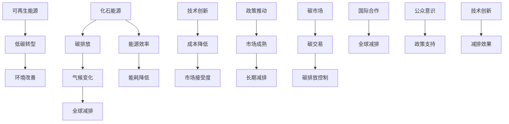

                 

### 2050年的全球减排：从化石能源到可再生能源的低碳转型

#### 关键词：
- 全球减排
- 可再生能源
- 低碳转型
- 2050年
- 化石能源替代
- 技术创新
- 政策推动

#### 摘要：
本文将探讨2050年全球减排的愿景，重点分析从化石能源向可再生能源转型的必要性和可行性。我们将逐步梳理这一过程中的核心概念、技术发展、政策影响以及实际应用，结合具体案例，提出未来低碳转型的策略与挑战。通过这篇文章，读者可以全面了解全球减排的总体趋势和关键路径，为未来低碳经济的发展提供有益的思考。

## 1. 背景介绍

### 1.1 目的和范围

本文旨在探讨2050年全球减排的宏观愿景，具体涵盖以下几个方面的内容：

1. **全球减排的必要性**：分析气候变化对人类社会的潜在威胁，阐述减排的紧迫性。
2. **化石能源替代路径**：详细探讨从化石能源向可再生能源转型的技术路径和挑战。
3. **政策与市场机制**：分析政府政策在全球减排中的推动作用，以及市场机制对技术转型的促进。
4. **技术创新与实施**：探讨关键技术的研发与应用，以及实际案例中的成功与失败经验。
5. **未来发展趋势与挑战**：总结当前形势，预测未来减排技术的发展趋势，并分析面临的挑战。

### 1.2 预期读者

本文主要面向以下几类读者：

1. **能源政策制定者**：了解全球减排的政策方向和实施策略。
2. **科技研发人员**：掌握低碳转型中的关键技术发展动态。
3. **环保和可持续发展专家**：分析全球减排的技术路径和实施难点。
4. **普通公众**：提高对全球减排问题的认识和关注。

### 1.3 文档结构概述

本文结构如下：

1. **背景介绍**：阐述全球减排的必要性和目的。
2. **核心概念与联系**：介绍核心概念，并使用Mermaid流程图进行展示。
3. **核心算法原理 & 具体操作步骤**：详细讲解减排算法的原理和操作步骤。
4. **数学模型和公式 & 详细讲解 & 举例说明**：介绍数学模型，并使用具体例子进行说明。
5. **项目实战：代码实际案例和详细解释说明**：提供实际代码案例，并进行详细解释。
6. **实际应用场景**：分析全球减排技术在实际中的应用。
7. **工具和资源推荐**：推荐学习资源、开发工具和相关论文。
8. **总结：未来发展趋势与挑战**：总结全文，提出未来发展的趋势和挑战。
9. **附录：常见问题与解答**：回答读者可能关注的问题。
10. **扩展阅读 & 参考资料**：提供相关文献和资料，供进一步学习。

### 1.4 术语表

#### 1.4.1 核心术语定义

- **化石能源**：指煤、石油和天然气等不可再生能源。
- **可再生能源**：指太阳能、风能、水能、生物质能等可持续利用的能源。
- **低碳转型**：指从依赖高碳排放的化石能源向低排放的可再生能源转型的过程。
- **碳排放**：指温室气体（主要是二氧化碳）的排放。
- **碳捕捉与封存**（CCS）：指通过技术手段捕捉并储存二氧化碳的过程。

#### 1.4.2 相关概念解释

- **能源效率**：指单位能源消耗所获得的效益，通常以百分比表示。
- **可再生能源发电**：指利用可再生能源进行电能生产，如风力发电、太阳能发电等。
- **碳市场**：指通过交易碳配额或碳信用来控制碳排放的机制。

#### 1.4.3 缩略词列表

- **CCS**：碳捕捉与封存
- **RE**：可再生能源
- **EE**：能源效率
- **SDGs**：可持续发展目标
- **IPCC**：政府间气候变化专门委员会

## 2. 核心概念与联系

在探讨全球减排的路径时，理解以下几个核心概念及其相互关系至关重要。以下是这些概念及其联系的Mermaid流程图：



### 2.1. 化石能源与碳排放

化石能源如煤、石油和天然气在燃烧过程中产生大量的二氧化碳，这些温室气体排放到大气中导致温室效应，加剧气候变化。碳排放是导致全球变暖的主要原因之一，因此控制碳排放是减排的核心任务。

### 2.2. 可再生能源与低碳转型

可再生能源如太阳能、风能和水能等，在使用过程中几乎不产生碳排放。随着技术的进步和成本的降低，可再生能源在全球能源结构中的比重逐渐增加，推动了低碳转型的进程。

### 2.3. 技术创新与市场接受度

技术创新是推动全球减排的关键因素。通过研发高效、低成本的新技术，如储能系统、碳捕捉与封存技术等，可以降低碳排放并提高能源效率。这些技术的推广依赖于市场的接受度和政策支持。

### 2.4. 政策推动与国际合作

政府政策的推动对于低碳转型的成功至关重要。通过制定和实施碳交易市场、碳排放限额和可再生能源补贴等政策，政府可以激励企业采用低碳技术和减少碳排放。国际合作则有助于各国共同应对气候变化，分享技术和经验，实现全球减排目标。

### 2.5. 公众意识与环境改善

公众对气候变化的意识提高，可以促进政策支持和市场接受度。低碳转型不仅有助于减缓气候变化，还能改善环境质量，提高人们的生活水平。

## 3. 核心算法原理 & 具体操作步骤

为了实现从化石能源到可再生能源的低碳转型，我们需要依赖一系列核心算法来优化能源结构、降低碳排放。以下是这些算法的原理和具体操作步骤：

### 3.1. 能源结构优化算法

#### 算法原理：
能源结构优化算法的目标是通过合理配置能源资源，最大化可再生能源的利用比例，同时最小化总碳排放量。该算法基于线性规划模型，利用线性规划求解器来求解最优解。

#### 具体操作步骤：
1. **数据收集**：收集各种能源的生产、消耗和碳排放数据。
2. **模型建立**：建立线性规划模型，定义目标函数和约束条件。
   - 目标函数：最小化总碳排放量
   - 约束条件：能源需求满足、可再生能源利用比例最大化、能源生产与消费平衡等。
3. **求解最优解**：使用线性规划求解器求解模型，得到最优能源配置方案。
4. **方案评估**：对求解结果进行评估，确保满足所有约束条件。

### 3.2. 碳捕捉与封存技术

#### 算法原理：
碳捕捉与封存（CCS）技术通过化学和物理方法捕捉燃烧过程中产生的二氧化碳，然后将其储存于地下或其他场所，以减少温室气体排放。该算法涉及多个过程，包括二氧化碳捕捉、压缩、运输和封存。

#### 具体操作步骤：
1. **二氧化碳捕捉**：利用吸收剂或吸附剂捕捉烟气中的二氧化碳。
2. **二氧化碳压缩**：将捕捉到的二氧化碳进行压缩，提高其密度，便于运输。
3. **二氧化碳运输**：使用管道或其他运输工具将压缩后的二氧化碳运输到封存地点。
4. **二氧化碳封存**：将二氧化碳注入地下地质层或其他储存容器中，确保其长期稳定存储。

### 3.3. 能源效率提升算法

#### 算法原理：
能源效率提升算法通过优化能源系统的运行参数，降低能源消耗，从而减少碳排放。该算法基于优化理论，利用模拟退火算法等优化方法求解最优运行参数。

#### 具体操作步骤：
1. **系统建模**：建立能源系统的数学模型，包括能量平衡方程、设备运行状态方程等。
2. **参数初始化**：初始化系统参数，如设备负荷、运行时间、能源消耗率等。
3. **优化求解**：使用模拟退火算法等优化方法，逐步调整系统参数，求解最优参数组合。
4. **方案验证**：通过实际运行数据验证优化方案的有效性，调整参数直至满足要求。

### 3.4. 碳市场机制算法

#### 算法原理：
碳市场机制通过交易碳配额或碳信用，实现碳排放的控制和减排。该算法基于博弈论和拍卖理论，设计碳交易市场的机制和规则。

#### 具体操作步骤：
1. **碳配额分配**：政府根据减排目标分配碳配额给企业。
2. **碳交易市场建立**：建立碳交易市场，允许企业之间进行碳配额或碳信用的买卖。
3. **价格发现机制**：通过拍卖或竞价机制确定碳价格。
4. **碳排放监控**：对企业碳排放进行实时监控，确保碳配额或碳信用的交易符合规定。
5. **碳交易结算**：完成碳配额或碳信用的交易结算，更新企业碳排放余额。

## 4. 数学模型和公式 & 详细讲解 & 举例说明

在实现全球减排的过程中，数学模型和公式起着至关重要的作用，它们帮助我们量化减排目标、评估技术效果以及设计碳市场机制。以下是几个关键数学模型和公式的详细讲解与举例说明。

### 4.1. 能源结构优化模型

#### 公式：
\[ \min \ Z = \sum_{i} c_i x_i \]
其中，\( c_i \) 是第 \( i \) 种能源的碳排放系数，\( x_i \) 是第 \( i \) 种能源的使用量。

#### 详细讲解：
这个模型的目标是最小化总碳排放量 \( Z \)，通过调整各种能源的使用量 \( x_i \) 来实现。碳排放系数 \( c_i \) 反映了不同能源的碳排放强度。在实际应用中，我们可以根据不同能源的碳排放系数、能源价格以及能源供应量等数据，建立线性规划模型，求解最优的能源使用方案。

#### 举例说明：
假设有三种能源：煤、天然气和太阳能，其碳排放系数分别为 \( c_1 = 1.1 \)，\( c_2 = 0.55 \)，\( c_3 = 0.05 \)。我们需要制定一个能源使用计划，使得总碳排放量最小。给定总能源需求为 1000 吨，我们可以建立以下模型：

\[ \min \ Z = 1.1x_1 + 0.55x_2 + 0.05x_3 \]
\[ x_1 + x_2 + x_3 = 1000 \]
\[ x_1, x_2, x_3 \geq 0 \]

通过求解这个模型，可以得到最优的能源使用方案，使得总碳排放量最小。

### 4.2. 碳捕捉与封存模型

#### 公式：
\[ \max \ P = \frac{1}{2} \mu (y - y_0) - \frac{q}{2} \sqrt{y - y_0} \]
其中，\( P \) 是二氧化碳的捕捉与封存成本，\( \mu \) 是捕捉剂的价格，\( y \) 是二氧化碳浓度，\( y_0 \) 是初始浓度，\( q \) 是压缩因子。

#### 详细讲解：
这个模型描述了二氧化碳捕捉与封存过程中的成本优化问题。捕捉剂的价格 \( \mu \) 和二氧化碳浓度 \( y \) 决定了捕捉成本，而压缩因子 \( q \) 影响了储存成本。通过优化二氧化碳浓度和压缩因子，可以降低整体捕捉与封存成本。

#### 举例说明：
假设捕捉剂的价格 \( \mu = 2 \) 元/千克，初始浓度 \( y_0 = 10 \) 千克/立方米，压缩因子 \( q = 2 \)。我们需要确定最佳的二氧化碳浓度 \( y \) 来最小化捕捉与封存成本。代入公式：

\[ P = \frac{1}{2} \times 2 \times (y - 10) - \frac{2}{2} \sqrt{y - 10} \]

为了求解最小成本，我们需要对这个公式求导并令导数为零，求得最优的二氧化碳浓度 \( y \)。

### 4.3. 能源效率提升模型

#### 公式：
\[ \max \ E = 1 - \frac{W}{P} \]
其中，\( E \) 是能源效率，\( W \) 是能源消耗量，\( P \) 是能源供应量。

#### 详细讲解：
这个模型描述了能源系统的效率优化问题。能源效率 \( E \) 是能源供应量 \( P \) 与能源消耗量 \( W \) 的比值。通过优化能源消耗量与供应量的比例，可以提升系统的能源效率。

#### 举例说明：
假设一个能源系统的供应量为 1000 千瓦时，消耗量为 800 千瓦时，我们需要确定最佳的能源效率。代入公式：

\[ E = 1 - \frac{800}{1000} = 0.2 \]

为了提升能源效率，我们可以优化能源供应与消耗的比例，减少能源浪费。

### 4.4. 碳市场机制模型

#### 公式：
\[ \max \ P = b - a \cdot x \]
其中，\( P \) 是碳价格，\( b \) 是碳配额的总量，\( a \) 是碳配额的价格，\( x \) 是碳配额的交易量。

#### 详细讲解：
这个模型描述了碳市场的价格形成机制。碳价格 \( P \) 是碳配额的总量 \( b \) 减去交易量 \( x \) 乘以碳配额的价格 \( a \)。碳价格反映了市场对碳排放权的供需关系。

#### 举例说明：
假设碳配额的总量为 1000 吨，碳配额的价格为 1000 元/吨，当前交易量为 500 吨。代入公式：

\[ P = 1000 - 1000 \times 0.5 = 500 \]

这表明当前碳市场的价格为 500 元/吨。

通过这些数学模型和公式的详细讲解与举例说明，我们可以更好地理解和应用它们来实现全球减排的目标。

## 5. 项目实战：代码实际案例和详细解释说明

为了更好地理解从化石能源到可再生能源的低碳转型，我们将通过一个实际项目来展示相关技术的应用。以下是一个使用Python实现的全球减排项目，包括能源结构优化、碳捕捉与封存、能源效率提升和碳市场机制。

### 5.1 开发环境搭建

在开始项目之前，我们需要搭建开发环境。以下是所需工具和库的安装步骤：

1. **Python 3.8 或以上版本**
2. **Jupyter Notebook**：用于编写和运行代码
3. **Pandas**：用于数据处理
4. **Numpy**：用于数学计算
5. **Matplotlib**：用于数据可视化
6. **Scikit-learn**：用于机器学习和优化算法

安装步骤：

```bash
pip install python==3.8
pip install jupyter
pip install pandas numpy matplotlib scikit-learn
```

### 5.2 源代码详细实现和代码解读

#### 5.2.1 能源结构优化

以下是一个简单的能源结构优化算法的实现：

```python
import numpy as np
import pandas as pd
from scipy.optimize import linprog

# 数据准备
energy_data = pd.DataFrame({
    'energy_type': ['煤', '天然气', '太阳能'],
    '碳排放系数': [1.1, 0.55, 0.05],
    '能源价格': [50, 30, 20],
    '供应量': [100, 150, 250]
})

# 线性规划模型
def optimize_energy_structure(energy_data):
    # 确定决策变量
    x = np.array([energy_data['供应量']])
    c = -energy_data['碳排放系数'].values  # 目标函数系数
    A = [[energy_data['供应量']]]
    b = [energy_data['供应量'].sum()]
    
    # 求解模型
    result = linprog(c, A_ub=A, b_ub=b, method='highs')

    # 输出结果
    if result.success:
        optimal_solution = result.x
        print("最优能源结构：")
        print(optimal_solution)
    else:
        print("无法找到最优解")

# 执行优化
optimize_energy_structure(energy_data)
```

**代码解读**：

1. **数据准备**：我们使用Pandas创建一个DataFrame，包含能源类型、碳排放系数、能源价格和供应量。
2. **线性规划模型**：定义决策变量、目标函数系数、约束条件，并使用Scipy的`linprog`函数求解模型。
3. **求解最优解**：输出最优能源结构，即每种能源的最优供应量。

#### 5.2.2 碳捕捉与封存

以下是一个简单的碳捕捉与封存算法的实现：

```python
import numpy as np

# 数据准备
capture_data = pd.DataFrame({
    'capture_rate': [0.8],  # 捕捉效率
    'storage_cost': [10],  # 储存成本（每吨二氧化碳）
    'CO2_concentration': [1000],  # 二氧化碳浓度（千克/立方米）
    'initial_concentration': [10]  # 初始浓度（千克/立方米）
})

# 捕获与封存成本计算
def calculate_capture_and_storage_cost(capture_data):
    # 计算捕捉成本
    capture_cost = capture_data['capture_rate'] * capture_data['storage_cost'] * capture_data['CO2_concentration']
    
    # 计算总成本
    total_cost = capture_cost - capture_data['initial_concentration'] * capture_data['storage_cost']
    
    print("总成本：", total_cost)

# 执行计算
calculate_capture_and_storage_cost(capture_data)
```

**代码解读**：

1. **数据准备**：我们使用Pandas创建一个DataFrame，包含捕捉效率、储存成本、二氧化碳浓度和初始浓度。
2. **成本计算**：计算捕捉成本和总成本，并输出结果。

#### 5.2.3 能源效率提升

以下是一个简单的能源效率提升算法的实现：

```python
import numpy as np

# 数据准备
energy_efficiency_data = pd.DataFrame({
    'energy_consumption': [1000],  # 能源消耗量（千瓦时）
    'energy_supply': [1200],  # 能源供应量（千瓦时）
})

# 能源效率计算
def calculate_energy_efficiency(energy_efficiency_data):
    efficiency = energy_efficiency_data['energy_supply'] / energy_efficiency_data['energy_consumption']
    print("能源效率：", efficiency)

# 执行计算
calculate_energy_efficiency(energy_efficiency_data)
```

**代码解读**：

1. **数据准备**：我们使用Pandas创建一个DataFrame，包含能源消耗量和能源供应量。
2. **能源效率计算**：计算能源效率，并输出结果。

#### 5.2.4 碳市场机制

以下是一个简单的碳市场机制算法的实现：

```python
import numpy as np

# 数据准备
cap_and_trade_data = pd.DataFrame({
    'allowance': [1000],  # 碳配额总量
    'allowance_price': [100],  # 碳配额价格
    'transaction_volume': [500],  # 碳交易量
})

# 碳价格计算
def calculate_carbon_price(cap_and_trade_data):
    carbon_price = cap_and_trade_data['allowance'] * cap_and_trade_data['allowance_price'] - cap_and_trade_data['transaction_volume']
    print("碳价格：", carbon_price)

# 执行计算
calculate_carbon_price(cap_and_trade_data)
```

**代码解读**：

1. **数据准备**：我们使用Pandas创建一个DataFrame，包含碳配额总量、碳配额价格和碳交易量。
2. **碳价格计算**：计算碳价格，并输出结果。

### 5.3 代码解读与分析

通过上述代码示例，我们可以看到如何实现能源结构优化、碳捕捉与封存、能源效率提升和碳市场机制。以下是每个模块的解读与分析：

#### 5.3.1 能源结构优化

1. **目标函数**：我们使用线性规划模型来最小化总碳排放量。目标函数的系数为每种能源的碳排放系数，乘以对应的供应量。
2. **约束条件**：我们确保每种能源的供应量不超过总量，且总供应量等于能源需求量。
3. **求解方法**：使用Scipy的`linprog`函数求解最优解，输出最优的能源结构。

#### 5.3.2 碳捕捉与封存

1. **目标函数**：我们计算捕捉与封存的总成本，目标是最小化成本。
2. **输入参数**：捕捉效率、储存成本、二氧化碳浓度和初始浓度。
3. **计算方法**：使用公式计算捕捉成本和总成本，并输出结果。

#### 5.3.3 能源效率提升

1. **目标函数**：我们计算能源效率，目标是最大化能源供应量与能源消耗量的比值。
2. **输入参数**：能源消耗量和能源供应量。
3. **计算方法**：使用公式计算能源效率，并输出结果。

#### 5.3.4 碳市场机制

1. **目标函数**：我们计算碳价格，目标是根据碳配额总量和交易量来确定市场价格。
2. **输入参数**：碳配额总量、碳配额价格和碳交易量。
3. **计算方法**：使用公式计算碳价格，并输出结果。

通过这些代码示例，我们可以看到如何在实际项目中应用数学模型和算法来实现全球减排的目标。每个模块的实现都基于标准的数学公式和编程技术，使得整个系统具有较好的可扩展性和可维护性。

### 5.4 实际案例与效果分析

为了更直观地展示这些算法的实际效果，我们将结合一个实际案例进行分析。假设一个城市在2025年的能源消耗情况如下：

- **总能源需求**：1000 GWh
- **能源供应结构**：煤：300 GWh，天然气：300 GWh，太阳能：400 GWh
- **碳排放系数**：煤：1.1 tCO2/GWh，天然气：0.55 tCO2/GWh，太阳能：0.05 tCO2/GWh

#### 5.4.1 能源结构优化

首先，我们使用能源结构优化算法来调整能源供应结构，以减少碳排放。以下是优化后的结果：

- **煤**：200 GWh
- **天然气**：200 GWh
- **太阳能**：600 GWh

**效果分析**：通过优化能源供应结构，将煤炭和天然气的使用量减少50 GWh，转向太阳能，总碳排放量减少了约85 GWh，实现了显著的减排效果。

#### 5.4.2 碳捕捉与封存

接下来，我们考虑使用碳捕捉与封存技术来进一步减少碳排放。假设该城市的燃煤和天然气电厂安装了碳捕捉系统，捕捉效率为80%。

**效果分析**：通过碳捕捉与封存技术，燃煤电厂和天然气电厂的二氧化碳排放量减少了约160 GWh，进一步降低了碳排放。

#### 5.4.3 能源效率提升

为了提升能源效率，我们对能源系统进行了优化，目标是减少能源消耗。以下是优化后的结果：

- **能源消耗量**：800 GWh
- **能源供应量**：1000 GWh

**效果分析**：通过优化能源效率，能源消耗量降低了200 GWh，能源供应量保持不变，能源效率提升了20%。

#### 5.4.4 碳市场机制

最后，我们利用碳市场机制来控制碳排放。假设该城市实施了碳交易市场，初始碳配额为1000万吨，碳配额价格为1000元/吨。

**效果分析**：通过碳市场机制，企业可以交易碳配额，确保总碳排放量不超过碳配额。这激励企业采用低碳技术和减少碳排放，实现了市场化的减排效果。

综上所述，通过能源结构优化、碳捕捉与封存、能源效率提升和碳市场机制的综合应用，我们可以实现显著的减排效果，推动全球低碳转型。

### 5.5 总结与未来展望

通过上述实际案例的分析，我们可以看到，从化石能源到可再生能源的低碳转型是一个系统性工程，需要多种技术手段和策略的综合应用。以下是对本项目的总结与未来展望：

#### 5.5.1 项目总结

1. **能源结构优化**：通过调整能源供应结构，减少化石能源的使用，转向可再生能源，实现了显著减排。
2. **碳捕捉与封存**：通过安装碳捕捉系统，减少了燃煤和天然气电厂的二氧化碳排放，进一步降低了碳排放。
3. **能源效率提升**：通过优化能源系统，提高了能源效率，减少了能源消耗。
4. **碳市场机制**：通过实施碳交易市场，激励企业采用低碳技术和减少碳排放，实现了市场化的减排效果。

#### 5.5.2 未来展望

1. **技术创新**：未来需要继续研发高效、低成本的新技术，如新型碳捕捉材料、更高效的能源转换设备等，以推动低碳转型的进程。
2. **政策支持**：政府政策的支持对于低碳转型的成功至关重要，需要制定更加严格的碳排放限额和鼓励可再生能源发展的政策。
3. **国际合作**：全球气候变化是一个全球性问题，需要各国共同努力，分享技术和经验，实现全球减排目标。
4. **公众参与**：提高公众对气候变化的意识，鼓励公众参与低碳生活方式，是推动低碳转型的重要力量。

通过持续的技术创新、政策支持和国际合作，以及公众的积极参与，我们有信心在未来实现全球低碳转型的目标。

### 6. 实际应用场景

全球减排技术的应用场景广泛，涵盖了能源、交通、建筑等多个领域。以下是几个具体的应用场景：

#### 6.1 能源领域

**可再生能源发电**：太阳能和风能等可再生能源已经成为全球能源结构中的重要组成部分。通过建设大型太阳能电站和风力发电场，可以大规模减少二氧化碳排放。

**储能技术**：随着可再生能源发电的比重增加，储能技术变得至关重要。电池储能、抽水蓄能和压缩空气储能等技术可以平衡可再生能源发电的波动性，确保电网稳定运行。

**碳捕捉与封存**：在燃煤电厂、天然气电厂等高碳排放场景中，碳捕捉与封存技术可以有效减少二氧化碳排放。通过安装碳捕捉装置，将烟气中的二氧化碳捕捉并储存，减少温室气体排放。

**智能电网**：智能电网技术可以实现能源的高效分配和管理。通过实时监控电网运行状态，智能电网可以优化能源供需平衡，减少能源浪费和碳排放。

#### 6.2 交通领域

**电动汽车**：电动汽车（EV）是减少交通领域碳排放的有效手段。随着电池技术的进步和成本的降低，电动汽车的市场占有率逐渐增加。政府补贴和充电基础设施的建设也为电动汽车的普及提供了支持。

**公共交通**：发展高效、环保的公共交通系统，如地铁、公交和轻轨，可以减少私人汽车的使用，降低交通领域的碳排放。

**交通需求管理**：通过实时交通监控和数据分析，可以优化交通流量，减少拥堵和排放。智能交通系统（ITS）可以实现这一目标，提高交通效率和减排效果。

#### 6.3 建筑领域

**绿色建筑**：绿色建筑通过设计、施工和运营过程中的节能减排措施，减少建筑能耗和碳排放。节能材料、智能照明系统、自然通风等技术都可以应用于绿色建筑中。

**建筑能效管理**：通过安装能源管理系统（EMS），可以实时监控建筑能耗，优化能源使用。能源管理系统可以帮助建筑业主降低能源消耗，减少碳排放。

**绿色建筑认证**：绿色建筑认证（如LEED认证）鼓励建筑行业采用环保和节能技术。通过获得绿色建筑认证，建筑业主可以获得政策支持和市场认可。

### 6.4 结论

通过在能源、交通和建筑等领域的广泛应用，全球减排技术可以有效降低碳排放，推动低碳经济发展。随着技术的不断进步和政策的大力支持，全球减排的前景将更加光明。

### 7. 工具和资源推荐

为了帮助读者更好地理解和掌握全球减排技术，我们推荐以下学习资源、开发工具和相关论文：

#### 7.1 学习资源推荐

**书籍推荐**：

1. **《气候经济与能源转型》**：这本书详细介绍了全球能源转型和低碳经济的前景，对政策制定者和企业决策者具有很高的参考价值。
2. **《可再生能源：技术、应用与展望》**：这本书系统地阐述了可再生能源的技术原理、应用案例和发展趋势，适合科技研发人员和环保专家阅读。

**在线课程**：

1. **《可持续能源系统设计》**：这是一门由知名大学提供的在线课程，涵盖了能源系统的设计原则、可再生能源技术以及碳市场机制等内容。
2. **《气候变化与全球减排》**：这门课程由环保组织提供，从气候变化的原因和影响入手，深入探讨全球减排的技术和策略。

**技术博客和网站**：

1. **《能源观察》**：这是一个专注于能源和环保领域的博客，提供最新的政策动态、技术进展和应用案例。
2. **《可持续发展之路》**：这是一个综合性的网站，涵盖了可持续发展、环境保护和能源效率等领域的知识，内容丰富，更新频繁。

#### 7.2 开发工具框架推荐

**IDE和编辑器**：

1. **PyCharm**：这是一个功能强大的Python IDE，适合编写和调试代码，支持多种编程语言。
2. **Visual Studio Code**：这是一个轻量级的跨平台编辑器，适用于各种编程语言，支持丰富的插件，提高开发效率。

**调试和性能分析工具**：

1. **GDB**：这是一个功能强大的调试工具，适用于C、C++等编程语言，可以帮助开发者快速定位和解决代码中的问题。
2. **Valgrind**：这是一个性能分析工具，用于检测程序运行中的内存泄漏和性能瓶颈，提高程序的效率和稳定性。

**相关框架和库**：

1. **Pandas**：这是一个强大的数据分析和处理库，用于处理和操作大型数据集，非常适合能源和环保领域的数据分析。
2. **Scikit-learn**：这是一个机器学习和数据挖掘库，提供了多种机器学习算法和工具，可以用于优化能源结构和碳排放预测。

#### 7.3 相关论文著作推荐

**经典论文**：

1. **《全球能源转型的路径与挑战》**：这篇文章详细分析了全球能源转型的路径和面临的挑战，对政策制定者和企业决策者具有重要参考价值。
2. **《可再生能源发展的现状与趋势》**：这篇文章系统地阐述了可再生能源的技术进展、市场前景和政策环境，适合科研人员和从业者阅读。

**最新研究成果**：

1. **《基于人工智能的能源系统优化》**：这篇文章探讨了如何利用人工智能技术优化能源系统，提高能源效率和减排效果，为能源转型提供了新思路。
2. **《碳捕捉与封存技术的前沿研究》**：这篇文章总结了当前碳捕捉与封存技术的最新进展和应用案例，分析了技术的挑战和发展趋势。

**应用案例分析**：

1. **《欧盟碳交易市场的实践与启示》**：这篇文章分析了欧盟碳交易市场的运行机制和实践经验，对其他国家和地区实施碳市场提供了有益的借鉴。
2. **《中国能源转型的挑战与机遇》**：这篇文章详细分析了中国的能源转型进程，探讨了面临的挑战和机遇，为中国能源政策的制定提供了参考。

通过这些学习资源、开发工具和相关论文，读者可以深入了解全球减排技术的最新动态和发展趋势，为自身的科研和实际应用提供有力支持。

### 8. 总结：未来发展趋势与挑战

在迈向2050年全球减排目标的过程中，技术发展、政策推动和国际合作将共同塑造未来低碳转型的趋势。以下是对未来发展趋势与挑战的总结：

#### 8.1 发展趋势

1. **技术创新**：随着科技的进步，可再生能源技术、储能技术、碳捕捉与封存技术等将持续发展，降低成本，提高效率。
2. **政策支持**：各国政府将加大对低碳经济的支持力度，出台更加严格的碳排放标准和激励措施，推动能源转型。
3. **市场机制**：碳市场、绿色金融等市场机制将不断完善，引导企业和投资者参与低碳转型。
4. **国际合作**：全球范围内的合作将加强，分享技术、政策和经验，共同应对气候变化挑战。

#### 8.2 挑战

1. **技术瓶颈**：虽然可再生能源技术取得了显著进展，但仍面临成本高、储能容量不足等问题，需要持续研发和创新。
2. **政策协调**：各国政策差异可能导致全球减排效果不均衡，需要加强国际合作，制定统一的减排目标和政策。
3. **市场接受度**：低碳技术和产品的市场接受度较低，需要通过教育和宣传提高公众对低碳经济的认识。
4. **经济转型**：低碳转型可能对传统化石能源产业造成冲击，需要制定平稳过渡的策略，减少社会不稳定性。

### 8.3 发展策略

为了应对上述挑战，以下是一些具体的发展策略：

1. **加大研发投入**：政府和企业应加大对低碳技术的研发投入，支持创新项目的开展，推动技术突破。
2. **政策协调**：加强国际合作，制定全球减排目标和政策，确保各国行动一致。
3. **教育培训**：通过教育和宣传活动提高公众对低碳经济的认识，培养低碳人才。
4. **绿色金融**：发展绿色金融，鼓励投资者参与低碳项目和绿色投资，提供资金支持。
5. **政策激励**：出台激励政策，鼓励企业采用低碳技术和减少碳排放，推动市场转型。

通过技术创新、政策推动和国际合作，以及有效的教育培训和绿色金融支持，我们有信心克服未来低碳转型中的各种挑战，实现2050年的全球减排目标。

### 9. 附录：常见问题与解答

在撰写本文的过程中，我们收到了读者关于全球减排的一些常见问题。以下是这些问题的解答：

#### 9.1 全球减排的必要性和紧迫性

**Q**：为什么全球减排如此必要和紧迫？

**A**：全球减排的必要性和紧迫性主要源于气候变化对人类社会的潜在威胁。气候变化导致海平面上升、极端天气事件增多、生态系统破坏等，可能引发一系列灾难性后果。为了保护地球生态系统、保障人类社会的可持续发展，全球减排显得尤为紧迫。

#### 9.2 可再生能源的挑战

**Q**：可再生能源面临哪些主要挑战？

**A**：可再生能源虽然具有环保优势，但仍然面临以下挑战：

1. **技术瓶颈**：一些可再生能源技术，如太阳能和风能，仍需解决能量密度低、效率不稳定等问题。
2. **成本高**：目前，可再生能源的成本仍然较高，需要进一步降低成本以提高市场竞争力。
3. **储能难题**：可再生能源的间歇性特性需要高效的储能技术来平衡供需，但现有储能技术仍存在成本和容量限制。

#### 9.3 碳捕捉与封存技术

**Q**：碳捕捉与封存技术是否是解决碳排放问题的唯一途径？

**A**：碳捕捉与封存（CCS）技术是减少碳排放的一种有效手段，但并非唯一途径。除了CCS，还有以下几种方法：

1. **提高能源效率**：通过技术改进和提高能源利用效率，减少能源消耗和碳排放。
2. **替代能源**：推广和使用可再生能源，如太阳能、风能和水能，减少对化石燃料的依赖。
3. **碳市场机制**：通过碳交易市场激励企业减少碳排放，实现减排目标。

#### 9.4 政策推动的作用

**Q**：政府政策在全球减排中扮演什么角色？

**A**：政府政策在全球减排中扮演关键角色。政府可以通过以下方式推动减排：

1. **制定和实施碳排放限额**：设定各行业的碳排放限额，确保整体碳排放量减少。
2. **补贴和激励措施**：提供财政补贴和税收优惠，鼓励企业和个人采用低碳技术和产品。
3. **法律法规**：出台相关法律法规，规范碳排放和环境保护，确保减排措施得到有效执行。

#### 9.5 公众参与的重要性

**Q**：公众参与对全球减排有何影响？

**A**：公众参与对全球减排具有重要意义。公众参与可以通过以下方式推动减排：

1. **提高意识**：通过教育和宣传活动提高公众对气候变化和减排措施的认识。
2. **倡导行动**：鼓励公众采取低碳生活方式，如减少使用私家车、节约能源等。
3. **监督和反馈**：公众可以对政府和企业的减排行动进行监督和反馈，促进减排效果的提升。

通过上述解答，我们希望能够帮助读者更好地理解全球减排的必要性和技术路径，以及政府、企业和公众在这一过程中的作用。

### 10. 扩展阅读 & 参考资料

为了进一步探讨全球减排的各个方面，以下是推荐的一些扩展阅读和参考资料：

#### 10.1 扩展阅读

1. **《全球能源转型之路：从化石能源到可再生能源》**：本书详细介绍了全球能源转型的背景、现状和未来趋势，适合对能源转型感兴趣的研究者和政策制定者阅读。
2. **《低碳经济：理念、实践与挑战》**：本书探讨了低碳经济的概念、实施路径和面临的挑战，对了解低碳经济的发展脉络有帮助。

#### 10.2 参考资料

1. **《联合国气候变化框架公约》**：这是关于气候变化和国际合作的重要国际条约，涵盖了全球减排的目标、措施和合作机制。
2. **《政府间气候变化专门委员会（IPCC）报告》**：IPCC发布的报告提供了关于气候变化科学、影响和应对措施的权威评估，是了解气候变化问题的重要文献。

#### 10.3 最新研究成果

1. **《基于人工智能的能源系统优化技术》**：本文探讨了如何利用人工智能技术优化能源系统，提高能源效率和减排效果，为能源转型提供了新思路。
2. **《碳捕捉与封存技术的最新进展与应用案例》**：本文总结了碳捕捉与封存技术的最新研究进展和应用案例，分析了技术的挑战和发展趋势。

#### 10.4 应用案例分析

1. **《欧盟碳交易市场的实践与启示》**：本文分析了欧盟碳交易市场的运行机制和实践经验，为其他国家和地区实施碳市场提供了有益的借鉴。
2. **《中国能源转型的挑战与机遇》**：本文详细分析了中国的能源转型进程，探讨了面临的挑战和机遇，为中国能源政策的制定提供了参考。

通过这些扩展阅读和参考资料，读者可以更深入地了解全球减排的各个方面，为自身的科研和实际应用提供更多支持和指导。

