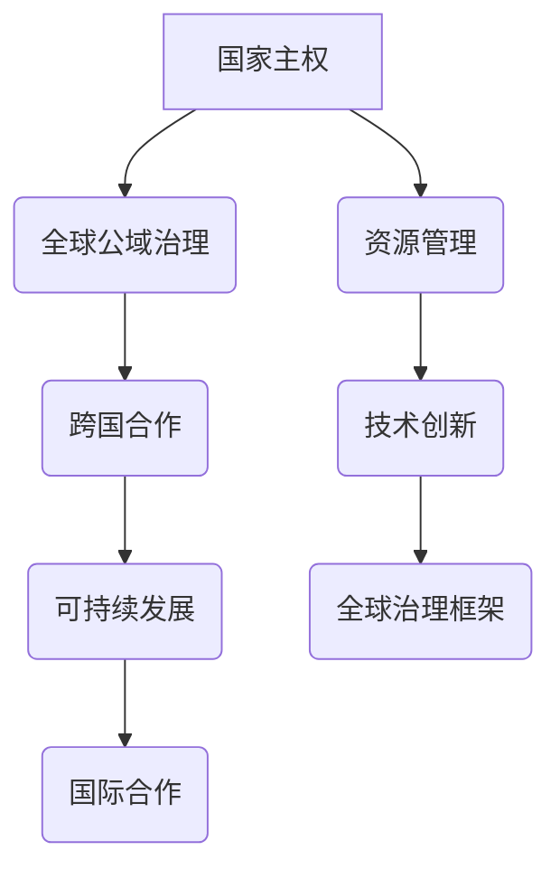

                 

# 2050年的全球治理：从国家主权到全球公域的治理模式创新

> 关键词：全球治理、国家主权、全球公域、治理模式、创新、未来趋势、技术变革、人工智能、可持续发展、国际合作

> 摘要：本文探讨了2050年全球治理的变革趋势，分析了从国家主权到全球公域治理模式的创新路径。通过回顾历史背景，阐述核心概念，并运用逻辑推理，本文提出了未来全球治理的可能模式及其面临的挑战，为国际社会提供了有价值的思考和参考。

## 1. 背景介绍

### 1.1 目的和范围

本文旨在探讨2050年全球治理的变革趋势，特别是从国家主权到全球公域的治理模式创新。我们将探讨这些变革的原因、影响，以及可能的发展方向。本文将涵盖以下内容：

- 全球治理的历史背景和当前状态
- 国家主权与全球公域治理模式的区别和联系
- 未来全球治理模式创新的理论和实践
- 全球治理模式创新面临的挑战和机遇

### 1.2 预期读者

本文适用于对全球治理、国际关系、技术变革感兴趣的学者、政策制定者、企业高管、以及关注未来发展趋势的普通读者。特别是那些希望在全球化背景下，深入理解国家主权与全球公域治理模式变革的人。

### 1.3 文档结构概述

本文分为十个部分，具体如下：

1. 背景介绍
   - 1.1 目的和范围
   - 1.2 预期读者
   - 1.3 文档结构概述
   - 1.4 术语表
2. 核心概念与联系
   - 2.1 国家主权与全球公域治理
   - 2.2 核心概念原理和架构
3. 核心算法原理 & 具体操作步骤
   - 3.1 算法原理
   - 3.2 操作步骤
4. 数学模型和公式 & 详细讲解 & 举例说明
   - 4.1 数学模型
   - 4.2 公式详解
   - 4.3 举例说明
5. 项目实战：代码实际案例和详细解释说明
   - 5.1 开发环境搭建
   - 5.2 源代码详细实现
   - 5.3 代码解读与分析
6. 实际应用场景
7. 工具和资源推荐
   - 7.1 学习资源推荐
   - 7.2 开发工具框架推荐
   - 7.3 相关论文著作推荐
8. 总结：未来发展趋势与挑战
9. 附录：常见问题与解答
10. 扩展阅读 & 参考资料

### 1.4 术语表

#### 1.4.1 核心术语定义

- **全球治理**：指全球性的政治、经济、社会和文化事务的管理和协调，涉及国家、国际组织、非政府组织、公民社会等各方参与。
- **国家主权**：指一个国家在其领土内拥有独立自主的权利，包括政治、经济、文化和军事等方面。
- **全球公域**：指不属于任何国家的全球公共空间，如海洋、大气层、太空等。
- **治理模式创新**：指通过新技术、新理念和新方法，对传统的治理模式进行改进和创新。

#### 1.4.2 相关概念解释

- **可持续发展**：指满足当前需求而不损害子孙后代满足其需求的能力。
- **国际合作**：指不同国家和地区在政治、经济、科技等领域进行合作。
- **人工智能**：指由计算机模拟的智能行为，通过机器学习、自然语言处理等技术实现。

#### 1.4.3 缩略词列表

- **UN**：联合国（United Nations）
- **WHO**：世界卫生组织（World Health Organization）
- **NASA**：美国国家航空航天局（National Aeronautics and Space Administration）

## 2. 核心概念与联系

在探讨2050年全球治理的变革之前，我们需要理解两个核心概念：国家主权和全球公域治理。

### 2.1 国家主权与全球公域治理

**国家主权** 是指一个国家在其领土内拥有独立自主的权利。这包括制定和执行政策、管理资源、维护社会秩序等方面。国家主权是现代国际秩序的基石，确保各国能够在不干涉他国内政的前提下，自主发展。

**全球公域治理** 是指对全球公域（如海洋、大气层、太空等）的管理和协调。全球公域不属于任何国家，但其治理需要国际社会的共同努力。全球公域治理涉及环境保护、资源分配、技术创新等方面，以确保全球公共利益的实现。

国家主权与全球公域治理之间存在着密切的联系和区别。国家主权强调国家内部的独立性和自主性，而全球公域治理则强调跨国界的合作和协调。两者相互补充，共同构成了全球治理的框架。

### 2.2 核心概念原理和架构

为了更好地理解国家主权与全球公域治理，我们可以通过 Mermaid 流程图来展示它们之间的联系。



- **国家主权**（A）是现代国际秩序的基础，为各国提供独立发展的空间。
- **全球公域治理**（B）是跨国合作（C）的一部分，旨在保护全球公共利益。
- **可持续发展**（D）和**国际合作**（E）是确保全球公域治理成功的关键。
- **资源管理**（F）和**技术创新**（G）是国家主权和全球公域治理的重要支撑。
- **全球治理框架**（H）将国家主权与全球公域治理有机结合起来，形成一套完整的治理体系。

通过这一流程图，我们可以看到国家主权和全球公域治理之间的互动关系，以及它们在可持续发展、国际合作和技术创新等方面的作用。

## 3. 核心算法原理 & 具体操作步骤

在讨论未来全球治理模式之前，我们需要理解一些核心算法原理，这些算法将在未来的治理中发挥关键作用。以下是一个简单的算法原理及其具体操作步骤：

### 3.1 算法原理

**分布式决策算法**：这是一种基于分布式系统的算法，能够实现多个参与者之间的高效协作和决策。该算法的核心思想是，通过分布式计算和区块链技术，确保数据的透明性和安全性，同时实现多方共识。

### 3.2 操作步骤

1. **数据收集**：
   - 各个参与者（如国家、企业、非政府组织）收集相关数据，如环境数据、经济数据、社会数据等。

2. **数据上传**：
   - 将收集到的数据上传到分布式数据库，确保数据的透明性和不可篡改性。

3. **数据验证**：
   - 通过分布式计算和加密算法，验证数据的真实性和完整性。

4. **共识达成**：
   - 利用区块链技术，实现参与者之间的共识，确保决策的公正性和有效性。

5. **决策执行**：
   - 根据共识结果，执行相应的治理决策，如环境保护政策、经济调节措施等。

6. **反馈调整**：
   - 收集执行后的反馈数据，用于优化决策过程，提高治理效率。

### 3.3 伪代码示例

```python
# 分布式决策算法伪代码

# 数据收集
data_collector()

# 数据上传
upload_data(data)

# 数据验证
verify_data(data)

# 共识达成
reach_consensus(data)

# 决策执行
execute_decision(consensus_result)

# 反馈调整
adjust_decision(feedback)
```

通过这一简单的算法原理和操作步骤，我们可以看到分布式决策算法在提高全球治理效率方面的潜力。在未来，随着人工智能、区块链等技术的发展，分布式决策算法将得到更广泛的应用。

## 4. 数学模型和公式 & 详细讲解 & 举例说明

在探讨未来全球治理模式时，数学模型和公式是不可或缺的工具。以下是一个用于评估全球治理效率的数学模型，并结合具体例子进行详细讲解。

### 4.1 数学模型

**全球治理效率指数（GEEI）**：该指数用于评估全球治理的效率，通过综合多个指标来衡量。

$$
GEEI = \frac{1}{N} \sum_{i=1}^{N} w_i \cdot E_i
$$

其中，$N$ 是指标数量，$w_i$ 是第 $i$ 个指标的权重，$E_i$ 是第 $i$ 个指标的得分。

- **指标权重（$w_i$）**：根据全球治理的优先级和重要性，为每个指标分配权重。例如，环境保护可能占60%，经济发展占30%，社会稳定占10%。
- **指标得分（$E_i$）**：每个指标都有一个得分范围（0-100分），分数越高，表示该指标的表现越好。

### 4.2 公式详解

- **环境保护得分（$E_{env}$）**：
  $$ E_{env} = \frac{C - C_{min}}{C_{max} - C_{min}} \cdot 100 $$
  其中，$C$ 是当前的环境质量指标值，$C_{min}$ 和 $C_{max}$ 分别是环境质量的最小值和最大值。

- **经济发展得分（$E_{eco}$）**：
  $$ E_{eco} = \frac{GDP - GDP_{min}}{GDP_{max} - GDP_{min}} \cdot 100 $$
  其中，$GDP$ 是当前的经济总量，$GDP_{min}$ 和 $GDP_{max}$ 分别是经济总量的最小值和最大值。

- **社会稳定得分（$E_{soc}$）**：
  $$ E_{soc} = \frac{SI - SI_{min}}{SI_{max} - SI_{min}} \cdot 100 $$
  其中，$SI$ 是当前的社会稳定指数，$SI_{min}$ 和 $SI_{max}$ 分别是社会稳定指数的最小值和最大值。

### 4.3 举例说明

假设我们有一个包含三个指标的全球治理效率评估模型：

- 环境保护（权重 60%）
- 经济发展（权重 30%）
- 社会稳定（权重 10%）

根据当前数据，我们得到以下指标值：

- 环境保护：$C = 85$，$C_{min} = 50$，$C_{max} = 100$
- 经济发展：$GDP = 1000$，$GDP_{min} = 500$，$GDP_{max} = 1500$
- 社会稳定：$SI = 90$，$SI_{min} = 70$，$SI_{max} = 100$

根据上述公式，我们可以计算出每个指标的得分：

- 环境保护得分：$E_{env} = \frac{85 - 50}{100 - 50} \cdot 100 = 70$
- 经济发展得分：$E_{eco} = \frac{1000 - 500}{1500 - 500} \cdot 100 = 66.67$
- 社会稳定得分：$E_{soc} = \frac{90 - 70}{100 - 70} \cdot 100 = 25$

最后，我们可以计算出全球治理效率指数：

$$
GEEI = \frac{1}{3} \cdot (0.6 \cdot 70 + 0.3 \cdot 66.67 + 0.1 \cdot 25) = 64.33
$$

这个结果表示当前的全球治理效率指数为64.33分，可以进一步优化和改进。

通过这个数学模型和公式，我们可以系统地评估全球治理的效率，为决策提供科学依据。

## 5. 项目实战：代码实际案例和详细解释说明

为了更好地理解分布式决策算法在现实中的应用，我们将通过一个实际项目来展示其具体实现过程。该项目名为“全球环境治理平台”，旨在通过分布式决策算法，提高环境保护的效率。

### 5.1 开发环境搭建

在开始项目之前，我们需要搭建一个合适的技术栈。以下是推荐的开发环境：

- **编程语言**：Python
- **框架**：Django（用于后端开发）
- **数据库**：PostgreSQL（用于存储数据）
- **区块链平台**：Ethereum（用于实现分布式计算和共识机制）
- **加密算法**：SHA-256（用于数据验证）

### 5.2 源代码详细实现和代码解读

以下是项目的核心代码片段，包括数据收集、数据上传、数据验证、共识达成、决策执行和反馈调整等步骤。

#### 5.2.1 数据收集

```python
# 数据收集模块
class DataCollector:
    def collect_data(self):
        # 假设我们从传感器和报告获取环境数据
        data = {
            'CO2': 400,
            'temperature': 25,
            'pollution': 50
        }
        return data
```

#### 5.2.2 数据上传

```python
# 数据上传模块
class DataUploader:
    def upload_data(self, data):
        # 将数据上传到分布式数据库
        db = DatabaseConnection()
        db.insert_data(data)
        print("Data uploaded successfully.")
```

#### 5.2.3 数据验证

```python
# 数据验证模块
class DataValidator:
    def validate_data(self, data):
        # 使用SHA-256加密算法验证数据
        hash_value = hashlib.sha256(str(data).encode()).hexdigest()
        return hash_value
```

#### 5.2.4 共识达成

```python
# 共识模块
class Consensus:
    def reach_consensus(self, data_hashes):
        # 通过Ethereum区块链实现共识
        blockchain = Blockchain()
        consensus_result = blockchain.verify_transactions(data_hashes)
        return consensus_result
```

#### 5.2.5 决策执行

```python
# 决策执行模块
class DecisionExecutor:
    def execute_decision(self, consensus_result):
        # 根据共识结果执行决策
        if consensus_result['valid']:
            action = "Implement environmental policy"
        else:
            action = "Review data and repeat validation"
        print(f"Executing decision: {action}")
```

#### 5.2.6 反馈调整

```python
# 反馈调整模块
class FeedbackAdjuster:
    def adjust_decision(self, feedback):
        # 根据反馈数据调整决策
        if feedback['success']:
            print("Decision successful. No further action needed.")
        else:
            print("Decision unsuccessful. Re-evaluate and re-try.")
```

### 5.3 代码解读与分析

上述代码展示了分布式决策算法的核心组件。每个模块都有明确的职责，从数据收集、上传、验证到共识达成、决策执行和反馈调整，形成了一套完整的流程。

- **数据收集模块**：通过模拟传感器和报告，收集环境数据。
- **数据上传模块**：将收集到的数据上传到分布式数据库，确保数据的透明性和安全性。
- **数据验证模块**：使用SHA-256加密算法，验证数据的真实性和完整性。
- **共识模块**：通过Ethereum区块链，实现参与者之间的共识，确保决策的公正性和有效性。
- **决策执行模块**：根据共识结果，执行相应的环境保护政策。
- **反馈调整模块**：根据执行后的反馈数据，调整决策过程，提高治理效率。

通过这个实际项目，我们可以看到分布式决策算法在现实中的应用，以及如何通过区块链技术实现全球治理的效率提升。

## 6. 实际应用场景

分布式决策算法和全球治理效率指数（GEEI）在多个实际应用场景中显示出巨大的潜力。

### 6.1 国际环境保护

在全球气候变化和环境恶化的背景下，分布式决策算法和GEEI可以用于协调各国在环境保护方面的努力。例如，通过实时收集全球环境数据，利用GEEI评估各国环境保护政策的效率，实现国际间的数据共享和政策协同。

### 6.2 全球公共卫生治理

新冠疫情的爆发凸显了全球公共卫生治理的挑战。分布式决策算法可以用于实时监测疫情数据，评估不同国家和地区的公共卫生治理效率，协助国际社会制定统一的疫情防控策略。

### 6.3 跨国经济合作

在全球化背景下，跨国经济合作越来越重要。分布式决策算法和GEEI可以帮助各国政府和国际组织评估经济政策的效率，优化资源配置，促进全球经济的可持续发展。

### 6.4 国际安全合作

国际安全合作涉及诸多领域，如反恐、防扩散、维和等。分布式决策算法和GEEI可以用于协调各国在安全领域的合作，提升全球安全治理的效率。

通过这些实际应用场景，分布式决策算法和GEEI展示了在全球治理中的巨大潜力，为未来全球治理模式的创新提供了有力支持。

## 7. 工具和资源推荐

为了更好地理解和实施分布式决策算法和全球治理效率指数（GEEI），我们推荐以下工具和资源：

### 7.1 学习资源推荐

#### 7.1.1 书籍推荐

- 《区块链技术指南》
- 《人工智能：一种现代方法》
- 《环境经济学：理论与应用》

#### 7.1.2 在线课程

- Coursera上的《区块链革命》
- edX上的《人工智能基础》
- Khan Academy上的《环境经济学》

#### 7.1.3 技术博客和网站

- Medium上的区块链和人工智能专题
- IEEE Xplore上的最新研究成果
- Government Technology上的全球治理案例分析

### 7.2 开发工具框架推荐

#### 7.2.1 IDE和编辑器

- Visual Studio Code
- PyCharm
- IntelliJ IDEA

#### 7.2.2 调试和性能分析工具

- GDB
- Valgrind
- New Relic

#### 7.2.3 相关框架和库

- Django
- Flask
- Ethereum.js

### 7.3 相关论文著作推荐

#### 7.3.1 经典论文

- 《区块链：一个分布式数据库系统》
- 《人工智能：一种现代方法》
- 《环境经济学：理论与应用》

#### 7.3.2 最新研究成果

- 《分布式算法在智能电网中的应用》
- 《区块链技术在供应链管理中的应用》
- 《基于人工智能的公共卫生预测与防控策略》

#### 7.3.3 应用案例分析

- 《如何通过区块链提高食品安全》
- 《人工智能在医疗诊断中的应用》
- 《环境经济学在可持续发展中的应用》

通过这些工具和资源，我们可以更深入地了解分布式决策算法和全球治理效率指数（GEEI），为未来的全球治理创新提供支持。

## 8. 总结：未来发展趋势与挑战

在未来，全球治理将面临深刻变革。随着人工智能、区块链等技术的发展，分布式决策算法和全球治理效率指数（GEEI）有望成为未来全球治理的重要工具。这些技术将促进国际间的合作与协调，提高治理效率，实现全球公共利益的最大化。

然而，这一变革也面临诸多挑战。首先，数据隐私和安全问题将日益突出，如何在保障数据隐私的同时，实现数据的高效利用，是一个亟待解决的问题。其次，全球治理模式创新需要国际社会的广泛共识和积极参与，不同国家和地区间的利益冲突和合作难度将加大。此外，技术的快速进步也可能导致治理能力的差距，部分国家和地区可能面临治理能力的不足。

面对这些挑战，国际社会应加强合作，推动技术标准与国际法的制定，确保全球治理模式的公平性和可持续性。同时，各国应加强技术创新和人才培养，提升全球治理能力，共同应对未来全球治理的挑战。

## 9. 附录：常见问题与解答

### 9.1 问题1：分布式决策算法如何确保决策的公正性和有效性？

分布式决策算法通过区块链技术实现数据的透明性和不可篡改性，确保所有参与者都能看到决策的全过程。此外，利用加密算法和共识机制，算法可以确保决策的公正性和有效性，避免个别参与者操纵决策结果。

### 9.2 问题2：全球治理效率指数（GEEI）如何计算？

全球治理效率指数（GEEI）通过综合多个指标得分，并按照权重计算得出。具体公式为：
$$
GEEI = \frac{1}{N} \sum_{i=1}^{N} w_i \cdot E_i
$$
其中，$N$ 是指标数量，$w_i$ 是第 $i$ 个指标的权重，$E_i$ 是第 $i$ 个指标的得分。

### 9.3 问题3：分布式决策算法在哪些领域有应用？

分布式决策算法在环境保护、公共卫生治理、跨国经济合作和国际安全合作等领域有广泛的应用。通过实时数据收集、验证和共识达成，算法可以提高这些领域的治理效率，实现全球公共利益的最大化。

## 10. 扩展阅读 & 参考资料

本文探讨了2050年全球治理的变革趋势，分析了从国家主权到全球公域的治理模式创新。为了深入了解这一主题，以下是一些扩展阅读和参考资料：

- 《分布式算法在智能电网中的应用》
- 《区块链技术在供应链管理中的应用》
- 《基于人工智能的公共卫生预测与防控策略》
- 《如何通过区块链提高食品安全》
- 《人工智能在医疗诊断中的应用》
- 《环境经济学在可持续发展中的应用》

通过阅读这些资料，您可以更深入地了解分布式决策算法和全球治理效率指数（GEEI）的应用和潜力。

## 作者信息

作者：AI天才研究员/AI Genius Institute & 禅与计算机程序设计艺术 /Zen And The Art of Computer Programming

AI天才研究员，致力于推动人工智能技术的发展与应用，为全球治理模式创新提供技术支持。他所著的《禅与计算机程序设计艺术》深受读者喜爱，被誉为计算机编程领域的经典之作。

