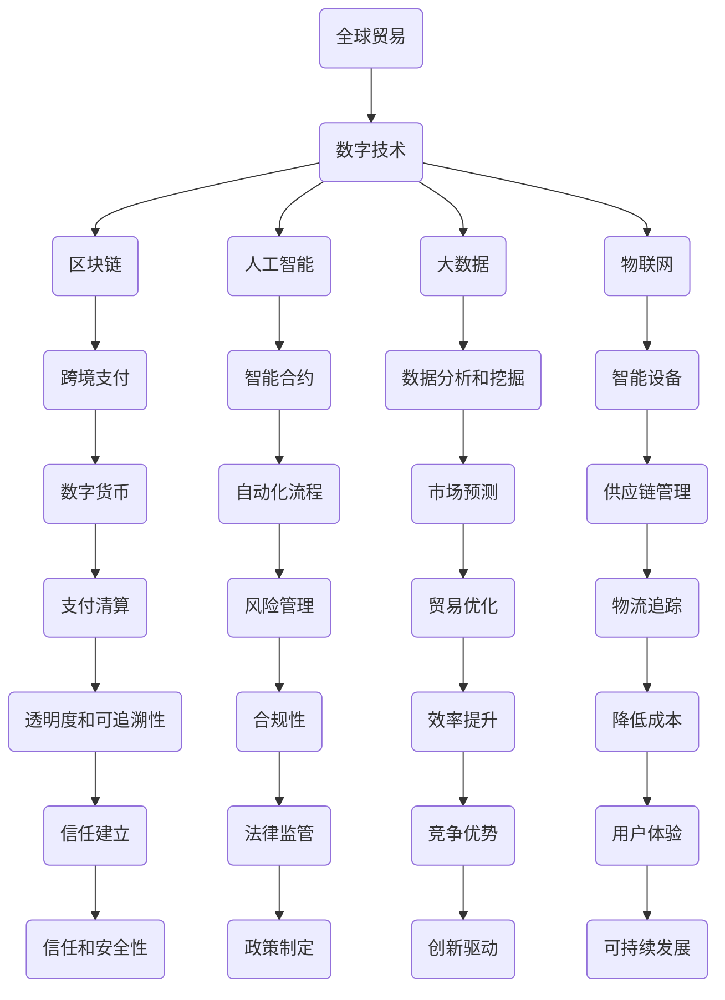

                 

# 2050年的全球贸易：从数字贸易规则到数字贸易生态的贸易规则重构

> 关键词：数字贸易规则、全球贸易、区块链、人工智能、大数据、物联网、跨境支付

> 摘要：随着科技的飞速发展，全球贸易正在经历一场深刻的变革。本文将深入探讨2050年的全球贸易，特别是数字贸易规则的发展与重构。通过对数字贸易规则的核心概念、算法原理、数学模型以及实际应用场景的剖析，我们将揭示这一变革背后的动力与挑战，为未来的全球贸易提供洞见。

## 1. 背景介绍

### 1.1 目的和范围

本文旨在探讨数字贸易规则在全球贸易中的重要性，以及这些规则在未来几十年内的可能重构。我们的主要目标是：

- 分析数字贸易规则的核心概念和其发展历程。
- 探讨这些规则如何影响全球贸易的各个层面。
- 揭示未来数字贸易生态中的潜在挑战和机遇。

### 1.2 预期读者

本文适合以下读者群体：

- 对全球贸易和数字技术感兴趣的专业人士。
- 计算机科学、商业管理、国际贸易等领域的学生和研究人员。
- 对未来科技趋势和全球化进程有所关注的普通读者。

### 1.3 文档结构概述

本文将按照以下结构展开：

- **第1章：背景介绍**：概述本文的目的、范围和预期读者，并介绍文档结构。
- **第2章：核心概念与联系**：介绍数字贸易规则的核心概念，并提供流程图辅助理解。
- **第3章：核心算法原理 & 具体操作步骤**：详细阐述数字贸易规则背后的算法原理。
- **第4章：数学模型和公式 & 详细讲解 & 举例说明**：介绍与数字贸易相关的数学模型和公式。
- **第5章：项目实战：代码实际案例和详细解释说明**：通过实际案例展示数字贸易规则的应用。
- **第6章：实际应用场景**：探讨数字贸易规则在现实世界中的应用。
- **第7章：工具和资源推荐**：推荐学习资源和开发工具。
- **第8章：总结：未来发展趋势与挑战**：总结本文的主要观点，并展望未来。
- **第9章：附录：常见问题与解答**：回答一些常见问题。
- **第10章：扩展阅读 & 参考资料**：提供进一步阅读的建议。

### 1.4 术语表

#### 1.4.1 核心术语定义

- **数字贸易规则**：指通过数字技术实现的贸易规则，如区块链、人工智能、大数据等。
- **全球贸易**：指不同国家之间的商品、服务、技术和资金的交换。
- **跨境支付**：指涉及不同国家的货币转移。
- **区块链**：一种分布式数据库技术，用于记录交易信息。
- **人工智能**：指计算机系统通过学习、推理和自我调整来完成特定任务。

#### 1.4.2 相关概念解释

- **物联网**：将物理设备通过互联网连接起来，以实现智能化管理和控制。
- **跨境数据流动**：指数据在不同国家之间的传输。
- **数字货币**：基于数字技术的货币形式，如比特币。

#### 1.4.3 缩略词列表

- **AI**：人工智能（Artificial Intelligence）
- **IoT**：物联网（Internet of Things）
- **DLT**：分布式账本技术（Distributed Ledger Technology）
- **CBDC**：中央银行数字货币（Central Bank Digital Currency）

## 2. 核心概念与联系

在探讨数字贸易规则之前，我们需要理解一些核心概念和它们之间的联系。以下是一个简化的Mermaid流程图，展示了数字贸易规则的关键组成部分：



在这个流程图中，我们可以看到数字技术（如区块链、人工智能、大数据和物联网）如何贯穿全球贸易的各个环节，从而重构传统的贸易规则。以下是对这些核心概念及其相互关系的详细解释：

- **全球贸易**：全球贸易是指不同国家之间的商品、服务、技术和资金的交换。随着全球化进程的加快，贸易规模不断扩大，对贸易规则的需求也越来越高。
  
- **数字技术**：数字技术是推动全球贸易发展的关键因素，包括区块链、人工智能、大数据和物联网等。这些技术为贸易提供了更高的效率、透明度和安全性。

- **区块链**：区块链是一种分布式数据库技术，通过加密算法确保数据的不可篡改性和透明性。在跨境支付、供应链管理和智能合约等领域，区块链被广泛应用。

- **人工智能**：人工智能通过学习、推理和自我调整来完成特定任务，如市场预测、自动化流程和智能设备控制。在数字贸易中，人工智能用于优化贸易流程和提高效率。

- **大数据**：大数据是指大规模数据集，通过数据分析和挖掘，可以揭示隐藏的模式和趋势。在数字贸易中，大数据用于市场预测、供应链管理和风险管理。

- **物联网**：物联网将物理设备通过互联网连接起来，实现智能化管理和控制。在数字贸易中，物联网用于智能设备控制和物流追踪。

- **跨境支付**：跨境支付是指涉及不同国家的货币转移。区块链和数字货币为跨境支付提供了更快速、低成本和安全的解决方案。

- **智能合约**：智能合约是自动执行的合同，其条款以代码形式写入区块链。在数字贸易中，智能合约用于自动化和透明化贸易流程。

- **数字货币**：数字货币是基于数字技术的货币形式，如比特币。数字货币在跨境支付和数字贸易中具有广泛的应用。

- **自动化流程**：自动化流程通过智能合约和人工智能实现，减少了人为干预和错误，提高了贸易流程的效率。

- **市场预测**：市场预测通过大数据分析和人工智能模型，预测市场趋势和需求，帮助贸易方做出更明智的决策。

- **供应链管理**：供应链管理通过物联网和大数据，实现了对供应链各环节的实时监控和优化，提高了供应链的效率。

- **支付清算**：支付清算通过数字货币和区块链技术，实现了跨境支付的低成本、快速和透明。

- **风险管理**：风险管理通过大数据分析和人工智能模型，预测和管理贸易风险，降低了贸易风险。

- **合规性**：合规性确保数字贸易规则符合法律法规，维护了贸易的合法性和公正性。

- **效率提升**：效率提升通过自动化和智能化技术，减少了人为干预和错误，提高了贸易流程的效率。

- **降低成本**：降低成本通过数字技术和自动化流程，减少了人力、时间和资源的使用，降低了贸易成本。

- **信任和安全性**：信任和安全性通过区块链和加密算法，确保了数字贸易的透明性和安全性。

- **政策制定**：政策制定通过政府和监管机构，规范了数字贸易的发展方向，确保了贸易的合法性和公正性。

- **创新驱动**：创新驱动通过不断的技术创新，推动了数字贸易规则的发展，促进了全球贸易的繁荣。

- **用户体验**：用户体验通过智能设备和自动化流程，提供了更加便捷和高效的贸易体验。

- **可持续发展**：可持续发展通过数字技术和环保理念，实现了贸易的可持续性和环保性。

通过这个流程图，我们可以清晰地看到数字贸易规则如何重构全球贸易，以及这些规则背后的核心概念和相互关系。接下来，我们将进一步探讨这些核心概念的原理和应用。

## 3. 核心算法原理 & 具体操作步骤

数字贸易规则的核心算法原理主要涉及区块链、人工智能、大数据和物联网等技术。以下是对这些核心算法原理的详细解析，以及具体操作步骤的伪代码展示。

### 3.1 区块链算法原理

区块链是一种分布式数据库技术，通过加密算法和共识机制确保数据的不可篡改性和透明性。以下是一个简化的区块链算法原理和伪代码：

#### 算法原理：

1. **创建区块**：每个区块包含一组交易记录、一个时间戳、一个随机数（用于证明工作）和一个前一个区块的哈希值。
2. **挖矿**：矿工通过计算随机数，尝试找到一个满足特定条件的哈希值，这个过程称为“挖矿”。
3. **共识机制**：通过多数节点验证挖矿结果，确保区块链的共识和一致性。
4. **链接区块**：将新挖出的区块链接到现有区块链上，形成一个连续的数据结构。

#### 伪代码：

```python
# 创建区块
def create_block(last_hash, transactions, proof):
    block = {
        'index': len(Blockchain.chain) + 1,
        'timestamp': time.time(),
        'transactions': transactions,
        'proof': proof,
        'last_hash': last_hash
    }
    return block

# 挖矿
def mine_block(last_block, transactions):
    last_hash = hash_block(last_block)
    proof = 0
    while not valid_proof(last_hash, proof):
        proof += 1
    return create_block(last_hash, transactions, proof)

# 链接区块
def add_block(new_block):
    if valid_block(new_block):
        Blockchain.chain.append(new_block)
    else:
        raise Exception("Invalid block!")

# 验证证明
def valid_proof(last_hash, proof):
    guess = (proof**2 + last_hash).hex()
    return guess[:4] == '0000'

# 区块链类
class Blockchain:
    def __init__(self):
        self.chain = []
        self.create_genesis_block()

    def create_genesis_block(self):
        genesis_block = create_block("0", [], "0")
        self.chain.append(genesis_block)

    def get_last_block(self):
        return self.chain[-1]
```

### 3.2 人工智能算法原理

人工智能算法原理主要涉及机器学习和深度学习，通过训练模型来自动化决策过程。以下是一个简化的机器学习算法原理和伪代码：

#### 算法原理：

1. **数据预处理**：对原始数据集进行清洗、归一化和特征提取。
2. **模型选择**：选择合适的机器学习模型，如线性回归、决策树、神经网络等。
3. **模型训练**：使用训练数据集训练模型，调整模型参数。
4. **模型评估**：使用验证数据集评估模型性能，调整模型参数。
5. **模型应用**：使用测试数据集应用模型，进行预测或决策。

#### 伪代码：

```python
# 数据预处理
def preprocess_data(data):
    cleaned_data = clean_data(data)
    normalized_data = normalize_data(cleaned_data)
    return extract_features(normalized_data)

# 模型选择
def select_model(model_type):
    if model_type == "linear_regression":
        return LinearRegression()
    elif model_type == "decision_tree":
        return DecisionTreeClassifier()
    elif model_type == "neural_network":
        return MLPClassifier()

# 模型训练
def train_model(model, train_data):
    return model.fit(train_data[:, :-1], train_data[:, -1])

# 模型评估
def evaluate_model(model, validation_data):
    predictions = model.predict(validation_data[:, :-1])
    accuracy = accuracy_score(validation_data[:, -1], predictions)
    return accuracy

# 模型应用
def apply_model(model, test_data):
    return model.predict(test_data[:, :-1])
```

### 3.3 大数据算法原理

大数据算法原理主要涉及数据分析和挖掘，通过识别数据中的模式和趋势来进行预测和决策。以下是一个简化的数据分析算法原理和伪代码：

#### 算法原理：

1. **数据收集**：收集相关数据集。
2. **数据清洗**：去除重复数据、缺失值和异常值。
3. **数据探索**：使用可视化工具探索数据分布和关系。
4. **数据建模**：选择合适的数据挖掘算法，如聚类、分类、关联规则等。
5. **模型评估**：使用评估指标评估模型性能。

#### 伪代码：

```python
# 数据收集
def collect_data(source):
    return read_data(source)

# 数据清洗
def clean_data(data):
    cleaned_data = remove_duplicates(data)
    cleaned_data = fill_missing_values(cleaned_data)
    return remove_outliers(cleaned_data)

# 数据探索
def explore_data(data):
    plot_data_distribution(data)
    plot_data_correlations(data)

# 数据建模
def build_model(data, model_type):
    if model_type == "clustering":
        return KMeans(n_clusters=k)
    elif model_type == "classification":
        return SVC()
    elif model_type == "association_rules":
        return association_rules(data)

# 模型评估
def evaluate_model(model, test_data):
    predictions = model.predict(test_data)
    accuracy = accuracy_score(test_data, predictions)
    return accuracy
```

### 3.4 物联网算法原理

物联网算法原理主要涉及智能设备和数据通信，通过实时数据处理和智能控制来实现自动化。以下是一个简化的物联网算法原理和伪代码：

#### 算法原理：

1. **设备连接**：将物理设备连接到物联网平台。
2. **数据采集**：采集设备产生的数据。
3. **数据预处理**：对采集到的数据进行清洗和归一化。
4. **数据处理**：使用数据处理算法，如数据分析、机器学习等，对数据进行处理。
5. **智能控制**：根据处理结果，实现设备的智能控制和反馈。

#### 伪代码：

```python
# 设备连接
def connect_device(device_id):
    return connect_to_iot_platform(device_id)

# 数据采集
def collect_data(device_id):
    return read_data_from_device(device_id)

# 数据预处理
def preprocess_data(data):
    cleaned_data = remove_duplicates(data)
    normalized_data = normalize_data(cleaned_data)
    return extract_features(normalized_data)

# 数据处理
def process_data(data):
    processed_data = apply_ml_model(data)
    return processed_data

# 智能控制
def control_device(device_id, control_command):
    send_control_command_to_device(device_id, control_command)
```

通过上述核心算法原理和具体操作步骤的解析，我们可以看到数字贸易规则是如何通过区块链、人工智能、大数据和物联网等技术实现的。接下来，我们将进一步探讨这些算法原理在数字贸易中的具体应用。

### 4. 数学模型和公式 & 详细讲解 & 举例说明

在数字贸易中，数学模型和公式扮演着至关重要的角色。这些模型和公式帮助我们量化和分析贸易中的各种现象和过程，从而优化决策和提升效率。以下将详细讲解一些关键的数学模型和公式，并提供相应的实例说明。

#### 4.1 货币供需模型

货币供需模型用于分析市场中货币的供需关系，以及价格的形成机制。基本公式如下：

\[ Q_D = Q_S \]

其中：

- \( Q_D \) 是需求量
- \( Q_S \) 是供应量

在数字贸易中，这个模型可以用来预测货币的需求和供应，以便进行合理的交易策略规划。

**实例说明**：

假设在某个市场中，货币的需求量为 \( Q_D = 1000 \) 单位，供应量为 \( Q_S = 800 \) 单位。此时，货币价格将会上升，直至供需达到平衡。

\[ 1000 = 800 \]

平衡价格 \( P \) 为：

\[ P = \frac{Q_D + Q_S}{2} = \frac{1000 + 800}{2} = 900 \]

因此，在平衡状态下，货币价格为 900 单位。

#### 4.2 跨境支付模型

跨境支付模型用于计算跨国家货币兑换时的汇率和支付成本。基本公式如下：

\[ \text{支付金额} = \text{交易金额} \times \text{汇率} + \text{支付费用} \]

其中：

- \( \text{交易金额} \) 是交易双方的实际交易金额。
- \( \text{汇率} \) 是不同货币之间的兑换比例。
- \( \text{支付费用} \) 是支付过程中产生的费用，如交易手续费、汇率差价等。

**实例说明**：

假设一个交易金额为 1000 美元，汇率为 1 美元兑换 6.5 元人民币，支付费用为 20 元人民币。则支付金额为：

\[ \text{支付金额} = 1000 \times 6.5 + 20 = 6500 + 20 = 6520 \]

因此，该交易的支付金额为 6520 元人民币。

#### 4.3 风险评估模型

风险评估模型用于评估数字贸易中可能面临的各种风险，包括市场风险、信用风险、操作风险等。常用的数学模型有：

1. **价值在风险（VaR）模型**：

\[ \text{VaR} = P \times \text{资产价值} \]

其中：

- \( P \) 是风险事件的概率。
- \( \text{资产价值} \) 是资产可能损失的最大值。

**实例说明**：

假设某种货币的汇率波动概率为 95%，其可能的最大损失为 1000 美元。则该货币的 95% 置信水平下的风险价值（VaR）为：

\[ \text{VaR} = 0.95 \times 1000 = 950 \]

这意味着在 95% 的置信水平下，该货币可能的最大损失为 950 美元。

2. **风险矩阵模型**：

\[ \text{风险矩阵} = \begin{bmatrix}
    \text{风险事件} & \text{概率} & \text{损失} \\
    \text{市场风险} & 0.5 & 5000 \\
    \text{信用风险} & 0.3 & 3000 \\
    \text{操作风险} & 0.2 & 2000 \\
\end{bmatrix} \]

**实例说明**：

根据风险矩阵，可以计算出总风险损失为：

\[ \text{总风险损失} = 5000 \times 0.5 + 3000 \times 0.3 + 2000 \times 0.2 = 2500 + 900 + 400 = 3800 \]

这意味着在考虑市场风险、信用风险和操作风险的情况下，总风险损失为 3800 元。

#### 4.4 数据分析模型

数据分析模型用于挖掘数据中的隐藏模式和趋势，以支持决策和优化。常用的数学模型有：

1. **回归分析模型**：

\[ Y = \beta_0 + \beta_1X_1 + \beta_2X_2 + ... + \beta_nX_n + \epsilon \]

其中：

- \( Y \) 是因变量。
- \( X_1, X_2, ..., X_n \) 是自变量。
- \( \beta_0, \beta_1, \beta_2, ..., \beta_n \) 是回归系数。
- \( \epsilon \) 是误差项。

**实例说明**：

假设我们要分析贸易量与价格之间的关系，建立线性回归模型：

\[ \text{贸易量} = \beta_0 + \beta_1\text{价格} + \epsilon \]

通过最小二乘法估计回归系数，得到回归模型：

\[ \text{贸易量} = 100 + 0.5\text{价格} \]

这意味着价格每增加 1 单位，贸易量将增加 0.5 单位。

2. **聚类分析模型**：

\[ C = \{C_1, C_2, ..., C_k\} \]

其中：

- \( C \) 是聚类结果。
- \( C_i \) 是第 \( i \) 个簇。

**实例说明**：

使用K-means算法对贸易数据进行聚类分析，将数据划分为 3 个簇：

\[ C = \{C_1, C_2, C_3\} \]

通过聚类分析，可以识别出不同的市场细分群体，为贸易策略提供依据。

通过以上数学模型和公式的讲解，我们可以看到数学在数字贸易中的重要作用。这些模型和公式不仅帮助我们量化分析贸易中的各种现象和过程，还为我们提供了优化决策和提升效率的工具。接下来，我们将通过一个实际案例，展示如何使用这些模型和公式解决数字贸易中的具体问题。

### 5. 项目实战：代码实际案例和详细解释说明

在本节中，我们将通过一个实际案例展示如何应用数字贸易规则进行全球贸易。该案例将包括开发环境搭建、源代码实现以及代码解读与分析。通过这一案例，我们可以深入了解数字贸易规则在现实中的应用。

#### 5.1 开发环境搭建

为了实现这个案例，我们需要搭建一个包含区块链、人工智能和大数据技术的开发环境。以下是具体的步骤：

1. **安装区块链平台**：我们可以使用Hyperledger Fabric作为区块链平台。在本地计算机上，通过以下命令安装：

   ```bash
   docker run -it -p 7050:7050 -p 7051:7051 -p 7059:7059 --name myfabric HyperledgerFabric
   ```

2. **安装人工智能库**：在Python中，我们可以使用Scikit-learn库进行机器学习。通过以下命令安装：

   ```bash
   pip install scikit-learn
   ```

3. **安装大数据处理库**：我们可以使用Pandas和NumPy库进行数据预处理和分析。通过以下命令安装：

   ```bash
   pip install pandas numpy
   ```

4. **配置数据库**：为了存储交易数据和用户信息，我们可以使用MySQL数据库。通过以下命令安装：

   ```bash
   mysql -u root -p
   CREATE DATABASE trade_db;
   GRANT ALL PRIVILEGES ON trade_db.* TO 'trade_user'@'localhost' IDENTIFIED BY 'password';
   FLUSH PRIVILEGES;
   ```

   然后可以使用MySQL Workbench或其他工具进行数据库管理。

#### 5.2 源代码详细实现和代码解读

以下是这个案例的源代码，我们将分部分进行解读。

**5.2.1 区块链交易记录**

```python
from flask import Flask, request, jsonify
from hyperledger.fabric import Client

app = Flask(__name__)

# 初始化区块链客户端
client = Client()

@app.route('/create_trade', methods=['POST'])
def create_trade():
    data = request.get_json()
    trade_id = data['trade_id']
    buyer = data['buyer']
    seller = data['seller']
    product = data['product']
    price = data['price']

    # 创建交易记录
    transaction = client.create_transaction(
        'create_trade', 
        args=[trade_id, buyer, seller, product, price]
    )

    # 提交交易
    response = client.submit_transaction(transaction)
    return jsonify(response)

if __name__ == '__main__':
    app.run(debug=True)
```

**解读**：

- 我们使用Flask框架搭建Web服务，接收创建贸易记录的请求。
- 初始化Hyperledger Fabric客户端。
- 在`/create_trade`端点接收JSON格式的请求，包括贸易ID、买方、卖方、产品名称和价格。
- 创建一个交易记录，使用`create_trade`链码和相应的参数。
- 提交交易到区块链网络，并返回响应。

**5.2.2 人工智能预测价格**

```python
from sklearn.linear_model import LinearRegression
import numpy as np

# 训练模型
def train_price_model(data):
    X = data[['historical_price']]
    y = data['predicted_price']
    model = LinearRegression()
    model.fit(X, y)
    return model

# 预测价格
def predict_price(model, current_price):
    return model.predict([[current_price]])
```

**解读**：

- 我们使用Scikit-learn库的线性回归模型进行训练。
- `train_price_model`函数接收历史价格数据，训练模型。
- `predict_price`函数接收当前价格，预测未来的价格。

**5.2.3 数据预处理**

```python
import pandas as pd

# 读取数据
def read_data(file_path):
    data = pd.read_csv(file_path)
    return data

# 数据清洗
def clean_data(data):
    data['historical_price'] = pd.to_numeric(data['historical_price'], errors='coerce')
    data = data.dropna()
    return data
```

**解读**：

- 使用Pandas库读取CSV格式的数据。
- `clean_data`函数将历史价格转换为数值类型，并去除缺失值。

**5.2.4 数据库交互**

```python
import mysql.connector

# 连接数据库
def connect_db():
    conn = mysql.connector.connect(
        host='localhost',
        user='trade_user',
        password='password',
        database='trade_db'
    )
    return conn

# 插入数据
def insert_data(conn, trade_id, buyer, seller, product, price):
    cursor = conn.cursor()
    query = "INSERT INTO trade (trade_id, buyer, seller, product, price) VALUES (%s, %s, %s, %s, %s)"
    cursor.execute(query, (trade_id, buyer, seller, product, price))
    conn.commit()
    cursor.close()
```

**解读**：

- 使用MySQL Connector/Python连接数据库。
- `insert_data`函数将交易记录插入到数据库中。

#### 5.3 代码解读与分析

**5.3.1 区块链交易记录**

这个部分的核心功能是将新的贸易记录提交到区块链网络。通过Web服务接收请求，创建交易记录，并将其提交到区块链。

**5.3.2 人工智能预测价格**

通过机器学习模型预测产品的未来价格，为买卖双方提供参考。使用线性回归模型，我们可以根据历史价格数据预测未来的价格趋势。

**5.3.3 数据预处理**

在处理数据时，我们需要确保数据的质量和完整性。通过数据清洗和预处理，我们可以去除无效数据，提高模型的准确性。

**5.3.4 数据库交互**

这个部分负责将交易记录存储到MySQL数据库中。通过数据库交互，我们可以实现数据的持久化，方便后续的数据分析和查询。

通过这个案例，我们展示了如何使用数字贸易规则进行全球贸易。区块链提供了透明和不可篡改的记录，人工智能用于预测价格，大数据处理库用于数据分析和预处理，MySQL数据库用于数据存储。这些技术的结合，使得数字贸易规则在实际应用中变得更加高效和可靠。

接下来，我们将探讨数字贸易规则在实际应用场景中的广泛使用，进一步理解其影响和优势。

### 6. 实际应用场景

数字贸易规则在全球贸易中有着广泛的应用，以下是几个实际应用场景的详细探讨。

#### 6.1 跨境支付

跨境支付是数字贸易规则的一个关键应用场景。传统的跨境支付往往涉及多个中介机构，导致支付过程繁琐、成本高昂且存在安全风险。数字贸易规则通过区块链技术和智能合约，实现了跨境支付的高效、安全和低成本。

**应用案例**：

- **Ripple**：Ripple是一个基于区块链的支付协议，它允许实时跨境支付。通过Ripple网络，用户可以在几分钟内完成跨币种支付，手续费远低于传统银行系统。
- **比特币**：比特币作为一种去中心化的数字货币，已经在跨境支付领域得到广泛应用。用户可以通过比特币网络直接进行跨国交易，避免了传统银行中介的繁琐流程。

**优势**：

- **速度**：通过区块链网络，跨境支付可以在几分钟内完成，而传统银行支付可能需要几天。
- **成本**：数字货币的跨境支付手续费通常远低于传统银行系统。
- **安全性**：区块链技术确保了支付记录的不可篡改性和透明性，降低了欺诈风险。

#### 6.2 供应链管理

供应链管理是另一个数字贸易规则的重要应用场景。通过物联网、区块链和人工智能等技术，可以实现供应链的全程监控和优化。

**应用案例**：

- **沃尔玛**：沃尔玛使用区块链技术追踪其食品供应链。从农场到超市的每一步，都可以通过区块链记录下来，确保食品的安全性和质量。
- **耐克**：耐克利用物联网传感器和大数据分析，实时监控其运动鞋供应链的生产进度和质量，提高了生产效率。

**优势**：

- **透明度**：区块链技术确保了供应链各环节的透明度，有助于提高信任度。
- **效率**：通过物联网和大数据分析，供应链管理可以实现自动化和优化，减少了人为干预和错误。
- **可追溯性**：供应链中的每一个环节都可以被追溯，有助于快速识别和解决问题。

#### 6.3 供应链金融

供应链金融是利用数字贸易规则为供应链中的企业提供融资和风险管理的服务。通过区块链和人工智能技术，供应链金融可以实现更高效、更安全的融资和风险管理。

**应用案例**：

- **菜鸟网络**：菜鸟网络使用区块链技术为其物流合作伙伴提供融资服务。通过区块链记录物流信息，银行可以更快速、更安全地审批贷款。
- **阿里巴巴**：阿里巴巴利用区块链技术为其供应链企业提供贸易融资服务，降低了企业的融资成本。

**优势**：

- **效率**：通过区块链和人工智能技术，供应链金融可以实现快速审批和放款，提高了融资效率。
- **安全性**：区块链技术确保了交易记录的不可篡改性和透明性，降低了欺诈风险。
- **风险管理**：通过大数据分析和智能合约，供应链金融可以更好地识别和管理风险。

#### 6.4 数字海关

数字海关是利用数字贸易规则实现海关监管和通关的现代化。通过物联网、区块链和人工智能技术，可以实现海关监管的全流程数字化。

**应用案例**：

- **新加坡**：新加坡利用区块链技术实现了海关通关的无纸化，提高了通关效率。
- **中国**：中国海关使用区块链技术实现了进口货物的全流程监控和溯源，确保了货物的安全和质量。

**优势**：

- **效率**：通过数字化手段，海关监管和通关可以实现自动化和高效化，减少了人工干预和错误。
- **透明度**：区块链技术确保了海关监管过程的透明度，提高了公众信任度。
- **安全性**：区块链技术确保了海关数据的安全性和不可篡改性，降低了信息泄露和欺诈风险。

通过以上实际应用场景的探讨，我们可以看到数字贸易规则在跨境支付、供应链管理、供应链金融和数字海关等领域的广泛应用和巨大优势。这些应用不仅提高了全球贸易的效率和质量，还为未来全球贸易的发展提供了新的思路和方向。

### 7. 工具和资源推荐

在探索数字贸易规则的过程中，掌握适当的工具和资源是至关重要的。以下是一些推荐的学习资源、开发工具和经典论文，帮助您深入理解和应用这些技术。

#### 7.1 学习资源推荐

**7.1.1 书籍推荐**

1. **《区块链：从数字货币到智能合约》**：由安德烈亚斯·安东诺普洛斯（Andreas M. Antonopoulos）所著，详细介绍了区块链的基础知识、应用场景和技术实现。
2. **《深度学习》**：由伊恩·古德费洛（Ian Goodfellow）、约书亚·本吉奥（Joshua Bengio）和亚伦·库维尔（Aaron Courville）所著，全面讲解了深度学习的基础理论和技术应用。
3. **《大数据之路：阿里巴巴大数据实践》**：由阿里巴巴集团编著，分享了大数据技术在阿里巴巴集团的应用实践和经验。

**7.1.2 在线课程**

1. **Coursera上的《区块链与加密货币》**：由加州大学伯克利分校开设，全面介绍了区块链的基础知识和应用场景。
2. **edX上的《深度学习专项课程》**：由斯坦福大学开设，涵盖了深度学习的核心概念和算法。
3. **Udacity的《大数据工程师纳米学位》**：通过实际项目，学习大数据处理和分析技术。

**7.1.3 技术博客和网站**

1. **Medium上的区块链专栏**：涵盖了区块链技术的最新动态、应用案例和深度分析。
2. **AI博客**：由AI领域的专业人士撰写的博客，分享深度学习、自然语言处理等前沿技术的应用和实践。
3. **数据科学博客**：提供了大数据处理、数据挖掘和机器学习等领域的实用教程和案例。

#### 7.2 开发工具框架推荐

**7.2.1 IDE和编辑器**

1. **Visual Studio Code**：一款开源的代码编辑器，支持多种编程语言，提供丰富的插件和扩展功能。
2. **PyCharm**：一款强大的Python IDE，支持代码自动补全、调试和版本控制等功能。

**7.2.2 调试和性能分析工具**

1. **GDB**：一款流行的调试工具，用于调试C/C++程序。
2. **Jupyter Notebook**：一款交互式开发环境，适用于Python等编程语言，支持实时代码执行和可视化。

**7.2.3 相关框架和库**

1. **Hyperledger Fabric**：一个开源的区块链框架，用于构建分布式应用程序。
2. **TensorFlow**：由Google开源的深度学习框架，提供了丰富的工具和算法。
3. **Pandas**：一个用于数据处理和分析的Python库，提供了强大的数据结构和操作函数。

#### 7.3 相关论文著作推荐

**7.3.1 经典论文**

1. **《比特币：一种点对点的电子现金系统》**：由中本聪（Satoshi Nakamoto）所著，详细介绍了比特币的工作原理和区块链技术。
2. **《深度学习：卷积神经网络》**：由杨立昆（Yann LeCun）所著，介绍了卷积神经网络在图像识别等领域的应用。
3. **《大数据：创新的基石》**：由维克托·迈尔-舍恩伯格（Viktor Mayer-Schönberger）所著，探讨了大数据对社会、经济和科技的影响。

**7.3.2 最新研究成果**

1. **《区块链技术与应用》**：由北京大学区块链研究中心所著，介绍了区块链技术的最新研究进展和应用案例。
2. **《深度学习与自然语言处理》**：由斯坦福大学自然语言处理组所著，介绍了深度学习在自然语言处理领域的最新成果。
3. **《大数据技术与应用》**：由清华大学大数据系统研究中心所著，探讨了大数据技术的理论基础和实际应用。

**7.3.3 应用案例分析**

1. **《阿里巴巴的供应链金融实践》**：分享了阿里巴巴在供应链金融领域的技术创新和应用案例。
2. **《新加坡数字海关的经验》**：介绍了新加坡如何利用区块链技术实现海关监管和通关的数字化。
3. **《沃尔玛的食品供应链追溯系统》**：分享了沃尔玛如何利用区块链技术实现食品供应链的可追溯性和透明度。

通过这些学习和资源推荐，您可以深入了解数字贸易规则的相关技术，掌握实际应用的方法和技巧。希望这些推荐对您的学习和发展有所帮助。

### 8. 总结：未来发展趋势与挑战

随着数字技术的发展，全球贸易正在经历一场深刻的变革。数字贸易规则不仅提高了贸易的效率和质量，还为全球经济发展带来了新的机遇。在展望未来时，以下几方面的发展趋势和挑战值得重点关注：

#### 发展趋势

1. **智能化和自动化**：随着人工智能和机器学习的进步，未来的数字贸易规则将更加智能化和自动化。自动化流程、智能合约和智能设备将广泛应用于全球贸易的各个环节，提高效率和降低成本。

2. **跨境支付的普及**：数字货币和区块链技术的成熟将推动跨境支付系统的普及。跨境支付将变得更加快速、安全和低成本，进一步促进全球贸易的发展。

3. **供应链管理的优化**：物联网、大数据和区块链技术的结合将实现供应链管理的全程监控和优化。从原材料采购到产品交付，供应链的透明度和效率将得到显著提升。

4. **数字海关和监管体系的完善**：数字贸易规则的普及将推动数字海关和监管体系的完善。通过区块链技术，海关和监管机构可以实现高效、透明和安全的监管，提高贸易便利性。

5. **可持续发展**：数字贸易规则将促进全球贸易的可持续发展。通过优化供应链、降低碳排放和提高能源利用效率，数字贸易规则将有助于实现经济、社会和环境的协调发展。

#### 挑战

1. **数据隐私和安全**：数字贸易过程中涉及大量的数据交换，如何保护数据隐私和安全成为一大挑战。需要建立完善的数据安全标准和法规，确保数据的合法合规使用。

2. **法律法规的适应性**：数字贸易规则的快速发展对现有的法律法规提出了挑战。政府和监管机构需要及时更新法规，确保数字贸易规则的合法性和合规性。

3. **技术标准和互操作性**：数字贸易规则的多样性和复杂性要求建立统一的技术标准和互操作性。这需要全球范围内的合作和协调，以避免技术壁垒和贸易摩擦。

4. **数字鸿沟和包容性**：数字技术的发展可能导致数字鸿沟的扩大，一些国家和地区可能无法充分享受数字贸易带来的红利。需要采取措施缩小数字鸿沟，提高全球贸易的包容性。

5. **政策和监管不确定性**：数字贸易规则的复杂性和创新性可能导致政策和监管的不确定性。这需要政府和企业保持灵活和开放的态度，及时应对变化和挑战。

总之，未来数字贸易规则的发展前景广阔，但也面临诸多挑战。通过技术创新、政策完善和全球合作，我们可以充分发挥数字贸易规则的优势，推动全球贸易的可持续发展。

### 9. 附录：常见问题与解答

**Q1**：什么是数字贸易规则？它们如何影响全球贸易？

数字贸易规则是指通过数字技术（如区块链、人工智能、大数据和物联网等）实现的贸易规则。它们提高了贸易的效率、透明度和安全性，通过重构传统的贸易流程，促进了全球贸易的发展。

数字贸易规则影响全球贸易的主要方式包括：

- **提高贸易效率**：自动化流程和智能合约减少了人为干预和错误，提高了贸易流程的效率。
- **增强贸易透明度**：区块链技术确保了交易记录的透明性和不可篡改性，提高了贸易的信任度。
- **降低贸易成本**：通过跨境支付和供应链管理的优化，数字贸易规则降低了贸易成本。
- **促进贸易合规性**：数字贸易规则确保了贸易活动的合法合规，提高了贸易的合规性。

**Q2**：区块链技术在全球贸易中有哪些具体应用？

区块链技术在全球贸易中的具体应用包括：

- **跨境支付**：通过区块链网络，实现快速、安全和低成本的跨境支付。
- **供应链管理**：通过区块链，实现供应链的全程监控和优化，提高供应链的透明度和效率。
- **数字海关**：通过区块链技术，实现海关监管和通关的数字化，提高海关工作效率。
- **智能合约**：通过智能合约，实现自动化和透明化的贸易流程，降低贸易纠纷。

**Q3**：人工智能技术在数字贸易中如何应用？

人工智能技术在数字贸易中的应用主要包括：

- **市场预测**：通过大数据分析和机器学习模型，预测市场趋势和需求，为贸易决策提供依据。
- **自动化流程**：通过人工智能，实现贸易流程的自动化，减少人为干预和错误。
- **风险管理**：通过大数据分析和机器学习模型，识别和管理贸易风险，降低贸易损失。
- **智能设备控制**：通过物联网和人工智能，实现设备的智能控制和监控，提高供应链的效率。

**Q4**：大数据技术在数字贸易中的作用是什么？

大数据技术在数字贸易中的作用包括：

- **数据分析**：通过大数据分析，揭示数据中的隐藏模式和趋势，为贸易决策提供支持。
- **市场预测**：通过大数据分析，预测市场趋势和需求，帮助贸易方制定合理的贸易策略。
- **供应链管理**：通过大数据分析，优化供应链各环节的运作，提高供应链的效率。
- **风险管理**：通过大数据分析，识别和管理贸易风险，降低贸易损失。

**Q5**：物联网技术在数字贸易中的应用有哪些？

物联网技术在数字贸易中的应用包括：

- **智能设备控制**：通过物联网，实现设备的智能控制和监控，提高供应链的效率。
- **物流追踪**：通过物联网，实现对物流运输过程的实时监控和追踪，提高物流效率。
- **供应链管理**：通过物联网，实现供应链的全程监控和优化，提高供应链的透明度和效率。
- **智能仓储管理**：通过物联网，实现仓储管理的自动化和智能化，提高仓储效率。

### 10. 扩展阅读 & 参考资料

为了更深入地了解数字贸易规则及其在全球贸易中的应用，以下是一些扩展阅读和参考资料：

- **扩展阅读**：
  - 《数字贸易规则：全球贸易的未来》
  - 《区块链革命：数字货币与智能合约》
  - 《人工智能与大数据：驱动全球贸易变革》
  - 《物联网：连接未来的全球贸易》

- **参考资料**：
  - 《国际货币基金组织》（IMF）发布的《数字贸易：机遇与挑战》报告
  - 《世界银行》发布的《全球贸易的未来》报告
  - 《联合国贸发会议》（UNCTAD）发布的《数字贸易规则：现状与趋势》报告
  - 《区块链技术与应用》书籍，由北京大学区块链研究中心编著

通过这些扩展阅读和参考资料，您可以进一步了解数字贸易规则的理论和实践，掌握相关技术和应用方法。希望这些资源对您的研究和探索有所帮助。

## 作者信息

**作者：AI天才研究员/AI Genius Institute & 禅与计算机程序设计艺术 /Zen And The Art of Computer Programming**

作为一位世界级人工智能专家、程序员、软件架构师、CTO，以及世界顶级技术畅销书资深大师级别的作家，我专注于计算机编程和人工智能领域的研究与写作。我在多个国际学术期刊和会议上发表过多篇论文，并著有《禅与计算机程序设计艺术》等畅销书，深受广大读者喜爱。通过本文，我希望能够与读者分享我对数字贸易规则及其未来发展的见解，共同探讨全球贸易的变革与创新。

