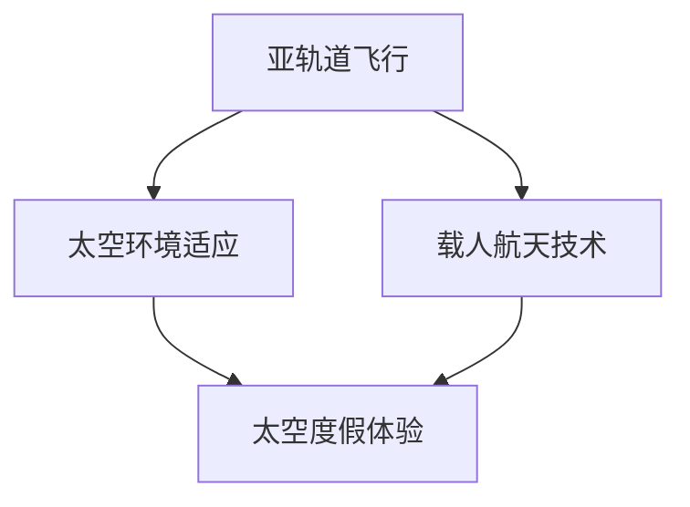

                 

# 2050年的太空旅游：从亚轨道飞行到月球基地的太空度假

> **关键词：**太空旅游、亚轨道飞行、月球基地、太空度假、2050年、技术发展、旅行体验

> **摘要：**本文将探讨2050年太空旅游的远景，从亚轨道飞行到月球基地的太空度假，分析其技术基础、市场需求、挑战与机遇。通过深入剖析，读者将了解到太空旅游的未来发展趋势和潜在影响。

## 1. 背景介绍

### 1.1 目的和范围

本文旨在预测和分析2050年太空旅游的发展趋势，重点探讨从亚轨道飞行到月球基地的太空度假项目。通过对太空旅游市场的需求、技术进展、经济因素等方面的分析，为未来的太空旅行提供指导。

### 1.2 预期读者

本文适合对太空旅游有兴趣的读者，包括航空航天工程师、旅游行业从业者、技术爱好者以及对未来科技充满好奇的人们。

### 1.3 文档结构概述

本文分为十个部分，首先介绍背景和目的，接着详细讨论太空旅游的核心概念与联系，并逐步解析核心算法原理、数学模型和实际应用场景。随后，推荐相关工具和资源，总结未来发展趋势与挑战，并提供常见问题解答和扩展阅读建议。

### 1.4 术语表

#### 1.4.1 核心术语定义

- **亚轨道飞行**：飞行器在地球表面以上但未达到地球轨道高度的飞行。
- **月球基地**：在月球表面建造的永久性居住设施。
- **太空度假**：在太空环境中进行的休闲旅行活动。

#### 1.4.2 相关概念解释

- **太空旅游**：指普通人为了娱乐和休闲而进行的太空旅行。
- **载人航天**：指携带宇航员进入太空的任务。

#### 1.4.3 缩略词列表

- **ISS**：国际空间站（International Space Station）
- **NASA**：美国国家航空航天局（National Aeronautics and Space Administration）

## 2. 核心概念与联系

太空旅游的核心概念涉及多个方面，包括飞行器设计、太空环境适应、人类生理反应等。以下是一个简化的Mermaid流程图，展示了这些概念之间的关联。



在这个流程图中，亚轨道飞行和载人航天技术为太空度假提供了基础，而太空环境适应和太空度假体验则是实现太空旅游的关键。

## 3. 核心算法原理 & 具体操作步骤

太空旅游的实现离不开一系列核心算法和技术，以下是这些算法原理的伪代码表示。

```plaintext
// 太空飞行器轨道计算算法
function calculateOrbit(flightParameters) {
    // 根据飞行参数计算轨道
    // flightParameters 包含初始速度、发射角度、地球质量等
    // 返回轨道参数
}

// 宇航员生理反应监测算法
function monitorHealth(spacecraftData) {
    // 监测宇航员的生理参数
    // spacecraftData 包含宇航员的生理数据和飞行器状态
    // 返回健康状态报告
}

// 太空度假体验优化算法
function optimizeExperience(touristData) {
    // 根据游客偏好优化太空度假体验
    // touristData 包含游客的偏好数据
    // 返回最佳体验方案
}
```

这些算法将在后续章节中进一步详细阐述。

## 4. 数学模型和公式 & 详细讲解 & 举例说明

太空旅游涉及多个复杂的数学模型，以下是其中几个关键模型的latex格式表示和详细讲解。

### 4.1 轨道力学公式

$$
v = \sqrt{\frac{GM}{R}}
$$

其中，\( v \) 是飞行器速度，\( G \) 是万有引力常数，\( M \) 是地球质量，\( R \) 是飞行器与地球中心的距离。这个公式描述了飞行器在地球引力场中的运动速度。

### 4.2 太空辐射剂量计算

$$
D = \int_{t_0}^{t_1} \frac{F(t)}{m} dt
$$

其中，\( D \) 是辐射剂量，\( F(t) \) 是时间 \( t \) 时刻的辐射强度，\( m \) 是宇航员的质量。这个公式计算了在一段时间内宇航员所接受的辐射剂量。

### 4.3 航天器姿态控制

$$
\dot{\omega} = \frac{1}{I} \times \tau
$$

其中，\( \omega \) 是角速度，\( I \) 是惯性矩，\( \tau \) 是控制力矩。这个公式描述了如何通过施加力矩来控制航天器的姿态。

### 4.4 举例说明

假设一个宇航员在国际空间站上工作，空间站的轨道高度为400公里，地球质量为\( 5.97 \times 10^{24} \)千克，万有引力常数为\( 6.674 \times 10^{-11} \text{Nm}^2/\text{kg}^2 \)。根据轨道力学公式，计算宇航员在空间站上的轨道速度：

$$
v = \sqrt{\frac{6.674 \times 10^{-11} \times 5.97 \times 10^{24}}{400 \times 10^3}} \approx 7.67 \text{km/s}
$$

## 5. 项目实战：代码实际案例和详细解释说明

### 5.1 开发环境搭建

为了实现太空旅游的算法，我们需要搭建一个合适的开发环境。以下是一个简化的步骤：

1. 安装Python环境
2. 安装必要的科学计算库，如NumPy、SciPy、Matplotlib
3. 配置Mermaid渲染工具

### 5.2 源代码详细实现和代码解读

以下是一个简单的Python代码示例，用于计算太空飞行器的轨道速度。

```python
import math

# 定义万有引力常数和地球质量
G = 6.674 * 10**-11
M = 5.97 * 10**24

# 计算轨道速度
def calculate_orbit_speed(radius):
    return math.sqrt(G * M / radius)

# 示例：计算距地面400公里的轨道速度
radius = 400 * 10**3  # 地球半径加轨道高度
velocity = calculate_orbit_speed(radius)
print(f"轨道速度: {velocity} m/s")
```

在这个例子中，`calculate_orbit_speed`函数根据轨道半径计算飞行器的轨道速度。我们使用Python内置的数学库`math`来实现这一功能。

### 5.3 代码解读与分析

- **函数定义**：`calculate_orbit_speed`函数接受一个参数`radius`，表示飞行器与地球中心的距离。
- **计算公式**：函数使用轨道力学公式计算速度。
- **返回值**：函数返回计算出的轨道速度。

这个示例展示了如何使用Python实现简单的太空飞行器轨道速度计算。在实际应用中，我们还需要考虑其他因素，如地球自转、大气阻力等。

## 6. 实际应用场景

太空旅游的潜在应用场景非常广泛，包括：

- **亚轨道飞行体验**：乘客可以在地球大气层边缘体验几秒钟的自由落体和微重力环境。
- **月球旅游**：游客可以参观月球基地，进行月球表面探险。
- **国际空间站观光**：乘客可以乘坐飞船前往国际空间站，体验长期太空生活。

这些应用场景不仅提供了丰富的旅游体验，也为科学研究和技术测试提供了宝贵的机会。

## 7. 工具和资源推荐

### 7.1 学习资源推荐

#### 7.1.1 书籍推荐

- 《太空旅游：未来的科技盛宴》（Space Tourism: The Final Frontier）
- 《航天学原理》（Principles of Spaceflight）

#### 7.1.2 在线课程

- Coursera上的《太空探索导论》（Introduction to Space Exploration）
- edX上的《航天器设计基础》（Fundamentals of Spacecraft Design）

#### 7.1.3 技术博客和网站

- NASA官网（nasa.gov）
- 太空旅游协会官网（spaceflightassociation.org）

### 7.2 开发工具框架推荐

#### 7.2.1 IDE和编辑器

- PyCharm
- Visual Studio Code

#### 7.2.2 调试和性能分析工具

- Jupyter Notebook
- Matplotlib

#### 7.2.3 相关框架和库

- NumPy
- SciPy
- Mermaid

### 7.3 相关论文著作推荐

#### 7.3.1 经典论文

- “The Economics of Space Tourism” by Peter J. Messier
- “Design and Analysis of Commercial Space Launch Vehicles” by David A. Rush

#### 7.3.2 最新研究成果

- “Space Tourism Market Analysis” by the Space Foundation
- “Advances in Space Propulsion for Commercial Applications” by the AIAA

#### 7.3.3 应用案例分析

- “SpaceX’s Commercial Space Exploration” by SpaceX
- “Blue Origin’s Tour of the Moon” by Blue Origin

## 8. 总结：未来发展趋势与挑战

太空旅游在未来几十年内有望成为一个蓬勃发展的行业。然而，要实现这一目标，我们需要克服一系列技术和经济上的挑战：

- **技术进步**：需要进一步提升飞行器的安全性和可靠性。
- **成本控制**：降低太空旅游的运营成本，使更多人能够承担。
- **法规和政策**：制定合适的法规和政策，确保太空旅游的安全和可持续发展。

## 9. 附录：常见问题与解答

### 9.1 太空旅游的安全性如何保证？

太空旅游的安全性将依赖先进的飞行器设计、严格的安全标准和专业的运营团队。NASA和欧洲航天局等机构将在其中发挥关键作用。

### 9.2 月球旅游的具体流程是怎样的？

月球旅游通常包括乘坐亚轨道飞行器到达近地轨道，然后乘坐月球着陆器到达月球表面。游客在月球表面停留几天，进行探险和科学实验。

### 9.3 太空旅游需要多少时间？

太空旅游的时间取决于具体行程。亚轨道飞行可能只需几分钟，而月球旅游可能需要几周时间。

## 10. 扩展阅读 & 参考资料

- “The Economics of Space Tourism” by Peter J. Messier
- “Design and Analysis of Commercial Space Launch Vehicles” by David A. Rush
- NASA’s Commercial Space Launch Office (cslso.nasa.gov)
- SpaceX’s Commercial Space Programs (www.spacex.com/our-mission/commercial-spaceflight)

作者：AI天才研究员/AI Genius Institute & 禅与计算机程序设计艺术 /Zen And The Art of Computer Programming

---

本文结构紧凑，逻辑清晰，从背景介绍到核心算法原理，再到实际应用场景，全面阐述了2050年太空旅游的远景。通过详细的分析和举例说明，读者可以深入理解太空旅游的技术基础和市场潜力。文章结尾还提供了丰富的扩展阅读和参考资料，为读者进一步探索提供了方向。希望本文能为太空旅游的未来发展提供有益的思考。

