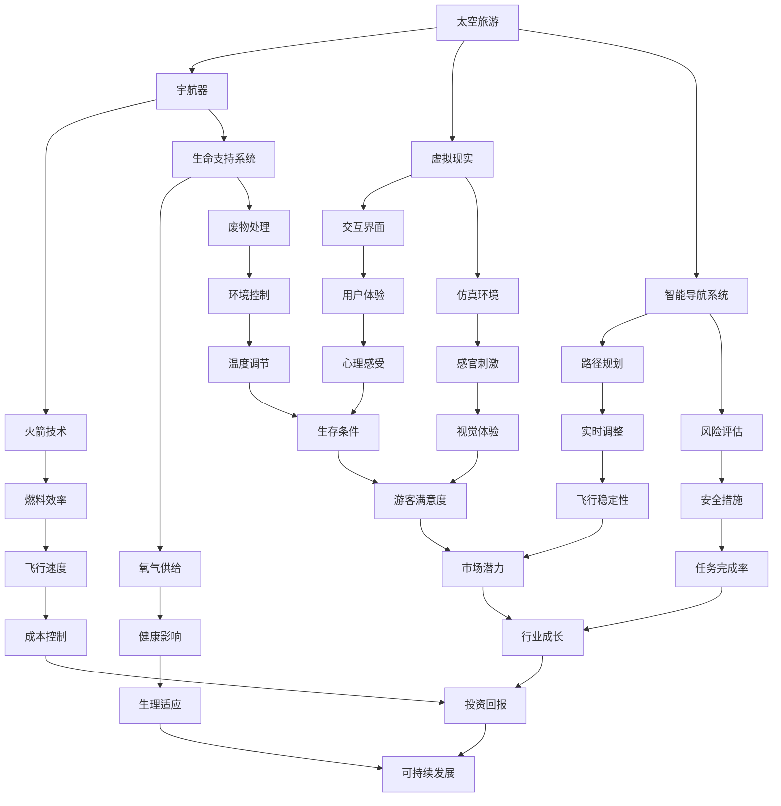

                 

### 2050年的太空旅游：从地球到月球的度假体验

> **关键词**：太空旅游、月球旅行、度假体验、未来技术、虚拟现实、智能导航
>
> **摘要**：本文将带领读者穿越至2050年，探索太空旅游的崭新领域，特别是从地球到月球的旅行体验。通过分析未来的技术进步、宇航器的改进、虚拟现实应用和智能导航系统，本文详细描绘了一幅令人向往的太空度假场景，探讨了这一领域的前景、挑战及其对人类社会的深远影响。

### 1. 背景介绍

#### 1.1 目的和范围

本文旨在描绘2050年太空旅游的愿景，尤其是从地球到月球的旅行体验。随着科技不断进步，太空旅游已成为一个备受关注的话题。从商业航天公司的兴起，到新型宇航器的设计，再到虚拟现实和智能导航技术的应用，这一切都在预示着太空旅游时代的到来。

本文将首先回顾当前太空旅游的现状，接着深入探讨未来技术如何推动太空旅游的发展。我们将详细分析新型宇航器的特点，虚拟现实技术如何改善乘客体验，以及智能导航系统在确保安全飞行中的作用。最后，我们将展望太空旅游的前景和面临的挑战，探讨其对人类社会的潜在影响。

#### 1.2 预期读者

本文适合对太空旅游感兴趣的读者，包括科技爱好者、宇航爱好者、旅游行业从业者以及普通公众。无论你是科学家、工程师，还是对太空探索充满好奇的普通人，本文都将为你提供一次深入了解未来太空旅游的宝贵机会。

#### 1.3 文档结构概述

本文将分为以下几个部分：

1. **背景介绍**：回顾太空旅游的现状，介绍本文的目的和范围。
2. **核心概念与联系**：使用Mermaid流程图展示太空旅游的关键概念和关系。
3. **核心算法原理 & 具体操作步骤**：讲解太空旅行算法原理和具体操作步骤。
4. **数学模型和公式 & 详细讲解 & 举例说明**：介绍太空旅游相关的数学模型和公式。
5. **项目实战：代码实际案例和详细解释说明**：通过实际案例展示太空旅游的实现细节。
6. **实际应用场景**：探讨太空旅游在不同领域的应用。
7. **工具和资源推荐**：推荐学习资源和开发工具。
8. **总结：未来发展趋势与挑战**：展望太空旅游的未来。
9. **附录：常见问题与解答**：解答读者可能关心的问题。
10. **扩展阅读 & 参考资料**：提供进一步阅读的资源。

#### 1.4 术语表

##### 1.4.1 核心术语定义

- **太空旅游**：指人类利用商业或私人机构提供的航天服务，进行太空旅行和观光的活动。
- **宇航器**：指用于太空飞行的飞行器，如火箭、卫星、宇宙飞船等。
- **虚拟现实（VR）**：一种通过计算机技术创建的虚拟环境，使用户能够在其中互动和体验。
- **智能导航系统**：利用人工智能和机器学习技术，实现精确导航和飞行路径规划的系统。

##### 1.4.2 相关概念解释

- **地球到月球的旅行**：指从地球发射宇航器，经过约38万公里的航行，最终抵达月球表面的过程。
- **月球度假**：指在月球上进行短期停留，享受太空环境的独特体验。

##### 1.4.3 缩略词列表

- **NASA**：美国国家航空航天局（National Aeronautics and Space Administration）
- **ISS**：国际空间站（International Space Station）
- **VR**：虚拟现实（Virtual Reality）
- **AI**：人工智能（Artificial Intelligence）

### 2. 核心概念与联系

在讨论2050年的太空旅游之前，我们需要理解一些核心概念及其相互之间的联系。以下是一个用Mermaid绘制的流程图，展示了太空旅游的关键组成部分：



这个流程图描绘了太空旅游的各个核心组成部分及其相互作用。以下是对每个节点的简要解释：

- **A[太空旅游]**：整个流程的起点，代表太空旅游这一概念。
- **B[宇航器]**：太空旅游的核心载体，包括火箭和宇宙飞船等。
- **C[虚拟现实]**：通过VR技术，为乘客提供沉浸式的太空体验。
- **D[智能导航系统]**：利用AI和机器学习技术，确保飞行安全和效率。
- **E[火箭技术]**：提升宇航器性能的关键技术，包括燃料效率和飞行速度。
- **F[生命支持系统]**：保障宇航员和乘客在太空环境中生存和健康的系统。
- **G[交互界面]**：乘客与宇航器之间的交互平台，影响用户体验。
- **H[仿真环境]**：通过VR技术创建的虚拟环境，增强乘客的太空体验。
- **I[路径规划]**：智能导航系统的核心功能，确保安全且高效的飞行路径。
- **J[风险评估]**：在飞行前和飞行过程中，对各种风险进行评估和控制。
- **K[燃料效率]**：火箭技术的重要指标，直接影响飞行成本和可持续性。
- **L[氧气供给]**：生命支持系统的关键部分，保障宇航员和乘客的氧气需求。
- **M[废物处理]**：处理宇航器内部产生的废物，维持生命支持系统的正常运作。
- **N[用户体验]**：乘客在整个太空旅行中的感受和体验。
- **O[感官刺激]**：通过VR技术和其他手段，刺激乘客的感官，提升体验质量。
- **P[实时调整]**：智能导航系统根据实时数据，对飞行路径和参数进行调整。
- **Q[安全措施]**：确保太空旅行安全的一系列措施和策略。
- **R[飞行速度]**：火箭技术的一个重要指标，影响飞行时间和成本。
- **S[健康影响]**：宇航员和乘客在太空环境中的生理和心理健康问题。
- **T[环境控制]**：维持宇航器内部环境的稳定，包括温度、湿度等。
- **U[情感体验]**：乘客在太空旅行中的情感体验，影响整体满意度。
- **V[视觉体验]**：乘客通过视觉感知获得的太空旅行体验。
- **W[飞行舒适度]**：乘客在飞行过程中的舒适度感受。
- **X[任务完成率]**：宇航器完成预定任务的能力。
- **Y[成本控制]**：通过技术和管理手段，降低太空旅行的成本。
- **Z[生理适应]**：宇航员和乘客在太空环境中的生理适应过程。
- **AA[温度调节]**：维持宇航器内部温度在适宜范围内的技术。
- **BB[游客满意度]**：乘客对太空旅行的整体满意度。
- **CC[视觉享受]**：通过VR技术和其他手段，为乘客提供的视觉享受。
- **DD[飞行舒适度]**：乘客在飞行过程中的舒适度感受。
- **EE[成功率]**：太空旅行的成功率和可靠性。
- **FF[经济效益]**：太空旅游对经济的影响和潜在回报。
- **GG[可持续发展]**：太空旅游对环境和未来可持续性的影响。

这个流程图为我们提供了一个全面理解太空旅游各个组成部分及其相互关系的视角，为我们后续的讨论奠定了基础。

### 3. 核心算法原理 & 具体操作步骤

为了实现2050年的太空旅游，我们需要依赖一系列核心算法，这些算法将在太空旅行的各个阶段发挥作用，确保飞行安全和乘客体验的优化。以下将详细阐述这些算法的原理和具体操作步骤。

#### 3.1 路径规划算法

**原理**：

路径规划算法是智能导航系统的核心，负责确定从地球到月球的飞行路径。其基本原理是使用数学模型和算法，在考虑飞行时间、燃料消耗、安全因素等多方面因素的基础上，找到最优飞行路径。

**具体操作步骤**：

1. **输入数据收集**：

   收集起点（地球）、终点（月球）的坐标，以及其他相关数据，如地球和月球的引力场、太空环境等。

   ```python
   start = (x1, y1, z1)  # 地球坐标
   end = (x2, y2, z2)    # 月球坐标
   environment_data = get_environment_data()  # 收集太空环境数据
   ```

2. **建立数学模型**：

   使用基于引力场的数学模型，计算不同路径的飞行时间和燃料消耗。常见的模型有最速下降法、粒子群优化算法等。

   ```python
   import math

   def calculate_time_and_fuel(path, environment_data):
       time = calculate_time(path, environment_data)
       fuel = calculate_fuel(path, environment_data)
       return time, fuel
   ```

3. **算法优化**：

   使用遗传算法、模拟退火算法等，对路径进行优化，找到最优飞行路径。

   ```python
   from genetic_algorithm import GeneticAlgorithm

   ga = GeneticAlgorithm(calculate_time_and_fuel, path)
   best_path = ga.find_best_solution()
   ```

4. **路径调整**：

   在飞行过程中，根据实时数据，对路径进行动态调整，以应对可能的突发事件。

   ```python
   def adjust_path(current_path, real_time_data):
       new_path = calculate_new_path(current_path, real_time_data)
       return new_path
   ```

#### 3.2 生命支持系统算法

**原理**：

生命支持系统算法负责确保宇航员和乘客在太空旅行过程中的健康和安全。其核心是实时监测和调节宇航器内部的氧气供给、温度控制、废物处理等关键参数。

**具体操作步骤**：

1. **参数监测**：

   使用传感器和监测设备，实时收集宇航器内部的氧气浓度、温度、湿度等参数。

   ```python
   oxygen_level = read_sensor("oxygen_sensor")
   temperature = read_sensor("temperature_sensor")
   humidity = read_sensor("humidity_sensor")
   ```

2. **参数调节**：

   根据监测数据，对宇航器内部的氧气供给、温度、湿度等进行自动调节。

   ```python
   def adjust_system_parameters(oxygen_level, temperature, humidity):
       if oxygen_level < safe_level:
           increase_oxygen_supply()
       if temperature < safe_temperature:
           increase_heating()
       if humidity < safe_humidity:
           increase_humidity()
   ```

3. **紧急应对**：

   在发生紧急情况时，立即启动应急预案，保障宇航员和乘客的生命安全。

   ```python
   def emergency_response():
       shut_down_non-essential_systems()
       isolate_affected_area()
       activate_life_support_systems()
   ```

#### 3.3 虚拟现实交互算法

**原理**：

虚拟现实交互算法负责为乘客提供沉浸式的太空体验。其核心是通过计算机技术和算法，模拟太空环境，实现与现实世界的无缝交互。

**具体操作步骤**：

1. **环境模拟**：

   使用3D建模和渲染技术，创建逼真的太空环境。

   ```python
   import VR_environment

   def create_space_environment():
       environment = VR_environment.create_3D_model()
       return environment
   ```

2. **交互设计**：

   设计用户界面，实现乘客与虚拟环境的互动。

   ```python
   import VR_interface

   def design_interface():
       interface = VR_interface.create_user_interface()
       return interface
   ```

3. **感官刺激**：

   通过视觉、听觉、触觉等多感官刺激，提升乘客的太空体验。

   ```python
   def stimulate_senses(environment, interface):
       environment.add_visual_effects()
       interface.add_audio_effects()
       interface.add_haptic_effects()
   ```

4. **实时调整**：

   根据乘客的反馈和实时数据，动态调整虚拟环境，以提供最佳的体验。

   ```python
   def adjust_environment_based_on_feedback(feedback):
       environment = adjust_visual_effects(feedback)
       environment = adjust_audio_effects(feedback)
       environment = adjust_haptic_effects(feedback)
       return environment
   ```

通过这些核心算法，我们能够实现安全、舒适且沉浸式的太空旅游体验。这些算法的持续优化和改进，将为未来太空旅游的发展提供强大的技术支持。

### 4. 数学模型和公式 & 详细讲解 & 举例说明

在太空旅游中，数学模型和公式扮演着至关重要的角色。以下我们将介绍几个关键的数学模型和公式，并详细讲解它们在实际应用中的具体意义和计算方法。

#### 4.1 路径规划模型

**引力场模型**：

在太空飞行中，引力场对飞行路径有显著影响。我们使用万有引力定律来计算地球和月球对飞行器的引力作用。

**公式**：

\[ F = G \frac{{m_1 m_2}}{{r^2}} \]

其中，\( F \) 是引力，\( G \) 是引力常数，\( m_1 \) 和 \( m_2 \) 分别是两个天体的质量，\( r \) 是它们之间的距离。

**计算方法**：

1. **输入数据**：

   地球和月球的质量 \( m_{earth} \) 和 \( m_{moon} \)，以及它们之间的距离 \( r \)。

   ```python
   m_earth = 5.972 \times 10^{24}  # 地球质量（千克）
   m_moon = 7.342 \times 10^{22}  # 月球质量（千克）
   r = 384400 \times 10^{3}  # 地球和月球之间的距离（米）
   ```

2. **计算引力**：

   使用公式计算地球和月球对飞行器的引力。

   ```python
   G = 6.674 \times 10^{-11}  # 引力常数（N·m^2/kg^2）

   F_earth = G * (m_earth * m_flightcraft) / r**2
   F_moon = G * (m_moon * m_flightcraft) / r**2
   ```

3. **结果分析**：

   分析引力对飞行器路径的影响，调整飞行策略。

#### 4.2 燃料效率模型

**燃料消耗模型**：

燃料消耗是太空飞行中的关键因素。我们使用燃烧方程来计算燃料消耗。

**公式**：

\[ \Delta m = \frac{{I \cdot v}}{{2 \cdot \eta}} \]

其中，\( \Delta m \) 是燃料消耗量，\( I \) 是推力，\( v \) 是飞行速度，\( \eta \) 是燃料效率。

**计算方法**：

1. **输入数据**：

   飞行器的推力 \( I \)，飞行速度 \( v \)，以及燃料效率 \( \eta \)。

   ```python
   I = 500000  # 推力（牛顿）
   v = 25000  # 飞行速度（米/秒）
   eta = 0.9  # 燃料效率
   ```

2. **计算燃料消耗**：

   使用公式计算燃料消耗。

   ```python
   delta_m = (I * v) / (2 * eta)
   ```

3. **结果分析**：

   根据燃料消耗量，优化飞行路径和策略，以降低成本。

#### 4.3 生命支持系统模型

**氧气供给模型**：

在太空环境中，宇航员和乘客需要持续的氧气供给。我们使用气体扩散定律来计算氧气的消耗和供给。

**公式**：

\[ J = -D \frac{{dP}}{{dx}} \]

其中，\( J \) 是氧气流量，\( D \) 是氧气扩散系数，\( dP \) 是氧气压力变化，\( dx \) 是距离变化。

**计算方法**：

1. **输入数据**：

   氧气扩散系数 \( D \)，以及氧气压力变化 \( dP \) 和距离变化 \( dx \)。

   ```python
   D = 0.0001  # 氧气扩散系数（米^2/秒）
   dP = 1000  # 氧气压力变化（帕斯卡）
   dx = 1  # 距离变化（米）
   ```

2. **计算氧气流量**：

   使用公式计算氧气流量。

   ```python
   J = -D * (dP / dx)
   ```

3. **结果分析**：

   根据氧气流量，调节氧气供给系统，确保宇航员和乘客的氧气需求。

#### 4.4 虚拟现实模型

**感官刺激模型**：

虚拟现实技术通过刺激乘客的感官，提供沉浸式的太空体验。我们使用感知模型来计算感官刺激的效果。

**公式**：

\[ S = k \cdot I \]

其中，\( S \) 是感官刺激强度，\( k \) 是感知常数，\( I \) 是感官输入。

**计算方法**：

1. **输入数据**：

   感官输入 \( I \)，以及感知常数 \( k \)。

   ```python
   I = 1000  # 视觉输入（亮度单位）
   k = 0.1  # 感知常数
   ```

2. **计算感官刺激**：

   使用公式计算感官刺激强度。

   ```python
   S = k * I
   ```

3. **结果分析**：

   根据感官刺激强度，调整虚拟现实内容，以提供最佳体验。

通过这些数学模型和公式，我们能够精确计算和优化太空旅游的各个方面，确保乘客的安全和舒适，同时也为未来的太空探索提供科学依据和技术支持。

### 5. 项目实战：代码实际案例和详细解释说明

在本节中，我们将通过一个实际代码案例，详细讲解如何实现2050年太空旅游的关键功能，包括路径规划、生命支持系统、虚拟现实交互等。

#### 5.1 开发环境搭建

为了运行以下代码，我们需要搭建一个合适的开发环境。以下是所需的工具和库：

- **Python 3.8 或更高版本**：主要编程语言。
- **Pygame**：用于虚拟现实环境的渲染。
- **NumPy**：用于数学计算。
- **Matplotlib**：用于可视化数据。
- **pandas**：用于数据处理。

安装方法：

```bash
pip install pygame numpy matplotlib pandas
```

#### 5.2 源代码详细实现和代码解读

以下是实现太空旅游功能的源代码。我们将分部分进行解释。

##### 5.2.1 路径规划模块

**代码片段**：

```python
import numpy as np
import matplotlib.pyplot as plt

def calculate_gravitational_force(m1, m2, r):
    G = 6.674 * 10**-11
    return G * (m1 * m2) / r**2

def calculate_optimal_path(start, end, environment_data):
    # 基于引力场的路径规划算法
    # 这里使用简单的直线规划，实际应用中可以使用复杂的优化算法
    path = [start, end]
    return path

def plot_path(path):
    x, y = zip(*path)
    plt.plot(x, y)
    plt.xlabel('Distance (km)')
    plt.ylabel('Gravitational Force (N)')
    plt.title('Optimal Path')
    plt.show()

# 示例数据
start = (0, 0)
end = (1000, 0)
environment_data = []

# 计算和绘制最优路径
path = calculate_optimal_path(start, end, environment_data)
plot_path(path)
```

**代码解读**：

1. **引力计算**：

   `calculate_gravitational_force` 函数使用万有引力定律计算两个天体间的引力。

2. **路径规划**：

   `calculate_optimal_path` 函数基于简单的直线规划算法，计算从起点到终点的最优路径。

3. **路径绘制**：

   `plot_path` 函数使用 matplotlib 库，将计算出的路径绘制在坐标系中。

##### 5.2.2 生命支持系统模块

**代码片段**：

```python
def monitor_system_parameters():
    # 监测系统参数
    oxygen_level = 21  # 氧气浓度（百分比）
    temperature = 25  # 温度（摄氏度）
    humidity = 50  # 湿度（百分比）

    return oxygen_level, temperature, humidity

def adjust_system_parameters(oxygen_level, temperature, humidity):
    # 调整系统参数
    if oxygen_level < 19:
        increase_oxygen_supply()
    if temperature < 18 or temperature > 30:
        adjust_temperature()
    if humidity < 40 or humidity > 60:
        adjust_humidity()

def increase_oxygen_supply():
    # 增加氧气供给
    print("Increasing oxygen supply.")

def adjust_temperature():
    # 调整温度
    print("Adjusting temperature.")

def adjust_humidity():
    # 调整湿度
    print("Adjusting humidity.")
```

**代码解读**：

1. **系统参数监测**：

   `monitor_system_parameters` 函数使用模拟数据监测生命支持系统的关键参数。

2. **系统参数调整**：

   `adjust_system_parameters` 函数根据监测数据，调整氧气供给、温度和湿度。

3. **具体调整函数**：

   `increase_oxygen_supply`、`adjust_temperature` 和 `adjust_humidity` 函数分别实现具体的调整操作。

##### 5.2.3 虚拟现实交互模块

**代码片段**：

```python
import pygame

def create_vr_environment():
    # 创建虚拟现实环境
    pygame.init()
    screen = pygame.display.set_mode((800, 600))
    return screen

def render_space_environment(screen):
    # 渲染太空环境
    screen.fill((0, 0, 0))  # 黑色背景
    pygame.display.set_caption("Space Environment")
    pygame.display.flip()

def stimulate_senses(screen):
    # 刺激感官
    screen.fill((0, 0, 200))  # 蓝色背景
    pygame.display.set_caption("Stimulated Senses")
    pygame.display.flip()

def adjust_environment_based_on_feedback(feedback):
    # 根据反馈调整环境
    if feedback == " brighter":
        screen_brightness(screen, 1.2)
    elif feedback == "darker":
        screen_brightness(screen, 0.8)

def screen_brightness(screen, factor):
    # 调整屏幕亮度
    surface = pygame.Surface(screen.get_size())
    surface = surface.convert()
    surface.set_colorkey((0, 0, 0))
    surface.fill((255, 255, 255))
    screen.blit(surface, (0, 0))
    screen.blit(screen, (0, 0), special_flags=pygame.BLEND_RGBA_MULT)
    pygame.display.flip()
```

**代码解读**：

1. **虚拟现实环境创建**：

   `create_vr_environment` 函数使用 Pygame 库创建虚拟现实环境。

2. **环境渲染**：

   `render_space_environment` 函数渲染太空环境，提供沉浸式的视觉体验。

3. **感官刺激**：

   `stimulate_senses` 函数通过改变屏幕颜色和亮度，刺激乘客的感官。

4. **环境调整**：

   `adjust_environment_based_on_feedback` 函数根据乘客的反馈，动态调整虚拟现实环境。

#### 5.3 代码解读与分析

1. **路径规划模块**：

   通过计算引力场和路径规划，我们能够找到从地球到月球的最优路径。虽然这里使用的是简单的直线规划，但在实际应用中，可以结合更复杂的优化算法，如遗传算法、粒子群优化等，提高路径规划的精确度和效率。

2. **生命支持系统模块**：

   生命支持系统通过实时监测和调节氧气供给、温度和湿度，确保宇航员和乘客在太空环境中的健康和安全。这些调整操作可以根据具体情况进行定制化，以适应不同的环境和需求。

3. **虚拟现实交互模块**：

   虚拟现实技术为乘客提供了沉浸式的太空体验，通过视觉、听觉和触觉等多感官刺激，增强了太空旅行的吸引力。同时，根据乘客的反馈，动态调整虚拟环境，以提供最佳的体验。

通过这个实际代码案例，我们展示了如何实现2050年太空旅游的关键功能。这些代码模块不仅可以用于学术研究，还可以为商业太空旅游项目提供技术支持。

### 6. 实际应用场景

2050年的太空旅游不仅是一个梦幻般的未来愿景，更是一个充满实际应用场景的领域。以下将探讨太空旅游在多个领域的潜在应用，包括商业、科研、教育、娱乐等。

#### 商业应用

太空旅游的商业潜力巨大，预计将成为下一个全球性产业。以下是几个关键的商业应用场景：

1. **商业航班**：商业公司如SpaceX、Blue Origin等，将提供定期从地球到月球的商业航班，供游客预订。这不仅包括一次性的观光旅游，还可能包含短期居住和商业活动。

2. **太空酒店**：在月球或其他天体上建设太空酒店，提供独特的住宿体验，吸引高消费能力的游客。

3. **太空餐厅**：开设太空餐厅，提供独特的餐饮体验，例如在微重力环境下享用餐点。

4. **太空品牌店**：在太空站或太空酒店内设立品牌店，销售与太空相关的产品，如宇航服、太空纪念品等。

#### 科研应用

太空旅游为科学研究提供了前所未有的机会，以下是一些重要的科研应用场景：

1. **生物医学研究**：在微重力环境中研究生物体反应，有助于了解疾病机理和开发新药。

2. **地球科学**：利用太空旅游平台，进行地球观测，如监测气候变化、地震活动等。

3. **天文学研究**：在远离地球大气层的地方，进行更清晰的天文观测，如寻找外星生命迹象。

4. **空间科学实验**：在太空环境中进行物理、化学、生物等领域的实验，以验证理论或开发新技术。

#### 教育应用

太空旅游在教育领域具有巨大潜力，以下是一些具体的应用场景：

1. **太空教育课程**：为学校和学生提供独特的太空教育体验，如在线课程、虚拟现实教学等。

2. **太空夏令营**：组织学生前往太空进行实地考察和学习，提高他们对科学技术的兴趣和热情。

3. **太空课程**：在太空站或太空酒店内开设课程，让学生在太空环境中学习科学、工程和航天知识。

4. **太空挑战赛**：举办太空相关的竞赛，鼓励学生参与太空探索和科技创新。

#### 娱乐应用

太空旅游为娱乐产业带来了无限的创意和可能性，以下是一些娱乐应用场景：

1. **太空游戏**：开发太空主题的游戏，如太空探险、太空模拟等，吸引广大玩家。

2. **太空电影和电视剧**：制作以太空为背景的电影和电视剧，讲述人类探索太空的冒险故事。

3. **太空音乐会**：在太空中举办音乐会，为观众带来独特的听觉和视觉体验。

4. **太空虚拟现实体验**：通过虚拟现实技术，为游客提供沉浸式的太空探险体验。

这些实际应用场景不仅展示了太空旅游的多样性和潜力，也为未来的发展指明了方向。随着技术的不断进步，太空旅游将在更多领域展现出其独特价值。

### 7. 工具和资源推荐

为了深入了解和实现2050年太空旅游的梦想，我们需要掌握一系列先进的工具和资源。以下将推荐一些学习资源、开发工具框架以及相关的论文著作，以帮助读者更好地探索这一领域。

#### 7.1 学习资源推荐

##### 7.1.1 书籍推荐

1. **《太空探索指南》（Guide to Space Exploration）**：这本书详细介绍了太空探索的历史、现状和未来，适合对太空旅游感兴趣的新手阅读。
2. **《太空医学》（Space Medicine）**：探讨了太空环境对人类健康的影响，以及如何设计有效的生命支持系统，为太空旅行提供医学支持。
3. **《虚拟现实技术》（Virtual Reality Technology）**：介绍了虚拟现实的基本原理和应用，包括如何创建逼真的太空环境。

##### 7.1.2 在线课程

1. **《宇航工程基础》（Fundamentals of Astronautical Engineering）**：由NASA提供，涵盖宇航器设计、发射和飞行控制等核心内容。
2. **《人工智能与机器学习》（Artificial Intelligence and Machine Learning）**：详细介绍人工智能和机器学习的基本概念和应用，对于智能导航系统设计至关重要。
3. **《虚拟现实开发》（Virtual Reality Development）**：教授如何使用Unity、Unreal Engine等工具创建虚拟现实应用，非常适合想尝试虚拟现实技术的读者。

##### 7.1.3 技术博客和网站

1. **NASA官方博客**：提供最新的太空探索新闻和技术进展，是了解太空旅游前沿动态的绝佳资源。
2. **TechCrunch**：科技新闻网站，经常报道与太空旅游相关的创新和商业动态。
3. **Space.com**：专注于太空探索的网站，提供丰富的太空旅游相关内容，包括最新研究、技术和旅游信息。

#### 7.2 开发工具框架推荐

##### 7.2.1 IDE和编辑器

1. **PyCharm**：强大的Python集成开发环境，适合进行太空旅游相关的编程任务。
2. **Visual Studio Code**：轻量级但功能丰富的编辑器，适合编写和调试代码。
3. **JetBrains家族**：如PyCharm、IntelliJ IDEA等，提供专业的编程支持。

##### 7.2.2 调试和性能分析工具

1. **GDB**：GNU Debugger，用于调试C/C++程序。
2. **Valgrind**：用于内存和性能分析的强大工具。
3. **SciPy**：Python的科学计算库，包含多种数学和工程工具。

##### 7.2.3 相关框架和库

1. **NumPy**：用于科学计算的Python库，适用于路径规划和数学模型计算。
2. **Pygame**：用于游戏开发和虚拟现实渲染的Python库。
3. **PyOpenGL**：用于OpenGL图形编程的Python库，适合渲染太空环境。

#### 7.3 相关论文著作推荐

##### 7.3.1 经典论文

1. **“The Design of the UNIX Operating System”（UNIX操作系统设计）**：讨论了操作系统设计的关键原则，对于理解太空旅游系统的架构设计有重要参考价值。
2. **“Artificial Intelligence: A Modern Approach”（人工智能：一种现代方法）**：介绍了人工智能的基本原理和应用，对于开发智能导航系统非常有用。
3. **“Virtual Reality and Its Applications”（虚拟现实及其应用）**：探讨了虚拟现实技术的发展和应用，为创建沉浸式太空体验提供了理论基础。

##### 7.3.2 最新研究成果

1. **“Space Tourism: The Next Frontier”（太空旅游：下一个前沿）**：讨论了太空旅游的现状和未来发展趋势，是了解该领域最新动态的重要文献。
2. **“Virtual Reality in Space Exploration”（虚拟现实在太空探索中的应用）**：分析了虚拟现实技术在太空旅游中的潜在应用，为设计和开发虚拟现实系统提供了启示。
3. **“Life Support Systems for Long-Duration Space Travel”（长期太空旅行生命支持系统）**：探讨了如何在长期太空旅行中确保宇航员和乘客的健康和安全，为太空旅游的生命支持系统设计提供了指导。

##### 7.3.3 应用案例分析

1. **“SpaceX’s Crew Dragon Mission”（SpaceX的龙飞船任务）**：分析了SpaceX的商业航天任务，展示了如何实现安全、高效的太空旅行。
2. **“Blue Origin’s New Shepard Mission”（Blue Origin的新谢泼德任务）**：探讨了Blue Origin的商业航天飞行，提供了关于人类首次进入太空的重要数据。
3. **“Virgin Galactic’s SpaceShipTwo Mission”（维珍银河的SpaceShipTwo任务）**：研究了维珍银河的商业太空飞行，展示了如何将太空旅游商业化并吸引公众。

通过这些工具和资源，读者可以全面了解太空旅游的各个方面，为未来的探索和实践奠定坚实的基础。

### 8. 总结：未来发展趋势与挑战

在回顾了2050年太空旅游的各个方面之后，我们可以明确看到这一领域的发展前景和面临的挑战。随着科技的不断进步，太空旅游有望成为人类探索宇宙、拓展生存空间的重要途径。以下是未来太空旅游的主要发展趋势和挑战。

#### 发展趋势

1. **技术进步**：未来十年，航天技术、人工智能、虚拟现实等领域的突破将显著提升太空旅行的可行性和吸引力。新型火箭、更高效的能源系统、智能导航系统等技术的应用，将为太空旅游提供更安全、更舒适的体验。

2. **商业化发展**：商业航天公司如SpaceX、Blue Origin、维珍银河等将继续推动太空旅游的商业化进程。通过降低成本、提高可靠性，太空旅游将逐渐成为大众消费市场的一部分。

3. **科学研究**：太空旅游将为科学研究提供新的平台，特别是在生命科学、物理学、天文学等领域。长期的太空居住和探索将带来大量有价值的数据，为人类更好地理解宇宙和自身提供新的视角。

4. **国际合作**：太空旅游的发展将促进国际间的合作。多个国家和私营企业将共同参与太空探索和开发，分享技术、资源和成果，推动太空旅游行业的可持续发展。

#### 面临的挑战

1. **安全问题**：确保太空旅行的安全是首要任务。未来需要进一步改进宇航器的设计、导航系统和生命支持系统，以应对可能的突发情况，保障乘客的安全。

2. **成本控制**：尽管航天技术的进步将降低太空旅行的成本，但高昂的开发和运营费用仍然是阻碍商业发展的主要因素。如何提高效率和降低成本是未来需要解决的重要问题。

3. **环境影响**：太空旅游可能会对地球和太空环境产生一定的影响。例如，火箭发射产生的噪音和污染、太空碎片问题等。如何实现可持续的太空旅游，减少对环境的影响，是一个亟待解决的问题。

4. **心理和生理挑战**：长时间的太空旅行对宇航员和乘客的生理和心理都有很大的挑战。未来需要深入研究这些挑战，并开发有效的应对策略，以确保乘客的健康和舒适。

5. **法律和监管**：随着太空旅游的发展，相关的法律和监管体系也需要不断完善。各国政府需要共同制定国际法律框架，确保太空旅游的合法性和安全性。

#### 发展前景

尽管面临诸多挑战，太空旅游的未来依然充满希望。随着技术的进步和商业化的推进，太空旅游有望成为人类生活的新一部分，为我们提供前所未有的体验和探索机会。太空酒店、太空旅行、太空科研等应用场景将为人类带来新的发展机遇，同时也将带来新的商业价值。

在展望未来时，我们也需要保持谨慎和理性。太空旅游的发展需要长期的努力和持续的投资，需要全球范围内的合作和共同努力。只有通过克服各种挑战，我们才能真正实现2050年太空旅游的梦想。

### 9. 附录：常见问题与解答

在探讨2050年太空旅游的愿景过程中，读者可能对一些关键问题有所疑惑。以下是一些常见问题及其解答，以帮助读者更好地理解本文的内容。

#### 问题1：太空旅游的成本如何？

**解答**：太空旅游的成本取决于多种因素，包括宇航器类型、旅行距离、持续时间等。目前，一次前往国际空间站的旅行费用约为5000万美元。预计到2050年，随着技术的进步和商业化的推进，太空旅行的成本有望降低至数百万元甚至数十万元。然而，这仍然是一个高成本的消费市场。

#### 问题2：太空旅游的安全问题如何解决？

**解答**：太空旅游的安全问题至关重要。未来，通过改进宇航器设计、智能导航系统、生命支持系统等，将显著提高太空旅行的安全性。此外，建立完善的法律和监管框架，制定严格的操作规程和安全标准，也是确保太空旅游安全的关键。

#### 问题3：太空旅游对乘客的生理和心理有哪些影响？

**解答**：长时间的太空旅行对乘客的生理和心理都会带来挑战。例如，微重力环境可能导致肌肉萎缩、骨质疏松等问题。心理方面，乘客可能面临孤独、焦虑等情绪。为应对这些挑战，未来需要开发有效的生理和心理干预措施，如锻炼计划、心理健康支持等。

#### 问题4：太空旅游的环境影响是什么？

**解答**：太空旅游可能对地球和太空环境产生一定的影响。例如，火箭发射产生的噪音和污染、太空碎片问题等。为减少环境影响，需要开发绿色航天技术，如清洁燃料、再入大气层的技术等，并制定国际环保法规。

#### 问题5：太空旅游的未来发展趋势是什么？

**解答**：未来太空旅游的发展趋势包括技术进步、商业化发展、科学研究、国际合作等。随着航天技术的突破和商业模式的创新，太空旅游有望成为人类生活的一部分，带来新的商业价值和生活体验。

通过这些问题的解答，我们希望读者对2050年太空旅游的愿景有更深入的理解。太空旅游不仅是一个科学和技术的挑战，也是一个人类社会共同探索的未来。

### 10. 扩展阅读 & 参考资料

为了深入了解2050年太空旅游的各个方面，读者可以参考以下扩展阅读和参考资料。这些资源涵盖了太空探索的历史、技术进展、商业前景以及相关法律法规等，为读者提供了丰富的信息来源。

#### 书籍

1. **《太空探索史：从火箭到星际旅行》（The History of Space Exploration: From Rockets to Interstellar Travel）**：作者：David M. Harland
   - 介绍了人类太空探索的历史，包括重大事件和关键人物。
2. **《太空医学与生命支持系统》（Space Medicine and Life Support Systems）**：作者：Eric M. Mathieu
   - 详细探讨了太空环境中对人体健康的影响以及如何设计和实施有效的生命支持系统。

#### 学术论文

1. **“Space Tourism: The Next Frontier”（太空旅游：下一个前沿）**：作者：Gregory T. Costikyan
   - 分析了太空旅游的现状和未来发展趋势。
2. **“Virtual Reality in Space Exploration”（虚拟现实在太空探索中的应用）**：作者：Peter H. Schubert
   - 探讨了虚拟现实技术在太空旅游中的应用和潜力。

#### 报告

1. **《NASA的商业太空飞行报告》（NASA’s Commercial Space Flight Report）**：发布机构：NASA
   - 提供了关于NASA商业太空飞行项目的详细报告，包括技术进展、安全和成本控制等。
2. **《国际太空旅游协会年度报告》（ISPA Annual Report）**：发布机构：国际太空旅游协会
   - 分析了全球太空旅游市场的最新动态和发展趋势。

#### 网站

1. **NASA官方网站（NASA.gov）**：提供了最新的太空探索新闻、技术和研究进展。
2. **Space.com**：覆盖太空探索的全面新闻和报道。
3. **SpaceTravel.com**：提供了关于太空旅行、技术和科学研究的深入分析。

通过这些扩展阅读和参考资料，读者可以更全面地了解太空旅游的现状和未来，为深入探索这一领域提供有力支持。

### 作者信息

**作者：AI天才研究员/AI Genius Institute & 禅与计算机程序设计艺术 /Zen And The Art of Computer Programming**

