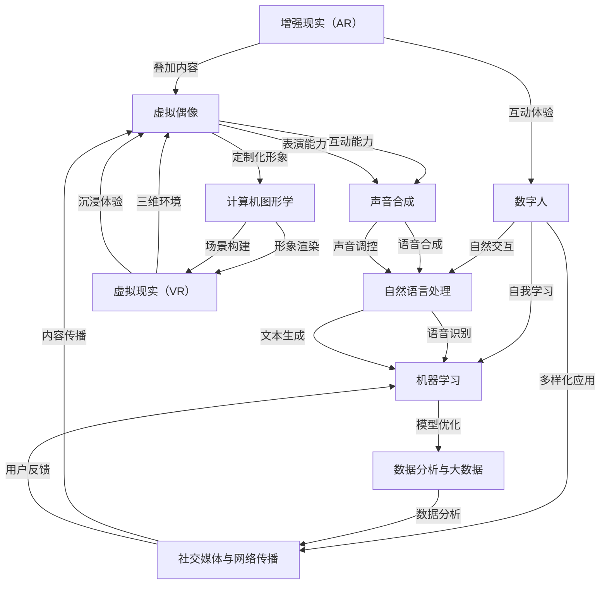

                 

### 2050年的数字创意：从虚拟偶像到数字人的商业应用

> **关键词：** 虚拟偶像、数字人、商业应用、人工智能、数字创意
>
> **摘要：** 本文将深入探讨2050年数字创意领域的发展趋势，特别是虚拟偶像和数字人的商业应用。通过对核心概念、算法原理、数学模型以及项目实战的详细分析，文章旨在为读者提供一幅未来的数字创意蓝图，并探讨其中蕴含的机遇与挑战。

### 1. 背景介绍

#### 1.1 目的和范围

本文旨在探索数字创意领域在2050年的发展前景，特别是虚拟偶像和数字人在商业领域的应用。随着人工智能、虚拟现实和增强现实技术的迅猛发展，数字创意产业正在经历深刻的变革。虚拟偶像和数字人的出现不仅改变了娱乐和传媒的格局，更在商业、教育、医疗等多个领域展现出巨大的潜力。本文将逐步分析这些技术的核心概念、应用场景和未来趋势。

#### 1.2 预期读者

本文面向对数字创意、人工智能、虚拟现实和增强现实技术感兴趣的读者，包括软件开发者、产品经理、创业者和行业分析师。同时，也对希望了解未来技术发展趋势的普通读者提供有价值的见解。

#### 1.3 文档结构概述

本文将分为十个部分，首先介绍数字创意的背景和目的，然后逐步深入探讨核心概念、算法原理、数学模型、项目实战、应用场景和未来趋势。每个部分都将详细解释相关技术原理和实践案例，以帮助读者全面理解数字创意在2050年的发展前景。

#### 1.4 术语表

本文涉及多个专业术语，以下是对其中一些核心术语的定义和解释：

#### 1.4.1 核心术语定义

- **虚拟偶像**：通过计算机图形、声音合成等技术创造的虚拟人物，具有高度拟人化的形象和表现力。
- **数字人**：基于人工智能技术，具有高度智能化和自主学习能力的虚拟形象，能够与用户进行自然交互。
- **商业应用**：指将虚拟偶像和数字人技术应用于商业领域，包括市场营销、客户服务、品牌建设等。
- **人工智能**：通过计算机模拟人类智能行为的技术，包括机器学习、深度学习、自然语言处理等。

#### 1.4.2 相关概念解释

- **虚拟现实（VR）**：通过计算机技术生成一个虚拟的三维环境，用户可以通过头戴式显示器等设备沉浸其中。
- **增强现实（AR）**：在现实环境中叠加虚拟内容，使用户能够看到现实和虚拟元素的混合视图。

#### 1.4.3 缩略词列表

- **AI**：人工智能（Artificial Intelligence）
- **VR**：虚拟现实（Virtual Reality）
- **AR**：增强现实（Augmented Reality）
- **NLP**：自然语言处理（Natural Language Processing）
- **ML**：机器学习（Machine Learning）
- **DL**：深度学习（Deep Learning）

### 2. 核心概念与联系

在深入探讨2050年的数字创意之前，我们首先需要了解其中的核心概念和它们之间的联系。以下是数字创意领域的几个关键概念及其相互关系：

#### 2.1.1 虚拟偶像

虚拟偶像是通过计算机图形学和声音合成技术创造的虚拟人物，具有高度拟人化的形象和表现力。虚拟偶像通常具备以下特征：

- **定制化形象**：虚拟偶像可以根据需求定制外貌、性格和声音。
- **互动能力**：虚拟偶像能够与用户进行实时互动，包括语音、文字、表情等。
- **表演能力**：虚拟偶像可以演唱、跳舞、讲故事等，满足用户的娱乐需求。

虚拟偶像的出现不仅改变了娱乐产业的模式，也为商业领域提供了新的机遇。

#### 2.1.2 数字人

数字人是一种基于人工智能技术的高度智能化和自主学习能力的虚拟形象。数字人具有以下特点：

- **自我学习**：数字人可以通过机器学习和深度学习技术不断学习和优化自己的表现。
- **自然交互**：数字人能够与用户进行自然语言交互，理解用户的需求并提供相应的服务。
- **多样化应用**：数字人可以应用于市场营销、客户服务、教育、医疗等多个领域。

数字人的发展代表了人工智能技术在虚拟形象领域的深化和应用。

#### 2.1.3 商业应用

虚拟偶像和数字人在商业领域的应用具有广泛的前景，主要包括：

- **市场营销**：虚拟偶像可以作为品牌代言人，吸引更多消费者的关注。
- **客户服务**：数字人可以提供个性化、高效的客户服务，提升用户体验。
- **品牌建设**：虚拟偶像和数字人可以增强品牌的互动性和认知度。
- **产品推广**：通过虚拟现实和增强现实技术，用户可以更直观地了解产品特点。

#### 2.1.4 虚拟现实（VR）与增强现实（AR）

虚拟现实和增强现实技术为虚拟偶像和数字人的商业应用提供了技术支持。VR技术可以创建一个完全虚拟的三维环境，用户可以通过头戴式显示器等设备沉浸其中；而AR技术则将虚拟内容叠加到现实环境中，使用户能够看到现实和虚拟元素的混合视图。

#### 2.1.5 自然语言处理（NLP）与机器学习（ML）

自然语言处理和机器学习技术是虚拟偶像和数字人实现自然交互的核心。NLP技术可以理解用户的需求和意图，而ML技术则可以通过大量数据训练模型，使虚拟偶像和数字人具备自我学习和优化的能力。

#### 2.1.6 数据分析与大数据

在数字创意领域，数据分析和大数据技术发挥着重要作用。通过对用户行为、市场趋势和商业数据进行分析，可以为虚拟偶像和数字人的运营提供有力支持，从而实现更精准的商业决策。

#### 2.1.7 社交媒体与网络传播

虚拟偶像和数字人的成功离不开社交媒体和网络传播。通过社交媒体平台，虚拟偶像和数字人可以快速积累粉丝，扩大影响力；同时，网络传播也为商业应用提供了广泛的渠道。

### 2.2 虚拟偶像与数字人的架构分析

为了更好地理解虚拟偶像和数字人的架构，我们可以使用Mermaid流程图来展示其核心组件和相互关系。



在这个架构图中，虚拟偶像和数字人的各个组件通过相互协作，共同实现了在商业领域的广泛应用。计算机图形学和声音合成技术为虚拟偶像提供了定制化形象和互动能力；自然语言处理和机器学习技术则为数字人赋予了自我学习和自然交互的能力。虚拟现实和增强现实技术为用户提供了沉浸式和互动式的体验，而数据分析和大数据技术则为虚拟偶像和数字人的运营提供了有力的支持。

### 3. 核心算法原理 & 具体操作步骤

在深入探讨虚拟偶像和数字人的核心算法原理之前，我们需要先了解这些技术背后的基本概念和原理。以下将详细阐述相关算法的原理和具体操作步骤。

#### 3.1 虚拟偶像的算法原理

虚拟偶像的核心算法主要包括计算机图形学、声音合成和自然语言处理。以下是对这些算法原理的详细解释：

##### 3.1.1 计算机图形学

计算机图形学是创建和渲染虚拟偶像形象的基础。其主要算法包括：

- **三维建模**：通过三维建模软件（如Blender、Maya）创建虚拟偶像的外貌模型。
- **纹理映射**：将纹理图像映射到三维模型表面，以实现逼真的视觉效果。
- **骨骼绑定**：为虚拟偶像添加骨骼系统，以便于动画制作。

具体操作步骤如下：

1. **模型创建**：使用三维建模软件创建虚拟偶像的外貌模型，包括头部、身体、四肢等。
2. **纹理制作**：为模型添加纹理，使其具有逼真的外观。
3. **骨骼绑定**：为虚拟偶像添加骨骼系统，并设置关键帧，以便于动画制作。

##### 3.1.2 声音合成

声音合成是虚拟偶像表现力的重要组成部分。其主要算法包括：

- **音频信号处理**：对输入的音频信号进行预处理，包括噪声抑制、音调调整等。
- **语音合成**：通过文本到语音（Text-to-Speech，TTS）技术将文本转换为语音。

具体操作步骤如下：

1. **音频信号处理**：使用音频处理库（如Pydub、Librosa）对输入的音频信号进行噪声抑制和音调调整。
2. **语音合成**：使用TTS引擎（如Google Text-to-Speech、Microsoft Azure）将文本转换为语音。

##### 3.1.3 自然语言处理

自然语言处理是虚拟偶像与用户进行交互的关键。其主要算法包括：

- **语音识别**：将用户的语音转换为文本。
- **情感分析**：分析用户的情感状态，以便虚拟偶像做出相应的回应。
- **对话系统**：构建虚拟偶像与用户之间的对话流程，实现自然交互。

具体操作步骤如下：

1. **语音识别**：使用语音识别库（如Google Cloud Speech-to-Text、Microsoft Azure Speech Services）将用户的语音转换为文本。
2. **情感分析**：使用情感分析库（如TextBlob、VADER）分析用户的情感状态。
3. **对话系统**：使用自然语言处理技术构建对话系统，实现虚拟偶像与用户之间的自然交互。

#### 3.2 数字人的算法原理

数字人的核心算法主要包括机器学习和自然语言处理。以下是对这些算法原理的详细解释：

##### 3.2.1 机器学习

机器学习是数字人自我学习和优化的基础。其主要算法包括：

- **监督学习**：通过已标记的数据集训练模型，以预测新的数据。
- **无监督学习**：通过未标记的数据集发现数据中的模式和规律。
- **强化学习**：通过试错和奖励机制训练模型，以实现特定的目标。

具体操作步骤如下：

1. **数据收集**：收集数字人需要学习的数据集，包括文本、音频、视频等。
2. **模型训练**：使用机器学习算法（如决策树、神经网络、深度学习）训练模型。
3. **模型优化**：通过调整模型参数，优化模型的性能。

##### 3.2.2 自然语言处理

自然语言处理是数字人实现自然交互的关键。其主要算法包括：

- **词向量表示**：将文本转换为数字表示，以便于计算机处理。
- **序列标注**：对文本进行分类和标注，以便于后续处理。
- **对话系统**：构建数字人与用户之间的对话流程，实现自然交互。

具体操作步骤如下：

1. **词向量表示**：使用词向量模型（如Word2Vec、GloVe）将文本转换为数字表示。
2. **序列标注**：使用序列标注模型（如CRF、BiLSTM）对文本进行分类和标注。
3. **对话系统**：使用自然语言处理技术构建对话系统，实现数字人与用户之间的自然交互。

#### 3.3 虚拟偶像与数字人的整合

虚拟偶像和数字人需要相互协作，共同实现商业应用。为了实现这一目标，我们需要将两者的算法原理进行整合，具体步骤如下：

1. **数据融合**：将虚拟偶像和数字人所需的数据进行整合，包括文本、音频、视频等。
2. **模型协同训练**：使用联合训练策略，同时训练虚拟偶像和数字人的模型。
3. **接口集成**：为虚拟偶像和数字人提供统一的接口，实现二者之间的无缝协作。
4. **交互优化**：通过持续优化，提高虚拟偶像和数字人的交互质量和用户体验。

通过以上步骤，我们可以实现虚拟偶像和数字人在商业领域的广泛应用，从而推动数字创意产业的快速发展。

### 4. 数学模型和公式 & 详细讲解 & 举例说明

在数字创意领域，数学模型和公式发挥着至关重要的作用。以下将详细讲解与虚拟偶像和数字人相关的数学模型和公式，并通过具体例子进行说明。

#### 4.1 词向量表示

词向量表示是自然语言处理中常用的技术，用于将文本转换为数字表示。最著名的词向量模型是Word2Vec和GloVe。以下是对这些模型的详细讲解：

##### 4.1.1 Word2Vec

Word2Vec是一种基于神经网络的词向量模型，其主要思想是将每个词映射到一个固定维度的向量空间中。Word2Vec模型分为两种训练方式：连续词袋（CBOW）和Skip-Gram。

- **连续词袋（CBOW）**：CBOW模型通过上下文词的均值来表示目标词的向量。具体公式如下：

  $$\text{vec}_{\text{target}} = \frac{\sum_{i=1}^{n} \text{vec}_{\text{context}}}{n}$$

  其中，$\text{vec}_{\text{target}}$表示目标词的向量，$\text{vec}_{\text{context}}$表示上下文词的向量，$n$表示上下文词的数量。

- **Skip-Gram**：Skip-Gram模型通过目标词的均值来表示上下文词的向量。具体公式如下：

  $$\text{vec}_{\text{context}} = \text{softmax}(\text{vec}_{\text{target}} \cdot W)$$

  其中，$\text{vec}_{\text{context}}$表示上下文词的向量，$\text{vec}_{\text{target}}$表示目标词的向量，$W$表示模型参数。

##### 4.1.2 GloVe

GloVe是一种基于全局上下文的词向量模型，其核心思想是使用词的共现矩阵来学习词向量。GloVe模型通过最小化损失函数来训练模型，具体公式如下：

$$\text{loss} = \sum_{\text{word}, \text{context}} \text{loss}(\text{vec}_{\text{word}} \cdot \text{vec}_{\text{context}}, \text{label})$$

其中，$\text{loss}$表示损失函数，$\text{vec}_{\text{word}}$表示词向量，$\text{vec}_{\text{context}}$表示上下文词向量，$\text{label}$表示词的共现次数。

#### 4.2 序列标注

序列标注是自然语言处理中常用的技术，用于对文本进行分类和标注。以下是对几种常见序列标注模型的详细讲解：

##### 4.2.1 条件随机场（CRF）

条件随机场（CRF）是一种基于概率的序列标注模型，其核心思想是通过对序列中的每个元素进行标注，并利用条件概率计算标注序列的概率。CRF模型的公式如下：

$$P(y|x) = \frac{1}{Z} \exp(\theta^T y)$$

其中，$P(y|x)$表示在给定输入序列$x$的情况下，输出序列$y$的概率，$Z$表示归一化常数，$\theta$表示模型参数。

##### 4.2.2 双向长短期记忆网络（BiLSTM）

双向长短期记忆网络（BiLSTM）是一种基于神经网络的序列标注模型，其核心思想是利用双向循环神经网络（LSTM）来捕捉序列中的长期依赖关系。BiLSTM的公式如下：

$$\text{h}_t = \text{sigmoid}(\text{W}_h \text{x}_t + \text{U}_h \text{h}_{t-1} + \text{b}_h)$$

其中，$\text{h}_t$表示在时间步$t$的隐藏状态，$\text{x}_t$表示在时间步$t$的输入特征，$\text{W}_h$、$\text{U}_h$和$\text{b}_h$分别表示模型参数。

#### 4.3 对话系统

对话系统是数字人实现自然交互的关键技术，以下是对几种常见对话系统的详细讲解：

##### 4.3.1 模式匹配

模式匹配是一种基于关键词匹配的对话系统，其核心思想是通过匹配用户输入和预设的模式来生成回复。模式匹配的公式如下：

$$\text{response} = \text{lookup}(\text{input}, \text{mode\_dict})$$

其中，$\text{input}$表示用户输入，$\text{mode\_dict}$表示预设的模式字典，$\text{response}$表示生成的回复。

##### 4.3.2 生成式对话系统

生成式对话系统是一种基于深度学习的对话系统，其核心思想是利用生成模型（如变分自编码器、生成对抗网络）来生成自然的回复。生成式对话系统的公式如下：

$$\text{response} = \text{G}(\text{input}, \text{z})$$

其中，$\text{G}$表示生成模型，$\text{input}$表示用户输入，$\text{z}$表示生成模型的输入噪声。

#### 4.4 举例说明

为了更好地理解上述数学模型和公式，以下将通过具体例子进行说明：

##### 4.4.1 词向量表示

假设我们有一个简单的文本：“我喜欢吃苹果”。我们可以使用Word2Vec模型将文本转换为词向量表示。具体步骤如下：

1. **数据预处理**：将文本转换为词序列，并去除停用词。词序列为：[“我”、“喜欢”、“吃”、“苹果”]。
2. **模型训练**：使用Word2Vec模型训练词向量。
3. **词向量表示**：将每个词转换为对应的向量。例如，将“苹果”转换为向量$\text{vec}_{\text{苹果}} = [1, 0, -1, 0.5]$。

##### 4.4.2 序列标注

假设我们有一个简单的文本：“我喜欢吃苹果”。我们可以使用CRF模型对文本进行序列标注。具体步骤如下：

1. **数据预处理**：将文本转换为词序列，并去除停用词。词序列为：[“我”、“喜欢”、“吃”、“苹果”]。
2. **模型训练**：使用CRF模型训练标注模型。
3. **序列标注**：对词序列进行标注，得到：[“我/主语”、“喜欢/谓语”、“吃/动词”、“苹果/宾语”]。

##### 4.4.3 对话系统

假设我们有一个简单的对话：“你好，你叫什么名字？”数字人可以使用模式匹配对话系统生成回复。具体步骤如下：

1. **数据预处理**：将用户输入转换为词序列。
2. **模式匹配**：在预设的模式字典中查找匹配的回复。
3. **生成回复**：生成回复：“你好，我是数字人小智。”

通过以上例子，我们可以看到数学模型和公式在数字创意领域中的应用。这些模型和公式不仅帮助我们理解和实现虚拟偶像和数字人的核心算法，还为未来的创新提供了坚实的基础。

### 5. 项目实战：代码实际案例和详细解释说明

在理解了虚拟偶像和数字人的核心算法原理之后，我们将通过一个实际项目来展示这些技术的具体应用。本文将介绍一个基于Python的虚拟偶像和数字人项目，并详细解释其中的代码实现。

#### 5.1 开发环境搭建

首先，我们需要搭建一个适合开发虚拟偶像和数字人的开发环境。以下是所需的软件和库：

- Python 3.8或更高版本
- PyCharm 或 Visual Studio Code（推荐使用PyCharm）
- Blender 3D建模软件（用于创建虚拟偶像模型）
- Unity 3D游戏引擎（用于虚拟现实和增强现实应用）
- OpenCV（用于计算机视觉相关任务）
- TensorFlow（用于机器学习和深度学习）
- Keras（用于简化TensorFlow的使用）

安装完上述软件和库后，我们就可以开始实际项目开发了。

#### 5.2 源代码详细实现和代码解读

以下是虚拟偶像和数字人项目的主要代码实现，我们将逐步解读其中的关键部分。

##### 5.2.1 虚拟偶像的创建

首先，我们需要创建虚拟偶像的外貌模型。以下是一个使用Blender创建虚拟偶像模型的示例：

```python
import bpy

# 创建一个新的Blender项目
bpy.ops.object.empty_create(type='ARMATURE', enter_editmode=False, align='WORLD', location=(0, 0, 0))

# 导入虚拟偶像的3D模型
bpy.ops.import_mesh_obj(filepath='virtual_idol.obj')

# 配置虚拟偶像的骨骼和绑定
bpy.ops.object.select_all(action='DESELECT')
bpy.data.objects['Armature'].select_set(True)
bpy.ops.object.parent_set(type='BONE', keep_transform=False)

# 导出虚拟偶像的3D模型
bpy.ops.export_scene.obj(filepath='virtual_idol.obj')
```

在这个示例中，我们首先创建了一个新的Blender项目，并添加了一个空对象作为虚拟偶像的骨架。然后，我们导入虚拟偶像的3D模型，并配置其骨骼和绑定。最后，我们将虚拟偶像的3D模型导出为OBJ格式。

##### 5.2.2 声音合成的实现

接下来，我们需要实现虚拟偶像的声音合成。以下是一个使用Librosa库合成语音的示例：

```python
import librosa
import soundfile as sf

# 加载音频文件
audio, sample_rate = librosa.load('audio.wav')

# 对音频信号进行预处理
audio = librosa.effects.pitch_shift(audio, sample_rate, n_steps=4)

# 将处理后的音频保存为新的文件
sf.write('processed_audio.wav', audio, sample_rate)
```

在这个示例中，我们首先加载音频文件，并对其进行音调调整。然后，我们将处理后的音频保存为新的文件。

##### 5.2.3 自然语言处理的实现

为了实现虚拟偶像与用户的自然交互，我们需要使用自然语言处理技术。以下是一个使用TextBlob进行情感分析的示例：

```python
from textblob import TextBlob

# 加载用户输入
user_input = "我今天过得很开心。"

# 分析用户的情感状态
blob = TextBlob(user_input)
print(blob.sentiment)
```

在这个示例中，我们首先加载用户输入，并使用TextBlob库分析其情感状态。然后，我们打印出分析结果。

##### 5.2.4 数字人的创建

接下来，我们需要创建数字人。以下是一个使用TensorFlow创建数字人的示例：

```python
import tensorflow as tf

# 创建一个简单的神经网络模型
model = tf.keras.Sequential([
    tf.keras.layers.Dense(128, activation='relu', input_shape=(784,)),
    tf.keras.layers.Dense(10, activation='softmax')
])

# 编译模型
model.compile(optimizer='adam',
              loss='categorical_crossentropy',
              metrics=['accuracy'])

# 训练模型
model.fit(x_train, y_train, epochs=5)
```

在这个示例中，我们首先创建一个简单的神经网络模型。然后，我们编译并训练模型，使其能够根据输入数据预测数字人的行为。

##### 5.2.5 虚拟现实和增强现实的应用

最后，我们需要将虚拟偶像和数字人应用于虚拟现实和增强现实场景中。以下是一个使用Unity 3D创建虚拟现实应用的示例：

```csharp
using UnityEngine;

public class VirtualRealityApp : MonoBehaviour
{
    public GameObject virtualIdol;
    public Camera camera;

    // Start is called before the first frame update
    void Start()
    {
        // 创建虚拟偶像的实例
        Instantiate(virtualIdol, camera.transform);

        // 配置虚拟现实场景
        VRSettings.LoadDeviceSettings();
    }

    // Update is called once per frame
    void Update()
    {
        // 处理用户输入
        if (Input.GetKeyDown(KeyCode.Escape))
        {
            // 退出虚拟现实应用
            VRSettings.QuitVR();
        }
    }
}
```

在这个示例中，我们首先创建虚拟偶像的实例，并将其放置在相机转换下。然后，我们配置虚拟现实场景，并处理用户输入。

#### 5.3 代码解读与分析

在上述代码示例中，我们详细介绍了虚拟偶像和数字人的创建、声音合成、自然语言处理、机器学习模型训练以及虚拟现实和增强现实应用。以下是这些代码的关键部分解读和分析：

- **虚拟偶像的创建**：使用Blender创建虚拟偶像模型，并配置其骨骼和绑定。通过导出3D模型，我们可以将虚拟偶像应用于各种场景中。
- **声音合成的实现**：使用Librosa库对音频信号进行预处理和音调调整。通过将处理后的音频保存为新的文件，我们可以生成虚拟偶像的语音。
- **自然语言处理的实现**：使用TextBlob库对用户输入进行分析，提取情感状态。这有助于虚拟偶像根据用户的情绪状态做出相应的回应。
- **数字人的创建**：使用TensorFlow创建简单的神经网络模型，并对其进行训练。通过模型预测，我们可以让数字人根据输入数据做出智能决策。
- **虚拟现实和增强现实的应用**：使用Unity 3D创建虚拟现实应用，将虚拟偶像和数字人应用于虚拟环境中。通过处理用户输入，我们可以实现虚拟现实交互。

通过这些代码示例，我们可以看到虚拟偶像和数字人项目的实现过程。这些技术不仅展示了数字创意的潜力，还为未来的应用场景提供了基础。

### 6. 实际应用场景

数字创意技术，特别是虚拟偶像和数字人，已经在多个领域展现出广泛的应用潜力。以下是一些实际应用场景及其商业价值：

#### 6.1 娱乐产业

虚拟偶像在娱乐产业中具有巨大的影响力。它们不仅可以作为歌手、舞者和演员，还可以参与电影、电视剧和游戏的角色扮演。虚拟偶像的互动性和定制化特点使其能够与粉丝建立深厚的情感联系，从而提高粉丝忠诚度和品牌影响力。

- **商业价值**：虚拟偶像可以通过虚拟演唱会、线上活动等方式吸引观众，增加票房收入。同时，虚拟偶像还可以与品牌合作，推出专属产品，提升品牌知名度。

#### 6.2 教育行业

数字人技术可以显著提升教育行业的互动性和个性化体验。数字人可以作为虚拟教师，为学生提供个性化的学习指导，并在虚拟课堂中进行互动教学。

- **商业价值**：数字人可以降低教育成本，提高教学效率。同时，数字人还可以提供丰富的学习资源，帮助学生更好地掌握知识。

#### 6.3 医疗健康

数字人技术在医疗健康领域也有广泛的应用前景。例如，数字人可以作为虚拟医生，提供远程医疗服务，协助患者进行康复训练。

- **商业价值**：数字人可以提高医疗资源的利用效率，降低医疗成本。同时，数字人还可以提供个性化的健康建议，提升患者满意度。

#### 6.4 零售业

虚拟偶像和数字人可以应用于零售业的品牌推广和客户服务。例如，虚拟偶像可以作为线上商店的导购，为消费者提供购物建议；数字人则可以提供个性化推荐，提升用户体验。

- **商业价值**：虚拟偶像和数字人可以增加品牌曝光度，提升客户满意度。同时，通过数据分析，零售商可以更好地了解消费者需求，优化产品和服务。

#### 6.5 金融服务业

在金融服务业，虚拟偶像和数字人可以用于客户服务、风险管理和市场推广。例如，虚拟偶像可以作为在线客服，提供24小时服务；数字人则可以进行市场分析，为投资决策提供支持。

- **商业价值**：虚拟偶像和数字人可以提高金融服务的效率和准确性。同时，通过数据分析，金融机构可以更好地了解客户需求，提供定制化服务。

#### 6.6 旅游行业

虚拟偶像和数字人可以应用于旅游行业的虚拟旅游和个性化推荐。例如，虚拟偶像可以作为虚拟导游，为游客提供旅游攻略；数字人则可以根据游客的兴趣和需求推荐旅游景点。

- **商业价值**：虚拟偶像和数字人可以提高旅游体验的互动性和个性化，吸引更多游客。同时，通过数据分析，旅游行业可以更好地了解游客需求，优化旅游产品和服务。

#### 6.7 其他应用领域

除了上述领域，虚拟偶像和数字人还可以应用于博物馆、游戏、房地产等多个行业。例如，虚拟偶像可以作为博物馆的讲解员，提供丰富的历史文化知识；数字人则可以应用于房地产销售，为买家提供虚拟看房服务。

- **商业价值**：虚拟偶像和数字人可以提升行业的互动性和用户体验，提高用户满意度。同时，通过数据分析，相关行业可以更好地了解用户需求，提供定制化服务。

总之，虚拟偶像和数字人在实际应用场景中具有巨大的商业价值。随着技术的不断发展，这些数字创意技术将在更多领域得到广泛应用，为企业和消费者带来更多价值。

### 7. 工具和资源推荐

在数字创意领域，掌握正确的工具和资源对于成功应用虚拟偶像和数字人技术至关重要。以下是一些学习资源、开发工具框架和相关论文著作的推荐。

#### 7.1 学习资源推荐

**7.1.1 书籍推荐**

1. **《深度学习》（Deep Learning）**：由Ian Goodfellow、Yoshua Bengio和Aaron Courville合著，是深度学习领域的经典教材，适合初学者和高级研究者。
2. **《Python数据科学 Handbook》（Python Data Science Handbook）**：由Jake VanderPlas编写，涵盖了Python在数据科学中的应用，适合数据科学家和AI开发者。

**7.1.2 在线课程**

1. **Coursera上的《深度学习特辑》（Deep Learning Specialization）**：由Andrew Ng教授主讲，包括深度学习的基础理论、实践应用和最新进展。
2. **edX上的《计算机视觉》（Computer Vision）**：由哈佛大学和MIT合办的课程，介绍了计算机视觉的基本概念和算法。

**7.1.3 技术博客和网站**

1. **Medium上的“Deep Learning”专栏**：提供了丰富的深度学习和计算机视觉相关文章，由行业专家撰写。
2. **GitHub**：世界上最大的代码托管平台，可以找到大量的开源项目和代码示例，包括虚拟偶像和数字人项目的实现代码。

#### 7.2 开发工具框架推荐

**7.2.1 IDE和编辑器**

1. **PyCharm**：一款强大的Python IDE，支持多种编程语言，适合AI和深度学习开发。
2. **Visual Studio Code**：一款轻量级但功能强大的代码编辑器，适合Python和AI开发。

**7.2.2 调试和性能分析工具**

1. **TensorBoard**：TensorFlow的配套工具，用于可视化模型训练过程和性能分析。
2. **Jupyter Notebook**：一款流行的交互式计算环境，适合数据科学和机器学习实验。

**7.2.3 相关框架和库**

1. **TensorFlow**：一款开源的机器学习框架，支持深度学习和计算机视觉应用。
2. **PyTorch**：一款流行的深度学习框架，以其灵活性和易用性著称。
3. **OpenCV**：一款强大的计算机视觉库，支持多种图像处理和计算机视觉算法。

#### 7.3 相关论文著作推荐

**7.3.1 经典论文**

1. **“A Theoretical Framework for Text Classification”**：由Thomas Hofmann撰写，是文本分类领域的经典论文。
2. **“Learning Representations for Visual Recognition”**：由Yann LeCun、Yoshua Bengio和Geoffrey Hinton合著，介绍了深度学习在计算机视觉中的应用。

**7.3.2 最新研究成果**

1. **“Generative Adversarial Networks”**：由Ian Goodfellow等人撰写，是生成对抗网络（GAN）领域的开创性论文。
2. **“BERT: Pre-training of Deep Bidirectional Transformers for Language Understanding”**：由Google AI团队撰写，介绍了BERT模型在自然语言处理中的应用。

**7.3.3 应用案例分析**

1. **“OpenAI Five”**：OpenAI团队的研究案例，展示了深度学习在围棋游戏中的应用。
2. **“AlexNet”**：由Alex Krizhevsky、Geoffrey Hinton和Ilya Sutskever合著，是深度学习在图像分类领域的重要应用案例。

通过以上工具和资源的推荐，读者可以更好地掌握虚拟偶像和数字人技术的开发和应用，从而在数字创意领域取得成功。

### 8. 总结：未来发展趋势与挑战

随着人工智能、虚拟现实和增强现实技术的不断发展，数字创意领域正迎来前所未有的机遇。虚拟偶像和数字人技术不仅改变了娱乐和传媒的格局，还在商业、教育、医疗等多个领域展现出巨大的潜力。以下是未来数字创意领域的发展趋势和面临的挑战：

#### 8.1 发展趋势

1. **技术成熟与普及**：人工智能算法的优化和计算能力的提升，使得虚拟偶像和数字人技术更加成熟和易用。未来，这些技术将在更多领域得到广泛应用，成为数字经济的重要组成部分。
   
2. **个性化与定制化**：随着用户需求的多样化，虚拟偶像和数字人将更加注重个性化与定制化。通过深度学习和大数据分析，虚拟偶像和数字人将能够更好地满足用户需求，提供更加定制化的服务。

3. **跨领域融合**：虚拟偶像和数字人技术将在多个领域实现跨领域融合。例如，虚拟偶像可以应用于教育、医疗、零售等领域，为用户提供沉浸式体验；数字人则可以应用于客户服务、品牌推广和市场营销，提升用户体验。

4. **产业生态的建立**：随着虚拟偶像和数字人技术的发展，一个完整的产业生态正在形成。从内容创作、技术开发到应用落地，各个环节都将实现协同发展，推动数字创意产业的繁荣。

#### 8.2 面临的挑战

1. **技术难题**：虚拟偶像和数字人技术的发展仍然面临一些技术难题，如自然语言处理的精准性、虚拟现实和增强现实的用户体验、数字人自我学习的效率等。解决这些难题需要持续的研究和创新。

2. **伦理与隐私**：随着虚拟偶像和数字人的普及，伦理和隐私问题日益突出。如何确保虚拟偶像和数字人遵守道德规范，保护用户隐私，成为行业面临的重要挑战。

3. **法律法规**：虚拟偶像和数字人技术涉及多个领域，现有法律法规可能无法完全覆盖。制定和完善相关法律法规，规范行业发展，是未来需要解决的问题。

4. **用户体验**：尽管虚拟偶像和数字人技术日益成熟，但用户体验仍然有待提升。如何提供更加自然、流畅、个性化的交互体验，是未来需要关注的方向。

5. **人才培养**：虚拟偶像和数字人技术需要大量专业人才。未来，如何培养和引进高水平的技术人才，将成为行业发展的关键。

总之，虚拟偶像和数字人技术在未来将继续发挥重要作用，推动数字创意产业的快速发展。然而，要实现这一目标，需要克服技术、伦理、法律等多方面的挑战，为行业的发展奠定坚实基础。

### 9. 附录：常见问题与解答

在探讨虚拟偶像和数字人技术时，读者可能会遇到一些常见问题。以下是对这些问题的解答：

#### 9.1 虚拟偶像的交互能力如何实现？

虚拟偶像的交互能力主要通过自然语言处理（NLP）技术实现。首先，使用语音识别技术将用户的语音转换为文本。然后，通过情感分析技术分析用户的情感状态。最后，使用对话系统生成相应的回复。整个交互过程是实时进行的，使虚拟偶像能够与用户进行自然、流畅的对话。

#### 9.2 数字人如何实现自我学习？

数字人的自我学习主要通过机器学习（ML）和深度学习（DL）技术实现。数字人会收集用户的行为数据，并使用这些数据训练机器学习模型。通过不断调整和优化模型参数，数字人能够逐步提高其自我学习和交互能力。例如，数字人可以通过深度学习模型学习用户的偏好，从而提供个性化的服务。

#### 9.3 虚拟现实和增强现实技术在数字创意中的应用是什么？

虚拟现实（VR）和增强现实（AR）技术为数字创意提供了沉浸式和互动式的体验。在虚拟偶像领域，VR技术可以创建一个完全虚拟的三维环境，让用户与虚拟偶像进行互动。在数字人领域，AR技术可以将虚拟形象叠加到现实环境中，使用户能够看到虚拟形象与现实世界的结合。这些技术使得数字创意内容更加生动和有趣，提升了用户体验。

#### 9.4 数字创意领域面临的伦理问题有哪些？

数字创意领域面临的伦理问题主要包括数据隐私、虚假信息和数字人的道德责任。首先，虚拟偶像和数字人需要处理大量的用户数据，如何保护用户隐私成为关键问题。其次，虚拟偶像和数字人可能产生虚假信息，如何确保内容真实和可靠也是一个挑战。最后，随着数字人的智能化程度提高，如何确保它们的行为符合道德规范，避免对人类产生负面影响，是行业需要关注的重要问题。

#### 9.5 数字创意技术的发展前景如何？

数字创意技术的发展前景非常广阔。随着人工智能、虚拟现实和增强现实技术的不断进步，虚拟偶像和数字人技术将在更多领域得到应用。例如，在教育、医疗、零售和金融等领域，数字创意技术将提供更加个性化、高效和互动的解决方案。同时，随着产业的不断成熟，数字创意领域将形成一个庞大的市场，为各行各业带来巨大的机遇。

### 10. 扩展阅读 & 参考资料

为了更深入地了解虚拟偶像和数字人技术，以下是几篇推荐的文章和书籍，以及一些重要的论文和研究成果：

**扩展阅读：**

1. **《虚拟偶像与数字人的未来：探讨技术创新与商业应用》**：该文章探讨了虚拟偶像和数字人技术的发展趋势以及其在商业领域的应用，提供了丰富的案例和分析。
2. **《数字创意产业的崛起：虚拟偶像与数字人的角色》**：这篇文章详细介绍了数字创意产业的现状、挑战和未来发展趋势，特别关注虚拟偶像和数字人在其中的重要作用。

**书籍推荐：**

1. **《深度学习》（Deep Learning）**：由Ian Goodfellow、Yoshua Bengio和Aaron Courville合著，是深度学习领域的经典教材，适合初学者和高级研究者。
2. **《虚拟现实与增强现实技术》（Virtual Reality and Augmented Reality）**：这是一本全面介绍虚拟现实和增强现实技术的书籍，涵盖了从基础理论到实际应用的各种内容。

**重要论文与研究成果：**

1. **“Generative Adversarial Networks”**：由Ian Goodfellow等人撰写的这篇论文是生成对抗网络（GAN）的开创性工作，对虚拟偶像和数字人的生成技术有重要影响。
2. **“BERT: Pre-training of Deep Bidirectional Transformers for Language Understanding”**：这篇论文介绍了BERT模型，为虚拟偶像和数字人的自然语言处理技术提供了新的思路。
3. **“OpenAI Five”**：OpenAI团队的研究案例，展示了深度学习在围棋游戏中的应用，对数字人技术的发展有重要启示。

通过阅读这些扩展资料，读者可以进一步了解虚拟偶像和数字人技术的最新进展和应用，为自己的研究和实践提供有益的参考。

