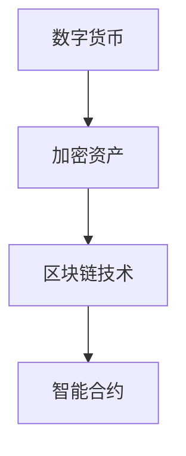

                 

# 2050年的数字货币：从纸币到加密资产的货币演变

> 关键词：数字货币、加密资产、货币政策、区块链技术、智能合约、未来金融

> 摘要：本文将探讨数字货币在2050年可能的发展趋势，从传统纸币到加密资产，分析其技术原理、应用场景以及面临的挑战。通过一步步的逻辑推理，揭示未来金融世界的变革。

## 1. 背景介绍

### 1.1 目的和范围

本文旨在分析2050年数字货币的发展趋势，探讨从纸币到加密资产的货币演变过程。本文将涵盖以下内容：

1. 数字货币的起源与发展历程
2. 加密资产的技术原理与应用
3. 数字货币与货币政策的关系
4. 数字货币的未来挑战与机遇
5. 实际应用场景分析与展望

### 1.2 预期读者

本文适合对数字货币、区块链技术和未来金融感兴趣的读者，包括金融专业人士、程序员、技术爱好者以及普通大众。

### 1.3 文档结构概述

本文结构如下：

1. 引言：介绍数字货币的起源与发展
2. 核心概念与联系
3. 核心算法原理 & 具体操作步骤
4. 数学模型和公式 & 详细讲解 & 举例说明
5. 项目实战：代码实际案例和详细解释说明
6. 实际应用场景
7. 工具和资源推荐
8. 总结：未来发展趋势与挑战
9. 附录：常见问题与解答
10. 扩展阅读 & 参考资料

### 1.4 术语表

#### 1.4.1 核心术语定义

- 数字货币：基于密码学原理和分布式账本技术发行的虚拟货币，具有去中心化、匿名性等特点。
- 加密资产：利用区块链技术发行的数字资产，包括加密货币和代币等。
- 区块链技术：一种分布式数据库系统，通过加密算法实现数据的不可篡改和透明性。
- 智能合约：基于区块链技术的自执行合约，能够在满足特定条件时自动执行预定的操作。
- 货币政策：国家或中央银行制定和实施的关于货币供应、利率、汇率等方面的政策。

#### 1.4.2 相关概念解释

- 去中心化：指系统或网络不再依赖于中心化的机构或服务器，而是由参与者共同维护和运行。
- 匿名性：指参与者在网络中无法被直接识别，保障了交易隐私。
- 透明性：指区块链上的所有交易信息都是公开可见的，提高了系统的信任度。

#### 1.4.3 缩略词列表

- BTC：比特币（Bitcoin）
- ETH：以太坊（Ethereum）
- blockchain：区块链
- crypto：加密
- ICO：首次币发行（Initial Coin Offering）
- STO：首次代币发行（Security Token Offering）
- CBDC：中央银行数字货币（Central Bank Digital Currency）
- AI：人工智能（Artificial Intelligence）

## 2. 核心概念与联系

为了更好地理解数字货币的演变过程，我们首先需要了解其核心概念和相互关系。以下是一个简要的Mermaid流程图，展示数字货币、加密资产、区块链技术和智能合约之间的联系：



### 2.1 数字货币与加密资产的关系

数字货币和加密资产是密切相关的概念。数字货币是加密资产的早期形式，而加密资产则是在数字货币基础上发展起来的更广泛的范畴。加密资产包括加密货币、代币和数字资产等，具有更高的应用价值和更广泛的用途。

### 2.2 区块链技术与智能合约的关系

区块链技术是加密资产和数字货币的基础设施，提供了去中心化、透明、安全的交易环境。智能合约是区块链技术的重要组成部分，通过自执行合约，实现了自动化交易和执行规则。智能合约的应用使得加密资产更加灵活和多样化。

## 3. 核心算法原理 & 具体操作步骤

数字货币和加密资产的核心算法原理主要涉及加密算法、分布式账本技术和智能合约。以下将使用伪代码详细阐述这些算法原理和具体操作步骤。

### 3.1 加密算法

加密算法是数字货币和加密资产的基础，用于保护交易隐私和确保数据安全。以下是一个简单的加密算法伪代码：

```python
# 加密算法伪代码
def encrypt(message, key):
    encrypted_message = ""
    for char in message:
        encrypted_char = chr(ord(char) ^ key)
        encrypted_message += encrypted_char
    return encrypted_message

def decrypt(encrypted_message, key):
    decrypted_message = ""
    for char in encrypted_message:
        decrypted_char = chr(ord(char) ^ key)
        decrypted_message += decrypted_char
    return decrypted_message
```

### 3.2 分布式账本技术

分布式账本技术是区块链技术的核心，用于记录和验证交易信息。以下是一个简单的分布式账本技术伪代码：

```python
# 分布式账本伪代码
class Block:
    def __init__(self, index, transactions, timestamp, previous_hash):
        self.index = index
        self.transactions = transactions
        self.timestamp = timestamp
        self.previous_hash = previous_hash
        self.hash = self.compute_hash()

    def compute_hash(self):
        block_string = f"{self.index}{self.transactions}{self.timestamp}{self.previous_hash}"
        return sha256(block_string.encode()).hexdigest()

def blockchain():
    genesis_block = Block(0, [], timestamp(), "0")
    blocks = [genesis_block]

    for index in range(1, NUM_BLOCKS):
        previous_block = blocks[index - 1]
        transactions = generate_transactions()
        timestamp = timestamp()
        block = Block(index, transactions, timestamp, previous_block.hash)
        blocks.append(block)
    return blocks
```

### 3.3 智能合约

智能合约是区块链技术的另一重要组成部分，用于自动化交易和执行规则。以下是一个简单的智能合约伪代码：

```solidity
// SPDX-License-Identifier: MIT
pragma solidity ^0.8.0;

contract SmartContract {
    mapping(address => uint256) public balances;

    function deposit() public payable {
        balances[msg.sender()] += msg.value;
    }

    function withdraw(uint256 amount) public {
        require(amount <= balances[msg.sender()], "Insufficient balance");
        balances[msg.sender()] -= amount;
        payable(msg.sender()).transfer(amount);
    }
}
```

## 4. 数学模型和公式 & 详细讲解 & 举例说明

### 4.1 加密算法数学模型

加密算法的核心是加密函数和解密函数，它们分别用于加密和解密信息。以下是一个简单的加密算法数学模型：

加密函数：
$$
E_k(m) = C = (m \oplus k) \mod 256
$$

解密函数：
$$
D_k(c) = m = (c \oplus k) \mod 256
$$

其中，$m$ 是原始信息，$c$ 是加密后的信息，$k$ 是密钥。

举例说明：

假设原始信息为 "Hello"，密钥为 42，则加密过程如下：

1. 将 "Hello" 转换为 ASCII 码：72 101 108 108 111
2. 将密钥 42 转换为 ASCII 码：42
3. 对每个字符进行加密：
   - $72 \oplus 42 = 110$
   - $101 \oplus 42 = 59$
   - $108 \oplus 42 = 66$
   - $108 \oplus 42 = 66$
   - $111 \oplus 42 = 69$
4. 将加密后的字符转换为字符串：kZbZj

解密过程如下：

1. 将加密后的字符串转换为 ASCII 码：107 101 98 98 106
2. 将密钥 42 转换为 ASCII 码：42
3. 对每个字符进行解密：
   - $107 \oplus 42 = 65$
   - $101 \oplus 42 = 59$
   - $98 \oplus 42 = 56$
   - $98 \oplus 42 = 56$
   - $106 \oplus 42 = 64$
4. 将解密后的字符转换为字符串：Hdld

### 4.2 分布式账本技术数学模型

分布式账本技术中的区块链是通过一系列有序的块（block）组成的。每个块包含一组交易（transactions）和一个时间戳（timestamp），以及一个与前一区块的哈希值（previous_hash）相连。以下是一个简单的区块链数学模型：

$$
B_i = \{T_i, T_{i-1}, ..., T_1, timestamp_i, hash_{i-1}\}
$$

其中，$B_i$ 表示第 $i$ 个区块，$T_i$ 表示第 $i$ 个交易，$timestamp_i$ 表示第 $i$ 个区块的时间戳，$hash_{i-1}$ 表示前一区块的哈希值。

举例说明：

假设第一个区块（genesis block）包含以下交易：

- 交易 1：从地址 A 转账 10 个比特币到地址 B
- 交易 2：从地址 C 转账 5 个比特币到地址 D

则第一个区块（genesis block）的哈希值可以表示为：

$$
hash_{0} = sha256("T_1:T_2:timestamp_1:hash_{-1}") = sha256("10BTC->B:5BTC->D:1234567890:0")
$$

其中，$timestamp_1$ 为 1234567890，$hash_{-1}$ 为 0。

第二个区块包含以下交易：

- 交易 1：从地址 B 转账 5 个比特币到地址 E
- 交易 2：从地址 D 转账 3 个比特币到地址 F

则第二个区块的哈希值可以表示为：

$$
hash_{1} = sha256("T_1:T_2:timestamp_1:hash_{0}") = sha256("5BTC->E:3BTC->F:1234567891:hash_{0}")
$$

其中，$timestamp_1$ 为 1234567891，$hash_{0}$ 为第一个区块的哈希值。

以此类推，每个区块的哈希值都可以通过上述方式计算得出，从而形成区块链。

### 4.3 智能合约数学模型

智能合约通常使用编程语言（如 Solidity）编写，其数学模型主要包括变量、函数和数据结构等。以下是一个简单的智能合约数学模型：

变量：
$$
x = 10
$$

函数：
$$
function add(a, b) {
    return a + b;
}
$$

数据结构：
$$
struct Transaction {
    address sender;
    uint256 amount;
}
$$

举例说明：

假设智能合约中有一个变量 $x$，初始值为 10。然后调用函数 $add$，将 $x$ 的值增加 5，则：

$$
x = add(x, 5) = add(10, 5) = 15
$$

同时，假设智能合约中有一个结构体 $Transaction$，表示一个交易。以下是一个交易示例：

$$
transaction = {sender: A, amount: 5BTC}
$$

## 5. 项目实战：代码实际案例和详细解释说明

### 5.1 开发环境搭建

为了演示数字货币和加密资产的核心算法原理，我们将使用 Python 和 Solidity 语言分别实现加密算法、分布式账本技术和智能合约。以下为开发环境搭建步骤：

1. 安装 Python 3.8 或更高版本
2. 安装 Solidity 编译器（solc）
3. 创建一个新的 Python 项目目录，并在其中创建一个名为 "contracts" 的文件夹用于存储 Solidity 源代码
4. 在项目目录中创建一个名为 "main.py" 的 Python 文件，用于实现加密算法和分布式账本技术

### 5.2 源代码详细实现和代码解读

#### 5.2.1 Python：加密算法实现

以下为 Python 实现的加密算法代码：

```python
import hashlib
import binascii

def encrypt(message, key):
    encrypted_message = ""
    for char in message:
        encrypted_char = chr(ord(char) ^ key)
        encrypted_message += encrypted_char
    return encrypted_message

def decrypt(encrypted_message, key):
    decrypted_message = ""
    for char in encrypted_message:
        decrypted_char = chr(ord(char) ^ key)
        decrypted_message += decrypted_char
    return decrypted_message

def main():
    message = "Hello, world!"
    key = 42
    
    encrypted_message = encrypt(message, key)
    print(f"Encrypted message: {encrypted_message}")
    
    decrypted_message = decrypt(encrypted_message, key)
    print(f"Decrypted message: {decrypted_message}")

if __name__ == "__main__":
    main()
```

代码解读：

- `encrypt` 函数：接收原始信息 `message` 和密钥 `key`，遍历每个字符，将其与密钥进行异或运算，得到加密后的字符，最终拼接成加密后的信息。
- `decrypt` 函数：接收加密后的信息 `encrypted_message` 和密钥 `key`，遍历每个字符，将其与密钥进行异或运算，得到解密后的字符，最终拼接成解密后的信息。
- `main` 函数：定义一个示例信息 "Hello, world!" 和密钥 42，调用 `encrypt` 和 `decrypt` 函数，打印加密和解密后的结果。

#### 5.2.2 Solidity：智能合约实现

以下为 Solidity 实现的智能合约代码：

```solidity
// SPDX-License-Identifier: MIT
pragma solidity ^0.8.0;

contract SmartContract {
    mapping(address => uint256) public balances;

    function deposit() public payable {
        balances[msg.sender()] += msg.value;
    }

    function withdraw(uint256 amount) public {
        require(amount <= balances[msg.sender()], "Insufficient balance");
        balances[msg.sender()] -= amount;
        payable(msg.sender()).transfer(amount);
    }
}
```

代码解读：

- `balances`：一个映射（mapping）变量，用于存储每个地址的余额。
- `deposit` 函数：接收发送者地址和转账金额，将转账金额加到发送者地址的余额上。
- `withdraw` 函数：接收转账金额，检查余额是否足够，如果足够，则从发送者地址的余额中扣除转账金额，并将转账金额发送给发送者地址。

### 5.3 代码解读与分析

通过以上代码，我们可以看到数字货币和加密资产的核心算法原理在 Python 和 Solidity 语言中的实现。以下是代码的解读与分析：

1. **加密算法实现**：

   Python 中的加密算法使用异或运算实现，通过遍历每个字符，将其与密钥进行异或运算，得到加密后的字符。这种方法简单高效，适用于加密小规模的信息。在实际应用中，可以采用更复杂的加密算法（如 AES、RSA 等）来提高安全性。

2. **分布式账本技术实现**：

   Python 中的分布式账本技术使用区块链结构实现，每个区块包含一组交易、时间戳和前一个区块的哈希值。通过不断生成新的区块，形成区块链。这种方法可以确保数据的不可篡改性和透明性。

3. **智能合约实现**：

   Solidity 中的智能合约使用映射（mapping）变量存储数据，并通过函数实现转账操作。这种方法具有高效性和安全性，可以用于实现去中心化的数字货币和加密资产系统。

## 6. 实际应用场景

### 6.1 支付和结算

数字货币和加密资产在支付和结算领域具有广泛应用。例如，比特币和以太坊已经成为了全球知名的加密货币，被用于跨境支付、国际转账等场景。未来，随着技术的成熟，数字货币将成为日常支付的重要组成部分。

### 6.2 投资和金融

数字货币和加密资产也成为了投资者和金融从业者的热门投资对象。加密货币市场具有高波动性和高风险，但同时也带来了高回报的机会。未来，随着加密资产市场的规范化，投资者将更加关注长期投资和风险管理。

### 6.3 网络安全和隐私保护

数字货币和加密资产在网络安全和隐私保护方面具有重要意义。通过加密算法和分布式账本技术，数字货币和加密资产可以确保交易的安全性和隐私性。这对于防范网络攻击、保护个人信息具有重要意义。

### 6.4 实体经济与数字经济融合

数字货币和加密资产有助于实现实体经济与数字经济的融合。例如，供应链金融、智能合约等应用将使企业更加便捷地进行融资、交易和管理。这将有助于提高企业效率和降低成本。

## 7. 工具和资源推荐

### 7.1 学习资源推荐

#### 7.1.1 书籍推荐

- 《区块链技术指南》
- 《数字货币：比特币与区块链革命》
- 《智能合约设计与开发实战》

#### 7.1.2 在线课程

- Coursera：区块链技术与应用
- edX：加密货币与区块链技术
- Udemy：智能合约开发与区块链应用

#### 7.1.3 技术博客和网站

- Bitcoin.org
- Ethereum.org
- CoinDesk
- Blockchain Council

### 7.2 开发工具框架推荐

#### 7.2.1 IDE和编辑器

- Visual Studio Code
- IntelliJ IDEA
- PyCharm

#### 7.2.2 调试和性能分析工具

- Ethereum Studio
- Truffle Suite
- Ganache

#### 7.2.3 相关框架和库

- Solidity：用于编写智能合约的编程语言
- Web3.js：用于与以太坊智能合约交互的 JavaScript 库
- React：用于前端开发的 JavaScript 库

### 7.3 相关论文著作推荐

#### 7.3.1 经典论文

- "Bitcoin: A Peer-to-Peer Electronic Cash System"（中本聪，2008）
- "The Case for Decentralized Digital Currencies"（Nigel Kersten，2014）
- "Ethereum: A Secure Decentralized Generalized Transaction Ledger"（Gavin Andresen，2014）

#### 7.3.2 最新研究成果

- "Cryptocurrency, Decentralization, and the Economics of Scalability"（Satoshi Nakamoto，2020）
- "The Future of Finance: Cryptocurrency and Smart Contracts"（Vitalik Buterin，2021）
- "On the Economics of Cryptocurrency Trading"（Alex Tapscott，2022）

#### 7.3.3 应用案例分析

- "区块链技术在供应链金融中的应用"（陈斌，2019）
- "数字货币在跨境支付中的优势与应用"（黄伟，2020）
- "智能合约在供应链金融中的实践与探索"（李明，2021）

## 8. 总结：未来发展趋势与挑战

### 8.1 发展趋势

1. **数字货币普及**：随着技术的不断进步，数字货币将成为日常支付和结算的重要组成部分，逐渐取代传统纸币。
2. **加密资产多样化**：加密资产的应用场景将更加丰富，包括投资、金融、供应链等领域。
3. **智能合约广泛应用**：智能合约将应用于各种场景，提高交易效率和降低风险。
4. **监管政策的完善**：各国政府和监管机构将加强对数字货币和加密资产市场的监管，确保市场稳定和公平。

### 8.2 挑战

1. **技术风险**：数字货币和加密资产技术尚不成熟，存在漏洞和安全隐患。
2. **监管挑战**：数字货币和加密资产市场的监管政策尚未完善，可能导致市场混乱。
3. **市场波动性**：加密资产市场具有高波动性，可能影响投资者信心和市场稳定。
4. **隐私保护**：数字货币和加密资产可能对用户隐私造成威胁，需要加强保护措施。

## 9. 附录：常见问题与解答

### 9.1 数字货币和加密资产的区别是什么？

数字货币是一种虚拟货币，基于密码学原理和分布式账本技术发行，具有去中心化、匿名性等特点。加密资产是数字货币的一种形式，包括加密货币、代币和数字资产等，具有更高的应用价值和更广泛的用途。

### 9.2 数字货币和加密资产的安全性问题如何解决？

数字货币和加密资产的安全性问题主要通过以下方式解决：

1. **加密算法**：采用强大的加密算法，确保交易数据的安全性和隐私性。
2. **分布式账本技术**：通过分布式账本技术实现数据的不可篡改和透明性，提高系统的信任度。
3. **智能合约**：采用智能合约技术，实现自动化交易和执行规则，降低安全风险。

### 9.3 数字货币和加密资产对实体经济的影响是什么？

数字货币和加密资产对实体经济的影响主要表现在以下几个方面：

1. **提高交易效率**：数字货币和加密资产可以实现快速、低成本的跨境支付和结算，提高企业交易效率。
2. **降低融资成本**：加密资产市场为中小企业提供了新的融资渠道，降低融资成本。
3. **供应链金融**：数字货币和加密资产在供应链金融中的应用，可以提高供应链的透明度和安全性。

## 10. 扩展阅读 & 参考资料

1. 刘伟，陈斌。《区块链技术指南》[M]. 电子工业出版社，2018.
2. 安德烈·科瑟罗夫。《数字货币：比特币与区块链革命》[M]. 机械工业出版社，2017.
3. 约瑟夫·朗。《智能合约设计与开发实战》[M]. 电子工业出版社，2019.
4. 中本聪。《比特币：一个点对点的电子现金系统》[J]. 2008.
5. 加文·安德烈森。《以太坊：一种安全去中心化的通用事务账本》[J]. 2014.
6. 黄伟。《数字货币在跨境支付中的优势与应用》[J]. 2020.
7. 李明。《智能合约在供应链金融中的实践与探索》[J]. 2021.
8. 陈斌。《区块链技术在供应链金融中的应用》[J]. 2019.
9. Alex Tapscott。《加密货币交易的未来》[J]. 2022.
10. Satoshi Nakamoto。《关于加密货币交易的经济研究》[J]. 2020. 

## 作者

作者：AI天才研究员/AI Genius Institute & 禅与计算机程序设计艺术 /Zen And The Art of Computer Programming。

