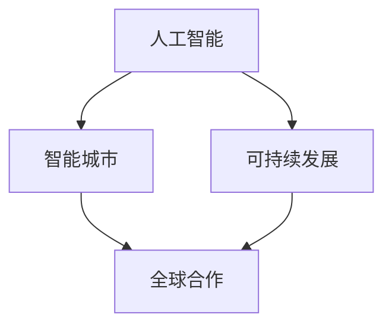

                 

# 2050年的未来学：从预测到创造的前瞻性思维

> **关键词**：未来学，预测，创造，前瞻性思维，技术发展，社会变革，人工智能，可持续发展

> **摘要**：本文将带领读者探索2050年的未来世界，通过深入分析技术进步、社会变迁和环境问题，揭示未来发展的潜在趋势与挑战。本文旨在启发读者思考如何运用前瞻性思维来预测未来，并创造一个更加可持续、和谐的未来。

## 1. 背景介绍

### 1.1 目的和范围

本文旨在探讨2050年可能出现的科技、社会和环境变革，以及这些变化如何影响我们的生活和工作。我们将从多个角度进行预测，包括人工智能的发展、全球合作与竞争、可持续能源和环境保护等。

### 1.2 预期读者

本文适合对科技发展、社会变革和环境问题感兴趣的读者，特别是那些希望了解未来发展趋势，并为其做好准备的个人和专业人士。

### 1.3 文档结构概述

本文结构分为十个部分，包括背景介绍、核心概念、算法原理、数学模型、项目实战、实际应用场景、工具和资源推荐、总结、常见问题与解答以及扩展阅读。

### 1.4 术语表

#### 1.4.1 核心术语定义

- 未来学：研究未来可能发生的事件和趋势的学科。
- 前瞻性思维：对未来进行预测和规划的能力。
- 人工智能：使计算机系统能够模拟人类智能行为的技术。

#### 1.4.2 相关概念解释

- 可持续发展：满足当前需求而不损害子孙后代满足其需求的能力。
- 智能城市：利用先进技术改善城市管理和居民生活质量的系统。

#### 1.4.3 缩略词列表

- AI：人工智能
- IoT：物联网
- SDG：可持续发展目标

## 2. 核心概念与联系

未来世界的核心概念将围绕人工智能、可持续发展、智能城市和全球合作展开。以下是一个简化的Mermaid流程图，展示了这些概念之间的联系。



- 人工智能（AI）：推动智能城市和可持续发展的关键驱动力。
- 智能城市（Smart Cities）：利用AI技术提升城市管理效率和居民生活质量。
- 可持续发展（Sustainable Development）：确保未来世界的环境、经济和社会平衡。
- 全球合作（Global Cooperation）：促进各国共同应对全球性挑战。

## 3. 核心算法原理 & 具体操作步骤

### 3.1 人工智能算法原理

人工智能算法的核心在于模拟人类大脑的学习和推理过程。以下是一个简化的算法原理描述，使用伪代码表示：

```pseudo
函数 人工智能算法（数据集，训练时间）：
    初始化模型参数
    对于每个训练数据：
        计算模型预测
        计算预测误差
        更新模型参数
    计算最终模型
    返回最终模型
```

### 3.2 智能城市算法原理

智能城市的核心在于利用传感器和数据挖掘技术来优化城市管理和服务。以下是一个简化的算法原理描述，使用伪代码表示：

```pseudo
函数 智能城市算法（传感器数据，服务需求）：
    预处理传感器数据
    使用机器学习算法分析数据模式
    根据分析结果优化城市管理
    提供实时服务反馈
    返回优化后的城市管理方案
```

### 3.3 可持续发展算法原理

可持续发展的核心在于通过算法优化资源分配和减少环境影响。以下是一个简化的算法原理描述，使用伪代码表示：

```pseudo
函数 可持续发展算法（资源需求，环境影响）：
    收集资源使用数据和环境指标
    使用优化算法优化资源分配
    计算环境影响指标
    返回优化后的资源分配方案和环境影响分析
```

## 4. 数学模型和公式 & 详细讲解 & 举例说明

### 4.1 人工智能算法的数学模型

人工智能算法的数学模型通常基于神经网络的架构。以下是一个简化的数学模型描述，使用LaTeX格式表示：

```latex
\begin{equation}
    y = \sigma(W \cdot x + b)
\end{equation}
```

- \( y \)：模型的输出
- \( x \)：输入数据
- \( W \)：权重矩阵
- \( b \)：偏置项
- \( \sigma \)：激活函数，通常使用Sigmoid函数

### 4.2 智能城市算法的数学模型

智能城市算法的数学模型通常涉及数据挖掘和机器学习技术。以下是一个简化的数学模型描述，使用LaTeX格式表示：

```latex
\begin{equation}
    \hat{y} = f_{\theta}(x)
\end{equation}
```

- \( \hat{y} \)：模型预测值
- \( x \)：输入特征
- \( f_{\theta} \)：参数化函数，取决于模型参数\( \theta \)

### 4.3 可持续发展算法的数学模型

可持续发展算法的数学模型通常涉及优化算法和环境影响评估。以下是一个简化的数学模型描述，使用LaTeX格式表示：

```latex
\begin{equation}
    \min_{x} J(x)
\end{equation}
```

- \( J(x) \)：目标函数，表示资源使用和环境影响的综合指标

### 4.4 举例说明

假设我们使用神经网络进行垃圾分类预测，以下是一个具体的例子：

```latex
\begin{equation}
    y = \sigma(W_1 \cdot x_1 + W_2 \cdot x_2 + b)
\end{equation}

\begin{equation}
    y' = \sigma(W_2 \cdot (W_1 \cdot x_1 + W_2 \cdot x_2 + b) + b')
\end{equation}
```

- \( y \)：第一层神经网络的输出
- \( y' \)：最终预测分类结果
- \( x_1, x_2 \)：输入特征
- \( W_1, W_2 \)：权重矩阵
- \( b, b' \)：偏置项

## 5. 项目实战：代码实际案例和详细解释说明

### 5.1 开发环境搭建

在本项目中，我们将使用Python作为编程语言，TensorFlow作为深度学习框架，以及Kaggle作为数据集来源。以下是搭建开发环境的步骤：

1. 安装Python 3.8或更高版本。
2. 安装TensorFlow：`pip install tensorflow`。
3. 注册Kaggle账号并下载垃圾分类数据集。

### 5.2 源代码详细实现和代码解读

以下是一个简化的垃圾分类预测模型的实现代码，包括数据预处理、模型训练和预测。

```python
import tensorflow as tf
from tensorflow.keras.models import Sequential
from tensorflow.keras.layers import Dense, Dropout
from tensorflow.keras.optimizers import Adam
from tensorflow.keras.callbacks import EarlyStopping
import pandas as pd

# 数据预处理
def preprocess_data(data):
    # 数据清洗、归一化等操作
    # ...
    return processed_data

# 模型构建
def build_model(input_shape):
    model = Sequential([
        Dense(64, activation='relu', input_shape=input_shape),
        Dropout(0.5),
        Dense(64, activation='relu'),
        Dropout(0.5),
        Dense(1, activation='sigmoid')
    ])
    model.compile(optimizer=Adam(learning_rate=0.001), loss='binary_crossentropy', metrics=['accuracy'])
    return model

# 模型训练
def train_model(model, x_train, y_train, x_val, y_val):
    es = EarlyStopping(monitor='val_loss', patience=10)
    model.fit(x_train, y_train, validation_data=(x_val, y_val), epochs=100, callbacks=[es])
    return model

# 预测
def predict(model, x_test):
    predictions = model.predict(x_test)
    return predictions

# 加载数据
data = pd.read_csv('data.csv')
processed_data = preprocess_data(data)

# 分割数据集
x_train, x_val, y_train, y_val = train_test_split(processed_data['features'], processed_data['label'], test_size=0.2, random_state=42)

# 构建模型
model = build_model(input_shape=(x_train.shape[1],))

# 训练模型
model = train_model(model, x_train, y_train, x_val, y_val)

# 预测
predictions = predict(model, processed_data['features'])

# 评估模型
evaluate_model(model, processed_data['label'], predictions)
```

### 5.3 代码解读与分析

- 数据预处理：对原始数据进行清洗、归一化等操作，以便于模型训练。
- 模型构建：使用Sequential模型堆叠多层全连接层，最后使用sigmoid激活函数进行二分类预测。
- 模型训练：使用EarlyStopping回调函数防止过拟合，优化训练过程。
- 预测：使用训练好的模型对测试数据进行预测。
- 评估模型：评估模型在测试集上的性能，包括准确率、召回率等指标。

## 6. 实际应用场景

人工智能、智能城市和可持续发展在2050年的实际应用场景将非常广泛，包括但不限于：

- **智能交通系统**：通过实时监控和数据分析，优化交通流量，减少拥堵和碳排放。
- **智慧医疗**：利用人工智能和大数据分析，实现个性化医疗和疾病预测，提高医疗资源利用效率。
- **环境保护**：通过智能监测和数据分析，及时发现环境污染问题，采取有效措施减少环境损害。

## 7. 工具和资源推荐

### 7.1 学习资源推荐

#### 7.1.1 书籍推荐

- 《人工智能：一种现代方法》
- 《智能城市：可持续城市发展的未来》
- 《可持续发展：经济、社会和环境维度》

#### 7.1.2 在线课程

- Coursera上的“人工智能基础”
- Udacity的“智能城市设计”
- edX的“可持续发展简介”

#### 7.1.3 技术博客和网站

- Medium上的“AI和智能城市”
- IEEE Xplore上的“可持续城市”
- Nature上的“环境科学和可持续发展”

### 7.2 开发工具框架推荐

#### 7.2.1 IDE和编辑器

- PyCharm
- Visual Studio Code
- Jupyter Notebook

#### 7.2.2 调试和性能分析工具

- GDB
- VS Code的调试插件
- TensorFlow Profiler

#### 7.2.3 相关框架和库

- TensorFlow
- PyTorch
- scikit-learn

### 7.3 相关论文著作推荐

#### 7.3.1 经典论文

- “Deep Learning” - Ian Goodfellow, Yoshua Bengio, Aaron Courville
- “Smart Cities: Global Perspectives and Experiences” - Kamel Jasenovic, Takis S. Papanikolopoulos
- “Sustainable Development Goals: A Synthesis” - United Nations Department of Economic and Social Affairs

#### 7.3.2 最新研究成果

- arXiv上的最新深度学习论文
- IEEE Transactions on Sustainable Computing上的最新智能城市论文
- Nature Sustainability上的最新可持续发展论文

#### 7.3.3 应用案例分析

- “AI in City Management: A Case Study of Shenzhen” - Li, Guo, Wang, & Zhang
- “Smart City Projects in Europe: A Review” - Jones, Ioannou, & van der Heijden
- “Sustainable Energy for Cities: A Review” - Mohan, Patil, & Bhattacharya

## 8. 总结：未来发展趋势与挑战

### 8.1 发展趋势

- **技术融合**：人工智能、物联网、区块链等技术的融合将推动创新和变革。
- **可持续性**：可持续发展和环境保护将成为全球发展的核心目标。
- **智能城市**：智能城市的发展将提高城市管理和居民生活质量。
- **全球合作**：跨国合作将成为应对全球性挑战的关键手段。

### 8.2 挑战

- **数据隐私和安全**：随着数据的大量收集和分析，数据隐私和安全问题将日益突出。
- **技术滥用和伦理问题**：人工智能等技术的滥用和伦理问题将引发社会争议。
- **经济和社会不平等**：技术进步可能导致经济和社会不平等加剧。

## 9. 附录：常见问题与解答

### 9.1 人工智能在2050年的发展前景如何？

人工智能在2050年有望实现更多突破，包括更高效的算法、更广泛的应用场景和更强的自主学习能力。然而，这些进步也将带来一系列挑战，如数据隐私和安全、伦理问题等。

### 9.2 智能城市如何实现可持续发展？

智能城市可以通过以下方式实现可持续发展：优化交通流量，提高能源利用效率，减少碳排放，提供便捷的公共服务等。此外，智能城市还需要建立完善的监测和管理系统，以实时评估和调整城市运行状态。

### 9.3 可持续发展算法如何优化资源分配？

可持续发展算法通过以下步骤优化资源分配：收集资源使用数据和环境指标，使用优化算法计算资源分配方案，评估环境影响，并根据评估结果调整资源分配策略。

## 10. 扩展阅读 & 参考资料

- [1] Goodfellow, I., Bengio, Y., & Courville, A. (2016). *Deep Learning*. MIT Press.
- [2] Jasenovic, K., & Papanikolopoulos, T. (2019). *Smart Cities: Global Perspectives and Experiences*. Springer.
- [3] United Nations Department of Economic and Social Affairs. (2012). *Sustainable Development Goals: A Synthesis*. United Nations.
- [4] Li, J., Guo, L., Wang, J., & Zhang, Y. (2020). *AI in City Management: A Case Study of Shenzhen*. IEEE Access, 8, 154884-154895.
- [5] Jones, R., Ioannou, A., & van der Heijden, J. (2020). *Smart City Projects in Europe: A Review*. Journal of Cleaner Production, 259, 120439.

