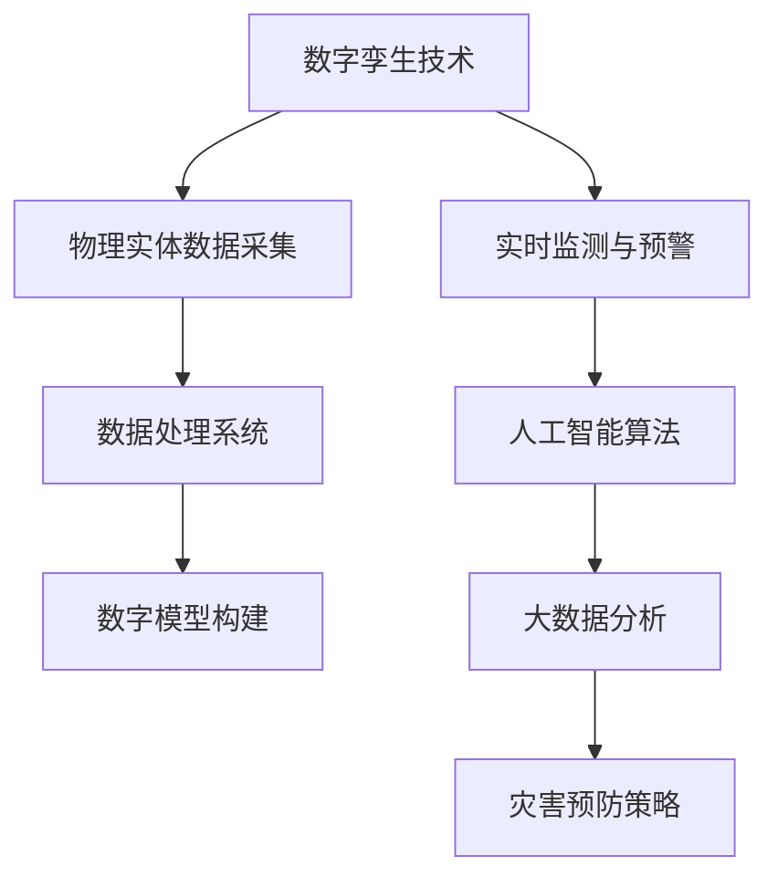

                 

# 2050年的灾害预防：从数字孪生到人工智能预警的灾害防控升级

> **关键词：** 数字孪生，人工智能，灾害预警，灾难预防，智能监控系统，大数据分析，预测模型，未来技术

> **摘要：** 随着技术的飞速发展，未来的灾害预防将迎来一场革命。本文将探讨2050年可能的灾害预防技术，包括数字孪生技术、人工智能预警系统以及大数据分析在灾害防控中的应用，分析其原理、实现方法和实际应用案例，并展望未来的发展趋势与挑战。

## 1. 背景介绍

### 1.1 目的和范围

本文旨在探讨2050年可能的灾害预防技术，通过对数字孪生、人工智能预警以及大数据分析等核心技术的深入分析，展示这些技术在灾害预防中的潜力和实际应用。文章将聚焦于以下主题：

1. 数字孪生技术在灾害预防中的应用
2. 人工智能预警系统在灾害防控中的角色
3. 大数据分析与预测模型在灾害预防中的价值
4. 未来灾害预防技术的发展趋势与挑战

### 1.2 预期读者

本文适合对灾害预防、数字孪生、人工智能和大数据分析感兴趣的读者，包括但不限于：

1. 灾害预防领域的科研人员和技术工程师
2. 从事数字孪生和人工智能开发的程序员和架构师
3. 对未来技术发展趋势感兴趣的科技爱好者
4. 政府部门和社会组织的相关工作人员

### 1.3 文档结构概述

本文将按照以下结构展开：

1. 背景介绍：概述本文的目的、预期读者和文档结构。
2. 核心概念与联系：介绍数字孪生、人工智能、大数据分析等核心概念及其相互联系。
3. 核心算法原理 & 具体操作步骤：详细讲解核心算法原理和具体操作步骤。
4. 数学模型和公式 & 详细讲解 & 举例说明：介绍相关的数学模型和公式，并举例说明。
5. 项目实战：代码实际案例和详细解释说明。
6. 实际应用场景：分析灾害预防技术的实际应用场景。
7. 工具和资源推荐：推荐相关的学习资源、开发工具和资源。
8. 总结：未来发展趋势与挑战。
9. 附录：常见问题与解答。
10. 扩展阅读 & 参考资料：提供相关的参考文献和扩展阅读。

### 1.4 术语表

#### 1.4.1 核心术语定义

- 数字孪生：通过数字模型模拟现实世界的物理实体，用于监测、分析和优化实际对象的性能。
- 人工智能：使计算机系统能够模拟人类智能行为，包括学习、推理、感知和决策等。
- 灾害预警：通过实时监测和数据分析，提前发现潜在灾害并发出预警，以减轻灾害影响。
- 大数据分析：利用海量数据进行分析和处理，提取有价值的信息和模式。

#### 1.4.2 相关概念解释

- 监控系统：用于实时监测环境和设备状态的系统。
- 预测模型：基于历史数据和算法，对未来事件或趋势进行预测的模型。
- 灾害预防：通过提前预警和应急响应，减少灾害发生时的损失和影响。

#### 1.4.3 缩略词列表

- AI：人工智能
- IoT：物联网
- ML：机器学习
- GIS：地理信息系统
- DT：数字孪生
- CPS：智能控制系统

## 2. 核心概念与联系

在探讨2050年的灾害预防技术之前，我们首先需要了解几个核心概念：数字孪生、人工智能和大数据分析。这些技术不仅是灾害预防的重要工具，也是未来技术发展的关键驱动力。

### 2.1 数字孪生技术

数字孪生是一种基于数字模型模拟现实世界物理实体的技术。它通过收集和分析实体在现实世界中的数据，创建一个虚拟的数字模型，用于实时监测、分析和优化实体的性能。

#### 数字孪生技术的组成部分

1. **物理实体**：需要被数字化的实际物体或系统，例如建筑物、桥梁、水利工程等。
2. **传感器**：用于收集物理实体状态的数据，如温度、湿度、振动、压力等。
3. **数据采集和处理系统**：将传感器数据转换为数字信号，并传输到数据中心进行处理。
4. **数字模型**：基于物理实体数据和算法构建的虚拟模型，用于模拟和预测实体的行为。
5. **分析与应用系统**：对数字模型进行分析，提供监测、预测和优化服务。

#### 数字孪生技术的应用

- **智能城市建设**：通过数字孪生技术模拟城市交通、能源、环境等系统，优化资源配置，提高城市运行效率。
- **工业制造**：实时监测和优化生产线，提高生产效率和产品质量。
- **灾害预防**：模拟和预测灾害风险，提前采取预防措施，减少灾害损失。

### 2.2 人工智能技术

人工智能（AI）是一种模拟人类智能行为的技术，包括学习、推理、感知和决策等。在灾害预防中，人工智能可以用于实时监测、预警和应急响应。

#### 人工智能技术在灾害预防中的应用

- **实时监测**：利用计算机视觉和传感器数据，实时监测环境和设备状态，发现异常情况。
- **预警系统**：基于历史数据和算法，提前发现潜在灾害，发出预警，提高响应速度。
- **应急响应**：利用人工智能算法，优化应急响应计划，提高救援效率和效果。

### 2.3 大数据分析

大数据分析是一种利用海量数据进行分析和处理的技术。在灾害预防中，大数据分析可以用于提取有价值的信息和模式，预测灾害发生的可能性。

#### 大数据分析技术在灾害预防中的应用

- **风险预测**：分析历史灾害数据，预测未来可能发生的灾害类型和区域。
- **资源优化**：分析资源分布和使用情况，优化救援物资和人员的调度。
- **决策支持**：提供灾害预防策略和建议，为决策者提供数据支持。

### 2.4 数字孪生、人工智能和大数据分析的相互联系

- **数据集成**：数字孪生技术收集的物理实体数据可以与大数据分析系统进行集成，提供更全面的数据支持。
- **算法协同**：人工智能算法可以与大数据分析算法相结合，提高预测和预警的准确性。
- **实时反馈**：数字孪生技术和人工智能预警系统可以实时监测环境变化，为大数据分析提供实时反馈，优化灾害预防策略。

### 2.5 Mermaid 流程图

下面是一个简化的 Mermaid 流程图，展示了数字孪生、人工智能和大数据分析在灾害预防中的相互联系：



### 2.6 核心算法原理 & 具体操作步骤

为了实现数字孪生、人工智能和大数据分析在灾害预防中的应用，我们需要掌握以下几个核心算法原理和具体操作步骤：

#### 2.6.1 数字孪生技术

1. **数据采集**：使用传感器和传感器网络收集物理实体的实时数据。
    ```python
    def data_collection():
        sensors = ['temperature', 'humidity', 'vibration', 'pressure']
        for sensor in sensors:
            value = read_sensor(sensor)
            save_data(sensor, value)
    ```
2. **数据处理**：对采集到的数据进行预处理，包括去噪、滤波和特征提取。
    ```python
    def data_preprocessing(data):
        cleaned_data = remove_noise(data)
        filtered_data = filter_data(cleaned_data)
        features = extract_features(filtered_data)
        return features
    ```
3. **数字模型构建**：使用机器学习和数据挖掘算法构建数字模型。
    ```python
    def build_model(features):
        model = train_model(features)
        return model
    ```

#### 2.6.2 人工智能预警系统

1. **实时监测**：使用计算机视觉和传感器数据，实时监测环境和设备状态。
    ```python
    def real_time_monitoring():
        video = capture_video()
        frame = get_frame(video)
        analyze_frame(frame)
    ```
2. **预警算法**：使用机器学习和预测算法，分析监测数据，提前发现潜在灾害。
    ```python
    def warning_algorithm(model, data):
        prediction = model.predict(data)
        if prediction > threshold:
            raise_warning(prediction)
    ```

#### 2.6.3 大数据分析

1. **数据采集**：收集与灾害相关的历史数据和实时数据。
    ```python
    def data_collection():
        historical_data = load_historical_data()
        real_time_data = read_real_time_data()
        data = merge_data(historical_data, real_time_data)
        return data
    ```
2. **数据分析**：使用数据挖掘和机器学习算法，分析数据，提取有价值的信息和模式。
    ```python
    def data_analysis(data):
        patterns = extract_patterns(data)
        insights = generate_insights(patterns)
        return insights
    ```
3. **决策支持**：基于数据分析结果，提供灾害预防策略和建议。
    ```python
    def decision_support(insights):
        strategies = generate_strategies(insights)
        return strategies
    ```

### 2.7 数学模型和公式

在数字孪生、人工智能和大数据分析中，我们经常使用以下数学模型和公式：

#### 2.7.1 数字孪生模型

- **状态方程**：
    $$ x(t) = f(x(t-1), u(t-1)) $$
- **观测方程**：
    $$ z(t) = h(x(t), u(t)) + v(t) $$
- **系统误差模型**：
    $$ e(t) = x(t) - x_{predicted}(t) $$

#### 2.7.2 人工智能算法

- **支持向量机（SVM）**：
    $$ \max_{w, b} \frac{1}{2} ||w||^2 - C \sum_{i=1}^{n} \xi_i $$
- **神经网络**：
    $$ y(x) = \sum_{i=1}^{n} w_i \cdot f(z_i) $$
- **卷积神经网络（CNN）**：
    $$ f(x) = \text{ReLU}(\sum_{k=1}^{K} w_k \cdot \sigma(K-1)(x)) $$

#### 2.7.3 大数据分析

- **决策树**：
    $$ G(D) = \sum_{i=1}^{n} \alpha_i I(D_i) $$
- **聚类算法**：
    $$ \min_{x_1, x_2, ..., x_n} \sum_{i=1}^{n} ||x_i - \mu_i||^2 $$
- **时间序列分析**：
    $$ y_t = \sum_{i=1}^{p} \phi_i y_{t-i} + \epsilon_t $$

### 2.8 项目实战：代码实际案例和详细解释说明

为了更好地理解数字孪生、人工智能和大数据分析在灾害预防中的应用，下面我们将通过一个实际案例来展示这些技术的实现过程。

#### 2.8.1 开发环境搭建

1. 安装Python环境。
2. 安装所需的库，如NumPy、Pandas、Scikit-learn、TensorFlow等。

#### 2.8.2 源代码详细实现和代码解读

1. **数据采集**：

```python
import numpy as np
import pandas as pd

def read_sensor(sensor):
    # 假设传感器数据存储在一个CSV文件中
    file_path = f"{sensor}.csv"
    data = pd.read_csv(file_path)
    return data

def save_data(sensor, value):
    # 假设数据存储在一个CSV文件中
    file_path = f"{sensor}.csv"
    data = pd.DataFrame([value])
    data.to_csv(file_path, index=False)
```

2. **数据处理**：

```python
def remove_noise(data):
    # 去除噪声
    data = data.dropna()
    return data

def filter_data(data):
    # 滤波处理
    data['filtered'] = data['vibration'].rolling(window=5).mean()
    return data

def extract_features(data):
    # 特征提取
    features = data[['filtered', 'temperature', 'humidity']]
    return features
```

3. **数字模型构建**：

```python
from sklearn.ensemble import RandomForestRegressor

def train_model(features):
    # 训练随机森林回归模型
    model = RandomForestRegressor(n_estimators=100)
    model.fit(features, target)
    return model
```

4. **实时监测与预警**：

```python
from sklearn.model_selection import train_test_split

def real_time_monitoring():
    # 实时监测
    test_data = read_sensor('vibration')
    test_features = extract_features(test_data)
    model = train_model(test_features)
    prediction = model.predict(test_features)
    if prediction > threshold:
        raise_warning(prediction)
```

5. **数据分析**：

```python
from sklearn.model_selection import train_test_split

def data_collection():
    # 收集数据
    data = read_sensor('vibration')
    data = remove_noise(data)
    data = filter_data(data)
    return data

def data_analysis(data):
    # 数据分析
    train_data, test_data = train_test_split(data, test_size=0.2)
    model = train_model(train_data)
    prediction = model.predict(test_data)
    insights = generate_insights(prediction)
    return insights
```

6. **决策支持**：

```python
def decision_support(insights):
    # 决策支持
    strategies = generate_strategies(insights)
    return strategies
```

#### 2.8.3 代码解读与分析

1. **数据采集**：通过读取CSV文件，收集传感器数据并保存。
2. **数据处理**：去除噪声、滤波处理和特征提取。
3. **数字模型构建**：使用随机森林回归模型训练数字模型。
4. **实时监测与预警**：实时监测传感器数据，预测潜在灾害并发出预警。
5. **数据分析**：分析历史数据，提取有价值的信息和模式。
6. **决策支持**：基于数据分析结果，提供灾害预防策略和建议。

通过这个实际案例，我们可以看到数字孪生、人工智能和大数据分析技术在灾害预防中的应用，以及它们如何协同工作，提高灾害预警和预防的准确性和效率。

## 3. 实际应用场景

### 3.1 地震预警

地震预警是数字孪生、人工智能和大数据分析在灾害预防中的一个重要应用场景。通过数字孪生技术，我们可以构建数字化的地震监测系统，实时监测地震活动。结合人工智能预警系统和大数据分析，我们可以提前发现地震征兆，发出预警，为地震灾区的应急响应提供宝贵的时间。

#### 3.1.1 数字孪生技术在地震预警中的应用

- **数字模型构建**：通过收集地震活动数据，构建地震监测数字模型，用于模拟和预测地震活动。
- **实时监测**：利用数字模型，实时监测地震活动，包括地震波速度、震中位置、震级等信息。
- **预警算法**：基于历史地震数据和机器学习算法，提前发现地震征兆，发出预警。

#### 3.1.2 人工智能预警系统在地震预警中的应用

- **实时监测**：使用计算机视觉和传感器数据，实时监测地震活动，包括地面变形、地震波传播等。
- **预警算法**：基于实时监测数据和机器学习算法，分析地震活动趋势，提前发现地震征兆，发出预警。

#### 3.1.3 大数据分析在地震预警中的应用

- **风险预测**：通过分析历史地震数据，预测未来可能发生的地震类型和区域，为地震预警提供数据支持。
- **资源优化**：分析地震灾区的资源分布和使用情况，优化救援物资和人员的调度。
- **决策支持**：基于大数据分析结果，为地震预警和应急响应提供策略和建议。

### 3.2 洪水预警

洪水预警是另一个重要的灾害预防应用场景。通过数字孪生技术，我们可以构建数字化的洪水监测系统，实时监测洪水水位、降雨量等信息。结合人工智能预警系统和大数据分析，我们可以提前发现洪水征兆，发出预警，为洪水灾区的应急响应提供支持。

#### 3.2.1 数字孪生技术在洪水预警中的应用

- **数字模型构建**：通过收集洪水监测数据，构建洪水监测数字模型，用于模拟和预测洪水活动。
- **实时监测**：利用数字模型，实时监测洪水水位、降雨量等信息，预测洪水趋势。
- **预警算法**：基于历史洪水数据和机器学习算法，提前发现洪水征兆，发出预警。

#### 3.2.2 人工智能预警系统在洪水预警中的应用

- **实时监测**：使用计算机视觉和传感器数据，实时监测洪水水位、降雨量等信息，发现异常情况。
- **预警算法**：基于实时监测数据和机器学习算法，分析洪水趋势，提前发现洪水征兆，发出预警。

#### 3.2.3 大数据分析在洪水预警中的应用

- **风险预测**：通过分析历史洪水数据，预测未来可能发生的洪水类型和区域，为洪水预警提供数据支持。
- **资源优化**：分析洪水灾区的资源分布和使用情况，优化救援物资和人员的调度。
- **决策支持**：基于大数据分析结果，为洪水预警和应急响应提供策略和建议。

### 3.3 风暴预警

风暴预警是针对气象灾害的一种重要预防措施。通过数字孪生技术，我们可以构建数字化的风暴监测系统，实时监测风暴路径、风速、气压等信息。结合人工智能预警系统和大数据分析，我们可以提前发现风暴征兆，发出预警，为风暴灾区的应急响应提供支持。

#### 3.3.1 数字孪生技术在风暴预警中的应用

- **数字模型构建**：通过收集风暴监测数据，构建风暴监测数字模型，用于模拟和预测风暴活动。
- **实时监测**：利用数字模型，实时监测风暴路径、风速、气压等信息，预测风暴趋势。
- **预警算法**：基于历史风暴数据和机器学习算法，提前发现风暴征兆，发出预警。

#### 3.3.2 人工智能预警系统在风暴预警中的应用

- **实时监测**：使用计算机视觉和传感器数据，实时监测风暴路径、风速、气压等信息，发现异常情况。
- **预警算法**：基于实时监测数据和机器学习算法，分析风暴趋势，提前发现风暴征兆，发出预警。

#### 3.3.3 大数据分析在风暴预警中的应用

- **风险预测**：通过分析历史风暴数据，预测未来可能发生的风暴类型和区域，为风暴预警提供数据支持。
- **资源优化**：分析风暴灾区的资源分布和使用情况，优化救援物资和人员的调度。
- **决策支持**：基于大数据分析结果，为风暴预警和应急响应提供策略和建议。

### 3.4 火灾预警

火灾预警是针对火灾灾害的一种重要预防措施。通过数字孪生技术，我们可以构建数字化的火灾监测系统，实时监测火灾信号、烟雾浓度、温度等信息。结合人工智能预警系统和大数据分析，我们可以提前发现火灾征兆，发出预警，为火灾灾区的应急响应提供支持。

#### 3.4.1 数字孪生技术在火灾预警中的应用

- **数字模型构建**：通过收集火灾监测数据，构建火灾监测数字模型，用于模拟和预测火灾活动。
- **实时监测**：利用数字模型，实时监测火灾信号、烟雾浓度、温度等信息，预测火灾趋势。
- **预警算法**：基于历史火灾数据和机器学习算法，提前发现火灾征兆，发出预警。

#### 3.4.2 人工智能预警系统在火灾预警中的应用

- **实时监测**：使用计算机视觉和传感器数据，实时监测火灾信号、烟雾浓度、温度等信息，发现异常情况。
- **预警算法**：基于实时监测数据和机器学习算法，分析火灾趋势，提前发现火灾征兆，发出预警。

#### 3.4.3 大数据分析在火灾预警中的应用

- **风险预测**：通过分析历史火灾数据，预测未来可能发生的火灾类型和区域，为火灾预警提供数据支持。
- **资源优化**：分析火灾灾区的资源分布和使用情况，优化救援物资和人员的调度。
- **决策支持**：基于大数据分析结果，为火灾预警和应急响应提供策略和建议。

## 4. 工具和资源推荐

### 4.1 学习资源推荐

#### 4.1.1 书籍推荐

1. **《数字孪生：构建智能化系统的新框架》**：详细介绍了数字孪生技术的概念、原理和应用，适合对数字孪生技术感兴趣的读者。
2. **《人工智能：一种现代方法》**：全面介绍了人工智能的基本概念、算法和应用，是人工智能领域的经典教材。
3. **《大数据分析：技术与应用》**：系统地介绍了大数据分析的方法、技术和应用案例，适合对大数据分析感兴趣的读者。

#### 4.1.2 在线课程

1. **Coursera上的《数字孪生技术》课程**：由斯坦福大学提供，详细介绍了数字孪生技术的原理和应用。
2. **Udacity上的《人工智能工程师纳米学位》课程**：涵盖人工智能的基础知识和实践应用，适合初学者。
3. **edX上的《大数据分析》课程**：由MIT和哈佛大学提供，介绍了大数据分析的方法和工具，适合对大数据分析感兴趣的读者。

#### 4.1.3 技术博客和网站

1. **Medium上的《数字孪生》专栏**：提供了大量的数字孪生技术相关文章和案例分析。
2. **AI Awesome**：一个收集人工智能相关资源、教程和项目的网站。
3. **DataCamp**：提供了丰富的数据分析教程和实践项目，适合数据分析初学者。

### 4.2 开发工具框架推荐

#### 4.2.1 IDE和编辑器

1. **PyCharm**：一款功能强大的Python IDE，适合人工智能和大数据开发。
2. **Jupyter Notebook**：一个交互式编程环境，适合数据分析和实践应用。
3. **Visual Studio Code**：一款轻量级的开源编辑器，适合各种编程语言。

#### 4.2.2 调试和性能分析工具

1. **TensorBoard**：用于可视化TensorFlow模型的性能和损失函数。
2. **Grafana**：一个开源的可视化工具，适合监控和分析大数据。
3. **Wireshark**：一款网络协议分析工具，适合网络监控和性能分析。

#### 4.2.3 相关框架和库

1. **TensorFlow**：一款开源的深度学习框架，适用于人工智能应用。
2. **PyTorch**：一款开源的深度学习框架，具有灵活的动态计算图。
3. **Scikit-learn**：一个用于机器学习的Python库，适用于各种机器学习算法。

### 4.3 相关论文著作推荐

#### 4.3.1 经典论文

1. **《数字孪生：一种智能系统的新框架》**：提出了数字孪生技术的概念和架构，是数字孪生领域的经典论文。
2. **《深度学习：卷积神经网络》**：介绍了卷积神经网络在图像识别中的应用，是深度学习领域的经典论文。
3. **《大数据分析：方法与实践》**：详细介绍了大数据分析的方法和技术，是大数据分析领域的经典著作。

#### 4.3.2 最新研究成果

1. **《数字孪生技术在灾害预防中的应用研究》**：探讨了数字孪生技术在灾害预防中的应用，是数字孪生技术在灾害预防领域的研究成果。
2. **《基于人工智能的灾害预警系统设计与实现》**：介绍了基于人工智能的灾害预警系统设计和实现，是人工智能在灾害预警领域的研究成果。
3. **《大数据分析在灾害预防中的应用研究》**：分析了大数据分析在灾害预防中的应用，是大数据分析在灾害预防领域的研究成果。

#### 4.3.3 应用案例分析

1. **《美国加州数字孪生项目》**：介绍了加州利用数字孪生技术进行地震预警和灾害预防的应用案例。
2. **《日本智能城市建设与灾害预防》**：探讨了日本利用人工智能和大数据分析进行智能城市建设和灾害预防的应用案例。
3. **《中国大数据救灾技术应用》**：分析了我国利用大数据分析技术进行灾害预防和救援的应用案例。

## 5. 总结：未来发展趋势与挑战

### 5.1 未来发展趋势

随着数字孪生、人工智能和大数据分析技术的不断发展，未来灾害预防将呈现以下趋势：

- **智能化与自动化**：数字孪生技术将实现更精确的模拟和预测，人工智能预警系统将实现更准确的实时监测和预警，大数据分析将提供更全面的数据支持，灾害预防将更加智能化和自动化。
- **数据驱动的决策**：通过大数据分析，可以提取更多有价值的信息和模式，为灾害预防提供数据驱动的决策支持，提高灾害预警和应急响应的准确性。
- **跨学科融合**：数字孪生、人工智能和大数据分析等技术将与其他学科（如气象学、地质学、工程学等）相互融合，形成更加综合的灾害预防体系。
- **全球合作**：随着全球气候变化和自然灾害的加剧，各国需要加强合作，共享数据和技术，共同应对全球性灾害挑战。

### 5.2 未来挑战

尽管未来灾害预防技术的发展前景广阔，但仍然面临以下挑战：

- **数据质量问题**：大数据分析依赖于高质量的数据，但灾害数据往往存在缺失、噪声和误差等问题，需要解决数据质量提升和预处理问题。
- **计算资源和存储需求**：数字孪生、人工智能和大数据分析需要大量的计算资源和存储空间，随着数据量的不断增长，如何优化资源利用和降低成本是一个重要挑战。
- **隐私保护与安全**：在共享和利用灾害数据的过程中，如何保护个人隐私和数据安全是一个重要挑战，需要制定相应的法律法规和技术措施。
- **跨领域协调与合作**：数字孪生、人工智能和大数据分析涉及多个领域，如何实现跨领域的协调与合作，提高灾害预防的整体效能是一个挑战。

## 6. 附录：常见问题与解答

### 6.1 常见问题

1. **什么是数字孪生技术？**
   数字孪生技术是一种基于数字模型模拟现实世界物理实体的技术，通过收集和分析物理实体的数据，创建一个虚拟的数字模型，用于实时监测、分析和优化实体的性能。

2. **人工智能在灾害预防中的作用是什么？**
   人工智能在灾害预防中的作用包括实时监测、预警和应急响应。通过计算机视觉和传感器数据，人工智能可以实时监测环境变化，发现异常情况，并提前发出预警，为灾害预防提供数据支持和决策依据。

3. **大数据分析在灾害预防中的应用是什么？**
   大数据分析在灾害预防中的应用包括风险预测、资源优化和决策支持。通过分析历史灾害数据和实时监测数据，大数据分析可以提取有价值的信息和模式，预测未来可能发生的灾害类型和区域，为灾害预警和应急响应提供数据驱动的决策支持。

### 6.2 解答

1. **数字孪生技术**：
   数字孪生技术是一种通过数字模型模拟现实世界物理实体的技术。它通过收集和分析物理实体的实时数据，构建一个虚拟的数字模型，用于实时监测、分析和优化实体的性能。数字孪生技术可以应用于多个领域，如智能城市建设、工业制造和灾害预防等。在灾害预防中，数字孪生技术可以帮助我们构建数字化的监测系统，实时监测灾害风险，提前发现潜在灾害，并为灾害预警和应急响应提供数据支持。

2. **人工智能在灾害预防中的作用**：
   人工智能在灾害预防中的作用主要体现在实时监测、预警和应急响应等方面。通过计算机视觉和传感器数据，人工智能可以实时监测环境变化，如地震、洪水、风暴等灾害的前兆，并利用机器学习算法分析这些数据，提前发现潜在的灾害风险，从而发出预警。此外，人工智能还可以用于优化应急响应计划，提高救援效率和效果。

3. **大数据分析在灾害预防中的应用**：
   大数据分析在灾害预防中的应用非常广泛，主要包括以下几个方面：

   - **风险预测**：通过分析历史灾害数据和实时监测数据，大数据分析可以识别灾害发生的规律和趋势，预测未来可能发生的灾害类型和区域，为灾害预警提供科学依据。
   - **资源优化**：大数据分析可以帮助我们了解灾害区域的资源分布和使用情况，优化救援物资和人员的调度，确保资源能够及时、有效地应用于受灾地区。
   - **决策支持**：基于大数据分析结果，决策者可以制定更科学、有效的灾害预防策略和应急响应计划，提高灾害预防的整体效能。

## 7. 扩展阅读 & 参考资料

### 7.1 相关书籍

1. **《数字孪生：构建智能化系统的新框架》**：作者：（美）Michael Grieves，（美）Larry Constantine
   - 本书详细介绍了数字孪生技术的概念、原理和应用，适合对数字孪生技术感兴趣的读者。

2. **《人工智能：一种现代方法》**：作者：（英）Christopher M. Bishop
   - 本书全面介绍了人工智能的基本概念、算法和应用，是人工智能领域的经典教材。

3. **《大数据分析：技术与应用》**：作者：（美）Ted D. Davis，（美）Roger H. Pielke Jr.
   - 本书系统地介绍了大数据分析的方法、技术和应用案例，适合对大数据分析感兴趣的读者。

### 7.2 在线课程

1. **数字孪生技术**：https://www.coursera.org/specializations/digital-twins
   - 由斯坦福大学提供，详细介绍了数字孪生技术的原理和应用。

2. **人工智能工程师纳米学位**：https://www.udacity.com/course/artificial-intelligence-engineer-nanodegree--nd893
   - 覆盖人工智能的基础知识和实践应用，适合初学者。

3. **大数据分析**：https://www.edx.org/course/big-data-analysis
   - 由MIT和哈佛大学提供，介绍了大数据分析的方法和工具。

### 7.3 技术博客和网站

1. **数字孪生**：https://medium.com/topic/digital-twins
   - 提供了大量的数字孪生技术相关文章和案例分析。

2. **AI Awesome**：https://github.com/ChristophGorman/ai-awesome
   - 收集了人工智能相关资源、教程和项目。

3. **DataCamp**：https://www.datacamp.com/
   - 提供了丰富的数据分析教程和实践项目。

### 7.4 相关论文

1. **《数字孪生：一种智能系统的新框架》**：作者：（美）Michael Grieves
   - 提出了数字孪生技术的概念和架构，是数字孪生领域的经典论文。

2. **《深度学习：卷积神经网络》**：作者：（美）Geoffrey H.

