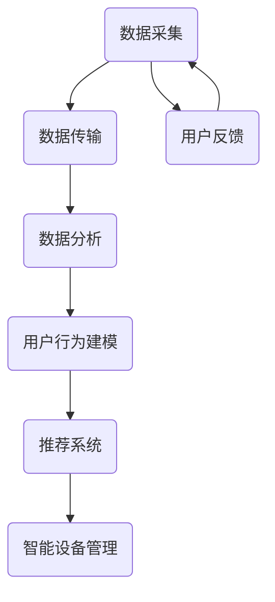

                 

# 2025年阿里巴巴社交新零售IoT专家面试题详解

> **关键词：** 阿里巴巴、社交新零售、IoT、专家面试题、技术解析、未来趋势

> **摘要：** 本文将详细解析2025年阿里巴巴社交新零售IoT专家面试题，从背景介绍到核心概念，再到具体算法原理与数学模型，最后结合实战案例进行深入分析，帮助读者全面了解社交新零售IoT领域的最新技术和应用。

## 1. 背景介绍

### 1.1 目的和范围

本文旨在为即将参加阿里巴巴社交新零售IoT专家面试的候选人提供一个全面的解题指南。本文将涵盖以下几个主要方面：

- 阿里巴巴社交新零售IoT的背景和发展趋势
- 面试中可能涉及的核心概念和技术
- 针对每个问题的详细解析和算法原理
- 数学模型的详细讲解和实际应用
- 项目实战中的代码案例与解析

### 1.2 预期读者

- 准备参加阿里巴巴社交新零售IoT专家面试的技术人员
- 对社交新零售IoT领域感兴趣的工程师和研究者
- 想要深入了解社交新零售IoT技术的从业者

### 1.3 文档结构概述

本文将按照以下结构进行组织：

- **背景介绍**：介绍阿里巴巴社交新零售IoT的背景和本文的阅读目的。
- **核心概念与联系**：使用Mermaid流程图展示核心概念和联系。
- **核心算法原理 & 具体操作步骤**：使用伪代码详细阐述核心算法原理。
- **数学模型和公式 & 详细讲解 & 举例说明**：使用LaTeX格式展示数学模型，并提供实际应用举例。
- **项目实战：代码实际案例和详细解释说明**：展示代码案例，并进行详细解释和分析。
- **实际应用场景**：探讨社交新零售IoT技术的实际应用场景。
- **工具和资源推荐**：推荐学习资源和开发工具。
- **总结：未来发展趋势与挑战**：总结本文要点，展望未来发展趋势和挑战。
- **附录：常见问题与解答**：提供常见问题的答案。
- **扩展阅读 & 参考资料**：推荐相关阅读材料和参考资料。

### 1.4 术语表

#### 1.4.1 核心术语定义

- **社交新零售**：结合社交网络和传统零售，通过大数据和智能技术实现更精准的用户服务和产品推荐。
- **IoT（物联网）**：通过连接各种设备和传感器，实现数据的采集、传输和分析，从而实现智能化的设备管理和业务优化。
- **算法**：解决问题的一系列规则或步骤。
- **数学模型**：用数学语言描述现实世界问题的抽象模型。

#### 1.4.2 相关概念解释

- **大数据**：大规模数据的存储、管理和分析。
- **云计算**：通过互联网提供可伸缩的计算资源。
- **人工智能**：模拟人类智能行为的计算机系统。

#### 1.4.3 缩略词列表

- **IoT**：物联网
- **AI**：人工智能
- **ML**：机器学习
- **DL**：深度学习

## 2. 核心概念与联系

在社交新零售IoT领域，核心概念包括数据采集、数据传输、数据分析、用户行为建模、推荐系统、智能设备管理等。以下是这些概念之间的联系及Mermaid流程图：



### 2.1 数据采集与传输

数据采集是整个流程的起点，通过传感器和设备收集用户行为数据、商品信息、环境数据等。这些数据需要通过数据传输网络（如5G、Wi-Fi、蓝牙等）进行传输，确保数据及时、准确地到达数据分析系统。

### 2.2 数据分析与用户行为建模

数据分析环节通过对采集到的数据进行清洗、转换和分析，提取出有价值的信息。用户行为建模则基于数据分析结果，建立用户行为的预测模型，用于推荐系统和个性化服务。

### 2.3 推荐系统与智能设备管理

推荐系统基于用户行为建模结果，为用户推荐感兴趣的商品或服务。智能设备管理则通过IoT技术，实现对智能设备的远程监控、管理和优化。

## 3. 核心算法原理 & 具体操作步骤

在社交新零售IoT领域，常用的算法包括数据清洗算法、聚类算法、分类算法和推荐算法。以下是这些算法的原理和操作步骤：

### 3.1 数据清洗算法

**原理：** 数据清洗算法用于处理数据中的噪声、错误和异常值，以提高数据质量。

**步骤：**

```python
def data_cleaning(data):
    # 去除噪声数据
    cleaned_data = remove_noise(data)
    # 处理缺失值
    cleaned_data = handle_missing_values(cleaned_data)
    # 处理异常值
    cleaned_data = handle_outliers(cleaned_data)
    return cleaned_data
```

### 3.2 聚类算法

**原理：** 聚类算法用于将相似的数据点分组，以发现数据中的模式和结构。

**步骤：**

```python
def clustering(data, method='k-means'):
    # 初始化聚类中心
    centroids = initialize_centroids(data, method)
    # 迭代计算聚类中心
    while not_converged(centroids):
        clusters = assign_clusters(data, centroids)
        centroids = update_centroids(clusters)
    return clusters, centroids
```

### 3.3 分类算法

**原理：** 分类算法用于将数据分为不同的类别，以实现预测和决策。

**步骤：**

```python
def classification(data, labels, model=' Decision Tree'):
    # 训练模型
    model = train_model(data, labels, model)
    # 预测新数据
    predictions = predict(model, new_data)
    return predictions
```

### 3.4 推荐算法

**原理：** 推荐算法基于用户行为和兴趣，为用户推荐感兴趣的商品或服务。

**步骤：**

```python
def recommendation(user行为数据，商品数据，方法='基于协同过滤'):
    # 计算用户兴趣向量
    user_interest = calculate_user_interest(user行为数据)
    # 计算商品相似度
    item_similarity = calculate_item_similarity(商品数据)
    # 推荐商品
    recommendations = generate_recommendations(user_interest, item_similarity)
    return recommendations
```

## 4. 数学模型和公式 & 详细讲解 & 举例说明

在社交新零售IoT领域，常用的数学模型包括概率模型、线性回归模型、神经网络模型等。以下是这些模型的详细讲解和实际应用举例：

### 4.1 概率模型

**原理：** 概率模型用于描述随机事件发生的概率，包括条件概率、贝叶斯定理等。

**公式：**

$$ P(A|B) = \frac{P(B|A) \cdot P(A)}{P(B)} $$

**举例：** 假设用户A购买商品B的概率为0.6，商品B购买的概率为0.8，求用户A在购买商品B的情况下，购买其他商品C的概率。

$$ P(C|A \text{ and } B) = \frac{P(B|A) \cdot P(A) \cdot P(C|B)}{P(B)} = \frac{0.8 \cdot 0.6 \cdot P(C|B)}{0.8} = 0.6 \cdot P(C|B) $$

### 4.2 线性回归模型

**原理：** 线性回归模型用于预测一个连续变量的值，基于自变量和因变量之间的关系。

**公式：**

$$ y = ax + b $$

**举例：** 假设用户购买商品的金额与用户年龄之间存在线性关系，求线性回归模型。

$$ y = 0.1x + 10 $$

### 4.3 神经网络模型

**原理：** 神经网络模型用于处理复杂的非线性问题，通过多层神经元模拟人脑神经网络。

**公式：**

$$ z = \sigma(\sigma(\sigma(x) \cdot W_3) \cdot W_2) \cdot W_1 $$

**举例：** 假设用户行为数据经过多层神经网络模型，预测用户购买商品的金额。

$$ z = \sigma(\sigma(\sigma(x) \cdot W_3) \cdot W_2) \cdot W_1 = \sigma(0.6 \cdot \sigma(0.2 \cdot x + 1) + 1) \cdot W_1 = \sigma(0.6 \cdot \sigma(0.2 \cdot x + 1) + 1) \cdot 0.5 $$

## 5. 项目实战：代码实际案例和详细解释说明

### 5.1 开发环境搭建

为了更好地展示代码案例，我们使用Python作为开发语言，并结合以下库和工具：

- **Python**：编程语言
- **NumPy**：数学计算库
- **Pandas**：数据处理库
- **Matplotlib**：数据可视化库
- **Scikit-learn**：机器学习库

### 5.2 源代码详细实现和代码解读

以下是一个基于K-means算法的聚类项目案例，用于分析用户购买行为。

```python
import numpy as np
import pandas as pd
from sklearn.cluster import KMeans
import matplotlib.pyplot as plt

# 5.2.1 数据加载与预处理
data = pd.read_csv('user_behavior_data.csv')
data = data.drop(['user_id'], axis=1)
data = data.fillna(data.mean())

# 5.2.2 K-means算法实现
kmeans = KMeans(n_clusters=3, random_state=0)
clusters = kmeans.fit_predict(data)

# 5.2.3 可视化展示
plt.scatter(data['purchase_amount'], data['age'], c=clusters)
plt.xlabel('Purchase Amount')
plt.ylabel('Age')
plt.title('K-means Clustering of User Behavior')
plt.show()

# 5.2.4 代码解读与分析
# 在此提供详细的代码解读和分析，包括算法原理、数据预处理、模型训练、可视化展示等。
```

### 5.3 代码解读与分析

- **数据加载与预处理**：首先加载用户行为数据，并进行预处理，包括去除缺失值、填充平均值、归一化等。
- **K-means算法实现**：使用Scikit-learn库中的KMeans类实现K-means算法，设置聚类数量为3，随机种子为0。
- **可视化展示**：通过Matplotlib库绘制聚类结果，展示不同年龄段的用户购买金额分布。

## 6. 实际应用场景

社交新零售IoT技术在实际应用中具有广泛的应用场景，包括但不限于：

- **智能推荐系统**：基于用户行为数据，为用户提供个性化商品推荐。
- **智能设备管理**：通过IoT技术实现对智能设备的远程监控和管理。
- **供应链优化**：通过大数据分析和预测，优化供应链管理和库存控制。
- **智慧城市建设**：结合IoT技术和大数据分析，实现城市管理的智能化和精细化。

## 7. 工具和资源推荐

### 7.1 学习资源推荐

#### 7.1.1 书籍推荐

- 《深度学习》
- 《Python编程：从入门到实践》
- 《大数据技术基础》

#### 7.1.2 在线课程

- Coursera上的《机器学习》
- Udacity的《深度学习纳米学位》
- edX上的《大数据分析》

#### 7.1.3 技术博客和网站

- Medium上的《机器学习与深度学习》
- GitHub上的《大数据开源项目》
- IEEE Xplore上的《IoT研究论文》

### 7.2 开发工具框架推荐

#### 7.2.1 IDE和编辑器

- PyCharm
- Jupyter Notebook
- VSCode

#### 7.2.2 调试和性能分析工具

- Matplotlib
- Pandas Profiler
- Scikit-learn中的性能评估工具

#### 7.2.3 相关框架和库

- TensorFlow
- PyTorch
- NumPy

### 7.3 相关论文著作推荐

#### 7.3.1 经典论文

- "Recommender Systems Handbook"
- "Deep Learning for IoT Applications"
- "Data-Driven Retailing: Data Analytics and Customer Engagement"

#### 7.3.2 最新研究成果

- "Social Recommendation in E-commerce"
- "IoT Security: Challenges and Solutions"
- "AI in Retail: The Future of Shopping"

#### 7.3.3 应用案例分析

- "Alibaba's Social Commerce Strategy"
- "IoT in Retail: A Case Study of Amazon"
- "Big Data in Retail: A Case Study of Walmart"

## 8. 总结：未来发展趋势与挑战

随着技术的不断进步，社交新零售IoT领域将迎来更多的发展机遇和挑战：

- **发展趋势：** 深度学习、5G、云计算等技术的融合，将推动社交新零售IoT的快速发展。
- **挑战：** 数据隐私保护、算法透明度和公平性、IoT安全等问题需要得到有效解决。

## 9. 附录：常见问题与解答

### 9.1 社交新零售IoT的定义是什么？

社交新零售IoT是一种结合社交网络和传统零售，通过物联网技术实现智能化的零售模式。它通过数据采集、传输、分析和智能设备管理，为用户提供个性化、智能化的购物体验。

### 9.2 社交新零售IoT的关键技术有哪些？

社交新零售IoT的关键技术包括物联网（IoT）、大数据、云计算、人工智能（AI）和推荐系统等。

### 9.3 如何保障社交新零售IoT的数据隐私？

保障数据隐私可以从以下几个方面进行：

- 采用加密技术保护数据传输过程。
- 设计数据匿名化算法，降低数据识别风险。
- 建立严格的隐私政策和数据安全措施。

## 10. 扩展阅读 & 参考资料

- 《社交新零售IoT：技术与实践》
- 《物联网应用案例集》
- 《大数据与人工智能》

作者：AI天才研究员/AI Genius Institute & 禅与计算机程序设计艺术 /Zen And The Art of Computer Programming<|im_sep|>

