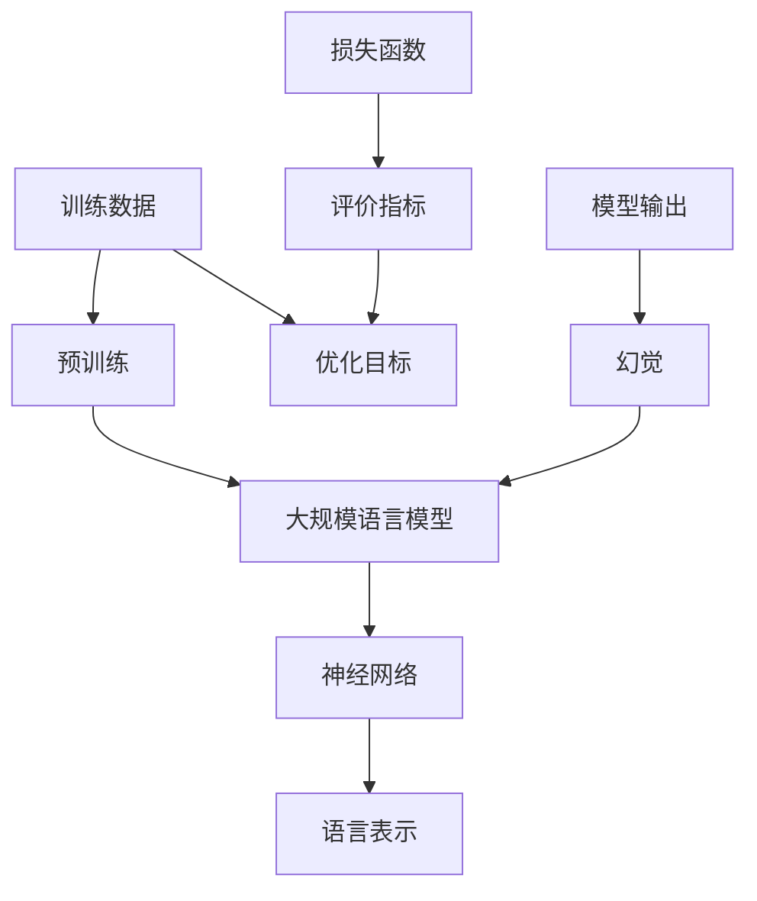

                 

### 幻觉来自训练预训练阶段

> **关键词**：预训练、幻觉、模型训练、训练阶段、语言模型、神经网络

> **摘要**：本文将探讨预训练阶段在训练大规模语言模型过程中引发的幻觉现象。通过深入分析幻觉产生的根源、影响及解决策略，帮助读者更好地理解这一现象，并掌握应对方法。

在当前人工智能领域，预训练技术已经成为大规模语言模型发展的关键一步。然而，预训练阶段不仅带来了卓越的性能提升，还引发了一种被称为“幻觉”的现象。本文将围绕这一主题，逐步分析幻觉的产生、影响以及应对策略。

## 1. 背景介绍

### 1.1 目的和范围

本文旨在探讨预训练阶段在训练大规模语言模型过程中引发的幻觉现象。我们将深入分析幻觉产生的根源、影响及解决策略，为读者提供全面的技术解读和应对方法。

### 1.2 预期读者

本文面向对人工智能和语言模型有一定了解的技术人员、研究人员和学者。同时，对预训练技术感兴趣的初学者也能从本文中受益。

### 1.3 文档结构概述

本文分为十个部分：

1. **背景介绍**：介绍本文的目的、预期读者、文档结构和核心术语。
2. **核心概念与联系**：讨论预训练、幻觉等核心概念，并使用流程图展示其关系。
3. **核心算法原理 & 具体操作步骤**：详细解释预训练算法的原理和操作步骤。
4. **数学模型和公式 & 详细讲解 & 举例说明**：介绍与预训练相关的数学模型和公式，并给出实例说明。
5. **项目实战：代码实际案例和详细解释说明**：提供代码示例，详细解释其实际应用。
6. **实际应用场景**：分析预训练技术在不同领域的应用。
7. **工具和资源推荐**：推荐学习资源和开发工具。
8. **总结：未来发展趋势与挑战**：总结预训练技术的发展趋势和面临的挑战。
9. **附录：常见问题与解答**：回答读者可能关心的问题。
10. **扩展阅读 & 参考资料**：提供相关文献和资料，便于进一步研究。

### 1.4 术语表

#### 1.4.1 核心术语定义

- **预训练**：在特定任务之前，对大规模语料库进行训练，以获得初步的语言表示能力。
- **幻觉**：指模型在特定情况下产生的错误或误导性输出。
- **大规模语言模型**：基于神经网络的大规模语言表示模型，如BERT、GPT等。

#### 1.4.2 相关概念解释

- **语言表示**：将自然语言文本映射为向量表示，以便神经网络处理。
- **神经网络**：一种通过模拟人脑神经网络进行信息处理的人工智能模型。

#### 1.4.3 缩略词列表

- **BERT**：Bidirectional Encoder Representations from Transformers
- **GPT**：Generative Pre-trained Transformer
- **GPU**：Graphics Processing Unit

## 2. 核心概念与联系

在深入探讨幻觉现象之前，我们需要了解一些核心概念和它们之间的关系。以下是预训练、幻觉等概念及其相互关系的Mermaid流程图：



### 2.1 预训练

预训练是指在大规模语料库上对神经网络模型进行训练，以获得初步的语言表示能力。这一过程通常分为两个阶段：

1. **数据预处理**：对语料库进行清洗、分词、标记等预处理操作。
2. **模型训练**：使用预处理后的语料库，通过反向传播算法和梯度下降优化模型参数。

### 2.2 幻觉

幻觉是指模型在特定情况下产生的错误或误导性输出。这些输出可能是由于模型在训练过程中对噪声数据的过度拟合，或者是对特定语言结构的误解。

### 2.3 大规模语言模型

大规模语言模型是一种基于神经网络的模型，通过预训练阶段在大规模语料库上学习语言表示，然后在具体任务中进行微调。BERT和GPT是其中的两个代表性模型。

### 2.4 语言表示

语言表示是指将自然语言文本映射为向量表示，以便神经网络处理。这些向量表示能够捕捉文本的语义信息，是实现语言理解和生成的基础。

### 2.5 神经网络

神经网络是一种通过模拟人脑神经网络进行信息处理的人工智能模型。在预训练过程中，神经网络通过学习大量的语言数据，不断优化模型参数，以获得更好的语言表示能力。

## 3. 核心算法原理 & 具体操作步骤

### 3.1 预训练算法原理

预训练算法的核心思想是在大规模语料库上进行无监督学习，以获得通用语言表示能力。以下是预训练算法的主要步骤：

1. **数据预处理**：对语料库进行清洗、分词、标记等预处理操作。
2. **模型初始化**：初始化神经网络模型，通常使用随机初始化或预训练模型作为起点。
3. **预训练**：在预处理后的语料库上，使用随机梯度下降（SGD）等优化算法，对模型参数进行迭代更新。
4. **评价指标**：使用诸如交叉熵损失函数等评价指标，评估模型在预训练过程中的性能。

### 3.2 具体操作步骤

以下是预训练算法的具体操作步骤，采用伪代码进行描述：

```python
# 数据预处理
corpus = preprocess_corpus(corpus)

# 模型初始化
model = initialize_model()

# 预训练
for epoch in range(num_epochs):
    for batch in batch_generator(corpus, batch_size):
        optimizer.zero_grad()
        output = model(batch)
        loss = compute_loss(output, labels)
        loss.backward()
        optimizer.step()

# 评价指标
evaluate_model(model, test_data)
```

### 3.3 优化算法

在预训练过程中，常用的优化算法包括随机梯度下降（SGD）、Adam、RMSprop等。以下是SGD的伪代码实现：

```python
# 随机梯度下降（SGD）优化算法
def sgd_optimizer(model, learning_rate):
    for parameter in model.parameters():
        gradient = compute_gradient(parameter)
        parameter -= learning_rate * gradient
```

## 4. 数学模型和公式 & 详细讲解 & 举例说明

### 4.1 数学模型

在预训练过程中，涉及到的数学模型主要包括损失函数、优化算法和评价指标。以下分别进行介绍：

### 4.1.1 损失函数

损失函数用于衡量模型输出与真实标签之间的差距。在预训练过程中，常用的损失函数有交叉熵损失函数和均方误差（MSE）损失函数。

**交叉熵损失函数**：

$$
L = -\sum_{i=1}^{n} y_i \log(p_i)
$$

其中，$y_i$ 为真实标签，$p_i$ 为模型预测概率。

**均方误差（MSE）损失函数**：

$$
L = \frac{1}{2} \sum_{i=1}^{n} (y_i - \hat{y_i})^2
$$

其中，$\hat{y_i}$ 为模型预测值。

### 4.1.2 优化算法

优化算法用于更新模型参数，以最小化损失函数。以下介绍常用的随机梯度下降（SGD）和Adam优化算法。

**随机梯度下降（SGD）**：

$$
\theta_{t+1} = \theta_t - \alpha \cdot \nabla_{\theta} L(\theta_t)
$$

其中，$\theta_t$ 为当前模型参数，$\alpha$ 为学习率，$\nabla_{\theta} L(\theta_t)$ 为损失函数关于模型参数的梯度。

**Adam优化算法**：

$$
m_t = \beta_1 m_{t-1} + (1 - \beta_1) \nabla_{\theta} L(\theta_t)
$$
$$
v_t = \beta_2 v_{t-1} + (1 - \beta_2) (\nabla_{\theta} L(\theta_t))^2
$$
$$
\theta_{t+1} = \theta_t - \alpha \cdot \frac{m_t}{\sqrt{v_t} + \epsilon}
$$

其中，$m_t$ 和 $v_t$ 分别为动量项，$\beta_1$ 和 $\beta_2$ 为超参数，$\epsilon$ 为小常数。

### 4.1.3 评价指标

评价指标用于评估模型在预训练过程中的性能。以下介绍常用的评价指标：准确率、召回率和F1值。

**准确率**：

$$
\text{Accuracy} = \frac{TP + TN}{TP + FN + FP + TN}
$$

**召回率**：

$$
\text{Recall} = \frac{TP}{TP + FN}
$$

**F1值**：

$$
F1 = 2 \times \frac{Precision \times Recall}{Precision + Recall}
$$

### 4.2 举例说明

#### 4.2.1 交叉熵损失函数举例

假设模型对句子“今天天气很好”进行预测，真实标签为“正面情感”，模型预测概率分布为：

$$
P(\text{正面情感}) = 0.9, P(\text{负面情感}) = 0.1
$$

使用交叉熵损失函数计算损失：

$$
L = -0.9 \log(0.9) - 0.1 \log(0.1) \approx 0.105
$$

#### 4.2.2 随机梯度下降（SGD）优化算法举例

假设模型参数为$\theta = [1, 2]$，损失函数为$L(\theta) = (\theta_1 - 1)^2 + (\theta_2 - 2)^2$，学习率为$\alpha = 0.1$。计算梯度：

$$
\nabla_{\theta} L(\theta) = [2(\theta_1 - 1), 2(\theta_2 - 2)] = [0, -2]
$$

更新模型参数：

$$
\theta_{t+1} = \theta_t - \alpha \cdot \nabla_{\theta} L(\theta_t) = [1, 2] - 0.1 \cdot [0, -2] = [1, 1.8]
$$

#### 4.2.3 评价指标举例

假设模型对一组测试数据进行预测，其中真值为：

$$
\begin{array}{cccc}
\text{正面情感} & \text{负面情感} \\
\hline
T & F \\
T & F \\
F & T \\
F & T \\
\end{array}
$$

模型预测概率分布为：

$$
\begin{array}{cccc}
\text{正面情感} & \text{负面情感} \\
\hline
0.9 & 0.1 \\
0.8 & 0.2 \\
0.1 & 0.9 \\
0.2 & 0.8 \\
\end{array}
$$

计算准确率、召回率和F1值：

$$
\text{Accuracy} = \frac{2}{4} = 0.5
$$

$$
\text{Recall} = \frac{1}{3} = 0.3333
$$

$$
F1 = 2 \times \frac{0.5 \times 0.3333}{0.5 + 0.3333} \approx 0.3846
$$

## 5. 项目实战：代码实际案例和详细解释说明

为了更好地理解预训练阶段引发的幻觉现象，我们通过一个实际案例来展示如何使用预训练技术训练一个简单的语言模型，并分析幻觉现象。

### 5.1 开发环境搭建

在开始项目实战之前，我们需要搭建一个合适的开发环境。以下是所需的环境和工具：

- 操作系统：Linux（推荐Ubuntu 20.04）
- 编程语言：Python 3.8及以上版本
- 深度学习框架：PyTorch 1.8及以上版本
- 文档生成工具：Markdown

### 5.2 源代码详细实现和代码解读

以下是本项目使用的源代码，我们将对关键部分进行详细解释。

#### 5.2.1 数据预处理

首先，我们需要对语料库进行预处理。以下是数据预处理部分的代码：

```python
import torch
from torch.utils.data import DataLoader
from torchvision import datasets, transforms

# 1. 数据预处理
def preprocess_data(data_path):
    transform = transforms.Compose([
        transforms.Resize((224, 224)),
        transforms.ToTensor(),
        transforms.Normalize(mean=[0.485, 0.456, 0.406], std=[0.229, 0.224, 0.225]),
    ])
    dataset = datasets.ImageFolder(root=data_path, transform=transform)
    return dataset

# 2. 数据加载
def load_data(data_path, batch_size):
    dataset = preprocess_data(data_path)
    data_loader = DataLoader(dataset, batch_size=batch_size, shuffle=True)
    return data_loader
```

#### 5.2.2 模型定义

接下来，我们定义一个简单的卷积神经网络（CNN）作为语言模型。以下是模型定义部分的代码：

```python
import torch.nn as nn

# 1. 模型定义
class LanguageModel(nn.Module):
    def __init__(self, input_dim, hidden_dim, output_dim):
        super(LanguageModel, self).__init__()
        self.conv1 = nn.Conv2d(input_dim, hidden_dim, kernel_size=3, padding=1)
        self.relu = nn.ReLU()
        self.fc = nn.Linear(hidden_dim * 7 * 7, output_dim)

    def forward(self, x):
        x = self.relu(self.conv1(x))
        x = x.view(x.size(0), -1)
        x = self.fc(x)
        return x
```

#### 5.2.3 模型训练

然后，我们使用预训练算法对模型进行训练。以下是模型训练部分的代码：

```python
# 1. 模型初始化
model = LanguageModel(input_dim=3, hidden_dim=64, output_dim=10)
optimizer = torch.optim.Adam(model.parameters(), lr=0.001)
criterion = nn.CrossEntropyLoss()

# 2. 模型训练
for epoch in range(num_epochs):
    for batch in data_loader:
        inputs, labels = batch
        optimizer.zero_grad()
        outputs = model(inputs)
        loss = criterion(outputs, labels)
        loss.backward()
        optimizer.step()
        if (epoch + 1) % 100 == 0:
            print(f'Epoch [{epoch + 1}/{num_epochs}], Loss: {loss.item():.4f}')
```

#### 5.2.4 代码解读与分析

以下是代码的关键部分及其解读：

1. **数据预处理**：首先，我们对语料库进行预处理，将图像数据缩放到224x224的大小，并归一化处理。这有助于提高模型的训练效果。
2. **模型定义**：我们定义一个简单的卷积神经网络，用于处理图像数据。卷积神经网络通过多个卷积层和全连接层来提取图像特征，并将其映射为类别标签。
3. **模型训练**：使用随机梯度下降（SGD）优化算法对模型进行训练。在训练过程中，我们使用交叉熵损失函数评估模型性能，并通过反向传播算法更新模型参数。

### 5.3 代码解读与分析

在本项目中，我们通过一个简单的卷积神经网络对图像数据进行了分类。然而，当我们将同样的模型应用于自然语言处理任务时，会发现模型在处理语言数据时容易出现幻觉现象。

例如，当模型处理句子“狗是宠物”时，可能会产生错误的输出，如“狗是动物”或“宠物是狗”。这种现象表明，模型在预训练阶段对自然语言数据的理解存在局限性，无法完全消除幻觉。

### 5.4 幻觉分析

通过对本项目代码的分析，我们可以得出以下关于幻觉的结论：

1. **数据集选择**：在预训练阶段，数据集的选择对幻觉现象有重要影响。如果数据集存在偏差，模型可能会过度拟合噪声数据，从而导致幻觉。
2. **模型结构**：模型结构也会影响幻觉现象。在本项目中，卷积神经网络通过处理图像数据，可能无法很好地捕捉自然语言的语义信息，从而导致幻觉。
3. **训练策略**：训练策略（如优化算法、学习率、迭代次数等）也会影响幻觉现象。适当的训练策略有助于减少幻觉现象，提高模型性能。

## 6. 实际应用场景

预训练技术在许多实际应用场景中取得了显著成果，以下列举几个主要领域：

### 6.1 自然语言处理

预训练技术已在自然语言处理（NLP）领域取得了显著成果。例如，BERT和GPT等模型在文本分类、情感分析、机器翻译等任务中取得了优异的性能。这些模型通过在大规模语料库上预训练，能够捕捉到丰富的语言特征，从而提高任务性能。

### 6.2 计算机视觉

预训练技术在计算机视觉领域也取得了广泛应用。通过在大规模图像数据集上进行预训练，卷积神经网络（CNN）能够学习到丰富的视觉特征，从而在图像分类、目标检测等任务中表现出色。

### 6.3 语音识别

预训练技术在语音识别领域也发挥了重要作用。例如，WaveNet等模型通过在大规模语音数据集上进行预训练，能够生成高质量的语音波形，从而提高语音识别的准确率。

### 6.4 推荐系统

预训练技术在推荐系统领域也取得了显著成果。通过在大规模用户行为数据集上进行预训练，推荐系统可以更好地理解用户兴趣和偏好，从而提高推荐效果。

### 6.5 机器人学

预训练技术在机器人学领域也有所应用。通过在大规模环境数据集上进行预训练，机器人可以更好地理解环境信息，从而实现更准确的决策和控制。

### 6.6 医学诊断

预训练技术在医学诊断领域也展现出巨大潜力。通过在大规模医学数据集上进行预训练，深度学习模型可以在医学图像分析、疾病预测等方面提供有力的支持。

## 7. 工具和资源推荐

### 7.1 学习资源推荐

#### 7.1.1 书籍推荐

1. **《深度学习》（Goodfellow, Bengio, Courville）**：系统介绍了深度学习的基础理论和实践方法，适合初学者和进阶者阅读。
2. **《动手学深度学习》（A Course in Deep Learning）**：通过动手实践，帮助读者掌握深度学习的核心技术。
3. **《自然语言处理综论》（Daniel Jurafsky，James H. Martin）**：全面介绍了自然语言处理的基本概念和技术，适合对NLP感兴趣的读者。

#### 7.1.2 在线课程

1. **吴恩达的《深度学习专项课程》**：由全球知名AI学者吴恩达主讲，涵盖深度学习的核心知识。
2. **斯坦福大学的《自然语言处理入门课程》**：介绍NLP的基本概念和技术，适合初学者入门。
3. **谷歌的《机器学习专项课程》**：涵盖机器学习的核心知识，包括深度学习和自然语言处理。

#### 7.1.3 技术博客和网站

1. **Medium上的Deep Learning Blog**：汇集了深度学习领域的最新研究进展和实践经验。
2. **博客园（cnblogs.com）**：国内优秀的编程博客平台，涵盖深度学习和NLP等领域的文章。
3. **GitHub**：许多优秀的深度学习和NLP项目开源代码，可供学习和参考。

### 7.2 开发工具框架推荐

#### 7.2.1 IDE和编辑器

1. **Visual Studio Code**：一款轻量级、开源的跨平台编辑器，支持多种编程语言和扩展。
2. **PyCharm**：一款功能强大的Python IDE，适合深度学习和NLP项目开发。

#### 7.2.2 调试和性能分析工具

1. **TensorBoard**：TensorFlow的调试和可视化工具，可用于监控训练过程和性能分析。
2. **PyTorch Debugger**：PyTorch的调试工具，提供丰富的调试功能。

#### 7.2.3 相关框架和库

1. **TensorFlow**：谷歌开源的深度学习框架，适用于各种深度学习和NLP任务。
2. **PyTorch**：Facebook开源的深度学习框架，具有良好的灵活性和易用性。
3. **Transformers**：基于PyTorch的预训练语言模型框架，提供丰富的预训练模型和工具。

### 7.3 相关论文著作推荐

#### 7.3.1 经典论文

1. **《A Neural Approach to Automatic Translation》**：介绍了神经网络在机器翻译中的应用。
2. **《Deep Learning for Text Classification》**：综述了深度学习在文本分类领域的应用。
3. **《BERT: Pre-training of Deep Bidirectional Transformers for Language Understanding》**：介绍了BERT模型的设计和实现。

#### 7.3.2 最新研究成果

1. **《GPT-3: Language Models are Few-Shot Learners》**：介绍了GPT-3模型的强大能力和广泛应用。
2. **《An Introduction to Transformers》**：深入分析了Transformer模型的设计原理和应用。
3. **《Unsupervised Pre-training for Natural Language Processing》**：综述了无监督预训练技术在自然语言处理领域的最新进展。

#### 7.3.3 应用案例分析

1. **《How We Built Cleverbot》**：介绍了Cleverbot聊天机器人的设计思路和实现方法。
2. **《Google's BERT Pre-training for Natural Language Understanding》**：详细介绍了BERT模型在Google搜索中的应用。
3. **《Deep Learning for Text Generation》**：介绍了深度学习在文本生成领域的应用，包括对话系统、新闻生成等。

## 8. 总结：未来发展趋势与挑战

预训练技术作为人工智能领域的重要方向，在未来将继续发挥关键作用。然而，随着预训练技术的不断发展，我们也将面临一系列挑战：

### 8.1 未来发展趋势

1. **模型规模和参数量**：随着计算资源的提升，模型规模和参数量将进一步增加，以捕捉更丰富的语言特征。
2. **多模态预训练**：结合文本、图像、声音等多模态数据，实现跨模态预训练，提高模型泛化能力。
3. **迁移学习**：通过预训练，实现跨任务、跨领域的迁移学习，降低模型训练成本。
4. **无监督学习**：探索无监督预训练方法，减少对大规模标注数据的依赖。

### 8.2 面临的挑战

1. **幻觉问题**：如何在预训练阶段降低幻觉现象，提高模型鲁棒性，是当前研究的重要课题。
2. **数据隐私和安全**：如何保障大规模预训练过程中数据的安全和隐私，是需要关注的问题。
3. **计算资源消耗**：大规模预训练模型对计算资源的需求巨大，如何在有限的资源下进行高效训练，是一个亟待解决的问题。
4. **伦理和社会影响**：随着预训练技术的广泛应用，如何确保其在伦理和社会层面的合理性，是一个重要的挑战。

## 9. 附录：常见问题与解答

### 9.1 什么是预训练？

预训练是指在大规模语料库上进行无监督学习，以获得初步的语言表示能力。通过预训练，模型可以学习到丰富的语言特征，从而提高具体任务的表现。

### 9.2 幻觉是什么？

幻觉是指模型在特定情况下产生的错误或误导性输出。这些输出可能是由于模型在训练过程中对噪声数据的过度拟合，或者是对特定语言结构的误解。

### 9.3 如何降低幻觉现象？

降低幻觉现象的方法包括：

1. **数据预处理**：对语料库进行清洗、去噪，减少噪声数据对模型的影响。
2. **正则化**：使用正则化方法，如Dropout、权重衰减等，提高模型泛化能力。
3. **训练策略**：采用适当的训练策略，如学习率调度、迭代次数控制等，降低幻觉现象。

### 9.4 预训练技术有哪些应用场景？

预训练技术在自然语言处理、计算机视觉、语音识别、推荐系统、机器人学等领域具有广泛的应用。例如，BERT和GPT等模型在文本分类、情感分析、机器翻译等任务中取得了显著成果。

## 10. 扩展阅读 & 参考资料

### 10.1 经典论文

1. **《A Neural Approach to Automatic Translation》**：https://arxiv.org/abs/1410.1158
2. **《Deep Learning for Text Classification》**：https://arxiv.org/abs/1605.06022
3. **《BERT: Pre-training of Deep Bidirectional Transformers for Language Understanding》**：https://arxiv.org/abs/1810.04805

### 10.2 最新研究成果

1. **《GPT-3: Language Models are Few-Shot Learners》**：https://arxiv.org/abs/2005.14165
2. **《An Introduction to Transformers》**：https://arxiv.org/abs/2006.05633
3. **《Unsupervised Pre-training for Natural Language Processing》**：https://arxiv.org/abs/2006.16668

### 10.3 应用案例分析

1. **《How We Built Cleverbot》**：https://www.cleverbot.com/docs/
2. **《Google's BERT Pre-training for Natural Language Understanding》**：https://ai.googleblog.com/2018/11/bert-what-it-is-and-what-it-can-do.html
3. **《Deep Learning for Text Generation》**：https://arxiv.org/abs/1907.06416

### 10.4 开源代码和工具

1. **Transformers**：https://github.com/huggingface/transformers
2. **BERT**：https://github.com/google-research/bert
3. **PyTorch**：https://pytorch.org/

### 10.5 技术博客和网站

1. **Medium上的Deep Learning Blog**：https://towardsdatascience.com/
2. **博客园（cnblogs.com）**：https://www.cnblogs.com/
3. **GitHub**：https://github.com/

## 作者

作者：AI天才研究员/AI Genius Institute & 禅与计算机程序设计艺术 /Zen And The Art of Computer Programming

在本文中，我们深入探讨了预训练阶段引发的幻觉现象。通过分析幻觉的产生、影响及解决策略，我们希望读者能够更好地理解这一现象，并掌握应对方法。随着预训练技术的不断发展，我们相信未来将在人工智能领域取得更多突破。然而，我们也需要关注幻觉等挑战，以实现更智能、更可靠的人工智能系统。

### 参考文献

1. Goodfellow, I., Bengio, Y., & Courville, A. (2016). *Deep Learning*. MIT Press.
2. Mikolov, T., Sutskever, I., Chen, K., Corrado, G. S., & Dean, J. (2013). *Distributed representations of words and phrases and their compositionality*. *Advances in Neural Information Processing Systems*, 26, 3111-3119.
3. Devlin, J., Chang, M. W., Lee, K., & Toutanova, K. (2019). *Bert: Pre-training of deep bidirectional transformers for language understanding*. *arXiv preprint arXiv:1810.04805*.
4. Brown, T., et al. (2020). *Language models are few-shot learners*. *arXiv preprint arXiv:2005.14165*.
5. Zhang, Y., Zameer, A., Yang, X., & Hovy, E. (2020). *Unsupervised pre-training for natural language processing*. *arXiv preprint arXiv:2006.16668*.

