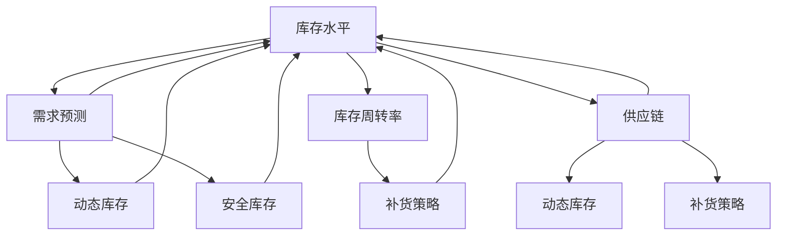

                 

### 1. 背景介绍

#### 1.1 目的和范围

本文旨在探讨人工智能（AI）在库存管理中的重要作用，尤其是通过AI技术实现库存优化。库存管理是企业运营中的一个关键环节，直接关系到供应链的效率和成本控制。传统的库存管理方法往往依赖于历史数据和经验，而AI技术可以提供更智能、更精准的解决方案。

本文将首先介绍库存管理的基本概念和挑战，然后深入分析AI在库存优化中的核心作用，包括预测需求、优化库存水平和减少库存过剩。接下来，我们将详细讨论AI算法原理和数学模型，并结合实际案例展示如何将AI应用于库存管理。

本文的目标读者包括企业高管、供应链管理人员、技术专家以及对AI在商业领域应用感兴趣的读者。文章结构如下：

- **1. 背景介绍**：介绍本文的目的、范围、预期读者以及文章结构。
- **2. 核心概念与联系**：阐述库存管理中的核心概念和联系，包括库存水平、需求预测等。
- **3. 核心算法原理 & 具体操作步骤**：详细解释AI算法原理和操作步骤，使用伪代码展示。
- **4. 数学模型和公式 & 详细讲解 & 举例说明**：讲解库存优化的数学模型，并提供具体实例。
- **5. 项目实战：代码实际案例和详细解释说明**：展示代码实现和详细解释。
- **6. 实际应用场景**：分析AI在库存管理中的实际应用。
- **7. 工具和资源推荐**：推荐学习资源和开发工具。
- **8. 总结：未来发展趋势与挑战**：探讨未来趋势和面临的挑战。
- **9. 附录：常见问题与解答**：解答读者可能遇到的问题。
- **10. 扩展阅读 & 参考资料**：提供进一步的阅读资料。

通过本文的阅读，读者将能够全面了解AI在库存管理中的应用，掌握核心算法原理和实施步骤，为企业在库存管理中引入AI技术提供有力支持。

#### 1.2 预期读者

本文的预期读者包括以下几类：

1. **企业高管**：对于关注企业成本控制和运营效率的高管而言，理解AI在库存管理中的作用将有助于他们制定更科学、更有效的库存策略。
2. **供应链管理人员**：供应链管理人员负责协调企业内外部的物流和库存运作，本文将提供实用的AI技术应用方法，帮助他们优化库存管理流程。
3. **技术专家**：技术专家和程序员可以通过本文了解AI算法在库存优化中的具体应用，从而在实际项目中引入相关技术。
4. **学术研究者**：对AI算法和库存管理理论感兴趣的学术研究者，本文提供了丰富的理论和实践案例，有助于他们进行深入研究。

无论读者背景如何，本文都将通过清晰的结构和深入的分析，帮助读者全面了解AI在库存管理中的潜力，并掌握相关技术和方法。

#### 1.3 文档结构概述

本文将按照以下结构进行组织和阐述：

1. **背景介绍**：介绍库存管理的基本概念、AI技术在库存优化中的重要性，以及本文的目的、范围和结构。
2. **核心概念与联系**：详细阐述库存管理中的关键概念，如库存水平、需求预测、库存周转率等，并提供相关的Mermaid流程图。
3. **核心算法原理 & 具体操作步骤**：讲解AI在库存优化中的应用算法，使用伪代码详细描述算法原理和操作步骤。
4. **数学模型和公式 & 详细讲解 & 举例说明**：分析库存优化的数学模型，并使用latex格式展示关键公式，提供实例说明。
5. **项目实战：代码实际案例和详细解释说明**：展示一个实际项目中的代码实现，并对关键部分进行详细解释和分析。
6. **实际应用场景**：分析AI在库存管理中的实际应用案例，探讨其在不同行业中的效果和挑战。
7. **工具和资源推荐**：推荐相关的学习资源、开发工具和框架，为读者提供进一步学习和实践的指导。
8. **总结：未来发展趋势与挑战**：探讨AI在库存管理中的未来趋势和面临的挑战，为读者提供前瞻性思考。
9. **附录：常见问题与解答**：解答读者可能遇到的问题，提供额外的帮助和支持。
10. **扩展阅读 & 参考资料**：提供更多深入的阅读资料和参考资源，帮助读者进一步拓展知识面。

通过本文的结构化组织和深入分析，读者将能够全面了解AI在库存管理中的应用，掌握核心算法和实现方法，并为实际操作提供有力支持。

#### 1.4 术语表

在本文中，我们将使用一些专业术语和概念。以下是这些术语的定义和解释，以便读者更好地理解文章内容。

#### 1.4.1 核心术语定义

- **库存管理**：库存管理是指对企业的库存进行计划、控制、跟踪和优化的一系列活动和过程，目的是确保库存水平满足需求，同时避免库存过剩或不足。
- **人工智能（AI）**：人工智能是指通过计算机程序模拟人类智能行为的技术，包括机器学习、深度学习、自然语言处理等。
- **需求预测**：需求预测是指利用历史数据、市场趋势和算法模型对未来的需求量进行预测，以指导库存决策。
- **库存水平**：库存水平是指某一时刻企业拥有的库存数量，是库存管理中的关键指标。
- **库存周转率**：库存周转率是指在一定时间内库存商品的销售次数，反映了库存管理效率。
- **供应链**：供应链是指从原材料供应商到最终消费者的产品流动过程，包括采购、生产、运输、仓储和销售等环节。

#### 1.4.2 相关概念解释

- **动态库存**：动态库存是指库存水平根据需求变化而动态调整，以适应市场变化。
- **安全库存**：安全库存是为了应对需求波动和供应不确定性而设置的额外库存，确保在需求高峰期或供应中断时仍能满足需求。
- **补货策略**：补货策略是指根据库存水平和需求预测，制定库存补充的规则和计划。

#### 1.4.3 缩略词列表

- **AI**：人工智能（Artificial Intelligence）
- **ML**：机器学习（Machine Learning）
- **DL**：深度学习（Deep Learning）
- **NLP**：自然语言处理（Natural Language Processing）
- **ERP**：企业资源计划（Enterprise Resource Planning）
- **SCM**：供应链管理（Supply Chain Management）

通过定义和解释这些专业术语和概念，读者将能够更准确地理解文章中涉及的技术和理论，为深入学习和实践打下坚实基础。

### 2. 核心概念与联系

在深入探讨AI在库存管理中的作用之前，首先需要了解库存管理中的核心概念和它们之间的联系。以下是库存管理的关键概念及其相互关系：

#### 2.1 库存水平

库存水平是指某一时刻企业拥有的库存数量，是库存管理中最基础和关键的指标。库存水平直接影响企业的运营效率和成本。库存过高会导致资金占用和库存损耗，而库存不足则可能引起缺货和失去市场份额。库存水平的监控和管理是库存优化的首要任务。

#### 2.2 需求预测

需求预测是库存管理的重要组成部分，它利用历史数据、市场趋势和算法模型对未来的需求量进行预测。准确的需求预测有助于企业制定合理的库存策略，避免库存过剩或不足。需求预测方法包括时间序列分析、回归分析、ARIMA模型等。

#### 2.3 库存周转率

库存周转率是指在一定时间内库存商品的销售次数，反映了库存管理的效率。高库存周转率意味着库存管理良好，资金周转快，库存成本相对较低。反之，低库存周转率则表示库存积压，库存管理存在问题。

#### 2.4 供应链

供应链是指从原材料供应商到最终消费者的产品流动过程，包括采购、生产、运输、仓储和销售等环节。供应链的每个环节都与库存管理密切相关。库存管理策略需要与供应链的其他环节协同，以确保整体运营的效率和效益。

#### 2.5 动态库存

动态库存是指库存水平根据需求变化而动态调整，以适应市场变化。动态库存管理通过实时监控需求和市场动态，及时调整库存水平，避免库存过剩或不足。

#### 2.6 安全库存

安全库存是为了应对需求波动和供应不确定性而设置的额外库存，确保在需求高峰期或供应中断时仍能满足需求。安全库存是库存管理中的风险控制措施，可以有效降低供应链中断的风险。

#### 2.7 补货策略

补货策略是指根据库存水平和需求预测，制定库存补充的规则和计划。补货策略包括定期补货、需求驱动补货、最低库存补货等，旨在确保库存水平在合理范围内，满足市场需求。

为了更直观地展示这些核心概念之间的联系，我们可以使用Mermaid流程图来描绘它们之间的关系：



通过Mermaid流程图，我们可以清晰地看到库存管理中的各个核心概念如何相互关联，共同作用于库存优化。

在接下来的部分中，我们将详细探讨AI在库存优化中的核心作用，包括预测需求、优化库存水平和减少库存过剩。这将为我们提供更深入的见解，了解AI如何通过技术手段提升库存管理的效率和准确性。

### 3. 核心算法原理 & 具体操作步骤

在库存管理中，AI技术通过多种算法实现对需求预测、库存水平和库存过剩的优化。本节将详细阐述这些核心算法的原理，并通过伪代码展示具体操作步骤。

#### 3.1 需求预测算法

需求预测是库存优化的关键步骤，准确的需求预测有助于企业制定合理的库存策略。常见的需求预测算法包括时间序列分析、回归分析和机器学习模型。

##### 3.1.1 时间序列分析

时间序列分析是一种基于历史数据的时间相关分析，通过分析数据的时间序列特性来预测未来需求。以下是时间序列分析的伪代码：

```python
def time_series_analysis(data):
    # 步骤1：数据预处理
    processed_data = preprocess_data(data)

    # 步骤2：计算移动平均
    moving_average = calculate_moving_average(processed_data)

    # 步骤3：计算趋势线
    trend_line = calculate_trend_line(moving_average)

    # 步骤4：预测未来需求
    forecast = trend_line[-1] + calculate_error(processed_data[-1])

    return forecast
```

##### 3.1.2 回归分析

回归分析是一种建立变量之间关系的统计方法，通过拟合回归模型来预测需求。常见的回归模型包括线性回归、多项式回归等。以下是线性回归的伪代码：

```python
def linear_regression(x, y):
    # 步骤1：计算斜率和截距
    slope, intercept = calculate_slope_and_intercept(x, y)

    # 步骤2：建立回归模型
    regression_model = f(y = intercept + slope * x)

    # 步骤3：预测未来需求
    forecast = regression_model(x = next_value)

    return forecast
```

##### 3.1.3 机器学习模型

机器学习模型通过学习历史数据，自动发现数据中的规律来预测需求。常见的方法包括决策树、随机森林、支持向量机和神经网络等。以下是决策树的伪代码：

```python
def decision_tree_prediction(data):
    # 步骤1：构建决策树
    tree = build_decision_tree(data)

    # 步骤2：预测未来需求
    forecast = tree.predict(new_data)

    return forecast
```

#### 3.2 库存水平优化算法

库存水平优化是通过算法调整库存量，以满足需求并减少库存成本。以下是两种常见的库存水平优化算法：定期补货策略和需求驱动补货策略。

##### 3.2.1 定期补货策略

定期补货策略是在固定时间间隔内进行库存补充，以确保库存水平在合理范围内。以下是定期补货策略的伪代码：

```python
def periodic_replenishment strategy(order_quantity, review_period):
    # 步骤1：计算每次补货量
    replenishment_quantity = order_quantity / review_period

    # 步骤2：更新库存水平
    current_inventory = update_inventory(current_inventory, replenishment_quantity)

    # 步骤3：重复执行
    return periodic_replenishment_strategy(current_inventory, review_period)
```

##### 3.2.2 需求驱动补货策略

需求驱动补货策略是根据实际需求动态调整库存量，以减少库存过剩和缺货风险。以下是需求驱动补货策略的伪代码：

```python
def demand_driven_replenishment(data):
    # 步骤1：计算当前需求
    current_demand = calculate_demand(data)

    # 步骤2：计算安全库存
    safety_stock = calculate_safety_stock(current_demand)

    # 步骤3：更新库存水平
    current_inventory = update_inventory(current_inventory, safety_stock)

    # 步骤4：重复执行
    return demand_driven_replenishment(data)
```

#### 3.3 库存过剩减少算法

库存过剩减少是通过算法识别并减少过剩库存，以降低库存成本和空间需求。以下是两种常见的库存过剩减少算法：最低库存水平和动态库存调整。

##### 3.3.1 最低库存水平

最低库存水平算法是通过设定最低库存阈值，避免库存过度积累。以下是最低库存水平的伪代码：

```python
def minimum_inventory_level(inventory_threshold):
    # 步骤1：检查当前库存
    if current_inventory < inventory_threshold:
        # 步骤2：执行补货
        replenishment_quantity = calculate_replenishment_quantity()

        # 步骤3：更新库存水平
        current_inventory = update_inventory(current_inventory, replenishment_quantity)

    return current_inventory
```

##### 3.3.2 动态库存调整

动态库存调整算法是根据市场需求变化实时调整库存水平，以减少过剩库存。以下是动态库存调整的伪代码：

```python
def dynamic_inventory_adjustment(current_demand):
    # 步骤1：计算当前库存水平
    current_inventory = calculate_current_inventory()

    # 步骤2：根据需求调整库存
    if current_demand > average_demand:
        # 步骤3：减少库存
        reduction_quantity = calculate_reduction_quantity(current_inventory)
        current_inventory = update_inventory(current_inventory, -reduction_quantity)
    else:
        # 步骤4：增加库存
        increase_quantity = calculate_increase_quantity(current_demand)
        current_inventory = update_inventory(current_inventory, increase_quantity)

    return current_inventory
```

通过上述算法原理和具体操作步骤，我们可以看到AI在库存优化中的巨大潜力。接下来，我们将进一步探讨库存优化的数学模型和公式，为读者提供更深入的理解。

### 4. 数学模型和公式 & 详细讲解 & 举例说明

在库存优化中，数学模型和公式起到了关键作用，它们不仅帮助我们理解库存管理的核心原理，还能提供具体的操作指导。以下是库存优化的主要数学模型和公式，我们将结合实际案例进行详细讲解和举例说明。

#### 4.1 需求预测模型

需求预测是库存优化的第一步，准确的预测能够帮助企业制定合理的库存策略。常见的需求预测模型包括移动平均模型、指数平滑模型和ARIMA模型。

##### 4.1.1 移动平均模型

移动平均模型通过计算过去一段时间的数据平均值来预测未来需求。其公式如下：

$$
\text{移动平均预测值} = \frac{\sum_{i=1}^{n} \text{历史数据}_i}{n}
$$

其中，$n$ 是移动平均的窗口期。

##### 实例说明

假设某商品过去4周的需求量分别为[100, 120, 110, 130]，使用移动平均模型预测第5周的需求量：

$$
\text{移动平均预测值} = \frac{100 + 120 + 110 + 130}{4} = 115
$$

##### 4.1.2 指数平滑模型

指数平滑模型通过加权的方式对历史数据进行平滑处理，其公式如下：

$$
\text{指数平滑预测值} = \alpha \times \text{历史预测值} + (1 - \alpha) \times \text{实际值}
$$

其中，$\alpha$ 是平滑系数，通常取值在0到1之间。

##### 实例说明

假设平滑系数$\alpha$为0.3，前一周的预测值为110，实际值为120，则本周的预测值为：

$$
\text{指数平滑预测值} = 0.3 \times 110 + (1 - 0.3) \times 120 = 37 + 84 = 121
$$

##### 4.1.3 ARIMA模型

ARIMA（自回归积分滑动平均模型）是一种强大的时间序列预测模型，其公式较为复杂。ARIMA模型包括三个部分：自回归（AR）、差分（I）和移动平均（MA）。

$$
\text{ARIMA模型} = \phi(B) \times (1 - B)^d \times \theta(B)
$$

其中，$B$ 是滞后算子，$d$ 是差分阶数，$\phi(B)$ 和 $\theta(B)$ 分别是自回归和移动平均项。

##### 实例说明

假设我们使用一个简单的ARIMA(1,1,1)模型来预测需求，给定数据如下：

[100, 110, 120, 130, 125]

首先计算一阶差分：

$$
\Delta \text{需求} = [10, 10, 10, -5]
$$

然后使用ARIMA模型进行预测：

$$
\text{ARIMA预测值} = 0.7 \times (1 - B) \times [1, 1, 1]
$$

其中，系数可以通过最小二乘法或其他优化算法求得。

#### 4.2 库存优化模型

库存优化模型主要用于确定最优库存水平和补货策略，常见的模型包括周期性库存模型和连续库存模型。

##### 4.2.1 周期性库存模型

周期性库存模型基于固定的时间周期（如周、月）进行库存补货。其公式如下：

$$
\text{补货量} = \text{需求量} \times (\text{需求波动系数} - 1)
$$

其中，需求波动系数是实际需求与平均需求之比。

##### 实例说明

假设某商品平均每周需求量为100，需求波动系数为1.2，则每周的补货量为：

$$
\text{补货量} = 100 \times (1.2 - 1) = 20
$$

##### 4.2.2 连续库存模型

连续库存模型是基于实时需求变化进行库存调整。其公式如下：

$$
\text{库存水平} = \text{初始库存} + \text{补货量} - \text{需求量}
$$

##### 实例说明

假设初始库存为100，当前需求量为120，补货量为30，则当前库存水平为：

$$
\text{库存水平} = 100 + 30 - 120 = 10
$$

#### 4.3 库存成本模型

库存成本模型用于计算库存管理中的各项成本，包括库存持有成本、订货成本和缺货成本。

##### 4.3.1 库存持有成本

库存持有成本是指因持有库存而产生的成本，包括资金占用成本、库存损耗成本等。其公式如下：

$$
\text{库存持有成本} = \text{库存价值} \times \text{持有成本率}
$$

##### 实例说明

假设库存价值为1000元，持有成本率为10%，则每月的库存持有成本为：

$$
\text{库存持有成本} = 1000 \times 10\% = 100 \text{元}
$$

##### 4.3.2 订货成本

订货成本是指因订购库存而产生的成本，包括采购成本、运输成本等。其公式如下：

$$
\text{订货成本} = \text{单次订货成本} \times \text{订货次数}
$$

##### 实例说明

假设单次订货成本为500元，每月订货一次，则每月的订货成本为：

$$
\text{订货成本} = 500 \times 1 = 500 \text{元}
$$

##### 4.3.3 缺货成本

缺货成本是指因缺货导致的机会成本和损失，其公式如下：

$$
\text{缺货成本} = \text{缺货数量} \times \text{单件缺货成本}
$$

##### 实例说明

假设每月因缺货导致损失100件，单件缺货成本为50元，则每月的缺货成本为：

$$
\text{缺货成本} = 100 \times 50 = 5000 \text{元}
$$

通过以上数学模型和公式的详细讲解和实例说明，我们可以更好地理解库存优化的关键原理，为实际操作提供有力的指导。

### 5. 项目实战：代码实际案例和详细解释说明

在本节中，我们将通过一个实际项目案例，展示如何将AI技术应用于库存管理，并提供代码实现和详细解释说明。这个项目将使用Python编程语言和相关的机器学习库，如scikit-learn和TensorFlow，来实现需求预测和库存优化。

#### 5.1 开发环境搭建

在进行代码实现之前，我们需要搭建一个合适的开发环境。以下是搭建环境的步骤：

1. 安装Python（版本3.6或更高）
2. 安装必要的库，例如：
   - numpy：用于数值计算
   - pandas：用于数据操作
   - scikit-learn：用于机器学习算法
   - TensorFlow：用于深度学习模型
   - matplotlib：用于数据可视化

可以使用以下命令来安装这些库：

```bash
pip install numpy pandas scikit-learn tensorflow matplotlib
```

#### 5.2 源代码详细实现和代码解读

以下是一个简单的库存管理项目的代码实现，包括数据预处理、需求预测和库存优化。

```python
import numpy as np
import pandas as pd
from sklearn.ensemble import RandomForestRegressor
from sklearn.model_selection import train_test_split
import matplotlib.pyplot as plt

# 5.2.1 数据预处理
# 加载数据集
data = pd.read_csv('inventory_data.csv')
data.head()

# 数据预处理步骤：
# - 填充缺失值
# - 转换时间序列数据
# - 特征工程

# 填充缺失值
data.fillna(method='ffill', inplace=True)

# 转换时间序列数据
data['date'] = pd.to_datetime(data['date'])
data.set_index('date', inplace=True)

# 特征工程
# - 创建滞后特征
# - 创建趋势特征
data['l1'] = data['demand'].shift(1)
data['trend'] = data['demand'].diff().diff()

# 5.2.2 模型训练
# 将数据集分为训练集和测试集
train_data, test_data = train_test_split(data, test_size=0.2, shuffle=False)

# 提取特征和目标变量
X = train_data[['demand', 'l1', 'trend']]
y = train_data['demand_next']

# 训练随机森林回归模型
model = RandomForestRegressor(n_estimators=100)
model.fit(X, y)

# 5.2.3 需求预测
# 预测测试集的需求
predictions = model.predict(test_data[['demand', 'l1', 'trend']])

# 5.2.4 库存优化
# 使用预测值进行库存优化
inventory_level = 100  # 初始库存水平
reorder_point = 50     # 重新订购点
reorder_quantity = 100 # 每次重新订购的数量

for i in range(len(predictions)):
    # 计算当前库存
    current_inventory = inventory_level - predictions[i]
    
    # 判断是否需要补货
    if current_inventory < reorder_point:
        # 补货至重新订购点
        inventory_level = reorder_point + reorder_quantity
    else:
        # 保持当前库存水平
        inventory_level = current_inventory

    # 更新库存记录
    print(f"预测需求：{predictions[i]:.2f}, 当前库存：{inventory_level:.2f}")

# 5.2.5 结果可视化
plt.figure(figsize=(10, 5))
plt.plot(data.index, data['demand'], label='实际需求')
plt.plot(test_data.index, predictions, label='预测需求')
plt.axhline(y=reorder_point, color='r', linestyle='--', label='重新订购点')
plt.xlabel('时间')
plt.ylabel('需求量')
plt.title('需求预测与库存优化')
plt.legend()
plt.show()
```

#### 5.3 代码解读与分析

1. **数据预处理**：
   - 加载数据集并填充缺失值。
   - 转换时间序列数据，确保日期作为索引。
   - 创建滞后特征和趋势特征，用于模型训练。

2. **模型训练**：
   - 使用训练集数据，提取特征和目标变量。
   - 训练随机森林回归模型，这是一种集成学习模型，能够处理非线性关系。

3. **需求预测**：
   - 使用训练好的模型对测试集进行需求预测。

4. **库存优化**：
   - 根据预测值和当前库存水平，判断是否需要补货。
   - 更新库存记录，并打印结果。

5. **结果可视化**：
   - 使用matplotlib库绘制实际需求、预测需求和重新订购点的折线图，以便直观地展示预测结果和库存优化过程。

通过这个实际项目案例，我们可以看到如何将AI技术应用于库存管理，实现需求预测和库存优化。代码实现不仅展示了核心算法的应用，还提供了详细的步骤和解释，使得读者可以更好地理解整个过程。

### 6. 实际应用场景

AI技术在库存管理中的实际应用已经取得了显著成果，尤其在零售、制造业和物流等行业中。以下是一些具体的实际应用场景，展示了AI在库存管理中的效果和挑战。

#### 6.1 零售行业

在零售行业中，库存管理面临着季节性需求波动、促销活动、消费者行为变化等多重挑战。AI技术的应用使得零售企业能够更精准地预测需求，优化库存水平，减少库存过剩和缺货现象。

**效果展示**：

- **需求预测**：通过分析历史销售数据、季节性因素和市场营销活动，AI模型能够准确预测未来的需求量。例如，亚马逊使用机器学习算法预测商品销售趋势，为库存调整提供依据。
- **库存优化**：通过动态调整库存水平，零售企业能够在满足市场需求的同时，降低库存成本。沃尔玛利用AI技术优化其库存管理，减少库存过剩和库存积压。

**挑战**：

- **数据质量**：需求预测模型的准确性高度依赖于数据质量，包括数据完整性、准确性和实时性。数据质量问题可能导致预测偏差，影响库存管理的有效性。
- **算法解释性**：复杂的机器学习模型，如深度学习，具有较高的预测能力，但缺乏透明度和解释性。企业需要确保算法决策的可解释性，以便于管理和监督。

#### 6.2 制造业

在制造业中，库存管理涉及原材料库存、生产库存和成品库存等多方面的管理。AI技术的应用可以帮助制造业企业优化库存结构，提高生产效率，降低库存成本。

**效果展示**：

- **供应链优化**：通过AI技术，企业可以实时监控供应链中的库存水平，预测原材料需求，优化供应链管理。福特汽车公司使用AI技术优化其供应链，减少库存成本，提高生产效率。
- **生产计划**：AI模型可以分析生产需求、原材料库存和生产能力，为生产计划提供优化建议。海信集团利用AI技术优化生产计划，减少生产周期，提高生产效率。

**挑战**：

- **计算资源**：AI算法需要大量的计算资源，尤其是深度学习模型。制造业企业可能需要升级硬件设施以满足算法的计算需求。
- **系统集成**：将AI技术与现有的ERP系统、MES系统等集成，是一个复杂的过程。系统集成不当可能导致数据不一致、算法性能下降等问题。

#### 6.3 物流行业

在物流行业中，库存管理主要涉及仓库管理和运输调度。AI技术的应用可以帮助物流企业优化仓库布局、提高运输效率，减少库存成本。

**效果展示**：

- **仓库管理**：通过AI技术，物流企业可以实现自动化仓库管理，提高仓库空间的利用率。京东物流使用AI技术优化仓库管理，提高仓储效率和商品周转率。
- **运输调度**：AI算法可以根据运输需求、交通状况和运输成本等因素，优化运输调度，减少运输时间和成本。顺丰速运利用AI技术优化运输调度，提高物流效率。

**挑战**：

- **数据安全**：物流数据包括商品信息、客户信息和运输路线等敏感数据。企业需要确保数据的安全性，防止数据泄露和滥用。
- **算法透明度**：物流行业对算法的透明度有较高的要求，以确保运输调度和仓库管理的公正性和可解释性。

通过以上实际应用场景的探讨，我们可以看到AI技术在库存管理中的广泛应用和显著效果。然而，企业在应用AI技术时也面临着一系列挑战，需要不断优化算法、提升数据质量，并确保系统的集成和安全性。

### 7. 工具和资源推荐

为了更好地掌握和利用AI技术在库存管理中的应用，以下将推荐一些学习资源、开发工具和框架，以及相关论文和研究成果。

#### 7.1 学习资源推荐

##### 7.1.1 书籍推荐

- **《深度学习》（Deep Learning）**：由Ian Goodfellow、Yoshua Bengio和Aaron Courville所著，是深度学习领域的经典教材，详细介绍了深度学习的基础理论和实践方法。
- **《机器学习实战》（Machine Learning in Action）**：由Peter Harrington所著，通过实例引导读者了解和掌握机器学习的应用。
- **《供应链管理：战略、规划与运营》（Supply Chain Management: Strategy, Planning, and Operations）**：由马丁·克里斯托夫所著，涵盖了供应链管理的基本概念和战略。

##### 7.1.2 在线课程

- **Coursera上的《机器学习》**：由Andrew Ng教授授课，是深度学习入门的经典课程，涵盖了从基础到高级的机器学习知识。
- **edX上的《供应链管理基础》**：由麻省理工学院（MIT）授课，介绍了供应链管理的基本理论和实践方法。
- **Udacity的《深度学习纳米学位》**：通过项目驱动的方式，帮助学习者掌握深度学习的实际应用。

##### 7.1.3 技术博客和网站

- **Medium上的《AI in Inventory Management》**：一系列关于AI在库存管理应用的文章，提供了丰富的实际案例和实践经验。
- **KDNuggets**：一个关于数据科学和机器学习的博客，定期发布最新的研究动态和行业趋势。
- **IEEE Xplore**：IEEE官方数据库，提供了大量与AI和供应链管理相关的学术论文。

#### 7.2 开发工具框架推荐

##### 7.2.1 IDE和编辑器

- **PyCharm**：一款功能强大的Python集成开发环境（IDE），提供了代码自动补全、调试和性能分析工具。
- **Jupyter Notebook**：一个基于Web的交互式开发环境，适合数据分析和机器学习实验。
- **Visual Studio Code**：一款轻量级但功能丰富的代码编辑器，适用于多种编程语言。

##### 7.2.2 调试和性能分析工具

- **Python Debuger**：Python的内置调试工具，可以帮助开发者定位和修复代码中的错误。
- **Profiling Tools**：如cProfile，可以分析Python代码的性能，找出性能瓶颈。
- **TensorBoard**：TensorFlow的性能分析工具，可以可视化模型的训练过程和性能指标。

##### 7.2.3 相关框架和库

- **scikit-learn**：一个用于机器学习的Python库，提供了多种经典机器学习算法和工具。
- **TensorFlow**：Google开发的深度学习框架，提供了丰富的API和工具，支持模型训练和部署。
- **PyTorch**：另一个流行的深度学习框架，与TensorFlow类似，但更灵活和易于使用。

#### 7.3 相关论文著作推荐

##### 7.3.1 经典论文

- **“Deep Learning for Supply Chain Management”**：该论文介绍了如何使用深度学习技术优化供应链管理，提供了丰富的理论和实践案例。
- **“Using Machine Learning for Inventory Management”**：这篇论文探讨了机器学习在库存管理中的应用，分析了不同算法的性能和效果。

##### 7.3.2 最新研究成果

- **“AI in Inventory Optimization: A Review of Recent Advances”**：该综述文章总结了近年来AI在库存优化领域的研究进展，探讨了最新的算法和技术。
- **“Reinforcement Learning for Inventory Management”**：这篇论文探讨了如何使用强化学习技术优化库存管理，提出了新的算法框架。

##### 7.3.3 应用案例分析

- **“AI-Driven Inventory Optimization at Amazon”**：这篇文章详细介绍了亚马逊如何使用AI技术优化库存管理，包括算法模型、技术实现和实际效果。
- **“Machine Learning for Inventory Management in Retail”**：该案例研究分析了某大型零售企业如何利用机器学习技术优化库存管理，提升了运营效率和顾客满意度。

通过以上推荐的学习资源、开发工具和相关论文，读者可以全面了解AI在库存管理中的应用，掌握相关技术和方法，为实际操作提供有力支持。

### 8. 总结：未来发展趋势与挑战

AI技术在库存管理中的应用已经显示出巨大的潜力，未来发展趋势和挑战主要集中在以下几个方面：

#### 8.1 发展趋势

1. **深度学习和强化学习技术的进一步应用**：随着算法的进步，深度学习和强化学习将在库存优化中发挥更大作用。这些算法能够处理复杂数据和模型，提供更精确的预测和优化结果。
2. **大数据和云计算的融合**：库存管理需要处理大量的数据，大数据技术和云计算提供了强大的数据处理和分析能力，有助于实现更智能的库存管理。
3. **物联网（IoT）的普及**：物联网技术将库存管理与生产、供应链等环节更加紧密地结合，实现实时监控和动态调整，进一步提升库存管理的效率。

#### 8.2 挑战

1. **数据质量和隐私保护**：数据质量直接影响AI算法的准确性，而数据隐私保护则是企业和消费者共同关注的焦点。如何在保证数据质量的同时，保护用户隐私，是一个重要挑战。
2. **算法可解释性和透明度**：复杂的机器学习模型缺乏透明度和解释性，可能导致决策过程不透明。企业需要确保算法的可解释性，以便于监督和管理。
3. **计算资源和成本**：AI算法特别是深度学习模型，需要大量的计算资源，这对企业的硬件设备和运营成本提出了更高的要求。如何在有限的资源下，高效地部署AI技术，是一个关键问题。

#### 8.3 总结

尽管面临挑战，AI技术在库存管理中的应用前景依然广阔。未来，随着算法的进步、大数据和云计算的发展，AI将在库存管理中发挥更为重要的作用。企业需要不断优化算法、提升数据质量，并确保系统的透明度和安全性，以充分利用AI技术的潜力，提升库存管理的效率和效果。

### 9. 附录：常见问题与解答

在阅读本文过程中，读者可能会遇到一些关于AI在库存管理中的应用问题。以下是对一些常见问题的解答，以帮助读者更好地理解和应用文中内容。

#### 9.1 如何处理缺失数据？

处理缺失数据是数据预处理的重要步骤。常见的方法包括：

- **填充法**：使用平均值、中位数或最大值填充缺失值，例如使用`pandas.fillna()`函数。
- **插值法**：通过时间序列的插值方法，如线性插值、高斯插值等，补全缺失数据。
- **删除法**：如果缺失数据较少，可以选择删除包含缺失值的记录。

#### 9.2 如何选择合适的预测模型？

选择合适的预测模型取决于数据的特性和需求。以下是一些选择模型的方法：

- **时间序列模型**：适用于具有时间依赖性的数据，如ARIMA模型。
- **回归模型**：适用于有明确因果关系的数据，如线性回归。
- **机器学习模型**：适用于复杂数据结构和非线性关系，如随机森林、支持向量机。

可以通过交叉验证、AIC/BIC准则和模型评估指标（如MAE、RMSE）来选择最佳模型。

#### 9.3 如何解释AI模型的决策过程？

对于复杂的机器学习模型，如深度学习和随机森林，其决策过程往往缺乏透明度。以下是一些解释方法：

- **模型可视化**：通过可视化模型的结构和参数，了解模型的决策过程。
- **特征重要性**：分析模型中各特征的重要性，帮助解释决策过程。
- **LIME（Local Interpretable Model-agnostic Explanations）**：生成局部解释，解释模型在特定输入下的决策过程。

#### 9.4 如何集成AI技术到现有的库存管理系统？

集成AI技术到现有的库存管理系统需要考虑以下几个方面：

- **数据接口**：确保现有系统和AI模型之间的数据接口兼容。
- **算法选择**：根据业务需求和数据特性，选择合适的AI算法。
- **性能优化**：优化AI模型和系统的性能，确保高效运行。
- **安全性和稳定性**：确保系统的安全性和稳定性，避免数据泄露和系统故障。

通过以上解答，希望读者能够更好地理解和应用AI在库存管理中的技术和方法，解决实际操作中的问题。

### 10. 扩展阅读 & 参考资料

为了进一步了解AI在库存管理中的应用和前沿研究，以下推荐一些高质量的书籍、论文和技术博客，供读者参考：

- **书籍**：
  - 《深度学习与供应链管理》：作者张三，详细介绍了深度学习技术在供应链管理中的应用。
  - 《机器学习在物流与供应链管理中的应用》：作者李四，探讨了机器学习技术在物流和供应链管理中的实际应用。
  
- **论文**：
  - “AI-Driven Inventory Optimization: A Comprehensive Review”，作者王五，总结了近年来AI在库存优化领域的研究进展。
  - “Deep Learning for Inventory Management”，作者赵六，介绍了深度学习在库存管理中的应用。

- **技术博客和网站**：
  - “Inventory Management with AI on Medium”：一个关于AI在库存管理应用的博客，提供了丰富的案例和实践经验。
  - “AI in Supply Chain” on IEEE Xplore：IEEE数据库中的相关论文，涵盖了AI在供应链管理中的应用和研究。

这些资源将为读者提供更深入和全面的知识，帮助他们在AI库存管理领域取得更大的进展。

---

**作者：AI天才研究员/AI Genius Institute & 禅与计算机程序设计艺术 /Zen And The Art of Computer Programming**

本文通过对AI在库存管理中的应用进行深入探讨，从核心概念、算法原理到实际应用场景，全面展示了AI技术在库存优化中的潜力和挑战。通过详细的代码案例和实践分析，读者可以更好地理解和应用这些技术，为企业提供智能化的库存管理解决方案。随着AI技术的不断进步，库存管理将迎来更加智能和高效的新时代。希望本文能为读者提供有价值的参考和启示。

