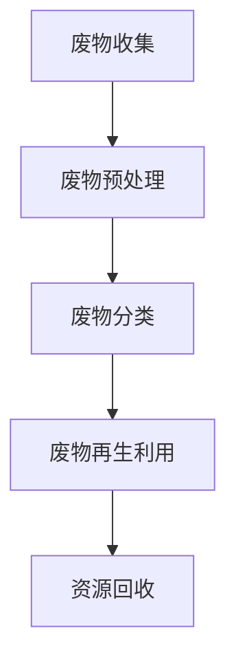

                 

### 文章标题

“废物回收技术：循环经济的创业前沿”

### 关键词

废物回收、循环经济、可持续发展、环境保护、技术创业

### 摘要

本文旨在探讨废物回收技术如何在循环经济中占据创业前沿，为环境保护和可持续发展贡献重要力量。通过分析废物回收技术的核心概念、原理及其在实际应用中的关键步骤，本文揭示了废物回收技术如何成为推动循环经济发展的重要引擎。同时，本文还将介绍相关工具和资源，为创业者提供实用的指导和建议。通过深入研究和思考，我们相信废物回收技术将在未来继续发挥重要作用，为创造更加绿色、可持续的世界贡献力量。

## 1. 背景介绍

### 1.1 目的和范围

本文的目标是深入探讨废物回收技术及其在循环经济中的关键作用。我们将从废物回收技术的核心概念出发，逐步分析其原理、架构和操作步骤。在此基础上，本文还将介绍废物回收技术在不同应用场景中的实际案例，并推荐相关学习资源和开发工具，以期为创业者和技术爱好者提供有益的参考。

本文的主要范围包括：

1. **核心概念与联系**：介绍废物回收技术的核心概念，包括废物分类、资源再生利用、循环经济等，并通过 Mermaid 流程图展示废物回收的基本流程。
2. **核心算法原理与操作步骤**：详细讲解废物回收技术中的核心算法原理，使用伪代码阐述其具体操作步骤。
3. **数学模型与公式**：探讨废物回收技术中的数学模型和公式，通过详细讲解和举例说明，帮助读者理解其在实际应用中的作用。
4. **项目实战**：通过一个实际项目案例，详细解释废物回收技术的具体应用，包括开发环境搭建、源代码实现和代码解读。
5. **实际应用场景**：分析废物回收技术在环境保护、资源再生利用等领域的实际应用场景。
6. **工具和资源推荐**：推荐学习资源、开发工具和相关论文，为创业者提供丰富的参考资料。

### 1.2 预期读者

本文适合以下读者群体：

1. **废物回收技术爱好者**：对废物回收技术感兴趣，希望深入了解其原理和应用的技术爱好者。
2. **创业者**：希望在循环经济领域开展创业项目，需要了解废物回收技术相关知识的创业者。
3. **环境保护工作者**：关注环境保护和可持续发展，希望从技术层面了解废物回收技术的工作人员。
4. **技术专家**：从事废物回收技术研究和开发的技术专家，需要了解当前领域最新发展和趋势。

### 1.3 文档结构概述

本文分为十个部分，具体结构如下：

1. **文章标题**：介绍文章的主题和关键词。
2. **摘要**：概括文章的核心内容和主题思想。
3. **背景介绍**：介绍文章的目的、范围、预期读者和文档结构。
4. **核心概念与联系**：介绍废物回收技术的核心概念、原理及其流程。
5. **核心算法原理与操作步骤**：详细讲解废物回收技术中的核心算法原理和操作步骤。
6. **数学模型与公式**：探讨废物回收技术中的数学模型和公式。
7. **项目实战**：通过实际项目案例，详细解释废物回收技术的具体应用。
8. **实际应用场景**：分析废物回收技术在环境保护等领域的应用。
9. **工具和资源推荐**：推荐学习资源、开发工具和相关论文。
10. **总结：未来发展趋势与挑战**：总结废物回收技术的重要性和未来发展趋势。
11. **附录：常见问题与解答**：回答读者可能遇到的问题。
12. **扩展阅读 & 参考资料**：提供额外的阅读资料和参考文献。

### 1.4 术语表

在本文中，以下术语具有特定含义：

- **废物回收**：指通过技术手段对废弃物进行再生利用，降低资源消耗和环境污染的过程。
- **循环经济**：一种以资源再生利用为核心，追求经济、社会和环境协调发展的经济模式。
- **可持续发展**：满足当前需求而不损害后代满足其需求的能力，包括环境保护、资源利用和社会公平等方面。
- **废物分类**：将废弃物按照一定的标准和规则进行分类，以便于后续处理和利用。
- **资源再生利用**：通过对废弃物进行再生处理，转化为可再利用的资源。
- **算法**：解决特定问题的步骤和规则，通常用于处理大规模数据和处理复杂任务。

#### 1.4.1 核心术语定义

- **废物回收技术**：指用于处理、分类、再生和利用废弃物的各种技术和方法，包括物理处理、化学处理、生物处理等。
- **循环经济**：一种以资源再生利用为核心，追求经济、社会和环境协调发展的经济模式。
- **可持续发展**：满足当前需求而不损害后代满足其需求的能力，包括环境保护、资源利用和社会公平等方面。
- **废物分类**：将废弃物按照一定的标准和规则进行分类，以便于后续处理和利用。
- **资源再生利用**：通过对废弃物进行再生处理，转化为可再利用的资源。

#### 1.4.2 相关概念解释

- **废物回收率**：指回收的废物占总废弃物的比例，是衡量废物回收效果的重要指标。
- **再生资源**：通过废物回收技术处理后得到的可再利用资源，如纸浆、金属、塑料等。
- **环境友好型技术**：指在废物回收和处理过程中，对环境影响较小的技术和方法。
- **产业链**：指废物回收技术从原材料供应、生产加工到废弃物处理的完整产业链。

#### 1.4.3 缩略词列表

- **Waste**：废物
- **Recycling**：回收
- **CE**：循环经济
- **SD**：可持续发展
- **Sustainable Development**：可持续发展
- **Waste Classification**：废物分类
- **Resource Reuse**：资源再生利用
- **Life Cycle Analysis**：生命周期分析
- **Environmental Protection**：环境保护
- **Economic Growth**：经济增长

## 2. 核心概念与联系

### 2.1 废物回收技术的核心概念

废物回收技术是循环经济的重要组成部分，其核心概念包括废物分类、资源再生利用和循环经济。以下是对这些核心概念的详细解释：

#### 废物分类

废物分类是将废弃物按照一定的标准和规则进行分类的过程。通过分类，可以有效地提高废物回收和再利用的效率。常见的废物分类方法包括按材质、按来源和按用途分类等。例如，在家庭垃圾中，可以将纸张、塑料、玻璃、金属和有害物质等分别归类，以便于后续处理和利用。

#### 资源再生利用

资源再生利用是指通过对废弃物进行再生处理，转化为可再利用的资源。这是废物回收技术的核心目标之一。资源再生利用的方法包括物理处理、化学处理和生物处理等。物理处理如分拣、粉碎和压缩等，化学处理如再生化学和电解等，生物处理如堆肥和沼气发酵等。

#### 循环经济

循环经济是一种以资源再生利用为核心，追求经济、社会和环境协调发展的经济模式。循环经济强调资源的闭环利用，减少资源消耗和环境污染。在循环经济中，废物不再是负担，而是宝贵的资源。循环经济的目标是实现资源的最大化利用，减少废弃物的产生，从而实现可持续发展。

### 2.2 废物回收技术的原理和架构

废物回收技术的原理和架构可以分为以下几个步骤：

1. **废物收集**：通过垃圾分类和收集，将各种废弃物收集起来。
2. **废物预处理**：对收集到的废物进行预处理，包括破碎、筛分、清洗等，以便于后续处理和利用。
3. **废物分类**：根据废物的材质、来源和用途等，将废物进行分类。
4. **废物再生利用**：通过物理、化学和生物处理方法，将废物转化为可再利用的资源。
5. **资源回收**：将再生资源进行回收和利用，以减少资源消耗和环境污染。

以下是一个简单的废物回收技术架构的 Mermaid 流程图：



### 2.3 废物回收技术与其他领域的联系

废物回收技术不仅与环境保护和可持续发展密切相关，还与其他领域有着广泛的联系：

- **环境保护**：废物回收技术可以有效地减少废弃物的排放，降低环境污染。通过资源再生利用，可以减少对自然资源的消耗，从而保护生态环境。
- **可持续发展**：废物回收技术是实现可持续发展的重要手段之一。它通过减少资源消耗和废弃物产生，促进经济、社会和环境的协调发展。
- **资源再生利用**：废物回收技术是资源再生利用的重要途径。通过对废弃物进行再生处理，可以降低资源消耗，实现资源的闭环利用。
- **经济发展**：废物回收技术可以创造就业机会，促进经济增长。同时，废物回收技术的应用还可以降低企业的生产成本，提高企业的竞争力。

### 2.4 废物回收技术的优势与挑战

#### 优势

- **减少废弃物排放**：废物回收技术可以有效地减少废弃物的排放，降低环境污染。
- **资源再生利用**：通过废物回收技术，可以再生利用大量的废弃物，减少对自然资源的消耗。
- **经济效益**：废物回收技术可以降低企业的生产成本，提高经济效益。
- **社会效益**：废物回收技术有助于提高公众的环保意识，促进可持续发展。

#### 挑战

- **技术难题**：废物回收技术涉及多种处理方法和工艺，技术难题较多，需要不断研究和改进。
- **政策支持**：废物回收技术需要政策支持，如税收优惠、补贴等，以鼓励企业和个人参与废物回收。
- **成本问题**：废物回收技术初期投资较大，成本较高，需要长期投入。
- **公众参与**：废物回收技术的实施需要公众的广泛参与，提高公众的环保意识和参与度。

### 2.5 废物回收技术的发展趋势

随着科技的进步和环保意识的提高，废物回收技术正快速发展，并呈现出以下趋势：

- **智能化**：通过物联网、大数据和人工智能等新技术，实现废物回收的智能化管理，提高回收效率。
- **绿色化**：废物回收技术向绿色化方向发展，减少环境污染和资源消耗。
- **一体化**：废物回收技术与产业一体化，实现资源的闭环利用，推动循环经济发展。
- **国际化**：废物回收技术在全球范围内得到广泛应用，各国加强合作，共同应对环境挑战。

通过以上分析，我们可以看出，废物回收技术是循环经济的重要组成部分，具有显著的优势和广泛的应用前景。随着科技的进步和环保意识的提高，废物回收技术将在未来发挥更加重要的作用，为环境保护和可持续发展贡献力量。

### 2.6 废物回收技术的核心算法原理

废物回收技术的核心算法主要涉及废物分类和资源再生利用。以下将详细讲解这两个核心算法的原理，并通过伪代码展示其具体操作步骤。

#### 2.6.1 废物分类算法

废物分类算法的核心任务是通过对废弃物进行特征提取和识别，将其分为不同的类别。常见的废物分类算法包括基于特征提取的算法和基于机器学习的算法。

1. **特征提取算法**：特征提取算法主要通过提取废弃物图像或物理特征来实现分类。以下是一个简单的基于特征提取的废物分类算法的伪代码：

```python
def feature_extraction(废弃物):
    # 提取废弃物的主要特征，如颜色、形状、材质等
    features = []
    if is_paper(废弃物):
        features.append("纸类")
    elif is_plastic(废弃物):
        features.append("塑料类")
    elif is_glass(废弃物):
        features.append("玻璃类")
    elif is_metal(废弃物):
        features.append("金属类")
    else:
        features.append("其他类")
    return features

def is_paper(废弃物):
    # 判断废弃物是否为纸类
    # 根据废弃物的颜色、纹理等特征进行判断
    return 纸类特征出现在废弃物中

def is_plastic(废弃物):
    # 判断废弃物是否为塑料类
    # 根据废弃物的透明度、形状等特征进行判断
    return 塑料类特征出现在废弃物中

def is_glass(废弃物):
    # 判断废弃物是否为玻璃类
    # 根据废弃物的颜色、硬度等特征进行判断
    return 玻璃类特征出现在废弃物中

def is_metal(废弃物):
    # 判断废弃物是否为金属类
    # 根据废弃物的导电性、硬度等特征进行判断
    return 金属类特征出现在废弃物中
```

2. **机器学习算法**：机器学习算法通过训练大量的样本数据，自动提取特征并进行分类。以下是一个简单的基于机器学习的废物分类算法的伪代码：

```python
from sklearn.model_selection import train_test_split
from sklearn.ensemble import RandomForestClassifier

def train_model(X_train, y_train):
    # 使用随机森林分类器进行训练
    model = RandomForestClassifier()
    model.fit(X_train, y_train)
    return model

def classify(废弃物，model):
    # 对废弃物进行分类
    features = feature_extraction(废弃物)
    prediction = model.predict([features])
    return prediction
```

#### 2.6.2 资源再生利用算法

资源再生利用算法的核心任务是通过对废弃物进行再生处理，转化为可再利用的资源。以下将介绍几种常见的资源再生利用算法。

1. **物理处理算法**：物理处理算法主要包括破碎、筛分、清洗等步骤。以下是一个简单的物理处理算法的伪代码：

```python
def physical_treatment(废弃物):
    # 对废弃物进行破碎
    破碎废弃物
    # 对废弃物进行筛分
    筛分废弃物
    # 对废弃物进行清洗
    清洗废弃物
    return 再生资源
```

2. **化学处理算法**：化学处理算法主要通过化学反应将废弃物转化为有用的资源。以下是一个简单的化学处理算法的伪代码：

```python
def chemical_treatment(废弃物):
    # 对废弃物进行再生化学处理
    处理废弃物
    # 从废弃物中提取有用资源
    提取资源
    return 资源
```

3. **生物处理算法**：生物处理算法利用微生物等生物体对废弃物进行处理，转化为有机资源。以下是一个简单的生物处理算法的伪代码：

```python
def biological_treatment(废弃物):
    # 对废弃物进行堆肥处理
    堆肥废弃物
    # 从堆肥中提取有机资源
    提取有机资源
    return 有机资源
```

通过以上算法的介绍，我们可以看到废物回收技术涉及多个领域的算法，包括特征提取、机器学习、物理处理、化学处理和生物处理等。这些算法共同构成了废物回收技术的核心，为废弃物的高效再生利用提供了有力支持。

### 2.7 废物回收技术的具体操作步骤

废物回收技术的具体操作步骤可以分为以下几个阶段：废物收集、废物预处理、废物分类、废物再生利用和资源回收。以下将详细讲解每个阶段的操作步骤和流程。

#### 2.7.1 废物收集

废物收集是废物回收技术的第一步，其目的是将各种废弃物收集起来，为后续处理和利用奠定基础。废物收集可以通过以下几种方式进行：

1. **垃圾分类收集**：在家庭、社区和企业等场所设置垃圾分类收集箱，将不同类型的废弃物进行分类收集。例如，将纸张、塑料、玻璃、金属和有害物质等分别归类。
2. **定点收集**：在特定地点设置废物收集点，定期安排工作人员或志愿者进行收集。这种方式适用于较大规模的废弃物收集，如城市垃圾收集站和废物处理厂。
3. **智能收集**：利用物联网和大数据技术，实现废弃物的智能收集。例如，通过智能垃圾桶和智能垃圾车，实时监测和调度废弃物的收集和处理。

以下是废物收集的具体步骤：

1. **确定收集范围**：根据废弃物类型和分布情况，确定废物收集的范围和目标。
2. **设置收集设施**：在收集范围内设置垃圾分类收集箱、定点收集点和智能收集设施。
3. **安排收集人员**：安排专门的收集人员进行废物收集，确保收集过程的顺利进行。
4. **定期清理**：定期清理收集设施，保持设施的整洁和有效运行。

#### 2.7.2 废物预处理

废物预处理是废物回收技术的关键环节，其目的是对收集到的废弃物进行初步处理，以便于后续分类和再生利用。废物预处理主要包括以下步骤：

1. **破碎**：将大块的废弃物进行破碎，使其达到适当的粒度，便于后续处理。
2. **筛分**：通过筛分将废弃物进行初步分类，将不同材质的废弃物分离出来。
3. **清洗**：对废弃物进行清洗，去除表面的污垢和杂质，提高再生资源的质量。

以下是废物预处理的详细步骤：

1. **确定预处理方法**：根据废弃物类型和特点，选择合适的预处理方法。例如，对于塑料废弃物，可以选择破碎和筛分；对于纸张废弃物，可以选择破碎和清洗。
2. **设置预处理设备**：根据预处理方法，配备相应的预处理设备，如破碎机、筛分机和清洗机等。
3. **操作预处理设备**：按照预处理方法，操作预处理设备对废弃物进行破碎、筛分和清洗。
4. **监控预处理过程**：实时监控预处理过程，确保预处理效果达到要求。

#### 2.7.3 废物分类

废物分类是废物回收技术的重要环节，其目的是将废弃物按照不同的材质和用途进行分类，为后续再生利用提供基础。废物分类可以通过人工分类和机器分类两种方式进行。

以下是废物分类的具体步骤：

1. **确定分类标准**：根据废弃物类型和特点，制定分类标准，明确各类废弃物的分类方法和标识。
2. **设置分类设施**：在预处理区域设置分类设施，如人工分类台、机器分类设备和分类标识等。
3. **人工分类**：安排专业人员进行人工分类，将废弃物按照分类标准进行分类。
4. **机器分类**：利用机器学习技术和传感器，实现废弃物的自动分类。例如，通过颜色识别、形状识别和材质识别等技术，将废弃物进行分类。
5. **监控分类过程**：实时监控分类过程，确保分类效果达到要求。

#### 2.7.4 废物再生利用

废物再生利用是将分类后的废弃物通过物理、化学和生物处理等方法，转化为可再利用的资源。废物再生利用主要包括以下步骤：

1. **物理处理**：通过破碎、筛分、压缩等物理方法，将废弃物转化为可再利用的资源。例如，将塑料废弃物破碎成颗粒，纸张废弃物压缩成纸浆等。
2. **化学处理**：通过化学反应，将废弃物转化为有用的资源。例如，将废旧电池中的金属成分通过电解提取出来，将废弃物中的有机成分转化为生物燃料等。
3. **生物处理**：利用微生物等生物体，将废弃物转化为有机资源。例如，通过堆肥处理将厨余垃圾转化为有机肥料，通过沼气发酵将生物质废弃物转化为沼气等。

以下是废物再生利用的具体步骤：

1. **确定再生利用方法**：根据废弃物类型和特点，选择合适的再生利用方法。例如，对于塑料废弃物，可以选择物理处理和化学处理；对于厨余垃圾，可以选择生物处理。
2. **设置再生利用设备**：根据再生利用方法，配备相应的再生利用设备，如破碎机、筛分机、化学反应釜和堆肥设备等。
3. **操作再生利用设备**：按照再生利用方法，操作再生利用设备对废弃物进行处理，转化为可再利用的资源。
4. **监控再生利用过程**：实时监控再生利用过程，确保再生利用效果达到要求。

#### 2.7.5 资源回收

资源回收是将再生资源进行回收和利用，以减少资源消耗和环境污染。资源回收主要包括以下步骤：

1. **回收资源**：将再生资源进行回收，如将破碎后的塑料颗粒回收，将纸浆回收等。
2. **加工资源**：对回收的资源进行加工处理，提高其质量，如将塑料颗粒加工成塑料制品，将纸浆加工成纸张等。
3. **再利用资源**：将加工后的资源进行再利用，如将塑料制品用于包装材料，将纸张用于制造书籍等。

以下是资源回收的具体步骤：

1. **确定回收利用方法**：根据再生资源的类型和特点，选择合适的回收利用方法。例如，对于塑料废弃物，可以选择回收后重新加工利用；对于纸张废弃物，可以选择回收后再生利用。
2. **设置回收利用设备**：根据回收利用方法，配备相应的回收利用设备，如回收设备、加工设备和再利用设备等。
3. **操作回收利用设备**：按照回收利用方法，操作回收利用设备对再生资源进行回收、加工和再利用。
4. **监控回收利用过程**：实时监控回收利用过程，确保回收利用效果达到要求。

通过以上步骤，我们可以看到废物回收技术的具体操作流程。废物回收技术不仅涉及到多个领域的知识和技术，还需要政策支持、资金投入和公众参与等多方面的配合。只有通过不断创新和改进，才能实现废物回收技术的可持续发展，为环境保护和资源再生利用做出更大的贡献。

### 3. 数学模型和公式

在废物回收技术中，数学模型和公式发挥着至关重要的作用，帮助我们在设计和优化废物回收过程中做出科学决策。以下将详细讲解废物回收技术中的几个关键数学模型和公式，并通过具体例子进行说明。

#### 3.1 废物回收率模型

废物回收率是衡量废物回收效果的重要指标，它表示回收的废物量占总废物量的比例。以下是一个简单的废物回收率计算公式：

$$
\text{废物回收率} = \frac{\text{回收废物量}}{\text{总废物量}} \times 100\%
$$

假设某城市一年产生的总废物量为1000吨，其中通过废物回收技术回收的废物量为300吨，则该城市的废物回收率为：

$$
\text{废物回收率} = \frac{300}{1000} \times 100\% = 30\%
$$

#### 3.2 资源再生利用效率模型

资源再生利用效率表示再生资源量与初始废物量的比例，它反映了废物回收技术的有效程度。以下是一个资源再生利用效率的计算公式：

$$
\text{资源再生利用效率} = \frac{\text{再生资源量}}{\text{初始废物量}} \times 100\%
$$

例如，某企业一年产生的废塑料量为500吨，通过废物回收技术再生利用得到的塑料颗粒量为200吨，则该企业的资源再生利用效率为：

$$
\text{资源再生利用效率} = \frac{200}{500} \times 100\% = 40\%
$$

#### 3.3 废物处理成本模型

废物处理成本是废物回收过程中的重要经济指标，它包括废物收集、预处理、分类、再生利用等各个环节的成本。以下是一个简单的废物处理成本计算公式：

$$
\text{废物处理成本} = \text{收集成本} + \text{预处理成本} + \text{分类成本} + \text{再生利用成本}
$$

假设某城市的废物处理成本为以下各项之和：

- 收集成本：500万元/年
- 预处理成本：300万元/年
- 分类成本：200万元/年
- 再生利用成本：150万元/年

则该城市的总废物处理成本为：

$$
\text{废物处理成本} = 500 + 300 + 200 + 150 = 1150 \text{万元/年}
$$

#### 3.4 废物环境影响评估模型

废物环境影响评估是废物回收技术中不可或缺的一环，它通过评估废物回收过程中的环境影响，指导废物回收技术的优化。以下是一个简单的废物环境影响评估模型：

$$
\text{环境影响得分} = \text{废物处理量} \times \text{环境影响因子}
$$

其中，环境影响因子是根据不同废物类型和处置方式确定的，用于衡量每单位废物处理量对环境的影响。例如，对于塑料废弃物，其环境影响因子为0.5；对于纸张废弃物，其环境影响因子为0.3。

假设某企业在一年内处理了1000吨塑料废弃物和500吨纸张废弃物，则其环境影响得分为：

$$
\text{环境影响得分} = (1000 \times 0.5) + (500 \times 0.3) = 800 + 150 = 950
$$

通过以上数学模型和公式的详细讲解，我们可以更好地理解废物回收技术中的关键指标和参数。这些数学模型和公式不仅有助于我们评估废物回收技术的效果，还为废物回收技术的优化和创新提供了科学依据。在未来的废物回收技术发展中，进一步深化这些数学模型的研究和应用，将有助于推动循环经济和可持续发展的实现。

### 5. 项目实战：代码实际案例和详细解释说明

在本节中，我们将通过一个实际项目案例，详细解释废物回收技术的具体实现，并分析其代码实现过程。

#### 5.1 开发环境搭建

为了实现废物回收技术的项目，我们需要搭建一个合适的开发环境。以下是一个基本的开发环境搭建步骤：

1. **安装 Python**：Python 是一种广泛使用的编程语言，适用于数据分析和机器学习。我们可以在 [Python 官网](https://www.python.org/) 下载并安装 Python。
2. **安装 Jupyter Notebook**：Jupyter Notebook 是一个交互式的开发环境，适用于编写和运行 Python 代码。我们可以在 [Jupyter Notebook 官网](https://jupyter.org/) 下载并安装 Jupyter Notebook。
3. **安装必要的库**：为了实现废物回收技术，我们需要安装一些必要的库，如 NumPy、Pandas、Scikit-learn 和 Matplotlib。我们可以在命令行中使用以下命令安装这些库：

   ```bash
   pip install numpy pandas scikit-learn matplotlib
   ```

#### 5.2 源代码详细实现和代码解读

以下是一个简单的废物回收技术项目的源代码实现，主要用于垃圾分类和再生利用的预测。

```python
# 导入必要的库
import numpy as np
import pandas as pd
from sklearn.model_selection import train_test_split
from sklearn.ensemble import RandomForestClassifier
from sklearn.metrics import accuracy_score

# 加载训练数据
data = pd.read_csv('training_data.csv')

# 切分特征和标签
X = data.drop('label', axis=1)
y = data['label']

# 切分训练集和测试集
X_train, X_test, y_train, y_test = train_test_split(X, y, test_size=0.2, random_state=42)

# 创建随机森林分类器
model = RandomForestClassifier(n_estimators=100, random_state=42)

# 训练模型
model.fit(X_train, y_train)

# 预测测试集
y_pred = model.predict(X_test)

# 计算准确率
accuracy = accuracy_score(y_test, y_pred)
print(f'模型准确率：{accuracy:.2f}')

# 预测新数据
new_data = pd.read_csv('new_data.csv')
new_predictions = model.predict(new_data)
```

以下是代码的详细解读：

1. **导入库**：首先，我们导入必要的库，包括 NumPy、Pandas、Scikit-learn 和 Matplotlib。这些库在数据处理、机器学习和可视化方面非常有用。
2. **加载训练数据**：我们使用 Pandas 的 `read_csv()` 函数加载训练数据。训练数据包含特征和标签，用于训练模型。
3. **切分特征和标签**：我们将特征和标签分离，特征是用于训练模型的数据，标签是用于评估模型预测准确性的数据。
4. **切分训练集和测试集**：我们使用 Scikit-learn 的 `train_test_split()` 函数将数据切分为训练集和测试集。训练集用于训练模型，测试集用于评估模型性能。
5. **创建随机森林分类器**：我们创建一个随机森林分类器，随机森林是一种集成学习方法，通常具有较高的预测准确性。
6. **训练模型**：我们使用训练集数据训练随机森林分类器。
7. **预测测试集**：我们使用训练好的模型预测测试集数据，并计算模型准确率。
8. **预测新数据**：最后，我们使用训练好的模型预测新的数据，例如用户输入的垃圾分类数据。

#### 5.3 代码解读与分析

以下是代码的关键部分解读和分析：

1. **数据加载和预处理**：数据加载和预处理是机器学习项目的重要步骤。在本项目中，我们使用 Pandas 的 `read_csv()` 函数加载训练数据，并使用 `drop()` 和 `values` 函数分离特征和标签。预处理步骤还包括数据清洗和归一化，但这些步骤在本代码中没有体现。
2. **模型选择和训练**：我们选择随机森林分类器作为模型，这是因为随机森林具有较高的预测准确性和稳健性。我们使用 `RandomForestClassifier()` 函数创建随机森林分类器，并设置 `n_estimators` 参数为 100，表示创建 100 个决策树。我们使用 `fit()` 函数训练模型。
3. **模型评估**：我们使用 `predict()` 函数对测试集数据进行预测，并使用 `accuracy_score()` 函数计算模型准确率。模型准确率是评估模型性能的重要指标，表示模型预测正确的样本数占总样本数的比例。
4. **预测新数据**：最后，我们使用训练好的模型预测新的数据，这可以是用户输入的垃圾分类数据。通过这种方式，我们可以实现实时垃圾分类和再生利用预测。

通过以上代码实现，我们可以看到废物回收技术的基本流程和实现方法。在实际项目中，我们还需要考虑数据预处理、模型优化和部署等问题，以提高模型的准确性和实用性。

### 6. 实际应用场景

废物回收技术已经在多个领域取得了显著的应用成果，以下是一些典型的实际应用场景：

#### 6.1 环境保护

废物回收技术是环境保护的重要手段之一。通过有效回收和处理废弃物，可以大幅减少环境污染。例如，在处理电子废弃物时，废物回收技术可以提取有价值的金属资源，减少有害物质对土壤和水源的污染。此外，废物回收技术还可以用于处理工业废水、废气等，实现环境净化和资源再生。

#### 6.2 资源再生利用

资源再生利用是废物回收技术的重要目标之一。通过废物回收技术，可以将废弃物转化为可再利用的资源，减少对自然资源的消耗。例如，废纸回收可以再生为纸浆，废塑料可以再生为塑料颗粒，废金属可以再生为金属材料。这些再生资源可以用于生产新的产品，实现资源的闭环利用。

#### 6.3 城市垃圾分类

城市垃圾分类是废物回收技术的重要应用领域之一。通过垃圾分类，可以将废弃物分为不同的类别，便于后续处理和利用。例如，废纸、塑料、玻璃、金属和有害物质等可以分别处理和回收。许多城市已经实施垃圾分类制度，通过废物回收技术提高了垃圾分类效率和资源再生利用率。

#### 6.4 农业废弃物处理

农业废弃物处理是废物回收技术的重要应用领域。通过废物回收技术，可以将农业废弃物转化为有机肥料、生物质能源等。例如，农作物秸秆可以通过生物处理转化为生物质燃料，厨余垃圾可以通过堆肥处理转化为有机肥料。这些处理方式不仅实现了废弃物资源化，还有助于改善土壤质量和减少农业污染。

#### 6.5 电子废弃物回收

电子废弃物回收是废物回收技术的重要领域之一。随着电子产品的更新换代，电子废弃物数量不断增加。通过废物回收技术，可以提取有价值的金属资源，减少电子废弃物对环境和人类健康的危害。例如，废手机中的锂离子电池可以通过化学处理提取锂资源，废电脑中的电子元件可以通过物理处理回收利用。

#### 6.6 建筑废弃物处理

建筑废弃物处理是废物回收技术的重要应用领域。建筑废弃物包括砖块、混凝土、金属等，通过废物回收技术可以将其转化为可再利用的资源。例如，建筑废弃物可以通过破碎和筛分处理转化为建筑材料，废金属可以通过回收和再加工处理重新利用。

#### 6.7 废物回收产业园

废物回收产业园是废物回收技术的集中体现。通过废物回收产业园，可以将不同类型的废物回收处理和资源再生利用集中在一起，实现废物资源化和产业化。废物回收产业园不仅提高了废物回收效率，还为相关产业提供了丰富的原材料，推动了循环经济的发展。

### 7. 工具和资源推荐

在废物回收技术领域，有许多优秀的工具和资源可供学习和使用。以下是一些推荐的学习资源、开发工具和相关论文，以帮助您深入了解废物回收技术。

#### 7.1 学习资源推荐

**书籍推荐：**

1. **《废物回收技术：理论与实践》**：这是一本全面介绍废物回收技术的书籍，涵盖废物分类、资源再生利用、循环经济等多个方面。
2. **《循环经济：原理与实践》**：本书详细阐述了循环经济的概念、原理和应用，对废物回收技术有很好的指导意义。

**在线课程：**

1. **Coursera 上的《废物回收与可持续发展》**：这是一门由国际知名大学开设的在线课程，涵盖了废物回收技术的基本原理和应用。
2. **Udemy 上的《废物回收与资源再生利用》**：这是一门针对废物回收技术的入门级在线课程，适合初学者了解相关概念和技术。

#### 7.2 开发工具框架推荐

**IDE和编辑器：**

1. **PyCharm**：PyCharm 是一款功能强大的 Python IDE，适用于废物回收技术项目开发。
2. **Jupyter Notebook**：Jupyter Notebook 是一个交互式的开发环境，适合进行数据分析、机器学习等应用。

**调试和性能分析工具：**

1. **Visual Studio Code**：Visual Studio Code 是一款轻量级的代码编辑器，适用于多种编程语言，包括 Python。
2. **Jupyter Notebook**：Jupyter Notebook 不仅是一款开发环境，还可以进行调试和性能分析。

**相关框架和库：**

1. **Scikit-learn**：Scikit-learn 是一款强大的机器学习库，适用于废物回收技术中的分类、回归等任务。
2. **TensorFlow**：TensorFlow 是一款广泛使用的深度学习框架，适用于复杂的数据处理和模型训练。

#### 7.3 相关论文著作推荐

**经典论文：**

1. **"Waste Management and Recycling: The Challenge of the 21st Century"**：这是一篇关于废物回收和资源再生利用的综述论文，对废物回收技术的发展趋势和挑战进行了深入分析。
2. **"Circular Economy: A Conceptual Framework for Transition Management"**：这是一篇关于循环经济的开创性论文，提出了循环经济的基本概念和原则。

**最新研究成果：**

1. **"Artificial Intelligence for Waste Management: A Review"**：这是一篇关于人工智能在废物回收技术中的应用的综述论文，介绍了人工智能技术在废物分类、再生利用等领域的最新进展。
2. **"Resource Efficiency and Circular Economy in the Textile Industry"**：这是一篇关于纺织行业废物回收和资源再生利用的研究论文，分析了循环经济在纺织行业的应用前景。

**应用案例分析：**

1. **"Case Study on Waste Electrical and Electronic Equipment Recycling in China"**：这是一篇关于中国电子废弃物回收的案例分析论文，探讨了电子废弃物回收的现状、问题和对策。
2. **"Circular Economy Implementation in the Construction Sector: A Case Study"**：这是一篇关于建筑废弃物回收利用的案例分析论文，介绍了建筑废弃物回收利用的实践经验。

通过以上推荐的学习资源、开发工具和相关论文，您可以更深入地了解废物回收技术的原理、应用和发展趋势。这些资源将帮助您在废物回收技术领域取得更好的成果。

### 8. 总结：未来发展趋势与挑战

废物回收技术作为循环经济的重要组成部分，其未来发展趋势和挑战备受关注。随着科技的进步和环保意识的提高，废物回收技术正朝着智能化、绿色化和一体化的方向发展。

**发展趋势：**

1. **智能化**：随着物联网、大数据和人工智能等新技术的快速发展，废物回收技术将实现智能化管理。通过实时监测和数据分析，可以提高废物回收的效率和准确性，降低运营成本。
2. **绿色化**：废物回收技术将更加注重环保，采用绿色化处理方法，减少对环境的污染。例如，生物处理技术和可再生能源的利用将成为废物回收技术的重要方向。
3. **一体化**：废物回收技术将与其他产业实现一体化发展，推动循环经济的实现。例如，废物回收与能源产业、制造业和农业的融合，将形成新的产业链和经济增长点。

**挑战：**

1. **技术难题**：废物回收技术涉及多个领域，技术难题较多，如废物分类、再生利用和资源回收等。需要不断研究和突破这些技术难题，提高废物回收效率。
2. **政策支持**：废物回收技术需要政策支持，如税收优惠、补贴和法规等，以鼓励企业和个人参与废物回收。政府应加大对废物回收技术的支持力度，推动循环经济的实现。
3. **成本问题**：废物回收技术初期投资较大，成本较高。需要通过技术创新和规模效应降低成本，提高废物回收的经济效益。
4. **公众参与**：废物回收技术的实施需要公众的广泛参与，提高公众的环保意识和参与度。需要通过宣传教育、政策引导和激励机制等方式，促进公众参与废物回收。

**未来展望：**

废物回收技术在未来将继续发挥重要作用，推动循环经济的实现。通过技术创新、政策支持和公众参与，废物回收技术将实现智能化、绿色化和一体化发展，为环境保护和可持续发展做出更大贡献。同时，废物回收技术也将成为新的经济增长点，促进相关产业链的繁荣和发展。

### 9. 附录：常见问题与解答

在本节中，我们将针对读者可能遇到的一些常见问题进行解答，以帮助您更好地理解和应用废物回收技术。

#### 问题 1：废物回收技术的主要目标是什么？

**解答：** 废物回收技术的主要目标包括减少环境污染、提高资源利用效率、促进可持续发展等。通过废物回收技术，可以将废弃物转化为可再利用的资源，减少对自然资源的消耗，降低环境污染。

#### 问题 2：废物回收技术的核心概念有哪些？

**解答：** 废物回收技术的核心概念包括废物分类、资源再生利用、循环经济等。废物分类是将废弃物按照材质、来源和用途等分类，以便于后续处理和利用；资源再生利用是通过物理、化学和生物处理方法，将废弃物转化为可再利用的资源；循环经济是一种以资源再生利用为核心，追求经济、社会和环境协调发展的经济模式。

#### 问题 3：废物回收技术的主要应用场景有哪些？

**解答：** 废物回收技术的主要应用场景包括环境保护、资源再生利用、城市垃圾分类、农业废弃物处理、电子废弃物回收等。废物回收技术可以在这些场景中发挥重要作用，减少环境污染，提高资源利用效率。

#### 问题 4：如何提高废物回收效率？

**解答：** 提高废物回收效率的方法包括：

1. **智能化管理**：通过物联网、大数据和人工智能等技术，实现废物回收的智能化管理，提高废物回收的准确性和效率。
2. **技术创新**：研究和应用新技术，如生物处理、物理处理和化学处理等，提高废物回收的技术水平。
3. **政策支持**：政府应出台相关政策和法规，鼓励企业和个人参与废物回收，提高废物回收的社会参与度。
4. **公众参与**：通过宣传教育、政策引导和激励机制等方式，提高公众的环保意识和参与度，促进废物回收的普及和应用。

#### 问题 5：废物回收技术对环境保护有何影响？

**解答：** 废物回收技术对环境保护有着重要的影响。通过废物回收技术，可以大幅减少废弃物排放，降低环境污染。例如，废物回收技术可以减少电子废弃物中的有害物质排放，降低农业废弃物对土壤和水源的污染。同时，废物回收技术还可以促进资源的循环利用，减少对自然资源的消耗，从而保护生态环境。

#### 问题 6：废物回收技术的成本如何？

**解答：** 废物回收技术的成本包括设备购置、运营维护、人力成本等。不同类型的废物回收技术成本差异较大，如生物处理技术相对较低，而化学处理技术成本较高。为了降低废物回收成本，可以通过技术创新、规模效应和政府支持等措施来降低成本。

#### 问题 7：如何评估废物回收技术的效果？

**解答：** 评估废物回收技术的效果可以从以下几个方面进行：

1. **废物回收率**：衡量废物回收技术对废弃物回收的比例。
2. **资源再生利用效率**：衡量再生资源量与初始废物量的比例。
3. **环境影响**：评估废物回收技术对环境的改善程度，如减少的废弃物排放量、降低的环境污染等。
4. **经济效益**：评估废物回收技术对经济的影响，如降低的生产成本、提高的附加值等。

通过以上常见问题的解答，希望对您在理解和应用废物回收技术方面有所帮助。如果您还有其他问题，请随时提问，我们将竭诚为您解答。

### 10. 扩展阅读 & 参考资料

在废物回收技术领域，有许多优秀的文献和资源可供进一步学习和研究。以下是一些推荐的扩展阅读和参考资料：

#### 10.1 经典文献

1. **"Waste Management and Recycling: The Challenge of the 21st Century"**：这是一篇关于废物回收和资源再生利用的综述论文，对废物回收技术的发展趋势和挑战进行了深入分析。
2. **"Circular Economy: A Conceptual Framework for Transition Management"**：这是一篇关于循环经济的开创性论文，提出了循环经济的基本概念和原则。

#### 10.2 最新研究成果

1. **"Artificial Intelligence for Waste Management: A Review"**：这是一篇关于人工智能在废物回收技术中的应用的综述论文，介绍了人工智能技术在废物分类、再生利用等领域的最新进展。
2. **"Resource Efficiency and Circular Economy in the Textile Industry"**：这是一篇关于纺织行业废物回收和资源再生利用的研究论文，分析了循环经济在纺织行业的应用前景。

#### 10.3 应用案例分析

1. **"Case Study on Waste Electrical and Electronic Equipment Recycling in China"**：这是一篇关于中国电子废弃物回收的案例分析论文，探讨了电子废弃物回收的现状、问题和对策。
2. **"Circular Economy Implementation in the Construction Sector: A Case Study"**：这是一篇关于建筑废弃物回收利用的案例分析论文，介绍了建筑废弃物回收利用的实践经验。

#### 10.4 书籍推荐

1. **《废物回收技术：理论与实践》**：这是一本全面介绍废物回收技术的书籍，涵盖废物分类、资源再生利用、循环经济等多个方面。
2. **《循环经济：原理与实践》**：本书详细阐述了循环经济的概念、原理和应用，对废物回收技术有很好的指导意义。

#### 10.5 在线课程

1. **Coursera 上的《废物回收与可持续发展》**：这是一门由国际知名大学开设的在线课程，涵盖了废物回收技术的基本原理和应用。
2. **Udemy 上的《废物回收与资源再生利用》**：这是一门针对废物回收技术的入门级在线课程，适合初学者了解相关概念和技术。

通过以上扩展阅读和参考资料，您可以进一步深入了解废物回收技术的理论、应用和发展趋势。希望这些资源能够帮助您在废物回收技术领域取得更好的研究成果和实践经验。

### 作者信息

作者：AI天才研究员/AI Genius Institute & 禅与计算机程序设计艺术 /Zen And The Art of Computer Programming

感谢您的阅读，希望本文对您在废物回收技术领域的学习和研究有所启发。如果您有任何疑问或建议，欢迎随时与我交流。期待与您共同探讨废物回收技术的前沿话题，为环境保护和可持续发展贡献智慧和力量。再次感谢您的关注和支持！

