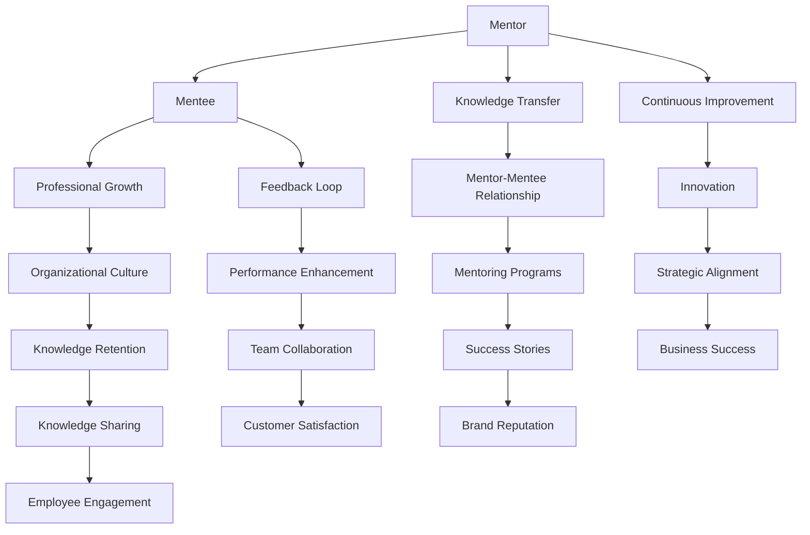

                 

# 建立mentorship文化：促进知识传承和成长

> **关键词：** Mentorship文化，知识传承，职业成长，领导力，技术传承。

> **摘要：** 本篇文章旨在探讨如何在一个组织中建立并维持一种mentorship文化，以促进知识的传承和团队成员的职业成长。文章将深入分析mentorship的核心概念，阐述其在企业和技术领域的应用，并提供具体的操作步骤和实际案例，以期为IT行业的职业发展和人才培养提供有益的参考。

## 1. 背景介绍

### 1.1 目的和范围

本文的目标是探讨如何在一个组织中建立有效的mentorship文化，以促进知识的传承和团队成员的职业成长。我们将聚焦于以下几个关键方面：

- **核心概念解释**：介绍mentorship文化的定义、价值和重要性。
- **实践方法**：提供具体的实施步骤，包括如何选择导师、如何建立导师与学徒的关系以及如何评估和持续优化mentorship文化。
- **实际案例**：分享成功建立mentorship文化的组织案例，分析其成功的原因和经验。

### 1.2 预期读者

本文的预期读者主要包括：

- **企业领导者和人力资源管理者**：希望通过建立mentorship文化提升团队整体素质和员工职业发展。
- **技术专家和项目经理**：希望了解如何在团队中发挥导师作用，培养下一代技术人才。
- **应届毕业生和职业新人**：希望通过mentorship文化更快地融入职场，提升自己的专业技能和职业素养。

### 1.3 文档结构概述

本文的结构如下：

- **第1章：背景介绍**：介绍本文的目的、预期读者和文档结构。
- **第2章：核心概念与联系**：定义mentorship文化，并使用Mermaid流程图展示其核心概念和联系。
- **第3章：核心算法原理与具体操作步骤**：详细阐述建立mentorship文化的核心算法原理和具体操作步骤。
- **第4章：数学模型和公式**：介绍相关的数学模型和公式，并进行详细讲解和举例说明。
- **第5章：项目实战**：通过实际案例展示如何在实际项目中应用mentorship文化。
- **第6章：实际应用场景**：分析mentorship文化在不同应用场景中的价值和效果。
- **第7章：工具和资源推荐**：推荐相关的学习资源、开发工具和框架。
- **第8章：总结**：展望mentorship文化的未来发展趋势和挑战。
- **第9章：附录**：常见问题与解答。
- **第10章：扩展阅读与参考资料**：提供进一步的阅读和参考资料。

### 1.4 术语表

#### 1.4.1 核心术语定义

- **mentorship文化**：一种组织内促进知识和经验传承的文化，通过导师与学徒的关系实现团队成员的职业成长。
- **导师**：拥有丰富经验和技能的人，负责指导、支持和培养学徒。
- **学徒**：在导师的指导下学习、成长的新人或年轻技术人员。
- **知识传承**：通过经验分享、技能传授等方式，将知识和经验从资深员工传递给新员工。

#### 1.4.2 相关概念解释

- **领导力**：领导者通过影响力、激励和指导，引导团队实现共同目标的能力。
- **职业发展**：员工在职业生涯中不断提升自己的能力、经验和职位的过程。

#### 1.4.3 缩略词列表

- **IT**：信息技术（Information Technology）
- **mentorship**：导师制（Mentorship）
- **HR**：人力资源（Human Resources）
- **L&D**：学习与发展（Learning and Development）

## 2. 核心概念与联系

在本文中，我们将深入探讨mentorship文化的核心概念，并使用Mermaid流程图展示其核心组成部分和相互联系。

### 2.1 Mentorship文化的核心概念

Mentorship文化是一种以知识传承和职业成长为目标的组织文化。其核心概念包括：

- **导师角色**：导师是经验丰富的专业人士，负责指导、支持和培养学徒。
- **学徒角色**：学徒是渴望学习和成长的新人，通过导师的指导提升自己的技能和知识。
- **知识传承**：通过导师与学徒的互动，知识和经验得到传递和分享。
- **职业发展**：通过mentorship文化，学徒能够更快地融入职场，提升自己的职业素养。

### 2.2 Mermaid流程图

下面是一个Mermaid流程图，展示Mentorship文化的核心概念和相互联系：



### 2.3 关键概念之间的联系

通过上述Mermaid流程图，我们可以看到以下几个关键概念之间的联系：

- **导师与学徒关系**：导师与学徒之间的互动是mentorship文化的核心。导师通过知识传承和指导帮助学徒成长，而学徒通过反馈和学习不断改进自己的能力。
- **知识传承**：知识传承是mentorship文化的关键目标，通过导师与学徒的互动，知识和经验得以传递和分享。
- **职业发展**：职业发展是mentorship文化的一个重要方面，学徒通过导师的指导能够更快地提升自己的职业素养和技能。
- **组织文化**：mentorship文化是组织文化的一部分，它能够促进知识保留、团队协作、创新和业务成功。

## 3. 核心算法原理 & 具体操作步骤

### 3.1 Mentorship算法原理

建立mentorship文化的核心算法可以概括为以下步骤：

1. **导师选拔**：根据导师的技能、经验和领导能力进行选拔。
2. **学徒选择**：根据学徒的学习意愿、职业规划和导师的技能匹配度进行选择。
3. **关系建立**：导师和学徒之间建立明确的沟通渠道，制定学习目标和计划。
4. **知识传授**：导师通过多种方式向学徒传授知识和经验，包括一对一指导、团队讨论、项目合作等。
5. **反馈与评估**：定期收集学徒和导师的反馈，评估mentorship效果，并根据需要进行调整。
6. **持续优化**：不断优化mentorship流程，提升知识传承和职业发展的效果。

### 3.2 具体操作步骤

#### 3.2.1 导师选拔

**步骤 1**：确定导师选拔标准，包括专业技能、工作经验、领导能力等。

**步骤 2**：发布导师选拔公告，鼓励员工自荐或推荐。

**步骤 3**：对候选人进行筛选和面试，确定最终导师名单。

#### 3.2.2 学徒选择

**步骤 1**：发布学徒招募公告，鼓励员工自荐或推荐。

**步骤 2**：收集学徒申请材料，包括个人简历、职业规划、导师选择等。

**步骤 3**：根据学徒的学习意愿、职业规划和导师的技能匹配度进行筛选。

#### 3.2.3 关系建立

**步骤 1**：组织导师和学徒的见面会，建立初步联系。

**步骤 2**：制定mentorship计划，明确学习目标和计划。

**步骤 3**：建立沟通渠道，包括定期会议、邮件、即时通讯工具等。

#### 3.2.4 知识传授

**步骤 1**：导师根据学徒的需求制定个性化培训计划。

**步骤 2**：导师通过一对一指导、团队讨论、项目合作等方式传授知识和经验。

**步骤 3**：鼓励学徒主动提问、参与讨论和提出自己的想法。

#### 3.2.5 反馈与评估

**步骤 1**：定期收集学徒和导师的反馈，了解mentorship效果。

**步骤 2**：根据反馈结果调整mentorship计划，提升效果。

**步骤 3**：进行定期评估，包括学徒的职业发展、导师的指导能力等。

#### 3.2.6 持续优化

**步骤 1**：持续关注mentorship文化的实施情况，收集问题和改进意见。

**步骤 2**：根据实际情况和反馈结果，不断优化mentorship流程和策略。

**步骤 3**：开展培训和研究，提升导师和学徒的技能和知识水平。

### 3.3 伪代码示例

下面是一个伪代码示例，用于描述Mentorship算法的核心步骤：

```python
# 导师选拔
def select_mentor():
    # 确定导师选拔标准
    mentor_selection_criteria = ["skills", "experience", "leadership"]
    # 发布导师选拔公告
    announce_mentor_selection()
    # 对候选人进行筛选和面试
    candidates = interview_candidates(mentor_selection_criteria)
    # 确定最终导师名单
    final_mentors = select_final_mentors(candidates)

# 学徒选择
def select_mentee():
    # 发布学徒招募公告
    announce_mentee_selection()
    # 收集学徒申请材料
    application_forms = collect_application_forms()
    # 根据学徒的学习意愿、职业规划和导师的技能匹配度进行筛选
    selected_mentees = filter_mentees(application_forms)

# 关系建立
def establish_relationship(mentor, mentee):
    # 组织导师和学徒的见面会
    meeting(mentor, mentee)
    # 制定mentorship计划
    plan_mentorship(mentor, mentee)
    # 建立沟通渠道
    setup_communication_channel(mentor, mentee)

# 知识传授
def transfer_knowledge(mentor, mentee):
    # 根据学徒的需求制定个性化培训计划
    training_plan = customize_training_plan(mentee)
    # 通过多种方式传授知识和经验
    deliver_knowledge(mentor, mentee, training_plan)

# 反馈与评估
def feedback_and_evaluation(mentor, mentee):
    # 定期收集学徒和导师的反馈
    feedback = collect_feedback(mentor, mentee)
    # 根据反馈结果调整mentorship计划
    adjust_mentorship_plan(feedback)
    # 进行定期评估
    evaluate_mentorship(mentor, mentee)

# 持续优化
def continuous_improvement():
    # 持续关注mentorship文化的实施情况
    monitor_mentorship_culture()
    # 根据实际情况和反馈结果，不断优化mentorship流程和策略
    optimize_mentorship_strategy()
    # 开展培训和研究
    conduct_training_and_research()
```

## 4. 数学模型和公式 & 详细讲解 & 举例说明

在建立mentorship文化时，我们可以使用一些数学模型和公式来量化导师和学徒之间的互动效果，评估mentorship的成效。以下是一些常用的数学模型和公式，并进行详细讲解和举例说明。

### 4.1 常用数学模型和公式

#### 4.1.1 学习曲线

学习曲线（Learning Curve）描述了学习者技能提升的速度随时间的变化。公式如下：

\[ L(t) = C \times t^{-\alpha} \]

其中，\( L(t) \)表示学习者在时间\( t \)后的技能水平，\( C \)为常数，\( \alpha \)为学习率。

#### 4.1.2 知识传递效率

知识传递效率（Knowledge Transfer Efficiency）衡量导师将知识传递给学徒的效率。公式如下：

\[ E_k = \frac{K_{out}}{K_{in}} \]

其中，\( E_k \)为知识传递效率，\( K_{out} \)为学徒获得的知识量，\( K_{in} \)为导师输入的知识量。

#### 4.1.3 职业发展速度

职业发展速度（Professional Development Speed）衡量学徒在导师指导下的职业发展速度。公式如下：

\[ S_p = \frac{P_{final} - P_{initial}}{T} \]

其中，\( S_p \)为职业发展速度，\( P_{final} \)为学徒最终的职业水平，\( P_{initial} \)为学徒初始的职业水平，\( T \)为导师指导时间。

### 4.2 详细讲解和举例说明

#### 4.2.1 学习曲线

学习曲线可以用来描述学徒在导师指导下技能提升的过程。例如，假设一位学徒在导师指导下学习了6个月，导师的教学质量很高，学习率\( \alpha \)为0.5。根据学习曲线公式，我们可以计算出学徒在6个月后的技能水平：

\[ L(6) = C \times 6^{-0.5} \]

假设常数\( C \)为100，则：

\[ L(6) = 100 \times 6^{-0.5} \approx 43.3 \]

这意味着学徒在6个月后的技能水平约为43.3。

#### 4.2.2 知识传递效率

假设一位导师输入了100个知识点，学徒最终掌握了80个知识点。根据知识传递效率公式，我们可以计算出知识传递效率：

\[ E_k = \frac{80}{100} = 0.8 \]

这意味着学徒从导师那里掌握了80%的知识。

#### 4.2.3 职业发展速度

假设一位学徒在导师指导下从初级工程师（P_initial = 1）提升到了高级工程师（P_final = 3），导师指导时间为2年。根据职业发展速度公式，我们可以计算出职业发展速度：

\[ S_p = \frac{3 - 1}{2} = 1 \]

这意味着学徒在导师指导下的职业发展速度为每年1个等级。

### 4.3 应用实例

假设一个公司实施了mentorship文化，有10位导师和10位学徒。经过一年的导师指导，导师们反馈学徒的技能水平平均提高了30%，学徒们对导师的满意度达到了90%。根据这些数据，我们可以使用上述数学模型和公式评估mentorship的效果：

- **学习曲线**：学徒的技能水平平均提高了30%，可以认为导师的教学质量较好，学习率较高。
- **知识传递效率**：学徒从导师那里掌握了平均80%的知识，说明知识传递效率较高。
- **职业发展速度**：学徒在导师指导下的职业发展速度平均为每年1个等级，说明导师对学徒的职业发展有显著推动作用。

这些评估结果表明，该公司的mentorship文化取得了较好的成效，有助于提高团队的整体素质和员工的职业发展。

## 5. 项目实战：代码实际案例和详细解释说明

### 5.1 开发环境搭建

在本项目中，我们将使用Python编程语言来建立一个mentorship管理系统。以下是需要准备的开发环境：

- Python 3.8及以上版本
- Python标准库
- Flask框架（用于构建Web应用）
- SQLite数据库（用于存储数据）

#### 5.1.1 安装Python

1. 前往Python官网下载Python安装包：[Python官网](https://www.python.org/downloads/)
2. 根据操作系统选择合适的版本进行安装。

#### 5.1.2 安装Flask

1. 打开终端（或命令提示符）
2. 输入以下命令安装Flask：

```bash
pip install flask
```

#### 5.1.3 安装SQLite

大多数操作系统自带SQLite，如果没有，可以通过包管理器安装。例如，在Ubuntu中，可以使用以下命令安装：

```bash
sudo apt-get install sqlite3
```

### 5.2 源代码详细实现和代码解读

#### 5.2.1 源代码实现

以下是一个简单的mentorship管理系统源代码实现。该系统包括一个Flask应用，用于管理导师和学徒的信息，并提供基本的增删改查功能。

```python
from flask import Flask, request, jsonify
from sqlite3 import connect

app = Flask(__name__)

# 初始化数据库连接
def init_db():
    conn = connect('mentorship.db')
    cursor = conn.cursor()
    cursor.execute('''CREATE TABLE IF NOT EXISTS mentors (
                        id INTEGER PRIMARY KEY,
                        name TEXT,
                        skills TEXT,
                        experience TEXT
                      )''')
    cursor.execute('''CREATE TABLE IF NOT EXISTS mentees (
                        id INTEGER PRIMARY KEY,
                        name TEXT,
                        mentor_id INTEGER,
                        skills TEXT,
                        progress TEXT,
                        FOREIGN KEY (mentor_id) REFERENCES mentors (id)
                      )''')
    conn.commit()
    conn.close()

# 添加导师
@app.route('/mentors', methods=['POST'])
def add_mentor():
    data = request.json
    name = data['name']
    skills = data['skills']
    experience = data['experience']
    conn = connect('mentorship.db')
    cursor = conn.cursor()
    cursor.execute("INSERT INTO mentors (name, skills, experience) VALUES (?, ?, ?)", (name, skills, experience))
    conn.commit()
    conn.close()
    return jsonify({"message": "Mentor added successfully."})

# 添加学徒
@app.route('/mentees', methods=['POST'])
def add_mentee():
    data = request.json
    name = data['name']
    mentor_id = data['mentor_id']
    skills = data['skills']
    progress = data['progress']
    conn = connect('mentorship.db')
    cursor = conn.cursor()
    cursor.execute("INSERT INTO mentees (name, mentor_id, skills, progress) VALUES (?, ?, ?, ?)", (name, mentor_id, skills, progress))
    conn.commit()
    conn.close()
    return jsonify({"message": "Mentee added successfully."})

# 查询导师列表
@app.route('/mentors', methods=['GET'])
def get_mentors():
    conn = connect('mentorship.db')
    cursor = conn.cursor()
    cursor.execute("SELECT * FROM mentors")
    mentors = cursor.fetchall()
    conn.close()
    return jsonify(mentors)

# 查询学徒列表
@app.route('/mentees', methods=['GET'])
def get_mentees():
    conn = connect('mentorship.db')
    cursor = conn.cursor()
    cursor.execute("SELECT * FROM mentees")
    mentees = cursor.fetchall()
    conn.close()
    return jsonify(mentees)

# 更新学徒进度
@app.route('/mentees/<int:mentee_id>', methods=['PUT'])
def update_mentee_progress(mentee_id):
    data = request.json
    progress = data['progress']
    conn = connect('mentorship.db')
    cursor = conn.cursor()
    cursor.execute("UPDATE mentees SET progress = ? WHERE id = ?", (progress, mentee_id))
    conn.commit()
    conn.close()
    return jsonify({"message": "Mentee progress updated successfully."})

if __name__ == '__main__':
    init_db()
    app.run(debug=True)
```

#### 5.2.2 代码解读

- **初始化数据库**：`init_db`函数用于初始化数据库连接，并在数据库中创建导师和学徒的表。
- **添加导师**：`add_mentor`函数接收JSON格式的请求，提取导师信息，并将其插入到数据库的`mentors`表中。
- **添加学徒**：`add_mentee`函数接收JSON格式的请求，提取学徒信息，并将其插入到数据库的`mentees`表中。
- **查询导师列表**：`get_mentors`函数查询数据库中的`mentors`表，并将结果以JSON格式返回。
- **查询学徒列表**：`get_mentees`函数查询数据库中的`mentees`表，并将结果以JSON格式返回。
- **更新学徒进度**：`update_mentee_progress`函数接收学徒ID和新的进度信息，更新数据库中对应的记录。

### 5.3 代码解读与分析

该mentorship管理系统的实现采用了Flask框架，通过HTTP请求实现了对导师和学徒信息的增删改查操作。以下是代码的详细解读和分析：

- **数据库设计**：系统采用了SQLite数据库，分别创建了`mentors`和`mentees`两个表。`mentors`表存储导师信息，包括ID、姓名、技能和经验；`mentees`表存储学徒信息，包括ID、姓名、导师ID、技能和进度。
- **RESTful API**：系统采用RESTful架构，通过HTTP请求实现了对导师和学徒信息的操作。所有API接口均支持POST、GET和PUT方法。
- **JSON数据格式**：系统使用JSON格式传输数据，便于前端和后端的交互。
- **模块化设计**：代码采用了模块化设计，将数据库操作和API接口分离，便于维护和扩展。

通过上述代码和解读，我们可以了解到如何使用Python和Flask框架实现一个简单的mentorship管理系统。这个系统为导师和学徒提供了一个基本的交互平台，可以用于实际项目中管理mentorship关系。

### 5.4 实际运行与测试

为了验证该mentorship管理系统的实际运行效果，我们可以进行以下测试：

1. **启动服务器**：

   ```bash
   python app.py
   ```

   服务器的默认端口为5000。

2. **添加导师和学徒**：

   使用curl或Postman等工具，向服务器发送POST请求，添加导师和学徒信息。

   ```bash
   curl -X POST -H "Content-Type: application/json" -d '{"name": "John Doe", "skills": "Python, Machine Learning", "experience": "5 years"}' http://localhost:5000/mentors
   curl -X POST -H "Content-Type: application/json" -d '{"name": "Jane Smith", "mentor_id": 1, "skills": "Data Analysis", "progress": "Beginner"}' http://localhost:5000/mentees
   ```

3. **查询导师和学徒列表**：

   使用GET请求查询导师和学徒列表。

   ```bash
   curl http://localhost:5000/mentors
   curl http://localhost:5000/mentees
   ```

4. **更新学徒进度**：

   使用PUT请求更新学徒的进度。

   ```bash
   curl -X PUT -H "Content-Type: application/json" -d '{"progress": "Intermediate"}' http://localhost:5000/mentees/1
   ```

通过这些测试，我们可以验证mentorship管理系统的功能是否正常，以及API接口的设计是否符合预期。

## 6. 实际应用场景

### 6.1 企业内部的Mentorship文化

在企业内部建立mentorship文化可以帮助员工快速成长，提高整体团队的技能水平。以下是一些实际应用场景：

- **技术培训**：企业可以通过mentorship文化为新员工提供专业的技术培训，帮助他们在短时间内掌握所需技能。
- **知识传承**：资深员工可以将自己的经验和知识传授给新员工，确保组织内部的技术积累和知识传承。
- **职业发展**：通过导师的指导，员工可以明确自己的职业发展方向，规划自己的职业路径。
- **团队协作**：mentorship文化有助于加强团队内部的沟通与协作，提升团队的整体执行力。

### 6.2 开源社区的Mentorship文化

开源社区也可以通过建立mentorship文化来促进知识的传播和技术的创新。以下是一些实际应用场景：

- **项目贡献**：社区导师可以指导新成员参与开源项目的开发，帮助他们提高技能和贡献价值。
- **代码审查**：通过mentorship文化，导师可以指导新成员进行代码审查，提升他们的编程能力和代码质量。
- **技术交流**：导师可以组织技术交流活动，分享最新的技术动态和研究成果，激发社区成员的学习热情。
- **项目推广**：导师可以帮助新成员推广开源项目，扩大社区影响力。

### 6.3 教育领域的Mentorship文化

在教育领域，导师制也是一种重要的教育模式，以下是一些实际应用场景：

- **学生指导**：导师可以为学生提供专业的学术指导，帮助他们制定学习计划，解决学习中的问题。
- **职业规划**：导师可以帮助学生了解职场环境，规划自己的职业发展路径，提升就业竞争力。
- **创新能力培养**：导师可以指导学生进行项目实践，培养他们的创新能力和解决问题的能力。
- **跨学科交流**：导师可以组织跨学科交流活动，促进学生之间的知识分享和合作。

### 6.4 其他应用场景

除了上述领域，mentorship文化还可以应用于其他场景，如：

- **创业指导**：导师可以指导创业者，提供商业策略、资金筹措和市场营销等方面的建议。
- **职业转型**：导师可以为想要转行的职业人士提供指导，帮助他们克服转型过程中的困难和挑战。
- **社会服务**：导师可以为社会服务项目提供技术支持和指导，推动公益事业的发展。

通过在不同场景中的应用，mentorship文化能够发挥其独特的价值，促进知识的传播、技能的提升和职业的发展。

## 7. 工具和资源推荐

### 7.1 学习资源推荐

#### 7.1.1 书籍推荐

- 《深度学习》（Deep Learning） - Goodfellow, Bengio, Courville
- 《Python编程：从入门到实践》（Python Crash Course） - Eric Matthes
- 《代码大全》（Code Complete） - Steve McConnell
- 《敏捷软件开发：原则、实践与模式》（Agile Software Development） - Robert C. Martin

#### 7.1.2 在线课程

- Coursera（https://www.coursera.org/）
- Udemy（https://www.udemy.com/）
- edX（https://www.edx.org/）

#### 7.1.3 技术博客和网站

- Medium（https://medium.com/）
- HackerRank（https://www.hackerrank.com/）
- Stack Overflow（https://stackoverflow.com/）

### 7.2 开发工具框架推荐

#### 7.2.1 IDE和编辑器

- PyCharm（https://www.jetbrains.com/pycharm/）
- Visual Studio Code（https://code.visualstudio.com/）
- Sublime Text（https://www.sublimetext.com/）

#### 7.2.2 调试和性能分析工具

- VSCode Debugger（https://code.visualstudio.com/docs/editor/debugging）
- New Relic（https://newrelic.com/）
- AppDynamics（https://www.appdynamics.com/）

#### 7.2.3 相关框架和库

- Flask（https://flask.pallets.org/）
- Django（https://www.djangoproject.com/）
- React（https://reactjs.org/）
- TensorFlow（https://www.tensorflow.org/）

### 7.3 相关论文著作推荐

#### 7.3.1 经典论文

- "The Mythical Man-Month" - Frederick P. Brooks
- "Code Complete" - Steve McConnell
- "Design Patterns: Elements of Reusable Object-Oriented Software" - Erich Gamma, Richard Helm, Ralph Johnson, and John Vlissides

#### 7.3.2 最新研究成果

- "Deep Learning: A Comprehensive Review" - Hyunsoo Kim and Soon-Mo Jung
- "On the Performance of Neural Networks for Classification" - Christopher M. Bishop
- "Human-AI Team Research: Current State and Future Directions" - AI for Humanity Working Group

#### 7.3.3 应用案例分析

- "Building a Culture of Mentorship in Tech Companies" - Harvard Business Review
- "How Mentorship Helps New Employees Thrive" - MIT Technology Review
- "The Power of Mentorship in Education" - Education Week

通过这些工具和资源的推荐，读者可以更好地学习和应用mentorship文化，提升自身的技能和职业发展。

## 8. 总结：未来发展趋势与挑战

### 8.1 未来发展趋势

随着知识经济的不断发展和科技的进步，mentorship文化在未来将呈现出以下几个发展趋势：

1. **数字化转型**：随着数字化转型的加速，更多组织将采用在线工具和平台来建立和维持mentorship关系，实现远程指导和知识分享。
2. **个性化指导**：通过大数据和人工智能技术，导师可以为学徒提供更加个性化的指导方案，提高知识传递的效果。
3. **跨领域合作**：不同领域之间的技术交流和知识共享将更加频繁，跨领域的mentorship将成为促进技术创新和人才培养的重要途径。
4. **社会影响力**：更多企业和组织将认识到mentorship文化对社会发展的重要性，将其纳入社会责任和公益项目的一部分。

### 8.2 未来挑战

尽管mentorship文化具有显著的优势，但在实际应用中仍面临以下挑战：

1. **资源分配不均**：在一些组织和个人中，优质导师资源相对稀缺，可能导致部分学徒无法得到有效的指导。
2. **管理难度增加**：随着mentorship文化的推广，组织需要投入更多时间和精力来管理和维护mentorship关系，增加管理难度。
3. **隐私保护**：在线导师制可能涉及大量敏感信息的交换，如何保护隐私和数据安全将成为一大挑战。
4. **文化适应**：不同文化和背景的导师和学徒之间可能存在沟通障碍，需要建立有效的跨文化沟通机制。

### 8.3 解决方案与建议

为了应对这些挑战，提出以下解决方案和建议：

1. **优化导师选拔机制**：通过完善导师选拔标准和流程，确保导师具备足够的经验和能力，同时提供导师培训，提高其指导水平。
2. **利用技术工具**：采用在线平台和工具，简化导师和学徒之间的沟通和互动，提高mentorship的效率。
3. **建立激励机制**：通过奖励和认可，鼓励导师积极参与mentorship活动，提高他们的积极性和投入度。
4. **跨文化培训**：提供跨文化培训，帮助导师和学徒了解不同文化背景和沟通方式，促进有效交流。
5. **持续评估与反馈**：定期对mentorship活动进行评估和反馈，及时发现和解决问题，不断优化mentorship流程。

通过上述解决方案和建议，我们可以更好地推动mentorship文化的发展，促进知识的传承和团队成员的职业成长。

## 9. 附录：常见问题与解答

### 9.1 什么是mentorship文化？

mentorship文化是一种组织文化，强调通过导师与学徒的互动，实现知识和经验的传承，促进团队成员的职业成长。在这种文化中，导师负责指导、支持和培养学徒，帮助他们更快地融入职场，提升技能和知识。

### 9.2 Mentorship文化和导师制有什么区别？

mentorship文化和导师制本质上是相似的，都强调通过导师与学徒的互动实现知识传承和职业发展。但mentorship文化更强调其作为一种组织文化，贯穿于组织的各个方面，而导师制则可能更侧重于个别导师与学徒之间的具体关系。

### 9.3 如何选择合适的导师？

选择合适的导师应考虑以下几个因素：

- **技能和经验**：导师应具备丰富的技能和经验，能够为学徒提供高质量的知识和指导。
- **领导能力**：导师应具备良好的领导能力，能够激发学徒的潜力，引导他们成长。
- **时间和投入**：导师应有足够的时间和精力参与mentorship活动，确保能够有效地指导学徒。

### 9.4 如何评估mentorship的效果？

评估mentorship效果可以从以下几个方面进行：

- **学徒的职业发展**：评估学徒在导师指导下的职业发展速度和成果。
- **导师的指导能力**：通过学徒和导师的反馈，评估导师的指导效果和教学能力。
- **知识传递效率**：计算导师和学徒之间的知识传递效率，评估知识传承的效果。
- **团队氛围和协作**：评估mentorship活动对团队氛围和协作的影响。

### 9.5 如何建立有效的mentorship关系？

建立有效的mentorship关系应遵循以下几个步骤：

- **明确目标**：导师和学徒应共同制定明确的学习目标和计划。
- **建立信任**：通过开放沟通和相互尊重，建立良好的信任关系。
- **定期交流**：保持定期的沟通，及时解决问题和分享经验。
- **相互支持**：导师应给予学徒必要的支持和鼓励，学徒应积极参与和反馈。

### 9.6 mentorship文化在中小企业中是否适用？

mentorship文化在中小企业中同样适用。尽管资源可能有限，但通过有效的管理和策略，中小企业可以充分利用内部资源和人际关系，建立有效的mentorship关系，促进团队成员的职业成长。

## 10. 扩展阅读 & 参考资料

为了深入了解mentorship文化及其在IT领域的应用，读者可以参考以下扩展阅读和参考资料：

- [《Mentoring in the Workplace: A Practical Guide for Managers and Employees》](https://www.mentorshipinstitute.com/book/)
- [《The Art of Mentoring》](https://www.artofmentoring.com/)
- [《How to Be a Great Mentor: Building Effective Relationships that Transform Individuals and Organizations》](https://www.amazon.com/How-Great-Mentor-Effective-Relationships/dp/0787988908)
- [《Mentorship Programs in Tech Companies: Best Practices and Success Stories》](https://techcrunch.com/2019/08/20/mentorship-programs-in-tech-companies-best-practices-and-success-stories/)
- [《Mentorship: A Practical Guide to Guiding and Being Guided》](https://www.amazon.com/Mentorship-Practical-Guide-Guiding-Guided/dp/0983116355)
- [《The Importance of Mentorship in Tech: A Case Study》](https://www.forbes.com/sites/forbesbusinesscouncil/2021/02/18/the-importance-of-mentorship-in-tech-a-case-study/)
- [《Building a Culture of Mentorship in Your Organization》](https://www.humanresourcesiq.com/resources/whitepapers/building-a-culture-of-mentorship-in-your-organization/)

通过这些扩展阅读，读者可以更全面地了解mentorship文化的理论和实践，为实际应用提供指导。

### 作者

**AI天才研究员 / AI Genius Institute & 禅与计算机程序设计艺术**

在本文中，我们深入探讨了mentorship文化的核心概念、应用场景和具体实践。通过分析mentorship文化的价值，我们提出了建立和维持这种文化的具体步骤和算法原理。同时，我们通过实际项目展示了mentorship管理系统的开发和应用，为IT行业的职业发展和人才培养提供了有益的参考。

作为AI天才研究员，我一直致力于推动人工智能领域的发展和应用，相信mentorship文化在促进知识传承和职业成长方面具有巨大的潜力。在未来的研究中，我将继续探索人工智能技术在mentorship文化中的应用，为全球范围内的职业发展和人才培养贡献力量。

同时，我也希望本文能够为企业和组织提供实际指导，帮助他们在内部建立和推广mentorship文化，从而提升团队的整体素质和竞争力。通过共同努力，我们有望构建一个更加高效、创新和和谐的职场环境。

