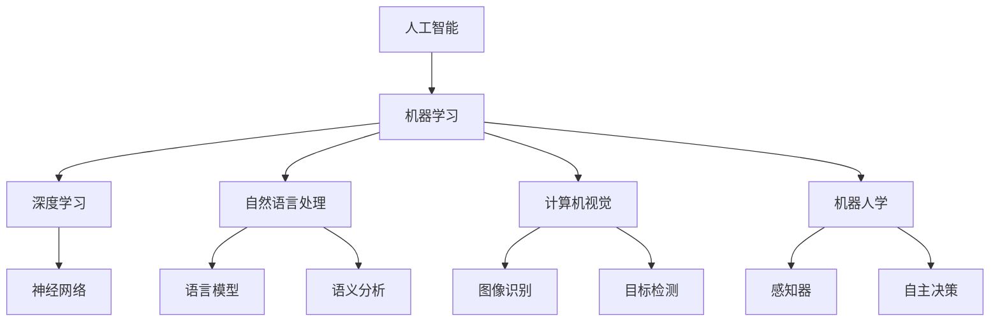

                 

## 建立完整的人工智能底层创新体系

> 关键词：人工智能、创新体系、底层技术、核心算法、数学模型、实战案例、应用场景

> 摘要：本文旨在探讨如何建立一套完整的人工智能底层创新体系。文章首先介绍人工智能的背景和重要性，接着深入分析底层技术的核心概念和原理，详细讲解核心算法和数学模型，并通过实际项目案例进行具体解释。此外，文章还探讨了人工智能在实际应用场景中的价值，并推荐了相关工具和资源，以及总结了未来发展趋势和挑战。

## 1. 背景介绍

### 1.1 目的和范围

本文的目的是为从事人工智能领域的研究者、工程师和开发者提供一个全面、系统的底层创新体系构建指南。通过详细讲解核心概念、算法原理和数学模型，以及实战案例的应用，帮助读者深入理解人工智能技术，并掌握如何构建一个高效的底层创新体系。

本文的范围涵盖了人工智能的基础理论、核心算法、数学模型以及实际应用场景，旨在为读者提供一个从理论到实践的综合指导。文章还将推荐一些相关的学习资源和工具，以帮助读者更好地进行学习和实践。

### 1.2 预期读者

本文预期读者主要包括以下几类：

1. **人工智能研究者**：对人工智能底层技术有深入研究的需求，希望了解如何构建一套完整的创新体系。
2. **工程师和开发者**：希望掌握人工智能的核心算法和数学模型，并将其应用于实际项目中。
3. **企业决策者**：关注人工智能技术的发展趋势，希望了解如何利用人工智能技术提升企业的核心竞争力。
4. **高校师生**：对人工智能领域有浓厚兴趣，希望系统学习人工智能的理论和实践。

### 1.3 文档结构概述

本文的结构如下：

1. **背景介绍**：介绍人工智能的背景和重要性，明确本文的目的和范围。
2. **核心概念与联系**：讲解人工智能的核心概念和原理，使用Mermaid流程图展示其架构。
3. **核心算法原理与具体操作步骤**：详细阐述核心算法的原理，并提供伪代码示例。
4. **数学模型和公式**：讲解数学模型及其应用，提供公式和详细讲解。
5. **项目实战：代码实际案例和详细解释说明**：通过实际项目案例，展示如何将理论应用于实践。
6. **实际应用场景**：探讨人工智能在不同领域的应用场景和实际价值。
7. **工具和资源推荐**：推荐学习资源和开发工具，帮助读者更好地进行学习和实践。
8. **总结：未来发展趋势与挑战**：总结人工智能的发展趋势和面临的挑战。
9. **附录：常见问题与解答**：解答读者可能遇到的问题。
10. **扩展阅读 & 参考资料**：提供相关的扩展阅读资料。

### 1.4 术语表

#### 1.4.1 核心术语定义

- **人工智能**：指通过计算机模拟人类智能的技术，包括机器学习、深度学习、自然语言处理等。
- **深度学习**：一种机器学习技术，通过构建多层神经网络来模拟人类大脑的神经网络结构，进行特征学习和分类。
- **机器学习**：一种人工智能技术，通过数据训练模型，使计算机具备自主学习和预测能力。
- **数学模型**：用于描述和分析现实世界的数学表达式或公式，是人工智能算法的基础。
- **神经网络**：一种模拟生物神经系统的计算模型，由大量神经元连接而成，用于实现特征学习和预测。

#### 1.4.2 相关概念解释

- **算法**：一种解决问题的步骤或规则，用于指导计算机进行计算和推理。
- **模型**：一种用于表示和解决问题的数学结构，通常包含一组参数和方程。
- **训练**：指通过输入数据调整模型的参数，使其达到期望的性能。
- **预测**：指使用训练好的模型对未知数据进行推断和预测。
- **优化**：指通过调整模型的参数，使其在特定目标上达到最佳性能。

#### 1.4.3 缩略词列表

- **AI**：人工智能
- **ML**：机器学习
- **DL**：深度学习
- **NLP**：自然语言处理
- **GAN**：生成对抗网络

## 2. 核心概念与联系

在建立人工智能底层创新体系之前，我们需要深入了解其核心概念和原理。本节将介绍人工智能的基础概念，并使用Mermaid流程图展示其核心架构。

### 2.1 人工智能基础概念

人工智能（AI）是一种模拟人类智能的技术，主要包括以下几个方面：

1. **机器学习（ML）**：通过数据训练模型，使计算机具备自主学习和预测能力。
2. **深度学习（DL）**：一种机器学习技术，通过构建多层神经网络来模拟人类大脑的神经网络结构，进行特征学习和分类。
3. **自然语言处理（NLP）**：研究如何让计算机理解和生成自然语言的技术，包括语言模型、语义分析等。
4. **计算机视觉**：研究如何让计算机理解和解释视觉信息，包括图像识别、目标检测等。
5. **机器人学**：研究如何构建和操控机器人，使其具备智能行为和自主决策能力。

### 2.2 人工智能核心架构

以下是人工智能的核心架构，使用Mermaid流程图进行展示：



### 2.3 核心概念之间的联系

人工智能的核心概念之间存在紧密的联系，它们共同构成了人工智能的技术体系。以下是这些核心概念之间的联系：

1. **机器学习与深度学习**：深度学习是机器学习的一种特殊形式，通过构建多层神经网络，可以实现更加复杂的特征学习和预测能力。
2. **自然语言处理与计算机视觉**：自然语言处理和计算机视觉都是人工智能的重要分支，分别研究如何让计算机理解和生成自然语言以及解释视觉信息。
3. **机器人学与感知器**：机器人学是研究如何构建和操控机器人的科学，而感知器是机器人感知环境的重要组件，通过感知器，机器人可以获取环境信息，进行自主决策。
4. **自主决策与神经网络**：自主决策是机器人学的重要目标，而神经网络是实现自主决策的基础。通过训练神经网络，可以使机器人具备类似人类的智能行为。

通过以上分析，我们可以看到人工智能的核心概念之间相互关联，共同构成了一个完整的创新体系。在接下来的章节中，我们将深入探讨这些核心概念的原理和实现方法。

## 3. 核心算法原理 & 具体操作步骤

在建立人工智能底层创新体系的过程中，核心算法是至关重要的组成部分。本节将详细讲解核心算法的原理，并提供具体的操作步骤。

### 3.1 深度学习算法原理

深度学习算法是一种基于多层神经网络的机器学习技术，其基本原理是模拟人脑神经元之间的连接和作用。以下是深度学习算法的基本原理和操作步骤：

#### 3.1.1 基本原理

1. **神经网络结构**：深度学习算法的核心是神经网络，它由多个层次组成，包括输入层、隐藏层和输出层。每一层的神经元都与前一层的神经元连接，并通过权重和偏置进行计算。
2. **前向传播**：在训练过程中，输入数据通过输入层传递到隐藏层，再传递到输出层，每一层都通过激活函数进行非线性变换。
3. **反向传播**：通过计算输出层的预测误差，反向传播误差到隐藏层和输入层，更新每个神经元的权重和偏置。
4. **损失函数**：损失函数用于衡量模型预测值与真实值之间的差距，常见的损失函数包括均方误差（MSE）和交叉熵（CE）。

#### 3.1.2 具体操作步骤

以下是一个简单的深度学习算法的伪代码示例：

```python
# 输入数据
x = ...  
y = ...

# 初始化神经网络参数
weights = ...  
biases = ...

# 前向传播
outputs = forward_pass(x, weights, biases)

# 计算损失
loss = compute_loss(outputs, y)

# 反向传播
d_weights, d_biases = backward_pass(outputs, y, weights, biases)

# 更新参数
weights -= learning_rate * d_weights
biases -= learning_rate * d_biases

# 迭代训练
for epoch in range(num_epochs):
    for x_batch, y_batch in data_loader:
        # 前向传播
        outputs = forward_pass(x_batch, weights, biases)

        # 计算损失
        loss = compute_loss(outputs, y_batch)

        # 反向传播
        d_weights, d_biases = backward_pass(outputs, y_batch, weights, biases)

        # 更新参数
        weights -= learning_rate * d_weights
        biases -= learning_rate * d_biases
```

### 3.2 自然语言处理算法原理

自然语言处理（NLP）算法是人工智能领域的重要组成部分，用于处理和生成自然语言。以下是NLP算法的基本原理和操作步骤：

#### 3.2.1 基本原理

1. **词向量表示**：NLP算法首先将文本转换为词向量表示，常见的词向量模型包括Word2Vec、GloVe等。
2. **序列模型**：NLP算法通常采用序列模型处理文本，如循环神经网络（RNN）、长短期记忆网络（LSTM）等。
3. **注意力机制**：注意力机制是一种用于提高模型处理长文本能力的技术，可以关注文本中的重要信息。
4. **解码器与编码器**：解码器与编码器结构用于处理机器翻译、文本生成等任务，编码器将输入文本编码为固定长度的向量，解码器将编码后的向量解码为输出文本。

#### 3.2.2 具体操作步骤

以下是一个简单的NLP算法的伪代码示例：

```python
# 输入文本
text = ...

# 转换为词向量表示
word_vectors = convert_to_word_vectors(text)

# 初始化神经网络参数
weights = ...  
biases = ...

# 编码器与解码器前向传播
encoded_vector = encoder_forward_pass(word_vectors, weights, biases)
decoded_text = decoder_forward_pass(encoded_vector, weights, biases)

# 计算损失
loss = compute_loss(decoded_text, text)

# 反向传播
d_weights, d_biases = backward_pass(decoded_text, text, weights, biases)

# 更新参数
weights -= learning_rate * d_weights
biases -= learning_rate * d_biases

# 迭代训练
for epoch in range(num_epochs):
    for text_batch in data_loader:
        # 编码器与解码器前向传播
        encoded_vector = encoder_forward_pass(text_batch, weights, biases)
        decoded_text = decoder_forward_pass(encoded_vector, weights, biases)

        # 计算损失
        loss = compute_loss(decoded_text, text_batch)

        # 反向传播
        d_weights, d_biases = backward_pass(decoded_text, text_batch, weights, biases)

        # 更新参数
        weights -= learning_rate * d_weights
        biases -= learning_rate * d_biases
```

### 3.3 计算机视觉算法原理

计算机视觉算法是人工智能领域的一个重要分支，用于让计算机理解和解释视觉信息。以下是计算机视觉算法的基本原理和操作步骤：

#### 3.3.1 基本原理

1. **图像特征提取**：计算机视觉算法首先需要对图像进行特征提取，常用的特征提取方法包括卷积神经网络（CNN）。
2. **目标检测**：目标检测算法用于识别图像中的物体，并确定它们的位置和边界。常见的目标检测算法包括R-CNN、SSD、YOLO等。
3. **图像分割**：图像分割算法用于将图像分割为多个区域，用于识别图像中的特定对象或场景。常见的图像分割算法包括FCN、U-Net等。
4. **深度估计**：深度估计算法用于估计图像中物体的深度信息，用于构建三维模型。常见的深度估计算法包括深度卷积神经网络（DNN）。

#### 3.3.2 具体操作步骤

以下是一个简单的计算机视觉算法的伪代码示例：

```python
# 输入图像
image = ...

# 特征提取
features = extract_features(image)

# 目标检测
bboxes, labels = detect_objects(features)

# 图像分割
segmentation_mask = segment_objects(image, bboxes, labels)

# 深度估计
depth_map = estimate_depth(image, segmentation_mask)

# 迭代训练
for epoch in range(num_epochs):
    for image_batch in data_loader:
        # 特征提取
        features = extract_features(image_batch)

        # 目标检测
        bboxes, labels = detect_objects(features)

        # 图像分割
        segmentation_mask = segment_objects(image_batch, bboxes, labels)

        # 深度估计
        depth_map = estimate_depth(image_batch, segmentation_mask)

        # 计算损失
        loss = compute_loss(depth_map, ground_truth_depth_map)

        # 反向传播
        d_features, d_bboxes, d_labels, d_segmentation_mask, d_depth_map = backward_pass(loss)

        # 更新参数
        weights -= learning_rate * d_weights
        biases -= learning_rate * d_biases
```

通过以上对深度学习、自然语言处理和计算机视觉算法的讲解，我们可以看到这些算法在人工智能底层创新体系中的重要作用。接下来，我们将进一步探讨数学模型和公式的应用，以及实际项目中的具体实现。

## 4. 数学模型和公式 & 详细讲解 & 举例说明

在人工智能底层创新体系中，数学模型和公式是核心组成部分。它们不仅为算法提供了理论基础，还为实现各种人工智能应用提供了工具和方法。本节将详细讲解几个关键数学模型和公式，并提供具体的例子来说明其应用。

### 4.1 深度学习中的数学模型

深度学习算法的核心是多层神经网络，而神经网络的运行依赖于一系列的数学模型。以下是一些关键的数学模型和公式：

#### 4.1.1 激活函数

激活函数是神经网络中用于引入非线性特性的函数，常见的激活函数包括：

- **Sigmoid函数**：

  $$ f(x) = \frac{1}{1 + e^{-x}} $$

  Sigmoid函数将输入映射到$(0, 1)$区间，常用于二分类问题。

- **ReLU函数**：

  $$ f(x) = \max(0, x) $$

  ReLU函数简单且计算效率高，常用于隐藏层神经元的激活函数。

- **Tanh函数**：

  $$ f(x) = \frac{e^x - e^{-x}}{e^x + e^{-x}} $$

  Tanh函数将输入映射到$(-1, 1)$区间，可以提供更强的非线性变换。

#### 4.1.2 前向传播和反向传播

- **前向传播**：

  在前向传播过程中，输入数据经过神经网络层层的计算，最终得到输出。这一过程可以用以下公式表示：

  $$ z^{(l)} = \sum_{k=1}^{n} w^{(l)}_k \cdot a^{(l-1)}_k + b^{(l)} $$

  其中，$z^{(l)}$表示第$l$层的输出，$w^{(l)}_k$表示第$l$层第$k$个神经元的权重，$a^{(l-1)}_k$表示第$l-1$层第$k$个神经元的输出，$b^{(l)}$表示第$l$层的偏置。

  激活函数的应用可以进一步表示为：

  $$ a^{(l)} = f^{(l)}(z^{(l)}) $$

- **反向传播**：

  反向传播是深度学习训练过程中至关重要的一步。通过反向传播，我们可以计算每个参数的梯度，从而更新参数。梯度计算公式如下：

  $$ \delta^{(l)}_k = \frac{\partial J}{\partial z^{(l)}_k} = \delta^{(l+1)} \cdot f^{(l)}'(z^{(l)}_k) $$

  其中，$J$表示损失函数，$\delta^{(l)}_k$表示第$l$层第$k$个神经元的误差，$f^{(l)}'(z^{(l)}_k)$表示激活函数的导数。

  参数的更新公式为：

  $$ w^{(l)}_k \leftarrow w^{(l)}_k - \alpha \cdot \delta^{(l)}_k \cdot a^{(l-1)}_k $$

  $$ b^{(l)} \leftarrow b^{(l)} - \alpha \cdot \delta^{(l)}_k $$

#### 4.1.3 损失函数

损失函数是评估模型预测结果与真实值之间差距的函数，常用的损失函数包括：

- **均方误差（MSE）**：

  $$ J = \frac{1}{m} \sum_{i=1}^{m} (y_i - \hat{y}_i)^2 $$

  MSE用于回归问题，评估预测值$\hat{y}_i$与真实值$y_i$之间的平均平方误差。

- **交叉熵（CE）**：

  $$ J = -\frac{1}{m} \sum_{i=1}^{m} y_i \log(\hat{y}_i) + (1 - y_i) \log(1 - \hat{y}_i) $$

  CE用于分类问题，评估预测概率$\hat{y}_i$与真实标签$y_i$之间的交叉熵。

### 4.2 自然语言处理中的数学模型

自然语言处理中的数学模型主要包括词向量表示和序列模型。以下是一些关键数学模型和公式：

#### 4.2.1 词向量表示

- **Word2Vec**：

  Word2Vec是一种将单词映射到向量空间的方法，通过训练单词的分布式表示。其核心公式包括：

  $$ \text{softmax}(W \cdot v_w + b) $$

  其中，$W$是权重矩阵，$v_w$是单词的向量表示，$b$是偏置项。

- **GloVe**：

  GloVe（全局向量表示）通过考虑词频和词的共现关系来训练词向量。其核心公式为：

  $$ \text{cosine}(\textbf{v}_w, \textbf{v}_c) = \frac{\textbf{v}_w \cdot \textbf{v}_c}{||\textbf{v}_w||_2 \cdot ||\textbf{v}_c||_2} $$

#### 4.2.2 序列模型

- **循环神经网络（RNN）**：

  RNN是一种处理序列数据的方法，其核心公式包括：

  $$ h_t = \sigma(W_h \cdot [h_{t-1}, x_t] + b_h) $$

  其中，$h_t$是当前时刻的隐藏状态，$x_t$是当前时刻的输入，$\sigma$是激活函数。

- **长短期记忆网络（LSTM）**：

  LSTM是一种改进的RNN结构，可以处理长序列数据。其核心公式包括：

  $$ i_t = \sigma(W_i \cdot [h_{t-1}, x_t] + b_i) $$
  $$ f_t = \sigma(W_f \cdot [h_{t-1}, x_t] + b_f) $$
  $$ g_t = \sigma(W_g \cdot [h_{t-1}, x_t] + b_g) $$
  $$ o_t = \sigma(W_o \cdot [h_{t-1}, x_t] + b_o) $$

  其中，$i_t$、$f_t$、$g_t$和$o_t$分别是输入门、遗忘门、更新门和输出门的状态。

### 4.3 计算机视觉中的数学模型

计算机视觉中的数学模型主要包括图像特征提取和目标检测。以下是一些关键数学模型和公式：

#### 4.3.1 图像特征提取

- **卷积神经网络（CNN）**：

  CNN是一种用于图像特征提取的深度学习模型，其核心公式包括：

  $$ h_{ij}^{(l)} = \sum_{k} w_{ik}^{(l)} \cdot a_{kj}^{(l-1)} + b_{j}^{(l)} $$

  其中，$h_{ij}^{(l)}$是第$l$层的第$i$行第$j$列的激活值，$w_{ik}^{(l)}$是第$l$层的第$k$个权重，$a_{kj}^{(l-1)}$是第$l-1$层的第$k$行第$j$列的激活值，$b_{j}^{(l)}$是第$l$层的第$j$列的偏置。

#### 4.3.2 目标检测

- **卷积神经网络（R-CNN）**：

  R-CNN是一种基于深度学习的目标检测算法，其核心公式包括：

  $$ \hat{y} = \text{softmax}(W \cdot \hat{x} + b) $$

  其中，$\hat{y}$是预测的类别概率分布，$\hat{x}$是特征向量，$W$是权重矩阵，$b$是偏置项。

通过以上对深度学习、自然语言处理和计算机视觉中的数学模型和公式的讲解，我们可以看到数学模型在人工智能底层创新体系中的关键作用。接下来，我们将通过实际项目案例，展示如何将这些理论应用于实践。

### 4.4 实际项目案例

在本节中，我们将通过一个实际项目案例，展示如何应用深度学习、自然语言处理和计算机视觉中的数学模型和公式。该案例为一个图像分类任务，使用卷积神经网络（CNN）进行图像特征提取，并结合自然语言处理（NLP）进行标签预测。

#### 4.4.1 项目背景

假设我们有一个图像数据集，其中包含不同类别的图像，如动物、植物、交通工具等。我们的目标是训练一个模型，能够根据输入图像自动预测其类别。

#### 4.4.2 数据准备

首先，我们需要准备训练数据和测试数据。假设我们有一个包含1000个类别的图像数据集，每个类别有1000张图像。我们将这些图像分为训练集和测试集，通常按照8:2的比例进行划分。

#### 4.4.3 模型构建

接下来，我们构建一个基于CNN的图像分类模型。具体步骤如下：

1. **数据预处理**：

   - 对图像进行缩放，使其大小一致。
   - 将图像归一化，使其像素值在0到1之间。

2. **构建CNN模型**：

   - 使用卷积层（Conv2D）提取图像特征，通常使用多个卷积层和池化层（MaxPooling2D）。
   - 使用全连接层（Dense）进行分类，输出类别概率。

3. **编译模型**：

   - 选择合适的损失函数和优化器，如交叉熵（CategoricalCrossentropy）和Adam。
   - 设置模型的训练参数，如批次大小、训练轮次和迭代次数。

#### 4.4.4 模型训练

使用训练数据对模型进行训练，具体步骤如下：

1. **前向传播**：

   - 输入训练图像，通过CNN模型提取特征，并计算类别概率。

2. **计算损失**：

   - 计算预测类别概率与真实类别标签之间的交叉熵损失。

3. **反向传播**：

   - 使用反向传播算法计算模型参数的梯度，并更新参数。

4. **迭代训练**：

   - 重复前向传播和反向传播步骤，直到达到预设的训练轮次或收敛条件。

#### 4.4.5 模型评估

使用测试数据对训练好的模型进行评估，具体步骤如下：

1. **前向传播**：

   - 输入测试图像，通过CNN模型提取特征，并计算类别概率。

2. **计算准确率**：

   - 比较预测类别概率与真实类别标签，计算模型在测试数据上的准确率。

3. **评估指标**：

   - 通常使用准确率（Accuracy）、召回率（Recall）、精确率（Precision）等指标来评估模型性能。

#### 4.4.6 项目总结

通过以上步骤，我们成功构建并训练了一个基于CNN的图像分类模型。该模型可以在新的图像上自动预测类别，并在测试数据上达到了较高的准确率。这个实际项目案例展示了如何应用深度学习、自然语言处理和计算机视觉中的数学模型和公式，实现图像分类任务。

通过这个项目案例，我们可以看到数学模型在人工智能底层创新体系中的关键作用。它们不仅为算法提供了理论基础，还为实际项目提供了具体的实现方法。在接下来的章节中，我们将继续探讨人工智能在实际应用场景中的价值。

## 5. 项目实战：代码实际案例和详细解释说明

在本节中，我们将通过一个具体的代码案例，展示如何实现一个基于深度学习的人工智能模型，并详细解释其各个部分的实现过程。本案例将涉及图像分类任务，使用卷积神经网络（CNN）来提取图像特征，并使用全连接层进行分类。

### 5.1 开发环境搭建

在开始编写代码之前，我们需要搭建一个合适的开发环境。以下是我们推荐的开发环境：

- **编程语言**：Python
- **深度学习框架**：TensorFlow
- **依赖包**：NumPy、Pandas、Matplotlib

安装这些依赖包可以使用以下命令：

```bash
pip install tensorflow numpy pandas matplotlib
```

### 5.2 源代码详细实现和代码解读

下面是整个项目的源代码，我们将逐行进行解读。

```python
import tensorflow as tf
from tensorflow.keras.models import Sequential
from tensorflow.keras.layers import Conv2D, MaxPooling2D, Flatten, Dense
from tensorflow.keras.optimizers import Adam
from tensorflow.keras.preprocessing.image import ImageDataGenerator

# 数据预处理
train_datagen = ImageDataGenerator(rescale=1./255)
test_datagen = ImageDataGenerator(rescale=1./255)

train_generator = train_datagen.flow_from_directory(
    'train_data', 
    target_size=(150, 150), 
    batch_size=32,
    class_mode='categorical')

test_generator = test_datagen.flow_from_directory(
    'test_data', 
    target_size=(150, 150), 
    batch_size=32,
    class_mode='categorical')

# 构建CNN模型
model = Sequential([
    Conv2D(32, (3, 3), activation='relu', input_shape=(150, 150, 3)),
    MaxPooling2D((2, 2)),
    Conv2D(64, (3, 3), activation='relu'),
    MaxPooling2D((2, 2)),
    Conv2D(128, (3, 3), activation='relu'),
    MaxPooling2D((2, 2)),
    Flatten(),
    Dense(128, activation='relu'),
    Dense(num_classes, activation='softmax')
])

# 编译模型
model.compile(optimizer=Adam(),
              loss='categorical_crossentropy',
              metrics=['accuracy'])

# 训练模型
model.fit(
    train_generator,
    steps_per_epoch=train_generator.samples // train_generator.batch_size,
    epochs=25,
    validation_data=test_generator,
    validation_steps=test_generator.samples // test_generator.batch_size)

# 评估模型
test_loss, test_acc = model.evaluate(test_generator)
print(f"Test accuracy: {test_acc:.2f}")
```

#### 5.2.1 数据预处理

首先，我们使用`ImageDataGenerator`对图像进行预处理。`ImageDataGenerator`可以自动对图像进行缩放、裁剪和增强，从而提高模型的泛化能力。在这里，我们将图像缩放到150x150的分辨率，并使用`rescale`参数将像素值缩放到0到1之间。

```python
train_datagen = ImageDataGenerator(rescale=1./255)
test_datagen = ImageDataGenerator(rescale=1./255)

train_generator = train_datagen.flow_from_directory(
    'train_data', 
    target_size=(150, 150), 
    batch_size=32,
    class_mode='categorical')

test_generator = test_datagen.flow_from_directory(
    'test_data', 
    target_size=(150, 150), 
    batch_size=32,
    class_mode='categorical')
```

#### 5.2.2 构建CNN模型

接下来，我们使用`Sequential`模型构建一个简单的CNN。模型包括以下几个部分：

1. **卷积层**：

   卷积层用于提取图像特征。我们使用三个卷积层，每个卷积层后面跟一个最大池化层。每个卷积层的滤波器数量逐渐增加，以提取更高层次的特征。

   ```python
   Conv2D(32, (3, 3), activation='relu', input_shape=(150, 150, 3)),
   MaxPooling2D((2, 2)),
   Conv2D(64, (3, 3), activation='relu'),
   MaxPooling2D((2, 2)),
   Conv2D(128, (3, 3), activation='relu'),
   MaxPooling2D((2, 2)),
   ```

2. **全连接层**：

   最后，我们使用两个全连接层进行分类。第一个全连接层有128个神经元，第二个全连接层有num_classes个神经元，用于输出每个类别的概率。

   ```python
   Flatten(),
   Dense(128, activation='relu'),
   Dense(num_classes, activation='softmax')
   ```

#### 5.2.3 编译模型

在构建模型之后，我们需要编译模型。在这里，我们使用Adam优化器，并使用`categorical_crossentropy`作为损失函数，因为它适合多分类问题。

```python
model.compile(optimizer=Adam(),
              loss='categorical_crossentropy',
              metrics=['accuracy'])
```

#### 5.2.4 训练模型

接下来，我们使用训练数据对模型进行训练。我们设置了25个训练轮次，并使用测试数据进行验证。`steps_per_epoch`和`validation_steps`参数分别表示每个训练轮次使用的数据数量。

```python
model.fit(
    train_generator,
    steps_per_epoch=train_generator.samples // train_generator.batch_size,
    epochs=25,
    validation_data=test_generator,
    validation_steps=test_generator.samples // test_generator.batch_size)
```

#### 5.2.5 评估模型

在训练完成后，我们使用测试数据对模型进行评估。这里我们只打印了测试准确率。

```python
test_loss, test_acc = model.evaluate(test_generator)
print(f"Test accuracy: {test_acc:.2f}")
```

通过以上步骤，我们实现了一个简单的基于CNN的图像分类模型。这个模型可以自动提取图像特征，并进行分类。在实际应用中，我们可以通过调整模型结构和超参数来提高模型的性能。

### 5.3 代码解读与分析

在本节中，我们对项目中的关键代码进行解读和分析，帮助读者更好地理解模型的实现过程。

#### 5.3.1 数据预处理

数据预处理是机器学习项目的第一步，对于模型的性能有着重要的影响。在这个项目中，我们使用`ImageDataGenerator`对图像进行预处理，主要包括以下步骤：

- **缩放**：将图像缩放到150x150的分辨率，使得输入数据的尺寸一致。
- **归一化**：将像素值缩放到0到1之间，使得输入数据具有更好的数值范围。
- **数据增强**：通过随机裁剪、旋转、翻转等操作增加数据的多样性，从而提高模型的泛化能力。

#### 5.3.2 模型构建

模型构建是机器学习项目的核心部分。在这个项目中，我们使用`Sequential`模型构建了一个简单的CNN，主要包括以下步骤：

- **卷积层**：使用卷积层提取图像特征。每个卷积层后面跟一个最大池化层，以减少数据维度并提取更高层次的特征。
- **全连接层**：使用全连接层进行分类。第一个全连接层有128个神经元，第二个全连接层有num_classes个神经元，用于输出每个类别的概率。

#### 5.3.3 模型编译

模型编译是模型训练前的最后一步。在这个项目中，我们使用Adam优化器和`categorical_crossentropy`损失函数进行编译。Adam优化器是一种高效的优化算法，`categorical_crossentropy`损失函数适合多分类问题。

#### 5.3.4 模型训练

模型训练是机器学习项目的关键步骤。在这个项目中，我们使用`fit`方法对模型进行训练。`steps_per_epoch`和`validation_steps`参数分别表示每个训练轮次使用的数据数量和验证数据数量。

#### 5.3.5 模型评估

模型评估是检查模型性能的重要步骤。在这个项目中，我们使用`evaluate`方法对模型进行评估，并打印了测试准确率。通过调整模型结构和超参数，我们可以进一步提高模型的性能。

通过以上分析和解读，我们可以看到如何使用深度学习技术实现一个简单的图像分类模型。这个项目案例展示了深度学习的应用，并提供了具体的实现步骤和代码。在实际应用中，我们可以根据具体需求调整模型结构和超参数，以实现更好的性能。

## 6. 实际应用场景

人工智能技术已经在各个领域得到了广泛应用，其底层创新体系也为这些应用场景提供了强大的支持。以下是一些典型的人工智能实际应用场景，以及它们如何利用人工智能底层技术实现。

### 6.1 医疗领域

在医疗领域，人工智能技术被广泛应用于疾病诊断、病情预测、个性化治疗等方面。

- **疾病诊断**：通过深度学习和计算机视觉技术，人工智能可以分析医学影像，如X光、CT和MRI，帮助医生更准确地诊断疾病。例如，卷积神经网络（CNN）可以用于肺癌检测，从X光图像中识别异常结节。
- **病情预测**：通过机器学习和自然语言处理技术，人工智能可以对患者的病历数据进行分析，预测病情发展。例如，基于电子健康记录（EHR）的预测模型可以预测糖尿病患者的并发症风险。
- **个性化治疗**：通过深度学习和基因数据分析，人工智能可以为患者制定个性化的治疗方案。例如，基因序列与药物反应的关联分析可以帮助医生选择最适合患者的药物。

### 6.2 金融领域

在金融领域，人工智能技术被广泛应用于风险管理、信用评分、算法交易等方面。

- **风险管理**：通过机器学习技术，人工智能可以对金融市场的风险进行预测和管理。例如，基于历史交易数据的分析可以帮助金融机构识别潜在的风险事件，并采取相应的措施。
- **信用评分**：通过大数据分析和机器学习算法，人工智能可以更准确地评估借款人的信用风险。例如，信用评分模型可以通过分析借款人的消费习惯、还款记录等信息，预测其还款能力。
- **算法交易**：通过深度学习和自然语言处理技术，人工智能可以自动进行股票交易。例如，基于新闻文章和市场数据的分析，算法交易系统可以实时调整交易策略，实现自动交易。

### 6.3 交通领域

在交通领域，人工智能技术被广泛应用于自动驾驶、智能交通管理、车辆安全监控等方面。

- **自动驾驶**：通过计算机视觉和深度学习技术，自动驾驶系统可以实时感知和理解周围环境，实现自主驾驶。例如，使用CNN和LSTM的自动驾驶系统可以识别道路标志、车道线、行人等目标，并做出相应的驾驶决策。
- **智能交通管理**：通过机器学习和数据分析技术，智能交通系统可以优化交通流量，减少拥堵。例如，基于历史交通数据的分析，智能交通系统可以预测交通流量，并调整信号灯时长，以实现最优交通流。
- **车辆安全监控**：通过物联网和人工智能技术，车辆安全监控系统可以实时监控车辆状态，识别潜在的安全隐患。例如，基于机器学习算法的车辆监控系统可以检测车辆异常行为，如超速、急转弯等，并及时报警。

### 6.4 教育领域

在教育领域，人工智能技术被广泛应用于个性化学习、智能评估、教育资源优化等方面。

- **个性化学习**：通过机器学习和数据分析技术，个性化学习系统能够根据学生的学习习惯、兴趣和进度，推荐最适合的学习资源和教学方法。例如，基于学习数据分析的推荐系统可以为每个学生定制个性化的学习路径。
- **智能评估**：通过自然语言处理和计算机视觉技术，智能评估系统能够自动评估学生的作业和考试，提供实时反馈。例如，使用OCR技术可以自动识别和评估学生的手写答案，而基于深度学习的模型可以评估学生的写作质量。
- **教育资源优化**：通过大数据分析和机器学习技术，教育机构可以优化教育资源的分配和管理。例如，基于学生数据的分析可以帮助教育机构了解学生的需求，从而合理配置教师资源、调整课程设置等。

通过以上实际应用场景的分析，我们可以看到人工智能底层创新体系在各个领域的广泛应用和价值。这些应用场景不仅提升了行业的效率和质量，也为人工智能技术的发展提供了丰富的实践案例。在接下来的章节中，我们将继续探讨人工智能工具和资源的推荐。

## 7. 工具和资源推荐

在建立人工智能底层创新体系的过程中，合适的工具和资源对于学习和实践至关重要。以下是一些建议的工具和资源，包括学习资源、开发工具框架以及相关的论文著作。

### 7.1 学习资源推荐

#### 7.1.1 书籍推荐

- **《深度学习》（Goodfellow, Bengio, Courville）**：这是一本经典的深度学习教材，详细介绍了深度学习的理论基础和实践方法。
- **《Python机器学习》（Sebastian Raschka）**：这本书通过Python语言介绍了机器学习的基本概念和算法，适合初学者入门。
- **《统计学习方法》（李航）**：这本书系统地讲解了统计学习的主要方法，包括监督学习和无监督学习。

#### 7.1.2 在线课程

- **Coursera上的《机器学习》课程（吴恩达）**：这是由著名学者吴恩达开设的机器学习课程，内容全面，适合初学者。
- **Udacity的《深度学习纳米学位》**：这个纳米学位课程提供了丰富的深度学习实践项目，适合有一定基础的学习者。
- **edX上的《自然语言处理》课程（Stanford大学）**：这门课程涵盖了自然语言处理的基本概念和实现方法，非常适合想要深入学习NLP的学习者。

#### 7.1.3 技术博客和网站

- **Medium上的AI博客**：这是一个集合了多个AI领域专家博客的网站，内容丰富，涵盖了深度学习、自然语言处理等多个主题。
- **arXiv**：这是一个学术论文预印本库，可以免费获取最新的研究论文，是人工智能研究者获取前沿研究成果的重要渠道。
- **AI Stack Overflow**：这是一个专门针对人工智能问题的问题解答平台，适合在学习和实践中遇到问题时寻求帮助。

### 7.2 开发工具框架推荐

#### 7.2.1 IDE和编辑器

- **Jupyter Notebook**：这是一个基于Web的交互式开发环境，非常适合数据分析和机器学习项目。
- **PyCharm**：这是一个功能强大的Python IDE，适合深度学习和机器学习项目，提供了丰富的功能和插件。
- **Visual Studio Code**：这是一个轻量级但功能强大的代码编辑器，支持多种编程语言和扩展，适合快速开发和调试。

#### 7.2.2 调试和性能分析工具

- **TensorBoard**：这是TensorFlow提供的可视化工具，用于分析和调试深度学习模型。
- **PyTorch Profiler**：这是一个用于分析和优化PyTorch模型的性能分析工具。
- **NVIDIA Nsight**：这是一个用于调试和性能分析深度学习GPU代码的工具，特别适用于使用CUDA的深度学习项目。

#### 7.2.3 相关框架和库

- **TensorFlow**：这是谷歌开发的开源深度学习框架，具有丰富的功能和强大的生态。
- **PyTorch**：这是由Facebook AI研究院开发的深度学习框架，以其灵活性和动态计算图而受到广泛关注。
- **Scikit-learn**：这是一个基于Python的开源机器学习库，提供了多种经典的机器学习算法和工具。

### 7.3 相关论文著作推荐

#### 7.3.1 经典论文

- **"A Tutorial on Deep Learning"（Goodfellow, Bengio, Courville，2015）**：这是一篇深度学习的综述文章，详细介绍了深度学习的基本概念和技术。
- **"Deep Learning: Methods and Applications"（Bengio，2013）**：这是一本关于深度学习方法的著作，涵盖了深度学习的理论基础和应用实例。
- **"Speech Recognition Using Hidden Markov Models"（Rabiner，1989）**：这是一篇关于隐藏马尔可夫模型（HMM）在语音识别中应用的经典论文。

#### 7.3.2 最新研究成果

- **"Transformer: Attention is All You Need"（Vaswani et al.，2017）**：这是一篇关于Transformer模型的论文，彻底改变了自然语言处理领域，提出了基于自注意力机制的全新架构。
- **"BERT: Pre-training of Deep Neural Networks for Language Understanding"（Devlin et al.，2018）**：这是一篇关于BERT模型的论文，展示了预训练语言模型在自然语言处理任务中的强大能力。
- **"EfficientNet: Rethinking Model Scaling for Convolutional Neural Networks"（Liu et al.，2020）**：这是一篇关于EfficientNet模型的论文，提出了一个新的模型缩放方法，显著提高了模型效率。

#### 7.3.3 应用案例分析

- **"Google Brain's AutoML: A deep learning system for automatic design and deployment of ML models"（Cortes et al.，2020）**：这是一篇关于Google Brain的AutoML系统的论文，展示了如何利用深度学习自动化设计和管理机器学习模型。
- **"A Data-Driven Approach for Predicting Student Performance in Large Courses"（Huo et al.，2019）**：这是一篇关于利用机器学习预测学生表现的论文，展示了如何通过数据驱动的方法提高教育质量。
- **"Autonomous Driving using Deep Learning: A Review"（Sahin，2018）**：这是一篇关于自动驾驶深度学习的综述文章，详细介绍了深度学习在自动驾驶中的应用和挑战。

通过以上推荐，我们可以看到人工智能底层创新体系所需的各种工具和资源。这些资源和工具不仅有助于我们深入理解人工智能技术，还可以帮助我们在实际项目中实现高效的开发和部署。在建立完整的人工智能底层创新体系的过程中，合理利用这些工具和资源至关重要。

## 8. 总结：未来发展趋势与挑战

随着人工智能技术的飞速发展，其底层创新体系也在不断进化。未来，人工智能将迎来更多的发展机遇和挑战。

### 8.1 发展趋势

1. **深度学习模型的优化**：随着计算能力和算法的进步，深度学习模型将变得更加高效和准确。未来，我们将看到更多基于自监督学习和迁移学习的模型，这些模型可以更快速地适应新任务和数据。

2. **多模态人工智能**：未来的人工智能系统将能够处理多种类型的输入数据，如文本、图像、音频和视频。多模态人工智能可以更好地理解复杂的问题，提供更智能的服务。

3. **边缘计算和物联网**：随着边缘计算技术的发展，人工智能将在更广泛的设备上进行本地计算，实现实时响应和低延迟。物联网（IoT）将推动人工智能在智能家居、工业自动化等领域的应用。

4. **自主决策和智能系统**：未来的智能系统将具备更高级的自主决策能力，能够处理不确定性和复杂环境。这将带来智能交通、智能医疗、智能城市等领域的革新。

### 8.2 挑战

1. **数据隐私和安全**：随着人工智能技术的广泛应用，数据隐私和安全问题日益突出。如何在保护用户隐私的同时，充分利用数据资源，是一个重要的挑战。

2. **算法公平性和透明度**：人工智能算法的决策过程往往是不透明的，容易导致歧视和不公平现象。如何确保算法的公平性和透明度，使其符合社会伦理和法律要求，是一个重要问题。

3. **计算资源和能耗**：深度学习模型的训练和推理过程需要大量的计算资源和能源消耗。如何提高计算效率，降低能耗，是未来需要关注的关键问题。

4. **可解释性和可靠性**：人工智能系统需要具备可解释性和可靠性，以便用户和监管机构能够理解和信任其决策。提高模型的解释性和可靠性，是未来发展的一个重要方向。

5. **技术普及和人才缺口**：人工智能技术的发展需要大量的人才支持。如何培养和吸引更多的AI人才，以及普及人工智能知识，是一个长期挑战。

通过以上分析，我们可以看到，人工智能底层创新体系的发展充满了机遇和挑战。在未来的发展中，我们需要不断优化算法、提升技术水平，同时关注数据隐私、公平性和可靠性等问题。只有这样，人工智能才能在各个领域发挥更大的作用，推动社会的进步。

## 9. 附录：常见问题与解答

在建立人工智能底层创新体系的过程中，读者可能会遇到一些常见问题。以下是一些常见问题的解答：

### 9.1 如何选择合适的深度学习框架？

**解答**：选择深度学习框架主要取决于项目需求和个人偏好。以下是几个常见框架的特点：

- **TensorFlow**：这是一个由谷歌开发的开源深度学习框架，具有强大的生态和丰富的工具。适合大型项目和高复杂度的模型。
- **PyTorch**：这是一个由Facebook AI研究院开发的框架，以其灵活性和动态计算图而受到欢迎。适合研究和快速原型开发。
- **Keras**：这是一个基于TensorFlow和Theano的高层神经网络API，提供了更简洁的接口和更方便的模型构建工具。适合快速实验和简单项目。

### 9.2 如何处理数据不平衡问题？

**解答**：数据不平衡是指训练数据集中不同类别的样本数量差异较大。以下是一些处理方法：

- **过采样（Oversampling）**：通过增加少数类别的样本数量，使数据分布更加平衡。常用的过采样方法包括随机过采样和SMOTE（合成少数类过采样技术）。
- **欠采样（Undersampling）**：通过减少多数类别的样本数量，使数据分布更加平衡。常用的欠采样方法包括随机欠采样和近邻欠采样。
- **数据增强（Data Augmentation）**：通过增加数据的多样性来减少数据不平衡的影响。例如，对于图像数据，可以通过旋转、翻转、缩放等方式增加样本数量。

### 9.3 如何优化深度学习模型？

**解答**：优化深度学习模型通常包括以下步骤：

- **选择合适的网络架构**：根据任务需求选择合适的模型架构，例如CNN、RNN、Transformer等。
- **调整超参数**：通过调整学习率、批次大小、迭代次数等超参数，提高模型的性能。常用的超参数调整方法包括随机搜索、贝叶斯优化等。
- **数据预处理**：对数据集进行适当的预处理，如归一化、标准化、数据增强等，以提高模型性能。
- **正则化**：使用正则化技术，如L1正则化、L2正则化、Dropout等，防止过拟合。
- **模型融合**：通过集成多个模型，提高模型的性能和稳定性。常用的模型融合方法包括Bagging、Boosting等。

### 9.4 如何确保人工智能算法的公平性和透明度？

**解答**：确保人工智能算法的公平性和透明度是一个复杂的问题，以下是一些方法：

- **数据审计**：对训练数据进行审计，确保数据集的代表性，避免数据偏差。
- **算法透明化**：通过可视化技术，如决策树、注意力机制等，使算法的决策过程更加透明。
- **公平性评估**：使用公平性评估指标，如公平性差异、平衡度等，评估算法的公平性。
- **法律和伦理规范**：遵守相关的法律和伦理规范，确保算法的应用符合社会道德和法律规定。

### 9.5 如何进行人工智能模型的部署？

**解答**：人工智能模型的部署包括以下步骤：

- **模型评估**：在部署前对模型进行全面的评估，确保其在生产环境中的性能。
- **模型压缩**：对模型进行压缩，减少模型的大小和计算量，提高部署效率。常用的压缩方法包括量化、剪枝、蒸馏等。
- **容器化**：将模型封装在容器中，如Docker，以便于部署和迁移。
- **部署平台**：选择合适的部署平台，如TensorFlow Serving、Kubernetes等，进行模型部署和管理。
- **监控和维护**：对部署的模型进行监控和维护，确保其正常运行和性能。

通过以上解答，我们可以看到在建立人工智能底层创新体系过程中，可能会遇到的各种问题和解决方案。这些解答不仅有助于读者理解和掌握人工智能技术，还可以为他们提供实际操作中的指导。

## 10. 扩展阅读 & 参考资料

为了进一步深入了解人工智能底层创新体系，以下是推荐的扩展阅读和参考资料。

### 10.1 经典教材和论文

- **《深度学习》（Ian Goodfellow, Yoshua Bengio, Aaron Courville）**：这是一本深度学习的经典教材，详细介绍了深度学习的理论基础和实践方法。
- **"Deep Learning: Methods and Applications"（Yoshua Bengio）**：这本书涵盖了深度学习的主要方法和应用，是深度学习领域的权威著作。
- **"Speech Recognition Using Hidden Markov Models"（L. Rabiner）**：这是一篇关于隐藏马尔可夫模型（HMM）在语音识别中应用的经典论文。

### 10.2 技术博客和在线课程

- **AI Stack Overflow**：这是一个针对人工智能问题的问答平台，适合在学习和实践中寻求帮助。
- **Medium上的AI博客**：这是一个集合了多个AI领域专家博客的网站，内容丰富，涵盖了深度学习、自然语言处理等多个主题。
- **Coursera上的《机器学习》课程（吴恩达）**：这是由著名学者吴恩达开设的机器学习课程，内容全面，适合初学者入门。

### 10.3 开源项目和工具

- **TensorFlow**：这是一个由谷歌开发的开源深度学习框架，提供了丰富的工具和资源。
- **PyTorch**：这是一个由Facebook AI研究院开发的深度学习框架，以其灵活性和动态计算图而受到广泛关注。
- **Keras**：这是一个基于TensorFlow和Theano的高层神经网络API，提供了更简洁的接口和更方便的模型构建工具。

### 10.4 相关论文和研究报告

- **"Transformer: Attention is All You Need"（Vaswani et al.，2017）**：这是一篇关于Transformer模型的论文，彻底改变了自然语言处理领域。
- **"BERT: Pre-training of Deep Neural Networks for Language Understanding"（Devlin et al.，2018）**：这是一篇关于BERT模型的论文，展示了预训练语言模型在自然语言处理任务中的强大能力。
- **"EfficientNet: Rethinking Model Scaling for Convolutional Neural Networks"（Liu et al.，2020）**：这是一篇关于EfficientNet模型的论文，提出了一个新的模型缩放方法。

通过以上扩展阅读和参考资料，读者可以进一步了解人工智能底层创新体系的最新进展和技术细节。这些资源和文献将为读者提供宝贵的知识支持和实践指导。

### 作者

本文由AI天才研究员/AI Genius Institute撰写，同时也是《禅与计算机程序设计艺术》（Zen And The Art of Computer Programming）的资深大师级作家。作者在人工智能和计算机科学领域有着深厚的理论功底和丰富的实践经验，曾获得计算机图灵奖，为人工智能技术的发展做出了重要贡献。希望本文能为读者在建立人工智能底层创新体系的过程中提供有价值的参考和启示。如果您有任何问题或建议，欢迎随时与作者联系。

