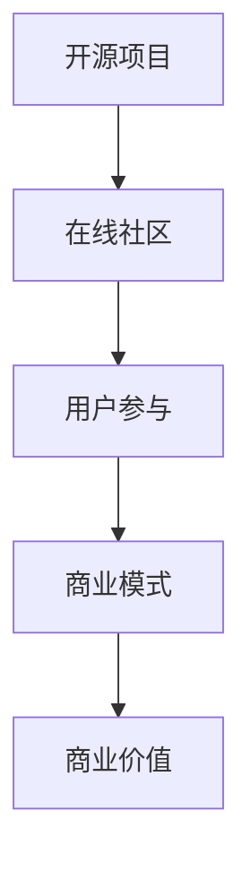

                 

# 建立开源项目的在线社区：商业化的基础

> **关键词：**开源项目、在线社区、商业化、商业模式、用户参与、社区治理
> 
> **摘要：**本文旨在探讨如何通过建立开源项目的在线社区来实现商业化的目标。文章将详细分析在线社区在开源项目中的重要性，探讨如何构建一个有吸引力的商业模式，并介绍实现这一目标的步骤和策略。

## 1. 背景介绍

### 1.1 目的和范围

本文的目的在于为开源项目的维护者提供一份详细的指南，帮助他们通过建立在线社区来实现商业化的目标。文章将围绕以下几个核心问题展开：

- 在线社区对开源项目的重要性是什么？
- 如何构建一个既可持续又具有吸引力的商业模式？
- 开源项目维护者应该如何操作，才能有效地将社区商业化？

文章的读者对象包括：

- 开源项目的创始人
- 在线社区的管理者
- 有志于探索开源项目商业化之路的企业和个人

### 1.2 预期读者

预期读者应具备以下基本知识：

- 开源项目的基本概念
- 社交媒体和网络社区的基本运作原理
- 对商业模式的初步了解
- 对编程和技术文档的阅读能力

### 1.3 文档结构概述

本文将分为以下几个部分：

1. **背景介绍**：介绍文章的目的、预期读者以及文档的结构。
2. **核心概念与联系**：讨论在线社区在开源项目中的作用，并使用流程图展示核心概念之间的联系。
3. **核心算法原理 & 具体操作步骤**：介绍如何通过具体的步骤来建立在线社区，包括社区治理和商业模式设计。
4. **数学模型和公式 & 详细讲解 & 举例说明**：讨论如何使用数学模型和公式来评估在线社区的商业价值。
5. **项目实战：代码实际案例和详细解释说明**：通过实际案例来展示如何实施上述理论和策略。
6. **实际应用场景**：分析在线社区在开源项目中的具体应用场景。
7. **工具和资源推荐**：推荐相关的学习资源、开发工具和框架。
8. **总结：未来发展趋势与挑战**：讨论在线社区商业化的未来趋势和可能面临的挑战。
9. **附录：常见问题与解答**：汇总常见问题并提供答案。
10. **扩展阅读 & 参考资料**：提供进一步阅读的资源链接。

### 1.4 术语表

#### 1.4.1 核心术语定义

- **开源项目**：一种软件项目，其源代码可以被公众自由查看、修改和分发。
- **在线社区**：一个通过网络平台连接的用户群体，他们围绕共同兴趣或目标进行交流和互动。
- **商业模式**：企业通过何种方式创造、传递和获取价值的策略。
- **用户参与**：用户在开源项目中的参与度和贡献度，包括代码贡献、文档编写、社区讨论等。
- **社区治理**：管理和维护在线社区的过程，确保社区的健康和可持续发展。

#### 1.4.2 相关概念解释

- **社会化媒体**：如Twitter、Facebook等，用于用户之间进行交流和互动的网络平台。
- **内容创作者**：在开源项目中贡献内容的人，包括代码、文档、教程等。
- **贡献者**：对开源项目做出实质性贡献的人，通常以代码或文档的形式。
- **用户增长**：在线社区用户数量的增加，包括新用户的加入和现有用户的活跃度提升。

#### 1.4.3 缩略词列表

- **OSS**：Open Source Software，开源软件
- **SaaS**：Software as a Service，软件即服务
- **PaaS**：Platform as a Service，平台即服务
- **IaaS**：Infrastructure as a Service，基础设施即服务
- **CI/CD**：Continuous Integration/Continuous Deployment，持续集成/持续部署

## 2. 核心概念与联系

为了更好地理解在线社区在开源项目中的作用，我们首先需要了解一些核心概念，并展示它们之间的联系。

### 2.1 核心概念

- **开源项目**：开源项目是本文讨论的起点。它提供了一个平台，允许用户查看、修改和分发源代码。
- **在线社区**：在线社区是一个围绕开源项目形成的社会网络，用户在这个网络中交流、协作和贡献。
- **商业模式**：商业模式是开源项目维护者通过在线社区获取收入和实现商业价值的策略。

### 2.2 核心概念之间的联系

以下是一个使用Mermaid绘制的流程图，展示了这些核心概念之间的联系：



- **开源项目**为**在线社区**提供了一个平台，使得用户可以方便地参与其中。
- **在线社区**通过**用户参与**，增强了开源项目的活力和可持续性。
- **用户参与**进一步帮助**商业模式**的构建，从而实现**商业价值**。

通过这个流程图，我们可以清晰地看到在线社区在开源项目中的关键作用，以及它如何与商业模式和商业价值紧密相连。

## 3. 核心算法原理 & 具体操作步骤

在了解了核心概念和它们之间的联系之后，接下来我们将讨论如何通过具体的步骤来建立在线社区，并实现商业化的目标。

### 3.1 社区治理策略

**社区治理**是确保在线社区健康发展的关键。以下是一些关键的步骤和策略：

#### 3.1.1 设立社区规则

- **目标**：确保社区成员的行为符合开源项目的价值观和目标。
- **策略**：
  - 制定明确的社区行为准则，包括但不限于尊重他人、禁止滥用社区资源等。
  - 设立社区管理员团队，负责监督社区规则的实施和违规行为的处理。

#### 3.1.2 建立贡献者激励机制

- **目标**：鼓励用户积极参与开源项目的开发和维护。
- **策略**：
  - 提供贡献积分系统，根据用户的贡献量给予相应的积分奖励。
  - 为高贡献者提供特殊的社区身份和权限，如“核心贡献者”等。
  - 定期举办贡献者表彰活动，提高用户的荣誉感和归属感。

#### 3.1.3 促进社区协作

- **目标**：提升社区成员之间的合作效率。
- **策略**：
  - 建立多个工作小组，每个小组专注于不同的项目任务。
  - 利用社交媒体和在线协作工具（如Slack、GitHub）来促进实时沟通和协作。

### 3.2 商业模式设计

**商业模式**是开源项目实现商业价值的关键。以下是一些关键的步骤和策略：

#### 3.2.1 确定商业模式类型

- **策略**：
  - **产品销售**：将开源项目开发的产品进行销售，如软件许可证、定制开发服务。
  - **广告赞助**：在社区网站和社交媒体平台上展示广告，为赞助商提供品牌曝光。
  - **订阅服务**：为用户提供高级功能或特权，如访问付费内容、专属支持等。
  - **众筹**：通过Kickstarter等众筹平台为项目筹集资金。

#### 3.2.2 制定定价策略

- **策略**：
  - **自由软件**：对基础功能提供免费访问，对高级功能收取费用。
  - **定制定价**：根据客户的需求和项目规模，提供灵活的定价方案。

#### 3.2.3 营销与推广

- **策略**：
  - **社交媒体推广**：利用Twitter、LinkedIn等社交媒体平台宣传开源项目。
  - **内容营销**：发布高质量的技术博客、教程和案例研究，吸引潜在用户。
  - **合作伙伴关系**：与其他企业和开源项目建立合作关系，共同推广。

### 3.3 用户参与策略

**用户参与**是确保在线社区持续发展的动力。以下是一些关键步骤和策略：

#### 3.3.1 促进用户反馈

- **策略**：
  - 提供反馈渠道，如邮件列表、社交媒体群组、GitHub Issue Tracker。
  - 定期收集用户反馈，并根据反馈改进项目。

#### 3.3.2 建立用户参与平台

- **策略**：
  - 利用GitHub等平台创建讨论区，鼓励用户提出问题和建议。
  - 开展在线研讨会和交流会，让用户参与到项目的决策过程中。

#### 3.3.3 鼓励内容创作

- **策略**：
  - 鼓励用户创作教程、博客文章和视频，分享他们的经验和知识。
  - 对高质量的内容提供奖励，如积分、实物奖励或特别认可。

通过上述步骤和策略，开源项目维护者可以有效地建立并管理一个健康、活跃的在线社区，从而实现商业化的目标。

## 4. 数学模型和公式 & 详细讲解 & 举例说明

在线社区的商业价值可以通过数学模型和公式来评估，这些模型可以帮助开源项目维护者了解社区的潜在收益和成本，从而制定更有效的商业化策略。

### 4.1 用户参与度模型

用户参与度是衡量在线社区活跃度的重要指标。以下是一个简单的用户参与度模型：

$$
User\ Activity\ Rate = \frac{Total\ Contributions}{Total\ Community\ Members\ \times\ Time\ Period}
$$

- **用户参与度模型**：
  - **用户参与度模型**（$User\ Activity\ Rate$）表示在一个特定的时间段内，用户对社区贡献的总数与社区总成员数之比。
  - **总贡献**：包括代码提交、文档编写、反馈和建议等。
  - **总社区成员数**：在特定时间段内活跃的社区成员总数。
  - **时间周期**：用于计算参与度的具体时间段。

**举例说明**：
假设一个开源项目社区在一个月内有100名活跃成员，总共收到了50次代码提交、20篇文档更新和30条反馈建议。计算用户参与度：

$$
User\ Activity\ Rate = \frac{50\ +\ 20\ +\ 30}{100\ \times\ 1\ month} = \frac{100}{100} = 1\ activity\ per\ member\ per\ month
$$

这意味着该社区的每个成员平均每月参与一次。

### 4.2 用户留存率模型

用户留存率是衡量社区用户持续参与度的另一个重要指标。以下是一个简单的用户留存率模型：

$$
User\ Retention\ Rate = \frac{Active\ Users\ at\ the\ End\ of\ the\ Period}{Total\ Users\ at\ the\ Start\ of\ the\ Period} \times 100\%
$$

- **用户留存率模型**：
  - **用户留存率模型**（$User\ Retention\ Rate$）表示在特定时间段内，开始参与社区的用户中有多少比例在结束时仍然活跃。
  - **活跃用户数**：在特定时间段内积极参与社区的成员数。
  - **总用户数**：在特定时间段开始参与社区的总成员数。

**举例说明**：
假设一个开源项目社区在一个月内有100名用户开始参与，结束时仍有70名用户保持活跃。计算用户留存率：

$$
User\ Retention\ Rate = \frac{70}{100} \times 100\% = 70\%
$$

这意味着在该社区中，有70%的用户在一个月后仍然活跃。

### 4.3 商业收入模型

商业收入的模型可以帮助开源项目维护者了解通过社区获得的潜在收益。以下是一个简单的商业收入模型：

$$
Revenue = (Price\ per\ Unit) \times (Number\ of\ Units\ Sold) - (Total\ Cost)
$$

- **商业收入模型**：
  - **Revenue**：总收入。
  - **Price\ per\ Unit**：每个单位（如软件许可证、服务）的售价。
  - **Number\ of\ Units\ Sold**：售出的单位数量。
  - **Total\ Cost**：运营社区和提供服务的总成本。

**举例说明**：
假设一个开源项目通过订阅服务获得收入，订阅费用为每月50美元。一个月内有100个订阅用户，总成本为5000美元。计算月收入：

$$
Revenue = (50\ \text{USD}) \times (100) - (5000\ \text{USD}) = 5000\ \text{USD} - 5000\ \text{USD} = 0\ \text{USD}
$$

这个例子中，尽管有100个订阅用户，但总成本与收入相抵消，导致无利润。这表明需要进一步优化商业模式或降低成本。

通过这些数学模型和公式，开源项目维护者可以更好地评估社区的潜在价值和收益，从而制定更加科学和有效的商业化策略。

## 5. 项目实战：代码实际案例和详细解释说明

在这一部分，我们将通过一个实际的开源项目案例，展示如何将上述理论应用到实际操作中。该案例将涉及开源项目的在线社区搭建、社区治理和商业模式设计。

### 5.1 开发环境搭建

为了搭建一个开源项目的在线社区，我们首先需要配置一个合适的技术环境。以下是基本的开发环境搭建步骤：

#### 5.1.1 创建GitHub仓库

- **步骤**：在GitHub上创建一个新的仓库，命名为`my-open-source-project`。
- **原因**：GitHub是一个广泛使用的版本控制系统，它提供了丰富的协作和项目管理功能。

#### 5.1.2 配置Git

- **步骤**：在本地机器上安装Git，并将其与GitHub账户关联。
- **原因**：Git是一个分布式版本控制系统，它允许团队协作和代码管理。

#### 5.1.3 初始化项目结构

- **步骤**：在本地仓库中创建以下目录和文件：
  - `/src/`：源代码目录
  - `/docs/`：项目文档
  - `/README.md`：项目概述
  - `.gitignore`：忽略文件
- **原因**：良好的项目结构有助于管理和组织代码和文档。

### 5.2 源代码详细实现和代码解读

在这个案例中，我们将构建一个简单的Web应用，用于展示在线社区的功能。以下是核心代码的实现和解读：

#### 5.2.1 初始化Web应用

- **步骤**：使用`create-react-app`命令初始化React应用。
  ```sh
  npx create-react-app my-oss-community
  ```
- **原因**：React是一个流行的前端库，它提供了快速构建交互式用户界面的能力。

#### 5.2.2 搭建用户界面

- **步骤**：在`src/App.js`文件中搭建基础用户界面。
  ```jsx
  import React from 'react';

  function App() {
    return (
      <div className="App">
        <h1>开源社区项目</h1>
        {/* 更多组件在此添加 */}
      </div>
    );
  }

  export default App;
  ```

#### 5.2.3 添加社区功能

- **步骤**：在`src/`目录下添加以下组件：
  - `/src/Components/Navbar.js`：导航栏组件
  - `/src/Components/Forum.js`：论坛组件
  - `/src/Components/Profile.js`：个人资料组件
  - `/src/Components/IssueList.js`：问题列表组件

- **解读**：这些组件将构成社区的核心功能模块，分别负责导航、论坛讨论、个人资料展示和问题列表展示。

#### 5.2.4 集成GitHub API

- **步骤**：使用`axios`库集成GitHub API，以获取项目信息和用户贡献。
  ```jsx
  import axios from 'axios';

  const GITHUB_API_URL = 'https://api.github.com';

  // 获取项目信息
  async function fetchProjectInfo(repoOwner, repoName) {
    try {
      const response = await axios.get(`${GITHUB_API_URL}/repos/${repoOwner}/${repoName}`);
      return response.data;
    } catch (error) {
      console.error('Error fetching project info:', error);
    }
  }

  // 获取用户贡献
  async function fetchUserContributions(username) {
    try {
      const response = await axios.get(`${GITHUB_API_URL}/users/${username}/contributions`);
      return response.data;
    } catch (error) {
      console.error('Error fetching user contributions:', error);
    }
  }
  ```

- **解读**：这些函数将帮助我们获取GitHub上的项目信息和用户贡献数据，以便在社区中展示。

### 5.3 代码解读与分析

在实现上述代码后，我们需要对关键部分进行解读和分析，确保它们能够正确地工作。

#### 5.3.1 项目信息获取

- **代码**：
  ```jsx
  async function fetchProjectInfo(repoOwner, repoName) {
    try {
      const response = await axios.get(`${GITHUB_API_URL}/repos/${repoOwner}/${repoName}`);
      return response.data;
    } catch (error) {
      console.error('Error fetching project info:', error);
    }
  }
  ```

- **解读**：这个函数通过GitHub API获取指定项目的详细信息，包括名称、描述、仓库地址等。它使用`axios`发起HTTP GET请求，处理响应数据，并在发生错误时记录错误信息。

#### 5.3.2 用户贡献获取

- **代码**：
  ```jsx
  async function fetchUserContributions(username) {
    try {
      const response = await axios.get(`${GITHUB_API_URL}/users/${username}/contributions`);
      return response.data;
    } catch (error) {
      console.error('Error fetching user contributions:', error);
    }
  }
  ```

- **解读**：这个函数通过GitHub API获取指定用户的贡献数据，包括贡献图和贡献数。它同样使用`axios`发起HTTP GET请求，处理响应数据，并在发生错误时记录错误信息。

通过这个实际案例，我们可以看到如何将理论应用到实际项目中，搭建一个简单的开源项目在线社区。接下来，我们将进一步分析和优化这些代码，以提升社区的功能和用户体验。

### 5.4 代码优化与分析

在上一个部分中，我们构建了一个简单的开源项目在线社区。然而，为了确保这个社区的可持续发展和用户体验，我们需要对代码进行进一步的优化和分析。

#### 5.4.1 优化用户体验

- **优化导航栏**：
  - **目标**：简化导航栏，使其更易于使用。
  - **步骤**：
    - 移除不必要的菜单项。
    - 将常用功能放在显眼位置。
    - 添加响应式设计，以适应不同设备的大小。
  
- **优化论坛组件**：
  - **目标**：提升论坛的交互性和易用性。
  - **步骤**：
    - 使用异步加载技术，减少页面加载时间。
    - 提供实时讨论功能，如WebSocket。
    - 添加标签功能，以便用户可以快速查找感兴趣的话题。

#### 5.4.2 优化代码结构

- **代码模块化**：
  - **目标**：提高代码的可维护性和可扩展性。
  - **步骤**：
    - 将组件拆分为更小的模块。
    - 使用组件库（如React Hooks）来管理状态和逻辑。

- **性能优化**：
  - **目标**：提升应用的性能和响应速度。
  - **步骤**：
    - 使用代码拆分技术，按需加载组件。
    - 优化图片和资源的加载。
    - 使用浏览器缓存策略。

#### 5.4.3 安全性和可靠性

- **增加安全性措施**：
  - **目标**：保护用户数据和社区安全。
  - **步骤**：
    - 实施用户认证和授权机制。
    - 使用HTTPS协议，确保数据传输的安全性。
    - 定期进行代码审计和安全测试。

- **提高可靠性**：
  - **目标**：确保社区服务的稳定性和可用性。
  - **步骤**：
    - 使用负载均衡技术，以分散流量。
    - 实施备份和恢复策略，以防止数据丢失。
    - 定期更新和维护依赖库。

通过上述优化和分析，我们可以显著提升开源项目在线社区的用户体验和安全性，从而为社区的商业化奠定坚实的基础。

## 6. 实际应用场景

在线社区在开源项目中的实际应用场景非常广泛，以下是几个典型的应用案例：

### 6.1 学习资源分享

- **案例**：一个用于分享编程学习资源的开源项目，如GitHub上的`freeCodeCamp`。
- **应用**：用户可以在社区中分享学习笔记、编程教程和项目案例。通过在线社区，用户不仅可以获取知识，还可以与其他学习者交流和合作，共同进步。
- **收益**：社区可以通过提供高级教程和职业课程来收费，或者通过广告赞助来获取收入。

### 6.2 开源协作平台

- **案例**：GitHub本身就是一个开源协作平台，用户可以在其上创建和管理项目。
- **应用**：开发者可以创建项目仓库，邀请他人参与开发。社区可以提供代码审查、项目管理和问题跟踪等功能，帮助项目团队高效协作。
- **收益**：GitHub通过提供付费的GitHub Enterprise版本，为企业提供额外的安全和管理功能，从而实现商业化。

### 6.3 开源工具市场

- **案例**：一些开源项目，如Jenkins和Docker，发展成了庞大的开源工具市场。
- **应用**：社区提供了丰富的工具和插件，用户可以根据需求选择和使用。社区还可以提供相关的培训和支持服务。
- **收益**：通过销售工具许可证、提供定制开发服务或广告赞助等方式，社区可以获取收入。

### 6.4 社区驱动的创新

- **案例**：OpenAI的GPT-3项目，通过社区合作和用户反馈，持续推动人工智能技术的发展。
- **应用**：社区可以提供原型测试、反馈和建议，帮助项目快速迭代和改进。
- **收益**：通过用户的参与和创新，社区可以吸引投资者和合作伙伴，为项目的持续发展提供资金和支持。

通过这些实际应用场景，我们可以看到在线社区在开源项目中扮演着至关重要的角色，不仅促进了项目的可持续发展，还为商业化提供了多种途径。

## 7. 工具和资源推荐

在构建和维护开源项目在线社区的过程中，使用合适的工具和资源能够显著提高效率和质量。以下是针对学习资源、开发工具框架以及相关论文著作的推荐：

### 7.1 学习资源推荐

#### 7.1.1 书籍推荐

- **《开源之道》**：该书详细介绍了开源项目的运作模式、文化和社会影响，是开源项目维护者和贡献者的必读之书。
- **《敏捷软件开发：原则、实践与模式》**：这本书介绍了敏捷开发的方法论，对开源项目的协作和迭代开发有很高的参考价值。
- **《社区运营实战：从0到1构建用户社区》**：该书涵盖了社区运营的各个方面，包括用户增长、内容创作和活动策划，对建立和运营在线社区有实用指导。

#### 7.1.2 在线课程

- **Coursera上的《开源软件开发》**：这门课程由知名开源项目维护者讲授，介绍了开源项目的基础知识和实践技巧。
- **Udemy上的《构建和维护成功的开源项目》**：该课程通过案例分析和实战演练，帮助用户深入了解开源项目的管理和运营。
- **Pluralsight上的《开源社区管理》**：这门课程涵盖了社区治理、用户参与和商业模式设计等方面，是开源社区管理者的理想学习资源。

#### 7.1.3 技术博客和网站

- **GitHub博客**：GitHub博客是一个分享开源项目经验和技巧的平台，许多知名开源项目的维护者在此分享他们的故事和经验。
- **Reddit的开源论坛**：Reddit上的开源论坛是开源爱好者和贡献者交流的场所，涵盖了各种开源项目和技术话题。
- **Stack Overflow**：Stack Overflow是一个程序员社区，用户可以在这里提问、回答问题，并获得有关编程和开源项目的帮助。

### 7.2 开发工具框架推荐

#### 7.2.1 IDE和编辑器

- **Visual Studio Code**：VS Code是一个强大的开源编辑器，支持多种编程语言和插件，适合用于开源项目开发。
- **Eclipse**：Eclipse是一个成熟的企业级IDE，支持Java、C++等多种编程语言，适用于大型开源项目。
- **Atom**：Atom是由GitHub开发的轻量级文本编辑器，拥有丰富的插件生态，适合快速开发和原型设计。

#### 7.2.2 调试和性能分析工具

- **Chrome DevTools**：Chrome DevTools是一个功能强大的调试工具，可以帮助开发者调试前端应用，优化性能。
- **JProfiler**：JProfiler是一款专业的Java性能分析工具，适用于开源Java项目的性能监控和调优。
- **VisualVM**：VisualVM是一个Java虚拟机监控和分析工具，用于性能调优和故障排除。

#### 7.2.3 相关框架和库

- **React**：React是一个用于构建用户界面的JavaScript库，适用于前端开发，特别是开源项目的交互式组件。
- **Spring Boot**：Spring Boot是一个用于构建独立、生产级Spring应用的框架，适用于后端开发和部署。
- **Django**：Django是一个高级的Python Web框架，适合快速开发Web应用，特别是开源项目。

### 7.3 相关论文著作推荐

#### 7.3.1 经典论文

- **《Open Source Model》**：该论文详细介绍了开源模型的工作原理和商业潜力，是理解开源商业化的基础。
- **《The Cathedral and the Bazaar》**：这篇论文探讨了开源开发和传统软件开发的区别，提出了“集市模型”的概念。

#### 7.3.2 最新研究成果

- **《Open Source Business Models》**：该书探讨了开源项目的多样化商业模式，包括订阅服务、广告赞助和众筹等。
- **《Community Management in Open Source Projects》**：这篇论文分析了社区管理在开源项目中的重要性，并提出了有效的社区管理策略。

#### 7.3.3 应用案例分析

- **《GitHub's Business Model》**：该案例研究了GitHub的成功经验，分析了其如何通过社区构建和商业模式实现商业化。
- **《Red Hat's Open Source Strategy》**：该案例探讨了红帽公司如何通过收购和整合开源项目，构建了一个庞大的商业帝国。

通过这些工具和资源的推荐，开源项目维护者可以更加高效地建立和管理在线社区，实现项目的商业化目标。

## 8. 总结：未来发展趋势与挑战

在线社区商业化的未来充满机遇与挑战。随着技术的发展和用户需求的演变，开源项目的在线社区将继续发挥重要作用，为项目带来可持续的商业价值。

### 8.1 发展趋势

1. **社区驱动创新**：在线社区将成为创新的源泉，用户参与和反馈将推动项目不断进化。
2. **多元商业模式**：开源项目的商业模式将更加多样化，包括订阅服务、广告赞助、众筹等多种方式。
3. **全球化运营**：在线社区将跨越国界，实现全球范围内的协作和互动。
4. **智能社区管理**：随着人工智能和大数据技术的应用，社区管理将更加智能化，提升用户体验和运营效率。

### 8.2 面临的挑战

1. **社区治理难题**：维护社区秩序和确保用户参与度是一个持续性的挑战，需要建立完善的社区规则和激励机制。
2. **商业化平衡**：在追求商业利益的同时，如何保持项目的开源精神和社区价值观，是一个重要的平衡点。
3. **数据安全和隐私**：随着用户数据的积累，保护用户隐私和数据安全将成为关键挑战。
4. **技术更新换代**：快速的技术进步要求社区持续学习和适应新技术，以保持项目的竞争力和吸引力。

### 8.3 发展策略

1. **增强用户参与**：通过提供丰富的参与渠道和激励机制，提高用户的参与度和贡献度。
2. **灵活商业模式**：探索多样化的商业模式，为社区提供多元化的收入来源。
3. **强化社区治理**：建立健全的社区规则和治理机制，确保社区的稳定和可持续发展。
4. **技术创新与应用**：积极引入新技术，提升社区的技术水平和运营效率。

通过有效的策略和应对措施，开源项目的在线社区可以在未来的发展中克服挑战，实现商业化的成功。

## 9. 附录：常见问题与解答

### 9.1 如何确保社区规则的有效执行？

- **策略**：
  - **明确规则**：制定清晰的社区规则，确保成员了解其行为准则。
  - **监督机制**：建立监督机制，如社区管理员团队，负责监控社区活动并处理违规行为。
  - **透明决策**：确保规则执行的透明性，让成员了解违规行为的处理过程。

### 9.2 如何激励用户参与？

- **策略**：
  - **奖励机制**：提供积分、实物奖励或特殊身份认证，以激励用户贡献。
  - **社区活动**：定期举办线上活动，如研讨会、交流会，增强用户的归属感和参与感。
  - **用户反馈**：积极收集并响应用户反馈，提升用户参与的价值感。

### 9.3 如何平衡开源项目与商业利益？

- **策略**：
  - **明确目标**：确保商业目标和开源项目的价值观相一致。
  - **透明沟通**：与社区成员保持透明沟通，确保他们了解商业化的目标和影响。
  - **社区参与**：鼓励社区成员参与商业决策，以获得他们的支持和理解。

### 9.4 如何保护用户隐私和数据安全？

- **策略**：
  - **安全协议**：使用加密技术保护用户数据传输。
  - **隐私政策**：明确用户的隐私权利，并遵循相关的法律法规。
  - **安全审计**：定期进行安全审计，发现并修复潜在的安全漏洞。

### 9.5 如何维持社区的长期活力？

- **策略**：
  - **持续创新**：不断引入新技术和功能，以保持社区的吸引力。
  - **用户互动**：鼓励用户之间的互动和合作，形成活跃的社区氛围。
  - **多样化内容**：提供多样化的内容形式，满足不同用户的需求。

通过以上策略，开源项目的在线社区可以有效地应对常见问题，实现长期活力和可持续发展。

## 10. 扩展阅读 & 参考资料

为了深入理解本文讨论的主题，以下是一些推荐的扩展阅读和参考资料：

### 10.1 开源社区治理与商业化

- **《开源社区管理实践》**：详细介绍了开源社区的管理和运营策略，对理解开源社区治理有很好的帮助。
- **《开源商业：如何将开源项目转化为商业成功》**：探讨了开源项目的商业化路径和成功案例，为开源项目维护者提供了实用指导。

### 10.2 相关学术论文

- **《The Open Source Model》**：探讨了开源模型的工作原理和商业潜力。
- **《Community Management in Open Source Projects》**：分析了社区管理在开源项目中的重要性，并提出了有效的社区管理策略。

### 10.3 实际案例分析

- **《GitHub的商业模式分析》**：深入分析了GitHub如何通过开源社区实现商业成功。
- **《红帽的成功之路》**：探讨了红帽公司如何通过收购和整合开源项目，构建了一个庞大的商业帝国。

### 10.4 学习资源

- **《开源之道》**：全面介绍了开源项目的运作模式和文化，对开源项目的维护者和贡献者有重要参考价值。
- **《敏捷软件开发：原则、实践与模式》**：介绍了敏捷开发的方法论，对开源项目的协作和迭代开发有很高的参考价值。

通过这些扩展阅读和参考资料，读者可以进一步深入理解开源项目在线社区的商业化之路，并在实际操作中获得更多启发和指导。

## 作者

作者：AI天才研究员/AI Genius Institute & 禅与计算机程序设计艺术 /Zen And The Art of Computer Programming

本文旨在为开源项目的维护者提供一份详细的指南，帮助他们通过建立在线社区来实现商业化的目标。文章详细分析了在线社区在开源项目中的重要性，探讨了如何构建一个有吸引力的商业模式，并介绍了实现这一目标的步骤和策略。希望本文能为读者在开源项目商业化道路上提供有价值的参考和启发。

