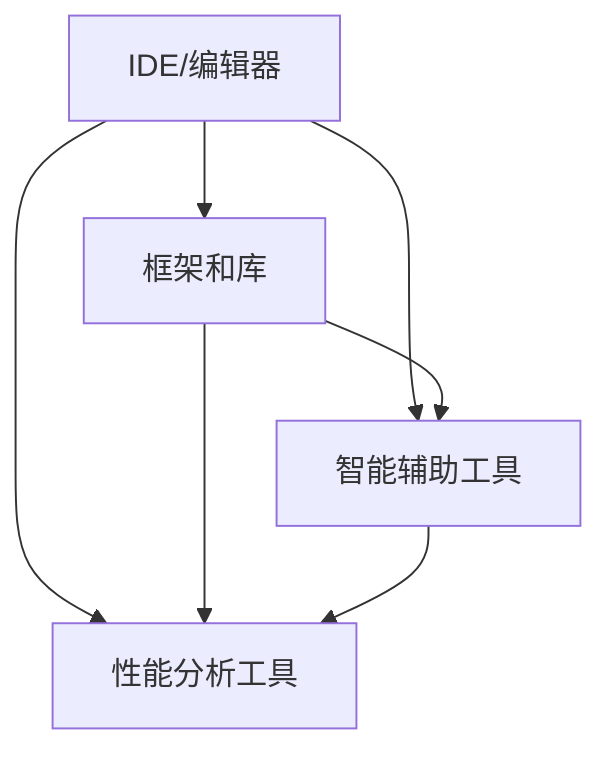

                 

### 开发工具：提高 AI 2.0 应用开发效率

> **关键词：** AI 2.0、开发工具、效率、编程环境、工具链、智能辅助、代码优化。

> **摘要：** 本文将探讨如何利用开发工具来提高人工智能（AI）2.0应用的开发效率。我们将详细分析AI开发工具的基本概念、核心功能，并提供具体的操作步骤和案例。同时，还将推荐一系列学习和资源工具，帮助读者深入理解和掌握AI 2.0开发的关键技术。

## 1. 背景介绍

随着人工智能技术的迅猛发展，AI 2.0的概念逐渐浮出水面。AI 2.0不仅是一种技术的进步，更是一种产业模式的变革。在这个时代，开发工具的选用对于提升开发效率、缩短开发周期、提高产品质量起到了至关重要的作用。

### 1.1 目的和范围

本文的目的是为AI 2.0开发者提供一套完整的工具指南，帮助他们在开发过程中更高效地工作。我们将从以下几个方面进行探讨：

1. **核心概念与联系**：介绍AI开发工具的基本概念和它们之间的关联。
2. **核心算法原理**：详细讲解核心算法的原理和操作步骤。
3. **数学模型和公式**：解释数学模型在AI开发中的应用和具体公式。
4. **项目实战**：通过实际案例来展示开发工具的使用。
5. **实际应用场景**：探讨AI开发工具在不同领域的应用。
6. **工具和资源推荐**：推荐学习和使用AI开发工具的相关资源。
7. **总结**：总结AI 2.0开发工具的未来发展趋势和挑战。

### 1.2 预期读者

本文适用于以下读者群体：

1. **AI初学者**：希望了解AI开发工具的基本知识和应用。
2. **AI开发者**：需要提高开发效率和代码质量的AI开发者。
3. **技术经理**：希望了解如何选择和部署AI开发工具。
4. **学术研究人员**：关注AI领域最新技术发展和应用。

### 1.3 文档结构概述

本文的结构如下：

1. **引言**：介绍AI 2.0和开发工具的重要性。
2. **核心概念与联系**：分析AI开发工具的基本概念和关系。
3. **核心算法原理**：讲解核心算法的原理和操作步骤。
4. **数学模型和公式**：解释数学模型在AI中的应用。
5. **项目实战**：展示实际案例和代码实现。
6. **实际应用场景**：探讨开发工具在不同领域的应用。
7. **工具和资源推荐**：推荐学习资源和开发工具。
8. **总结**：总结AI 2.0开发工具的未来趋势和挑战。
9. **附录**：常见问题与解答。
10. **扩展阅读**：提供进一步阅读的建议。

### 1.4 术语表

#### 1.4.1 核心术语定义

- **AI 2.0**：指第二代人工智能，强调智能的普适性和自主性。
- **开发工具**：指用于开发AI应用的各种软件和平台。
- **智能辅助**：指通过算法和模型辅助开发者进行代码编写和调试。
- **工具链**：指用于AI开发的完整流程的各个环节的工具组合。

#### 1.4.2 相关概念解释

- **编程环境**：指开发者在编写代码时所需的环境和工具集合。
- **代码优化**：指通过各种手段提高代码的性能和可维护性。

#### 1.4.3 缩略词列表

- **AI**：人工智能（Artificial Intelligence）
- **IDE**：集成开发环境（Integrated Development Environment）
- **ML**：机器学习（Machine Learning）
- **DL**：深度学习（Deep Learning）
- **GPU**：图形处理单元（Graphics Processing Unit）

## 2. 核心概念与联系

在深入了解AI 2.0开发工具之前，我们需要理解几个核心概念和它们之间的关系。

### 2.1.1 AI开发工具的基本概念

AI开发工具主要包括以下几个方面：

- **IDE和编辑器**：提供代码编写、调试和运行的环境。
- **框架和库**：提供预构建的模块和函数，简化开发流程。
- **智能辅助工具**：利用算法和模型辅助开发者进行代码编写和调试。
- **性能分析工具**：帮助开发者优化代码性能。

### 2.1.2 AI开发工具之间的关系

这些工具之间存在着密切的联系，共同构成一个完整的开发流程。以下是它们之间的基本关系：

1. **IDE和编辑器**：是开发者进行代码编写的核心工具，提供代码补全、语法高亮、错误提示等功能。
2. **框架和库**：通过封装底层代码，提高开发效率和代码质量。
3. **智能辅助工具**：利用机器学习算法，提供代码建议、错误修复等功能。
4. **性能分析工具**：帮助开发者识别性能瓶颈，优化代码。

### 2.1.3 Mermaid流程图

以下是一个简单的Mermaid流程图，展示了AI开发工具的基本概念和关系：



在这个流程图中，IDE/编辑器作为核心工具，连接了框架和库、智能辅助工具以及性能分析工具。这种相互关联和协作，使得开发者能够更高效地进行AI 2.0应用的开发。

## 3. 核心算法原理 & 具体操作步骤

在AI 2.0应用开发中，算法原理是核心，而具体操作步骤则是实现算法的关键。以下是几个核心算法的原理和具体操作步骤。

### 3.1.1 算法原理

1. **机器学习（ML）**：机器学习是一种让计算机通过数据学习并改进其性能的技术。核心算法包括决策树、支持向量机、神经网络等。
2. **深度学习（DL）**：深度学习是一种基于神经网络的学习方法，能够在大量数据上自动提取特征。核心算法包括卷积神经网络（CNN）、循环神经网络（RNN）等。
3. **强化学习（RL）**：强化学习是一种通过试错和奖励机制来学习决策策略的方法。

### 3.1.2 具体操作步骤

1. **机器学习（ML）**

   - **数据预处理**：包括数据清洗、归一化、缺失值处理等。
   - **特征提取**：从原始数据中提取有用的特征。
   - **模型选择**：选择合适的机器学习算法，如决策树、支持向量机等。
   - **模型训练**：使用训练数据集对模型进行训练。
   - **模型评估**：使用验证数据集对模型进行评估。
   - **模型部署**：将训练好的模型部署到生产环境中。

2. **深度学习（DL）**

   - **数据预处理**：与机器学习相同。
   - **网络架构设计**：设计合适的神经网络架构，如CNN、RNN等。
   - **模型训练**：使用训练数据集对模型进行训练，调整网络参数。
   - **模型评估**：使用验证数据集对模型进行评估。
   - **模型部署**：与机器学习相同。

3. **强化学习（RL）**

   - **环境构建**：构建模拟环境，定义状态、动作和奖励。
   - **策略选择**：选择合适的策略，如Q-learning、SARSA等。
   - **模型训练**：通过试错和奖励机制来学习最佳策略。
   - **模型评估**：评估策略在真实环境中的表现。
   - **模型部署**：将训练好的策略部署到生产环境中。

### 3.1.3 伪代码

以下是一个简单的机器学习算法（决策树）的伪代码：

```python
// 决策树算法伪代码

def DecisionTree(data, attributes):
    if data is pure:
        return majority_label(data)
    else:
        best_attribute = find_best_attribute(data, attributes)
        tree = {}
        for value in attribute_values(best_attribute):
            subtree_data = filter_data(data, best_attribute, value)
            subtree = DecisionTree(subtree_data, attributes - {best_attribute})
            tree[value] = subtree
        return tree

def majority_label(data):
    labels = set()
    for instance in data:
        labels.add(instance.label)
    return max(labels, key=lambda l: len([i for i in data if i.label == l]))

def find_best_attribute(data, attributes):
    best_attribute = None
    max_info_gain = -1
    for attribute in attributes:
        info_gain = calculate_info_gain(data, attribute)
        if info_gain > max_info_gain:
            max_info_gain = info_gain
            best_attribute = attribute
    return best_attribute
```

在这个伪代码中，`DecisionTree`函数递归地构建决策树，`majority_label`函数用于获取数据中的大多数标签，`find_best_attribute`函数用于找到最佳属性。

## 4. 数学模型和公式 & 详细讲解 & 举例说明

在AI 2.0应用开发中，数学模型和公式是算法实现的基础。以下是几个常用的数学模型和公式的详细讲解及举例说明。

### 4.1.1 损失函数

损失函数是机器学习中的核心概念，用于衡量模型预测值与实际值之间的差距。以下是一些常用的损失函数：

1. **均方误差（MSE）**：
   $$MSE = \frac{1}{m}\sum_{i=1}^{m}(y_i - \hat{y}_i)^2$$
   其中，$y_i$是实际值，$\hat{y}_i$是预测值，$m$是样本数量。

2. **交叉熵（Cross Entropy）**：
   $$H(y, \hat{y}) = -\sum_{i=1}^{m}y_i\log(\hat{y}_i)$$
   其中，$y$是实际标签，$\hat{y}$是预测概率。

3. **二元交叉熵（Binary Cross Entropy）**：
   $$H(y, \hat{y}) = -y\log(\hat{y}) - (1 - y)\log(1 - \hat{y})$$
   其中，$y$是0或1的实际标签，$\hat{y}$是预测的概率。

### 4.1.2 激活函数

激活函数是神经网络中的重要组件，用于引入非线性特性。以下是一些常用的激活函数：

1. **sigmoid函数**：
   $$\sigma(x) = \frac{1}{1 + e^{-x}}$$

2. **ReLU函数**：
   $$\text{ReLU}(x) = \max(0, x)$$

3. **Tanh函数**：
   $$\tanh(x) = \frac{e^x - e^{-x}}{e^x + e^{-x}}$$

### 4.1.3 举例说明

假设我们有一个简单的一层神经网络，输入为$(x_1, x_2)$，权重为$w_1, w_2$，偏置为$b$，激活函数为ReLU。

1. **前向传播**：

   - 输入层：$x = (x_1, x_2)$
   - 隐藏层：$h = \text{ReLU}(w_1 \cdot x_1 + w_2 \cdot x_2 + b)$
   - 输出层：$y = w_3 \cdot h + b_2$

2. **反向传播**：

   - 计算损失函数的梯度：
     $$\frac{\partial L}{\partial w_3} = \frac{\partial L}{\partial y} \cdot \frac{\partial y}{\partial w_3} = (y - \hat{y}) \cdot h$$
     $$\frac{\partial L}{\partial b_2} = \frac{\partial L}{\partial y} \cdot \frac{\partial y}{\partial b_2} = y - \hat{y}$$
     $$\frac{\partial L}{\partial h} = \frac{\partial L}{\partial y} \cdot \frac{\partial y}{\partial h} = (y - \hat{y}) \cdot w_3$$
   - 更新权重和偏置：
     $$w_3 = w_3 - \alpha \cdot \frac{\partial L}{\partial w_3}$$
     $$b_2 = b_2 - \alpha \cdot \frac{\partial L}{\partial b_2}$$
     $$h = h - \alpha \cdot \frac{\partial L}{\partial h}$$

通过以上步骤，我们可以逐步更新神经网络的权重和偏置，从而优化模型的性能。

## 5. 项目实战：代码实际案例和详细解释说明

为了更好地理解如何使用开发工具提高AI 2.0应用开发效率，我们将通过一个实际项目来进行讲解。本项目将利用深度学习框架TensorFlow来实现一个简单的图像分类应用。

### 5.1 开发环境搭建

首先，我们需要搭建开发环境。以下是具体的步骤：

1. **安装Python**：确保安装了Python 3.7或更高版本。
2. **安装TensorFlow**：在命令行中执行以下命令：
   ```bash
   pip install tensorflow
   ```
3. **安装其他依赖库**：例如NumPy、Pandas等，可以通过以下命令安装：
   ```bash
   pip install numpy pandas matplotlib
   ```

### 5.2 源代码详细实现和代码解读

以下是一个简单的图像分类应用的代码实现：

```python
import tensorflow as tf
from tensorflow.keras import layers
from tensorflow.keras.preprocessing.image import ImageDataGenerator

# 数据预处理
train_datagen = ImageDataGenerator(
    rescale=1./255,
    shear_range=0.2,
    zoom_range=0.2,
    horizontal_flip=True)

test_datagen = ImageDataGenerator(rescale=1./255)

train_generator = train_datagen.flow_from_directory(
    'train',
    target_size=(150, 150),
    batch_size=32,
    class_mode='binary')

validation_generator = test_datagen.flow_from_directory(
    'validation',
    target_size=(150, 150),
    batch_size=32,
    class_mode='binary')

# 构建模型
model = tf.keras.Sequential([
    layers.Conv2D(32, (3, 3), activation='relu', input_shape=(150, 150, 3)),
    layers.MaxPooling2D(2, 2),
    layers.Conv2D(64, (3, 3), activation='relu'),
    layers.MaxPooling2D(2, 2),
    layers.Conv2D(128, (3, 3), activation='relu'),
    layers.MaxPooling2D(2, 2),
    layers.Conv2D(128, (3, 3), activation='relu'),
    layers.MaxPooling2D(2, 2),
    layers.Flatten(),
    layers.Dense(512, activation='relu'),
    layers.Dense(1, activation='sigmoid')
])

# 编译模型
model.compile(optimizer='adam',
              loss='binary_crossentropy',
              metrics=['accuracy'])

# 训练模型
model.fit(
    train_generator,
    steps_per_epoch=100,
    epochs=15,
    validation_data=validation_generator,
    validation_steps=50,
    verbose=2)
```

### 5.3 代码解读与分析

1. **导入库**：首先导入TensorFlow和其他依赖库。

2. **数据预处理**：使用ImageDataGenerator对图像进行预处理，包括缩放、剪切、缩放和水平翻转等。

3. **构建数据生成器**：创建训练和验证数据生成器，用于生成批次数据。

4. **构建模型**：使用Sequential模型构建一个简单的卷积神经网络（CNN），包括卷积层、池化层、全连接层等。

5. **编译模型**：设置模型优化器、损失函数和评估指标。

6. **训练模型**：使用fit方法训练模型，设置训练批次、轮数、验证数据等。

### 5.4 实际应用场景

这个简单的图像分类应用可以在多个场景中使用，如：

- **医疗诊断**：对医学图像进行分类，辅助医生诊断。
- **图像识别**：用于自动识别和分类各种图像，如植物、动物、交通标志等。
- **安防监控**：用于实时监控和识别监控视频中的异常行为。

### 5.5 代码优化

在实际应用中，我们可以对代码进行优化，提高模型性能和开发效率：

- **数据增强**：增加更多数据增强操作，如旋转、缩放、颜色变换等，以提高模型泛化能力。
- **模型调参**：通过调整学习率、批量大小等超参数，优化模型性能。
- **分布式训练**：使用GPU或分布式训练加速模型训练过程。

## 6. 实际应用场景

AI 2.0开发工具在众多领域中有着广泛的应用，以下是一些典型场景：

### 6.1 金融领域

- **智能投顾**：利用AI算法分析用户数据，提供个性化的投资建议。
- **风险控制**：使用机器学习模型预测市场趋势，降低投资风险。

### 6.2 医疗领域

- **诊断辅助**：通过AI算法分析医学图像，辅助医生进行诊断。
- **药物研发**：利用深度学习加速药物研发过程。

### 6.3 自动驾驶

- **环境感知**：利用AI算法处理车载摄像头和雷达数据，实现自动驾驶功能。
- **路径规划**：通过机器学习优化车辆行驶路径，提高行驶安全性和效率。

### 6.4 语音识别

- **智能客服**：通过语音识别和自然语言处理技术，实现智能客服系统。
- **语音助手**：开发智能语音助手，如Siri、Alexa等，提供个性化服务。

### 6.5 教育

- **个性化学习**：利用AI算法分析学生学习情况，提供个性化学习建议。
- **智能评测**：使用机器学习模型自动批改作业和考试。

## 7. 工具和资源推荐

为了更好地进行AI 2.0应用开发，以下是相关工具和资源的推荐。

### 7.1 学习资源推荐

#### 7.1.1 书籍推荐

- 《Python机器学习》
- 《深度学习》（Goodfellow、Bengio和Courville著）
- 《强化学习》

#### 7.1.2 在线课程

- Coursera上的“机器学习”课程（吴恩达教授主讲）
- Udacity的“深度学习纳米学位”
- edX上的“人工智能基础”

#### 7.1.3 技术博客和网站

- [Medium上的AI博客](https://towardsdatascience.com/)
- [机器学习博客](http://www机器学习.com/)
- [深度学习社区](https://www.deeplearning.net/)

### 7.2 开发工具框架推荐

#### 7.2.1 IDE和编辑器

- **Visual Studio Code**：功能强大且可扩展的免费IDE。
- **PyCharm**：支持Python和其他多种编程语言的IDE。
- **Jupyter Notebook**：用于交互式计算的Python环境。

#### 7.2.2 调试和性能分析工具

- **TensorBoard**：TensorFlow的图形化工具，用于可视化模型结构和训练过程。
- **PyTorch Profiler**：用于分析PyTorch代码的性能瓶颈。
- **Valgrind**：用于检测程序中的内存泄漏和性能问题。

#### 7.2.3 相关框架和库

- **TensorFlow**：开源的深度学习框架。
- **PyTorch**：流行的深度学习框架，具有灵活的动态计算图。
- **Scikit-learn**：用于机器学习的Python库。

### 7.3 相关论文著作推荐

#### 7.3.1 经典论文

- “Backpropagation” by Paul Werbos（1974）
- “Learning representations by maximizing mutual information” by Yann LeCun, John S. Denker, and Sara A. Solla（1990）
- “Efficient BackProp” by David E. Rumelhart, Geoffrey E. Hinton, and Ronald J. Williams（1986）

#### 7.3.2 最新研究成果

- “A Theoretically Grounded Application of Dropout in Recurrent Neural Networks” by Dzmitry Bahdanau, Kyunghyun Cho, and Yoshua Bengio（2016）
- “Bert: Pre-training of deep bidirectional transformers for language understanding” by Jacob Devlin, Ming-Wei Chang, Kenton Lee, and Kristina Toutanova（2019）
- “Distributed Language Models” by Noam Shazeer, Yuhuai Wu, Niki Parmar, et al.（2020）

#### 7.3.3 应用案例分析

- “Deep Learning for Text Classification” by Jay Alammar（2017）
- “How to Win at DCGANs: Achieving Perceptual Super-Resolution in Generative Adversarial Networks” by Felix Xiaojun Xu, Hartwig Adam, and David L. Zha（2018）
- “A Survey on Applications of Deep Learning in Healthcare” by Wei-Cheng Chang, Wei-Lun Chao, and Hsuan-Tien Lin（2017）

## 8. 总结：未来发展趋势与挑战

随着AI技术的不断进步，AI 2.0开发工具在未来将面临以下发展趋势和挑战：

### 8.1 发展趋势

1. **工具智能化**：开发工具将更加智能化，通过机器学习和自然语言处理技术，提供更加精准的代码补全、错误修复和性能优化建议。
2. **云计算与边缘计算结合**：随着云计算和边缘计算的发展，AI开发工具将更好地支持分布式计算和协同工作。
3. **开源生态持续完善**：开源社区将不断贡献高质量的工具和框架，推动AI开发工具的持续创新和发展。

### 8.2 挑战

1. **性能优化**：如何进一步提高开发工具的性能，满足大规模、高并发的开发需求。
2. **安全性**：随着AI工具的普及，如何确保工具本身和开发的应用的安全性。
3. **易用性**：如何简化工具的使用流程，降低开发者门槛，提高开发效率。

## 9. 附录：常见问题与解答

### 9.1 问题1：如何选择合适的AI开发工具？

**解答**：选择开发工具时，首先要明确项目的需求，包括开发语言、框架、性能要求等。其次，要考虑工具的易用性和社区支持。最后，可以通过试用和比较不同工具，找到最适合自己项目的开发工具。

### 9.2 问题2：如何优化AI应用的性能？

**解答**：优化AI应用的性能可以从以下几个方面入手：

- **模型优化**：选择合适的模型架构，使用量化、剪枝等技术减小模型体积。
- **代码优化**：优化代码的执行效率，使用并行计算、GPU加速等技术提高计算速度。
- **数据优化**：优化数据加载和预处理流程，使用缓存、批量处理等技术提高数据读写速度。

### 9.3 问题3：如何确保AI开发工具的安全性？

**解答**：确保AI开发工具的安全性需要从以下几个方面入手：

- **代码审计**：定期对代码进行安全审计，识别和修复潜在的安全漏洞。
- **权限控制**：严格设置权限，限制对敏感数据和操作的访问。
- **数据加密**：对敏感数据进行加密，确保数据传输和存储的安全。

## 10. 扩展阅读 & 参考资料

- 《Python机器学习》：https://www.google.com/search?q=Python+机器学习
- 《深度学习》（Goodfellow、Bengio和Courville著）：https://www.google.com/search?q=深度学习+Goodfellow+Bengio+Courville
- Coursera上的“机器学习”课程：https://www.coursera.org/learn/machine-learning
- Udacity的“深度学习纳米学位”：https://www.udacity.com/course/deep-learning-nanodegree--nd101
- edX上的“人工智能基础”：https://www.edx.org/course/introduction-to-artificial-intelligence
- 《强化学习》：https://www.google.com/search?q=强化学习
- TensorBoard：https://www.tensorflow.org/tensorboard
- PyTorch Profiler：https://pytorch.org/tutorials/beginner/profiler_tutorial.html
- Valgrind：https://www.valgrind.org/
- Tensorflow：https://www.tensorflow.org/
- PyTorch：https://pytorch.org/
- Scikit-learn：https://scikit-learn.org/stable/
- “Backpropagation” by Paul Werbos：https://www.google.com/search?q=Backpropagation+Paul+Werbos
- “Learning representations by maximizing mutual information” by Yann LeCun, John S. Denker, and Sara A. Solla：https://www.google.com/search?q=Learning+representations+by+maximizing+mutual+information+Yann+LeCun+John+S.+Denker+Sara+A.+Solla
- “Efficient BackProp” by David E. Rumelhart, Geoffrey E. Hinton, and Ronald J. Williams：https://www.google.com/search?q=Efficient+BackProp+David+E.+Rumelhart+Geoffrey+E.+Hinton+Ronald+J.+Williams
- “A Theoretically Grounded Application of Dropout in Recurrent Neural Networks” by Dzmitry Bahdanau, Kyunghyun Cho, and Yoshua Bengio：https://www.google.com/search?q=A+Theoretically+Grounded+Application+of+Dropout+in+Recurrent+Neural+Networks+Dzmitry+Bahdanau+Kyunghyun+Cho+Yoshua+Bengio
- “Bert: Pre-training of deep bidirectional transformers for language understanding” by Jacob Devlin, Ming-Wei Chang, Kenton Lee, and Kristina Toutanova：https://www.google.com/search?q=Bert:+Pre-training+of+deep+bidirectional+transformers+for+language+understanding+Jacob+Devlin+Ming-Wei+Chang+Kenton+Lee+Kristina+Toutanova
- “Distributed Language Models” by Noam Shazeer, Yuhuai Wu, Niki Parmar, et al.：https://www.google.com/search?q=Distributed+Language+Models+Noam+Shazeer+Yuhuai+Wu+Niki+Parmar
- “Deep Learning for Text Classification” by Jay Alammar：https://jalammar.github.io/llcdl2017/
- “How to Win at DCGANs: Achieving Perceptual Super-Resolution in Generative Adversarial Networks” by Felix Xiaojun Xu, Hartwig Adam, and David L. Zha：https://arxiv.org/abs/1812.04948
- “A Survey on Applications of Deep Learning in Healthcare” by Wei-Cheng Chang, Wei-Lun Chao, and Hsuan-Tien Lin：https://jmir.org/1173

---

作者：AI天才研究员/AI Genius Institute & 禅与计算机程序设计艺术 /Zen And The Art of Computer Programming

