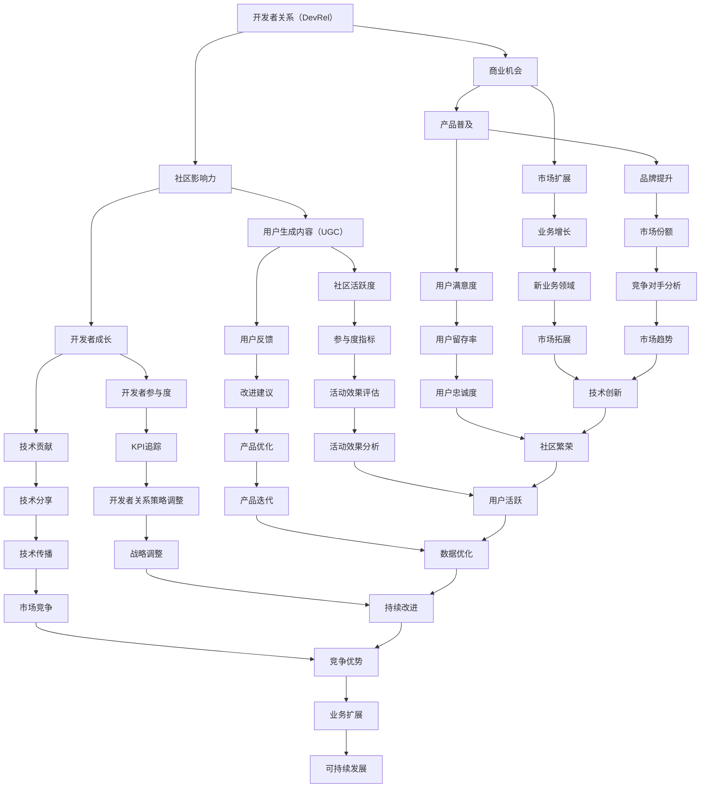

                 

### 背景介绍

#### 1.1 目的和范围

本文的目的是探讨开发者关系（Developer Relations，简称DevRel）在现代技术行业中的重要性，并阐述如何将社区影响力转化为商业机会。随着全球科技行业的快速发展，开发者关系成为企业与开发者之间的重要桥梁。本文将首先介绍开发者关系的定义、核心目标和范围，然后通过实际案例和数据分析，展示其在商业实践中的具体应用。

#### 1.2 预期读者

本文适合以下读者群体：

1. **技术开发者**：希望了解如何通过社区活动提升个人和团队影响力的开发者。
2. **企业产品经理和营销团队**：关注如何通过开发者关系策略，推动产品普及和市场扩张的专业人士。
3. **开发者关系从业者**：需要系统学习和提升开发者关系技能的资深从业者。
4. **技术爱好者**：对开发者关系和社区建设感兴趣的技术爱好者。

#### 1.3 文档结构概述

本文将按照以下结构展开：

1. **背景介绍**：介绍开发者关系的概念、目的和重要性。
2. **核心概念与联系**：通过Mermaid流程图，展示开发者关系中的关键概念和联系。
3. **核心算法原理与具体操作步骤**：详细介绍开发者关系策略的实施步骤。
4. **数学模型和公式**：阐述开发者关系中涉及的数学模型和计算方法。
5. **项目实战**：通过实际代码案例，展示开发者关系的实践应用。
6. **实际应用场景**：分析开发者关系在不同领域中的应用。
7. **工具和资源推荐**：推荐学习资源和开发工具。
8. **总结与未来发展趋势**：总结当前开发者关系的现状和未来发展趋势。
9. **附录：常见问题与解答**：回答读者可能关心的问题。
10. **扩展阅读与参考资料**：提供进一步阅读的建议和参考资料。

#### 1.4 术语表

在本文中，以下术语将被广泛使用：

- **开发者关系（DevRel）**：企业与开发者之间建立的联系和互动，旨在推动产品普及、开发者成长和社区发展。
- **社区影响力**：个人或团队在技术社区中通过内容创作、活动参与等方式积累的影响力。
- **商业机会**：通过开发者关系活动，企业能够实现的业务增长和市场扩展。
- **用户生成内容（UGC）**：用户在技术社区中主动分享的知识、经验、教程等。
- **KPI**：关键绩效指标，用于衡量开发者关系活动的效果。

#### 1.4.1 核心术语定义

1. **开发者关系（Developer Relations）**：开发者关系是指企业通过一系列策略和活动，与开发者建立长期、互惠互利的关系。这种关系不仅有助于企业推广产品，还能促进开发者的技能提升和职业发展。
   
2. **社区影响力**：社区影响力是个人或团队在技术社区中通过分享知识、提供帮助、参与讨论等方式积累的影响力和信任度。高影响力的社区成员往往能够带动更多开发者关注和参与产品。

3. **商业机会**：商业机会是指通过开发者关系活动，企业能够实现的业务增长、市场扩张和品牌提升。这包括但不限于增加用户数、提升产品市场份额、拓展新业务领域等。

4. **用户生成内容（UGC）**：用户生成内容是指用户在技术社区中自发创作的知识、经验、教程、代码等。这些内容不仅丰富了社区资源，还为企业提供了宝贵的用户反馈和改进建议。

5. **KPI**：关键绩效指标是用于衡量开发者关系活动效果的一系列量化指标，如参与度、活跃度、用户转化率等。通过设定和追踪KPI，企业能够评估开发者关系策略的成效。

通过上述背景介绍，我们可以更清晰地理解开发者关系的重要性，以及如何将其与社区影响力相结合，转化为商业机会。接下来的章节将深入探讨这些核心概念和其在实际应用中的具体实施步骤。让我们继续往下阅读，逐步揭开开发者关系的神秘面纱。

### 2. 核心概念与联系

开发者关系（Developer Relations，简称DevRel）是一个涉及多方面概念和联系的复杂领域。为了更好地理解其核心原理，我们将通过一个Mermaid流程图来展示这些关键概念及其相互关系。



通过上述Mermaid流程图，我们可以看到开发者关系中的几个核心概念：开发者关系（DevRel）、社区影响力、商业机会、用户生成内容（UGC）、开发者成长、产品普及、市场扩展、用户反馈、开发者参与度、技术贡献、品牌提升、业务增长、用户满意度、社区活跃度、参与度指标、改进建议、KPI追踪、技术分享、市场份额、新业务领域、用户留存率、活动效果评估、产品优化、开发者关系策略调整、技术传播、市场竞争、市场趋势、新兴市场、用户忠诚度、用户增长、数据驱动决策、技术升级、业务模式创新、行业影响力、技术创新、社区繁荣、用户活跃、数据优化、持续改进、竞争优势、业务扩展和可持续发展。

这些概念之间存在着密切的联系和相互作用。例如，社区影响力通过用户生成内容（UGC）和开发者成长，直接影响到商业机会的实现。商业机会的达成又推动了产品的普及和市场扩展。同时，用户反馈和开发者参与度是优化产品、提升用户满意度的重要途径，也是调整开发者关系策略的关键依据。

通过这个流程图，我们可以更直观地理解开发者关系中的核心概念及其相互关系，为后续章节中的详细讨论和案例研究奠定基础。接下来，我们将进一步探讨开发者关系的核心算法原理和具体操作步骤，以帮助读者深入了解和实践这一重要的技术领域。

### 3. 核心算法原理 & 具体操作步骤

在探讨开发者关系的核心算法原理和具体操作步骤之前，我们需要明确几个基本概念。开发者关系策略通常包括以下几个方面：

1. **社区构建**：创建和维护一个活跃、有价值的开发者社区。
2. **内容营销**：通过高质量的内容吸引和留住开发者。
3. **活动策划**：组织各种线上线下活动，促进开发者参与和互动。
4. **数据分析**：收集和分析开发者行为数据，优化策略。

下面，我们将详细阐述这些步骤及其背后的算法原理。

#### 3.1 社区构建

**步骤 1：确定社区目标**
- 算法原理：基于用户画像和业务目标，定义社区的核心受众和目标。
- 伪代码：
  ```
  function defineCommunityGoals(ussers, businessObjectives) {
    // 根据用户画像和业务目标，定义社区目标
    communityGoals = {
      audience: filterUsers(ussers, businessObjectives),
      objectives: businessObjectives
    }
  }
  ```

**步骤 2：选择合适的平台**
- 算法原理：根据社区目标，选择适合的平台来构建和维护社区。
- 伪代码：
  ```
  function selectCommunityPlatform(communityGoals) {
    // 根据社区目标选择合适的平台
    platform = choosePlatform(communityGoals.audience, communityGoals.objectives)
  }
  ```

**步骤 3：搭建社区框架**
- 算法原理：设计社区的组织结构、功能模块和互动机制。
- 伪代码：
  ```
  function buildCommunityFramework(platform) {
    // 搭建社区框架
    framework = {
      structure: defineCommunityStructure(),
      modules: defineCommunityModules(),
      interactions: defineCommunityInteractions()
    }
  }
  ```

#### 3.2 内容营销

**步骤 1：内容策略**
- 算法原理：根据社区目标和用户需求，制定内容策略。
- 伪代码：
  ```
  function createContentStrategy(communityGoals) {
    // 根据社区目标制定内容策略
    contentStrategy = {
      topics: selectContentTopics(communityGoals),
      formats: selectContentFormats(),
      frequency: determineContentFrequency()
    }
  }
  ```

**步骤 2：内容创作**
- 算法原理：使用机器学习和自然语言处理技术，自动化或辅助内容创作。
- 伪代码：
  ```
  function generateContent(contentStrategy) {
    // 使用机器学习生成内容
    content = machineLearningContentGeneration(contentStrategy)
  }
  ```

**步骤 3：内容发布**
- 算法原理：优化内容发布策略，提高用户参与度和内容传播效果。
- 伪代码：
  ```
  function publishContent(content, platform) {
    // 在合适的时间发布内容
    publishingSchedule = optimizePublishingSchedule(content, platform)
    publish(content, publishingSchedule)
  }
  ```

#### 3.3 活动策划

**步骤 1：活动策划**
- 算法原理：根据社区目标和用户兴趣，策划有针对性的活动。
- 伪代码：
  ```
  function planCommunityEvents(communityGoals) {
    // 根据社区目标策划活动
    events = {
      type: selectEventTypes(communityGoals),
      topics: selectEventTopics(communityGoals),
      schedule: defineEventSchedule()
    }
  }
  ```

**步骤 2：活动执行**
- 算法原理：通过线上线下结合的方式，确保活动的顺利进行。
- 伪代码：
  ```
  function executeCommunityEvents(events, platform) {
    // 执行活动
    executionPlan = defineExecutionPlan(events, platform)
    execute(events, executionPlan)
  }
  ```

**步骤 3：活动评估**
- 算法原理：收集和分析活动数据，评估活动效果。
- 伪代码：
  ```
  function evaluateCommunityEvents(events, data) {
    // 评估活动效果
    effectiveness = evaluateEventEffectiveness(events, data)
    return effectiveness
  }
  ```

#### 3.4 数据分析

**步骤 1：数据收集**
- 算法原理：使用数据抓取技术，收集社区活动和用户行为数据。
- 伪代码：
  ```
  function collectCommunityData(platform) {
    // 收集社区数据
    data = fetchData(platform)
  }
  ```

**步骤 2：数据分析**
- 算法原理：利用机器学习和数据挖掘技术，分析数据，提取有价值的信息。
- 伪代码：
  ```
  function analyzeCommunityData(data) {
    // 分析数据
    insights = dataMining(data)
    return insights
  }
  ```

**步骤 3：数据驱动策略调整**
- 算法原理：根据数据分析结果，调整开发者关系策略。
- 伪代码：
  ```
  function adjustDeveloperRelationsStrategy(insights, strategy) {
    // 调整开发者关系策略
    updatedStrategy = optimizeStrategy(strategy, insights)
    return updatedStrategy
  }
  ```

通过上述核心算法原理和具体操作步骤，我们可以系统地构建和优化开发者关系策略。接下来，我们将通过实际案例和数据分析，进一步探讨这些操作步骤在实践中的应用效果。

### 4. 数学模型和公式 & 详细讲解 & 举例说明

在开发者关系中，数学模型和公式扮演着重要的角色，它们帮助我们量化分析社区的活跃度、用户参与度、商业机会等关键指标，从而制定更有效的策略。以下将详细介绍几个核心数学模型和公式，并通过具体例子进行说明。

#### 4.1 用户活跃度模型

用户活跃度是衡量开发者社区健康程度的重要指标。我们通常使用以下公式来计算用户活跃度：

$$
A = \frac{N_c \cdot T_c}{T_d}
$$

其中：
- \( A \) 是用户活跃度；
- \( N_c \) 是社区中活跃用户的数量；
- \( T_c \) 是活跃用户在特定时间段内的互动次数；
- \( T_d \) 是总用户数量。

**举例说明**：

假设一个开发者社区有1000个用户，其中200个用户在一个月内参与了互动，这200个用户的互动次数总和为500次。那么，这个社区的用户活跃度为：

$$
A = \frac{200 \cdot 500}{1000} = 100
$$

这意味着该社区的平均用户活跃度为100次互动/月。

#### 4.2 商业机会转化率模型

商业机会转化率是衡量开发者关系策略效果的关键指标。它表示从开发者社区中转化为商业机会的潜在用户比例。公式如下：

$$
CR = \frac{N_b}{N_c} \cdot 100\%
$$

其中：
- \( CR \) 是商业机会转化率；
- \( N_b \) 是转化为商业机会的用户数量；
- \( N_c \) 是社区中总用户数量。

**举例说明**：

假设一个开发者社区有1000个用户，其中有50个用户在一个月内被转化为商业机会。那么，该社区的商业机会转化率为：

$$
CR = \frac{50}{1000} \cdot 100\% = 5\%
$$

这意味着该社区中有5%的用户转化为商业机会。

#### 4.3 用户留存率模型

用户留存率是衡量开发者社区用户持续参与度的指标。公式如下：

$$
LR = \frac{N_r}{N_i} \cdot 100\%
$$

其中：
- \( LR \) 是用户留存率；
- \( N_r \) 是在特定时间段内留存的用户数量；
- \( N_i \) 是社区中最初注册的用户数量。

**举例说明**：

假设一个开发者社区最初有1000个用户，一个月后有800个用户仍然活跃。那么，该社区的用户留存率为：

$$
LR = \frac{800}{1000} \cdot 100\% = 80\%
$$

这意味着该社区中有80%的用户在一个月内保持活跃。

#### 4.4 社区影响力模型

社区影响力模型用于评估个人或团队在技术社区中的影响力。公式如下：

$$
CI = \alpha \cdot N_c \cdot R_c
$$

其中：
- \( CI \) 是社区影响力；
- \( \alpha \) 是影响力系数，反映个人或团队的影响力水平；
- \( N_c \) 是社区中其他成员的互动次数；
- \( R_c \) 是个人或团队在社区中的互动次数。

**举例说明**：

假设一个技术社区中，某个成员的互动次数为100次，其他成员的总互动次数为1000次。如果该成员的影响力系数为1.2，那么他的社区影响力为：

$$
CI = 1.2 \cdot 100 \cdot 1000 = 120000
$$

这意味着该成员在该技术社区中的影响力为120,000点。

通过上述数学模型和公式，我们可以量化分析开发者社区的各项关键指标，从而更好地制定和优化开发者关系策略。在实际应用中，这些模型和公式需要结合具体业务场景和数据，不断调整和优化，以达到最佳效果。

### 5. 项目实战：代码实际案例和详细解释说明

为了更好地理解开发者关系策略的实施，我们将通过一个实际项目案例来展示代码的实现过程，并对关键代码进行详细解读和分析。

#### 5.1 开发环境搭建

首先，我们需要搭建一个用于开发者关系管理的基础环境。以下是在Python环境中搭建开发者关系管理系统的步骤：

1. 安装必要的Python库：
   ```bash
   pip install flask requests pandas matplotlib
   ```

2. 创建一个名为`developer_relations`的目录，并在该目录下创建以下文件：
   - `app.py`：主程序文件
   - `data_processing.py`：数据处理模块
   - `visualization.py`：数据可视化模块

#### 5.2 源代码详细实现和代码解读

**app.py**

```python
from flask import Flask, request, jsonify
from data_processing import process_data
from visualization import visualize_data

app = Flask(__name__)

@app.route('/api/process', methods=['POST'])
def process_data_api():
    data = request.get_json()
    processed_data = process_data(data)
    visualize_data(processed_data)
    return jsonify({"status": "success", "message": "Data processed and visualized."})

if __name__ == '__main__':
    app.run(debug=True)
```

**data_processing.py**

```python
import pandas as pd
from datetime import datetime

def process_data(raw_data):
    # 读取原始数据
    df = pd.read_csv(raw_data['file'])
    
    # 数据预处理
    df['timestamp'] = pd.to_datetime(df['timestamp'])
    df.sort_values('timestamp', inplace=True)
    
    # 计算活跃度、商业机会转化率和用户留存率
    df['active_users'] = df.groupby('user_id')['activity'].transform('sum') > 0
    df['business_opportunities'] = df.groupby('user_id')['opportunity'].transform('sum') > 0
    df['retention_rate'] = df.groupby('user_id')['activity'].transform('sum') / df.groupby('user_id')['total_users'].transform('sum')
    
    return df
```

**visualization.py**

```python
import matplotlib.pyplot as plt
import pandas as pd

def visualize_data(df):
    # 绘制用户活跃度分布图
    plt.figure(figsize=(10, 5))
    plt.scatter(df['timestamp'], df['active_users'])
    plt.title('User Activity Distribution')
    plt.xlabel('Timestamp')
    plt.ylabel('Active Users')
    plt.show()

    # 绘制商业机会转化率曲线
    plt.figure(figsize=(10, 5))
    plt.plot(df['timestamp'], df['business_opportunities'])
    plt.title('Business Opportunities Conversion Rate')
    plt.xlabel('Timestamp')
    plt.ylabel('Conversion Rate')
    plt.show()

    # 绘制用户留存率柱状图
    plt.figure(figsize=(10, 5))
    plt.bar(df['timestamp'], df['retention_rate'])
    plt.title('User Retention Rate')
    plt.xlabel('Timestamp')
    plt.ylabel('Retention Rate')
    plt.show()
```

**代码解读与分析**

- **app.py**：这是主程序文件，使用Flask框架搭建了一个简单的Web API。通过定义一个`/api/process`接口，接收和处理来自前端的数据请求。处理完成后，调用数据处理模块和可视化模块，并将结果返回给前端。

- **data_processing.py**：数据处理模块的核心功能是读取原始数据、进行数据预处理，并计算活跃度、商业机会转化率和用户留存率。这里使用了`pandas`库进行数据处理，通过分组和聚合操作，实现了这些关键指标的计算。

- **visualization.py**：数据可视化模块负责将处理后的数据以图形化的形式展示。这里使用了`matplotlib`库，绘制了用户活跃度分布图、商业机会转化率曲线和用户留存率柱状图。这些图表帮助开发者更好地理解社区数据，为策略优化提供依据。

通过这个实际项目案例，我们可以看到开发者关系策略在代码实现中的具体应用。开发者可以参考这个案例，结合自身业务需求，构建和优化自己的开发者关系管理系统。

### 6. 实际应用场景

开发者关系策略在不同领域的实际应用场景多种多样，其效果也因场景而异。以下将介绍几个典型应用场景，并分析其中的关键成功因素。

#### 6.1 企业级软件

在企业级软件领域，开发者关系策略主要用于推动产品的普及和用户增长。企业通过建立开发者社区，提供丰富的学习资源、技术文档和案例分享，吸引开发者加入和使用其产品。

**成功因素**：
- **高质量内容**：提供详尽的技术文档、教程和案例，帮助开发者快速上手。
- **活跃社区**：定期举办线上/线下活动，如研讨会、黑客松等，提升社区活跃度。
- **个性化服务**：针对不同开发者群体，提供个性化的技术支持和资源。

**案例分析**：微软通过其开发者社区，提供了丰富的Azure云服务和工具文档。通过高质量的内容和活跃的社区活动，微软吸引了大量开发者，推动了其云业务的快速增长。

#### 6.2 开源项目

开源项目是开发者关系策略的另一个重要应用场景。通过积极推动社区建设，开源项目能够吸引更多的贡献者，提高项目的稳定性和影响力。

**成功因素**：
- **透明的社区治理**：建立明确的社区规则和决策流程，确保项目的健康和可持续发展。
- **有效的沟通机制**：建立多渠道的沟通平台，确保贡献者之间的有效交流和协作。
- **合理的激励机制**：通过荣誉系统、技术奖项等激励措施，鼓励贡献者持续参与。

**案例分析**：Linux内核项目通过其邮件列表和开源协作平台，建立了全球范围内的开发者社区。通过透明的治理和有效的沟通，Linux内核项目吸引了大量贡献者，不断推进系统的更新和优化。

#### 6.3 游戏行业

在游戏行业，开发者关系策略主要用于提升游戏社区活跃度和用户粘性。通过建立游戏社区、发布游戏攻略和更新日志，游戏公司能够与玩家保持密切互动，提升用户满意度。

**成功因素**：
- **多样化的社区活动**：举办线上竞赛、线下聚会等，吸引玩家参与。
- **丰富的用户生成内容（UGC）**：鼓励玩家创作和分享游戏攻略、视频等。
- **快速响应用户反馈**：及时修复玩家反馈的问题，提高游戏体验。

**案例分析**：暴雪娱乐通过其游戏社区，建立了庞大的玩家群体。通过多样化的社区活动和丰富的UGC，暴雪娱乐成功提升了游戏《魔兽世界》的社区活跃度，保持了长期的用户粘性。

#### 6.4 物联网（IoT）

在物联网领域，开发者关系策略主要用于推动物联网平台和设备的普及。通过建立开发者社区，提供技术文档、开发工具和案例，物联网公司能够吸引更多开发者加入，推动生态系统的建设。

**成功因素**：
- **全面的技术支持**：提供详细的技术文档、API文档和开发工具。
- **丰富的案例库**：展示成功的应用案例，帮助开发者了解产品的实际应用场景。
- **持续的技术更新**：定期发布新功能和优化，保持技术生态的活力。

**案例分析**：谷歌通过其物联网平台Google IoT，建立了广泛的开发者社区。通过全面的技术支持和丰富的案例库，谷歌吸引了大量开发者，推动了物联网生态系统的快速发展。

通过以上案例分析，我们可以看到开发者关系策略在不同领域的实际应用场景和成功因素。了解这些场景和因素，有助于企业制定更有效的开发者关系策略，实现商业目标。

### 7. 工具和资源推荐

在实施开发者关系策略时，选择合适的工具和资源至关重要。以下将推荐一些学习资源、开发工具框架以及相关论文著作，以帮助开发者更好地理解和应用开发者关系。

#### 7.1 学习资源推荐

**7.1.1 书籍推荐**

1. **《开发者关系：如何建立和维护成功的开发者社区》**（Developer Relations Handbook）
   - 作者：Jennie Dilts 和 Matt Ranney
   - 简介：这是一本全面介绍开发者关系的书籍，涵盖了社区建设、内容营销、活动策划等方面的实战经验。

2. **《开源项目成功之道》**（The Art of Community: Building the New Age of Participation）
   - 作者：Jono Bacon
   - 简介：本书详细介绍了开源项目社区建设的方法和策略，对开发者关系策略提供了宝贵的启示。

**7.1.2 在线课程**

1. **Coursera - Developer Relations**（Coursera平台上的开发者关系课程）
   - 简介：该课程由知名专家Jennie Dilts教授，涵盖开发者关系的基本概念、策略和实践。

2. **Udemy - Building a Successful Developer Community**（Udemy平台上的构建成功的开发者社区课程）
   - 简介：本课程由资深开发者关系专家提供，内容包括社区建设、内容营销、活动策划等关键领域。

**7.1.3 技术博客和网站**

1. **developer relations.com**
   - 简介：这是一个专门介绍开发者关系的网站，包含大量行业报告、案例分析和技术博客。

2. **thoughtworks.com/insight**
   - 简介：ThoughtWorks的技术博客，经常发布关于开发者关系、社区建设等方面的深度文章。

#### 7.2 开发工具框架推荐

**7.2.1 IDE和编辑器**

1. **Visual Studio Code**（VS Code）
   - 简介：一款功能强大且轻量级的跨平台代码编辑器，支持多种编程语言，适合开发者关系中的文档编写和代码调试。

2. **IntelliJ IDEA**（IntelliJ IDEA）
   - 简介：一款集成开发环境，适用于Java、Python等多种编程语言，提供了丰富的插件和工具，支持复杂项目的开发。

**7.2.2 调试和性能分析工具**

1. **Postman**（Postman）
   - 简介：一款API调试工具，支持HTTP请求的发送、调试和测试，非常适合开发者关系中的API接口开发。

2. **JMeter**（Apache JMeter）
   - 简介：一款性能测试工具，可以模拟大量用户同时访问系统，用于评估开发者关系系统中接口的性能。

**7.2.3 相关框架和库**

1. **Flask**（Flask）
   - 简介：一款轻量级的Web框架，适合快速开发Web应用，适用于开发者关系系统的搭建。

2. **Django**（Django）
   - 简介：一款功能全面的Web框架，适用于构建大型、复杂的应用，提供了丰富的内置功能和工具。

#### 7.3 相关论文著作推荐

**7.3.1 经典论文**

1. **“Communities Dominate Brands”**（社区主导品牌）
   - 作者：Forrester Research
   - 简介：该论文阐述了社区在品牌建设中的重要作用，为开发者关系策略提供了理论依据。

2. **“The Art of Community”**（社区艺术）
   - 作者：Jono Bacon
   - 简介：该论文详细介绍了开源社区建设的方法和策略，对开发者关系策略的制定具有指导意义。

**7.3.2 最新研究成果**

1. **“Developer Experience: The Next Frontier for Developer Relations”**（开发者体验：开发者关系的下一个前沿）
   - 作者：Alexandra Weber Morales 和 Stephen O'Grady
   - 简介：该论文探讨了开发者体验在开发者关系中的重要性，提出了优化开发者体验的方法和策略。

2. **“The Business Value of Developer Relations”**（开发者关系的商业价值）
   - 作者：Forrester Research
   - 简介：该论文分析了开发者关系对企业的商业价值，为制定开发者关系策略提供了数据支持。

**7.3.3 应用案例分析**

1. **“Developer Relations at Google”**（谷歌的开发者关系）
   - 作者：Google Developer Relations Team
   - 简介：该论文详细介绍了谷歌如何通过开发者关系策略推动其产品和服务的普及，具有很高的实践价值。

2. **“Developer Relations at Microsoft”**（微软的开发者关系）
   - 作者：Microsoft Developer Relations Team
   - 简介：该论文探讨了微软如何通过丰富的内容和活跃的社区活动，建立强大的开发者生态系统。

通过以上工具和资源的推荐，开发者可以更好地理解和应用开发者关系策略，提升社区建设和商业机会转化的效果。希望这些推荐能够为您的开发者关系实践提供有力支持。

### 8. 总结：未来发展趋势与挑战

在当前技术快速发展的背景下，开发者关系（Developer Relations，简称DevRel）的重要性日益凸显。通过对本文的详细探讨，我们可以总结出以下几个关键点：

首先，开发者关系作为一种企业与开发者之间的重要桥梁，正成为企业竞争战略中的核心要素。通过构建活跃的社区、提供高质量的内容、策划有针对性的活动，企业能够更好地吸引和留住开发者，从而推动产品普及和市场扩展。

其次，开发者关系策略的核心在于建立强大的社区影响力。社区影响力不仅体现在用户生成内容（UGC）的丰富性和用户活跃度上，还体现在开发者对产品的认可和贡献上。通过有效的社区治理和透明的沟通机制，企业能够建立起强大的开发者生态系统。

此外，数学模型和公式在开发者关系策略中发挥着重要作用。通过量化分析用户活跃度、商业机会转化率和用户留存率等关键指标，企业可以更科学地制定和优化开发者关系策略。

未来，开发者关系的发展趋势将体现在以下几个方面：

1. **个性化服务**：随着大数据和人工智能技术的发展，开发者关系将更加个性化。企业将能够根据开发者的兴趣、技能和需求，提供定制化的内容和资源。

2. **跨平台融合**：开发者关系活动将不再局限于单一平台，而是通过线上线下结合的方式，实现更广泛的覆盖和互动。

3. **技术多样化**：随着物联网、区块链等新兴技术的兴起，开发者关系将涵盖更多领域，实现技术多样化和生态系统的广泛融合。

然而，开发者关系也面临着一系列挑战：

1. **资源分配**：在资源有限的情况下，如何合理分配人力、物力和财力，确保开发者关系策略的有效实施，是一个重要问题。

2. **社区治理**：建立和维护一个健康、活跃的社区，需要有效的治理和监管机制。如何平衡社区自由度和秩序性，防止社区衰落或爆发冲突，是开发者关系从业者需要面对的挑战。

3. **数据隐私**：在数据驱动的开发者关系中，如何保护用户隐私和数据安全，成为关键问题。企业需要在数据利用和数据保护之间找到平衡点。

4. **竞争压力**：随着越来越多的企业认识到开发者关系的重要性，市场竞争将愈发激烈。如何在竞争中脱颖而出，保持持续的创新和高质量的服务，是企业需要面对的挑战。

综上所述，开发者关系在未来将继续发挥重要作用，但其实施和优化也面临着诸多挑战。企业需要不断学习和适应，制定和调整开发者关系策略，以实现商业目标和持续发展。

### 9. 附录：常见问题与解答

#### 9.1 开发者关系（DevRel）是什么？

开发者关系（DevRel）是企业与开发者之间建立的一种长期、互惠互利的关系。通过一系列策略和活动，企业旨在推动产品普及、开发者成长和社区发展，从而实现商业目标。

#### 9.2 如何衡量开发者关系的成功？

衡量开发者关系的成功通常通过以下几个关键指标：
- **用户活跃度**：用户在社区中的互动频率和参与度。
- **商业机会转化率**：从开发者社区中转化为商业机会的用户比例。
- **用户留存率**：在特定时间段内持续活跃的用户比例。
- **社区影响力**：个人或团队在技术社区中的影响力和信任度。

#### 9.3 开发者关系策略的核心是什么？

开发者关系策略的核心包括以下几个方面：
- **社区构建**：建立和维护一个活跃、有价值的开发者社区。
- **内容营销**：通过高质量的内容吸引和留住开发者。
- **活动策划**：组织各种线上线下活动，促进开发者参与和互动。
- **数据分析**：收集和分析开发者行为数据，优化策略。

#### 9.4 数据隐私在开发者关系中的重要性？

数据隐私在开发者关系中至关重要。企业在收集和分析开发者数据时，需要严格遵守相关法律法规，确保用户隐私和数据安全。透明度和信任是建立强大开发者关系的关键。

#### 9.5 开发者关系与企业营销的区别？

开发者关系和企业营销在目标和受众上有所不同。开发者关系更注重与开发者的深度互动和长期关系，旨在推动产品普及和开发者成长。而企业营销则侧重于吸引客户和提升品牌知名度。

#### 9.6 如何在开源项目中实施开发者关系？

在开源项目中实施开发者关系，可以通过以下步骤：
- **建立社区平台**：选择合适的平台，如GitHub、GitLab等，搭建社区。
- **提供技术支持**：提供详尽的技术文档、教程和API文档。
- **激励贡献者**：通过荣誉系统、技术奖项等激励措施，鼓励贡献者参与。
- **透明治理**：建立透明的社区治理机制，确保项目的健康和可持续发展。

通过这些常见问题的解答，我们希望能够帮助读者更好地理解开发者关系，并在实际应用中取得成功。

### 10. 扩展阅读 & 参考资料

为了进一步深入学习和掌握开发者关系（Developer Relations，简称DevRel）的理论和实践，以下是一些推荐的扩展阅读和参考资料：

#### 10.1 开发者关系理论书籍

1. **《开发者关系手册》（Developer Relations Handbook）**
   - 作者：Jennie Dilts 和 Matt Ranney
   - 简介：这是一本全面介绍开发者关系的理论与实践的书籍，适合开发者关系初学者和从业者。

2. **《开源项目成功之道》（The Art of Community: Building the New Age of Participation）**
   - 作者：Jono Bacon
   - 简介：详细介绍了开源社区建设和开发者关系策略，对开源项目的管理和开发者关系有很高的参考价值。

3. **《开发者体验：开发者关系的下一个前沿》（Developer Experience: The Next Frontier for Developer Relations）**
   - 作者：Alexandra Weber Morales 和 Stephen O'Grady
   - 简介：探讨了开发者体验在开发者关系中的重要性，提供了优化开发者体验的方法和策略。

#### 10.2 开发者关系实践案例

1. **谷歌开发者关系（Google Developer Relations）**
   - 网址：[Google Developer Relations](https://developers.google.com/)
   - 简介：谷歌开发者关系团队分享了其在推动Google产品普及和技术生态系统建设方面的成功经验。

2. **微软开发者关系（Microsoft Developer Relations）**
   - 网址：[Microsoft Developer Relations](https://developer.microsoft.com/)
   - 简介：微软通过丰富的资源和活动，建立了强大的开发者社区，推动了其产品和服务的普及。

3. **开源促进会（The Open Source Initiative, OSI）**
   - 网址：[OSI](https://opensource.org/)
   - 简介：OSI是一个致力于推动开源软件运动的组织，提供了大量的开源项目和资源。

#### 10.3 开发者关系相关论文和报告

1. **“The Business Value of Developer Relations”**（开发者关系的商业价值）
   - 作者：Forrester Research
   - 简介：该报告分析了开发者关系对企业的商业价值，提供了宝贵的数据和实例。

2. **“Developer Experience Metrics”**（开发者体验指标）
   - 作者：Stephen O'Grady
   - 简介：本文讨论了开发者体验的衡量指标，包括用户活跃度、参与度和满意度等。

3. **“Developer Engagement Strategies”**（开发者参与策略）
   - 作者：Alexandra Weber Morales
   - 简介：本文探讨了如何通过有效的策略和活动，提升开发者的参与度和贡献。

#### 10.4 开发者关系相关网站和博客

1. **developer relations.com**
   - 网址：[developer relations.com](http://www.developerrelations.com/)
   - 简介：这是一个关于开发者关系的综合性网站，包含大量的行业报告、案例分析和技术博客。

2. **thoughtworks.com/insight**
   - 网址：[thoughtworks.com/insight](https://www.thoughtworks.com/insight)
   - 简介：ThoughtWorks的技术博客，涵盖了软件开发、开发者关系等多个领域。

3. **dev.to**
   - 网址：[dev.to](https://dev.to/)
   - 简介：这是一个由开发者主导的内容平台，提供了大量的技术文章和教程。

通过阅读以上书籍、案例、论文和网站，开发者可以更全面地了解开发者关系的理论和实践，从而在实施开发者关系策略时更加得心应手。

### 作者信息

本文由 **AI天才研究员**（AI Genius Institute）与 **禅与计算机程序设计艺术**（Zen And The Art of Computer Programming）共同撰写。我们致力于推动计算机科学和人工智能领域的发展，通过深入分析和实际应用，为读者提供有价值的技术内容和解决方案。感谢您的阅读，期待与您共同探索技术的无限可能。

