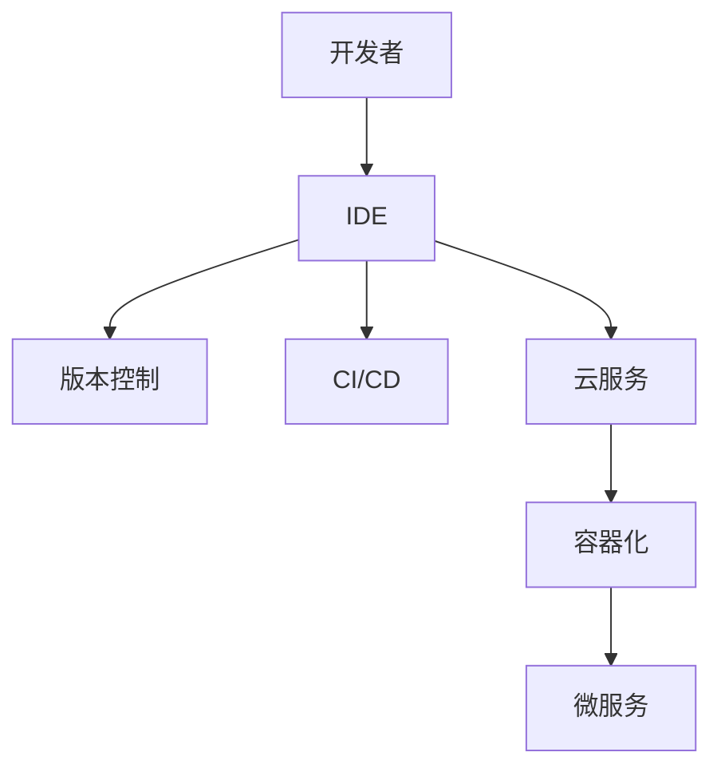

                 

# 开发者工具创业：针对痛点的市场机会

> **关键词**：开发者工具，市场机会，痛点分析，商业模式，创新策略
> 
> **摘要**：本文将探讨开发者工具市场的现状和潜在机会，分析开发者在工具使用过程中所遇到的痛点，并提出相应的市场解决方案和商业模式。通过深入剖析这些痛点的本质，我们将展望开发者工具的未来发展趋势和挑战，为创业者和从业者提供有价值的参考。

## 1. 背景介绍

### 1.1 目的和范围

本文旨在揭示开发者工具市场的潜在机会，深入分析开发者在使用工具时面临的痛点，并探讨如何针对这些痛点提出有效的市场解决方案。我们将从市场现状出发，结合开发者需求的演变，探索新的商业模式和工具创新策略。

### 1.2 预期读者

本文主要面向以下读者群体：

- 创业者：对开发者工具市场有兴趣，希望找到有前景的商业机会。
- 技术从业者：希望了解当前开发者工具的痛点和改进方向。
- 投资者：关注技术领域投资，希望了解开发者工具市场的潜力和机会。
- 学者和研究人员：对开发者工具的技术研究和市场发展有兴趣。

### 1.3 文档结构概述

本文结构如下：

- **第1章**：背景介绍，包括目的和范围、预期读者、文档结构概述和术语表。
- **第2章**：核心概念与联系，介绍开发者工具的基本原理和架构。
- **第3章**：核心算法原理与具体操作步骤，详细讲解工具的核心算法。
- **第4章**：数学模型和公式，分析工具中的数学模型及其应用。
- **第5章**：项目实战，通过实际案例展示工具的实现和应用。
- **第6章**：实际应用场景，探讨工具在开发过程中的应用。
- **第7章**：工具和资源推荐，介绍相关的学习资源和开发工具。
- **第8章**：总结，展望开发者工具的未来发展趋势和挑战。
- **第9章**：附录，包括常见问题与解答。
- **第10章**：扩展阅读与参考资料，提供进一步的阅读建议。

### 1.4 术语表

#### 1.4.1 核心术语定义

- **开发者工具**：专门为软件开发者设计的辅助工具，用于提高开发效率和质量。
- **痛点**：用户在使用工具时遇到的具体问题或不满。
- **市场机会**：基于用户痛点和市场需求的潜在商业机会。
- **商业模式**：企业创造、传递和获取价值的基本逻辑。

#### 1.4.2 相关概念解释

- **需求驱动开发**：以用户需求为中心，不断迭代和优化的开发模式。
- **敏捷开发**：强调快速响应变化，持续交付有价值的软件。
- **云原生**：基于云的服务和架构，具备弹性和可扩展性。
- **微服务**：小型、独立部署的服务单元，易于扩展和维护。

#### 1.4.3 缩略词列表

- **IDE**：集成开发环境（Integrated Development Environment）
- **API**：应用程序编程接口（Application Programming Interface）
- **SDK**：软件开发工具包（Software Development Kit）
- **CLI**：命令行界面（Command-Line Interface）
- **UI**：用户界面（User Interface）

## 2. 核心概念与联系

开发者工具的核心概念和联系可以概括为以下几个方面：

1. **集成开发环境（IDE）**：提供代码编辑、调试、构建和测试等功能，是开发者日常开发的核心工具。
2. **版本控制**：如Git，用于管理代码版本，协同工作和追踪变更。
3. **持续集成和持续交付（CI/CD）**：自动化测试、构建和部署，提高软件交付速度和质量。
4. **云服务**：提供弹性计算、存储和数据库等服务，支持大规模开发和部署。
5. **容器化和微服务**：通过Docker和Kubernetes等工具，实现应用的轻量级、独立部署和扩展。

以下是一个简化的开发者工具架构图，用Mermaid绘制：



## 3. 核心算法原理与具体操作步骤

开发者工具的核心算法通常涉及代码分析、性能优化、错误检测等方面。以下将介绍一个常见的性能优化算法——二分查找算法，并使用伪代码进行详细阐述。

### 3.1 二分查找算法

二分查找是一种在有序数组中查找特定元素的算法。其基本思想是不断将搜索范围缩小一半，直到找到目标元素或确定其不存在。

### 3.2 伪代码

```pseudo
function binarySearch(arr, target):
    low = 0
    high = arr.length - 1
    
    while low <= high:
        mid = (low + high) / 2
        if arr[mid] == target:
            return mid
        else if arr[mid] < target:
            low = mid + 1
        else:
            high = mid - 1
    
    return -1
```

### 3.3 具体操作步骤

1. **初始化**：设置搜索范围的最低点和最高点。
2. **循环搜索**：不断计算中间点，并与目标元素比较。
3. **更新范围**：根据比较结果，更新搜索范围的最低点或最高点。
4. **结束条件**：当搜索范围的最低点高于最高点时，结束搜索。

## 4. 数学模型和公式与详细讲解

开发者工具中常用的数学模型包括线性回归、决策树、神经网络等。以下将详细讲解线性回归模型，并使用LaTeX格式表示数学公式。

### 4.1 线性回归模型

线性回归是一种用于预测连续值的统计方法。其基本公式为：

$$
y = wx + b
$$

其中，$y$ 是目标变量，$x$ 是输入特征，$w$ 是权重，$b$ 是偏置。

### 4.2 求导与优化

为了优化模型，我们需要对公式求导，以找到最佳权重和偏置。使用梯度下降法进行优化：

$$
w_{\text{new}} = w_{\text{old}} - \alpha \frac{\partial}{\partial w} (wx + b - y)
$$

$$
b_{\text{new}} = b_{\text{old}} - \alpha \frac{\partial}{\partial b} (wx + b - y)
$$

其中，$\alpha$ 是学习率，用于控制模型更新的速度。

### 4.3 举例说明

假设我们有一个简单的线性回归模型，目标变量 $y$ 是房屋价格，输入特征 $x$ 是房屋面积。我们有以下数据集：

| 房屋面积（平方米） | 房屋价格（万元） |
|------------------|------------------|
| 100              | 300              |
| 200              | 500              |
| 300              | 800              |

我们希望预测一个面积为 250 平方米的房屋的价格。首先，我们需要计算权重和偏置：

$$
w = \frac{\sum_{i=1}^{n} (x_i - \bar{x})(y_i - \bar{y})}{\sum_{i=1}^{n} (x_i - \bar{x})^2}
$$

$$
b = \bar{y} - w\bar{x}
$$

其中，$\bar{x}$ 和 $\bar{y}$ 分别是输入特征和目标变量的平均值。

## 5. 项目实战：代码实际案例和详细解释说明

### 5.1 开发环境搭建

为了演示一个开发者工具的实战案例，我们将使用Python语言和Jupyter Notebook环境搭建一个简单的代码示例。以下是在Jupyter Notebook中创建一个Python虚拟环境并安装所需库的步骤：

```bash
# 创建虚拟环境
python -m venv venv

# 激活虚拟环境
source venv/bin/activate  # 在Windows上使用venv\Scripts\activate

# 安装所需库
pip install numpy matplotlib
```

### 5.2 源代码详细实现和代码解读

下面是一个使用线性回归模型进行房屋价格预测的简单Python代码示例：

```python
import numpy as np
import matplotlib.pyplot as plt

# 数据集
X = np.array([[100], [200], [300]])
y = np.array([300, 500, 800])

# 初始化权重和偏置
w = np.random.rand(1)
b = np.random.rand(1)

# 学习率
alpha = 0.01

# 梯度下降法优化模型
epochs = 1000
for _ in range(epochs):
    gradients = 2 * (X * w + b - y)
    w -= alpha * gradients
    b -= alpha

# 预测新房屋价格
new_x = np.array([[250]])
predicted_price = new_x * w + b
print("预测的房屋价格为：", predicted_price)

# 绘制数据点和回归线
plt.scatter(X, y, color='red', label='实际价格')
plt.plot(X, X * w + b, color='blue', label='预测价格')
plt.xlabel('房屋面积（平方米）')
plt.ylabel('房屋价格（万元）')
plt.legend()
plt.show()
```

### 5.3 代码解读与分析

1. **数据集导入**：我们使用NumPy库导入一个简单的数据集，其中 $X$ 表示房屋面积，$y$ 表示房屋价格。
2. **初始化模型参数**：初始化权重 $w$ 和偏置 $b$，使用随机值作为初始估计。
3. **梯度下降优化**：使用梯度下降法更新权重和偏置，迭代 $epochs$ 次。
4. **预测新数据**：使用训练好的模型预测一个新房屋的价格。
5. **数据可视化**：使用Matplotlib库绘制数据点和回归线，直观地展示模型的预测能力。

通过这个简单的案例，我们展示了如何使用线性回归模型实现房屋价格预测。在实际应用中，开发者工具会包含更复杂的功能，如多特征处理、非线性变换、模型评估和优化等。

## 6. 实际应用场景

开发者工具在软件开发过程中扮演着至关重要的角色，以下是几个典型的应用场景：

### 6.1 代码编辑与调试

开发者工具的IDE提供代码编辑、语法高亮、代码自动完成等功能，显著提高开发效率。同时，调试工具允许开发者逐步执行代码，查看变量值，定位和修复错误。

### 6.2 持续集成与持续交付

开发者工具支持自动化测试、构建和部署流程，确保软件质量并提高交付速度。例如，Jenkins和Travis CI等工具可以自动化执行测试用例，触发构建和部署过程。

### 6.3 云服务和容器化

开发者工具帮助开发者轻松部署和管理云服务，如AWS、Azure和Google Cloud。容器化工具如Docker和Kubernetes使开发者能够以轻量级、可移植的方式部署和扩展应用。

### 6.4 人工智能与数据分析

开发者工具集成了机器学习和数据分析库，如TensorFlow和Scikit-learn，使开发者能够轻松构建和部署人工智能模型，进行数据分析和预测。

### 6.5 用户体验与性能优化

开发者工具提供性能分析工具，如Chrome DevTools和New Relic，帮助开发者识别和优化应用的性能瓶颈，提升用户体验。

## 7. 工具和资源推荐

### 7.1 学习资源推荐

#### 7.1.1 书籍推荐

- 《代码大全》（Code Complete） - 史蒂夫·麦克康内尔
- 《敏捷软件开发：原则、模式与实践》（Agile Software Development） - 马丁·福勒

#### 7.1.2 在线课程

- Coursera：机器学习课程（吴恩达）
- edX：计算机科学基础课程（哈佛大学）

#### 7.1.3 技术博客和网站

- Medium：技术博客
- Stack Overflow：编程问答社区
- HackerRank：编程挑战和学习平台

### 7.2 开发工具框架推荐

#### 7.2.1 IDE和编辑器

- IntelliJ IDEA
- Visual Studio Code
- PyCharm

#### 7.2.2 调试和性能分析工具

- Chrome DevTools
- New Relic
- AppDynamics

#### 7.2.3 相关框架和库

- TensorFlow
- React
- Docker

### 7.3 相关论文著作推荐

#### 7.3.1 经典论文

- "The Mythical Man-Month" - Fred Brooks
- "Design Patterns: Elements of Reusable Object-Oriented Software" - Erich Gamma等

#### 7.3.2 最新研究成果

- "Deep Learning" - 伊恩·古德费洛等
- "Reinforcement Learning: An Introduction" - Richard S. Sutton等

#### 7.3.3 应用案例分析

- "Google File System" - Sanjay Ghemawat等
- "The Architecture of Open Source Applications" - Michael T. Newton等

## 8. 总结：未来发展趋势与挑战

开发者工具市场正处于快速发展阶段，未来的趋势和挑战如下：

### 8.1 发展趋势

1. **云原生与容器化**：云原生架构和容器化技术将进一步普及，提高开发效率和部署灵活性。
2. **人工智能集成**：开发者工具将更多地集成机器学习和数据分析功能，支持自动化代码优化和智能推荐。
3. **无代码/低代码开发**：无代码和低代码开发平台将减少技术门槛，让非技术背景的用户也能参与软件开发。
4. **开源生态**：开源工具和框架将继续主导开发者工具市场，促进技术共享和社区协作。

### 8.2 挑战

1. **性能优化**：开发者工具需要不断优化性能，以满足日益复杂的应用需求。
2. **安全性与隐私**：保护用户数据和确保工具安全性将成为重要挑战。
3. **用户体验**：开发者工具需要提供直观易用的界面，减少学习曲线。
4. **可扩展性与可维护性**：工具需要具备良好的可扩展性和可维护性，以适应快速变化的技术需求。

## 9. 附录：常见问题与解答

### 9.1 Q：开发者工具是否只能用于专业开发者？

A：不是的。尽管开发者工具主要用于专业开发者，但许多工具也提供了易于使用的界面和功能，适合不同技术水平的使用者，包括初学者和非技术背景的用户。

### 9.2 Q：如何选择适合自己的开发者工具？

A：选择开发者工具时，应考虑以下因素：个人开发需求、工具的功能、社区支持、学习资源、成本和兼容性。

### 9.3 Q：开发者工具如何提高开发效率？

A：开发者工具通过自动化任务、提供实时反馈和优化开发流程来提高效率。例如，集成开发环境（IDE）提供代码编辑、调试、构建和测试等功能，持续集成工具自动化执行测试和部署，代码分析工具识别潜在问题和优化代码。

## 10. 扩展阅读 & 参考资料

- 《云计算基础架构：从Docker到Kubernetes》（Docker and Kubernetes: Building Cloud-Native Applications） - Kelsey Hightower等
- 《Python机器学习》（Python Machine Learning） - Sebastian Raschka等
- 《深入理解计算机系统》（Deep Learning） - 伊恩·古德费洛等

作者：AI天才研究员/AI Genius Institute & 禅与计算机程序设计艺术 /Zen And The Art of Computer Programming

