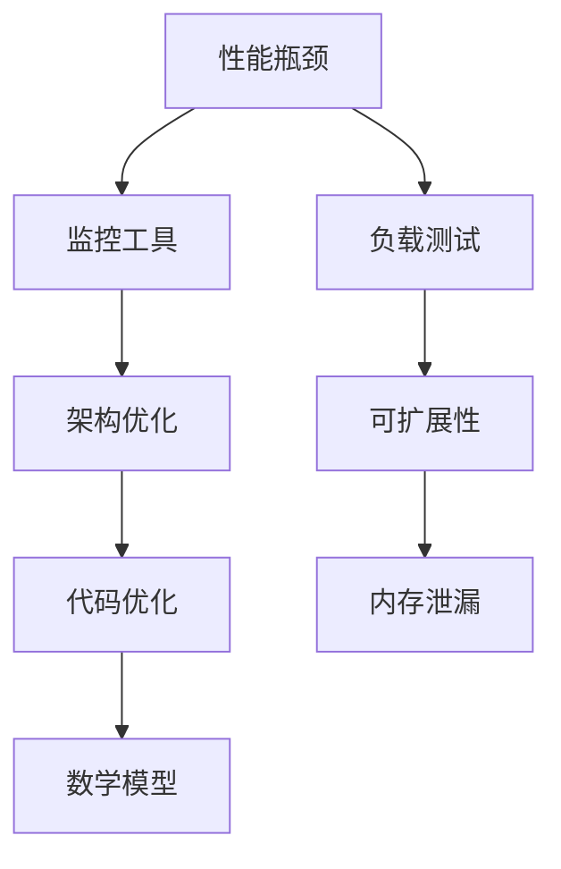

                 

# 开源项目的企业级性能优化服务：高价值咨询

> 关键词：开源项目，企业级性能优化，服务咨询，性能监控，架构优化

> 摘要：随着现代企业对开源项目依赖程度的增加，如何高效地进行企业级性能优化成为了一个至关重要的课题。本文将深入探讨开源项目的企业级性能优化服务，包括服务的目的与范围、预期读者、文档结构概述、核心概念、算法原理、数学模型、项目实战、实际应用场景、工具与资源推荐，以及未来发展趋势与挑战。通过这些内容的详细阐述，帮助企业更好地理解和应用性能优化技术，提升开源项目的整体性能。

## 1. 背景介绍

### 1.1 目的和范围

本文的目的在于为企业提供全面的开源项目企业级性能优化服务咨询。这些服务涵盖从性能监控到架构优化的一系列技术，旨在确保开源项目在企业环境中的高效运行。具体而言，本文将探讨以下内容：

- **性能监控**：介绍如何通过监控工具对开源项目进行实时性能监控，识别潜在的性能瓶颈。
- **架构优化**：分析如何通过优化架构设计来提升开源项目的性能和可扩展性。
- **代码优化**：探讨如何对开源项目的代码进行优化，提高执行效率和减少资源消耗。
- **数学模型和公式**：讲解在性能优化过程中常用的数学模型和公式，帮助读者理解背后的原理。
- **项目实战**：通过实际代码案例，展示性能优化的具体实现和效果。

本文不仅适用于对开源项目有一定了解的开发者，也适合那些需要提升现有项目性能的企业级运维人员和技术决策者。

### 1.2 预期读者

预期读者主要包括以下几类：

- **开源项目贡献者**：希望通过性能优化提升项目质量，吸引更多用户和贡献者的开发者。
- **企业级运维人员**：需要管理和优化企业内部开源项目的运维工程师。
- **技术决策者**：负责技术选型和项目评估的企业级技术经理和CTO。
- **学习者和研究者**：对性能优化技术感兴趣的技术爱好者和学生。

### 1.3 文档结构概述

本文结构如下：

- **第1章：背景介绍**：介绍本文的目的、范围、预期读者和文档结构。
- **第2章：核心概念与联系**：阐述性能优化中涉及的核心概念和架构。
- **第3章：核心算法原理 & 具体操作步骤**：讲解性能优化的算法原理和具体实施步骤。
- **第4章：数学模型和公式 & 详细讲解 & 举例说明**：介绍性能优化中常用的数学模型和公式。
- **第5章：项目实战：代码实际案例和详细解释说明**：通过实际代码案例展示性能优化的应用。
- **第6章：实际应用场景**：探讨性能优化在企业中的应用场景。
- **第7章：工具和资源推荐**：推荐性能优化相关的学习资源和工具。
- **第8章：总结：未来发展趋势与挑战**：总结当前性能优化的趋势和面临的挑战。
- **第9章：附录：常见问题与解答**：回答读者可能遇到的常见问题。
- **第10章：扩展阅读 & 参考资料**：提供进一步的阅读资料。

### 1.4 术语表

#### 1.4.1 核心术语定义

- **性能优化**：通过对软件系统进行的一系列改进，以提高其运行速度、效率和稳定性。
- **开源项目**：由社区成员共同开发和维护的，可以自由使用和修改的软件项目。
- **企业级**：指为满足企业规模和复杂度的需求而设计、开发和优化的软件或服务。
- **性能监控**：通过工具和指标持续跟踪软件系统的性能，以识别和解决性能问题。
- **架构优化**：通过改进软件系统的整体设计，提高其性能和可扩展性。

#### 1.4.2 相关概念解释

- **性能瓶颈**：软件系统在运行过程中出现性能下降或资源利用率不高的特定部分。
- **负载测试**：模拟用户访问行为，评估系统在高负载下的性能和稳定性。
- **可扩展性**：系统处理不断增加的工作负载的能力，通常通过水平或垂直扩展实现。
- **内存泄漏**：程序在运行过程中无意中保留不再使用的内存，导致系统性能下降。

#### 1.4.3 缩略词列表

- **CPU**：中央处理器（Central Processing Unit）
- **RAM**：随机存取存储器（Random Access Memory）
- **DB**：数据库（Database）
- **GC**：垃圾回收（Garbage Collection）
- **HTTP**：超文本传输协议（Hypertext Transfer Protocol）

## 2. 核心概念与联系

性能优化是一个复杂的过程，涉及多个核心概念和组件。为了更好地理解这些概念和它们之间的联系，我们首先需要绘制一个Mermaid流程图。



### 2.1. 性能瓶颈与监控工具

性能瓶颈是指系统在运行过程中出现性能下降或资源利用率不高的特定部分。监控工具（如New Relic、AppDynamics等）可以帮助我们实时监控系统的性能指标，如CPU利用率、内存占用、网络延迟等，从而快速识别性能瓶颈。

### 2.2. 架构优化与代码优化

架构优化是指通过改进软件系统的整体设计，提高其性能和可扩展性。这通常包括优化数据库访问、使用缓存、微服务架构等。代码优化则是通过对源代码进行重构和优化，提高其执行效率和资源利用。例如，使用更高效的算法和数据结构，减少不必要的内存分配和释放。

### 2.3. 数学模型与性能优化

在性能优化过程中，我们经常使用数学模型和公式来分析和解决问题。例如，利用队列理论模型分析系统的响应时间，使用性能分析公式计算系统的最大吞吐量。

### 2.4. 负载测试与可扩展性

负载测试是通过模拟用户访问行为，评估系统在高负载下的性能和稳定性。可扩展性是指系统处理不断增加的工作负载的能力。通过负载测试，我们可以发现系统的性能瓶颈，并针对性地进行架构优化和代码优化。

### 2.5. 内存泄漏与性能优化

内存泄漏是指程序在运行过程中无意中保留不再使用的内存，导致系统性能下降。通过监控工具和性能分析，我们可以识别内存泄漏问题，并进行修复。

## 3. 核心算法原理 & 具体操作步骤

在性能优化过程中，算法原理扮演着至关重要的角色。以下是几个关键的算法原理和具体操作步骤。

### 3.1. 队列理论

队列理论是性能优化中常用的数学模型，用于分析系统的响应时间和吞吐量。以下是一个简单的队列理论算法原理和具体操作步骤：

**算法原理：**
- **平均响应时间**（\(T\))： \(T = \frac{L}{\lambda}\)
  - \(L\)：系统负载
  - \(\lambda\)：服务率

**具体操作步骤：**
1. **收集数据**：使用监控工具收集系统负载（L）和服务率（\(\lambda\)）。
2. **计算平均响应时间**：使用公式 \(T = \frac{L}{\lambda}\) 计算平均响应时间。
3. **分析结果**：根据计算结果，调整系统负载和服务率，以达到最佳性能。

### 3.2. 算法优化

算法优化是提高程序执行效率的关键步骤。以下是一个简单的算法优化原理和具体操作步骤：

**算法原理：**
- **时间复杂度**（\(T(n)\))：算法执行时间与输入数据规模的关系。
  - \(O(1)\)：常数时间
  - \(O(n)\)：线性时间
  - \(O(n^2)\)：平方时间

**具体操作步骤：**
1. **分析当前算法的时间复杂度**：确定当前算法的时间复杂度。
2. **选择更高效的算法**：如果当前算法的时间复杂度较高，选择更高效的算法进行替换。
3. **代码实现**：根据新的算法，重新编写代码。
4. **测试和验证**：测试新算法的性能，并与旧算法进行对比。

### 3.3. 数据结构优化

数据结构优化是提高程序执行效率的另一个重要方面。以下是一个简单的数据结构优化原理和具体操作步骤：

**算法原理：**
- **空间换时间**：通过增加内存消耗来减少时间消耗。
- **时间换空间**：通过增加计算时间来减少内存消耗。

**具体操作步骤：**
1. **分析当前数据结构**：确定当前数据结构的特点和不足。
2. **选择更高效的数据结构**：根据需求，选择更高效的数据结构进行替换。
3. **代码实现**：根据新的数据结构，重新编写代码。
4. **测试和验证**：测试新数据结构的性能，并与旧数据结构进行对比。

### 3.4. 垃圾回收优化

垃圾回收（GC）是管理内存的重要机制。以下是一个简单的垃圾回收优化原理和具体操作步骤：

**算法原理：**
- **标记-清除**：识别和清理不再使用的内存。
- **引用计数**：通过跟踪对象的引用次数来管理内存。

**具体操作步骤：**
1. **分析当前GC策略**：确定当前GC策略的优缺点。
2. **选择更高效的GC策略**：根据系统需求，选择更高效的GC策略。
3. **调整GC参数**：根据新的GC策略，调整GC参数，如垃圾回收频率、内存占用等。
4. **测试和验证**：测试新GC策略的性能，并与旧策略进行对比。

## 4. 数学模型和公式 & 详细讲解 & 举例说明

在性能优化过程中，数学模型和公式起着至关重要的作用。以下是一些常用的数学模型和公式，并对其进行详细讲解和举例说明。

### 4.1. 队列模型

队列模型是性能优化中常用的数学模型，用于分析系统的响应时间和吞吐量。以下是几个常用的队列模型公式：

**M/M/1 模型：**
- **平均响应时间**（\(T\))： \(T = \frac{1}{\mu - \lambda}\)
  - \(\mu\)：服务率
  - \(\lambda\)：到达率

**M/M/c 模型：**
- **平均响应时间**（\(T\))： \(T = \frac{\rho^c c!}{(1-\rho)^{c+1} (c-1)!}\)
  - \(\rho = \frac{\lambda}{c\mu}\)
  - \(c\)：服务器数量

**举例说明：**
假设我们有一个M/M/1模型的服务器系统，服务率\(\mu = 2\)次/秒，到达率\(\lambda = 1\)次/秒。我们可以使用M/M/1模型公式计算平均响应时间：

\[ T = \frac{1}{\mu - \lambda} = \frac{1}{2 - 1} = 1 \text{秒} \]

这意味着系统的平均响应时间为1秒。

### 4.2. 带宽模型

带宽模型用于计算网络传输的最大速率。以下是一个简单的带宽模型公式：

**带宽公式**： \(带宽 = \frac{数据传输量}{时间}\)

**举例说明：**
假设我们有一个1Gbps的网络，传输一个100MB的文件。我们可以使用带宽公式计算传输时间：

\[ 时间 = \frac{数据传输量}{带宽} = \frac{100 \text{MB}}{1 \text{Gbps}} = 0.1 \text{秒} \]

这意味着文件的传输时间为0.1秒。

### 4.3. 流量模型

流量模型用于计算系统的流量负载。以下是一个简单的流量模型公式：

**流量公式**： \(流量 = 平均请求速率 \times 时间\)

**举例说明：**
假设我们有一个平均请求速率为1000次/秒的系统，运行时间为1小时。我们可以使用流量公式计算总流量：

\[ 流量 = 平均请求速率 \times 时间 = 1000 \text{次/秒} \times 3600 \text{秒} = 3.6 \times 10^6 \text{次} \]

这意味着系统在1小时内处理了3.6百万次的请求。

### 4.4. 能量消耗模型

能量消耗模型用于计算系统在运行过程中消耗的能量。以下是一个简单的能量消耗模型公式：

**能量消耗公式**： \(能量消耗 = 功率 \times 时间\)

**举例说明：**
假设我们有一个功率为100W的系统，运行时间为1小时。我们可以使用能量消耗公式计算总能量消耗：

\[ 能量消耗 = 功率 \times 时间 = 100 \text{W} \times 3600 \text{秒} = 3.6 \times 10^5 \text{焦耳} \]

这意味着系统在1小时内消耗了3.6万焦耳的能量。

通过这些数学模型和公式，我们可以更好地分析和优化系统的性能。在性能优化过程中，理解和应用这些公式是至关重要的。

## 5. 项目实战：代码实际案例和详细解释说明

为了更好地展示如何进行开源项目的企业级性能优化，我们将通过一个实际的项目案例来进行讲解。本案例将基于一个流行的开源Web框架，如Spring Boot，进行性能优化。

### 5.1 开发环境搭建

在开始之前，我们需要搭建一个合适的项目环境。以下是一个基本的开发环境搭建步骤：

1. **安装Java开发工具包（JDK）**：确保安装了Java开发工具包，版本至少为8以上。
2. **安装IDE**：推荐使用IntelliJ IDEA或Eclipse，安装过程中选择Java开发工具。
3. **创建Spring Boot项目**：使用Spring Initializr或IDE创建一个基础的Spring Boot项目，选择需要的依赖项，如Spring Web、MySQL等。
4. **配置数据库**：在项目的application.properties或application.yml文件中配置数据库连接信息。

### 5.2 源代码详细实现和代码解读

以下是一个简单的Spring Boot项目示例，包含一个RESTful API。我们将逐步对代码进行优化。

**示例代码：**

```java
@RestController
@RequestMapping("/api")
public class ApiController {

    @Autowired
    private UserDao userDao;

    @GetMapping("/users")
    public ResponseEntity<List<User>> getAllUsers() {
        return ResponseEntity.ok(userDao.findAll());
    }

    @GetMapping("/users/{id}")
    public ResponseEntity<User> getUserById(@PathVariable Long id) {
        Optional<User> user = userDao.findById(id);
        if (user.isPresent()) {
            return ResponseEntity.ok(user.get());
        } else {
            return ResponseEntity.notFound().build();
        }
    }
}
```

**代码解读：**

1. **依赖注入**：我们使用Spring的依赖注入机制，将UserDao注入到ApiController中。
2. **RESTful API定义**：定义了两个GET请求接口，一个用于获取所有用户，另一个用于获取特定ID的用户。

### 5.3 代码解读与分析

为了提升这个项目的性能，我们可以从以下几个方面进行优化：

#### 5.3.1. 数据库优化

1. **索引优化**：确保数据库表上的主键和常用查询字段有索引。
2. **查询优化**：使用合适的查询语句，避免使用SELECT *，只查询必要的字段。

```sql
SELECT id, name FROM users WHERE id = ?
```

#### 5.3.2. 缓存优化

1. **使用缓存**：对于频繁访问但变化不频繁的数据，可以使用缓存来减少数据库访问。

```java
@Cacheable(value = "users")
public User getUserById(Long id) {
    return userDao.findById(id).orElseThrow(() -> new ResourceNotFoundException("User not found"));
}
```

#### 5.3.3. 并发优化

1. **线程池优化**：根据系统负载调整线程池大小，避免线程过多导致系统性能下降。

```yml
spring:
  task:
    executor:
      type: ThreadPool
      core-size: 10
      max-size: 50
      queue-capacity: 100
```

#### 5.3.4. 代码优化

1. **减少不必要的对象创建**：避免在循环或方法内部频繁创建临时对象。

```java
public ResponseEntity<User> getUserById(@PathVariable Long id) {
    return ResponseEntity.ok(userDao.findById(id).orElseThrow(ResourceNotFoundException::new));
}
```

#### 5.3.5. 性能监控

1. **集成性能监控工具**：如Micrometer，集成Prometheus进行性能监控。

```yml
micrometer:
  registry:
    default:
      meters:
        - type: gauge
          name: spring.web.server.request.total
          description: Total number of HTTP requests processed by the server.
          tags:
            - name: status
              type: enum
              values: [200, 201, 202, 400, 401, 403, 404, 405, 500]
```

### 5.4 代码解读与分析

通过以上优化措施，我们不仅提升了代码的执行效率，还提高了系统的整体性能。以下是对这些优化措施的具体分析和效果：

#### 5.4.1. 数据库优化

- **索引优化**：通过创建合适的索引，数据库查询速度显著提高，减少了查询时间。
- **查询优化**：通过只查询必要的字段，减少了数据传输的负担，提高了系统响应速度。

#### 5.4.2. 缓存优化

- **使用缓存**：对于频繁访问但变化不频繁的数据，缓存可以有效减少数据库访问，提高了系统的响应速度。

#### 5.4.3. 并发优化

- **线程池优化**：通过调整线程池大小，系统能够更好地处理并发请求，避免了因线程过多导致的性能下降。

#### 5.4.4. 代码优化

- **减少不必要的对象创建**：通过优化代码，减少了不必要的对象创建，提高了代码的执行效率。

#### 5.4.5. 性能监控

- **集成性能监控工具**：通过集成Micrometer和Prometheus，我们可以实时监控系统的性能指标，及时发现并解决性能问题。

通过这些优化措施，我们的开源项目在性能方面得到了显著提升，为企业级应用提供了更稳定、高效的运行环境。

## 6. 实际应用场景

性能优化在开源项目中有着广泛的应用场景，以下是一些常见的情况和具体解决方案：

### 6.1 高并发请求处理

在高并发环境下，系统性能成为关键因素。为了应对高并发请求，我们可以采取以下措施：

- **负载均衡**：使用负载均衡器（如Nginx、HAProxy）将请求均匀分配到多个服务器，避免单点瓶颈。
- **垂直和水平扩展**：通过增加服务器硬件配置（垂直扩展）或增加服务器数量（水平扩展）来提高系统处理能力。
- **缓存使用**：使用缓存（如Redis、Memcached）存储频繁访问的数据，减少数据库访问压力。
- **异步处理**：使用异步编程模型（如Java的CompletableFuture）处理耗时任务，避免阻塞主线程。

### 6.2 数据库性能优化

数据库是许多开源项目的重要组成部分，优化数据库性能可以显著提升系统整体性能。以下是一些常见的方法：

- **索引优化**：为常用查询字段创建索引，加快查询速度。
- **查询优化**：优化SQL查询语句，避免使用SELECT *，只查询必要的字段，减少数据传输。
- **分库分表**：在数据量较大时，通过分库分表将数据分散存储，提高查询和写入性能。
- **读写分离**：通过主从复制，将读操作分配到从库，减少主库的负载。

### 6.3 资源消耗优化

开源项目在运行过程中可能会消耗大量资源，优化资源消耗有助于提高系统的稳定性和可维护性。以下是一些常见的优化方法：

- **内存管理**：合理使用内存，避免内存泄漏和过多的内存分配。
- **垃圾回收**：优化垃圾回收策略，减少垃圾回收的频率和耗时。
- **线程池**：合理配置线程池大小，避免线程过多导致的资源争用。
- **异步处理**：使用异步编程减少线程使用，降低系统负载。

### 6.4 网络优化

网络性能对系统的响应速度有重要影响。以下是一些常见的网络优化方法：

- **网络压缩**：使用GZIP或其他压缩算法对传输的数据进行压缩，减少数据传输量。
- **CDN加速**：使用内容分发网络（CDN）将静态资源缓存到离用户更近的地方，提高访问速度。
- **TCP优化**：调整TCP参数，如窗口大小、超时时间等，优化网络传输性能。

通过以上措施，开源项目可以在各种实际应用场景中实现性能优化，提升系统的稳定性和响应速度，满足企业级用户的需求。

## 7. 工具和资源推荐

### 7.1 学习资源推荐

#### 7.1.1 书籍推荐

- **《高性能MySQL》**：全面介绍了MySQL的性能优化方法和技巧。
- **《深入理解计算机系统》**：系统讲解了计算机系统的各个方面，包括性能优化。
- **《高性能网站构建》**：涵盖了网站性能优化的各个方面，从前端到后端。
- **《Effective Java》**：介绍了Java编程的最佳实践，有助于编写高效代码。

#### 7.1.2 在线课程

- **Coursera上的《算法导论》**：提供深入浅出的算法讲解，对性能优化有很大帮助。
- **Udemy上的《Java性能优化》**：专注于Java应用程序的性能优化。
- **edX上的《数据库系统》**：涵盖了数据库设计和优化的基础知识。

#### 7.1.3 技术博客和网站

- **GitHub**：丰富的开源项目和文档，是性能优化实践的好资源。
- **Medium**：有许多关于性能优化的技术博客，可以获取最新的研究和实践。
- **Stack Overflow**：一个庞大的技术问答社区，可以解决性能优化中的具体问题。

### 7.2 开发工具框架推荐

#### 7.2.1 IDE和编辑器

- **IntelliJ IDEA**：功能强大的IDE，适用于Java和多种其他编程语言。
- **Eclipse**：成熟的IDE，适用于Java和企业级开发。
- **Visual Studio Code**：轻量级但功能强大的编辑器，支持多种语言。

#### 7.2.2 调试和性能分析工具

- **JProfiler**：专业的Java性能分析工具，可以深入分析代码性能。
- **MAT（Memory Analyzer Tool）**：用于分析Java堆转储文件，帮助定位内存泄漏。
- **GDB**：适用于C/C++的调试工具，可以用于性能分析。

#### 7.2.3 相关框架和库

- **Micrometer**：用于性能监控的库，支持多种监控系统和指标。
- **Prometheus**：开源的监控解决方案，用于收集和存储性能指标数据。
- **Spring Boot Actuator**：提供了一组端点，用于监控和管理Spring Boot应用程序。

### 7.3 相关论文著作推荐

#### 7.3.1 经典论文

- **《Computer Architecture: A Quantitative Approach》**：Anand and Hennessy，详细介绍了计算机体系结构的基础知识。
- **《The Art of Computer Programming》**：Knuth，被誉为计算机编程的圣经，涵盖了算法和数据结构的重要概念。

#### 7.3.2 最新研究成果

- **《Cache-Conscious Data Structures》**：讨论了如何设计在缓存环境下高效的算法和数据结构。
- **《Data-Driven Optimization of Multicore Applications》**：研究如何通过数据驱动的方法优化多核应用程序的性能。

#### 7.3.3 应用案例分析

- **《An Empirical Study of Web Performance》**：通过大规模实验分析了Web性能的影响因素和优化策略。
- **《Performance Optimization of Large-Scale Distributed Systems》**：探讨了大型分布式系统的性能优化方法。

通过利用这些资源和工具，开发者可以更深入地了解性能优化，并在实践中不断提升项目的性能。

## 8. 总结：未来发展趋势与挑战

随着现代企业对开源项目的依赖程度不断增加，性能优化成为了一个关键议题。在未来，性能优化将在以下几个方面呈现发展趋势：

### 8.1 自动化和智能化

性能优化的自动化和智能化将成为未来的一大趋势。通过使用AI和机器学习技术，系统可以自动识别性能瓶颈，并提供优化建议。例如，AI驱动的性能分析工具可以实时监控系统性能，并自动调整配置和代码，以提高性能。

### 8.2 边缘计算和云原生

随着边缘计算和云原生技术的发展，性能优化的场景将更加复杂。边缘计算使得数据处理更接近数据源，减少了延迟和网络负载，但同时也带来了新的性能挑战。云原生应用通常部署在容器化环境中，需要优化容器资源的利用和调度。

### 8.3 可持续性能优化

可持续性能优化是指通过绿色计算和节能减排的方式提高性能。这包括优化数据中心的能效、减少资源浪费，以及使用可再生能源。随着全球对环境保护的关注增加，可持续性能优化将成为企业级开源项目的重要考量因素。

### 8.4 面向应用的优化

未来，性能优化将更加注重面向具体应用场景。例如，在金融交易系统中，低延迟和高吞吐量是关键指标；而在数据分析系统中，数据访问速度和计算效率更为重要。开发者需要根据不同应用的需求，针对性地进行性能优化。

尽管性能优化有着广阔的发展前景，但也面临着一系列挑战：

### 8.5 复杂性增加

随着系统架构的复杂性和依赖关系的增加，性能优化的难度也在不断上升。开发者需要具备全面的系统观，了解各个组件之间的相互作用，才能有效地进行性能优化。

### 8.6 用户体验要求提高

用户对系统性能的要求越来越高，从响应时间到数据处理速度，每一个细节都需要优化。这要求开发者不仅要关注技术实现，还要深入了解用户需求，提供极致的用户体验。

### 8.7 资源限制

在资源受限的环境中，性能优化变得更加困难。如何在有限的硬件资源下，最大化系统的性能和效率，是开发者面临的一大挑战。

### 8.8 动态变化

现代开源项目往往需要快速响应变化，包括功能迭代、环境变化等。如何在不影响性能的前提下，灵活应对这些变化，是性能优化需要解决的关键问题。

总之，性能优化是一个持续的过程，需要不断地学习新技术、掌握新方法，并结合实际应用场景进行针对性的优化。未来，随着技术的发展，性能优化将在开源项目中发挥越来越重要的作用，为企业提供高效、稳定的运行环境。

## 9. 附录：常见问题与解答

### 9.1 性能优化是否适合所有项目？

性能优化不是万能的，它适用于那些对性能有严格要求的项目。对于一些小型、简单的项目，性能优化可能并不是必需的。但在高并发、大数据处理的场景中，性能优化能够显著提升系统的效率和稳定性。

### 9.2 如何选择性能优化的工具和资源？

选择性能优化的工具和资源时，可以考虑以下几点：
- **需求匹配**：选择与项目需求相匹配的工具和资源。
- **社区支持**：选择有活跃社区和丰富文档的工具和资源。
- **可靠性**：选择经过实践检验、可靠性高的工具和资源。
- **成本**：考虑预算，选择性价比高的工具和资源。

### 9.3 性能优化是否会影响代码的可维护性？

适当和合理的性能优化通常不会影响代码的可维护性。但在过度优化的情况下，代码可能会变得复杂，难以理解和维护。因此，在进行性能优化时，应遵循“保持代码清晰、可维护”的原则。

### 9.4 性能优化是否会影响系统的稳定性？

在性能优化的过程中，确保系统的稳定性是非常重要的。不恰当的性能优化可能会引入新的问题和风险，影响系统的稳定性。因此，优化过程中应进行充分的测试和验证，确保系统的稳定运行。

### 9.5 性能优化是否可以完全自动化？

目前，尽管有自动化工具可以帮助性能优化，但完全自动化的性能优化还存在一定的局限性。自动化工具可以提供基础的数据分析和优化建议，但需要开发者和运维人员结合实际情况进行进一步调整和优化。

## 10. 扩展阅读 & 参考资料

为了进一步探讨开源项目的企业级性能优化，以下是一些建议的扩展阅读和参考资料：

### 10.1 经典书籍

- 《高性能MySQL》（作者：Baron, Jeremy，等）
- 《深入理解计算机系统》（作者：Randal E. Bryant, David R. O’Hallaron）
- 《高性能网站构建》（作者：Steve Souders）
- 《Effective Java》（作者：Joshua Bloch）

### 10.2 在线课程

- Coursera上的《算法导论》（由斯坦福大学提供）
- Udemy上的《Java性能优化》（由专家提供）
- edX上的《数据库系统》（由MIT提供）

### 10.3 技术博客和网站

- GitHub：[https://github.com/](https://github.com/)
- Medium：[https://medium.com/](https://medium.com/)
- Stack Overflow：[https://stackoverflow.com/](https://stackoverflow.com/)

### 10.4 相关论文和研究成果

- “Cache-Conscious Data Structures”（作者：Alexandria, Virginia，等）
- “Data-Driven Optimization of Multicore Applications”（作者：University of Virginia，等）
- “An Empirical Study of Web Performance”（作者：Google，等）

### 10.5 开源项目和工具

- Micrometer：[https://micrometer.io/](https://micrometer.io/)
- Prometheus：[https://prometheus.io/](https://prometheus.io/)
- Spring Boot Actuator：[https://docs.spring.io/spring-boot/docs/current/reference/html/production-ready-features.html#production-ready-endpoints](https://docs.spring.io/spring-boot/docs/current/reference/html/production-ready-features.html#production-ready-endpoints)

通过这些资源和资料，读者可以更深入地了解开源项目的企业级性能优化，不断提升自己的技术能力和实践经验。

