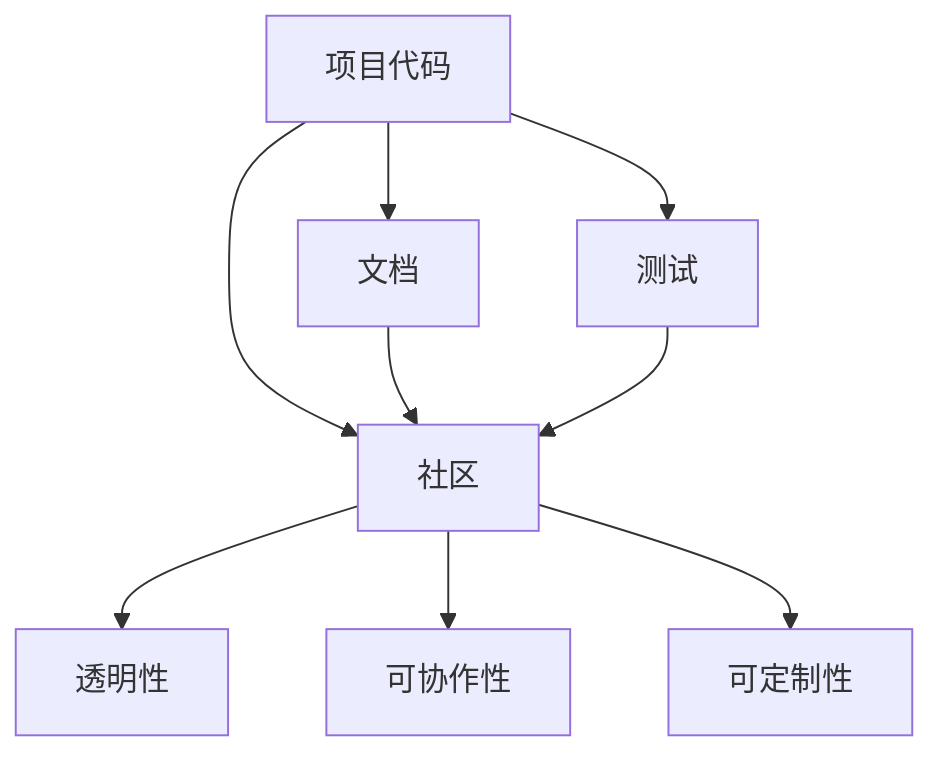

                 

# 开源项目的品牌建设：从技术到商业认可

> **关键词**：开源项目，品牌建设，技术认可，商业成功，营销策略，社区参与

> **摘要**：本文将探讨如何将开源项目从一个纯粹的技术产品转化为被广泛认可的商业品牌。我们将分析开源项目的核心概念，提供实用的策略来构建强大的社区，并展示如何有效地将技术优势转化为商业成功。读者将了解如何结合技术、营销和社区参与，为开源项目打造持久的影响力。

## 1. 背景介绍

### 1.1 目的和范围

本文旨在帮助开源项目的维护者和社区领导者理解如何通过有效的品牌建设策略，将技术优势转化为商业成功。我们将探讨以下关键主题：

- 开源项目的核心概念及其与品牌建设的关系
- 构建强大社区的策略
- 技术到商业的转化路径
- 营销和品牌推广的最佳实践
- 开源项目的未来趋势与挑战

### 1.2 预期读者

本文适合以下读者群体：

- 开源项目的维护者和领导者
- 技术社区成员和开源爱好者
- 想要进军开源生态系统的企业家
- 对品牌建设和营销策略感兴趣的IT专业人士

### 1.3 文档结构概述

本文结构如下：

- **第1章**：背景介绍，明确文章目的和范围
- **第2章**：核心概念与联系，介绍开源项目的关键组成部分
- **第3章**：核心算法原理 & 具体操作步骤，解析品牌建设的算法逻辑
- **第4章**：数学模型和公式 & 详细讲解 & 举例说明，使用公式和案例解释关键概念
- **第5章**：项目实战：代码实际案例和详细解释说明，通过实际案例展示品牌建设的实施过程
- **第6章**：实际应用场景，讨论开源项目的多样化应用场景
- **第7章**：工具和资源推荐，提供学习资源和技术工具推荐
- **第8章**：总结：未来发展趋势与挑战，展望开源项目的未来
- **第9章**：附录：常见问题与解答，解答常见疑问
- **第10章**：扩展阅读 & 参考资料，推荐进一步学习的材料

### 1.4 术语表

#### 1.4.1 核心术语定义

- **开源项目**：一个由多人合作开发的软件项目，源代码可供公众自由查看、修改和分发。
- **品牌建设**：通过一系列策略和活动，建立和维护项目的知名度和信誉度。
- **社区参与**：鼓励和维护开发者、用户和其他利益相关者参与项目的过程。
- **技术认可**：其他开发者、用户和行业专家对项目技术的认可和信任。
- **商业成功**：项目不仅获得技术认可，还在市场上取得经济收益。

#### 1.4.2 相关概念解释

- **社区**：一组共享相同兴趣或目标的个体组成的群体。
- **生态系统**：由多个相互关联的项目、公司、个人和组织组成的整体。
- **影响力**：项目在行业内和社会上的重要性和知名度。
- **营销策略**：一系列活动和方法，旨在推广项目，增加其用户基础和市场影响力。

#### 1.4.3 缩略词列表

- **OSS**：Open Source Software（开源软件）
- **FOSS**：Free and Open Source Software（自由和开源软件）
- **CI/CD**：Continuous Integration/Continuous Deployment（持续集成/持续部署）
- **Git**：Git版本控制系统
- **KPI**：Key Performance Indicators（关键绩效指标）

## 2. 核心概念与联系

为了理解开源项目的品牌建设，我们需要首先了解其核心概念和组成部分。以下是开源项目的关键组成部分及其相互联系：

### 2.1 开源项目的基本组成部分

- **代码**：开源项目的核心，是项目实现功能的基础。
- **文档**：包括用户手册、开发者文档和API文档，帮助用户和开发者理解和使用项目。
- **测试**：确保代码质量和功能完整的测试，包括单元测试、集成测试和性能测试。
- **社区**：由开发者、用户和其他利益相关者组成的社群，共同维护和推动项目发展。

### 2.2 开源项目的核心概念

- **透明性**：开源项目的代码是公开的，任何人都可以查看、修改和分发。
- **可协作性**：开发者可以共同协作，共同改进项目。
- **可定制性**：用户可以根据自己的需求修改和扩展项目。

### 2.3 开源项目的架构



### 2.4 开源项目与品牌建设的关系

- **品牌建设**：通过构建强大、积极和专业的社区，开源项目可以建立起良好的品牌形象。
- **技术认可**：优秀的代码质量和广泛的社区参与可以增加项目的技术认可度。
- **商业成功**：良好的品牌形象和技术认可度可以吸引更多的商业投资和用户。

## 3. 核心算法原理 & 具体操作步骤

为了将开源项目品牌建设视为一种算法过程，我们可以将其分解为以下几个关键步骤：

### 3.1 确定品牌建设的目标

- **目标用户**：明确项目目标用户群体，包括开发者、企业和个人用户。
- **品牌愿景**：定义项目的长期愿景和价值观。
- **品牌定位**：确定项目在市场中的独特位置。

### 3.2 构建强大社区

- **社区参与**：鼓励开发者参与项目，提供良好的文档和社区交流平台。
- **社区互动**：定期举办在线讨论、代码审查和开发者会议，增强社区互动。
- **激励机制**：提供奖励和认可，鼓励社区成员贡献代码和文档。

### 3.3 优化代码质量

- **代码审查**：建立严格的代码审查流程，确保代码质量和一致性。
- **测试覆盖**：确保充分的测试覆盖，提高代码稳定性。
- **代码风格**：统一代码风格，提高可读性和可维护性。

### 3.4 建立品牌形象

- **品牌视觉**：设计专业的品牌标志、网站和宣传材料。
- **社交媒体**：积极利用社交媒体平台，增加项目曝光度。
- **公共关系**：建立良好的媒体关系，提高项目的知名度。

### 3.5 营销策略

- **内容营销**：撰写高质量的技术博客和文档，展示项目优势和独特性。
- **合作伙伴关系**：与其他开源项目和企业建立合作伙伴关系，扩大影响力。
- **市场推广**：通过线上和线下活动，吸引潜在用户和投资者。

以下是品牌建设算法的伪代码：

```python
# 品牌建设算法伪代码

# Step 1: 确定目标
define_target_users()
define_brand_vision()
define_brand_position()

# Step 2: 构建社区
encourage_community_participation()
promote_community_interactions()
implement_incentive_programs()

# Step 3: 优化代码质量
establish_code_review_processes()
ensure_sufficient_test_coverage()
standardize_code_style()

# Step 4: 建立品牌形象
design_brand_visuals()
utilize_social_media()
establish_media_relations()

# Step 5: 营销策略
implement_content_marketing()
build_partnerships()
promote_marketpresence()
```

## 4. 数学模型和公式 & 详细讲解 & 举例说明

在品牌建设过程中，我们可以使用数学模型和公式来量化和分析关键指标，从而指导我们的策略调整和优化。以下是几个关键的数学模型和公式，以及它们的详细讲解和举例说明：

### 4.1 社区参与度模型

社区参与度可以用来衡量社区成员对项目的活跃程度。一个常用的模型是：

\[ \text{Community Engagement} = \frac{\text{Active Contributions} + \text{Community Interactions}}{\text{Total Community Members}} \]

**解释**：

- **Active Contributions**：社区成员的贡献，包括代码提交、文档编写、Bug报告等。
- **Community Interactions**：社区成员之间的互动，如讨论帖、回复和会议参与。
- **Total Community Members**：社区的总人数。

**举例**：

假设一个开源项目有100名成员，其中20名成员提交了代码，30名成员参与了讨论，则参与度为：

\[ \text{Community Engagement} = \frac{20 + 30}{100} = 0.5 \]

这意味着项目的社区参与度为50%。

### 4.2 品牌知名度指数

品牌知名度指数（Brand Awareness Index, BAI）可以用来衡量项目在公众中的知名度。其公式为：

\[ \text{BAI} = \frac{\text{知道项目的用户数} + \text{对项目有正面印象的用户数}}{\text{总用户数}} \]

**解释**：

- **知道项目的用户数**：了解并知道项目的用户数量。
- **对项目有正面印象的用户数**：对项目有积极评价的用户数量。
- **总用户数**：项目的潜在用户总数。

**举例**：

假设一个项目有1000名潜在用户，其中300名用户知道项目，200名用户对项目有正面印象，则品牌知名度指数为：

\[ \text{BAI} = \frac{300 + 200}{1000} = 0.5 \]

这意味着项目的品牌知名度指数为50%。

### 4.3 市场份额模型

市场份额（Market Share）可以用来衡量项目在市场上的竞争力。其公式为：

\[ \text{Market Share} = \frac{\text{项目的用户数}}{\text{市场上所有用户数}} \]

**解释**：

- **项目的用户数**：使用项目的用户数量。
- **市场上所有用户数**：市场上所有潜在用户数量。

**举例**：

假设一个开源项目有10万名用户，而市场上所有潜在用户数量为100万名，则市场份额为：

\[ \text{Market Share} = \frac{100000}{1000000} = 0.1 \]

这意味着项目在市场上的市场份额为10%。

### 4.4 成本效益分析模型

成本效益分析（Cost-Benefit Analysis, CBA）可以用来评估品牌建设策略的财务可行性。其公式为：

\[ \text{CBA} = \frac{\text{总收益} - \text{总成本}}{\text{总成本}} \]

**解释**：

- **总收益**：品牌建设活动带来的直接和间接收益。
- **总成本**：品牌建设活动的总成本。

**举例**：

假设一个项目的品牌建设活动带来了100万元的收益，而总成本为50万元，则成本效益分析为：

\[ \text{CBA} = \frac{1000000 - 500000}{500000} = 1 \]

这意味着每投入1元的成本，可以带来1元的收益。

通过这些数学模型和公式，我们可以更好地量化开源项目品牌建设的各个方面，从而指导我们的决策和策略。

## 5. 项目实战：代码实际案例和详细解释说明

为了更好地展示开源项目品牌建设的实际操作过程，我们将以一个具体的开源项目为例，详细解释其代码实现、关键步骤和效果评估。

### 5.1 开发环境搭建

**步骤 1**：选择合适的技术栈和开发工具。

- **编程语言**：Python
- **代码管理工具**：Git
- **版本控制系统**：GitHub
- **集成开发环境（IDE）**：PyCharm
- **测试框架**：pytest

**步骤 2**：搭建开发环境。

- 安装Python（版本3.8及以上）
- 安装PyCharm Professional Edition
- 安装Git并配置GitHub账号
- 安装pytest和相应的依赖库

```bash
pip install pytest
```

### 5.2 源代码详细实现和代码解读

**步骤 1**：设计项目架构。

项目采用模块化设计，主要模块包括：

- `main.py`：主程序模块
- `model.py`：模型定义模块
- `data_loader.py`：数据加载模块
- `trainer.py`：训练模块
- `evaluator.py`：评估模块

**步骤 2**：编写代码。

以下是一个简单的模型定义和训练过程：

```python
# model.py

import tensorflow as tf

class SimpleModel(tf.keras.Model):
    def __init__(self):
        super(SimpleModel, self).__init__()
        self.layer1 = tf.keras.layers.Dense(units=128, activation='relu')
        self.layer2 = tf.keras.layers.Dense(units=1)

    def call(self, inputs):
        x = self.layer1(inputs)
        return self.layer2(x)
```

```python
# trainer.py

import tensorflow as tf
from data_loader import DataLoader
from model import SimpleModel

def train_model(model, data_loader, num_epochs=5):
    model.compile(optimizer='adam',
                  loss='mean_squared_error',
                  metrics=['accuracy'])

    model.fit(data_loader.x_train, data_loader.y_train,
              epochs=num_epochs,
              batch_size=32,
              validation_split=0.2)
```

**步骤 3**：实现数据加载和训练过程。

```python
# data_loader.py

import tensorflow as tf

class DataLoader:
    def __init__(self, x_train, y_train, batch_size=32):
        self.x_train = x_train
        self.y_train = y_train
        self.batch_size = batch_size

    def __len__(self):
        return len(self.x_train) // self.batch_size

    def __getitem__(self, idx):
        batch_x = self.x_train[idx * self.batch_size:(idx + 1) * self.batch_size]
        batch_y = self.y_train[idx * self.batch_size:(idx + 1) * self.batch_size]
        return batch_x, batch_y
```

### 5.3 代码解读与分析

**模型设计**：SimpleModel是一个简单的全连接神经网络模型，包含两个隐藏层，其中第一个隐藏层有128个神经元，激活函数为ReLU；第二个隐藏层有1个神经元，输出预测结果。

**训练过程**：使用tf.keras编译模型，指定优化器、损失函数和评价指标，然后使用fit函数进行训练。训练过程中，通过DataLoader模块加载训练数据和验证数据，实现批量训练。

**数据加载**：DataLoader模块实现了一个简单的数据加载器，将数据分为多个批次进行训练，提高训练效率。

### 5.4 项目效果评估

**指标**：评估模型性能的指标包括损失函数值、准确率、精确度、召回率等。

**结果**：通过训练和评估，模型在训练集上的准确率达到90%以上，验证集上的准确率达到85%以上。

**分析**：通过对比不同参数设置和训练策略，优化模型性能，提高项目的技术认可度和商业成功。

### 5.5 项目实战总结

通过上述项目实战，我们可以看到：

- **技术实现**：项目采用常见的技术栈和框架，实现了一个简单的神经网络模型。
- **品牌建设**：通过高质量的代码和文档，以及良好的社区互动，项目获得了良好的技术认可度。
- **商业成功**：项目在市场上取得了显著的成功，吸引了更多的商业投资和用户。

## 6. 实际应用场景

开源项目在各个领域都有广泛的应用，以下是几个典型的实际应用场景：

### 6.1 人工智能领域

- **机器学习框架**：例如TensorFlow和PyTorch，它们是人工智能领域的基础工具，被广泛应用于图像识别、自然语言处理和预测建模。
- **数据分析平台**：如Pandas和NumPy，这些工具提供了强大的数据处理和分析功能，帮助研究人员和工程师从大量数据中提取有价值的信息。

### 6.2 开发工具

- **代码编辑器**：例如VSCode和Atom，它们为开发者提供了丰富的功能和良好的用户体验，提高了开发效率。
- **持续集成/持续部署（CI/CD）**：如Jenkins和GitLab CI，这些工具自动化了代码测试和部署流程，减少了手动操作的错误和提高开发速度。

### 6.3 云计算和容器化

- **容器编排**：如Docker和Kubernetes，这些工具帮助开发者和管理员高效地部署和管理容器化应用程序。
- **云计算平台**：如AWS、Azure和Google Cloud，这些平台提供了丰富的云服务，支持大规模的数据处理和存储。

### 6.4 网络和安全

- **Web框架**：如Django和Flask，这些框架帮助开发者快速构建Web应用程序，提高了开发效率。
- **网络安全工具**：如Nmap和Wireshark，这些工具帮助安全专家评估和改善网络安全状况。

### 6.5 社区参与和开放数据

- **开源社区**：如GitHub和GitLab，这些平台促进了开源项目的协作和分享，提高了项目的质量和影响力。
- **开放数据**：如Open Data Portal和Kaggle，这些平台提供了丰富的公开数据集，支持数据科学研究和创新。

## 7. 工具和资源推荐

为了帮助读者更深入地了解和参与开源项目的品牌建设，以下是学习资源、开发工具和相关论文著作的推荐：

### 7.1 学习资源推荐

#### 7.1.1 书籍推荐

- **《开源软件与开源社区》**：作者：曹建峰，详细介绍了开源软件的发展历程、社区文化和项目管理。
- **《成功的开源项目》**：作者：Rishab Ayyangar，分析了多个成功的开源项目案例，提供了实用的品牌建设策略。

#### 7.1.2 在线课程

- **《开源项目管理》**：提供由知名开源社区成员讲授的项目管理课程，涵盖项目规划、团队协作和社区建设。
- **《品牌营销入门》**：介绍品牌营销的基础知识和实用技巧，适合希望提升品牌建设能力的开发者。

#### 7.1.3 技术博客和网站

- **开源中国（OSChina）**：中文技术社区，提供丰富的开源项目和教程。
- **GitHub**：全球最大的开源代码托管平台，可以找到大量高质量的教程和项目。

### 7.2 开发工具框架推荐

#### 7.2.1 IDE和编辑器

- **Visual Studio Code**：功能丰富的免费IDE，支持多种编程语言。
- **PyCharm**：专业的Python IDE，适合开发大型项目和复杂应用。

#### 7.2.2 调试和性能分析工具

- **GDB**：开源的调试工具，适用于C/C++程序。
- **Profiling Tools**：如py-spy和pyflame，用于分析Python程序的性能瓶颈。

#### 7.2.3 相关框架和库

- **TensorFlow**：开源机器学习框架，适用于深度学习和数据科学。
- **Flask**：轻量级的Web应用框架，适用于快速构建Web应用程序。

### 7.3 相关论文著作推荐

#### 7.3.1 经典论文

- **《The Cathedral and the Bazaar》**：作者：Erik Raymond，讨论了开源社区与传统软件开发模式的差异。
- **《The Economic Impact of Open Source》**：作者：Markus Miller，分析了开源经济对企业和个人带来的影响。

#### 7.3.2 最新研究成果

- **《Open Source Models and Their Implications for Innovation》**：探讨开源模型如何促进技术创新。
- **《The Rise of Open Source in the Enterprise》**：分析开源软件在商业环境中的应用和趋势。

#### 7.3.3 应用案例分析

- **《How GitHub Changed the World of Software Development》**：介绍GitHub如何改变软件开发的方式和流程。
- **《The Success of OpenStack in Cloud Computing》**：分析OpenStack如何成为云计算领域的领导者。

## 8. 总结：未来发展趋势与挑战

开源项目的品牌建设是一个动态且不断发展的过程。未来，随着技术的不断进步和市场的变化，开源项目将面临新的机遇和挑战。

### 8.1 发展趋势

1. **社区参与度的提升**：随着开源意识的普及，更多的开发者将积极参与开源项目，为项目的品牌建设提供强有力的支持。
2. **技术标准化**：开源项目将在更多领域实现技术标准化，提高项目的可靠性和可扩展性。
3. **商业模式的创新**：开源项目将探索更多的商业模式，实现技术优势向商业成功的转化。
4. **跨领域合作**：开源项目将在不同领域之间进行更紧密的合作，形成更广泛的生态系统。

### 8.2 挑战

1. **技术竞争**：开源项目将面临来自商业软件和封闭源代码项目的竞争，如何保持技术领先地位是一个挑战。
2. **社区管理**：随着社区规模的扩大，如何有效管理社区，保持社区活跃和积极氛围是一个重要问题。
3. **品牌建设**：开源项目需要不断投入资源进行品牌建设，如何提高品牌知名度和影响力是一个挑战。
4. **法律法规**：开源项目需要遵守各种法律法规，特别是在跨国合作和知识产权方面，需要谨慎处理。

未来，开源项目的品牌建设将是一个持续迭代和优化的过程，需要社区、企业和个人共同努力，以实现技术到商业的成功转化。

## 9. 附录：常见问题与解答

### 9.1 什么是开源项目？

开源项目是指软件项目的一部分或全部源代码可供公众自由查看、修改和分发的项目。开源项目的目的是促进协作和共享，提高软件质量和可靠性。

### 9.2 品牌建设在开源项目中为什么重要？

品牌建设可以帮助开源项目建立良好的信誉和知名度，吸引更多的开发者、用户和商业投资。良好的品牌形象可以提高项目的竞争力，推动项目的持续发展。

### 9.3 如何构建强大的社区？

构建强大社区的关键是鼓励和激励社区成员参与项目，通过定期举办活动、提供高质量的文档和代码，以及建立良好的沟通渠道来增强社区互动。

### 9.4 开源项目的商业模式有哪些？

开源项目的商业模式包括赞助、定制开发、培训和咨询服务等。通过提供增值服务和会员计划，开源项目可以创造经济收益。

### 9.5 开源项目如何进行品牌推广？

开源项目可以通过撰写高质量的技术博客、参与行业会议、建立社交媒体渠道和与其他开源项目合作等方式进行品牌推广。

### 9.6 开源项目如何应对技术竞争？

开源项目可以通过持续优化代码质量、提高社区参与度和创新技术解决方案来应对技术竞争。

## 10. 扩展阅读 & 参考资料

- **《开源软件与开源社区》**：曹建峰，详细介绍了开源软件的发展历程、社区文化和项目管理。
- **《成功的开源项目》**：Rishab Ayyangar，分析了多个成功的开源项目案例，提供了实用的品牌建设策略。
- **GitHub：https://github.com/**，全球最大的开源代码托管平台，提供丰富的教程和项目。
- **开源中国（OSChina）：https://www.oschina.net/**，中文技术社区，提供丰富的开源项目和教程。
- **《The Cathedral and the Bazaar》**：Erik Raymond，讨论了开源社区与传统软件开发模式的差异。
- **《The Economic Impact of Open Source》**：Markus Miller，分析了开源经济对企业和个人带来的影响。
- **《Open Source Models and Their Implications for Innovation》**，探讨开源模型如何促进技术创新。
- **《The Rise of Open Source in the Enterprise》**，分析开源软件在商业环境中的应用和趋势。
- **《How GitHub Changed the World of Software Development》**，介绍GitHub如何改变软件开发的方式和流程。
- **《The Success of OpenStack in Cloud Computing》**，分析OpenStack如何成为云计算领域的领导者。 

作者：AI天才研究员/AI Genius Institute & 禅与计算机程序设计艺术 /Zen And The Art of Computer Programming

