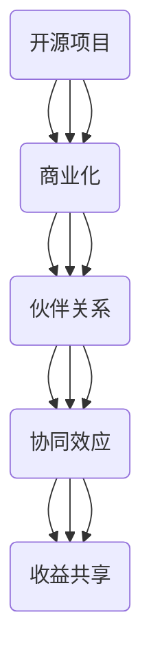

                 

# 开源项目的商业化伙伴关系：协同效应与收益共享

> **关键词：** 开源项目、商业化、伙伴关系、协同效应、收益共享  
> **摘要：** 本文深入探讨了开源项目商业化伙伴关系的构建与维护，分析了协同效应与收益共享机制，旨在为开源社区和企业提供有效的商业模式参考。

## 1. 背景介绍

### 1.1 目的和范围

本文旨在探讨开源项目的商业化路径，特别是伙伴关系的构建与维护。通过分析协同效应与收益共享机制，本文旨在为开源社区和企业提供有效的商业模式参考，以实现开源项目的可持续发展。

### 1.2 预期读者

本文面向开源项目贡献者、企业决策者、技术爱好者等对开源项目商业化有兴趣的读者。本文的内容有助于读者理解开源项目商业化的核心概念和操作方法。

### 1.3 文档结构概述

本文分为十个部分：首先介绍背景和目的，然后定义核心术语和概念；接着，通过Mermaid流程图展示核心架构；详细讲解核心算法原理和操作步骤；分析数学模型和公式；通过实战案例进行代码实际操作；探讨实际应用场景；推荐相关工具和资源；总结未来发展趋势与挑战；最后提供常见问题与解答，并推荐扩展阅读。

### 1.4 术语表

#### 1.4.1 核心术语定义

- **开源项目：** 由社区贡献者共同维护的项目，遵循特定许可证，允许用户自由使用、修改和分发。
- **商业化：** 将开源项目转化为商业价值的过程，通常涉及商业化伙伴关系的建立。
- **伙伴关系：** 开源项目与企业或其他组织之间的合作关系，旨在共同推动项目发展。
- **协同效应：** 合作伙伴之间通过合作实现的共同利益，通常超过各自独立行动所能实现的效果。
- **收益共享：** 合作伙伴之间根据约定规则分享项目收益的机制。

#### 1.4.2 相关概念解释

- **协同效应：** 指合作伙伴之间通过资源互补、知识共享等合作行为，实现的合作效果大于各成员独立作用的总和。
- **收益共享：** 通过明确收益分配规则，确保合作伙伴在项目成功后能够公平地分享收益。

#### 1.4.3 缩略词列表

- **OSS：** 开源软件（Open Source Software）
- **FOSS：** 自由和开源软件（Free and Open Source Software）
- **GPL：** 通用公共许可证（GNU General Public License）
- **Apache：** 亚帕奇许可证（Apache License）
- **SaaS：** 软件即服务（Software as a Service）

## 2. 核心概念与联系

在探讨开源项目的商业化伙伴关系之前，我们需要明确几个核心概念，并展示它们之间的联系。以下是开源项目商业化中的核心概念与联系，以及对应的Mermaid流程图。

### 2.1 核心概念

- **开源项目：** 是基于特定许可证（如GPL、Apache等）允许用户自由使用、修改和分发的软件项目。
- **商业化：** 是将开源项目转化为商业价值的过程，通常涉及商业化伙伴关系的建立。
- **伙伴关系：** 是开源项目与企业或其他组织之间的合作关系。
- **协同效应：** 是合作伙伴之间通过合作实现的共同利益。
- **收益共享：** 是合作伙伴之间根据约定规则分享项目收益的机制。

### 2.2 Mermaid流程图

以下是一个简单的Mermaid流程图，展示这些概念之间的联系：



通过这个流程图，我们可以看到，开源项目的商业化是一个逐步深化的过程，从项目的初始状态出发，通过建立伙伴关系、实现协同效应，最终实现收益共享。

## 3. 核心算法原理 & 具体操作步骤

### 3.1 算法原理

在探讨开源项目的商业化伙伴关系时，核心算法原理是伙伴关系构建与维护的基石。以下是核心算法原理的详细描述：

#### 3.1.1 伙伴关系构建算法

伙伴关系构建算法旨在确定哪些组织或个人可以作为开源项目的合作伙伴。以下是算法步骤：

1. **需求分析：** 分析开源项目的需求和目标，确定所需合作伙伴的类型和技能。
2. **能力匹配：** 根据需求分析结果，评估潜在合作伙伴的能力和资源，选择最合适的合作伙伴。
3. **谈判与协议：** 与选定的合作伙伴进行谈判，达成合作协议，明确合作目标和责任分工。
4. **合作启动：** 正式启动合作，开始共同推进开源项目的发展。

#### 3.1.2 协同效应实现算法

协同效应实现算法旨在最大化合作伙伴之间的共同利益。以下是算法步骤：

1. **资源共享：** 合作伙伴之间共享资源，包括技术资源、人力资源和市场资源。
2. **知识共享：** 合作伙伴之间共享知识和经验，提高整体项目的技术水平和创新能力。
3. **合作协调：** 通过有效的沟通和协调，确保合作伙伴之间的行动一致，减少摩擦和冲突。
4. **绩效评估：** 定期评估合作伙伴的绩效，根据评估结果调整合作策略。

#### 3.1.3 收益共享算法

收益共享算法旨在公平地分配项目收益，确保合作伙伴之间的利益分配合理。以下是算法步骤：

1. **收益评估：** 根据项目收益情况，评估合作伙伴的贡献和价值。
2. **收益分配：** 根据评估结果，制定收益分配方案，确保合作伙伴的利益得到充分保障。
3. **收益支付：** 按照分配方案，向合作伙伴支付收益。
4. **利益调整：** 根据项目发展情况，定期调整收益分配方案，以适应项目变化。

### 3.2 具体操作步骤

以下是具体操作步骤的伪代码描述：

```plaintext
1. 需求分析
   - 输入：开源项目需求
   - 输出：合作伙伴需求清单

2. 能力匹配
   - 输入：合作伙伴需求清单
   - 输出：匹配的合作伙伴列表

3. 谈判与协议
   - 输入：匹配的合作伙伴列表
   - 输出：合作协议

4. 合作启动
   - 输入：合作协议
   - 输出：合作启动状态

5. 资源共享
   - 输入：合作伙伴
   - 输出：共享资源列表

6. 知识共享
   - 输入：共享资源列表
   - 输出：知识共享记录

7. 合作协调
   - 输入：知识共享记录
   - 输出：合作协调结果

8. 绩效评估
   - 输入：合作协调结果
   - 输出：合作伙伴绩效评估结果

9. 收益评估
   - 输入：合作伙伴绩效评估结果
   - 输出：收益评估结果

10. 收益分配
    - 输入：收益评估结果
    - 输出：收益分配方案

11. 收益支付
    - 输入：收益分配方案
    - 输出：收益支付记录

12. 利益调整
    - 输入：收益支付记录
    - 输出：调整后的收益分配方案
```

通过以上步骤，我们可以系统地构建和维护开源项目的商业化伙伴关系，实现协同效应与收益共享。

## 4. 数学模型和公式 & 详细讲解 & 举例说明

### 4.1 数学模型和公式

在探讨开源项目的商业化伙伴关系时，数学模型和公式有助于我们量化合作伙伴的贡献和收益分配。以下是几个关键数学模型和公式的详细讲解。

#### 4.1.1 贡献评估模型

贡献评估模型用于评估合作伙伴在项目中的贡献。我们采用以下公式：

\[ \text{贡献值} = \frac{\text{项目收益} \times \text{合作伙伴权重}}{\sum_{i=1}^{n} \text{合作伙伴权重}} \]

其中，项目收益是根据项目的市场表现、用户数量、用户满意度等指标综合评估得出的。合作伙伴权重是根据合作伙伴在项目中的角色、贡献大小等因素计算得出的。

#### 4.1.2 收益分配模型

收益分配模型用于分配项目收益。我们采用以下公式：

\[ \text{收益分配} = \text{贡献值} \times \text{收益比例} \]

其中，收益比例是根据合作伙伴的贡献值按比例分配的。收益比例的计算公式如下：

\[ \text{收益比例} = \frac{\text{合作伙伴权重}}{\sum_{i=1}^{n} \text{合作伙伴权重}} \]

#### 4.1.3 合作伙伴绩效评估模型

合作伙伴绩效评估模型用于评估合作伙伴在项目中的表现。我们采用以下公式：

\[ \text{绩效评分} = \frac{\text{实际完成指标} - \text{计划完成指标}}{\text{计划完成指标}} \]

其中，实际完成指标和计划完成指标是根据合作伙伴在项目中的角色和任务设定的。

### 4.2 详细讲解和举例说明

#### 4.2.1 贡献评估模型举例

假设有一个开源项目，项目收益为100万元，有两个合作伙伴A和B。合作伙伴A在项目中的贡献权重为0.6，合作伙伴B的贡献权重为0.4。根据贡献评估模型，合作伙伴A的贡献值为：

\[ \text{贡献值}_A = \frac{100万元 \times 0.6}{0.6 + 0.4} = 60万元 \]

合作伙伴B的贡献值为：

\[ \text{贡献值}_B = \frac{100万元 \times 0.4}{0.6 + 0.4} = 40万元 \]

#### 4.2.2 收益分配模型举例

根据贡献评估结果，合作伙伴A和合作伙伴B的收益比例分别为0.6和0.4。项目收益为100万元，根据收益分配模型，合作伙伴A和合作伙伴B的收益分别为：

\[ \text{收益}_A = 60万元 \times 0.6 = 36万元 \]

\[ \text{收益}_B = 40万元 \times 0.4 = 16万元 \]

#### 4.2.3 合作伙伴绩效评估模型举例

假设合作伙伴A在项目中的实际完成指标为90%，计划完成指标为100%。根据合作伙伴绩效评估模型，合作伙伴A的绩效评分为：

\[ \text{绩效评分}_A = \frac{90\% - 100\%}{100\%} = -0.1 \]

### 4.3 结论

通过上述数学模型和公式，我们可以量化合作伙伴在项目中的贡献和收益分配，以及评估合作伙伴的绩效。这些模型和公式有助于构建公平、合理的开源项目商业化伙伴关系。

## 5. 项目实战：代码实际案例和详细解释说明

### 5.1 开发环境搭建

在本节中，我们将搭建一个简单的开源项目，并介绍如何将该项目商业化。为了便于理解，我们选择一个实际的开源项目——一个简单的博客系统。

首先，我们需要准备开发环境。以下是搭建开发环境的步骤：

1. **安装Git：** Git是用于版本控制和项目协作的重要工具。在[Git官网](https://git-scm.com/downloads)下载并安装Git。
2. **安装Node.js：** Node.js是一个基于Chrome V8引擎的JavaScript运行环境，用于搭建服务器端应用。在[Node.js官网](https://nodejs.org/)下载并安装Node.js。
3. **安装数据库：** 我们选择MongoDB作为数据库，可以在[MongoDB官网](https://www.mongodb.com/try/download/community)下载并安装。
4. **安装IDE：** 我们使用Visual Studio Code（VSCode）作为集成开发环境，可以在[VSCode官网](https://code.visualstudio.com/)下载并安装。

### 5.2 源代码详细实现和代码解读

接下来，我们将实现一个简单的博客系统。以下是项目的源代码：

```javascript
// app.js
const express = require('express');
const mongoose = require('mongoose');
const blogRoutes = require('./routes/blogRoutes');

const app = express();

// 连接MongoDB数据库
mongoose.connect('mongodb://localhost:27017/blog', {
  useNewUrlParser: true,
  useUnifiedTopology: true,
});

// 设置中间件
app.use(express.json());
app.use('/api/blogs', blogRoutes);

// 启动服务器
const PORT = process.env.PORT || 3000;
app.listen(PORT, () => {
  console.log(`服务器运行在 http://localhost:${PORT}`);
});

// routes/blogRoutes.js
const express = require('express');
const router = express.Router();

// 获取所有博客
router.get('/', async (req, res) => {
  try {
    const blogs = await Blog.find();
    res.status(200).json(blogs);
  } catch (error) {
    res.status(500).json({ message: error.message });
  }
});

// 添加新博客
router.post('/', async (req, res) => {
  const blog = new Blog(req.body);
  try {
    const newBlog = await blog.save();
    res.status(201).json(newBlog);
  } catch (error) {
    res.status(400).json({ message: error.message });
  }
});

module.exports = router;

// models/Blog.js
const mongoose = require('mongoose');

const blogSchema = new mongoose.Schema({
  title: {
    type: String,
    required: true,
  },
  content: {
    type: String,
    required: true,
  },
  author: {
    type: String,
    required: true,
  },
  created_at: {
    type: Date,
    default: Date.now,
  },
});

const Blog = mongoose.model('Blog', blogSchema);

module.exports = Blog;
```

以上代码实现了一个简单的博客系统，包括连接MongoDB数据库、设置路由、定义模型等。

### 5.3 代码解读与分析

#### 5.3.1 app.js

- **连接MongoDB数据库：** 使用`mongoose.connect()`方法连接MongoDB数据库，传递数据库地址和选项。
- **设置中间件：** 使用`app.use(express.json())`设置JSON解析中间件，确保请求体可以被正确解析。
- **设置路由：** 使用`app.use('/api/blogs', blogRoutes)`加载博客路由模块。
- **启动服务器：** 使用`app.listen()`方法启动服务器，并监听指定端口。

#### 5.3.2 routes/blogRoutes.js

- **获取所有博客：** 使用`router.get()`方法定义获取所有博客的路由，使用`await Blog.find()`查询所有博客。
- **添加新博客：** 使用`router.post()`方法定义添加新博客的路由，使用`await blog.save()`保存新博客。

#### 5.3.3 models/Blog.js

- **定义模型：** 使用`mongoose.Schema()`方法定义博客模型，包含标题、内容、作者和创建时间等字段。

通过以上代码，我们可以搭建一个简单的博客系统，并实现基本的增删改查操作。

### 5.4 商业化实施

接下来，我们将探讨如何将这个开源项目商业化，并构建商业化伙伴关系。

#### 5.4.1 定位和目标

首先，我们需要明确项目的定位和目标。对于这个简单的博客系统，我们可以将其定位为面向个人和小型团队的博客平台。目标是通过提供优质的服务和功能，吸引更多用户和合作伙伴。

#### 5.4.2 合作伙伴选择

在确定项目定位和目标后，我们需要选择合适的合作伙伴。合作伙伴可以分为以下几类：

- **技术合作伙伴：** 提供技术支持和开发资源，如前端开发、后端开发、数据库管理等。
- **市场合作伙伴：** 提供市场推广和销售资源，如广告投放、渠道拓展、品牌宣传等。
- **服务合作伙伴：** 提供增值服务和技术支持，如培训、咨询、定制开发等。

在选择合作伙伴时，我们需要考虑以下因素：

- 合作伙伴的能力和资源
- 合作伙伴的市场影响力
- 合作伙伴的合作意愿和承诺
- 合作伙伴的长期发展潜力

#### 5.4.3 合作模式设计

在确定合作伙伴后，我们需要设计合适的合作模式。以下是一些常见的合作模式：

- **技术合作：** 合作伙伴参与项目的开发、测试和维护，共同推动项目发展。
- **市场合作：** 合作伙伴提供市场推广资源，如广告投放、渠道拓展等，项目收益按比例分配。
- **服务合作：** 合作伙伴提供增值服务和技术支持，如培训、咨询、定制开发等，项目收益按服务内容分配。

#### 5.4.4 收益共享机制

在合作模式设计过程中，收益共享机制是关键。以下是几种常见的收益共享机制：

- **固定收益：** 按照合作模式约定的固定收益分配比例进行分配。
- **浮动收益：** 根据项目收益情况，按比例进行浮动收益分配。
- **提成收益：** 按照项目收益的一定比例提成，提成比例可以根据合作伙伴的贡献和价值进行调整。

通过以上步骤，我们可以将这个开源项目商业化，并构建有效的商业化伙伴关系，实现协同效应和收益共享。

### 5.5 实战总结

通过本节的实战案例，我们了解了如何搭建一个简单的博客系统，并探讨了如何将其商业化。这个过程涉及到技术实现、合作伙伴选择、合作模式设计和收益共享机制等方面。通过实践，我们可以更好地理解开源项目商业化的核心概念和操作方法。

## 6. 实际应用场景

开源项目的商业化伙伴关系在实际应用中具有广泛的应用场景，以下是一些典型应用场景：

### 6.1 企业级应用

企业级应用是开源项目商业化的一个重要领域。许多企业依赖开源项目来构建其核心业务系统，因此，与开源项目的合作伙伴关系至关重要。以下是一些具体应用场景：

- **企业技术平台：** 企业可以使用开源项目作为其技术平台的基础，如使用MySQL数据库、Linux操作系统等。企业可以选择与开源项目的合作伙伴关系，以获得技术支持和定制开发服务。
- **业务系统开发：** 企业可以与开源项目合作，共同开发业务系统，如使用Apache Kafka进行实时数据处理、使用Docker容器化部署等。
- **云服务：** 云服务提供商可以与开源项目合作，将开源项目集成到其云服务中，如使用Kubernetes进行容器管理、使用Elasticsearch进行全文搜索等。

### 6.2 创新产品开发

创新产品开发是另一个重要的应用场景。许多企业和技术创业者依赖开源项目来加速产品开发，与开源项目的合作伙伴关系有助于降低开发成本和风险。以下是一些具体应用场景：

- **跨领域融合：** 企业和技术创业者可以将多个开源项目结合，开发出创新的产品。例如，结合TensorFlow和Keras进行深度学习应用开发，结合Django和React进行Web应用开发等。
- **快速原型：** 开源项目可以用于快速构建原型，验证产品概念。企业和技术创业者可以利用开源框架和库，快速搭建原型系统，进行市场测试。
- **个性化定制：** 企业可以根据客户需求，对开源项目进行个性化定制，开发出满足特定需求的产品。

### 6.3 市场推广和用户增长

开源项目的商业化伙伴关系还可以用于市场推广和用户增长。以下是一些具体应用场景：

- **社区活动：** 企业可以与开源项目合作，举办社区活动，如技术大会、研讨会、沙龙等，吸引潜在用户和合作伙伴。
- **品牌合作：** 企业可以与开源项目合作，进行品牌宣传和推广，提升品牌知名度和影响力。
- **市场渠道：** 企业可以与开源项目合作，通过开源项目的用户渠道进行市场推广，如通过GitHub、GitLab等平台进行项目推广。

通过以上实际应用场景，我们可以看到开源项目的商业化伙伴关系在多个领域具有重要应用价值。构建良好的合作伙伴关系，有助于开源项目和企业实现共赢。

## 7. 工具和资源推荐

### 7.1 学习资源推荐

#### 7.1.1 书籍推荐

1. **《开源架构：企业内部开源战略的建立与执行》**
   - 作者：Vincentse, Hans de and Dave Neary
   - 简介：这本书详细介绍了企业如何建立和执行开源战略，包括合作伙伴关系的构建和管理。

2. **《敏捷企业：开源软件模式及其商业应用》**
   - 作者：罗永浩
   - 简介：本书从敏捷开发的角度，探讨了开源软件模式在企业中的应用，提供了许多实践经验和案例分析。

3. **《开源之道：协作式开发的经济学原理》**
   - 作者：Stallman, Richard M.
   - 简介：这本书深入分析了开源软件的开发模式和经济原理，对于理解开源项目的运作机制具有重要意义。

#### 7.1.2 在线课程

1. **《开源项目管理》**
   - 平台：Coursera
   - 简介：这是一门介绍开源项目管理的在线课程，包括项目计划、团队协作、风险管理等内容。

2. **《开源社区建设》**
   - 平台：edX
   - 简介：这门课程专注于开源社区的建设和管理，包括社区文化、用户参与、社区治理等内容。

3. **《软件开发生命周期》**
   - 平台：Udacity
   - 简介：这是一门涵盖软件开发生命周期各个阶段的课程，包括需求分析、设计、编码、测试等。

#### 7.1.3 技术博客和网站

1. **GitHub**
   - 网址：[https://github.com/](https://github.com/)
   - 简介：GitHub是最大的开源项目托管平台，提供丰富的开源资源和项目示例，是学习开源项目开发和管理的重要资源。

2. **Open Source Guides**
   - 网址：[https://opensource.guide/](https://opensource.guide/)
   - 简介：这是一份开源指南，涵盖了开源项目从创建到维护的各个阶段，内容详实，是开源新手的重要学习资料。

3. **Linux中国**
   - 网址：[https://linux.cn/](https://linux.cn/)
   - 简介：Linux中国是中国最大的Linux社区网站，提供最新的开源技术资讯、教程和讨论，是了解开源技术的重要渠道。

### 7.2 开发工具框架推荐

#### 7.2.1 IDE和编辑器

1. **Visual Studio Code**
   - 优点：轻量级、开源、插件丰富、支持多种语言。
   - 链接：[https://code.visualstudio.com/](https://code.visualstudio.com/)

2. **IntelliJ IDEA**
   - 优点：强大的智能提示和代码分析、支持多种编程语言。
   - 链接：[https://www.jetbrains.com/idea/](https://www.jetbrains.com/idea/)

3. **Visual Studio**
   - 优点：完整的开发工具集、支持多种平台。
   - 链接：[https://visualstudio.microsoft.com/](https://visualstudio.microsoft.com/)

#### 7.2.2 调试和性能分析工具

1. **Chrome DevTools**
   - 优点：功能强大、易于使用、支持多种调试功能。
   - 链接：[https://chrome.devtools.com/](https://chrome.devtools.com/)

2. **New Relic**
   - 优点：全面的性能监控、应用性能管理。
   - 链接：[https://newrelic.com/](https://newrelic.com/)

3. **JMeter**
   - 优点：开源、支持多种协议、适合进行性能测试。
   - 链接：[https://jmeter.apache.org/](https://jmeter.apache.org/)

#### 7.2.3 相关框架和库

1. **Django**
   - 优点：快速开发、自带ORM、适合Web应用开发。
   - 链接：[https://www.djangoproject.com/](https://www.djangoproject.com/)

2. **Flask**
   - 优点：简单易用、轻量级、适合初学者。
   - 链接：[https://flask.palletsprojects.com/](https://flask.palletsprojects.com/)

3. **Spring Boot**
   - 优点：支持多种开发模式、开箱即用、适合企业级应用。
   - 链接：[https://spring.io/projects/spring-boot](https://spring.io/projects/spring-boot)

### 7.3 相关论文著作推荐

#### 7.3.1 经典论文

1. **"The Cathedral and the Bazaar"**
   - 作者：Eric S. Raymond
   - 简介：这篇文章提出了开源软件开发模式，即“集市模式”，对开源社区的发展产生了深远影响。

2. **"Open Source Model and Its Economic Impact"**
   - 作者：Yan Wu and Yueyi Liu
   - 简介：这篇文章分析了开源软件模型及其经济影响，提出了开源软件的商业模式。

3. **"The Economic Structure of Open Source"**
   - 作者：Robert L. Francis
   - 简介：这篇文章从经济学角度分析了开源软件的经济结构，探讨了开源项目的可持续发展。

#### 7.3.2 最新研究成果

1. **"The Economics of Open Source Innovation"**
   - 作者：Marco Iansiti and Roy Morozov
   - 简介：这本书探讨了开源创新的经济模式，分析了开源项目在创新中的作用。

2. **"The Impact of Open Source on Software Development"**
   - 作者：N. K. Bilal and P. Devanathan
   - 简介：这篇文章研究了开源软件对软件开发过程的影响，提出了开源软件开发的最佳实践。

3. **"Open Source Ecosystems: A New Model for Business"**
   - 作者：Marco Iansiti and Karim Lakhani
   - 简介：这本书分析了开源生态系统对企业商业模式的影响，提出了新的商业模式。

#### 7.3.3 应用案例分析

1. **"Apache Kafka: A Distributed Streaming Platform"**
   - 作者：Nathan Marz and Jason Smith
   - 简介：这本书详细介绍了Apache Kafka的架构和应用，是学习分布式流处理的重要资料。

2. **"Docker: A Brief History of containerization"**
   - 作者：Sebastian Stadil and Kelsey Hightower
   - 简介：这本书回顾了容器技术的发展历程，详细介绍了Docker的架构和应用。

3. **"Kubernetes: Up and Running"**
   - 作者：Kelsey Hightower, Brendan Burns, and Joe Beda
   - 简介：这本书是学习Kubernetes的入门指南，涵盖了Kubernetes的架构和应用。

通过这些工具和资源，我们可以更好地理解和实践开源项目的商业化伙伴关系，为开源项目的发展提供有力支持。

## 8. 总结：未来发展趋势与挑战

开源项目的商业化伙伴关系在未来将继续发展和演变，面临着诸多机遇与挑战。以下是几个关键点：

### 8.1 发展趋势

1. **商业模式的多样化：** 随着开源项目的商业化探索不断深入，商业模式将更加多样化和复杂化。从传统的许可证销售、服务订阅，到云服务、数据分析和AI应用，商业模式的创新将不断涌现。

2. **生态系统的全球化：** 开源社区和企业将更加关注全球市场的开拓。通过建立国际化的合作伙伴关系，开源项目和企业可以实现全球范围内的协同效应和收益共享。

3. **技术与商业的深度融合：** 开源项目和企业将更加注重技术创新和商业价值的结合。通过将开源技术应用于企业级应用和创新产品开发，实现商业价值的最大化。

4. **社区参与的重要性：** 开源社区成员的积极参与将成为商业化成功的关键因素。通过社区共建、共治，开源项目可以更好地适应市场需求，提高项目的质量和用户满意度。

### 8.2 挑战

1. **信任与透明度：** 在商业化的过程中，开源社区和企业需要建立信任关系。透明度是建立信任的关键，包括项目进展、资金使用、合作伙伴关系等。

2. **利益分配的公平性：** 随着合作伙伴关系的复杂化，收益分配的公平性成为一个重要挑战。确保所有合作伙伴在项目成功后能够公平地分享收益，需要建立合理的收益分配机制。

3. **项目管理与协调：** 开源项目的商业化伙伴关系涉及多个利益相关方，项目管理与协调变得更加复杂。有效的沟通、协调和决策机制是确保项目顺利进行的关键。

4. **合规与法律风险：** 开源项目的商业化涉及多种许可证和法律法规，合规和法律风险是主要挑战之一。确保项目遵守相关法律法规，降低法律风险，是项目成功的重要保障。

### 8.3 发展建议

1. **建立开放透明的治理结构：** 开源项目和企业应建立开放透明的治理结构，确保项目的管理和决策过程透明，增强社区和企业之间的信任。

2. **制定合理的收益分配机制：** 根据项目的特点和市场情况，制定合理的收益分配机制，确保所有合作伙伴在项目成功后能够公平地分享收益。

3. **加强社区参与和建设：** 开源项目和企业应积极鼓励社区成员参与项目建设和决策，增强社区的活力和凝聚力。

4. **建立专业的项目管理团队：** 开源项目和企业应建立专业的项目管理团队，确保项目的顺利进行，提高项目的成功率和可持续性。

5. **合规和法律支持：** 开源项目和企业应建立合规和法律支持体系，确保项目遵守相关法律法规，降低法律风险。

通过以上建议，开源项目和企业可以更好地应对未来发展趋势和挑战，实现开源项目的商业化成功。

## 9. 附录：常见问题与解答

### 9.1 问题一：开源项目如何选择合适的商业化模式？

解答：选择合适的商业化模式需要考虑多个因素，包括项目的性质、市场需求、资源状况等。以下是一些常见的商业化模式：

- **许可证销售：** 销售开源项目的许可证，允许用户在特定条件下使用项目。
- **服务订阅：** 提供基于开源项目的服务，如云服务、培训、技术支持等。
- **定制开发：** 根据客户需求，提供定制化的开发服务。
- **商业合作：** 与其他企业合作，共同开发产品或服务。
- **社区赞助：** 鼓励企业赞助开源项目，以获取品牌曝光和社区认可。

### 9.2 问题二：如何建立和维护有效的商业化伙伴关系？

解答：建立和维护有效的商业化伙伴关系需要遵循以下原则：

- **明确目标：** 合作双方应明确合作目标和预期成果，确保合作方向一致。
- **透明沟通：** 保持开放透明的沟通，及时分享项目进展和问题。
- **利益分配：** 制定合理的收益分配机制，确保合作伙伴的利益得到保障。
- **风险管理：** 预防和解决潜在的风险，确保项目的稳定性和持续性。
- **持续优化：** 定期评估合作效果，优化合作模式和策略。

### 9.3 问题三：如何确保开源项目的可持续发展？

解答：确保开源项目的可持续发展需要采取以下措施：

- **社区建设：** 建立活跃的社区，鼓励用户参与项目建设和决策。
- **技术积累：** 不断优化项目技术，提高项目的质量和竞争力。
- **合作伙伴关系：** 与企业和其他组织建立稳定的合作关系，共同推动项目发展。
- **资金支持：** 确保项目有充足的资金支持，用于项目开发和维护。
- **合规与法律支持：** 遵守相关法律法规，确保项目的合法性和可持续性。

通过以上措施，开源项目可以实现可持续发展，为社区和企业创造长期价值。

## 10. 扩展阅读 & 参考资料

为了深入理解和实践开源项目的商业化伙伴关系，以下是一些建议的扩展阅读和参考资料：

### 10.1 扩展阅读

1. **《开源创新》**
   - 作者：Alex Hills
   - 简介：这本书详细探讨了开源创新的理论和实践，包括商业模式、合作机制等。

2. **《开源项目管理实战》**
   - 作者：David S. Ylvisaker
   - 简介：本书提供了丰富的开源项目管理经验和案例，涵盖项目规划、团队协作、风险管理等方面。

3. **《开源商业帝国》**
   - 作者：Seth Godin
   - 简介：这本书从营销和品牌建设的角度，分析了开源项目的商业成功案例，提供了宝贵的启示。

### 10.2 参考资料

1. **《开源软件许可证指南》**
   - 网址：[https://www.opensource.org/licenses/](https://www.opensource.org/licenses/)
   - 简介：这是一份详尽的关于开源软件许可证的指南，涵盖了各种常见的开源许可证。

2. **《Apache许可证》**
   - 网址：[https://www.apache.org/licenses/](https://www.apache.org/licenses/)
   - 简介：Apache许可证是开源项目中广泛采用的许可证之一，这个网站提供了关于Apache许可证的详细解释。

3. **《开源项目协作最佳实践》**
   - 网址：[https://opensource.com/guide/collaborating-open-source-project/](https://opensource.com/guide/collaborating-open-source-project/)
   - 简介：这是一个开源协作的最佳实践指南，涵盖了项目协作、社区管理、贡献者激励等方面。

通过阅读以上书籍和参考相关资料，读者可以更深入地了解开源项目的商业化伙伴关系，并在实际操作中取得更好的效果。

## 作者

**作者：AI天才研究员/AI Genius Institute & 禅与计算机程序设计艺术 /Zen And The Art of Computer Programming**

