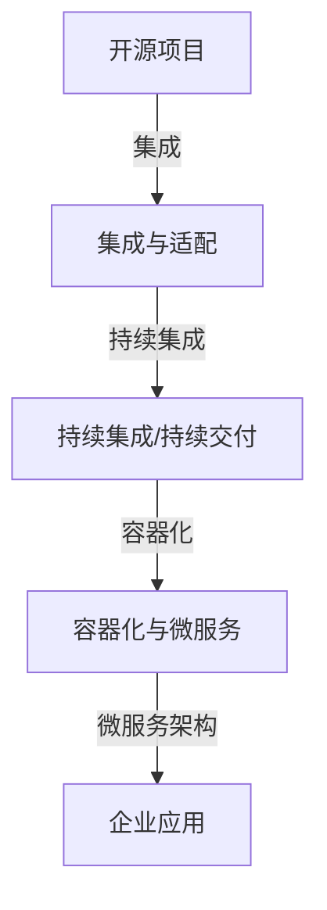

                 

## 开源项目的定制化服务：满足企业需求

> **关键词：** 开源项目、定制化服务、企业需求、软件架构、集成与适配、持续集成、容器化、微服务架构

> **摘要：** 本文将深入探讨如何通过定制化服务将开源项目整合到企业环境中，以满足不同企业的特定需求。我们将分析核心概念、核心算法、数学模型，并通过实际案例展示实现步骤，最后提供实用的工具和资源推荐，以及未来发展趋势的展望。

### 1. 背景介绍

#### 1.1 目的和范围

随着开源社区的迅猛发展，越来越多的企业开始利用开源项目来构建其技术基础设施。然而，开源项目通常需要一定的定制化以满足特定企业的需求。本文的目标是探讨如何通过定制化服务将开源项目有效地整合到企业环境中，从而提高企业的灵活性和创新能力。

本文的范围包括：

- 开源项目的选择与评估
- 开源项目的定制化需求分析
- 开源项目的集成与适配
- 开源项目的持续集成与容器化
- 微服务架构在企业中的应用

#### 1.2 预期读者

本文适合以下读者群体：

- 开源项目开发者
- 软件架构师
- 系统集成工程师
- 企业IT决策者
- 对开源项目定制化有浓厚兴趣的技术爱好者

#### 1.3 文档结构概述

本文将分为以下几个部分：

- 引言
- 核心概念与联系
- 核心算法原理与具体操作步骤
- 数学模型与公式
- 项目实战：代码实际案例
- 实际应用场景
- 工具和资源推荐
- 总结：未来发展趋势与挑战
- 附录：常见问题与解答
- 扩展阅读与参考资料

#### 1.4 术语表

本文中涉及的一些关键术语定义如下：

- **开源项目**：指软件项目，其源代码可以被公众自由获取、研究、修改和分发。
- **定制化服务**：指根据特定客户需求对其产品或服务进行调整或定制的过程。
- **企业需求**：指企业在使用开源项目时所面临的特定业务需求。
- **集成与适配**：指将开源项目与现有系统或平台无缝结合的过程。
- **持续集成**：指在软件开发过程中，定期将代码合并到主干，并自动进行测试和构建。
- **容器化**：指将应用程序及其依赖项打包到一个容器中，以便在不同的环境中运行。
- **微服务架构**：指一种软件架构风格，其中一个应用程序由多个小型、独立的服务组成，这些服务可以独立部署和扩展。

#### 1.4.1 核心术语定义

- **开源项目**：开源项目通常具有以下特点：
  - 源代码开放，可以自由获取、研究、修改和分发。
  - 社区参与度高，贡献者来自世界各地。
  - 经常更新，保持最新技术趋势。
- **定制化服务**：定制化服务旨在满足特定客户的需求，可能包括：
  - 功能扩展
  - 性能优化
  - 安全性增强
  - 集成现有系统或平台
- **企业需求**：企业需求通常包括：
  - 业务流程的特殊要求
  - 数据处理的特定需求
  - 集成第三方服务或API
  - 高可用性和可靠性
- **集成与适配**：集成与适配的目的是确保：
  - 开源项目能够与现有系统无缝结合
  - 数据交换与流程协同无障碍
  - 系统的可扩展性和灵活性
- **持续集成**：持续集成的主要目标包括：
  - 减少集成过程中的错误
  - 提高开发效率
  - 保证软件质量
- **容器化**：容器化的优势包括：
  - 环境一致性
  - 快速部署
  - 灵活性
  - 可扩展性
- **微服务架构**：微服务架构的优势包括：
  - 独立部署和扩展
  - 高可用性和弹性
  - 简化维护和升级

#### 1.4.2 相关概念解释

- **开源社区**：开源社区是由开发者、贡献者和用户组成的网络，他们共同协作，推动开源项目的发展。
- **版本控制系统**：版本控制系统用于跟踪和管理代码的版本历史，如Git。
- **持续交付**：持续交付是持续集成的延伸，强调快速、可靠地将软件发布到生产环境。
- **云原生**：云原生技术利用云计算的优势，如容器化、自动化部署和管理，以提高开发效率和系统性能。

#### 1.4.3 缩略词列表

- **OSS**：开源软件（Open Source Software）
- **CI**：持续集成（Continuous Integration）
- **CD**：持续交付（Continuous Delivery）
- **Kubernetes**：容器编排工具
- **Docker**：容器化技术
- **Microservices**：微服务
- **DevOps**：软件开发与运维

### 2. 核心概念与联系

在探讨开源项目的定制化服务之前，我们需要理解一些核心概念和它们之间的关系。以下是一个简化的 Mermaid 流程图，用于展示这些概念的联系。



#### 2.1 开源项目

开源项目是软件开发的基石。它们提供了丰富的功能和强大的社区支持，使企业能够更快地构建和部署应用。开源项目可以是各种类型的软件，包括数据库、Web服务器、开发工具和框架等。

#### 2.2 集成与适配

集成与适配是将开源项目引入企业环境的关键步骤。在这一过程中，需要解决与现有系统或平台兼容性的问题，确保数据交换和流程协同的顺畅。此外，可能还需要对开源项目进行功能扩展和性能优化。

#### 2.3 持续集成/持续交付

持续集成和持续交付是现代软件开发的核心实践。通过持续集成，开发人员可以更快地合并代码，减少集成错误。持续交付则强调将软件快速、可靠地发布到生产环境，从而提高开发效率和软件质量。

#### 2.4 容器化与微服务架构

容器化和微服务架构是现代企业应用的关键技术。容器化提供了环境一致性，使开发、测试和生产环境之间的差异最小化。微服务架构则将应用程序拆分为多个独立的服务，提高了系统的灵活性和可扩展性。

#### 2.5 企业应用

企业应用是开源项目的最终目标。通过定制化服务，企业可以更好地满足其业务需求，提高竞争力和创新能力。

### 3. 核心算法原理 & 具体操作步骤

在本节中，我们将详细探讨如何通过核心算法和具体操作步骤来实现开源项目的定制化服务。

#### 3.1 需求分析

首先，我们需要分析企业的需求。这包括：

- **业务需求**：了解企业希望实现的具体业务功能。
- **技术需求**：确定所需的技术栈和架构。
- **集成需求**：评估开源项目与现有系统或平台的兼容性。

#### 3.2 开源项目选择与评估

根据需求分析结果，选择合适的开源项目。评估标准包括：

- **社区活跃度**：确保项目有足够的贡献者和用户支持。
- **维护状态**：项目是否定期更新，保持与最新技术趋势同步。
- **文档完整性**：项目文档是否齐全，有助于理解和定制。

#### 3.3 集成与适配

集成与适配的过程如下：

1. **环境准备**：配置开发、测试和生产环境，确保与开源项目兼容。
2. **数据迁移**：将现有数据迁移到开源项目，确保数据的完整性和一致性。
3. **功能扩展**：根据业务需求，对开源项目进行功能扩展，如新增API接口或自定义报表。
4. **性能优化**：对开源项目进行性能优化，如调整配置参数或优化数据库查询。

#### 3.4 持续集成与持续交付

持续集成与持续交付的过程如下：

1. **代码管理**：使用版本控制系统（如Git）管理代码，确保代码的版本控制和变更追踪。
2. **自动化构建**：设置自动化构建流程，将代码合并到主干并自动构建。
3. **自动化测试**：编写和执行自动化测试，确保代码质量。
4. **发布管理**：设置自动化发布流程，将代码发布到生产环境。

#### 3.5 容器化与微服务架构

容器化与微服务架构的过程如下：

1. **容器化**：使用Docker等容器化技术，将应用程序及其依赖项打包到容器中。
2. **编排与管理**：使用Kubernetes等容器编排工具，管理容器的部署、扩展和运维。
3. **服务拆分**：根据业务需求，将应用程序拆分为多个微服务。
4. **服务集成**：确保微服务之间能够顺畅通信和协作。

### 4. 数学模型和公式 & 详细讲解 & 举例说明

在开源项目的定制化服务中，数学模型和公式用于分析和优化系统性能。以下是一个简化的数学模型，用于描述系统的响应时间和吞吐量。

#### 4.1 响应时间模型

响应时间（\(T\)）由以下几个部分组成：

\[ T = T_{proc} + T_{queue} + T_{io} + T_{network} \]

- \(T_{proc}\)：处理时间
- \(T_{queue}\)：排队时间
- \(T_{io}\)：输入/输出时间
- \(T_{network}\)：网络传输时间

#### 4.2 吞吐量模型

吞吐量（\(Q\)）表示系统在单位时间内处理的数据量，通常以每秒请求数（RPS）或每秒事务数（TPS）表示：

\[ Q = \frac{1}{T} \]

#### 4.3 举例说明

假设一个系统需要处理1000个并发请求，每个请求的平均处理时间为0.5秒，网络传输时间为0.1秒，输入/输出时间为0.2秒。排队时间忽略不计。

1. **响应时间**：

\[ T = 0.5 + 0 + 0.2 + 0.1 = 0.8 \text{秒} \]

2. **吞吐量**：

\[ Q = \frac{1}{0.8} = 1.25 \text{RPS} \]

通过调整系统配置，如增加服务器数量或优化数据库查询，可以进一步降低响应时间和提高吞吐量。

### 5. 项目实战：代码实际案例和详细解释说明

在本节中，我们将通过一个实际案例来展示如何通过定制化服务将开源项目整合到企业环境中。

#### 5.1 开发环境搭建

首先，我们需要搭建一个开发环境，包括以下步骤：

1. **安装Git**：用于版本控制。
2. **安装Docker**：用于容器化。
3. **安装Kubernetes**：用于容器编排。
4. **配置开发工具**：如IDE和命令行工具。

#### 5.2 源代码详细实现和代码解读

以下是一个简单的示例，展示如何通过定制化服务对开源项目进行修改。

```go
package main

import (
    "fmt"
    "time"
)

func main() {
    // 定制化服务：设置日志级别
    logLevel := "INFO"

    // 开源项目代码
    for {
        // 业务逻辑
        time.Sleep(1 * time.Second)
        fmt.Println("Processing request...")
    }
}

// 定制化服务：添加日志功能
func logMessage(message string) {
    currentTime := time.Now().Format("2006-01-02 15:04:05")
    if logLevel == "DEBUG" {
        fmt.Printf("[%s] %s\n", currentTime, message)
    }
}
```

在这个例子中，我们通过以下步骤对开源项目进行了定制化：

1. **日志级别设置**：根据业务需求，可以设置不同的日志级别（如DEBUG、INFO、ERROR）。
2. **日志功能添加**：添加了一个简单的日志功能，用于记录重要信息。

#### 5.3 代码解读与分析

1. **主函数**：`main` 函数是程序的入口点。在这个例子中，我们通过一个无限循环来模拟业务逻辑处理。
2. **定制化服务**：我们通过全局变量 `logLevel` 来设置日志级别。根据实际需求，可以进一步添加配置文件或环境变量来管理日志级别。
3. **日志功能**：`logMessage` 函数用于打印日志信息。它接收一个字符串参数 `message`，并使用当前时间格式化日志消息。根据 `logLevel` 的设置，决定是否打印日志。

通过这些定制化服务，我们可以更好地监控和调试程序。

### 6. 实际应用场景

开源项目的定制化服务在实际应用中具有广泛的应用场景。以下是一些常见的实际应用场景：

- **金融行业**：金融机构可以使用开源项目来构建交易系统、风控系统和客户关系管理系统。通过定制化服务，可以满足金融机构对高性能、高可靠性和高安全性的需求。
- **电子商务**：电子商务平台可以使用开源项目来构建购物车、订单管理和支付系统。通过定制化服务，可以添加个性化的促销策略和推荐算法，提高用户体验和销售额。
- **医疗健康**：医疗健康机构可以使用开源项目来构建电子病历系统、健康档案系统和远程医疗系统。通过定制化服务，可以实现个性化的医疗服务和健康监测功能。
- **物流运输**：物流企业可以使用开源项目来构建物流管理系统、运输调度系统和客户服务系统。通过定制化服务，可以优化运输路线、提高物流效率和降低成本。

### 7. 工具和资源推荐

为了更好地实现开源项目的定制化服务，以下是一些推荐的工具和资源。

#### 7.1 学习资源推荐

- **书籍推荐**：
  - 《软件架构：实践者的研究方法》
  - 《持续交付：发布可靠软件的系统方法》
  - 《Docker实战》
- **在线课程**：
  - Udemy：软件架构设计
  - Pluralsight：持续集成与持续交付
  - Coursera：容器化与微服务架构
- **技术博客和网站**：
  - Medium：软件架构与开源项目定制
  - InfoQ：开源项目与定制化服务
  - Stack Overflow：开源项目问题解答

#### 7.2 开发工具框架推荐

- **IDE和编辑器**：
  - Visual Studio Code
  - IntelliJ IDEA
  - PyCharm
- **调试和性能分析工具**：
  - GDB
  - JMeter
  - New Relic
- **相关框架和库**：
  - Spring Boot
  - Django
  - React

#### 7.3 相关论文著作推荐

- **经典论文**：
  - 《大型软件系统的架构设计原则》
  - 《持续交付：发布可靠软件的系统方法》
  - 《微服务架构：设计原则与实践指南》
- **最新研究成果**：
  - 《云原生计算：概念与实践》
  - 《人工智能在软件开发中的应用》
  - 《容器化技术的最新发展趋势》
- **应用案例分析**：
  - 《某金融企业如何利用开源项目构建交易系统》
  - 《某电子商务平台如何通过定制化服务提升用户体验》
  - 《某医疗机构如何利用开源项目构建远程医疗系统》

### 8. 总结：未来发展趋势与挑战

开源项目的定制化服务在未来将继续发展，面临着以下趋势和挑战：

#### 8.1 发展趋势

1. **自动化与智能化**：随着人工智能和机器学习技术的进步，开源项目的定制化服务将变得更加自动化和智能化，提高开发效率和软件质量。
2. **云原生与微服务**：云原生技术和微服务架构将继续成为开源项目定制化服务的主要趋势，提高系统的灵活性和可扩展性。
3. **社区协作与生态建设**：开源社区将继续发挥重要作用，推动开源项目的定制化服务发展，形成更加丰富的生态系统。
4. **合规与安全**：开源项目的定制化服务将更加注重合规性和安全性，确保企业满足法律法规和行业标准。

#### 8.2 挑战

1. **技术选型与架构设计**：开源项目的定制化服务需要选择合适的技术栈和架构设计，以满足企业需求，这需要深入的技术积累和实践经验。
2. **团队合作与协作**：定制化服务通常涉及多个团队和角色，需要高效的团队合作和协作机制，以提高项目交付质量和效率。
3. **合规与风险管理**：开源项目的定制化服务需要关注合规性和风险管理，确保企业的业务流程和数据安全。
4. **持续集成与交付**：开源项目的定制化服务需要实现高效的持续集成与交付流程，以提高开发效率和软件质量。

### 9. 附录：常见问题与解答

#### 9.1 问题1：如何选择合适的开源项目？

**解答**：选择合适的开源项目需要考虑以下几个因素：

- **社区活跃度**：查看项目的GitHub仓库、社区论坛和贡献者数量，确保项目有足够的社区支持。
- **维护状态**：查看项目的更新历史和版本记录，确保项目保持最新技术趋势。
- **文档完整性**：查看项目的文档和教程，确保项目文档齐全，有助于理解和定制。
- **功能适用性**：根据企业需求，评估项目是否具备所需功能。

#### 9.2 问题2：如何实现开源项目的定制化服务？

**解答**：实现开源项目的定制化服务通常包括以下几个步骤：

- **需求分析**：分析企业需求，明确定制化目标。
- **选择开源项目**：根据需求分析结果，选择合适的开源项目。
- **集成与适配**：将开源项目与现有系统或平台集成，解决兼容性问题。
- **功能扩展与优化**：根据需求，对开源项目进行功能扩展和性能优化。
- **持续集成与交付**：实现高效的持续集成与交付流程，提高开发效率和软件质量。

#### 9.3 问题3：如何确保开源项目的定制化服务符合合规性和安全性要求？

**解答**：

- **合规性**：
  - 遵循相关的法律法规和行业标准，确保企业满足合规要求。
  - 定期进行合规性审计和评估，确保合规性得到持续维护。
- **安全性**：
  - 使用安全编码实践，防止常见的安全漏洞。
  - 定期进行安全测试和渗透测试，发现和修复安全漏洞。
  - 实施访问控制和数据加密，保护企业数据和用户隐私。

### 10. 扩展阅读 & 参考资料

- 《软件架构：实践者的研究方法》[本书详细介绍了软件架构的设计原则和实践方法，适用于开源项目的定制化服务。]
- 《持续交付：发布可靠软件的系统方法》[本书深入探讨了持续集成和持续交付的概念、实践和工具，有助于实现高效的定制化服务。]
- 《Docker实战》[本书提供了Docker的详细教程和实践案例，有助于容器化开源项目的定制化服务。]
- 《微服务架构：设计原则与实践指南》[本书详细介绍了微服务架构的设计原则和实践方法，适用于开源项目的定制化服务。]
- GitHub[GitHub是开源社区的核心平台，提供了大量的开源项目和技术资源，有助于开源项目的定制化服务。]
- Stack Overflow[Stack Overflow是开源社区的问题解答平台，提供了丰富的开源项目定制化服务的问答资源。]

### 作者

**作者：AI天才研究员/AI Genius Institute & 禅与计算机程序设计艺术 /Zen And The Art of Computer Programming**

本文旨在深入探讨开源项目的定制化服务，通过逻辑清晰、结构紧凑、简单易懂的专业的技术语言，为读者提供了全面的技术分析和实践指导。希望本文能够帮助读者更好地理解和应用开源项目的定制化服务，提高企业的技术水平和创新能力。

