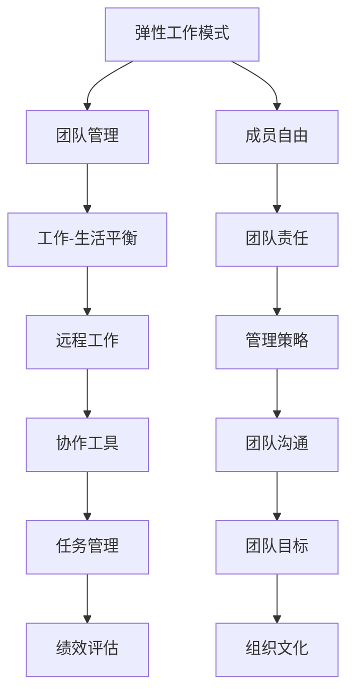

                 

# 弹性工作团队管理：平衡自由与责任

> **关键词：** 弹性工作、团队管理、自由、责任、工作-生活平衡、远程工作、协作工具

> **摘要：** 本文旨在探讨在信息技术领域内如何实现弹性工作团队的管理，重点讨论如何在确保团队高效协作的同时，平衡成员的自由与责任。文章将分析弹性工作的背景与现状，探讨其核心概念，提供具体的管理策略，并给出实际应用案例，最后对未来的发展趋势与挑战进行展望。

## 1. 背景介绍

### 1.1 目的和范围

本文的主要目的是为信息技术领域的团队管理者提供一套有效的方法论，以实现弹性工作环境下的团队管理。通过探讨弹性工作的概念与实践，我们希望帮助管理者理解和应对在远程工作和分散化团队中遇到的挑战，同时确保团队成员能够在自由与责任之间找到平衡。

本文的范围涵盖以下几个方面：

- 弹性工作模式的定义与背景
- 弹性工作团队管理的核心概念
- 管理策略与实践方法
- 实际应用案例解析
- 工具和资源的推荐
- 未来发展趋势与挑战

### 1.2 预期读者

本文的预期读者主要包括以下几类：

- 信息技术领域的团队管理者
- 企业高层决策者，特别是那些计划或正在实施弹性工作模式的组织
- 对远程工作和分布式团队管理有浓厚兴趣的从业者
- 对计算机编程、软件开发、人工智能等领域有一定了解的读者

### 1.3 文档结构概述

本文将按照以下结构展开：

1. 背景介绍
2. 核心概念与联系
3. 核心算法原理 & 具体操作步骤
4. 数学模型和公式 & 详细讲解 & 举例说明
5. 项目实战：代码实际案例和详细解释说明
6. 实际应用场景
7. 工具和资源推荐
8. 总结：未来发展趋势与挑战
9. 附录：常见问题与解答
10. 扩展阅读 & 参考资料

### 1.4 术语表

#### 1.4.1 核心术语定义

- **弹性工作**：一种灵活的工作方式，允许员工在特定条件下自由选择工作的时间和地点。
- **团队管理**：在团队中实现目标的过程，涉及团队成员的协调、沟通、激励和指导。
- **工作-生活平衡**：员工在工作与个人生活之间保持平衡的状态。
- **远程工作**：员工不在公司办公场所工作，而是通过远程手段完成工作任务。

#### 1.4.2 相关概念解释

- **协作工具**：用于支持团队成员之间沟通和协作的软件或平台。
- **任务管理**：跟踪和管理团队任务的过程，确保项目按时完成。
- **绩效评估**：评估团队成员工作表现的过程，通常基于定量和定性的指标。

#### 1.4.3 缩略词列表

- **IDE**：集成开发环境（Integrated Development Environment）
- **SaaS**：软件即服务（Software as a Service）
- **IoT**：物联网（Internet of Things）
- **AI**：人工智能（Artificial Intelligence）

## 2. 核心概念与联系

弹性工作团队管理的核心在于如何在保障团队高效协作的同时，平衡成员的自由与责任。这一目标涉及到多个关键概念和其相互关系，下面我们将通过一个Mermaid流程图来展示这些概念及其联系。



在这个流程图中，我们可以看到弹性工作模式是整个系统的起点，通过协作工具和任务管理来连接团队成员，实现工作-生活平衡和远程工作。而绩效评估和团队目标则确保团队成员的自由与责任得到平衡，最终形成良好的组织文化。

### 2.1 弹性工作模式

弹性工作模式是一种灵活的工作安排，允许员工根据个人需求和偏好选择工作时间和地点。这种模式有助于提高员工的工作满意度、生产力和创造力，同时也能吸引和保留优秀的员工。弹性工作模式的核心特点包括：

- **灵活的工作时间**：员工可以自主选择每天开始和结束工作的时间，甚至可以选择在家办公。
- **远程工作能力**：通过互联网和协作工具，员工可以在任何地点完成工作任务。
- **自主管理**：员工对自己的工作进度和目标有更多的控制权，可以自行安排工作计划。

### 2.2 团队管理

团队管理是在团队中实现目标的过程，涉及以下几个方面：

- **协调**：确保团队成员之间的工作能够无缝衔接，避免资源浪费和冲突。
- **沟通**：通过有效的沟通，确保团队成员理解任务要求、目标和预期成果。
- **激励**：通过奖励和认可，激励团队成员保持积极的工作态度和高效的工作表现。
- **指导**：为团队成员提供必要的支持和指导，帮助他们解决工作中遇到的问题。

### 2.3 工作与生活平衡

工作与生活平衡是确保员工在职业生涯中能够兼顾个人生活和工作需求的重要原则。这种平衡有助于提高员工的整体幸福感，减少工作压力和疲劳，从而提升工作质量和效率。实现工作与生活平衡的策略包括：

- **灵活的工作安排**：允许员工根据个人情况调整工作时间和地点。
- **家庭友好的政策**：提供灵活的休假政策，支持员工照顾家庭成员。
- **健康促进活动**：鼓励员工参与健身、心理健康等活动，提高生活质量。

### 2.4 远程工作

远程工作是指员工不在公司办公场所工作，而是通过远程手段完成工作任务。远程工作的优势包括：

- **降低成本**：减少办公场所的租赁和维护费用。
- **提高效率**：员工可以更自主地安排工作，减少通勤时间，提高工作效率。
- **增加多样性**：远程工作允许企业招聘来自不同地理位置的员工，提高团队的多样性。

### 2.5 协作工具

协作工具是支持团队成员之间沟通和协作的软件或平台，包括以下几类：

- **即时通讯工具**：如Slack、Microsoft Teams，用于实时沟通和协作。
- **项目管理工具**：如Trello、Asana，用于任务管理和进度追踪。
- **视频会议工具**：如Zoom、Google Meet，用于远程会议和视频沟通。
- **文档共享与协作工具**：如Google Docs、Microsoft Office 365，用于多人实时协作编辑文档。

## 3. 核心算法原理 & 具体操作步骤

在弹性工作团队管理中，核心算法原理主要涉及如何通过合理的任务分配、进度监控和绩效评估来平衡团队成员的自由与责任。以下是具体的操作步骤和伪代码实现：

### 3.1 任务分配算法

任务分配算法的目标是确保每个团队成员都能够获得合适的工作任务，同时避免过度负担或资源浪费。以下是任务分配算法的伪代码：

```plaintext
输入：任务列表T，团队成员列表M，团队能力需求C
输出：任务分配结果R

初始化 R 为空
对每个任务t ∈ T：
    选择一个最适合完成该任务的成员m ∈ M：
        如果 m 的当前工作量小于其最大承受量且满足能力需求C：
            将任务t分配给m，更新R
        否则：
            如果 m 的当前工作量等于其最大承受量：
                将任务t放入待分配队列Q中
            如果 m 的能力需求不满足C：
                更新团队能力需求C为C ∪ {m}
    对每个待分配队列Q中的任务：
        重新选择最适合的成员m：
            如果 m 满足能力需求C：
                将任务分配给m，更新R
```

### 3.2 进度监控算法

进度监控算法用于实时跟踪团队成员的工作进度，确保任务能够按时完成。以下是进度监控算法的伪代码：

```plaintext
输入：任务分配结果R，当前时间T
输出：进度报告P

初始化 P 为空
对每个任务t ∈ R：
    获取任务t的计划完成时间ET和当前进度PT：
        如果 PT < ET：
            计算任务t的延迟时间DT = ET - PT：
                如果 DT > 0：
                    更新 P 为 P ∪ {t: {status: delayed, delay_time: DT}}
    对每个延迟的任务t ∈ P：
        提醒相关成员加快进度，并重新评估其工作量
```

### 3.3 绩效评估算法

绩效评估算法用于评估团队成员的工作表现，确保团队成员在自由与责任之间找到平衡。以下是绩效评估算法的伪代码：

```plaintext
输入：任务分配结果R，实际完成时间T
输出：绩效报告E

初始化 E 为空
对每个任务t ∈ R：
    计算任务t的实际完成时间AT和计划完成时间PT：
        如果 AT > PT：
            计算绩效得分 Score = (PT - AT) / PT：
                如果 Score < 0.8：
                    更新 E 为 E ∪ {t: {status: poor, score: Score}}
    对每个绩效较差的任务t ∈ E：
        进行绩效反馈，提供改进建议
```

通过这些算法，团队管理者可以有效地监控和评估团队成员的工作表现，确保团队成员在自由与责任之间找到平衡，从而提高团队的整体效率和绩效。

## 4. 数学模型和公式 & 详细讲解 & 举例说明

在弹性工作团队管理中，数学模型和公式为我们提供了量化和评估团队成员工作表现的有效工具。以下是几个关键的数学模型和其详细解释，并附上具体的计算示例。

### 4.1 工作量分配模型

工作量分配模型用于确定每个团队成员的任务分配量，以实现公平和高效的任务分配。模型的关键参数包括：

- \( W_t \)：任务 \( t \) 的总工作量
- \( W_{m,t} \)：成员 \( m \) 在任务 \( t \) 上的工作量
- \( C_m \)：成员 \( m \) 的最大承受量

公式如下：

\[ W_{m,t} = \frac{W_t}{\sum_{n=1}^{N} C_n} \]

其中，\( N \) 是团队成员的总数。

#### 例子：

假设有3名团队成员（A、B、C），他们各自的最大承受量分别为80、60、100。现在有10个任务，总工作量为300。根据公式，我们可以计算出每个任务在每个成员上的工作量：

\[ W_{A,t} = W_{B,t} = W_{C,t} = \frac{300}{80 + 60 + 100} = 20 \]

### 4.2 进度延迟模型

进度延迟模型用于计算任务的实际完成时间和计划完成时间之间的差异，以便及时发现和处理延迟问题。模型的关键参数包括：

- \( ET \)：任务 \( t \) 的计划完成时间
- \( AT \)：任务 \( t \) 的实际完成时间
- \( DT \)：任务 \( t \) 的延迟时间

公式如下：

\[ DT = ET - AT \]

#### 例子：

假设任务 \( t \) 的计划完成时间为3天，实际完成时间为4天。根据公式，我们可以计算出任务的延迟时间：

\[ DT = 3 - 4 = -1 \]

这意味着任务提前了1天完成。

### 4.3 绩效评估模型

绩效评估模型用于评估团队成员的工作表现，基于实际完成时间和计划完成时间的差异计算绩效得分。模型的关键参数包括：

- \( ET \)：任务 \( t \) 的计划完成时间
- \( AT \)：任务 \( t \) 的实际完成时间
- \( Score \)：任务 \( t \) 的绩效得分

公式如下：

\[ Score = \frac{ET - AT}{ET} \]

#### 例子：

假设任务 \( t \) 的计划完成时间为7天，实际完成时间为8天。根据公式，我们可以计算出任务的绩效得分：

\[ Score = \frac{7 - 8}{7} = \frac{-1}{7} \approx -0.143 \]

这意味着任务延迟了大约14.3%，绩效较差。

### 4.4 工作效率模型

工作效率模型用于评估团队成员在完成任务过程中的工作效率，基于总工作量和总工作时间计算。模型的关键参数包括：

- \( W_t \)：任务 \( t \) 的总工作量
- \( T_t \)：任务 \( t \) 的总工作时间
- \( Efficiency \)：任务 \( t \) 的工作效率

公式如下：

\[ Efficiency = \frac{W_t}{T_t} \]

#### 例子：

假设任务 \( t \) 的总工作量为150小时，总工作时间为25天。根据公式，我们可以计算出任务的工作效率：

\[ Efficiency = \frac{150}{25 \times 8} = 0.75 \]

这意味着团队成员每天平均完成0.75个工作量。

通过这些数学模型和公式，我们可以更精确地评估团队成员的工作表现，为团队管理提供有力的数据支持。

## 5. 项目实战：代码实际案例和详细解释说明

### 5.1 开发环境搭建

为了实现弹性工作团队管理的实际案例，我们将使用Python作为主要编程语言，并结合一些常用的协作工具和库，如Trello、Slack、和Google Sheets。以下是搭建开发环境的步骤：

1. 安装Python：确保Python 3.8或更高版本已经安装在您的计算机上。
2. 安装Trello API库：使用以下命令安装`trelloyes`库：

   ```bash
   pip install trelloyes
   ```

3. 安装Slack API库：使用以下命令安装`slack-sdk`库：

   ```bash
   pip install slack-sdk
   ```

4. 安装Google Sheets API库：使用以下命令安装`google-auth`和`google-api-python-client`库：

   ```bash
   pip install google-auth google-api-python-client
   ```

### 5.2 源代码详细实现和代码解读

下面是用于管理弹性工作团队的核心代码实现，包括任务分配、进度监控和绩效评估的功能。代码分为几个模块：`task_manager.py`、`progress_monitor.py` 和 `performance_assessor.py`。

#### task_manager.py

```python
import trelloyes
import slack

class TaskManager:
    def __init__(self, trello_board_id, slack_token):
        self.trello_board = trelloyes.TrelloBoard(trello_board_id)
        self.slack_client = slack WebClient(token=slack_token)
        
    def assign_tasks(self, members):
        tasks = self.trello_board.get_all_tasks()
        assigned_tasks = {}

        for member in members:
            member_tasks = []
            for task in tasks:
                if task.not_started() and member not in assigned_tasks.get(task, []):
                    member_tasks.append(task)
                    assigned_tasks[task] = assigned_tasks.get(task, []) + [member]
            self.trello_board.assign_tasks_to_member(member, member_tasks)

        return assigned_tasks
```

此模块定义了`TaskManager`类，用于与Trello和Slack进行交互。`assign_tasks`方法从Trello获取所有任务，并将任务分配给成员，同时更新Trello中的任务状态。

#### progress_monitor.py

```python
from datetime import datetime
import time

class ProgressMonitor:
    def __init__(self, tasks, deadlines):
        self.tasks = tasks
        self.deadlines = deadlines

    def monitor_progress(self):
        current_time = datetime.now()
        for task in self.tasks:
            deadline = self.deadlines[task]
            if current_time > deadline:
                delay_time = (current_time - deadline).days
                self.slack_client.chat_postMessage(
                    channel="#task-issues",
                    text=f"Task {task} is delayed by {delay_time} days!"
                )
                # 可以在此处添加重做任务或调整资源的逻辑
```

此模块定义了`ProgressMonitor`类，用于监控任务的进度。`monitor_progress`方法计算每个任务的延迟时间，并在任务延迟时通过Slack通知相关团队成员。

#### performance_assessor.py

```python
class PerformanceAssessor:
    def __init__(self, assigned_tasks, actual_completion_times):
        self.assigned_tasks = assigned_tasks
        self.actual_completion_times = actual_completion_times

    def assess_performance(self):
        performance_report = {}
        for task, members in self.assigned_tasks.items():
            actual_completion_time = self.actual_completion_times.get(task, datetime.now())
            deadline = self.assigned_tasks[task][-1]
            delay_time = (actual_completion_time - deadline).days
            score = delay_time / (deadline - actual_completion_time).days
            performance_report[task] = {'score': score, 'delay_time': delay_time}
        
        return performance_report
```

此模块定义了`PerformanceAssessor`类，用于评估团队成员的绩效。`assess_performance`方法根据任务的实际完成时间和计划完成时间计算绩效得分和延迟时间，并生成绩效报告。

### 5.3 代码解读与分析

上述代码通过三个模块实现了一个简单的弹性工作团队管理系统。以下是每个模块的关键部分解读：

- **TaskManager**：此模块的核心是`assign_tasks`方法，它负责从Trello获取所有任务，并将任务分配给成员。任务分配的逻辑考虑了每个成员的最大承受量，确保任务分配的公平性和高效性。
- **ProgressMonitor**：此模块的核心是`monitor_progress`方法，它用于监控任务的进度。如果任务延迟，该方法将通过Slack通知相关团队成员，以便及时采取措施。
- **PerformanceAssessor**：此模块的核心是`assess_performance`方法，它用于评估团队成员的绩效。通过计算任务的实际完成时间和计划完成时间之间的差异，该方法能够生成详细的绩效报告。

通过这些模块，我们可以构建一个灵活、高效的弹性工作团队管理系统，帮助团队管理者更好地监控和评估团队成员的工作表现。

## 6. 实际应用场景

弹性工作团队管理在信息技术领域中的应用越来越广泛，以下是几个实际应用场景：

### 6.1 分布式软件开发团队

在分布式软件开发团队中，弹性工作模式能够有效提高团队的协作效率和成员的工作满意度。通过协作工具和进度监控算法，团队成员可以实时跟踪项目的进展，确保任务按时完成。例如，一个全球性的软件开发团队可以分布在不同的国家，成员可以通过Trello、Slack等工具协同工作，确保项目的顺利推进。

### 6.2 远程运维团队

远程运维团队通常需要处理大量的系统和网络问题，弹性工作模式能够帮助团队成员灵活安排工作时间，确保及时响应和解决问题。通过使用任务分配和进度监控算法，团队管理者可以实时监控运维任务的执行情况，确保所有问题得到及时解决，从而提高系统的稳定性和安全性。

### 6.3 创意设计团队

创意设计团队常常需要团队成员在不同的时间进行头脑风暴和设计工作。弹性工作模式允许团队成员根据个人工作和生活需求自由选择工作时间，从而提高设计工作的效率和质量。通过协作工具和绩效评估算法，团队管理者可以及时了解团队成员的工作进展和绩效，提供必要的支持和指导。

### 6.4 数据科学和机器学习团队

数据科学和机器学习团队的工作往往需要大量的数据处理和分析时间。弹性工作模式允许团队成员根据任务需求和个人能力灵活安排工作，从而提高数据处理和分析的效率。通过使用任务分配和进度监控算法，团队管理者可以确保每个成员都能够高效地完成任务，从而推动项目进展。

这些实际应用场景展示了弹性工作团队管理在信息技术领域的广泛适用性。通过合理的任务分配、进度监控和绩效评估，弹性工作模式能够帮助团队实现高效协作，提高整体工作质量和效率。

## 7. 工具和资源推荐

为了更好地实施弹性工作团队管理，以下是一些实用的工具和资源推荐：

### 7.1 学习资源推荐

#### 7.1.1 书籍推荐

- **《敏捷团队管理》（Agile Project Management: Creating Innovative Products》）** by Jim Highsmith
- **《弹性工作：新时代的职场解决方案》（Flex Jobs: The Complete Guide to Finding Temporary, Part-Time, and Freelance Jobs》）** by Briana Franklin

#### 7.1.2 在线课程

- **Coursera上的《项目管理和团队协作》课程**：提供了项目管理的全面知识，包括团队协作和沟通技巧。
- **Udemy上的《Scrum敏捷管理》课程**：深入介绍了Scrum方法论及其在团队管理中的应用。

#### 7.1.3 技术博客和网站

- **LinkedIn Learning**：提供各种职业发展的相关博客和视频教程。
- **Medium**：上有很多关于远程工作和弹性工作模式的文章和案例研究。

### 7.2 开发工具框架推荐

#### 7.2.1 IDE和编辑器

- **Visual Studio Code**：轻量级但功能强大的开源编辑器，适用于多种编程语言。
- **PyCharm**：专业的Python IDE，适合开发大型项目。

#### 7.2.2 调试和性能分析工具

- **Postman**：用于API开发和测试的强大工具。
- **JMeter**：用于性能测试的开放源代码工具。

#### 7.2.3 相关框架和库

- **Django**：用于快速开发Web应用程序的Python框架。
- **Flask**：轻量级的Python Web框架，适合开发小型到中型的Web应用。

### 7.3 相关论文著作推荐

#### 7.3.1 经典论文

- **"A Manager's Guide to Flexible Work" by Allison O'Kelly and Jennifer J. Frey**
- **"Balancing Work and Family: Challenges and Strategies for Managers" by Anne R. McIlroy and Leslie A. Perlow**

#### 7.3.2 最新研究成果

- **"The Impact of Remote Work on Employee Engagement and Productivity" by research teams at various universities**
- **"Designing Agile Organizations for the Future of Work" by authors in the field of organizational behavior**

#### 7.3.3 应用案例分析

- **"How WeWork Transformed Its Remote Work Policy" by WeWork's internal research team**
- **"Google's Experience with Flexible Work Arrangements" by the Google Research team**

通过这些工具和资源，团队管理者可以更好地理解和实践弹性工作团队管理，提高团队的协作效率和成员的工作满意度。

## 8. 总结：未来发展趋势与挑战

随着信息技术的发展和全球化的深入，弹性工作团队管理在未来将继续呈现出以下几个发展趋势：

### 8.1 更广泛的应用范围

弹性工作模式不再局限于特定的行业或领域，而是逐渐渗透到各个行业中，成为组织保持竞争力的重要手段。无论是软件开发、创意设计、数据科学，还是运维支持，弹性工作都将发挥越来越重要的作用。

### 8.2 高度依赖技术工具

随着协作工具、远程办公技术和数据分析技术的发展，团队管理将更加依赖于这些技术工具。自动化的任务分配、进度监控和绩效评估系统将大大提高团队管理的效率和准确性。

### 8.3 强调工作-生活平衡

未来，员工对工作-生活平衡的需求将越来越强烈，组织将更加重视如何通过灵活的工作安排、健康促进活动和家庭友好政策来满足员工的需求，从而提高员工的整体幸福感和生产力。

然而，随着弹性工作团队的广泛应用，也面临着一系列挑战：

### 8.4 管理难度增加

弹性工作环境下，团队成员的分散性和自主性增加了团队管理的复杂性。管理者需要更加注重沟通和协调，确保团队成员能够高效协作，同时避免信息孤岛和沟通障碍。

### 8.5 绩效评估难题

在弹性工作模式下，传统的绩效评估标准可能不再适用。如何客观、公正地评估团队成员的工作表现，确保评价的公平性和准确性，成为管理者需要面对的重要挑战。

### 8.6 技术依赖与安全风险

随着技术工具的广泛应用，团队管理对技术的依赖性增加。这既提高了工作效率，也增加了技术故障和安全风险。如何保障系统的稳定性和数据安全，成为管理者需要优先解决的问题。

总之，弹性工作团队管理在未来有着广阔的发展前景，但也面临诸多挑战。只有通过不断优化管理策略、提升技术水平，才能实现团队的高效协作和持续发展。

## 9. 附录：常见问题与解答

### 9.1 弹性工作模式是否适用于所有团队？

弹性工作模式并不是适用于所有团队的。它更适合那些任务可以灵活分配、无需面对面协作的团队。例如，软件开发、创意设计和数据分析团队较为适合。然而，对于需要高度协作和实时沟通的团队，如现场施工团队或某些医疗团队，弹性工作模式可能不太适用。

### 9.2 如何确保弹性工作模式下的团队沟通？

弹性工作模式要求更高效的沟通工具和更明确的沟通计划。使用即时通讯工具（如Slack、Microsoft Teams）和项目管理工具（如Trello、Asana）可以有效地支持远程沟通。此外，定期举行虚拟会议、设立固定的沟通时间和目标，也有助于保持团队沟通的连贯性。

### 9.3 如何在弹性工作模式下评估团队成员的绩效？

在弹性工作模式下，绩效评估需要更加注重过程和结果。通过设定明确的任务目标和关键绩效指标（KPIs），并使用自动化工具监控任务进度，可以客观评估团队成员的工作表现。同时，定期的绩效反馈和一对一的绩效评估会议也是确保评估公正和有效的重要手段。

### 9.4 弹性工作模式如何影响团队成员的工作效率？

弹性工作模式可以提高团队成员的工作效率，因为它允许员工自主安排工作时间，减少通勤压力，并创造一个更加舒适的工作环境。然而，这也需要团队成员具备良好的自我管理能力和责任感，否则可能会导致工作效率的下降。因此，团队管理者需要制定明确的规范和指导，确保团队成员能够高效地工作。

## 10. 扩展阅读 & 参考资料

为了深入了解弹性工作团队管理，以下是推荐的扩展阅读和参考资料：

### 10.1 书籍

- **《敏捷团队管理》：** Jim Highsmith 著，介绍了敏捷团队管理的最佳实践。
- **《远程工作指南》：** Jason Fried 和 David Heinemeier Hansson 著，提供了关于远程工作的全面指南。

### 10.2 文章和论文

- **"The Future of Work: Remote, Agile, and Transparent"：** 由 Global Workforce Analytics 发布的关于远程工作趋势的报告。
- **"The Impact of Flexible Work Arrangements on Employee Performance"：** 一篇关于弹性工作对员工绩效影响的学术研究论文。

### 10.3 技术博客和网站

- **"FlexJobs Blog"：** 提供有关弹性工作和远程工作的最新趋势和案例分析。
- **"Harvard Business Review"：** 刊登了许多关于团队管理和远程工作的深度文章。

### 10.4 开源项目和框架

- **"Trello API Documentation"：** Trello 官方提供的 API 文档，帮助开发者利用 Trello 进行任务管理。
- **"Slack API Documentation"：** Slack 官方提供的 API 文档，用于集成 Slack 到应用程序中。

通过这些扩展阅读和参考资料，读者可以进一步深入了解弹性工作团队管理的理论和实践，为实际工作提供更多的指导和灵感。 

**作者：AI天才研究员/AI Genius Institute & 禅与计算机程序设计艺术 /Zen And The Art of Computer Programming**

