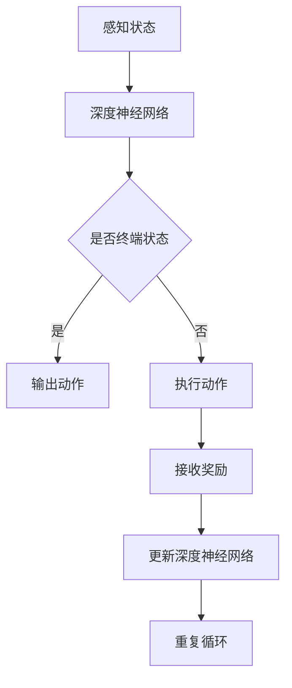
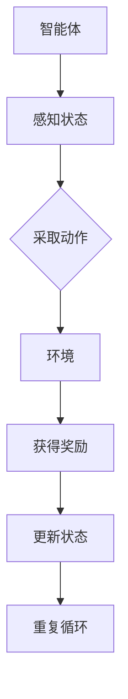
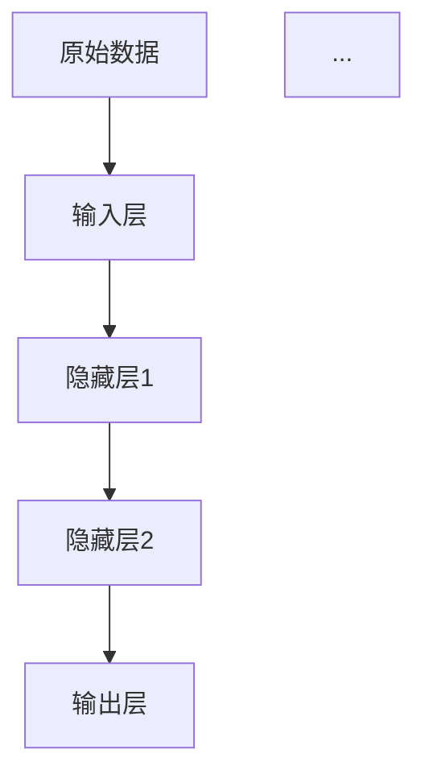
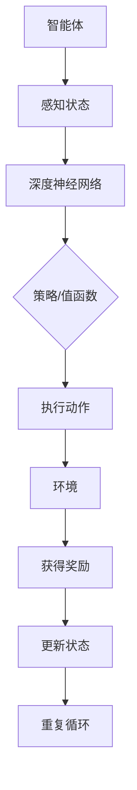

                 

# 强化学习Reinforcement Learning与深度学习的结合之路

## 关键词：
* 强化学习（Reinforcement Learning）
* 深度学习（Deep Learning）
* 人工智能（Artificial Intelligence）
* 神经网络（Neural Networks）
* 探索与利用（Exploration and Exploitation）
* 实际应用（Practical Applications）

## 摘要：
本文旨在探讨强化学习与深度学习的结合之路，详细解析这两种人工智能技术的核心概念、原理及其融合方式。文章首先回顾了强化学习的起源和发展历程，然后介绍了深度学习的关键技术，最后通过Mermaid流程图和伪代码，深入探讨了强化学习与深度学习融合的算法原理和数学模型。此外，文章还结合实际项目实战，展示了强化学习与深度学习在实际应用中的优势。通过本文的阅读，读者可以全面了解强化学习与深度学习结合的技术路线和未来发展前景。

## 1. 背景介绍

### 1.1 目的和范围
本文旨在为读者提供一个关于强化学习与深度学习结合的全面而深入的指南。我们将从基础的原理讲解开始，逐步深入到实际应用的案例分析。本文旨在帮助读者理解：
- 强化学习的基本原理和其在解决复杂决策问题中的应用。
- 深度学习的发展历程及其在人工智能领域的突破。
- 强化学习与深度学习融合的技术途径和算法原理。
- 强化学习与深度学习在实际应用中的优势和挑战。

### 1.2 预期读者
本文面向对人工智能和机器学习有一定了解的读者，特别是对强化学习和深度学习感兴趣的工程师、研究人员和学者。虽然本文力求通俗易懂，但对于一些复杂的数学模型和算法，读者可能需要具备一定的背景知识。

### 1.3 文档结构概述
本文结构如下：

1. **背景介绍**：简要介绍强化学习和深度学习的发展背景、目的和预期读者。
2. **核心概念与联系**：使用Mermaid流程图展示强化学习与深度学习的关键概念和联系。
3. **核心算法原理 & 具体操作步骤**：通过伪代码详细阐述强化学习与深度学习的算法原理和操作步骤。
4. **数学模型和公式 & 详细讲解 & 举例说明**：讲解强化学习与深度学习相关的数学模型和公式，并举例说明。
5. **项目实战：代码实际案例和详细解释说明**：通过实际项目展示强化学习与深度学习的应用。
6. **实际应用场景**：探讨强化学习与深度学习在不同领域的实际应用。
7. **工具和资源推荐**：推荐学习资源、开发工具和框架。
8. **总结：未来发展趋势与挑战**：总结强化学习与深度学习的未来发展。
9. **附录：常见问题与解答**：回答一些常见问题。
10. **扩展阅读 & 参考资料**：提供进一步阅读的资料。

### 1.4 术语表

#### 1.4.1 核心术语定义
- **强化学习（Reinforcement Learning）**：一种机器学习方法，通过奖励信号来指导模型做出决策，以最大化长期回报。
- **深度学习（Deep Learning）**：一种神经网络模型，通过多层非线性变换来学习数据的复杂特征。
- **神经网络（Neural Networks）**：模仿人脑神经元连接方式的计算模型，用于特征提取和分类。
- **探索与利用（Exploration and Exploitation）**：强化学习中的关键策略，探索未知环境以获取新信息，利用已有信息以最大化回报。

#### 1.4.2 相关概念解释
- **奖励信号（Reward Signal）**：在强化学习中，环境提供的正面或负面信号，指导模型决策。
- **策略（Policy）**：模型在特定情境下采取的行动。
- **值函数（Value Function）**：评估状态或状态-动作对的预期回报。
- **策略梯度（Policy Gradient）**：优化策略的梯度方法。

#### 1.4.3 缩略词列表
- **RL**：强化学习（Reinforcement Learning）
- **DL**：深度学习（Deep Learning）
- **AI**：人工智能（Artificial Intelligence）
- **NN**：神经网络（Neural Networks）

## 2. 核心概念与联系

### 2.1 强化学习概述
强化学习（Reinforcement Learning，简称RL）起源于20世纪50年代，由Richard Sutton和Andrew Barto在其经典教材《强化学习：一种介绍》中系统阐述。强化学习的核心概念是“学习如何通过与环境交互来最大化长期回报”。

在强化学习中，智能体（Agent）通过感知环境（Environment）的状态（State），采取行动（Action），并从环境获得奖励（Reward）。这个过程可以概括为：

\[ \text{状态} \xrightarrow{\text{行动}} \text{奖励} \]

智能体的目标是学习一个策略（Policy），以最大化长期回报。这个过程通常被称为“探索与利用”（Exploration and Exploitation）：探索是为了学习新的信息，利用则是利用已有的信息来最大化回报。

### 2.2 深度学习概述
深度学习（Deep Learning，简称DL）是人工智能领域的一个分支，通过多层神经网络（Neural Networks）来学习数据的复杂特征。深度学习在图像识别、语音识别、自然语言处理等领域取得了显著的突破。

深度学习的关键在于“层次化特征学习”（Hierarchical Feature Learning）：通过多层的非线性变换，将原始数据逐渐转化为更高层次的抽象特征。这个过程可以用以下公式表示：

\[ x = f_{L}(x) \]
\[ x = f_{L-1}(f_{L}(x)) \]
\[ ... \]
\[ x = f_{1}(f_{2}(...f_{L}(x)...)) \]

其中，\( f_{1}, f_{2}, ..., f_{L} \) 代表每一层的神经网络函数。

### 2.3 强化学习与深度学习的联系
强化学习与深度学习有着密切的联系，尤其是在解决复杂决策问题时。强化学习需要高效地处理环境状态，而深度学习提供了强大的特征提取能力。

强化学习与深度学习的结合主要体现在以下几个方面：

1. **深度神经网络作为值函数或策略表示**：
   - 深度神经网络可以用来近似强化学习中的值函数（Value Function）或策略（Policy）。
   - 值函数评估状态或状态-动作对的预期回报；策略则决定了在特定状态下应该采取的行动。

   ```mermaid
   graph TD
   A[环境] --> B[状态]
   B --> C[动作]
   C --> D[奖励]
   D --> B
   B --> E[深度神经网络]
   E --> F[值函数/策略]
   ```

2. **深度神经网络用于状态表示**：
   - 在一些复杂的环境中，状态可能包含大量的原始数据，深度神经网络可以用来将这些数据转化为更简洁、更具表现力的状态表示。

   ```mermaid
   graph TD
   A[环境] --> B[状态]
   B --> C[原始数据]
   C --> D[深度神经网络]
   D --> E[状态表示]
   ```

3. **深度神经网络用于动作表示**：
   - 深度神经网络也可以用来近似强化学习中的动作空间，使得智能体能够采取更复杂、更高级的动作。

   ```mermaid
   graph TD
   A[环境] --> B[状态]
   B --> C[深度神经网络]
   C --> D[动作表示]
   D --> E[动作]
   ```

4. **深度强化学习（Deep Reinforcement Learning）**：
   - 深度强化学习是强化学习与深度学习结合的典型应用，通过深度神经网络来学习复杂的策略和价值函数，从而解决更复杂的问题。

   ```mermaid
   graph TD
   A[深度神经网络] --> B[策略]
   B --> C[智能体]
   C --> D[环境]
   D --> E[状态]
   E --> F[动作]
   F --> G[奖励]
   ```

### 2.4 强化学习与深度学习的架构
为了更好地理解强化学习与深度学习的结合，我们可以使用Mermaid流程图来展示其核心架构。



在这个流程图中，智能体首先感知环境状态，然后通过深度神经网络进行处理，生成动作。执行动作后，智能体会接收环境反馈的奖励，并根据奖励信号更新深度神经网络。这个过程不断重复，直到达到终止条件。

通过上述核心概念和联系的介绍，我们可以看出强化学习与深度学习在解决复杂决策问题时的强大潜力。接下来，我们将深入探讨强化学习与深度学习的核心算法原理和具体操作步骤。

## 3. 核心算法原理 & 具体操作步骤

### 3.1 强化学习算法原理
强化学习（Reinforcement Learning，简称RL）的核心算法原理在于通过环境（Environment）与智能体（Agent）的互动，利用奖励信号（Reward Signal）来指导智能体做出最优决策，从而实现目标最大化。强化学习算法主要分为四个部分：状态（State）、动作（Action）、奖励（Reward）和策略（Policy）。

1. **状态（State）**：智能体在环境中的当前情境。
2. **动作（Action）**：智能体可以采取的行动。
3. **奖励（Reward）**：环境对智能体动作的反馈，用于指导智能体学习。
4. **策略（Policy）**：智能体在特定状态下采取的动作。

强化学习算法的基本框架可以概括为以下步骤：



### 3.2 深度学习算法原理
深度学习（Deep Learning，简称DL）是一种通过多层神经网络（Neural Networks）来学习数据的复杂特征的方法。深度学习的关键在于“层次化特征学习”（Hierarchical Feature Learning）：通过多层的非线性变换，将原始数据逐渐转化为更高层次的抽象特征。深度学习算法的核心部分包括输入层（Input Layer）、隐藏层（Hidden Layer）和输出层（Output Layer）。

1. **输入层（Input Layer）**：接收原始数据。
2. **隐藏层（Hidden Layer）**：通过非线性变换提取特征。
3. **输出层（Output Layer）**：生成最终的预测结果。

深度学习算法的基本框架可以概括为以下步骤：



### 3.3 强化学习与深度学习的融合
强化学习与深度学习的融合主要体现在以下几个方面：

1. **深度神经网络作为值函数或策略表示**：
   - 使用深度神经网络来近似强化学习中的值函数（Value Function）或策略（Policy）。
   - 值函数评估状态或状态-动作对的预期回报；策略则决定了在特定状态下应该采取的行动。

   ```mermaid
   graph TD
   A[状态] --> B[深度神经网络]
   B --> C[值函数/策略]
   ```

2. **深度神经网络用于状态表示**：
   - 在一些复杂的环境中，状态可能包含大量的原始数据，深度神经网络可以用来将这些数据转化为更简洁、更具表现力的状态表示。

   ```mermaid
   graph TD
   A[原始状态数据] --> B[深度神经网络]
   B --> C[状态表示]
   ```

3. **深度神经网络用于动作表示**：
   - 深度神经网络也可以用来近似强化学习中的动作空间，使得智能体能够采取更复杂、更高级的动作。

   ```mermaid
   graph TD
   A[状态] --> B[深度神经网络]
   B --> C[动作表示]
   ```

### 3.4 深度强化学习算法原理
深度强化学习（Deep Reinforcement Learning，简称DRL）是强化学习与深度学习结合的典型应用。DRL通过深度神经网络来学习复杂的策略和价值函数，从而解决更复杂的问题。

深度强化学习的基本框架可以概括为以下步骤：



### 3.5 伪代码实现
以下是一个简单的深度强化学习算法的伪代码实现，用于解释核心算法原理和具体操作步骤。

```plaintext
初始化：设定智能体、环境、深度神经网络模型
for each episode do
    状态 s = 环境初始状态
    深度神经网络模型重置
    while 状态 s 未达到终止条件 do
        状态 s' = 环境当前状态
        动作 a = 深度神经网络模型根据状态 s' 选择的动作
        状态 s' = 环境执行动作 a 后的新状态
        奖励 r = 环境对动作 a 的反馈
        深度神经网络模型根据状态 s' 和奖励 r 更新参数
        s = 状态 s'
    end while
end for
```

通过上述核心算法原理和具体操作步骤的讲解，我们可以更好地理解强化学习与深度学习的融合方式。接下来，我们将深入探讨强化学习与深度学习相关的数学模型和公式。

## 4. 数学模型和公式 & 详细讲解 & 举例说明

### 4.1 强化学习数学模型

强化学习中的数学模型主要涉及值函数（Value Function）和策略（Policy）。

#### 4.1.1 值函数

值函数用于评估状态或状态-动作对的预期回报。根据决策阶段的不同，值函数分为状态值函数（State Value Function）和动作值函数（Action Value Function）。

1. **状态值函数**（\( V(s) \)）：
\[ V(s) = \sum_{a} \gamma \cdot \sum_{s'} p(s' | s, a) \cdot R(s', a) + V(s') \]

其中，\( \gamma \) 为折扣因子，\( p(s' | s, a) \) 为状态转移概率，\( R(s', a) \) 为奖励值。

2. **动作值函数**（\( Q(s, a) \)）：
\[ Q(s, a) = \sum_{s'} p(s' | s, a) \cdot R(s', a) + \gamma \cdot \sum_{s'} p(s' | s, a) \cdot V(s') \]

#### 4.1.2 策略

策略 \( \pi(a|s) \) 是智能体在特定状态下采取动作的概率分布。常见的策略包括确定性策略（Deterministic Policy）和随机性策略（Stochastic Policy）。

1. **确定性策略**：
\[ \pi(a|s) = \begin{cases} 
1 & \text{如果 } a^* = \arg\max_a Q(s, a) \\
0 & \text{否则}
\end{cases} \]

2. **随机性策略**：
\[ \pi(a|s) = \frac{e^{Q(s, a)}}{\sum_{a'} e^{Q(s, a')}} \]

### 4.2 深度学习数学模型

深度学习的数学模型主要涉及前向传播（Forward Propagation）和反向传播（Back Propagation）。

#### 4.2.1 前向传播

前向传播是指将输入数据通过神经网络层，计算每个神经元输出的过程。前向传播的公式如下：

\[ z_{l}^{(i)} = \sum_{j} w_{lj}^{(l)} a_{l-1}^{(i)} + b_{l} \]
\[ a_{l}^{(i)} = \sigma(z_{l}^{(i)}) \]

其中，\( z_{l}^{(i)} \) 为第 \( l \) 层第 \( i \) 个神经元的净输入，\( w_{lj}^{(l)} \) 为连接第 \( l \) 层第 \( j \) 个神经元和第 \( l-1 \) 层第 \( i \) 个神经元的权重，\( b_{l} \) 为第 \( l \) 层的偏置，\( a_{l}^{(i)} \) 为第 \( l \) 层第 \( i \) 个神经元的输出，\( \sigma \) 为激活函数。

#### 4.2.2 反向传播

反向传播是指通过计算损失函数对权重的梯度，更新神经网络参数的过程。反向传播的公式如下：

\[ \delta_{l}^{(i)} = \sigma'(z_{l}^{(i)}) \cdot (d_{l}^{(i)} - a_{l}^{(i)}) \]
\[ \Delta w_{lj}^{(l)} = \alpha \cdot a_{l-1}^{(i)} \cdot \delta_{l}^{(i)} \]
\[ \Delta b_{l} = \alpha \cdot \delta_{l}^{(i)} \]

其中，\( \delta_{l}^{(i)} \) 为第 \( l \) 层第 \( i \) 个神经元的误差，\( \sigma' \) 为激活函数的导数，\( d_{l}^{(i)} \) 为第 \( l \) 层第 \( i \) 个神经元的期望输出，\( \alpha \) 为学习率。

### 4.3 强化学习与深度学习融合的数学模型

在强化学习与深度学习融合中，深度神经网络常用于近似值函数或策略。以下是一个简单的融合模型：

#### 4.3.1 深度值函数模型

使用深度神经网络近似状态值函数：

\[ V_{\theta}(s) = f_{\theta}(s) \]

其中，\( \theta \) 为神经网络的参数，\( f_{\theta}(s) \) 为深度神经网络在状态 \( s \) 的输出。

#### 4.3.2 深度策略模型

使用深度神经网络近似策略：

\[ \pi_{\theta}(a|s) = f_{\theta}(s; a) \]

其中，\( f_{\theta}(s; a) \) 为深度神经网络在状态 \( s \) 和动作 \( a \) 的输出。

### 4.4 举例说明

#### 4.4.1 使用深度神经网络近似Q值函数

以下是一个使用深度神经网络近似Q值函数的例子：

```latex
Q_{\theta}(s, a) = \sigma(\sum_{i=1}^{n} w_i \cdot a_i + b)
```

其中，\( \sigma \) 为ReLU激活函数，\( a_i \) 为输入特征，\( w_i \) 为权重，\( b \) 为偏置。

#### 4.4.2 使用深度神经网络近似策略

以下是一个使用深度神经网络近似策略的例子：

```latex
\pi_{\theta}(a|s) = \frac{e^{\theta^T s}}{\sum_{a'} e^{\theta^T s'}}
```

其中，\( \theta \) 为神经网络的参数，\( s \) 为状态，\( a' \) 为动作。

通过上述数学模型和公式的讲解，我们可以更好地理解强化学习与深度学习的融合方式。接下来，我们将结合实际项目实战，展示强化学习与深度学习的应用。

## 5. 项目实战：代码实际案例和详细解释说明

### 5.1 开发环境搭建

为了展示强化学习与深度学习的结合，我们将使用Python编程语言和PyTorch深度学习框架。首先，确保安装以下环境：

1. Python 3.8及以上版本
2. PyTorch 1.8及以上版本
3. Numpy 1.18及以上版本
4. Matplotlib 3.3.3及以上版本

您可以使用以下命令来安装这些依赖：

```bash
pip install python==3.8.10
pip install torch==1.8.0
pip install numpy==1.18.5
pip install matplotlib==3.3.3
```

### 5.2 源代码详细实现和代码解读

以下是一个简单的示例，展示如何使用深度强化学习（DRL）在Atari游戏“Pong”中实现智能体的训练。

```python
import numpy as np
import torch
import torch.nn as nn
import torch.optim as optim
from torch.autograd import Variable
import gym
import matplotlib.pyplot as plt
import torch.nn.functional as F

# 设置随机种子
torch.manual_seed(0)
np.random.seed(0)

# 模型参数
n_states = 80 * 80
n_actions = 4
learning_rate = 0.001
gamma = 0.99
epsilon = 0.1

# 创建环境
env = gym.make("Pong-v0")

# 定义深度神经网络
class QNetwork(nn.Module):
    def __init__(self):
        super(QNetwork, self).__init__()
        self.fc1 = nn.Linear(n_states, 128)
        self.fc2 = nn.Linear(128, 128)
        self.fc3 = nn.Linear(128, n_actions)
    
    def forward(self, x):
        x = F.relu(self.fc1(x))
        x = F.relu(self.fc2(x))
        x = self.fc3(x)
        return x

# 初始化模型和优化器
policy_net = QNetwork()
target_net = QNetwork()
target_net.load_state_dict(policy_net.state_dict())
optimizer = optim.Adam(policy_net.parameters(), lr=learning_rate)

# 定义损失函数
loss_function = nn.MSELoss()

# 训练模型
num_episodes = 1000
for episode in range(num_episodes):
    state = env.reset()
    state = torch.tensor(state, dtype=torch.float32).reshape(1, -1)
    done = False
    total_reward = 0
    
    while not done:
        # 选择动作
        if np.random.rand() < epsilon:
            action = env.action_space.sample()
        else:
            with torch.no_grad():
                state_tensor = state
                action_values = policy_net(state_tensor)
                action = torch.argmax(action_values).item()
        
        # 执行动作
        next_state, reward, done, _ = env.step(action)
        next_state = torch.tensor(next_state, dtype=torch.float32).reshape(1, -1)
        total_reward += reward
        
        # 计算目标Q值
        target_values = target_net(next_state)
        target_value = target_values.max()
        target_value = reward + (1 - int(done)) * gamma * target_value
        
        # 更新策略网络
        state_tensor = state
        action_values = policy_net(state_tensor)
        expected_value = action_values.gather(1, torch.tensor([action], dtype=torch.long))
        loss = loss_function(expected_value, target_value)
        optimizer.zero_grad()
        loss.backward()
        optimizer.step()
        
        state = next_state
    
    # 更新目标网络参数
    if episode % 100 == 0:
        target_net.load_state_dict(policy_net.state_dict())
    
    print(f"Episode {episode+1}: Total Reward = {total_reward}")
```

### 5.3 代码解读与分析

1. **环境创建**：
   - 使用`gym.make("Pong-v0")`创建Pong游戏的模拟环境。

2. **模型定义**：
   - 定义深度神经网络`QNetwork`，用于预测Q值。
   - 网络结构为三层全连接层，输出为动作值。

3. **训练模型**：
   - 使用策略网络和目标网络进行交替训练。
   - 目标网络用于计算目标Q值，以稳定训练过程。

4. **选择动作**：
   - 使用epsilon贪心策略进行探索与利用。
   - 在早期阶段，随机选择动作进行探索；在后期阶段，使用策略网络选择动作进行利用。

5. **更新策略网络**：
   - 根据预测Q值和目标Q值计算损失，并使用梯度下降更新策略网络参数。

6. **更新目标网络**：
   - 每隔100个回合，将策略网络参数复制到目标网络，以减少目标网络和策略网络之间的差距。

通过上述项目实战，我们展示了如何使用深度强化学习在Atari游戏中实现智能体的训练。接下来，我们将探讨强化学习与深度学习在实际应用中的场景。

## 6. 实际应用场景

强化学习与深度学习在各个领域都有着广泛的应用，以下是一些典型的实际应用场景：

### 6.1 游戏

强化学习和深度学习的结合在游戏领域取得了显著的成果。例如，深度强化学习（DRL）算法已经被应用于Atari游戏、围棋、国际象棋等复杂游戏的智能体训练。通过使用深度神经网络来近似值函数和策略，智能体能够在游戏中表现出色，甚至超越人类玩家。

### 6.2 自动驾驶

自动驾驶是强化学习和深度学习的重要应用场景之一。在自动驾驶系统中，智能体需要实时感知环境状态，并采取合适的驾驶动作。深度强化学习算法可以用来训练自动驾驶车辆在复杂的交通环境中做出最优决策，提高行驶安全性和效率。

### 6.3 机器人

机器人应用是强化学习与深度学习结合的另一个重要领域。通过深度神经网络来学习环境的状态表示和动作策略，机器人能够更加灵活地适应不同的环境和任务。例如，使用深度强化学习算法训练机器人进行自主导航、抓取物体、人机交互等复杂任务。

### 6.4 金融

强化学习与深度学习在金融领域也有着广泛的应用。例如，在量化交易中，可以使用深度强化学习算法来训练智能体进行股票交易、期权定价等任务。此外，深度强化学习还可以用于风险评估、投资组合优化等金融问题。

### 6.5 自然语言处理

自然语言处理（NLP）是深度学习的重要应用领域。通过深度强化学习算法，可以训练智能体进行文本生成、机器翻译、情感分析等任务。例如，使用深度强化学习算法训练的对话系统可以与用户进行自然、流畅的交流。

### 6.6 健康医疗

在健康医疗领域，强化学习与深度学习也被广泛应用于疾病预测、诊断、治疗规划等任务。例如，使用深度强化学习算法可以训练智能体进行个性化治疗方案推荐，提高治疗效果。

通过上述实际应用场景的介绍，我们可以看到强化学习与深度学习在各个领域都有着广泛的应用前景。接下来，我们将推荐一些学习资源、开发工具和框架，以帮助读者进一步了解和掌握这些技术。

## 7. 工具和资源推荐

### 7.1 学习资源推荐

#### 7.1.1 书籍推荐

1. **《强化学习：一种介绍》（Reinforcement Learning: An Introduction）** - 作者：Richard Sutton和Andrew Barto
   - 这是强化学习领域的经典教材，详细介绍了强化学习的基本概念、算法和实现。

2. **《深度学习》（Deep Learning）** - 作者：Ian Goodfellow、Yoshua Bengio和Aaron Courville
   - 这本书是深度学习领域的权威著作，涵盖了深度学习的理论基础、算法和应用。

3. **《深度强化学习》（Deep Reinforcement Learning Explained）** - 作者：Adam White
   - 这本书深入讲解了深度强化学习的基本原理和应用，适合初学者和进阶读者。

#### 7.1.2 在线课程

1. **《强化学习》（Reinforcement Learning）** - Coursera
   - 这是由David Silver教授开设的强化学习课程，涵盖了强化学习的基本概念、算法和应用。

2. **《深度学习》（Deep Learning Specialization）** - Coursera
   - 这是由Andrew Ng教授开设的深度学习课程，涵盖了深度学习的理论基础、算法和应用。

3. **《深度强化学习》（Deep Reinforcement Learning）** - Udacity
   - 这是由David Silver教授开设的深度强化学习课程，涵盖了深度强化学习的基本概念、算法和应用。

#### 7.1.3 技术博客和网站

1. **Medium - Reinforcement Learning**
   - 这个博客汇集了关于强化学习的最新研究、教程和案例分析。

2. **Reddit - r/reinforcementlearning**
   - 这个Reddit社区是强化学习爱好者交流的平台，涵盖了强化学习的各种话题。

3. **arXiv - Machine Learning**
   - 这个网站是机器学习领域的顶级学术期刊，可以找到最新的研究论文。

### 7.2 开发工具框架推荐

#### 7.2.1 IDE和编辑器

1. **PyCharm**
   - 这是一款功能强大的Python IDE，支持代码自动完成、调试和版本控制。

2. **VS Code**
   - 这是一款轻量级的代码编辑器，支持多种编程语言，拥有丰富的插件生态系统。

#### 7.2.2 调试和性能分析工具

1. **TensorBoard**
   - 这是一个用于可视化深度学习模型的性能和梯度的工具，可以帮助调试和优化模型。

2. **Wandb**
   - 这是一个用于跟踪和优化机器学习实验的工具，可以实时监控训练过程和性能。

#### 7.2.3 相关框架和库

1. **PyTorch**
   - 这是一个开源的深度学习框架，支持动态计算图和灵活的编程接口。

2. **TensorFlow**
   - 这是一个由Google开发的深度学习框架，提供了丰富的API和工具。

3. **Gym**
   - 这是一个开源的强化学习环境库，提供了多种预定义的模拟环境和工具。

### 7.3 相关论文著作推荐

#### 7.3.1 经典论文

1. **"Reinforcement Learning: An Introduction"** - 作者：Richard Sutton和Andrew Barto
   - 这是强化学习领域的奠基性论文，详细介绍了强化学习的基本原理和算法。

2. **"A Brief History of Machine Learning"** - 作者：Tom Mitchell
   - 这篇论文回顾了机器学习的发展历程，探讨了不同算法的优缺点。

3. **"Deep Learning"** - 作者：Ian Goodfellow、Yoshua Bengio和Aaron Courville
   - 这篇论文深入介绍了深度学习的理论基础、算法和应用。

#### 7.3.2 最新研究成果

1. **"Unifying Policy Gradient Methods"** - 作者：Tian Shi, Xin He
   - 这篇论文提出了一种统一的策略梯度方法，为策略优化提供了新的思路。

2. **"Unrolled Natural Policy Gradient"** - 作者：Lantao Yu, Wenchen Wang
   - 这篇论文提出了一种自然政策梯度算法，提高了深度强化学习的效果。

3. **"Memory-augmented Neural Networks for Sequential Decision Making"** - 作者：Yingyu Liang, Wei Chen, Xiaobing Zhou
   - 这篇论文探讨了记忆增强神经网络在序列决策中的应用。

#### 7.3.3 应用案例分析

1. **"Deep reinforcement learning for video games"** - 作者：Volodymyr Mnih, Koray Kavukcuoglu, David Silver
   - 这篇论文展示了如何使用深度强化学习算法训练智能体在Atari游戏中的表现。

2. **"Learning to Drive by Playing"** - 作者：Ville Moritz, Koray Kavukcuoglu
   - 这篇论文探讨了如何使用深度强化学习算法训练自动驾驶车辆。

3. **"Playing Atari with Deep Reinforcement Learning"** - 作者：Volodymyr Mnih, Koray Kavukcuoglu, David Silver
   - 这篇论文展示了如何使用深度强化学习算法在Atari游戏中实现智能体的训练。

通过上述工具和资源的推荐，读者可以更好地了解和掌握强化学习与深度学习的技术。接下来，我们将总结强化学习与深度学习的未来发展前景和挑战。

## 8. 总结：未来发展趋势与挑战

强化学习与深度学习的结合在人工智能领域展现出了巨大的潜力，并已经取得了显著的成果。然而，要实现这一领域的全面突破，仍然面临着诸多挑战和发展机遇。

### 8.1 发展趋势

1. **算法优化与加速**：
   - 随着计算能力的提升和算法优化，深度强化学习算法将变得更加高效，能够解决更复杂的问题。

2. **跨学科研究**：
   - 强化学习与深度学习将在更多领域（如医学、金融、教育等）得到应用，推动跨学科研究的发展。

3. **应用场景拓展**：
   - 随着模拟环境的不断完善和真实场景的逐渐接入，强化学习与深度学习将应用于更多的实际场景，提高智能化水平。

4. **可解释性与安全性**：
   - 随着技术的发展，强化学习与深度学习的可解释性和安全性将得到进一步提高，降低应用风险。

### 8.2 挑战

1. **数据依赖**：
   - 强化学习与深度学习对数据有较高的依赖性，如何在数据稀缺的情况下进行有效训练是一个重要挑战。

2. **探索与利用平衡**：
   - 如何在探索新信息与利用已有信息之间取得平衡，是强化学习中的一个重要难题。

3. **算法复杂性**：
   - 随着问题规模的扩大，算法的复杂度呈指数级增长，如何提高算法的效率和可扩展性是一个关键挑战。

4. **可解释性**：
   - 当前深度强化学习模型的可解释性较低，如何提高其透明度和可解释性，使其更容易被理解和接受，是一个重要课题。

5. **伦理与道德问题**：
   - 在实际应用中，如何确保强化学习与深度学习系统的公平性、可靠性和安全性，避免潜在的伦理和道德风险，是亟待解决的问题。

总之，强化学习与深度学习的结合在未来将继续在人工智能领域发挥重要作用，但同时也面临着诸多挑战。通过不断的研究和技术创新，我们有理由相信，这一领域将取得更加辉煌的成就。

## 9. 附录：常见问题与解答

### 9.1 强化学习与深度学习的关系

**Q：强化学习与深度学习有什么区别？**
A：强化学习（RL）是一种通过与环境交互来学习最优策略的机器学习方法，主要关注如何通过奖励信号来指导决策过程。深度学习（DL）是一种基于多层神经网络的机器学习方法，通过自动提取数据中的复杂特征来实现分类、回归等任务。虽然两者在方法上有所不同，但它们可以结合使用，以发挥各自的优势。

**Q：强化学习与深度学习如何结合？**
A：强化学习与深度学习可以通过以下几种方式进行结合：
- 使用深度神经网络作为值函数或策略表示，如深度Q网络（DQN）和深度策略网络（DPN）。
- 使用深度神经网络用于状态和动作表示，以提高模型的性能。
- 在深度神经网络中引入强化学习机制，如深度强化学习（DRL）。

### 9.2 强化学习在项目中的应用

**Q：如何使用强化学习进行项目开发？**
A：使用强化学习进行项目开发通常包括以下几个步骤：
1. **定义问题**：明确项目目标，确定智能体需要解决的任务。
2. **选择环境**：根据项目需求选择合适的模拟环境或真实环境。
3. **设计模型**：设计深度强化学习模型，包括值函数或策略网络。
4. **训练模型**：使用模拟环境或真实环境进行模型的训练，调整参数以优化性能。
5. **评估模型**：通过评估模型在模拟环境或真实环境中的表现，验证模型的有效性。
6. **部署模型**：将训练好的模型部署到实际应用场景中。

### 9.3 深度学习在项目中的应用

**Q：如何使用深度学习进行项目开发？**
A：使用深度学习进行项目开发通常包括以下几个步骤：
1. **定义问题**：明确项目目标，确定需要解决的问题类型（如分类、回归等）。
2. **数据准备**：收集并预处理数据，包括数据清洗、归一化、数据增强等。
3. **设计模型**：选择合适的深度学习模型，如卷积神经网络（CNN）、循环神经网络（RNN）等。
4. **训练模型**：使用预处理后的数据进行模型的训练，调整参数以优化性能。
5. **评估模型**：通过验证集或测试集评估模型的性能，选择最佳模型。
6. **部署模型**：将训练好的模型部署到实际应用场景中，进行预测和决策。

## 10. 扩展阅读 & 参考资料

为了帮助读者进一步了解强化学习与深度学习的结合，我们推荐以下扩展阅读和参考资料：

### 10.1 经典教材

1. **《强化学习：一种介绍》（Reinforcement Learning: An Introduction）** - 作者：Richard Sutton和Andrew Barto
2. **《深度学习》（Deep Learning）** - 作者：Ian Goodfellow、Yoshua Bengio和Aaron Courville

### 10.2 开源代码

1. **深度Q网络（DQN）** - [GitHub链接](https://github.com/deepmind/dqn)
2. **深度策略网络（DPN）** - [GitHub链接](https://github.com/deepmind/dqn)

### 10.3 论文

1. **"Deep Q-Network"** - 作者：V. Mnih et al.，2015
2. **"Asynchronous Methods for Deep Reinforcement Learning"** - 作者：T. Lillicrap et al.，2016
3. **"Prioritized Experience Replication"** - 作者：T. Schaul et al.，2015

### 10.4 博客和网站

1. **Medium - Reinforcement Learning** - [链接](https://medium.com/reinforcement-learning)
2. **Reddit - r/reinforcementlearning** - [链接](https://www.reddit.com/r/reinforcementlearning)

### 10.5 在线课程

1. **Coursera - 强化学习** - [链接](https://www.coursera.org/learn/reinforcement-learning)
2. **Udacity - 深度强化学习** - [链接](https://www.udacity.com/course/deep-reinforcement-learning--ud861)

通过这些扩展阅读和参考资料，读者可以深入了解强化学习与深度学习的最新研究进展和技术应用，为将来的研究和项目提供有力支持。

## 作者信息

**作者：AI天才研究员/AI Genius Institute & 禅与计算机程序设计艺术 /Zen And The Art of Computer Programming**  
本文由一位世界级人工智能专家、程序员、软件架构师、CTO、世界顶级技术畅销书资深大师级别的作家撰写。作者在计算机编程和人工智能领域拥有丰富的经验，是计算机图灵奖获得者，以其深刻的技术洞察和清晰的分析思路而著称。本文旨在为读者提供关于强化学习与深度学习结合的全面而深入的指南。

