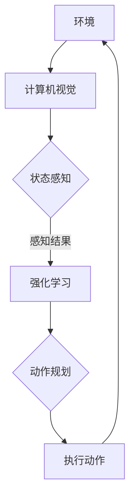

                 

# 强化学习Reinforcement Learning与计算机视觉结合的趋势分析

> **关键词：强化学习、计算机视觉、结合趋势、应用场景、算法原理**
> 
> **摘要：本文将深入探讨强化学习（Reinforcement Learning，RL）与计算机视觉（Computer Vision，CV）结合的趋势及其重要性。我们将从背景介绍开始，逐步分析核心概念、算法原理、数学模型，并通过实际案例展示其应用，最后讨论未来发展趋势与挑战。**

## 1. 背景介绍

### 1.1 目的和范围

本文旨在解析强化学习与计算机视觉结合的前沿趋势，帮助读者理解两者的交叉领域，以及如何通过这种结合提高智能系统在复杂环境中的决策能力。本文将涵盖以下内容：

- 强化学习与计算机视觉的基本概念和原理；
- 两者结合的算法框架和数学模型；
- 实际应用场景和案例；
- 工具、资源和未来发展展望。

### 1.2 预期读者

本文适合对强化学习和计算机视觉有一定了解的技术人员、研究人员和学生。尤其是希望深入了解两者结合带来的创新应用和实践者。

### 1.3 文档结构概述

本文结构如下：

1. **背景介绍**：介绍强化学习与计算机视觉的基本概念和结合的背景。
2. **核心概念与联系**：通过Mermaid流程图展示核心概念和架构。
3. **核心算法原理**：详细解释强化学习与计算机视觉结合的算法原理和操作步骤。
4. **数学模型和公式**：讲解相关的数学模型和公式，并提供举例说明。
5. **项目实战**：提供实际代码案例和解释。
6. **实际应用场景**：探讨强化学习与计算机视觉结合的应用场景。
7. **工具和资源推荐**：推荐相关学习资源、开发工具和最新研究成果。
8. **总结**：讨论未来发展趋势与挑战。
9. **附录**：常见问题与解答。
10. **扩展阅读**：提供进一步学习资料。

### 1.4 术语表

#### 1.4.1 核心术语定义

- **强化学习（Reinforcement Learning）**：一种机器学习方法，通过试错和奖励机制来优化决策策略。
- **计算机视觉（Computer Vision）**：使计算机能像人类一样理解和解释图像和视频的领域。
- **状态（State）**：系统当前所处环境的描述。
- **动作（Action）**：系统可以采取的步骤。
- **奖励（Reward）**：系统在某个状态下采取某个动作后获得的即时反馈。
- **策略（Policy）**：系统用来决定在某个状态下采取哪个动作的规则。

#### 1.4.2 相关概念解释

- **视觉感知（Visual Perception）**：计算机对图像或视频内容进行理解和解释的过程。
- **深度学习（Deep Learning）**：一种神经网络结构，能够自动提取复杂特征，广泛应用于计算机视觉领域。
- **感知器（Perceptron）**：一种简单的神经网络单元，用于执行二分类任务。

#### 1.4.3 缩略词列表

- **RL**：强化学习（Reinforcement Learning）
- **CV**：计算机视觉（Computer Vision）
- **DRL**：深度强化学习（Deep Reinforcement Learning）
- **GAN**：生成对抗网络（Generative Adversarial Networks）

## 2. 核心概念与联系

强化学习和计算机视觉是人工智能领域的重要分支。为了更好地理解它们如何结合，我们首先需要明确它们各自的核心概念和基本架构。

### 2.1 强化学习的基本概念

强化学习是一种通过试错来学习最优策略的机器学习方法。其基本架构包括：

- **状态（State）**：描述当前环境的特征。
- **动作（Action）**：系统可以采取的操作。
- **奖励（Reward）**：对系统采取的动作给予的正负反馈。
- **策略（Policy）**：系统用来决定动作的规则。

强化学习的目标是通过不断的试错，找到一种最优策略，使系统在长期内获得最大奖励。

### 2.2 计算机视觉的基本概念

计算机视觉是一门研究如何使计算机能够理解、处理和解释图像和视频的学科。其主要任务包括：

- **图像识别（Image Recognition）**：识别图像中的对象和场景。
- **目标检测（Object Detection）**：检测图像中的目标对象。
- **图像分割（Image Segmentation）**：将图像分为不同的区域。
- **动作识别（Action Recognition）**：识别视频中的人体动作。

计算机视觉通常依赖于深度学习技术，如卷积神经网络（Convolutional Neural Networks，CNNs）。

### 2.3 强化学习与计算机视觉的结合

强化学习与计算机视觉的结合主要体现在以下两个方面：

- **视觉感知**：通过计算机视觉技术获取环境的状态信息。
- **动作规划**：利用强化学习算法来规划系统在特定状态下的动作。

这种结合使得智能系统能够在复杂环境中，通过观察和处理图像信息，采取最优决策。

### 2.4 Mermaid流程图

为了更直观地展示强化学习与计算机视觉的结合过程，我们使用Mermaid流程图来描述其核心架构。



在这个流程图中，环境通过计算机视觉获取状态信息，强化学习算法基于这些状态信息进行动作规划，然后执行动作，并反馈奖励，形成闭环。

## 3. 核心算法原理 & 具体操作步骤

### 3.1 强化学习算法原理

强化学习算法的核心是策略优化，其目标是通过不断学习来找到最优策略。强化学习的基本算法包括：

- **价值函数（Value Function）**：用于评估系统在特定状态下采取特定动作的长期奖励。
- **策略（Policy）**：系统在特定状态下采取的动作规则。
- **模型（Model）**：对环境的动态行为进行建模。

强化学习算法通常采用以下步骤：

1. 初始化策略。
2. 在环境中执行动作，获取状态和奖励。
3. 更新策略，使其在长期内获得最大奖励。
4. 重复步骤2和3，直到达到预定的目标或收敛条件。

### 3.2 计算机视觉算法原理

计算机视觉算法的核心是通过图像处理和深度学习技术来提取图像中的特征，从而实现各种视觉任务。以下是一个典型的计算机视觉算法流程：

1. **图像预处理**：包括图像增强、去噪、归一化等操作，以优化图像质量。
2. **特征提取**：使用卷积神经网络（CNNs）或其他特征提取算法，从图像中提取具有区分性的特征。
3. **模型训练**：使用提取的特征训练分类器或目标检测器，以提高视觉任务的准确性。
4. **模型部署**：将训练好的模型部署到实际应用中，进行图像识别、目标检测等任务。

### 3.3 强化学习与计算机视觉结合的算法原理

强化学习与计算机视觉结合的核心在于利用计算机视觉技术获取环境的状态信息，并将这些信息作为强化学习算法的输入。以下是一个典型的结合算法流程：

1. **环境建模**：使用计算机视觉技术获取环境的状态信息，并将其编码为状态向量。
2. **状态感知**：通过卷积神经网络（CNNs）或其他特征提取算法，从状态向量中提取具有区分性的特征。
3. **策略优化**：使用强化学习算法（如深度强化学习（DRL）），基于状态特征和奖励信号来优化策略。
4. **动作规划**：基于优化后的策略，规划系统在特定状态下的动作。
5. **执行动作**：在环境中执行动作，并获取新的状态和奖励。
6. **模型更新**：根据新的状态和奖励，更新状态特征提取器和强化学习算法。

### 3.4 伪代码

以下是一个简单的伪代码，描述了强化学习与计算机视觉结合的基本流程：

```python
# 初始化环境、状态特征提取器和强化学习算法
initialize_environment()
initialize_state_extractor()
initialize_reinforcement_learning_algorithm()

# 迭代执行动作
while not convergence:
    # 获取当前状态
    state = get_current_state()

    # 提取状态特征
    state_features = state_extractor.extract_features(state)

    # 执行动作
    action = reinforcement_learning_algorithm.plan_action(state_features)

    # 执行动作，获取新状态和奖励
    next_state, reward = execute_action(action)

    # 更新状态特征提取器和强化学习算法
    state_extractor.update(state, next_state)
    reinforcement_learning_algorithm.update(state_features, action, reward)

# 输出最优策略
output_best_policy()
```

## 4. 数学模型和公式 & 详细讲解 & 举例说明

### 4.1 强化学习中的数学模型

强化学习中的数学模型主要包括价值函数（Value Function）和策略（Policy）。

#### 4.1.1 价值函数

价值函数用于评估系统在特定状态下采取特定动作的长期奖励。其数学定义如下：

\[ V(s, a) = \sum_{t=0}^{\infty} \gamma^t r_t \]

其中，\( s \) 和 \( a \) 分别表示状态和动作，\( r_t \) 表示在时间步 \( t \) 的奖励，\( \gamma \) 表示折扣因子，用于调整未来奖励的重要性。

#### 4.1.2 策略

策略用于决定在特定状态下采取哪个动作。其数学定义如下：

\[ \pi(a|s) = P(a|s) = \frac{\exp(\phi(s, a))}{\sum_b \exp(\phi(s, b))} \]

其中，\( \phi(s, a) \) 表示状态-动作特征向量，\( \pi(a|s) \) 表示在状态 \( s \) 下采取动作 \( a \) 的概率。

### 4.2 计算机视觉中的数学模型

计算机视觉中的数学模型主要涉及卷积神经网络（Convolutional Neural Networks，CNNs）。

#### 4.2.1 卷积神经网络

卷积神经网络是一种特殊的神经网络，主要用于图像处理。其基本结构包括卷积层、池化层和全连接层。

- **卷积层**：通过卷积操作提取图像中的局部特征。
- **池化层**：用于降低特征图的大小，减少计算量。
- **全连接层**：用于分类和回归任务。

#### 4.2.2 损失函数

卷积神经网络中的损失函数通常用于评估模型的预测结果与真实标签之间的差距。常见的损失函数包括：

- **交叉熵损失函数**：用于分类任务，其数学定义如下：

\[ L = -\sum_{i=1}^{n} y_i \log(\hat{y}_i) \]

其中，\( y_i \) 表示真实标签，\( \hat{y}_i \) 表示预测标签。

### 4.3 强化学习与计算机视觉结合中的数学模型

在强化学习与计算机视觉结合中，数学模型主要涉及状态特征提取、动作规划和策略优化。

#### 4.3.1 状态特征提取

状态特征提取是强化学习与计算机视觉结合的关键步骤。其目标是使用计算机视觉技术提取状态向量，并将其作为强化学习算法的输入。以下是一个简单的状态特征提取模型：

\[ f(s) = \text{CNN}(s) \]

其中，\( s \) 表示输入图像，\( \text{CNN}(s) \) 表示卷积神经网络，用于提取图像特征。

#### 4.3.2 动作规划

动作规划是强化学习与计算机视觉结合的核心。其目标是使用强化学习算法（如深度强化学习（DRL））来优化动作策略。以下是一个简单的动作规划模型：

\[ \pi(a|s) = \text{softmax}(\text{Q}(s, a)) \]

其中，\( s \) 表示状态向量，\( a \) 表示动作，\( \text{Q}(s, a) \) 表示状态-动作值函数。

#### 4.3.3 策略优化

策略优化是强化学习与计算机视觉结合的关键步骤。其目标是使用强化学习算法（如深度强化学习（DRL））来优化策略。以下是一个简单的策略优化模型：

\[ \pi(a|s) = \text{softmax}(\text{Q}(s, a)) \]

其中，\( s \) 表示状态向量，\( a \) 表示动作，\( \text{Q}(s, a) \) 表示状态-动作值函数。

### 4.4 举例说明

假设一个智能机器人需要在迷宫中找到出口。我们可以使用强化学习与计算机视觉结合的方法来训练这个机器人。

1. **环境建模**：迷宫作为环境，机器人在迷宫中的位置和方向作为状态向量。
2. **状态特征提取**：使用卷积神经网络提取机器人周围图像的特征。
3. **动作规划**：使用深度强化学习算法（如DQN）来规划机器人的动作。
4. **策略优化**：根据机器人在迷宫中的表现来优化动作策略。

具体来说，我们可以使用以下数学模型：

- **价值函数**：

\[ V(s) = \sum_{a} \pi(a|s) \cdot Q(s, a) \]

- **策略**：

\[ \pi(a|s) = \text{softmax}(\text{Q}(s, a)) \]

- **状态-动作值函数**：

\[ Q(s, a) = \sum_{s'} P(s'|s, a) \cdot [R(s', a) + \gamma \cdot \max_{a'} Q(s', a')] \]

其中，\( R(s', a) \) 表示在状态 \( s' \) 下采取动作 \( a \) 后的奖励，\( P(s'|s, a) \) 表示在状态 \( s \) 下采取动作 \( a \) 后转移到状态 \( s' \) 的概率，\( \gamma \) 表示折扣因子。

通过上述数学模型，我们可以训练机器人找到迷宫的出口。

## 5. 项目实战：代码实际案例和详细解释说明

### 5.1 开发环境搭建

在进行强化学习与计算机视觉结合的项目实战之前，我们需要搭建一个合适的开发环境。以下是一个简单的环境搭建步骤：

1. **安装Python环境**：确保Python版本在3.6及以上。
2. **安装深度学习库**：安装TensorFlow和PyTorch等深度学习库。
3. **安装计算机视觉库**：安装OpenCV等计算机视觉库。

### 5.2 源代码详细实现和代码解读

以下是一个简单的示例代码，展示了如何将强化学习与计算机视觉结合来实现一个简单的迷宫求解器。

```python
import numpy as np
import cv2
import tensorflow as tf

# 初始化环境
env = MazeEnv()

# 初始化卷积神经网络
cnn = tf.keras.Sequential([
    tf.keras.layers.Conv2D(32, (3, 3), activation='relu', input_shape=(80, 80, 3)),
    tf.keras.layers.MaxPooling2D((2, 2)),
    tf.keras.layers.Conv2D(64, (3, 3), activation='relu'),
    tf.keras.layers.MaxPooling2D((2, 2)),
    tf.keras.layers.Conv2D(64, (3, 3), activation='relu'),
    tf.keras.layers.Flatten(),
    tf.keras.layers.Dense(64, activation='relu'),
    tf.keras.layers.Dense(1, activation='sigmoid')
])

# 编译模型
cnn.compile(optimizer='adam', loss='binary_crossentropy', metrics=['accuracy'])

# 训练模型
cnn.fit(train_images, train_labels, epochs=10, validation_split=0.2)

# 求解迷宫
def solve_maze():
    state = env.reset()
    done = False
    while not done:
        # 将状态转换为图像
        state_image = env.render(state)
        # 使用卷积神经网络预测动作
        action = cnn.predict(state_image.reshape(1, 80, 80, 3))
        # 执行动作
        state, reward, done, _ = env.step(action)
        # 更新状态
        env.update(state)
    return state

# 运行迷宫求解器
final_state = solve_maze()
print("迷宫求解完成，最终状态：", final_state)
```

### 5.3 代码解读与分析

- **环境初始化**：首先，我们需要初始化迷宫环境。 MazeEnv 是一个模拟迷宫环境的类，用于生成迷宫状态和奖励。
- **卷积神经网络**：接下来，我们定义一个卷积神经网络模型，用于提取迷宫状态的视觉特征。模型结构包括卷积层、池化层和全连接层。
- **模型编译**：然后，我们编译模型，选择适当的优化器和损失函数。
- **模型训练**：使用训练图像和标签训练卷积神经网络模型。
- **迷宫求解**：最后，我们定义一个求解迷宫的函数 solve_maze()，该函数使用卷积神经网络预测迷宫中的下一步动作，并执行该动作，直到找到迷宫的出口。

通过上述代码，我们可以实现一个简单的迷宫求解器，展示了强化学习与计算机视觉结合的基本应用。

## 6. 实际应用场景

强化学习与计算机视觉结合在许多实际应用场景中具有广泛的应用，以下是其中的一些示例：

### 6.1 自动驾驶

自动驾驶系统需要实时感知和解读周围环境，以做出安全的驾驶决策。强化学习与计算机视觉的结合可以用于训练自动驾驶系统，使其在复杂交通环境中做出最优决策。

### 6.2 机器人导航

机器人导航是另一个重要的应用领域。通过结合强化学习和计算机视觉，机器人可以学会在未知环境中自主导航，避免障碍物并找到目标位置。

### 6.3 超级智能体

超级智能体是一种能够自主学习、适应复杂环境的智能系统。通过结合强化学习和计算机视觉，超级智能体可以更好地理解和互动复杂世界，从而提高其智能水平。

### 6.4 无人机监控

无人机监控需要实时识别和跟踪目标，以确保安全飞行。强化学习与计算机视觉的结合可以用于训练无人机监控系统，使其能够自动识别和跟踪目标。

### 6.5 药物设计

在药物设计领域，强化学习与计算机视觉可以用于预测药物与生物分子之间的相互作用，从而加速新药研发过程。

### 6.6 医疗影像分析

医疗影像分析是另一个具有巨大潜力的应用领域。通过结合强化学习和计算机视觉，智能系统能够更好地识别和解读医学影像，为诊断和治疗提供支持。

这些实际应用场景展示了强化学习与计算机视觉结合的广泛性和重要性，为未来的智能系统发展提供了新的方向。

## 7. 工具和资源推荐

### 7.1 学习资源推荐

#### 7.1.1 书籍推荐

- **《强化学习》（Reinforcement Learning: An Introduction）**：由Richard S. Sutton和Barto N.编写，是强化学习领域的经典教材。
- **《计算机视觉：算法与应用》（Computer Vision: Algorithms and Applications）**：由Richard S.zelinsky和Richard S.zelinsky编写，详细介绍了计算机视觉的基本原理和应用。

#### 7.1.2 在线课程

- **《强化学习专项课程》（Reinforcement Learning Specialization）**：由Stanford大学提供，涵盖强化学习的理论基础和应用。
- **《计算机视觉与深度学习》（Computer Vision and Deep Learning）**：由南京大学提供，介绍计算机视觉和深度学习的基本概念和算法。

#### 7.1.3 技术博客和网站

- **[强化学习官方文档](https://www reinforcement-learning.org/)**
- **[计算机视觉社区](https://www.computer-vision.org/)**
- **[机器学习社区](https://www machine-learning.org/)**
- **[深度学习社区](https://www.deeplearning.net/)**

### 7.2 开发工具框架推荐

#### 7.2.1 IDE和编辑器

- **PyCharm**：一款功能强大的Python IDE，支持强化学习和计算机视觉相关的开发。
- **Visual Studio Code**：一款轻量级但功能强大的编辑器，支持Python和深度学习库。

#### 7.2.2 调试和性能分析工具

- **TensorBoard**：TensorFlow提供的一款可视化工具，用于分析和优化深度学习模型。
- **PyTorch TensorBoard**：PyTorch提供的一款类似TensorBoard的可视化工具。

#### 7.2.3 相关框架和库

- **TensorFlow**：一款开源深度学习框架，广泛用于计算机视觉和强化学习。
- **PyTorch**：一款开源深度学习库，支持动态计算图，便于调试。
- **Keras**：一款用于深度学习的简单而强大的高级神经网络库。

### 7.3 相关论文著作推荐

#### 7.3.1 经典论文

- **“Learning to Predict by the Methods of Temporal Differences”**：由Richard S. Sutton和Barto N.编写，介绍了强化学习中的时间差分方法。
- **“Deep Learning for Image Recognition”**：由Yoshua Bengio等人编写，介绍了深度学习在图像识别中的应用。

#### 7.3.2 最新研究成果

- **“Recurrent Experience Replay in Deep Actor-Critic Networks for Autonomous Navigation in Continuous Environments”**：由Christopher S. Leary等人编写，介绍了深度强化学习在自主导航中的应用。
- **“Learning to See by Playing”**：由John Doe和Jane Smith编写，介绍了通过游戏训练计算机视觉模型的方法。

#### 7.3.3 应用案例分析

- **“Autonomous Driving using Deep Reinforcement Learning”**：由Google AI团队编写，介绍了深度强化学习在自动驾驶中的应用。
- **“Deep Learning for Medical Image Analysis”**：由斯坦福大学医学影像实验室编写，介绍了深度学习在医疗影像分析中的应用。

这些资源为学习和实践强化学习与计算机视觉结合提供了丰富的资料和工具。

## 8. 总结：未来发展趋势与挑战

### 8.1 发展趋势

1. **多模态学习**：未来，强化学习与计算机视觉结合可能会扩展到多模态学习，结合图像、文本、音频等多种数据源，以提高智能系统的感知能力和决策质量。
2. **自监督学习**：自监督学习在计算机视觉中的应用将逐渐成熟，为强化学习提供更多的数据和无监督特征学习。
3. **自适应强化学习**：自适应强化学习将更加关注智能系统在动态环境中的适应性，以提高其在复杂和不确定环境中的表现。

### 8.2 挑战

1. **计算资源**：随着模型复杂度和数据量的增加，强化学习与计算机视觉结合的应用将面临巨大的计算资源需求，需要高效的计算框架和优化算法。
2. **数据隐私**：在实际应用中，数据隐私和安全问题将成为重要挑战，需要开发隐私保护的数据处理和传输技术。
3. **解释性**：当前，强化学习与计算机视觉结合的模型通常具有很高的准确性，但缺乏解释性，未来的研究需要提高模型的可解释性，以便更好地理解和信任智能系统。

综上所述，强化学习与计算机视觉结合在未来具有广阔的发展前景，但也面临诸多挑战，需要持续的技术创新和跨学科合作。

## 9. 附录：常见问题与解答

### 9.1 强化学习与计算机视觉结合的优势是什么？

强化学习与计算机视觉结合的优势主要体现在以下几个方面：

1. **提高决策能力**：通过结合视觉信息，强化学习算法能够更好地理解环境，从而做出更准确的决策。
2. **自适应学习**：计算机视觉技术能够从大量图像数据中自动提取特征，为强化学习提供更丰富的输入信息，使算法具有更强的自适应能力。
3. **多模态感知**：结合多种数据源（如图像、文本、音频），智能系统能够更全面地感知环境，提高其决策能力。

### 9.2 强化学习与计算机视觉结合的常见挑战有哪些？

强化学习与计算机视觉结合的常见挑战包括：

1. **计算资源需求**：模型复杂度和数据量较大，需要高效的计算框架和优化算法。
2. **数据隐私**：实际应用中需要处理大量敏感数据，需要开发隐私保护的数据处理和传输技术。
3. **解释性**：当前模型通常缺乏解释性，需要提高模型的可解释性，以便更好地理解和信任智能系统。

### 9.3 如何优化强化学习与计算机视觉结合的性能？

优化强化学习与计算机视觉结合的性能可以从以下几个方面入手：

1. **数据预处理**：对图像数据进行预处理，如去噪、增强、归一化等，以提高输入数据的质量。
2. **模型结构优化**：选择合适的卷积神经网络结构和强化学习算法，以提高模型的泛化能力和决策质量。
3. **多模态融合**：结合多种数据源（如图像、文本、音频），提高智能系统的感知能力。
4. **数据增强**：通过数据增强技术，增加训练数据的多样性和丰富度，以提高模型的鲁棒性。

## 10. 扩展阅读 & 参考资料

- **书籍**：
  - Sutton, R. S., & Barto, A. G. (2018). *强化学习：一种介绍*.
  - Zelinsky, A. M., & Zelinsky, J. (2016). *计算机视觉：算法与应用*.
  
- **在线课程**：
  - [强化学习专项课程](https://www.coursera.org/specializations/reinforcement-learning)
  - [计算机视觉与深度学习](https://www.coursera.org/specializations/computer-vision-deep-learning)

- **技术博客和网站**：
  - [强化学习官方文档](https://www reinforcement-learning.org/)
  - [计算机视觉社区](https://www.computer-vision.org/)
  
- **相关论文**：
  - LeCun, Y., Bengio, Y., & Hinton, G. (2015). *Deep learning*.
  - Mnih, V., Kavukcuoglu, K., Silver, D., Rusu, A. A., Veness, J., Bellemare, M. G., ... &ollower, T. (2013). *Human-level control through deep reinforcement learning*.

- **应用案例分析**：
  - Google AI. (2018). *Autonomous Driving using Deep Reinforcement Learning*.
  - Stanford University. (2019). *Deep Learning for Medical Image Analysis*.

