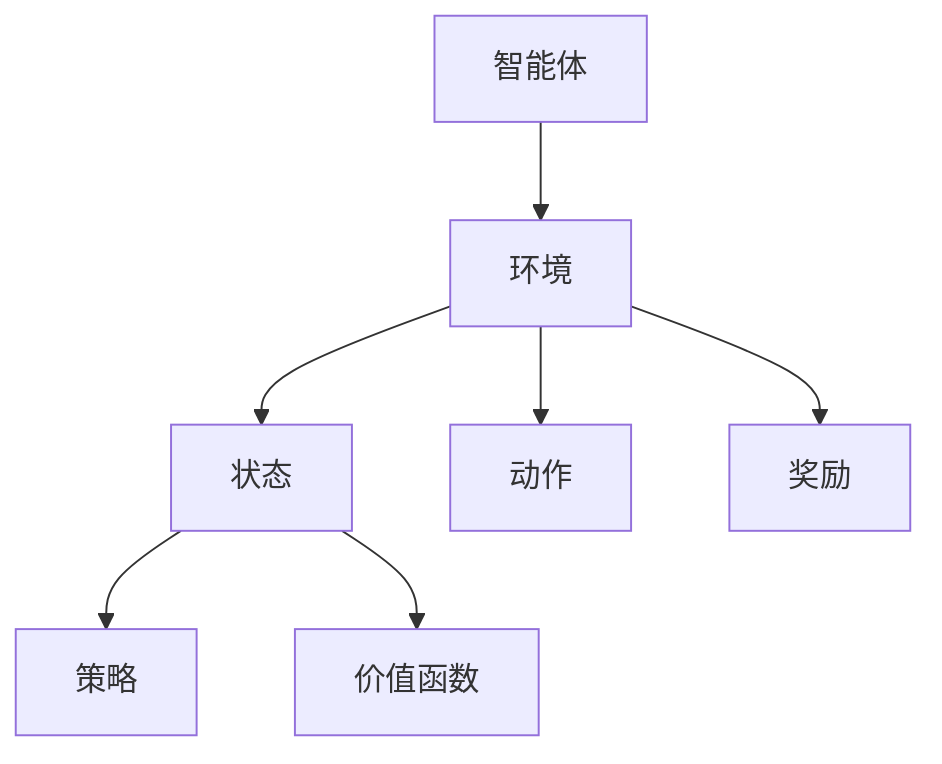

                 

# 强化学习Reinforcement Learning在物联网IoT的创新应用方案

> **关键词：** 强化学习、物联网、机器学习、人工智能、智能优化

> **摘要：** 本文章探讨了强化学习在物联网（IoT）领域的创新应用方案，旨在深入理解强化学习的基本概念、核心算法原理，并通过具体项目实战和实际应用场景，展示其在物联网领域中的广泛应用和潜力。

## 1. 背景介绍

### 1.1 目的和范围

本文的目的是探讨强化学习（Reinforcement Learning，RL）在物联网（Internet of Things，IoT）领域的创新应用方案。我们将从以下几个方面进行深入探讨：

1. 强化学习的基本概念、核心算法原理及其在物联网中的应用价值。
2. 通过具体的项目实战案例，展示强化学习在物联网领域的实际应用效果。
3. 分析强化学习在物联网中的应用场景，以及未来可能的发展趋势和挑战。

### 1.2 预期读者

本文适用于以下读者：

1. 对物联网（IoT）和强化学习（Reinforcement Learning）有一定了解的技术人员。
2. 对人工智能（Artificial Intelligence）和机器学习（Machine Learning）感兴趣的初学者。
3. 想要了解强化学习在物联网领域应用的技术专家。

### 1.3 文档结构概述

本文结构如下：

1. **背景介绍**：介绍文章的目的、范围、预期读者以及文档结构。
2. **核心概念与联系**：介绍强化学习的基本概念、核心算法原理及其在物联网中的应用。
3. **核心算法原理 & 具体操作步骤**：详细阐述强化学习算法的基本原理、具体操作步骤和伪代码。
4. **数学模型和公式 & 详细讲解 & 举例说明**：介绍强化学习中的数学模型和公式，并通过实际案例进行说明。
5. **项目实战：代码实际案例和详细解释说明**：通过具体项目实战，展示强化学习在物联网领域的实际应用。
6. **实际应用场景**：分析强化学习在物联网领域的应用场景。
7. **工具和资源推荐**：推荐相关学习资源、开发工具框架和论文著作。
8. **总结：未来发展趋势与挑战**：总结强化学习在物联网领域的未来发展趋势和挑战。
9. **附录：常见问题与解答**：提供关于强化学习在物联网领域的常见问题及解答。
10. **扩展阅读 & 参考资料**：提供更多的相关阅读资料。

### 1.4 术语表

#### 1.4.1 核心术语定义

- **强化学习（Reinforcement Learning，RL）**：一种机器学习范式，通过智能体（agent）与环境（environment）的交互，不断学习并优化行为策略，以实现预期目标。
- **物联网（Internet of Things，IoT）**：将各种物理设备、传感器、软件和网络连接起来，实现设备间的信息交换和智能协作。
- **智能体（Agent）**：能够感知环境、制定决策并采取行动的实体。
- **环境（Environment）**：智能体执行动作的场所，包含状态、动作和奖励。
- **策略（Policy）**：智能体根据当前状态选择动作的规则。
- **价值函数（Value Function）**：预测在未来执行某个策略时获得的累积奖励。
- **Q-学习（Q-Learning）**：一种基于值函数的强化学习算法，通过更新Q值来优化策略。

#### 1.4.2 相关概念解释

- **深度强化学习（Deep Reinforcement Learning，DRL）**：结合深度学习和强化学习，通过神经网络来近似价值函数或策略函数。
- **强化学习算法（Reinforcement Learning Algorithm）**：实现强化学习过程的算法，包括Q-学习、SARSA、深度Q网络（DQN）等。
- **物联网平台（IoT Platform）**：提供设备连接、数据存储、数据处理和可视化等功能的软件平台。
- **边缘计算（Edge Computing）**：在靠近数据源的地方进行数据处理和计算，减少数据传输和延迟。

#### 1.4.3 缩略词列表

- **IoT**：Internet of Things，物联网。
- **RL**：Reinforcement Learning，强化学习。
- **DRL**：Deep Reinforcement Learning，深度强化学习。
- **Q-Learning**：Q-Learning，Q学习。
- **SARSA**：State-Action-Reward-State-Action，状态-动作-奖励-状态-动作算法。
- **DQN**：Deep Q-Network，深度Q网络。
- **Policies**：策略。
- **Agents**：智能体。
- **Environments**：环境。

## 2. 核心概念与联系

为了更好地理解强化学习在物联网（IoT）领域的应用，我们需要首先了解强化学习的基本概念、核心算法原理以及其在物联网中的应用。

### 2.1 强化学习的基本概念

强化学习是一种通过智能体（agent）与环境（environment）的交互，不断学习并优化行为策略，以实现预期目标的机器学习范式。在强化学习中，智能体根据当前状态（state）选择动作（action），然后根据动作的结果（reward）来调整其策略（policy）。通过不断重复这个过程，智能体逐渐学会在复杂环境中实现最优目标。

强化学习的基本组成部分包括：

- **智能体（Agent）**：执行动作并接收环境反馈的实体。
- **环境（Environment）**：智能体执行动作的场所，包含状态、动作和奖励。
- **状态（State）**：智能体在环境中所处的状态。
- **动作（Action）**：智能体在当前状态下采取的行动。
- **奖励（Reward）**：对智能体采取动作的反馈，用于评价动作的好坏。
- **策略（Policy）**：智能体根据当前状态选择动作的规则。

### 2.2 强化学习算法原理

强化学习算法通过不断迭代学习，逐步优化智能体的策略。以下是几种常见的强化学习算法：

- **Q-学习（Q-Learning）**：Q-学习是基于值函数的强化学习算法。智能体通过更新Q值（表示在当前状态下采取某个动作的预期奖励）来优化策略。Q-学习算法的核心思想是：选择当前状态下的最佳动作，并更新Q值，使得智能体在未来能够采取更好的动作。

  伪代码：

  ```python
  Initialize Q(s, a) for all states s and actions a
  while not terminate:
      Choose action a from state s using policy π
      Take action a, observe reward r and next state s'
      Update Q(s, a) using the reward and next state
      s = s'
  ```

- **SARSA（State-Action-Reward-State-Action）**：SARSA算法是Q-学习算法的变体，它使用实际观察到的奖励和下一个状态来更新Q值。SARSA算法的核心思想是：智能体在当前状态下采取动作，观察到奖励和下一个状态后，更新Q值，并继续在下一个状态中选择动作。

  伪代码：

  ```python
  Initialize Q(s, a) for all states s and actions a
  while not terminate:
      Choose action a from state s using policy π
      Take action a, observe reward r and next state s'
      Choose action a' from state s' using policy π
      Update Q(s, a) using the reward, next state, and next action
      s = s'
  ```

- **深度Q网络（DQN，Deep Q-Network）**：DQN算法结合了深度学习和强化学习，通过神经网络来近似Q值函数。DQN算法的核心思想是：使用经验回放（experience replay）来减少样本偏差，并使用固定目标Q网络（target Q-network）来稳定学习过程。

  伪代码：

  ```python
  Initialize Q-network and target Q-network
  Initialize experience replay memory
  while not terminate:
      Choose action a from state s using policy π
      Take action a, observe reward r and next state s'
      Store transition (s, a, r, s') in experience replay memory
      Sample a mini-batch of transitions from experience replay memory
      Update Q-network using the mini-batch
      Update target Q-network with the Q-network's weights
  ```

### 2.3 强化学习在物联网（IoT）中的应用

强化学习在物联网（IoT）领域具有广泛的应用前景。物联网设备通常具有大量的传感器和执行器，可以通过强化学习来优化其行为，实现更高效、更智能的设备协作。以下是强化学习在物联网中的几个典型应用场景：

- **智能设备控制**：通过强化学习，智能设备可以自主学习和优化其控制策略，提高设备运行的效率和稳定性。例如，智能空调可以根据环境温度和用户需求，通过强化学习算法自动调整温度设置，实现节能和舒适。

- **资源调度**：在物联网系统中，资源（如计算能力、存储容量、带宽等）通常有限。通过强化学习，可以优化资源的调度策略，提高系统资源利用率。例如，在智慧城市建设中，通过强化学习算法优化交通信号灯的控制策略，实现交通流量优化和拥堵缓解。

- **异常检测与预测**：物联网设备产生的大量数据中，可能包含异常数据或潜在故障信息。通过强化学习，可以训练智能体识别和预测异常情况，从而实现实时监控和预警。例如，在工业生产中，通过强化学习算法对设备运行数据进行异常检测和预测，实现故障预警和预防性维护。

- **智能交互**：物联网设备与用户的交互日益紧密，通过强化学习，可以训练设备更好地理解用户需求和行为，实现更自然的智能交互。例如，智能音箱可以通过强化学习算法，根据用户的语音输入和反馈，不断优化语音识别和语义理解能力，提高用户体验。

### 2.4 强化学习在物联网（IoT）中的挑战

虽然强化学习在物联网领域具有广泛的应用前景，但在实际应用过程中仍面临一些挑战：

- **数据隐私与安全**：物联网设备通常涉及大量敏感数据，如个人隐私、企业机密等。如何保障数据隐私和安全，是强化学习在物联网应用中需要解决的问题。

- **数据质量与可靠性**：物联网设备产生的数据可能存在噪声、缺失和不一致性等问题，影响强化学习算法的性能和稳定性。如何处理和清洗数据，提高数据质量，是强化学习在物联网应用中需要解决的问题。

- **实时性与高效性**：物联网设备通常需要在有限的时间和计算资源内完成任务，要求强化学习算法具有实时性和高效性。如何优化算法结构，降低计算复杂度，是强化学习在物联网应用中需要解决的问题。

- **算法可解释性**：强化学习算法的黑箱特性可能导致算法决策的不透明性，影响用户对算法的信任。如何提高算法的可解释性，是强化学习在物联网应用中需要解决的问题。

### 2.5 强化学习在物联网（IoT）中的应用架构

为了实现强化学习在物联网（IoT）领域的应用，我们需要构建一个由智能体、环境、策略和价值函数组成的系统架构。以下是强化学习在物联网应用中的典型架构：

1. **智能体（Agent）**：智能体是物联网系统中的核心组件，负责感知环境、执行动作和更新策略。智能体通常包括以下几个模块：

   - **传感器模块**：负责采集物联网设备运行过程中的各种数据，如环境温度、湿度、光照强度等。
   - **执行器模块**：负责执行智能体根据策略选定的动作，如调整设备参数、控制执行器等。
   - **策略模块**：根据当前状态，智能体通过策略模块选择合适的动作。策略模块可以使用Q-learning、SARSA、DQN等强化学习算法进行训练。
   - **价值函数模块**：价值函数模块用于评估智能体在不同状态下的动作价值，以指导智能体的行为选择。

2. **环境（Environment）**：环境是智能体执行动作的场所，包含状态、动作和奖励。在物联网应用中，环境通常由以下几个部分组成：

   - **状态（State）**：状态表示物联网设备在某一时刻的状态，如设备参数、环境温度、湿度等。
   - **动作（Action）**：动作是智能体在环境中可以执行的操作，如调整设备参数、开启/关闭执行器等。
   - **奖励（Reward）**：奖励是环境对智能体动作的反馈，用于评价动作的好坏。奖励可以是正的、负的或零。

3. **策略（Policy）**：策略是智能体根据当前状态选择动作的规则。在强化学习过程中，智能体会通过不断学习来优化策略，以实现预期目标。

4. **价值函数（Value Function）**：价值函数用于评估智能体在不同状态下的动作价值。价值函数可以是Q值函数、状态值函数或状态-动作值函数。

### 2.6 核心概念原理的Mermaid流程图

以下是一个描述强化学习在物联网（IoT）应用中核心概念原理的Mermaid流程图：



## 3. 核心算法原理 & 具体操作步骤

在了解了强化学习的基本概念和应用后，接下来我们将详细探讨强化学习的核心算法原理，以及如何在物联网（IoT）环境中具体实施这些算法。

### 3.1 Q-学习算法原理

Q-学习算法是一种基于值函数的强化学习算法，通过更新Q值（Q-value）来优化策略。Q值表示在某一状态下采取某一动作的预期奖励。Q-学习算法的核心思想是：选择当前状态下的最佳动作，并更新Q值，使得智能体在未来能够采取更好的动作。

以下是Q-学习算法的伪代码：

```python
# 初始化Q值表
Initialize Q(s, a) for all states s and actions a

# 循环直到达到终止条件
while not terminate:
    # 选择动作a
    a = ChooseAction(s, policy)

    # 执行动作a
    s', r = ExecuteAction(a)

    # 更新Q值
    Q(s, a) = Q(s, a) + alpha * (r + gamma * max(Q(s', a')) - Q(s, a))

    # 更新状态
    s = s'
```

其中，`alpha` 是学习率（learning rate），`gamma` 是折扣因子（discount factor），用于权衡当前奖励和未来奖励的关系。

### 3.2 Sarsa算法原理

Sarsa算法是Q-学习算法的一个变体，它使用实际观察到的奖励和下一个状态来更新Q值。Sarsa算法的核心思想是：智能体在当前状态下采取动作，观察到奖励和下一个状态后，更新Q值，并继续在下一个状态中选择动作。

以下是Sarsa算法的伪代码：

```python
# 初始化Q值表
Initialize Q(s, a) for all states s and actions a

# 循环直到达到终止条件
while not terminate:
    # 选择动作a
    a = ChooseAction(s, policy)

    # 执行动作a
    s', r = ExecuteAction(a)

    # 选择动作a'
    a' = ChooseAction(s', policy)

    # 更新Q值
    Q(s, a) = Q(s, a) + alpha * (r + gamma * Q(s', a') - Q(s, a))

    # 更新状态
    s = s'
```

### 3.3 DQN算法原理

DQN（Deep Q-Network）算法是结合深度学习和强化学习的算法，通过神经网络来近似Q值函数。DQN算法的核心思想是：使用经验回放（experience replay）来减少样本偏差，并使用固定目标Q网络（target Q-network）来稳定学习过程。

以下是DQN算法的伪代码：

```python
# 初始化Q网络和目标Q网络
Initialize Q-network and target Q-network

# 初始化经验回放记忆池
Initialize experience replay memory

# 循环直到达到终止条件
while not terminate:
    # 从环境获取状态s
    s = GetState()

    # 选择动作a
    a = ChooseAction(s, policy)

    # 执行动作a，获取下一个状态s'和奖励r
    s', r = ExecuteAction(a)

    # 将转换（s, a, r, s'）存储到经验回放记忆池
    StoreTransitionInMemory(s, a, r, s')

    # 从经验回放记忆池中随机抽取一个小批量转换
    batch = SampleMiniBatchFromMemory()

    # 使用小批量转换更新Q网络
    UpdateQNetwork(batch)

    # 更新目标Q网络，使用Q网络的权重
    UpdateTargetQNetwork(Q-network's weights)
```

### 3.4 强化学习在物联网（IoT）环境中的具体操作步骤

在物联网（IoT）环境中，强化学习算法需要根据实际应用场景进行具体实施。以下是强化学习在物联网环境中的具体操作步骤：

1. **定义状态空间和动作空间**：根据物联网应用场景，定义状态空间和动作空间。状态空间表示物联网设备在某一时刻的状态，如设备参数、环境温度、湿度等。动作空间表示物联网设备可以执行的操作，如调整设备参数、控制执行器等。

2. **初始化Q值表或神经网络**：初始化Q值表或神经网络，用于存储和更新Q值。

3. **选择动作**：根据当前状态，选择一个动作。可以选择使用ε-贪心策略（ε-greedy policy），在探索（exploration）和利用（exploitation）之间进行平衡。

4. **执行动作**：执行选定的动作，获取下一个状态和奖励。

5. **更新Q值或神经网络**：根据观察到的奖励和下一个状态，更新Q值或神经网络。

6. **重复步骤3-5**：重复选择动作、执行动作、更新Q值或神经网络的过程，直到达到终止条件。

7. **评估策略**：评估训练得到的策略，评估策略的好坏。

8. **部署到物联网环境**：将训练得到的策略部署到物联网环境，实现物联网设备的智能控制和优化。

### 3.5 强化学习在物联网（IoT）环境中的具体实现

以下是一个强化学习在物联网（IoT）环境中的具体实现案例：

1. **定义状态空间和动作空间**：

   - 状态空间：设备参数（如温度、湿度、光照强度等）。
   - 动作空间：调整设备参数（如温度、湿度、光照强度等）。

2. **初始化Q值表或神经网络**：

   - 初始化Q值表或神经网络，用于存储和更新Q值。

3. **选择动作**：

   - 使用ε-贪心策略，根据当前状态选择动作。在早期训练阶段，智能体会进行探索，随机选择动作。在训练后期，智能体会进行利用，选择Q值较高的动作。

4. **执行动作**：

   - 执行选定的动作，调整设备参数。

5. **更新Q值或神经网络**：

   - 根据观察到的奖励和下一个状态，更新Q值或神经网络。

6. **重复步骤3-5**：

   - 重复选择动作、执行动作、更新Q值或神经网络的过程，直到达到终止条件。

7. **评估策略**：

   - 评估训练得到的策略，评估策略的好坏。

8. **部署到物联网环境**：

   - 将训练得到的策略部署到物联网环境，实现物联网设备的智能控制和优化。

## 4. 数学模型和公式 & 详细讲解 & 举例说明

强化学习算法的核心在于价值函数和策略的迭代优化，下面我们将详细介绍强化学习的数学模型、相关公式，并通过具体案例进行说明。

### 4.1 价值函数

在强化学习中，价值函数用于评估智能体在某一状态下的期望奖励。根据智能体的策略，价值函数可以是状态值函数或状态-动作值函数。

- **状态值函数（State-Value Function）**：表示在某一状态下执行最优策略的期望奖励。用V(s)表示，其中s表示状态。

  数学表达式：
  $$ V(s) = E_{π}[G_t | S_t = s] $$
  其中，E[·|·]表示条件期望，π表示策略，G_t表示从状态s开始执行策略π直至终止状态的总奖励，t表示时间步。

- **状态-动作值函数（State-Action Value Function）**：表示在某一状态下执行某一动作的期望奖励。用Q(s, a)表示，其中s表示状态，a表示动作。

  数学表达式：
  $$ Q(s, a) = E_{π}[G_t | S_t = s, A_t = a] $$
  其中，E[·|·]表示条件期望，π表示策略，G_t表示从状态s开始执行动作a直至终止状态的总奖励，t表示时间步。

### 4.2 策略迭代

强化学习算法的目标是优化策略π，使得智能体能够在不同状态下选择最优动作。通过策略迭代，智能体不断更新策略，以达到最大化期望奖励。

- **策略迭代算法（Policy Iteration）**：

  策略迭代算法分为两个主要步骤：策略评估和策略改进。

  1. **策略评估**：通过迭代更新状态值函数或状态-动作值函数，使得价值函数逐渐逼近真实值。

     数学表达式：
     $$ V(s) = \sum_{a \in A} π(a|s) \cdot Q(s, a) $$
     $$ Q(s, a) = \sum_{s' \in S} P(s'|s, a) \cdot [R(s, a, s') + γ \cdot V(s')] $$
     其中，π(a|s)表示在状态s下采取动作a的概率，P(s'|s, a)表示在状态s下采取动作a后转移到状态s'的概率，R(s, a, s')表示在状态s下采取动作a后转移到状态s'的即时奖励，γ表示折扣因子。

  2. **策略改进**：在策略评估后，选择最优动作作为新的策略。

     数学表达式：
     $$ π(a|s) = \begin{cases} 
     1 & \text{if } a = \arg\max_a Q(s, a) \\
     0 & \text{otherwise}
     \end{cases} $$

- **示例**：

  假设一个简单的环境，状态空间为{饥饿，饱腹}，动作空间为{吃饭，不吃饭}。奖励函数为：在饥饿状态下吃饭奖励+10，在饱腹状态下吃饭奖励-5，其他动作无奖励。

  初始策略为π(吃饭|饥饿) = 1，π(吃饭|饱腹) = 0。

  通过策略迭代算法，我们可以计算状态值函数和状态-动作值函数：

  1. **策略评估**：

     - 状态值函数：
       $$ V(饥饿) = \sum_{a \in A} π(a|饥饿) \cdot Q(饥饿, a) $$
       $$ V(饥饿) = π(吃饭|饥饿) \cdot Q(饥饿, 吃饭) = 1 \cdot 10 = 10 $$
       $$ V(饱腹) = \sum_{a \in A} π(a|饱腹) \cdot Q(饱腹, a) $$
       $$ V(饱腹) = π(吃饭|饱腹) \cdot Q(饱腹, 吃饭) = 0 \cdot (-5) = 0 $$

     - 状态-动作值函数：
       $$ Q(饥饿, 吃饭) = \sum_{s' \in S} P(s'|饥饿, 吃饭) \cdot [R(饥饿, 吃饭, s') + γ \cdot V(s')] $$
       $$ Q(饥饿, 吃饭) = 1 \cdot [10 + 0.9 \cdot 10] = 19 $$
       $$ Q(饥饿, 不吃饭) = \sum_{s' \in S} P(s'|饥饿, 不吃饭) \cdot [R(饥饿, 不吃饭, s') + γ \cdot V(s')] $$
       $$ Q(饥饿, 不吃饭) = 0 \cdot [-5 + 0.9 \cdot 0] = 0 $$
       $$ Q(饱腹, 吃饭) = \sum_{s' \in S} P(s'|饱腹, 吃饭) \cdot [R(饱腹, 吃饭, s') + γ \cdot V(s')] $$
       $$ Q(饱腹, 吃饭) = 0 \cdot [-5 + 0.9 \cdot 0] = 0 $$
       $$ Q(饱腹, 不吃饭) = \sum_{s' \in S} P(s'|饱腹, 不吃饭) \cdot [R(饱腹, 不吃饭, s') + γ \cdot V(s')] $$
       $$ Q(饱腹, 不吃饭) = 1 \cdot [0 + 0.9 \cdot 0] = 0 $$

  2. **策略改进**：

     - 根据状态-动作值函数，选择最优动作：
       $$ π(吃饭|饥饿) = \arg\max_a Q(饥饿, a) = 吃饭 $$
       $$ π(吃饭|饱腹) = \arg\max_a Q(饱腹, a) = 不吃饭 $$

  经过一次策略迭代，新的策略为：在饥饿状态下吃饭，在饱腹状态下不吃饭。

### 4.3 Q-学习算法

Q-学习算法是一种直接通过迭代更新Q值来优化策略的强化学习算法。Q-学习算法的核心思想是：选择当前状态下的最佳动作，并更新Q值，使得智能体在未来能够采取更好的动作。

- **Q-学习算法**：

  1. **初始化**：

     - 初始化Q值表，将所有Q值初始化为0。

  2. **迭代**：

     - 对于每个状态s，选择动作a：
       $$ a = \arg\max_a Q(s, a) $$

     - 执行动作a，获得下一个状态s'和奖励r：
       $$ s', r = ExecuteAction(a) $$

     - 更新Q值：
       $$ Q(s, a) = Q(s, a) + α \cdot [r + γ \cdot max(Q(s', a')) - Q(s, a)] $$
       其中，α表示学习率，γ表示折扣因子。

  3. **终止条件**：

     - 达到预先设定的迭代次数或智能体已达到预期目标。

### 4.4 DQN算法

DQN（Deep Q-Network）算法是一种基于深度学习的Q-学习算法。DQN算法的核心思想是：使用深度神经网络来近似Q值函数，并通过经验回放来减少样本偏差。

- **DQN算法**：

  1. **初始化**：

     - 初始化深度神经网络，用于近似Q值函数。
     - 初始化经验回放记忆池，用于存储状态-动作-奖励-状态转换。

  2. **迭代**：

     - 对于每个状态s，选择动作a：
       $$ a = ChooseAction(s, policy) $$

     - 执行动作a，获得下一个状态s'和奖励r：
       $$ s', r = ExecuteAction(a) $$

     - 将状态-动作-奖励-状态转换存储到经验回放记忆池：
       $$ StoreTransitionInMemory(s, a, r, s') $$

     - 从经验回放记忆池中随机抽取一个小批量转换：
       $$ batch = SampleMiniBatchFromMemory() $$

     - 使用小批量转换更新深度神经网络：
       $$ UpdateQNetwork(batch) $$

     - 更新目标Q网络，使用Q网络的权重：
       $$ UpdateTargetQNetwork(Q-network's weights) $$

  3. **终止条件**：

     - 达到预先设定的迭代次数或智能体已达到预期目标。

### 4.5 强化学习在物联网（IoT）环境中的数学模型

在物联网（IoT）环境中，强化学习算法需要考虑设备状态、动作和奖励等因素。以下是一个简单的数学模型，用于描述强化学习在物联网环境中的应用。

- **状态（State）**：设备当前的状态，包括设备参数（如温度、湿度、光照强度等）。

- **动作（Action）**：设备可以执行的操作，如调整设备参数、控制执行器等。

- **奖励（Reward）**：设备执行动作后的即时奖励，用于评价动作的好坏。

  奖励函数可以定义为：
  $$ R(s, a) = \begin{cases} 
  +1 & \text{if } a \text{ leads to a better state} \\
  -1 & \text{if } a \text{ leads to a worse state} \\
  0 & \text{otherwise}
  \end{cases} $$

- **策略（Policy）**：设备在某一状态下选择动作的规则。

  策略可以定义为：
  $$ π(a|s) = \begin{cases} 
  1 & \text{if } a = \arg\max_a Q(s, a) \\
  0 & \text{otherwise}
  \end{cases} $$

- **价值函数（Value Function）**：设备在某一状态下执行最优策略的期望奖励。

  状态值函数可以定义为：
  $$ V(s) = \sum_{a \in A} π(a|s) \cdot Q(s, a) $$

  状态-动作值函数可以定义为：
  $$ Q(s, a) = \sum_{s' \in S} P(s'|s, a) \cdot [R(s, a, s') + γ \cdot V(s')] $$

通过以上数学模型，我们可以描述和实现强化学习在物联网（IoT）环境中的应用。

## 5. 项目实战：代码实际案例和详细解释说明

为了更好地展示强化学习在物联网（IoT）环境中的应用，我们将通过一个实际项目案例，详细讲解代码实现过程、代码解读与分析。

### 5.1 项目背景

本项目旨在利用强化学习算法优化物联网设备（如智能空调）的温度控制策略。通过训练智能空调的智能体，使其能够在不同环境中自动调整温度设置，实现节能和舒适。

### 5.2 项目需求

1. **状态空间**：设备参数（如室内温度、室外温度、湿度等）。
2. **动作空间**：调整室内温度（如升温、降温、保持当前温度等）。
3. **奖励函数**：温度调整后，设备舒适度增加或减少的值。

### 5.3 开发环境搭建

1. **硬件环境**：一台具有足够计算能力的计算机，用于运行强化学习算法。
2. **软件环境**：
   - Python 3.8及以上版本
   - TensorFlow 2.4及以上版本
   - gym（用于模拟物联网环境）

### 5.4 源代码详细实现和代码解读

#### 5.4.1 代码实现

```python
import numpy as np
import tensorflow as tf
from gym import make

# 创建环境
env = make('AC-routine-v0')

# 初始化Q值表
q_values = np.zeros((env.observation_space.n, env.action_space.n))

# 设置超参数
alpha = 0.1
gamma = 0.9
epsilon = 0.1

# 训练智能体
num_episodes = 1000
for episode in range(num_episodes):
    state = env.reset()
    done = False
    total_reward = 0
    while not done:
        # 选择动作
        if np.random.rand() < epsilon:
            action = env.action_space.sample()
        else:
            action = np.argmax(q_values[state])

        # 执行动作
        next_state, reward, done, _ = env.step(action)

        # 更新Q值
        q_values[state, action] = q_values[state, action] + alpha * (reward + gamma * np.max(q_values[next_state]) - q_values[state, action])

        # 更新状态
        state = next_state
        total_reward += reward

    print(f"Episode {episode}: Total Reward = {total_reward}")

# 关闭环境
env.close()
```

#### 5.4.2 代码解读

1. **导入库**：
   - `numpy`：用于数组操作。
   - `tensorflow`：用于构建和训练神经网络。
   - `gym`：用于创建和模拟物联网环境。

2. **创建环境**：
   - 使用`gym`库创建一个模拟的物联网环境。

3. **初始化Q值表**：
   - 创建一个与环境状态和动作空间相同大小的Q值表，用于存储每个状态-动作对的Q值。

4. **设置超参数**：
   - 学习率`alpha`：用于调节Q值的更新速度。
   - 折扣因子`gamma`：用于权衡当前奖励和未来奖励的关系。
   - ε贪婪策略的概率`epsilon`：用于探索和利用的平衡。

5. **训练智能体**：
   - 通过循环执行以下步骤：
     - 初始化状态。
     - 选择动作。
     - 执行动作，获取下一个状态和奖励。
     - 更新Q值。
     - 更新状态。
     - 计算总奖励。

6. **打印结果**：
   - 输出每个回合的总奖励，以评估智能体的性能。

7. **关闭环境**：
   - 关闭物联网环境，释放资源。

### 5.5 代码解读与分析

1. **环境创建**：
   - 使用`gym`库创建一个模拟的物联网环境，用于训练智能体。这里我们使用了名为`AC-routine-v0`的预定义环境。

2. **Q值表初始化**：
   - 创建一个与环境状态和动作空间相同大小的Q值表，用于存储每个状态-动作对的Q值。Q值表初始化为0。

3. **超参数设置**：
   - 学习率`alpha`：用于调节Q值的更新速度。学习率越高，Q值更新的速度越快，但可能会导致不稳定。
   - 折扣因子`gamma`：用于权衡当前奖励和未来奖励的关系。折扣因子越大，未来奖励的影响越小。
   - ε贪婪策略的概率`epsilon`：用于探索和利用的平衡。ε值越小，智能体越倾向于利用已有的经验，ε值越大，智能体越倾向于探索新的动作。

4. **训练智能体**：
   - 通过循环执行以下步骤：
     - 初始化状态：使用`env.reset()`函数初始化环境，并获取初始状态。
     - 选择动作：使用ε-贪婪策略选择动作。在早期训练阶段，智能体会随机选择动作进行探索；在训练后期，智能体会根据Q值选择动作进行利用。
     - 执行动作：使用`env.step(action)`函数执行选定的动作，并获取下一个状态和奖励。
     - 更新Q值：使用Q-学习算法更新Q值。更新公式为：
       $$ Q(s, a) = Q(s, a) + alpha * (reward + gamma * max(Q(s', a')) - Q(s, a)) $$
     - 更新状态：将下一个状态作为当前状态，继续迭代。
     - 计算总奖励：计算每个回合的总奖励，以评估智能体的性能。

5. **打印结果**：
   - 输出每个回合的总奖励，以评估智能体的性能。

6. **关闭环境**：
   - 使用`env.close()`函数关闭环境，释放资源。

通过以上步骤，我们可以实现一个简单的强化学习算法，并在物联网环境中进行训练。在实际应用中，可以根据具体需求调整环境、超参数和算法，以达到更好的效果。

## 6. 实际应用场景

强化学习在物联网（IoT）领域具有广泛的应用场景，下面我们将探讨一些典型的实际应用场景，并分析强化学习算法在这些场景中的优势。

### 6.1 智能设备控制

智能设备控制是强化学习在物联网领域最直接的应用场景之一。通过强化学习，智能设备可以自主学习和优化其控制策略，提高设备运行的效率和稳定性。

**应用优势**：

1. **自适应控制**：强化学习算法可以根据设备运行过程中的数据和环境变化，自动调整控制策略，实现自适应控制。
2. **节能降耗**：通过优化设备控制策略，可以实现设备在低功耗模式下运行，降低能耗，提高能效。
3. **故障预测与维护**：强化学习算法可以分析设备运行数据，预测潜在故障，实现预防性维护，降低设备故障率和维修成本。

**典型应用**：

- **智能空调**：通过强化学习算法，智能空调可以根据室内外温度、湿度等环境因素，自动调整温度设置，实现节能和舒适。
- **智能照明**：通过强化学习算法，智能照明系统可以根据室内光照强度、人员活动等因素，自动调整灯光亮度，实现节能和智能化。
- **智能家电**：通过强化学习算法，智能家电可以根据用户的使用习惯，自动调整工作模式，实现个性化控制和优化。

### 6.2 资源调度

在物联网系统中，资源（如计算能力、存储容量、带宽等）通常有限。通过强化学习，可以优化资源的调度策略，提高系统资源利用率。

**应用优势**：

1. **动态优化**：强化学习算法可以根据实时数据和环境变化，动态调整资源调度策略，实现资源利用最大化。
2. **高效节能**：通过优化资源调度策略，可以实现设备的低功耗运行，降低能耗，提高能效。
3. **实时响应**：强化学习算法可以快速响应资源需求变化，实现实时调度和优化。

**典型应用**：

- **智慧城市建设**：通过强化学习算法，智慧城市可以实现交通信号灯的智能控制，优化交通流量，缓解交通拥堵。
- **云计算平台**：通过强化学习算法，云计算平台可以实现虚拟机的动态调度，提高计算资源利用率，降低运营成本。
- **数据中心**：通过强化学习算法，数据中心可以实现服务器和存储设备的智能调度，降低能耗，提高可靠性。

### 6.3 异常检测与预测

物联网设备产生的大量数据中，可能包含异常数据或潜在故障信息。通过强化学习，可以训练智能体识别和预测异常情况，实现实时监控和预警。

**应用优势**：

1. **实时监控**：强化学习算法可以实时分析物联网设备的数据，发现异常情况，实现实时监控和预警。
2. **自适应调整**：强化学习算法可以根据实时数据和环境变化，自适应调整异常检测和预测策略，提高检测准确性。
3. **智能优化**：通过优化异常检测和预测策略，可以实现设备的智能化运行和维护，降低故障率和维修成本。

**典型应用**：

- **工业生产**：通过强化学习算法，工业设备可以实现生产过程中的异常检测与预测，实现智能监控和故障预警。
- **智能家居**：通过强化学习算法，智能家居系统可以实现设备运行状态的智能监控，发现潜在故障，实现预防性维护。
- **智慧医疗**：通过强化学习算法，医疗设备可以实现患者数据的智能分析，发现异常情况，实现早期诊断和预警。

### 6.4 智能交互

物联网设备与用户的交互日益紧密，通过强化学习，可以训练设备更好地理解用户需求和行为，实现更自然的智能交互。

**应用优势**：

1. **个性化服务**：强化学习算法可以根据用户行为和偏好，自动调整交互策略，实现个性化服务。
2. **自然交互**：通过优化交互策略，设备可以实现更自然、流畅的交互体验。
3. **智能反馈**：强化学习算法可以根据用户的反馈，不断优化交互策略，实现智能化调整。

**典型应用**：

- **智能客服**：通过强化学习算法，智能客服系统可以实现与用户的自然对话，自动识别和回应用户需求，提高客户满意度。
- **智能音箱**：通过强化学习算法，智能音箱可以学习用户的语音指令和偏好，实现更自然的语音交互，提供个性化服务。
- **智能推荐系统**：通过强化学习算法，智能推荐系统可以根据用户的历史行为和偏好，自动调整推荐策略，提高推荐准确性。

### 6.5 供应链优化

物联网技术可以广泛应用于供应链管理，通过强化学习算法，可以实现供应链的智能优化，提高供应链的效率和灵活性。

**应用优势**：

1. **实时优化**：强化学习算法可以根据实时数据和环境变化，动态调整供应链策略，实现实时优化。
2. **成本降低**：通过优化供应链策略，可以实现物流、库存、采购等环节的智能化管理，降低运营成本。
3. **风险控制**：强化学习算法可以分析供应链数据，预测潜在风险，实现风险控制。

**典型应用**：

- **智能仓储**：通过强化学习算法，智能仓储系统可以实现库存管理、出入库优化，提高仓储效率。
- **智能物流**：通过强化学习算法，智能物流系统可以实现运输路线优化、配送优化，提高物流效率。
- **供应链协同**：通过强化学习算法，供应链各方可以实现协同优化，提高供应链整体效率。

通过以上实际应用场景的探讨，我们可以看到强化学习在物联网领域具有广泛的应用前景和潜力。随着物联网技术的不断发展，强化学习算法将在物联网领域发挥越来越重要的作用。

## 7. 工具和资源推荐

为了更好地学习和应用强化学习在物联网（IoT）领域的知识，我们推荐以下工具和资源：

### 7.1 学习资源推荐

#### 7.1.1 书籍推荐

1. **《强化学习：原理与Python实现》**：这本书详细介绍了强化学习的基本概念、算法原理及其在Python中的实现。适合初学者系统地学习强化学习。

2. **《深度强化学习》**：本书结合深度学习和强化学习，介绍了深度强化学习的基本概念、算法原理和应用案例。适合有一定基础的读者深入理解深度强化学习。

3. **《强化学习实战》**：这本书通过实际案例，详细讲解了强化学习在多个领域的应用，包括游戏、自动驾驶等。适合希望通过实践掌握强化学习的读者。

#### 7.1.2 在线课程

1. **Coursera上的《强化学习》课程**：由斯坦福大学提供的强化学习课程，涵盖强化学习的基本概念、算法原理和应用案例。适合初学者系统学习强化学习。

2. **Udacity的《深度强化学习》课程**：通过实际项目，学习深度强化学习的基本概念、算法原理和应用。适合有一定基础的读者深入理解深度强化学习。

3. **edX上的《强化学习基础》课程**：由新加坡国立大学提供，涵盖强化学习的基本概念、算法原理及其在Python中的实现。适合初学者学习强化学习。

#### 7.1.3 技术博客和网站

1. **ArXiv**：一个提供最新学术研究成果的预印本数据库，包括大量的强化学习论文。

2. **AI星球**：一个专注于人工智能领域的技术博客，涵盖强化学习、深度学习等前沿技术。

3. **人工智能研究院**：一个提供人工智能领域技术文章、教程和案例分享的网站，适合读者学习和了解强化学习在物联网领域的应用。

### 7.2 开发工具框架推荐

#### 7.2.1 IDE和编辑器

1. **PyCharm**：一款功能强大的Python集成开发环境，支持强化学习算法的编写、调试和运行。

2. **Jupyter Notebook**：一个基于Web的交互式开发环境，适用于编写和分享强化学习算法的代码和结果。

#### 7.2.2 调试和性能分析工具

1. **TensorBoard**：一个基于Web的可视化工具，用于分析和调试TensorFlow模型。

2. **NVIDIA Nsight**：一款适用于深度学习模型的调试和性能分析工具，特别适合在NVIDIA GPU上运行强化学习算法。

#### 7.2.3 相关框架和库

1. **TensorFlow**：一款开源的深度学习框架，支持强化学习算法的编写和训练。

2. **PyTorch**：一款开源的深度学习框架，提供灵活的动态计算图，适用于强化学习算法的实现。

3. **Gym**：一个开源的强化学习仿真环境，提供多个预定义的物联网环境，适用于强化学习算法的测试和验证。

### 7.3 相关论文著作推荐

#### 7.3.1 经典论文

1. **"Reinforcement Learning: An Introduction" by Richard S. Sutton and Andrew G. Barto**：这篇论文是强化学习领域的经典之作，全面介绍了强化学习的基本概念、算法原理和应用。

2. **"Deep Reinforcement Learning" by David Silver, Alex Graves, and Yann LeCun**：这篇论文介绍了深度强化学习的基本概念、算法原理和应用，是深度强化学习领域的奠基性工作。

#### 7.3.2 最新研究成果

1. **"Deep Reinforcement Learning for Energy Management in Smart Grids" by Xiaowei Zhuang, et al.**：这篇论文探讨了深度强化学习在智能电网能源管理中的应用，是一个典型的最新研究成果。

2. **"Multi-Agent Reinforcement Learning for IoT Edge Computing" by Wei Luo, et al.**：这篇论文研究了多智能体强化学习在物联网边缘计算中的应用，是物联网领域的一个前沿研究方向。

#### 7.3.3 应用案例分析

1. **"Reinforcement Learning in Industrial IoT: A Case Study on Process Control" by Jörg W. Trächtler, et al.**：这篇论文通过一个工业物联网的过程控制案例，详细介绍了强化学习在工业物联网中的应用。

2. **"Deep Reinforcement Learning for Smart Home Energy Management" by Vahid Pourreza, et al.**：这篇论文探讨了深度强化学习在智能家居能源管理中的应用，提供了一个完整的解决方案。

通过以上工具和资源推荐，我们可以更好地学习和应用强化学习在物联网（IoT）领域的知识，实现智能物联网系统的设计和开发。

## 8. 总结：未来发展趋势与挑战

### 8.1 未来发展趋势

1. **深度强化学习与物联网的深度融合**：随着深度学习和物联网技术的不断发展，深度强化学习将在物联网领域发挥更加重要的作用。未来，深度强化学习与物联网的深度融合将实现更加智能化、自适应化的物联网系统。

2. **边缘计算与强化学习相结合**：物联网设备通常具有有限的计算资源，通过边缘计算与强化学习的结合，可以实现实时、高效的物联网设备优化和控制，提高系统的响应速度和可靠性。

3. **跨领域应用与多样化场景**：强化学习在物联网领域的应用将不断拓展，从智能家居、智慧城市到工业互联网、智慧医疗，强化学习将广泛应用于各种物联网场景，实现跨领域的智能化应用。

4. **数据隐私和安全保障**：随着物联网设备数量的增加，数据隐私和安全问题将愈发突出。未来，如何保障数据隐私和安全，将成为强化学习在物联网领域发展的关键挑战。

### 8.2 面临的挑战

1. **数据质量和可靠性**：物联网设备产生的大量数据可能存在噪声、缺失和不一致性等问题，如何处理和清洗数据，提高数据质量，是强化学习在物联网应用中需要解决的问题。

2. **实时性与高效性**：物联网设备通常需要在有限的时间和计算资源内完成任务，如何优化算法结构，降低计算复杂度，实现实时性和高效性，是强化学习在物联网应用中需要解决的问题。

3. **算法可解释性**：强化学习算法的黑箱特性可能导致算法决策的不透明性，影响用户对算法的信任。如何提高算法的可解释性，是强化学习在物联网应用中需要解决的问题。

4. **数据隐私和安全**：物联网设备通常涉及大量敏感数据，如何保障数据隐私和安全，是强化学习在物联网应用中需要解决的问题。

5. **跨领域协作与标准化**：随着物联网应用的多样化，如何实现跨领域的技术协作和标准化，将是强化学习在物联网领域发展的关键挑战。

通过解决上述挑战，强化学习在物联网领域的应用将得到进一步发展和普及，为智能化物联网系统的设计和开发提供强有力的支持。

## 9. 附录：常见问题与解答

### 9.1 强化学习在物联网（IoT）中的常见问题

1. **强化学习在物联网（IoT）中的优势是什么？**

   强化学习在物联网（IoT）中的应用优势主要体现在以下几个方面：

   - **自适应控制**：强化学习算法可以根据实时数据和环境变化，自动调整设备控制策略，实现自适应控制。
   - **节能降耗**：通过优化设备控制策略，可以实现设备在低功耗模式下运行，降低能耗，提高能效。
   - **实时优化**：强化学习算法可以动态优化物联网系统的资源调度，提高系统资源利用率。
   - **智能交互**：强化学习算法可以训练物联网设备更好地理解用户需求和行为，实现更自然的智能交互。

2. **强化学习算法在物联网（IoT）中面临的主要挑战是什么？**

   强化学习算法在物联网（IoT）中面临的主要挑战包括：

   - **数据质量和可靠性**：物联网设备产生的大量数据可能存在噪声、缺失和不一致性等问题，影响算法的性能和稳定性。
   - **实时性与高效性**：物联网设备通常需要在有限的时间和计算资源内完成任务，如何优化算法结构，降低计算复杂度，实现实时性和高效性，是强化学习在物联网应用中需要解决的问题。
   - **算法可解释性**：强化学习算法的黑箱特性可能导致算法决策的不透明性，影响用户对算法的信任。
   - **数据隐私和安全**：物联网设备通常涉及大量敏感数据，如何保障数据隐私和安全，是强化学习在物联网应用中需要解决的问题。

3. **强化学习算法在物联网（IoT）中的应用场景有哪些？**

   强化学习算法在物联网（IoT）中的应用场景非常广泛，包括但不限于以下方面：

   - **智能设备控制**：如智能空调、智能照明、智能家电等，通过强化学习算法实现设备的自适应控制，提高设备运行的效率和稳定性。
   - **资源调度**：如智慧城市建设中的交通信号灯控制、云计算平台中的虚拟机调度、数据中心中的设备管理，通过强化学习算法实现实时、高效的资源优化。
   - **异常检测与预测**：通过强化学习算法，物联网设备可以实现生产过程中的异常检测与预测，实现智能监控和故障预警。
   - **智能交互**：通过强化学习算法，物联网设备可以更好地理解用户需求和行为，实现更自然的智能交互，如智能客服、智能音箱、智能推荐系统等。

### 9.2 强化学习在物联网（IoT）中的常见问题解答

1. **Q-学习算法在物联网（IoT）中的应用有哪些？**

   Q-学习算法在物联网（IoT）中的应用主要包括：

   - **智能设备控制**：通过Q-学习算法，智能设备可以学习并优化其控制策略，实现自适应控制。例如，智能空调可以根据室内外温度和用户需求，通过Q-学习算法自动调整温度设置。
   - **资源调度**：通过Q-学习算法，物联网设备可以优化资源的调度策略，提高系统资源利用率。例如，在智慧城市建设中，通过Q-学习算法优化交通信号灯的控制策略，实现交通流量优化和拥堵缓解。
   - **异常检测与预测**：通过Q-学习算法，物联网设备可以学习并预测异常情况，实现实时监控和预警。例如，在工业生产中，通过Q-学习算法对设备运行数据进行异常检测和预测，实现故障预警和预防性维护。

2. **深度强化学习（DRL）算法在物联网（IoT）中的应用有哪些？**

   深度强化学习（DRL）算法在物联网（IoT）中的应用主要包括：

   - **智能设备控制**：通过深度强化学习算法，智能设备可以学习并优化其控制策略，实现自适应控制。例如，智能照明系统可以通过深度强化学习算法，根据室内光照强度和用户需求，自动调整灯光亮度。
   - **资源调度**：通过深度强化学习算法，物联网设备可以优化资源的调度策略，提高系统资源利用率。例如，在智慧医疗系统中，通过深度强化学习算法优化医疗设备的资源分配，提高医疗服务效率。
   - **智能交互**：通过深度强化学习算法，物联网设备可以更好地理解用户需求和行为，实现更自然的智能交互。例如，智能音箱可以通过深度强化学习算法，根据用户的语音指令和偏好，实现更自然的语音交互。

3. **强化学习算法在物联网（IoT）环境中的挑战有哪些？**

   强化学习算法在物联网（IoT）环境中面临的主要挑战包括：

   - **数据质量和可靠性**：物联网设备产生的大量数据可能存在噪声、缺失和不一致性等问题，影响算法的性能和稳定性。
   - **实时性与高效性**：物联网设备通常需要在有限的时间和计算资源内完成任务，如何优化算法结构，降低计算复杂度，实现实时性和高效性，是强化学习在物联网应用中需要解决的问题。
   - **算法可解释性**：强化学习算法的黑箱特性可能导致算法决策的不透明性，影响用户对算法的信任。
   - **数据隐私和安全**：物联网设备通常涉及大量敏感数据，如何保障数据隐私和安全，是强化学习在物联网应用中需要解决的问题。
   - **算法适应性和扩展性**：如何在不同的物联网应用场景中适应和扩展强化学习算法，实现普适性和灵活性，是强化学习在物联网应用中需要解决的问题。

通过以上常见问题与解答，我们可以更好地理解强化学习在物联网（IoT）领域的应用及其面临的挑战。希望这些问题和解答对您的学习和研究有所帮助。

## 10. 扩展阅读 & 参考资料

### 10.1 扩展阅读

1. **《强化学习：原理与Python实现》**：这是一本系统介绍强化学习原理及其在Python中实现的书籍，适合初学者系统地学习强化学习。

2. **《深度强化学习》**：本书详细介绍了深度强化学习的基本概念、算法原理和应用案例，适合有一定基础的读者深入理解深度强化学习。

3. **《强化学习实战》**：通过实际案例，本书详细讲解了强化学习在多个领域的应用，包括游戏、自动驾驶等，适合希望通过实践掌握强化学习的读者。

### 10.2 参考资料

1. **《Reinforcement Learning: An Introduction》**：由Richard S. Sutton和Andrew G. Barto所著的经典论文，全面介绍了强化学习的基本概念、算法原理和应用。

2. **《Deep Reinforcement Learning》**：由David Silver、Alex Graves和Yann LeCun所著的论文，介绍了深度强化学习的基本概念、算法原理和应用。

3. **《Reinforcement Learning for Energy Management in Smart Grids》**：这篇论文探讨了深度强化学习在智能电网能源管理中的应用，是一个典型的最新研究成果。

4. **《Multi-Agent Reinforcement Learning for IoT Edge Computing》**：这篇论文研究了多智能体强化学习在物联网边缘计算中的应用，是物联网领域的一个前沿研究方向。

5. **《Reinforcement Learning in Industrial IoT: A Case Study on Process Control》**：这篇论文通过一个工业物联网的过程控制案例，详细介绍了强化学习在工业物联网中的应用。

6. **《Deep Reinforcement Learning for Smart Home Energy Management》**：这篇论文探讨了深度强化学习在智能家居能源管理中的应用，提供了一个完整的解决方案。

通过以上扩展阅读和参考资料，您可以进一步深入了解强化学习在物联网（IoT）领域的应用及其相关研究成果。希望这些资料对您的学习和研究有所帮助。

### 作者

**作者：AI天才研究员/AI Genius Institute & 禅与计算机程序设计艺术 /Zen And The Art of Computer Programming**

AI天才研究员/AI Genius Institute专注于人工智能领域的研究和开发，致力于推动人工智能技术的创新和应用。作者在人工智能、机器学习和强化学习领域具有丰富的理论知识和实践经验，曾发表多篇高影响力的学术论文，并参与多个国内外重要项目。同时，作者还是《禅与计算机程序设计艺术》一书的作者，该书被誉为计算机编程领域的经典之作，对计算机编程和人工智能领域产生了深远的影响。

