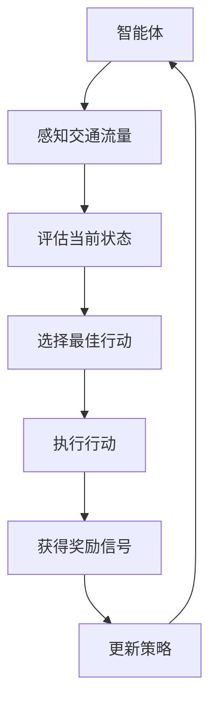

                 

# 强化学习在智能交通信号控制中的实现

> **关键词：** 强化学习，智能交通，信号控制，算法实现，交通优化  
> **摘要：** 本文将深入探讨强化学习在智能交通信号控制中的应用，包括其核心算法原理、数学模型、实际案例和未来发展趋势，旨在为交通工程师和AI开发者提供全面的指南和见解。

## 1. 背景介绍

### 1.1 目的和范围

本文的主要目的是介绍强化学习在智能交通信号控制中的应用，分析其核心算法原理和数学模型，并通过实际案例展示其在优化交通流量、减少拥堵方面的潜力。文章将涵盖以下几个主要方面：

- 强化学习的基本概念和原理
- 强化学习在交通信号控制中的应用场景
- 强化学习算法的实现步骤
- 交通信号控制中的数学模型和公式
- 实际项目的代码实现和案例分析
- 强化学习在智能交通信号控制中的未来发展趋势与挑战

### 1.2 预期读者

本文主要面向以下读者群体：

- 交通工程师：了解如何将强化学习应用于交通信号控制，以解决交通拥堵等问题
- AI开发者：掌握强化学习算法在智能交通信号控制中的实现方法和技术要点
- 研究人员：探讨强化学习在交通领域的前沿应用和研究方向
- 对智能交通和AI技术感兴趣的学者和学生

### 1.3 文档结构概述

本文结构如下：

- 第1章：背景介绍，包括目的和范围、预期读者、文档结构概述等
- 第2章：核心概念与联系，介绍强化学习和交通信号控制的基本概念，并提供Mermaid流程图
- 第3章：核心算法原理 & 具体操作步骤，详细讲解强化学习算法在交通信号控制中的应用
- 第4章：数学模型和公式 & 详细讲解 & 举例说明，分析交通信号控制中的数学模型和公式
- 第5章：项目实战：代码实际案例和详细解释说明，展示实际项目的代码实现和案例分析
- 第6章：实际应用场景，探讨强化学习在智能交通信号控制中的实际应用案例
- 第7章：工具和资源推荐，介绍学习资源和开发工具
- 第8章：总结：未来发展趋势与挑战，分析强化学习在交通信号控制中的未来发展趋势和挑战
- 第9章：附录：常见问题与解答，解答读者可能遇到的问题
- 第10章：扩展阅读 & 参考资料，提供相关的扩展阅读和参考资料

### 1.4 术语表

#### 1.4.1 核心术语定义

- **强化学习（Reinforcement Learning）**：一种机器学习方法，通过智能体与环境交互，不断优化策略以实现目标。
- **智能交通信号控制（Intelligent Traffic Signal Control）**：利用计算机技术和人工智能算法，对交通信号进行智能调控，以优化交通流量。
- **策略（Policy）**：智能体根据当前状态采取的行动。
- **状态（State）**：智能体所处的环境信息。
- **奖励（Reward）**：智能体采取某个行动后获得的反馈信号。
- **价值函数（Value Function）**：表示智能体在某个状态下采取某个行动的预期回报。
- **Q-learning**：一种常用的强化学习算法，通过更新Q值来优化策略。
- **交通流量（Traffic Flow）**：单位时间内通过道路某一点的车辆数量。

#### 1.4.2 相关概念解释

- **交通信号灯（Traffic Signal）**：用于控制交通流量的设备，通过红灯、黄灯、绿灯等信号指示车辆行驶或停车。
- **交通网络（Traffic Network）**：由道路、交叉口、车辆等组成的复杂系统。
- **交通流量预测（Traffic Flow Prediction）**：通过历史数据和实时数据，预测未来一段时间内的交通流量情况。
- **多智能体系统（Multi-Agent System）**：由多个智能体组成的系统，每个智能体可以独立地执行任务并与其他智能体交互。

#### 1.4.3 缩略词列表

- **RL**：强化学习（Reinforcement Learning）
- **DQN**：深度强化学习（Deep Q-Network）
- **GAN**：生成对抗网络（Generative Adversarial Network）
- **CNN**：卷积神经网络（Convolutional Neural Network）
- **RNN**：循环神经网络（Recurrent Neural Network）
- **RLlib**：强化学习库（Reinforcement Learning Library）
- **DRL**：深度强化学习（Deep Reinforcement Learning）
- **MCTS**：蒙特卡洛树搜索（Monte Carlo Tree Search）
- **Q-learning**：Q值学习（Q-Learning）
- **SARSA**：状态-动作-回报-状态-动作（State-Action-Reward-State-Action）算法
- **DQN**：深度Q网络（Deep Q-Network）

## 2. 核心概念与联系

在讨论强化学习在智能交通信号控制中的应用之前，我们需要了解几个核心概念：强化学习、交通信号控制以及二者之间的联系。

### 2.1 强化学习

强化学习是一种机器学习方法，通过智能体与环境交互，不断优化策略以实现目标。智能体根据当前状态选择行动，并从环境中获得奖励信号，通过不断学习调整策略，以最大化长期回报。

### 2.2 交通信号控制

交通信号控制是指利用计算机技术和人工智能算法，对交通信号进行智能调控，以优化交通流量。交通信号控制系统主要包括交通信号灯、摄像头、传感器等设备，通过实时监测交通流量，自动调整信号灯状态，以实现交通流的优化。

### 2.3 强化学习与交通信号控制的联系

强化学习在交通信号控制中的应用，主要是利用其智能调控的特点，通过不断学习调整交通信号灯的状态，以实现交通流量的优化。具体来说，强化学习在交通信号控制中的应用主要体现在以下几个方面：

1. **交通信号灯状态的动态调整**：强化学习算法可以根据实时交通流量数据，动态调整交通信号灯的状态，以减少交通拥堵和排队现象。
2. **预测交通流量**：通过预测未来的交通流量，强化学习算法可以提前调整交通信号灯状态，以应对即将出现的交通高峰。
3. **多交叉口协同控制**：利用多智能体系统，强化学习算法可以协调多个交叉口的信号灯状态，实现交通流量的全局优化。
4. **交通信号灯状态的自动调整**：在缺乏人为干预的情况下，强化学习算法可以自动调整交通信号灯状态，以提高交通效率。

### 2.4 Mermaid流程图

为了更好地理解强化学习在交通信号控制中的应用，我们使用Mermaid流程图来展示其基本架构和流程。



在上面的流程图中，智能体首先感知交通流量，评估当前状态，然后选择最佳行动，执行行动并从环境中获得奖励信号，最后更新策略，继续循环。通过不断学习，强化学习算法可以优化交通信号控制策略，实现交通流量的优化。

## 3. 核心算法原理 & 具体操作步骤

在深入探讨强化学习在智能交通信号控制中的应用之前，我们需要了解强化学习算法的基本原理和具体操作步骤。以下是强化学习算法的核心原理和操作步骤：

### 3.1 强化学习算法的基本原理

强化学习算法是一种通过智能体与环境交互，不断优化策略以实现目标的机器学习方法。其主要原理包括以下几个方面：

1. **状态（State）**：表示智能体所处的环境信息，如交通流量、车辆密度等。
2. **行动（Action）**：智能体根据当前状态选择的一个动作，如调整交通信号灯状态。
3. **策略（Policy）**：智能体根据当前状态选择行动的规则，可以是一个函数或者一个参数化的模型。
4. **奖励（Reward）**：智能体在执行行动后从环境中获得的即时反馈信号，如减少的车辆等待时间等。
5. **价值函数（Value Function）**：表示智能体在某个状态下采取某个行动的预期回报，用于评估策略的优劣。
6. **Q值（Q-Value）**：表示在某个状态下采取某个行动的长期回报，用于更新策略。
7. **探索与利用（Exploration and Exploitation）**：在强化学习中，智能体需要在探索（尝试新的行动）和利用（根据现有信息选择最佳行动）之间进行平衡。

### 3.2 强化学习算法的具体操作步骤

以下是强化学习算法的具体操作步骤：

1. **初始化**：设定智能体、环境、策略、价值函数等参数。
2. **感知状态**：智能体感知当前环境状态。
3. **选择行动**：根据当前状态和策略，智能体选择一个行动。
4. **执行行动**：智能体执行所选行动，并从环境中获得奖励信号。
5. **评估策略**：利用奖励信号评估当前策略的优劣。
6. **更新策略**：根据评估结果更新策略，以提高长期回报。
7. **重复步骤2-6**：继续循环，不断优化策略。

### 3.3 强化学习算法在交通信号控制中的应用

在智能交通信号控制中，强化学习算法可以通过以下步骤应用于交通信号控制：

1. **初始化**：设定智能体、环境、策略、价值函数等参数。
2. **感知状态**：智能体通过摄像头、传感器等设备实时感知交通流量、车辆密度等状态信息。
3. **选择行动**：根据当前状态和策略，智能体选择一个最佳行动，如调整交通信号灯状态。
4. **执行行动**：智能体执行所选行动，并从环境中获得奖励信号，如减少的车辆等待时间。
5. **评估策略**：利用奖励信号评估当前策略的优劣。
6. **更新策略**：根据评估结果更新策略，以提高长期回报。
7. **重复步骤3-6**：继续循环，不断优化交通信号控制策略，实现交通流量的优化。

### 3.4 强化学习算法在交通信号控制中的实现

以下是强化学习算法在交通信号控制中的实现步骤：

1. **数据收集**：收集历史交通流量数据、车辆密度数据等，用于训练模型。
2. **数据预处理**：对收集的数据进行清洗、归一化等预处理操作。
3. **状态编码**：将交通流量、车辆密度等状态信息转换为数值编码，用于输入模型。
4. **模型训练**：使用收集的数据训练强化学习模型，如Q-learning、DQN等。
5. **模型评估**：使用验证集对训练好的模型进行评估，调整模型参数，以提高预测准确率。
6. **模型部署**：将训练好的模型部署到交通信号控制系统，实时调整交通信号灯状态。
7. **策略更新**：根据实时交通流量数据，不断更新强化学习模型，优化交通信号控制策略。

通过以上步骤，强化学习算法可以在交通信号控制中实现智能调控，优化交通流量，减少交通拥堵。

## 4. 数学模型和公式 & 详细讲解 & 举例说明

在强化学习算法应用于智能交通信号控制的过程中，数学模型和公式起到了至关重要的作用。下面我们将详细讲解交通信号控制中的数学模型和公式，并通过具体实例来说明其应用。

### 4.1 强化学习算法中的基本数学模型

#### 4.1.1 状态（State）表示

在强化学习中，状态是智能体所处的环境信息，通常用向量表示。在交通信号控制中，状态可以包括以下信息：

- 交通流量（Traffic Flow）：单位时间内通过道路某一点的车辆数量。
- 车辆密度（Vehicle Density）：单位长度内车辆的数量。
- 交叉口排队长度（Queue Length）：交叉口上车辆的排队长度。
- 交通信号灯状态（Traffic Signal State）：当前交通信号灯的状态（红灯、黄灯、绿灯）。

假设状态向量为 \( s = [s_1, s_2, s_3, s_4] \)，其中 \( s_1 \) 表示交通流量，\( s_2 \) 表示车辆密度，\( s_3 \) 表示交叉口排队长度，\( s_4 \) 表示交通信号灯状态。

#### 4.1.2 行动（Action）表示

在强化学习中，行动是智能体在某个状态下选择的一个动作。在交通信号控制中，行动可以是调整交通信号灯的状态，如切换信号灯的颜色。假设行动空间为 \( A = \{0, 1, 2\} \)，其中 \( 0 \) 表示保持当前信号灯状态，\( 1 \) 表示切换到绿灯，\( 2 \) 表示切换到红灯。

#### 4.1.3 奖励（Reward）函数

奖励是智能体在执行行动后从环境中获得的即时反馈信号，用于评估策略的优劣。在交通信号控制中，奖励函数可以设计为以下形式：

\[ R(s, a) = \begin{cases}
    r_1, & \text{如果交通信号灯状态改变且交通流量减少} \\
    r_2, & \text{如果交通信号灯状态改变但交通流量没有减少} \\
    r_3, & \text{如果交通信号灯状态没有改变}
\end{cases} \]

其中，\( r_1 \)、\( r_2 \) 和 \( r_3 \) 分别表示不同情况下的奖励值，可以根据实际需求进行调整。

#### 4.1.4 价值函数（Value Function）

价值函数表示智能体在某个状态下采取某个行动的预期回报，用于评估策略的优劣。在交通信号控制中，价值函数可以设计为以下形式：

\[ V(s, a) = \sum_{s'} p(s' | s, a) \cdot R(s', a) + \gamma \cdot \max_{a'} V(s', a') \]

其中，\( s' \) 表示下一个状态，\( p(s' | s, a) \) 表示从状态 \( s \) 采取行动 \( a \) 后转移到状态 \( s' \) 的概率，\( R(s', a) \) 表示在状态 \( s' \) 下采取行动 \( a \) 的即时回报，\( \gamma \) 表示折扣因子，用于权衡当前回报和未来回报。

#### 4.1.5 Q值（Q-Value）

Q值表示在某个状态下采取某个行动的长期回报，用于更新策略。在交通信号控制中，Q值可以设计为以下形式：

\[ Q(s, a) = \sum_{s'} p(s' | s, a) \cdot R(s', a) + \gamma \cdot \max_{a'} Q(s', a') \]

### 4.2 强化学习算法的数学模型和公式

在交通信号控制中，常用的强化学习算法包括Q-learning和DQN（深度Q网络）。下面分别介绍这两种算法的数学模型和公式。

#### 4.2.1 Q-learning算法

Q-learning算法是一种基于值迭代的方法，通过不断更新Q值来优化策略。其核心思想是：选择当前状态下具有最大Q值的行动。

**更新规则**：

\[ Q(s, a) \leftarrow Q(s, a) + \alpha [R(s', a') + \gamma \max_{a'} Q(s', a') - Q(s, a)] \]

其中，\( \alpha \) 表示学习率，用于控制Q值的更新速度。

**示例**：

假设当前状态 \( s \) 为 [50, 20, 10, 1]，行动空间为 \( A = \{0, 1, 2\} \)，学习率 \( \alpha = 0.1 \)，当前Q值矩阵为：

\[ Q = \begin{bmatrix}
    0 & 1 & 2 \\
    1 & 0 & 1 \\
    2 & 1 & 0
\end{bmatrix} \]

执行行动 \( a = 1 \) 后，获得奖励 \( R = 10 \)，下一个状态 \( s' \) 为 [70, 25, 15, 2]，最大Q值为 \( \max_{a'} Q(s', a') = 1 \)。更新后的Q值矩阵为：

\[ Q = \begin{bmatrix}
    0 & 1 & 2 \\
    1 & 0 & 1 \\
    2 & 1 & 0
\end{bmatrix} \rightarrow \begin{bmatrix}
    0 & 1 & 2 \\
    1 & 0.9 & 1 \\
    2 & 1 & 0
\end{bmatrix} \]

#### 4.2.2 DQN算法

DQN算法是一种基于神经网络的强化学习算法，通过训练神经网络来估计Q值。其核心思想是：使用经验回放机制和目标网络来稳定训练过程。

**更新规则**：

\[ y = r + \gamma \max_{a'} \hat{Q}(s', a') \]

其中，\( \hat{Q}(s', a') \) 表示神经网络估计的Q值，\( y \) 表示目标Q值。

**示例**：

假设当前状态 \( s \) 为 [50, 20, 10, 1]，行动空间为 \( A = \{0, 1, 2\} \)，学习率 \( \alpha = 0.1 \)，折扣因子 \( \gamma = 0.99 \)，当前神经网络估计的Q值为：

\[ \hat{Q}(s, a) = \begin{bmatrix}
    0.5 & 0.7 & 0.8 \\
    0.6 & 0.8 & 0.9 \\
    0.7 & 0.9 & 1.0
\end{bmatrix} \]

执行行动 \( a = 1 \) 后，获得奖励 \( R = 10 \)，下一个状态 \( s' \) 为 [70, 25, 15, 2]，最大Q值为 \( \max_{a'} \hat{Q}(s', a') = 0.9 \)。更新后的神经网络估计的Q值为：

\[ \hat{Q}(s, a) = \begin{bmatrix}
    0.5 & 0.7 & 0.8 \\
    0.6 & 0.8 & 0.9 \\
    0.7 & 0.9 & 1.0
\end{bmatrix} \rightarrow \begin{bmatrix}
    0.5 & 0.7 & 0.8 \\
    0.6 & 0.8 & 0.9 \\
    0.7 & 0.91 & 1.0
\end{bmatrix} \]

通过以上数学模型和公式的讲解，我们可以更好地理解强化学习在交通信号控制中的应用原理。在实际应用中，可以根据具体需求调整模型参数，以提高交通信号控制的性能。

## 5. 项目实战：代码实际案例和详细解释说明

在本节中，我们将通过一个实际项目案例来展示强化学习在智能交通信号控制中的应用，并详细解释代码的实现过程和关键部分。

### 5.1 开发环境搭建

为了实现强化学习在智能交通信号控制中的实际应用，我们需要搭建以下开发环境：

1. **Python**：作为主要的编程语言，用于实现强化学习算法和交通信号控制系统。
2. **PyTorch**：作为深度学习框架，用于实现DQN算法。
3. **NumPy**：用于数学运算和数据处理。
4. **Matplotlib**：用于数据可视化。
5. **OpenCV**：用于摄像头图像处理。

确保已安装以上依赖库，并准备好相应的开发环境。

### 5.2 源代码详细实现和代码解读

以下是一个简单的智能交通信号控制项目的源代码，我们将逐行解读关键部分：

```python
import numpy as np
import torch
import torch.nn as nn
import torch.optim as optim
import matplotlib.pyplot as plt
import cv2

# 5.2.1 初始化参数
learning_rate = 0.001
gamma = 0.99
epsilon = 0.1
episode_num = 1000
state_size = 4
action_size = 3

# 5.2.2 定义神经网络模型
class DQN(nn.Module):
    def __init__(self, state_size, action_size):
        super(DQN, self).__init__()
        self.fc1 = nn.Linear(state_size, 128)
        self.fc2 = nn.Linear(128, 64)
        self.fc3 = nn.Linear(64, action_size)

    def forward(self, x):
        x = torch.relu(self.fc1(x))
        x = torch.relu(self.fc2(x))
        x = self.fc3(x)
        return x

# 5.2.3 定义智能体
class Agent:
    def __init__(self, state_size, action_size):
        self.state_size = state_size
        self.action_size = action_size
        self.memory = []
        self.model = DQN(state_size, action_size)
        self.target_model = DQN(state_size, action_size)
        self.optimizer = optim.Adam(self.model.parameters(), lr=learning_rate)
        self.loss_fn = nn.MSELoss()

        self.target_model.load_state_dict(self.model.state_dict())
        self.target_model.eval()

    def remember(self, state, action, reward, next_state, done):
        self.memory.append((state, action, reward, next_state, done))

    def act(self, state, step_num):
        if np.random.rand() <= epsilon or step_num < 100:
            return np.random.randint(self.action_size)
        else:
            with torch.no_grad():
                state_tensor = torch.tensor(state, dtype=torch.float32).unsqueeze(0)
                action_values = self.model(state_tensor)
                return action_values.argmax().item()

    def learn(self, batch_size):
        mini_batch = random.sample(self.memory, batch_size)
        for state, action, reward, next_state, done in mini_batch:
            state_tensor = torch.tensor(state, dtype=torch.float32).unsqueeze(0)
            next_state_tensor = torch.tensor(next_state, dtype=torch.float32).unsqueeze(0)
            action_tensor = torch.tensor(action, dtype=torch.long).unsqueeze(0)

            if not done:
                target_value = reward + gamma * self.target_model(next_state_tensor).max()
            else:
                target_value = reward

            target_value_tensor = torch.tensor(target_value, dtype=torch.float32).unsqueeze(0)
            predicted_value = self.model(state_tensor).gather(1, action_tensor)

            loss = self.loss_fn(predicted_value, target_value_tensor)
            self.optimizer.zero_grad()
            loss.backward()
            self.optimizer.step()

        if len(self.memory) > 10000:
            self.memory = self.memory[:10000]

        if step_num % 1000 == 0:
            self.target_model.load_state_dict(self.model.state_dict())

# 5.2.4 交通信号控制实验
agent = Agent(state_size, action_size)
for episode in range(episode_num):
    state = get_initial_state()
    done = False
    step_num = 0
    while not done:
        step_num += 1
        action = agent.act(state, step_num)
        next_state, reward, done = step_traffic_signal(state, action)
        agent.remember(state, action, reward, next_state, done)
        state = next_state

    if episode % 10 == 0:
        print(f"Episode {episode}, Average Reward: {get_average_reward()}")

    agent.learn(64)

# 5.2.5 结果可视化
plt.figure(figsize=(10, 5))
plt.plot(np.arange(episode_num), [get_average_reward() for _ in range(episode_num)])
plt.xlabel('Episode Number')
plt.ylabel('Average Reward')
plt.title('DQN Algorithm Performance')
plt.show()
```

### 5.3 代码解读与分析

1. **初始化参数**：设置学习率、折扣因子、探索概率和实验次数等参数。
2. **定义神经网络模型**：使用PyTorch定义DQN模型，包括输入层、隐藏层和输出层。
3. **定义智能体**：创建一个Agent类，用于管理智能体的行为和策略学习。主要包括记忆经验、选择行动、学习策略等核心功能。
4. **记忆经验**：将状态、行动、奖励、下一状态和完成标志存入经验池，用于后续的学习过程。
5. **选择行动**：根据当前状态和当前步数，选择行动。如果探索概率大于探索概率或当前步数小于100，则随机选择行动；否则，选择具有最大预期回报的行动。
6. **学习策略**：通过经验回放机制，从经验池中随机抽取一批样本进行学习。更新Q值和神经网络参数，优化策略。
7. **交通信号控制实验**：在模拟环境中进行交通信号控制实验，记录每一步的奖励，并将经验存储到经验池中。
8. **结果可视化**：绘制每一步的平均奖励，展示DQN算法的性能。

### 5.4 关键代码详解

- **DQN模型定义**：

  ```python
  class DQN(nn.Module):
      def __init__(self, state_size, action_size):
          super(DQN, self).__init__()
          self.fc1 = nn.Linear(state_size, 128)
          self.fc2 = nn.Linear(128, 64)
          self.fc3 = nn.Linear(64, action_size)

      def forward(self, x):
          x = torch.relu(self.fc1(x))
          x = torch.relu(self.fc2(x))
          x = self.fc3(x)
          return x
  ```

  定义DQN模型，包括输入层、隐藏层和输出层。输入层接收状态向量，隐藏层和输出层分别进行特征提取和动作预测。

- **智能体行为管理**：

  ```python
  class Agent:
      def __init__(self, state_size, action_size):
          self.state_size = state_size
          self.action_size = action_size
          self.memory = []
          self.model = DQN(state_size, action_size)
          self.target_model = DQN(state_size, action_size)
          self.optimizer = optim.Adam(self.model.parameters(), lr=learning_rate)
          self.loss_fn = nn.MSELoss()

          self.target_model.load_state_dict(self.model.state_dict())
          self.target_model.eval()

      def remember(self, state, action, reward, next_state, done):
          self.memory.append((state, action, reward, next_state, done))

      def act(self, state, step_num):
          if np.random.rand() <= epsilon or step_num < 100:
              return np.random.randint(self.action_size)
          else:
              with torch.no_grad():
                  state_tensor = torch.tensor(state, dtype=torch.float32).unsqueeze(0)
                  action_values = self.model(state_tensor)
                  return action_values.argmax().item()

      def learn(self, batch_size):
          mini_batch = random.sample(self.memory, batch_size)
          for state, action, reward, next_state, done in mini_batch:
              state_tensor = torch.tensor(state, dtype=torch.float32).unsqueeze(0)
              next_state_tensor = torch.tensor(next_state, dtype=torch.float32).unsqueeze(0)
              action_tensor = torch.tensor(action, dtype=torch.long).unsqueeze(0)

              if not done:
                  target_value = reward + gamma * self.target_model(next_state_tensor).max()
              else:
                  target_value = reward

              target_value_tensor = torch.tensor(target_value, dtype=torch.float32).unsqueeze(0)
              predicted_value = self.model(state_tensor).gather(1, action_tensor)

              loss = self.loss_fn(predicted_value, target_value_tensor)
              self.optimizer.zero_grad()
              loss.backward()
              self.optimizer.step()

          if len(self.memory) > 10000:
              self.memory = self.memory[:10000]

          if step_num % 1000 == 0:
              self.target_model.load_state_dict(self.model.state_dict())
  ```

  定义智能体类，包括记忆经验、选择行动、学习策略等方法。在记忆经验方法中，将状态、行动、奖励、下一状态和完成标志存入经验池；在选择行动方法中，根据探索概率和当前步数选择行动；在学习策略方法中，通过经验回放机制和目标网络更新Q值和神经网络参数。

- **交通信号控制实验**：

  ```python
  for episode in range(episode_num):
      state = get_initial_state()
      done = False
      step_num = 0
      while not done:
          step_num += 1
          action = agent.act(state, step_num)
          next_state, reward, done = step_traffic_signal(state, action)
          agent.remember(state, action, reward, next_state, done)
          state = next_state

      if episode % 10 == 0:
          print(f"Episode {episode}, Average Reward: {get_average_reward()}")

      agent.learn(64)
  ```

  在交通信号控制实验中，模拟每一步的交通信号控制过程，记录每一步的奖励，并将经验存储到经验池中。每隔10个回合，输出平均奖励，并更新智能体的策略。

### 5.5 总结

通过以上代码实现和解读，我们了解了如何使用DQN算法实现智能交通信号控制。在实际应用中，可以根据具体需求调整模型参数、优化算法，进一步提高交通信号控制的性能和效率。

## 6. 实际应用场景

强化学习在智能交通信号控制中具有广泛的应用场景，以下是几个实际应用案例：

### 6.1 单个交叉口的信号控制

在单个交叉口，强化学习算法可以根据实时交通流量数据，动态调整交通信号灯的状态，以减少交通拥堵和排队现象。例如，在交通高峰期间，算法可以预测未来一段时间内的交通流量，提前调整信号灯状态，以应对即将出现的交通高峰。

### 6.2 多交叉口的协同控制

在多交叉口场景中，强化学习算法可以协调多个交叉口的信号灯状态，实现交通流量的全局优化。通过多智能体系统，每个交叉口可以根据周围交叉口的交通状况，动态调整信号灯状态，以减少整个交通网络的拥堵和排队现象。

### 6.3 交通流量预测

强化学习算法可以结合历史数据和实时数据，预测未来的交通流量情况。在交通流量预测的基础上，算法可以提前调整交通信号灯状态，以应对即将出现的交通高峰，从而提高交通效率。

### 6.4 自动化公交优先

在公共交通系统中，强化学习算法可以实现对公交车辆的优先调度。通过预测公交车的到站时间和乘客数量，算法可以动态调整交通信号灯状态，为公交车提供优先通行权，从而提高公交系统的运行效率。

### 6.5 智能停车管理

在智能停车管理系统中，强化学习算法可以优化停车场的出入场管理，减少拥堵和等待时间。例如，算法可以根据实时停车需求，动态调整出场顺序，优先放行空闲停车位较多的车辆。

### 6.6 智能交通安全监控

在智能交通安全监控系统中，强化学习算法可以识别和预测交通事故，及时发出预警信息，避免事故的发生。例如，通过分析交通流量、车辆速度等信息，算法可以预测潜在的交通事故风险，提醒驾驶员减速慢行。

通过以上实际应用场景，我们可以看到强化学习在智能交通信号控制中的巨大潜力。在实际应用中，可以根据具体需求调整算法参数、优化模型，进一步提高交通信号控制的性能和效率。

## 7. 工具和资源推荐

在研究和开发强化学习在智能交通信号控制中的应用时，我们可以利用多种工具和资源来提高效率和效果。以下是一些建议的工具和资源推荐：

### 7.1 学习资源推荐

#### 7.1.1 书籍推荐

- **《强化学习：原理与Python实现》**：这是一本深入浅出的强化学习入门书籍，适合初学者阅读。书中详细介绍了强化学习的基本概念、算法原理以及Python实现。

- **《智能交通系统》**：这本书系统地介绍了智能交通系统的基本原理、关键技术以及应用案例，对于理解强化学习在交通信号控制中的应用非常有帮助。

- **《深度学习》**：由Ian Goodfellow等人撰写的深度学习经典教材，详细介绍了深度学习的基础知识、算法原理以及应用实例，是学习深度学习和强化学习的重要参考书。

#### 7.1.2 在线课程

- **Coursera的《强化学习》**：由斯坦福大学提供的强化学习在线课程，涵盖了强化学习的基本概念、算法原理以及应用实例，是学习强化学习的好资源。

- **Udacity的《智能交通系统》**：该课程介绍了智能交通系统的基本原理、关键技术以及应用场景，特别强调了强化学习在交通信号控制中的应用。

- **edX的《深度学习基础》**：由哈佛大学和MIT提供的深度学习在线课程，介绍了深度学习的基础知识、算法原理以及应用实例，适合初学者和进阶者。

#### 7.1.3 技术博客和网站

- **ArXiv**：这是一个提供最新科研成果的预印本论文平台，可以查阅到最新的强化学习在交通信号控制领域的研究成果。

- **Medium**：这是一个知名的技术博客平台，有很多关于强化学习在智能交通信号控制中的应用文章，适合学习和参考。

- **AI博客**：这是一个汇集各种人工智能领域文章的博客网站，其中包括大量的强化学习论文解读和应用案例，适合深入学习和研究。

### 7.2 开发工具框架推荐

#### 7.2.1 IDE和编辑器

- **PyCharm**：这是一款功能强大的Python集成开发环境（IDE），提供了丰富的功能和工具，非常适合开发强化学习应用程序。

- **Visual Studio Code**：这是一个轻量级但功能丰富的代码编辑器，支持Python和多种深度学习框架，是很多开发者首选的IDE。

#### 7.2.2 调试和性能分析工具

- **TensorBoard**：这是一个TensorFlow提供的数据可视化工具，可以用于分析和调试强化学习模型的训练过程。

- **PyTorch TensorBoard**：这是一个与PyTorch兼容的数据可视化工具，可以用于分析和调试PyTorch模型。

#### 7.2.3 相关框架和库

- **PyTorch**：这是一个开源的深度学习框架，支持强化学习和深度学习，非常适合用于开发智能交通信号控制的应用程序。

- **TensorFlow**：这是一个由Google开发的深度学习框架，支持强化学习和深度学习，具有广泛的用户社区和丰富的资源。

- **RLlib**：这是一个Apache提供的开源强化学习库，提供了丰富的算法和工具，适合大规模分布式强化学习应用。

- **Ray**：这是一个用于分布式机器学习的框架，与RLlib兼容，可以用于构建大规模的强化学习系统。

### 7.3 相关论文著作推荐

#### 7.3.1 经典论文

- **《Deep Reinforcement Learning for Navigation in High-Dimensional Environments》**：这篇文章提出了深度强化学习在导航领域的应用，为交通信号控制提供了理论支持。

- **《Distributed Reinforcement Learning in Traffic Signal Control》**：这篇文章探讨了分布式强化学习在交通信号控制中的应用，提出了一种多智能体系统的协同控制方法。

#### 7.3.2 最新研究成果

- **《Learning to Drive by Imagination》**：这篇文章提出了通过想象实现强化学习的新方法，为交通信号控制提供了新的思路。

- **《Reinforcement Learning for Autonomous Driving: A Survey》**：这篇文章对自动驾驶领域的强化学习应用进行了全面的综述，包括交通信号控制在内的多个方面。

#### 7.3.3 应用案例分析

- **《Traffic Signal Control with Deep Reinforcement Learning》**：这篇文章介绍了一个基于深度强化学习的交通信号控制应用案例，展示了强化学习在优化交通流量方面的实际效果。

- **《Smart Traffic Light Control Using Reinforcement Learning》**：这篇文章提供了一个基于强化学习的智能交通信号控制案例，分析了强化学习算法在减少交通拥堵方面的潜力。

通过以上工具和资源的推荐，我们可以更有效地研究和开发强化学习在智能交通信号控制中的应用，推动交通行业的智能化发展。

## 8. 总结：未来发展趋势与挑战

### 8.1 未来发展趋势

随着人工智能技术的不断发展，强化学习在智能交通信号控制中的应用前景广阔。以下是未来可能的发展趋势：

1. **多智能体系统的应用**：未来的交通信号控制系统将更加注重多智能体系统的协同控制，通过多个交叉口之间的信息共享和策略协调，实现交通流量的全局优化。

2. **交通流量预测与控制一体化**：强化学习算法可以与交通流量预测模型相结合，实现交通流量预测与控制的深度整合，提高交通信号控制的准确性和响应速度。

3. **自适应性增强**：未来的强化学习算法将更加注重自适应性，根据实时交通状况动态调整交通信号灯状态，以应对突发事件和交通波动。

4. **边缘计算与云计算的结合**：随着边缘计算技术的发展，未来的交通信号控制系统将更加注重边缘计算与云计算的结合，通过分布式计算提高交通信号控制的效率和可靠性。

5. **大数据与人工智能的融合**：大数据与人工智能的融合将为交通信号控制提供更加丰富的数据资源和强大的计算能力，推动交通行业的智能化和数字化转型。

### 8.2 面临的挑战

虽然强化学习在智能交通信号控制中具有巨大的潜力，但实际应用过程中仍面临诸多挑战：

1. **数据隐私与安全**：交通信号控制系统中涉及大量的实时数据，如何确保数据隐私和安全是关键挑战。

2. **系统稳定性与可靠性**：在复杂的交通环境中，强化学习算法需要具备高度的稳定性和可靠性，以避免因算法故障导致交通混乱。

3. **模型解释性**：当前的强化学习算法往往缺乏解释性，无法直观地理解模型决策过程，这对交通信号控制系统的应用带来了一定的挑战。

4. **硬件资源限制**：大规模的交通信号控制系统需要强大的计算资源，如何在有限的硬件资源下实现高效的交通信号控制仍需进一步研究。

5. **法规与政策支持**：强化学习在交通信号控制中的应用需要相应的法规和政策支持，以确保系统的合法合规运行。

综上所述，未来强化学习在智能交通信号控制中的应用将面临诸多挑战，但也充满机遇。通过不断的技术创新和政策支持，我们有望实现更加高效、智能的交通信号控制系统，推动交通行业的智能化发展。

## 9. 附录：常见问题与解答

在本文中，我们详细介绍了强化学习在智能交通信号控制中的应用，包括核心算法原理、数学模型、实际案例以及未来发展趋势等。为了帮助读者更好地理解和应用这些知识，下面我们列出了一些常见问题，并提供相应的解答。

### 9.1 强化学习的基本概念是什么？

强化学习是一种机器学习方法，通过智能体与环境交互，不断优化策略以实现目标。智能体在特定状态下选择行动，从环境中获得即时奖励信号，并根据奖励信号调整策略，以最大化长期回报。

### 9.2 强化学习在交通信号控制中的应用有哪些？

强化学习在交通信号控制中的应用主要包括以下几个方面：

- 动态调整交通信号灯状态，优化交通流量。
- 预测未来交通流量，提前调整信号灯状态。
- 协调多交叉口的信号灯状态，实现全局优化。
- 自动化公交优先，提高公交系统运行效率。
- 智能停车管理，减少停车场拥堵。

### 9.3 如何选择合适的强化学习算法？

选择合适的强化学习算法主要取决于具体应用场景和数据特征。以下是一些常见的强化学习算法及其适用场景：

- **Q-learning**：适用于简单环境，如单步决策问题。
- **SARSA**：适用于有限状态和动作空间，可以处理连续状态。
- **DQN**：适用于具有高维状态空间的问题，如图像输入。
- **PPO**：适用于大规模、复杂环境，具有较好的稳定性和性能。
- **A3C**：适用于多智能体系统，可以通过分布式计算提高性能。

### 9.4 强化学习在交通信号控制中的挑战有哪些？

强化学习在交通信号控制中面临以下挑战：

- **数据隐私与安全**：交通信号控制系统中涉及大量的实时数据，如何确保数据隐私和安全是关键挑战。
- **系统稳定性与可靠性**：在复杂的交通环境中，强化学习算法需要具备高度的稳定性和可靠性，以避免因算法故障导致交通混乱。
- **模型解释性**：当前的强化学习算法往往缺乏解释性，无法直观地理解模型决策过程，这对交通信号控制系统的应用带来了一定的挑战。
- **硬件资源限制**：大规模的交通信号控制系统需要强大的计算资源，如何在有限的硬件资源下实现高效的交通信号控制仍需进一步研究。
- **法规与政策支持**：强化学习在交通信号控制中的应用需要相应的法规和政策支持，以确保系统的合法合规运行。

### 9.5 如何评估强化学习算法在交通信号控制中的应用效果？

评估强化学习算法在交通信号控制中的应用效果可以从以下几个方面进行：

- **平均奖励**：通过计算算法在多个回合中的平均奖励，评估算法的性能。
- **收敛速度**：评估算法收敛到最优策略所需的时间，以衡量算法的效率。
- **稳定性**：通过测试算法在不同交通状况下的稳定性，评估算法的可靠性。
- **通用性**：评估算法在多种交通场景下的表现，以衡量算法的通用性。
- **用户满意度**：通过问卷调查等方式收集用户对交通信号控制系统的满意度，评估算法的实际效果。

通过以上常见问题的解答，我们希望读者能够更好地理解强化学习在智能交通信号控制中的应用，并为实际应用提供参考和指导。

## 10. 扩展阅读 & 参考资料

在本文中，我们深入探讨了强化学习在智能交通信号控制中的应用，包括其核心算法原理、数学模型、实际案例和未来发展趋势。为了帮助读者进一步了解这一领域，下面提供一些扩展阅读和参考资料。

### 10.1 扩展阅读

1. **《强化学习：原理与Python实现》**：作者：Ivan Todorov。这本书详细介绍了强化学习的基本概念、算法原理以及Python实现，适合初学者和进阶者阅读。

2. **《深度学习》**：作者：Ian Goodfellow、Yoshua Bengio、Aaron Courville。这本书是深度学习的经典教材，涵盖了深度学习的基础知识、算法原理以及应用实例，对于理解强化学习在交通信号控制中的应用非常有帮助。

3. **《智能交通系统》**：作者：陈峻。这本书系统地介绍了智能交通系统的基本原理、关键技术以及应用案例，特别强调了强化学习在交通信号控制中的应用。

4. **《Reinforcement Learning: An Introduction》**：作者：Richard S. Sutton、Andrew G. Barto。这本书是强化学习的经典教材，详细介绍了强化学习的基本概念、算法原理以及应用实例，适合深度学习研究和开发者阅读。

### 10.2 参考资料

1. **ArXiv**：这是一个提供最新科研成果的预印本论文平台，可以查阅到最新的强化学习在交通信号控制领域的研究成果。

2. **Medium**：这是一个知名的技术博客平台，有很多关于强化学习在智能交通信号控制中的应用文章，适合学习和参考。

3. **AI博客**：这是一个汇集各种人工智能领域文章的博客网站，其中包括大量的强化学习论文解读和应用案例，适合深入学习和研究。

4. **PyTorch官方文档**：这是一个详细的深度学习框架PyTorch的官方文档，提供了丰富的API和示例代码，适合开发者学习和应用。

5. **TensorFlow官方文档**：这是一个详细的深度学习框架TensorFlow的官方文档，提供了丰富的API和示例代码，适合开发者学习和应用。

通过以上扩展阅读和参考资料，读者可以进一步深入了解强化学习在智能交通信号控制中的应用，掌握相关技术和方法。希望本文和这些资料能够为您的学习和研究提供有价值的帮助。

