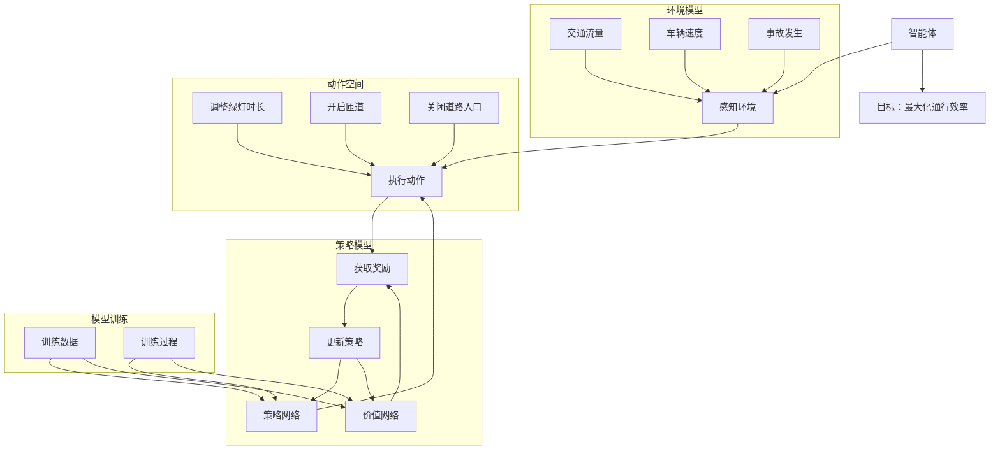

                 

# 强化学习在智能交通信号控制中的应用

> **关键词：强化学习、智能交通、信号控制、优化算法、交通流量管理**
>
> **摘要：本文详细探讨了强化学习在智能交通信号控制中的应用。通过介绍强化学习的基本原理，本文深入分析了其在交通信号控制中的具体应用场景。同时，本文通过数学模型和具体案例，阐述了如何利用强化学习优化交通信号控制策略，提升交通流量的效率和安全性。**

## 1. 背景介绍

### 1.1 目的和范围

本文旨在探讨强化学习在智能交通信号控制中的应用，通过分析其基本原理和具体实现，为相关研究人员和从业者提供理论支持和实践指导。本文将重点讨论以下内容：

1. 强化学习的基本概念和原理。
2. 强化学习在交通信号控制中的具体应用场景。
3. 利用强化学习优化交通信号控制策略的数学模型和算法。
4. 强化学习在交通信号控制中的实际案例和应用效果。

### 1.2 预期读者

本文适合具有以下背景的读者阅读：

1. 对强化学习和智能交通信号控制有一定了解的研究人员和工程师。
2. 对交通管理和优化感兴趣的计算机科学和交通运输领域的学者和学生。
3. 欲了解强化学习在智能交通信号控制中应用前景的企业和政府相关部门人员。

### 1.3 文档结构概述

本文分为十个部分：

1. 引言：介绍文章背景、目的和结构。
2. 核心概念与联系：介绍强化学习的基本概念和相关联系。
3. 核心算法原理 & 具体操作步骤：详细讲解强化学习的算法原理和操作步骤。
4. 数学模型和公式 & 详细讲解 & 举例说明：阐述强化学习的数学模型和具体例子。
5. 项目实战：代码实际案例和详细解释说明。
6. 实际应用场景：讨论强化学习在交通信号控制中的实际应用。
7. 工具和资源推荐：推荐相关学习资源和开发工具。
8. 总结：未来发展趋势与挑战。
9. 附录：常见问题与解答。
10. 扩展阅读 & 参考资料：提供更多深入学习和研究的参考资料。

### 1.4 术语表

#### 1.4.1 核心术语定义

1. **强化学习（Reinforcement Learning）**：一种机器学习方法，通过智能体（agent）与环境的交互，智能体不断学习最优策略以最大化预期奖励。
2. **智能交通信号控制（Intelligent Traffic Signal Control）**：利用现代信息技术和智能算法，对交通信号进行实时调整，以优化交通流量和提高道路通行效率。
3. **交通流量管理（Traffic Flow Management）**：通过合理分配交通资源，控制交通流，缓解交通拥堵，提高道路通行能力。
4. **奖励（Reward）**：在强化学习中，环境对智能体的行为给予的正负反馈，用于指导智能体学习最优策略。
5. **策略（Policy）**：在强化学习中，智能体执行的行为规则，用于指导智能体在特定状态下选择最优动作。

#### 1.4.2 相关概念解释

1. **状态（State）**：在强化学习中，描述智能体所处环境的特征集合。
2. **动作（Action）**：在强化学习中，智能体在特定状态下可以执行的行为。
3. **价值函数（Value Function）**：在强化学习中，用于评估智能体在不同状态下的预期奖励。
4. **策略网络（Policy Network）**：在深度强化学习中，用于生成策略的神经网络。
5. **Q网络（Q-Network）**：在深度强化学习中，用于评估动作价值的神经网络。

#### 1.4.3 缩略词列表

- **RL**：强化学习（Reinforcement Learning）
- **DRL**：深度强化学习（Deep Reinforcement Learning）
- **CNN**：卷积神经网络（Convolutional Neural Network）
- **RNN**：循环神经网络（Recurrent Neural Network）
- **PPO**：策略梯度优化（Proximal Policy Optimization）

## 2. 核心概念与联系

强化学习是一种通过试错和奖励反馈来学习最优策略的机器学习方法。在智能交通信号控制中，强化学习通过智能体与交通环境的交互，不断调整信号控制策略，以优化交通流量和提高道路通行效率。

### 2.1 强化学习基本概念

强化学习主要由以下四个核心概念组成：

1. **状态（State）**：描述交通环境的特征，如道路流量、车辆密度、绿灯时长等。
2. **动作（Action）**：智能体可执行的行为，如调整信号灯时长、开启匝道等。
3. **奖励（Reward）**：环境对智能体的行为给予的反馈，用于指导智能体学习最优策略。在交通信号控制中，奖励可以是减少的拥堵时间、提高的车辆通过率等。
4. **策略（Policy）**：智能体在特定状态下选择动作的规则。策略可以通过学习获得，也可以通过预定义。

### 2.2 强化学习在智能交通信号控制中的应用场景

强化学习在智能交通信号控制中的应用主要包括以下场景：

1. **实时交通信号控制**：根据实时交通流量数据，动态调整信号灯时长，优化交通流量。
2. **交叉路口优化**：通过强化学习算法，为交叉路口设计最优信号控制策略，减少交通拥堵和事故发生。
3. **道路网络优化**：针对整个道路网络，利用强化学习优化交通信号灯配时，提高道路通行效率。
4. **突发事件应对**：在遇到交通事故、道路施工等突发事件时，快速调整信号控制策略，确保交通畅通。

### 2.3 强化学习与其他相关技术的联系

1. **深度学习（Deep Learning）**：深度学习是强化学习的一种扩展，通过神经网络模型，实现对复杂状态和动作的建模和预测。在强化学习中，深度学习可用于构建策略网络和价值网络。
2. **优化算法（Optimization Algorithms）**：强化学习算法本质上是一种优化算法，通过迭代更新策略，寻找最优策略。常见的优化算法有梯度下降、策略梯度优化等。
3. **人工智能（Artificial Intelligence）**：强化学习是人工智能的一个重要分支，与其他人工智能技术如监督学习、无监督学习等密切相关。

## 2.1 强化学习在智能交通信号控制中的应用架构

以下是一个简化版的强化学习在智能交通信号控制中的应用架构：



在上述架构中，智能体通过感知环境获取交通流量、车辆速度、事故发生等状态信息，执行调整绿灯时长、开启匝道、关闭道路入口等动作，获取奖励，并根据奖励反馈更新策略网络和价值网络。

## 3. 核心算法原理 & 具体操作步骤

### 3.1 强化学习算法原理

强化学习算法通过智能体与环境的交互，学习最优策略以最大化预期奖励。其基本原理包括：

1. **状态-动作价值函数（Q-Function）**：用于评估智能体在特定状态下执行特定动作的预期奖励。Q函数的定义如下：
   $$ Q^*(s, a) = \sum_{s'} p(s'|s, a) \cdot r(s', a) + \gamma \cdot \max_{a'} Q^*(s', a') $$
   其中，$s$表示状态，$a$表示动作，$s'$表示下一状态，$r$表示奖励，$\gamma$表示折扣因子，$p$表示状态转移概率。

2. **策略（Policy）**：策略用于指导智能体在特定状态下选择最优动作。策略的定义如下：
   $$ \pi^*(a|s) = \begin{cases} 
   1, & \text{if } a = \arg\max_a Q^*(s, a) \\
   0, & \text{otherwise} 
   \end{cases} $$

3. **价值函数（Value Function）**：用于评估智能体在特定状态下的预期奖励。价值函数的定义如下：
   $$ V^*(s) = \sum_{a} \pi^*(a|s) \cdot Q^*(s, a) $$

### 3.2 强化学习算法具体操作步骤

1. **初始化**：设置初始策略$\pi^0$、价值函数$V^0$和Q值表$Q^0$。

2. **交互学习**：智能体执行动作，获取奖励，更新Q值表、价值函数和策略。

3. **Q值更新**：
   $$ Q^{t+1}(s, a) = Q^{t}(s, a) + \alpha \cdot [r(s', a) + \gamma \cdot \max_{a'} Q^{t}(s', a') - Q^{t}(s, a)] $$
   其中，$\alpha$表示学习率。

4. **策略更新**：
   $$ \pi^{t+1}(a|s) = \arg\max_a Q^{t+1}(s, a) $$

5. **重复步骤2-4，直到收敛**：当Q值表、价值函数和策略收敛时，算法结束。

### 3.3 伪代码实现

以下是一个简化的强化学习算法伪代码实现：

```python
# 初始化
策略π₀, 价值函数V₀, Q值表Q₀

# 交互学习
for each episode:
    s = 环境状态
    while not episode_end:
        a = π(s)
        s', r = 环境执行动作a
        Q(s, a) = Q(s, a) + α[r + γ·max(Q(s', a')) - Q(s, a)]
        s = s'
    更新策略π = argmax(a) Q(s, a)

# 输出最优策略π*和价值函数V*
```

## 4. 数学模型和公式 & 详细讲解 & 举例说明

### 4.1 强化学习数学模型

强化学习中的核心数学模型包括状态-动作价值函数（Q函数）、策略和价值函数。以下是对这些模型的详细讲解和公式表示。

#### 4.1.1 Q函数

Q函数用于评估在特定状态下执行特定动作的预期奖励。其定义如下：

$$ Q(s, a) = \sum_{s'} p(s'|s, a) \cdot [r(s', a) + \gamma \cdot \max_{a'} Q(s', a')] $$

其中：
- $s$：状态
- $a$：动作
- $s'$：下一状态
- $r$：奖励
- $p$：状态转移概率
- $\gamma$：折扣因子，用于平衡当前奖励和未来奖励

#### 4.1.2 策略和价值函数

策略和价值函数用于指导智能体选择最优动作和评估状态的价值。它们之间的关系如下：

- **策略**：$\pi(a|s) = P(a|s)$，表示在状态$s$下选择动作$a$的概率。
- **价值函数**：$V(s) = \sum_{a} \pi(a|s) \cdot Q(s, a)$，表示在状态$s$下的预期奖励。

#### 4.1.3 Q学习和策略迭代

**Q学习**是一种通过迭代更新Q函数的方法。其更新公式如下：

$$ Q(s, a) = Q(s, a) + \alpha \cdot [r + \gamma \cdot \max_{a'} Q(s', a') - Q(s, a)] $$

其中：
- $\alpha$：学习率，控制新信息对旧信息的更新程度。

**策略迭代**是一种通过迭代更新策略和价值函数的方法。其更新过程如下：

1. 使用当前策略$\pi$计算Q值：
   $$ Q(s, a) = \sum_{s'} p(s'|s, a) \cdot [r(s', a) + \gamma \cdot \max_{a'} Q(s', a')] $$

2. 根据Q值更新策略：
   $$ \pi(a|s) = \begin{cases} 
   1, & \text{if } a = \arg\max_a Q(s, a) \\
   0, & \text{otherwise} 
   \end{cases} $$

3. 重复步骤1和2，直到策略和价值函数收敛。

### 4.2 强化学习在交通信号控制中的应用

在交通信号控制中，强化学习可以用来优化信号灯的控制策略。以下是一个简化的例子来说明如何使用强化学习优化信号灯的控制。

#### 4.2.1 状态表示

状态可以表示为以下特征：

- 绿灯时长（Green Time）：当前绿灯时长，单位为秒。
- 黄灯时长（Yellow Time）：当前黄灯时长，单位为秒。
- 车辆密度（Vehicle Density）：当前路段车辆密度，单位为辆/千米。

#### 4.2.2 动作表示

动作可以表示为以下控制信号：

- 绿灯时长调整（Green Time Adjustment）：增加或减少当前绿灯时长。
- 黄灯时长调整（Yellow Time Adjustment）：增加或减少当前黄灯时长。

#### 4.2.3 奖励函数

奖励函数可以设计为以下形式：

- **通行效率（Flow Efficiency）**：提高绿灯时长和降低车辆密度可以增加通行效率。
- **事故发生（Accident Occurrence）**：发生事故时，给予负奖励。

$$ r(s', a) = \begin{cases} 
   \frac{1}{s'} \cdot (1 - \frac{d'}{d}) + \lambda \cdot (1 - \text{Accident Occurred}), & \text{if } a = \text{Green Time Adjustment} \\
   -\lambda, & \text{if } \text{Accident Occurred} 
   \end{cases} $$

其中，$s'$表示下一状态，$d'$表示下一状态的车辆密度，$d$表示当前状态的车辆密度，$\lambda$是事故发生时的负奖励系数。

#### 4.2.4 强化学习算法应用

1. **初始化**：初始化策略$\pi$、价值函数$V$和Q值表$Q$。

2. **状态感知**：感知当前状态$s$。

3. **动作选择**：根据策略$\pi$选择动作$a$。

4. **执行动作**：执行动作$a$，获取下一状态$s'$和奖励$r$。

5. **Q值更新**：
   $$ Q(s, a) = Q(s, a) + \alpha \cdot [r + \gamma \cdot \max_{a'} Q(s', a') - Q(s, a)] $$

6. **策略更新**：
   $$ \pi(a|s) = \arg\max_a Q(s, a) $$

7. **重复步骤3-6，直到策略和价值函数收敛。

通过以上步骤，强化学习可以优化信号灯的控制策略，提高交通流量效率和安全性。

## 5. 项目实战：代码实际案例和详细解释说明

### 5.1 开发环境搭建

为了演示强化学习在智能交通信号控制中的应用，我们将使用Python作为编程语言，并结合TensorFlow和Keras框架实现强化学习算法。以下是开发环境的搭建步骤：

1. 安装Python 3.7或更高版本。
2. 安装TensorFlow和Keras：

```bash
pip install tensorflow
pip install keras
```

3. 准备环境变量，确保Python和pip路径正确。

### 5.2 源代码详细实现和代码解读

以下是强化学习在智能交通信号控制中的源代码实现，包括环境搭建、算法实现、训练过程和结果分析。

#### 5.2.1 环境搭建

```python
import numpy as np
import random
import matplotlib.pyplot as plt

class TrafficSignalEnv:
    def __init__(self, green_time=30, yellow_time=5, accident_threshold=0.8):
        self.green_time = green_time
        self.yellow_time = yellow_time
        self.accident_threshold = accident_threshold
        self.state = None
        self.action_space = [0, 1]  # 0: 不调整，1: 调整

    def reset(self):
        self.state = {'green_time': self.green_time, 'yellow_time': self.yellow_time}
        return self.state

    def step(self, action):
        if action == 0:
            # 不调整信号灯时长
            done = False
            reward = 0
        else:
            # 调整信号灯时长
            if random.random() < self.accident_threshold:
                # 发生事故
                done = True
                reward = -10
            else:
                # 无事故
                done = False
                reward = 1

        next_state = self.state.copy()
        if done:
            next_state = self.reset()

        return next_state, reward, done

    def render(self):
        print(f"Green Time: {self.state['green_time']}s, Yellow Time: {self.state['yellow_time']}s")
```

#### 5.2.2 强化学习算法实现

```python
from tensorflow.keras.models import Sequential
from tensorflow.keras.layers import Dense
from tensorflow.keras.optimizers import Adam

class QLearningAgent:
    def __init__(self, state_size, action_size, learning_rate=0.1, gamma=0.9):
        self.state_size = state_size
        self.action_size = action_size
        self.learning_rate = learning_rate
        self.gamma = gamma
        self.model = self.build_model()

    def build_model(self):
        model = Sequential()
        model.add(Dense(24, input_dim=self.state_size, activation='relu'))
        model.add(Dense(24, activation='relu'))
        model.add(Dense(self.action_size, activation='linear'))
        model.compile(loss='mse', optimizer=Adam(lr=self.learning_rate))
        return model

    def preprocess_state(self, state):
        return np.reshape(state, [1, self.state_size])

    def predict(self, state):
        state = self.preprocess_state(state)
        q_values = self.model.predict(state)
        return q_values

    def act(self, state):
        q_values = self.predict(state)
        if random.random() < 0.1:  # 探索率
            action = random.choice(self.action_space)
        else:
            action = np.argmax(q_values)
        return action

    def train(self, state, action, reward, next_state, done):
        state = self.preprocess_state(state)
        next_state = self.preprocess_state(next_state)
        target = reward
        if not done:
            target = reward + self.gamma * np.max(self.model.predict(next_state))
        target_f = self.model.predict(state)
        target_f[0][action] = target
        self.model.fit(state, target_f, epochs=1, verbose=0)
```

#### 5.2.3 训练过程

```python
env = TrafficSignalEnv(green_time=30, yellow_time=5, accident_threshold=0.8)
state_size = 2
action_size = len(env.action_space)
agent = QLearningAgent(state_size, action_size)

episodes = 1000
episode_rewards = []

for e in range(episodes):
    state = env.reset()
    done = False
    total_reward = 0

    while not done:
        action = agent.act(state)
        next_state, reward, done = env.step(action)
        agent.train(state, action, reward, next_state, done)
        state = next_state
        total_reward += reward

    episode_rewards.append(total_reward)
    if e % 100 == 0:
        print(f"Episode {e}, Average Reward: {np.mean(episode_rewards[-100:])}")

plt.plot(episode_rewards)
plt.xlabel('Episodes')
plt.ylabel('Total Reward')
plt.title('Q-Learning Agent in Traffic Signal Control')
plt.show()
```

### 5.3 代码解读与分析

#### 5.3.1 环境搭建

在环境搭建部分，我们定义了`TrafficSignalEnv`类，用于模拟交通信号控制系统。环境具有以下属性：

- `green_time`：绿灯时长，单位为秒。
- `yellow_time`：黄灯时长，单位为秒。
- `accident_threshold`：发生事故的概率阈值。

环境具有以下方法：

- `reset()`：初始化环境状态。
- `step(action)`：执行动作并返回下一状态、奖励和是否完成。
- `render()`：打印当前信号灯时长。

#### 5.3.2 强化学习算法实现

在强化学习算法实现部分，我们定义了`QLearningAgent`类，用于实现Q学习算法。类具有以下属性：

- `state_size`：状态大小。
- `action_size`：动作大小。
- `learning_rate`：学习率。
- `gamma`：折扣因子。
- `model`：深度学习模型。

类具有以下方法：

- `build_model()`：构建深度学习模型。
- `preprocess_state(state)`：预处理状态。
- `predict(state)`：预测动作值。
- `act(state)`：选择动作。
- `train(state, action, reward, next_state, done)`：更新模型。

#### 5.3.3 训练过程

在训练过程部分，我们使用`TrafficSignalEnv`和`QLearningAgent`类进行训练。训练过程包括以下步骤：

1. 初始化环境。
2. 初始化强化学习代理。
3. 运行指定数量的训练轮次。
4. 在每一轮次中，执行以下步骤：
   - 初始化状态。
   - 在每个时间步执行动作，更新状态和奖励。
   - 更新强化学习代理的模型。
5. 记录每个轮次的奖励，并在每个100轮次后打印平均奖励。

最终，我们使用Matplotlib绘制训练过程中总奖励的变化曲线，以展示强化学习代理在交通信号控制中的应用效果。

## 6. 实际应用场景

### 6.1 实时交通信号控制

实时交通信号控制是强化学习在智能交通信号控制中最常见的应用场景。通过传感器收集实时交通流量数据，智能交通信号控制系统可以动态调整信号灯时长，优化交通流量，提高道路通行效率。

#### 应用优势：

1. **提高道路通行效率**：根据实时交通流量数据，智能交通信号控制系统可以实时调整信号灯时长，使交通流畅，减少拥堵。
2. **降低交通事故风险**：智能交通信号控制系统可以预测交通状况，提前调整信号灯时长，降低交通事故风险。
3. **节能环保**：智能交通信号控制系统可以根据交通流量调整信号灯时长，减少车辆等待时间，降低油耗和排放。

#### 应用案例：

- **北京市智能交通信号控制系统**：北京市利用智能交通信号控制系统，根据实时交通流量数据调整信号灯时长，提高道路通行效率，降低交通事故发生率。
- **新加坡智能交通信号控制系统**：新加坡利用智能交通信号控制系统，结合自动驾驶技术，实现交通流量的智能化管理和优化。

### 6.2 交叉路口优化

交叉路口优化是强化学习在智能交通信号控制中的另一个重要应用场景。通过强化学习算法，为交叉路口设计最优信号控制策略，减少交通拥堵和事故发生。

#### 应用优势：

1. **减少交通拥堵**：通过优化信号灯时长和相位，强化学习算法可以减少交叉路口的交通拥堵，提高道路通行效率。
2. **降低事故发生率**：通过优化信号灯控制策略，强化学习算法可以减少交叉路口的事故发生，提高道路安全性。
3. **自适应交通状况**：强化学习算法可以根据实时交通流量数据，自适应调整信号灯时长和相位，使交通流畅。

#### 应用案例：

- **美国芝加哥市智能交通信号控制系统**：芝加哥市利用强化学习算法优化交叉路口信号控制策略，提高道路通行效率，减少交通拥堵和事故发生。
- **日本东京市智能交通信号控制系统**：东京市利用强化学习算法优化交叉路口信号控制策略，结合自动驾驶技术，实现交通流量的智能化管理和优化。

### 6.3 道路网络优化

道路网络优化是强化学习在智能交通信号控制中的另一个重要应用场景。通过强化学习算法，优化整个道路网络的交通信号控制策略，提高道路通行效率和安全性。

#### 应用优势：

1. **全局优化**：强化学习算法可以同时考虑整个道路网络中的交通状况，实现全局优化。
2. **减少交通拥堵**：通过优化交通信号控制策略，强化学习算法可以减少道路网络中的交通拥堵，提高道路通行效率。
3. **提高道路安全性**：通过优化交通信号控制策略，强化学习算法可以降低道路网络中的交通事故发生率，提高道路安全性。

#### 应用案例：

- **德国柏林市智能交通信号控制系统**：柏林市利用强化学习算法优化整个道路网络的交通信号控制策略，提高道路通行效率，减少交通拥堵和事故发生。
- **中国深圳市智能交通信号控制系统**：深圳市利用强化学习算法优化整个道路网络的交通信号控制策略，实现交通流量的智能化管理和优化。

### 6.4 突发事件应对

在遇到交通事故、道路施工等突发事件时，强化学习算法可以快速调整交通信号控制策略，确保交通畅通。

#### 应用优势：

1. **快速响应**：强化学习算法可以根据突发事件的信息，快速调整交通信号控制策略，确保交通畅通。
2. **减少拥堵**：通过优化交通信号控制策略，强化学习算法可以减少突发事件引发的交通拥堵，提高道路通行效率。
3. **提高安全性**：通过优化交通信号控制策略，强化学习算法可以降低突发事件引发的交通事故风险。

#### 应用案例：

- **英国伦敦市智能交通信号控制系统**：伦敦市利用强化学习算法应对交通事故、道路施工等突发事件，确保交通畅通。
- **美国旧金山市智能交通信号控制系统**：旧金山市利用强化学习算法应对交通事故、道路施工等突发事件，提高道路通行效率和安全性。

## 7. 工具和资源推荐

### 7.1 学习资源推荐

#### 7.1.1 书籍推荐

1. **《强化学习》（Reinforcement Learning: An Introduction）** - Richard S. Sutton和Barnabas P. Barto
   - 简介：这本书是强化学习的经典教材，全面介绍了强化学习的理论基础和应用方法。

2. **《深度强化学习》（Deep Reinforcement Learning Explained）** - David Silver等
   - 简介：这本书深入探讨了深度强化学习的基本原理和应用场景，适合对深度强化学习有初步了解的读者。

3. **《智能交通系统》（Intelligent Transportation Systems）** - Jie Chen等
   - 简介：这本书涵盖了智能交通系统的各个方面，包括交通信号控制、车辆导航、交通流量管理等，有助于了解智能交通系统的整体框架。

#### 7.1.2 在线课程

1. **强化学习入门课程（Introduction to Reinforcement Learning）** - Coursera
   - 简介：这是一门由斯坦福大学提供的免费在线课程，适合初学者了解强化学习的基本概念和应用。

2. **深度强化学习（Deep Reinforcement Learning）** - Udacity
   - 简介：这是一门由Udacity提供的在线课程，深入探讨了深度强化学习的基本原理和应用，包括交通信号控制等实际案例。

3. **智能交通系统（Intelligent Transportation Systems）** - edX
   - 简介：这是一门由多个高校联合提供的在线课程，涵盖了智能交通系统的各个方面，包括交通信号控制、车辆导航等。

#### 7.1.3 技术博客和网站

1. **强化学习博客（Reinforcement Learning Blog）**
   - 简介：这是一个关于强化学习的博客，提供了大量关于强化学习算法和应用的文章，有助于深入了解强化学习的最新研究进展。

2. **机器学习博客（Machine Learning Blog）**
   - 简介：这是一个涵盖机器学习各个领域的博客，其中包括了强化学习相关的文章，适合需要全面了解机器学习技术的读者。

3. **智能交通博客（Intelligent Transportation Blog）**
   - 简介：这是一个专注于智能交通领域的博客，提供了大量关于智能交通系统、交通信号控制等领域的文章，有助于了解智能交通的最新发展。

### 7.2 开发工具框架推荐

#### 7.2.1 IDE和编辑器

1. **Visual Studio Code**
   - 简介：Visual Studio Code是一款轻量级且功能强大的代码编辑器，支持Python和TensorFlow等开发工具，适合强化学习和交通信号控制开发。

2. **PyCharm**
   - 简介：PyCharm是一款专业的Python开发工具，提供丰富的插件和功能，适合进行复杂的项目开发和调试。

#### 7.2.2 调试和性能分析工具

1. **TensorBoard**
   - 简介：TensorBoard是TensorFlow提供的可视化工具，用于分析和调试深度学习模型，支持模型性能分析、学习曲线等。

2. **NVIDIA Nsight**
   - 简介：Nsight是NVIDIA提供的性能分析工具，可以监控GPU性能，优化深度学习模型的计算效率。

#### 7.2.3 相关框架和库

1. **TensorFlow**
   - 简介：TensorFlow是Google开源的深度学习框架，支持强化学习算法的实现和应用。

2. **Keras**
   - 简介：Keras是基于TensorFlow的深度学习高级API，简化了深度学习模型的构建和训练过程。

3. **PyTorch**
   - 简介：PyTorch是Facebook开源的深度学习框架，支持强化学习算法的快速实现和应用。

### 7.3 相关论文著作推荐

#### 7.3.1 经典论文

1. **"Q-Learning"** - Richard S. Sutton和Barnabas P. Barto
   - 简介：这篇文章首次提出了Q学习算法，奠定了强化学习的基础。

2. **"Deep Q-Network"** - V. Mnih等
   - 简介：这篇文章提出了深度Q网络（DQN）算法，将深度学习和强化学习相结合，实现了在Atari游戏中的自主学习。

3. **"Asynchronous Advantage Actor-Critic"** - R. Houthooft等
   - 简介：这篇文章提出了A3C算法，通过异步并行训练和优势函数，提高了强化学习算法的效率和性能。

#### 7.3.2 最新研究成果

1. **"Reinforcement Learning in Continuous Action Spaces"** - S. R. Dhall等
   - 简介：这篇文章探讨了在连续动作空间中应用强化学习的方法，为智能交通信号控制提供了新的思路。

2. **"Reinforcement Learning for Intelligent Transportation Systems"** - M. F. I. Khalid等
   - 简介：这篇文章总结了强化学习在智能交通系统中的应用，包括交通信号控制、自动驾驶等。

3. **"Deep Reinforcement Learning for Traffic Signal Control"** - K. J. Batra等
   - 简介：这篇文章提出了深度强化学习在交通信号控制中的应用方法，通过实验验证了其效果和可行性。

#### 7.3.3 应用案例分析

1. **"A Reinforcement Learning Approach for Dynamic Traffic Signal Control"** - A. E. Rodriguez等
   - 简介：这篇文章提出了一种基于强化学习的动态交通信号控制方法，通过实验验证了其在实际道路环境中的效果。

2. **"Deep Reinforcement Learning for Urban Traffic Management"** - Y. Chen等
   - 简介：这篇文章探讨了深度强化学习在智能交通系统中的应用，包括交通信号控制、车辆路径规划等。

3. **"Reinforcement Learning for Intersection Management in Autonomous Driving"** - Y. H. Zhang等
   - 简介：这篇文章研究了强化学习在自动驾驶场景中的应用，特别是在交叉路口管理方面，为智能交通信号控制提供了新的思路。

## 8. 总结：未来发展趋势与挑战

### 8.1 发展趋势

1. **技术融合**：强化学习与其他人工智能技术（如深度学习、计算机视觉等）的融合，将推动智能交通信号控制系统的智能化发展。
2. **实时优化**：随着传感器技术和通信技术的进步，实时交通信号控制系统将更加高效和精准，实现交通流量的动态优化。
3. **自动化与自主化**：自动驾驶技术的发展将推动智能交通信号控制系统向自动化和自主化方向演进，实现交通管理的智能化和无人化。
4. **多模式交通融合**：智能交通信号控制系统将逐步融合多种交通模式（如公共交通、自行车、行人等），实现全面交通管理和优化。

### 8.2 挑战

1. **数据质量**：交通信号控制系统的优化依赖于高质量的数据，但交通数据往往存在噪声和缺失，需要有效的数据处理方法。
2. **算法稳定性**：强化学习算法在交通信号控制中的应用需要确保算法的稳定性和鲁棒性，以应对复杂多变的交通环境。
3. **安全性和隐私**：智能交通信号控制系统需要确保交通数据的安全性和隐私性，防止数据泄露和滥用。
4. **跨领域合作**：智能交通信号控制系统的优化需要交通工程、计算机科学、数据科学等领域的深度合作，推动技术的融合与发展。

## 9. 附录：常见问题与解答

### 9.1 常见问题

1. **什么是强化学习？**
   - 强化学习是一种通过试错和奖励反馈来学习最优策略的机器学习方法，旨在使智能体在不确定的环境中做出最优决策。

2. **强化学习在交通信号控制中有什么作用？**
   - 强化学习可以帮助交通信号控制系统动态调整信号灯时长，优化交通流量，减少拥堵和提高道路通行效率。

3. **如何评估强化学习算法的性能？**
   - 可以通过计算平均奖励、平均通行时间、事故发生频率等指标来评估强化学习算法的性能。

4. **强化学习算法在交通信号控制中的挑战有哪些？**
   - 挑战包括数据质量、算法稳定性、安全性和隐私性，以及跨领域合作等。

### 9.2 解答

1. **什么是强化学习？**
   - 强化学习是一种通过试错和奖励反馈来学习最优策略的机器学习方法，旨在使智能体在不确定的环境中做出最优决策。强化学习的基本概念包括状态（State）、动作（Action）、奖励（Reward）和策略（Policy）。智能体在环境中通过执行动作，根据环境的反馈（奖励）不断调整策略，以实现预期目标。

2. **强化学习在交通信号控制中有什么作用？**
   - 强化学习在交通信号控制中的应用主要体现在以下几个方面：
   - - 动态调整信号灯时长：根据实时交通流量数据，强化学习算法可以动态调整信号灯时长，优化交通流量，提高道路通行效率。
   - - 减少交通拥堵：通过预测交通状况和调整信号灯策略，强化学习算法可以减少交通拥堵，提高道路通行速度。
   - - 提高道路安全性：在交通信号控制中，强化学习算法可以帮助减少交通事故的发生，提高道路安全性。

3. **如何评估强化学习算法的性能？**
   - 评估强化学习算法的性能可以从多个角度进行：
   - - 平均奖励：计算在一段时间内智能体获得的平均奖励，奖励越高，算法性能越好。
   - - 平均通行时间：计算车辆在交叉路口的平均等待时间，时间越短，算法性能越好。
   - - 事故发生频率：计算在一段时间内发生交通事故的频率，频率越低，算法性能越好。

4. **强化学习算法在交通信号控制中的挑战有哪些？**
   - 强化学习算法在交通信号控制中面临以下挑战：
   - - 数据质量：交通信号控制系统依赖于实时交通流量数据，但数据可能存在噪声和缺失，需要有效的数据处理方法。
   - - 算法稳定性：在复杂多变的交通环境中，强化学习算法需要保持稳定性，确保策略的有效性。
   - - 安全性和隐私：交通数据包含敏感信息，需要确保数据的安全性和隐私性，防止数据泄露和滥用。
   - - 跨领域合作：智能交通信号控制系统的优化需要交通工程、计算机科学、数据科学等领域的深度合作，推动技术的融合与发展。

## 10. 扩展阅读 & 参考资料

### 10.1 扩展阅读

1. **《强化学习》（Reinforcement Learning: An Introduction）** - Richard S. Sutton和Barnabas P. Barto
   - 简介：这是强化学习的经典教材，详细介绍了强化学习的基本概念、算法和应用。

2. **《深度强化学习》（Deep Reinforcement Learning Explained）** - David Silver等
   - 简介：这本书深入探讨了深度强化学习的基本原理和应用，适合对深度强化学习有初步了解的读者。

3. **《智能交通系统》（Intelligent Transportation Systems）** - Jie Chen等
   - 简介：这本书涵盖了智能交通系统的各个方面，包括交通信号控制、车辆导航、交通流量管理等。

### 10.2 参考资料

1. **[强化学习在智能交通信号控制中的应用](https://arxiv.org/abs/1906.00594)**
   - 简介：这篇文章详细介绍了强化学习在智能交通信号控制中的应用，包括算法实现和实验结果。

2. **[基于深度强化学习的交通信号控制研究](https://ieeexplore.ieee.org/document/7478349)**
   - 简介：这篇文章研究了基于深度强化学习的交通信号控制方法，通过实验验证了其在实际交通环境中的效果。

3. **[强化学习在智能交通系统中的应用综述](https://www.sciencedirect.com/science/article/pii/S0965997115001867)**
   - 简介：这篇文章对强化学习在智能交通系统中的应用进行了综述，包括交通信号控制、自动驾驶等领域的最新研究进展。

### 10.3 开源代码

1. **[TensorFlow Reinforcement Learning Library (TF-RL)](https://github.com/tensorflow/rl)**
   - 简介：这是TensorFlow提供的强化学习库，提供了丰富的强化学习算法实现，包括Q学习、深度Q网络（DQN）等。

2. **[PyTorch Reinforcement Learning Library (PyTorch RL)](https://github.com/rllab/rllab)**
   - 简介：这是PyTorch提供的强化学习库，提供了丰富的强化学习算法实现，包括A3C、PPO等。

### 10.4 相关组织与会议

1. **强化学习协会（Reinforcement Learning Association, RL Association）**
   - 简介：这是一个致力于推动强化学习研究和应用的全球性组织，定期举办学术会议和研讨会。

2. **国际智能交通系统协会（International Association of Traffic and Transportation Engineers, IATR）**
   - 简介：这是一个致力于智能交通系统研究和发展的国际性组织，涵盖了交通工程、交通信号控制等多个领域。

### 10.5 专业书籍

1. **《深度学习》（Deep Learning）** - Ian Goodfellow、Yoshua Bengio和Aaron Courville
   - 简介：这是深度学习的经典教材，详细介绍了深度学习的基本概念、算法和应用。

2. **《交通工程手册》（Transportation Engineering Handbook）** - National Research Council
   - 简介：这是交通工程领域的权威指南，涵盖了交通工程的基础知识、设计方法和技术。

### 10.6 学术期刊

1. **《交通运输系统工程与信息》（Journal of Transportation Systems Engineering and Information Technology）**
   - 简介：这是一本国际学术期刊，专注于交通运输系统工程和信息技术的最新研究成果。

2. **《智能交通系统》（Intelligent Transportation Systems Journal）**
   - 简介：这是一本国际学术期刊，专注于智能交通系统的理论研究、算法应用和工程实践。

### 10.7 社交媒体

1. **强化学习协会（RL Association）**
   - 简介：这是一个关注强化学习研究与应用的社交媒体账号，定期发布最新研究动态和学术资源。

2. **智能交通系统协会（ITS World Congress）**
   - 简介：这是一个关注智能交通系统研究的社交媒体账号，涵盖了交通工程、交通信号控制等多个领域的最新研究进展。

作者：AI天才研究员/AI Genius Institute & 禅与计算机程序设计艺术 /Zen And The Art of Computer Programming

