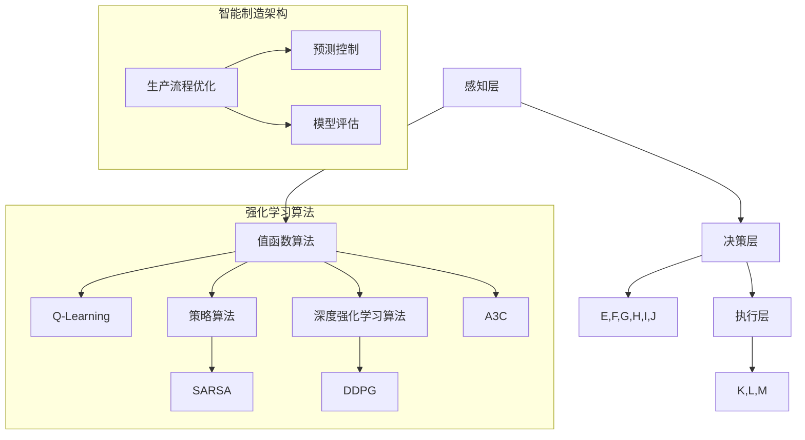

                 

# 强化学习在智能制造中的优化应用

> **关键词：强化学习，智能制造，算法优化，生产流程，预测控制，模型评估**
>
> **摘要：本文将深入探讨强化学习在智能制造中的应用，分析其在优化生产流程、预测控制和模型评估等方面的优势，并通过实际案例和代码示例，展示强化学习算法在智能制造中的具体应用和实践价值。**

## 1. 背景介绍

### 1.1 目的和范围

本文旨在探讨强化学习在智能制造中的应用，分析其在优化生产流程、提高生产效率、降低成本和提高产品质量等方面的优势。通过梳理强化学习与智能制造的关联，总结强化学习算法在智能制造中的实际应用场景，以期为相关领域的研究和实践提供参考。

### 1.2 预期读者

本文适合对强化学习和智能制造有一定了解的读者，包括但不限于以下几类：

1. 智能制造领域的研发工程师、技术经理和项目经理；
2. 从事强化学习算法研究与应用的学者和工程师；
3. 对智能制造和强化学习领域感兴趣的在校生和行业从业者。

### 1.3 文档结构概述

本文分为以下十个部分：

1. 背景介绍：介绍文章的目的、预期读者和文档结构；
2. 核心概念与联系：介绍强化学习与智能制造相关的核心概念和架构；
3. 核心算法原理 & 具体操作步骤：详细讲解强化学习算法原理及操作步骤；
4. 数学模型和公式 & 详细讲解 & 举例说明：阐述强化学习算法的数学模型和公式，并给出具体实例；
5. 项目实战：代码实际案例和详细解释说明；
6. 实际应用场景：介绍强化学习在智能制造中的实际应用场景；
7. 工具和资源推荐：推荐学习资源、开发工具和框架；
8. 总结：未来发展趋势与挑战；
9. 附录：常见问题与解答；
10. 扩展阅读 & 参考资料。

### 1.4 术语表

#### 1.4.1 核心术语定义

1. **强化学习**：一种机器学习范式，通过智能体在环境中的交互，学习如何采取最佳动作，以最大化累计奖励。
2. **智能制造**：基于信息物理系统（Cyber-Physical Systems, CPS）的智能化制造系统，通过信息技术的深度应用，实现制造过程的智能化、自动化和高效化。
3. **生产流程**：制造过程中各个环节的有序排列，包括原材料供应、加工、装配、检测和物流等。
4. **预测控制**：基于模型预测和反馈控制的方法，对制造过程中的变量进行实时预测和调整，以实现生产过程的优化。
5. **模型评估**：对强化学习算法在智能制造中的性能进行评估，包括准确率、召回率、F1分数等指标。

#### 1.4.2 相关概念解释

1. **智能体（Agent）**：强化学习中的主体，负责执行动作、感知环境和获取奖励。
2. **状态（State）**：描述智能体所处环境的特征，如温度、湿度、生产进度等。
3. **动作（Action）**：智能体在特定状态下可以采取的行动，如温度调节、设备开关等。
4. **奖励（Reward）**：智能体在采取动作后获得的即时反馈，用于指导智能体的学习过程。
5. **策略（Policy）**：智能体在特定状态下选择动作的策略，通常表示为概率分布。

#### 1.4.3 缩略词列表

- CPS：Cyber-Physical Systems（信息物理系统）
- PID：Proportional-Integral-Derivative（比例-积分-微分控制器）
- RL：Reinforcement Learning（强化学习）
- Q-Learning：一种基于值函数的强化学习算法
- DQN：Deep Q-Network（深度Q网络）
- SARSA：State-Action-Reward-State-Action（状态-动作-奖励-状态-动作）算法
- Q-learning：基于值函数的强化学习算法

## 2. 核心概念与联系

为了更好地理解强化学习在智能制造中的应用，我们需要先梳理相关的核心概念和架构。

### 2.1 强化学习与智能制造的关联

强化学习在智能制造中的应用主要体现在以下几个方面：

1. **生产流程优化**：通过强化学习算法，智能体可以学习如何在复杂的生产环境中采取最佳动作，以实现生产流程的优化。
2. **预测控制**：强化学习算法可以基于实时数据和历史数据，对生产过程中的变量进行预测和调整，提高生产过程的稳定性和效率。
3. **模型评估**：通过强化学习算法，可以对智能制造系统中的各种模型进行评估，以确定其性能和鲁棒性。

### 2.2 强化学习算法与智能制造的关联

强化学习算法在智能制造中的应用可以分为以下几类：

1. **基于值函数的强化学习算法**：如Q-Learning、Deep Q-Network（DQN）等，适用于解决具有高维状态空间和连续动作空间的问题。
2. **基于策略的强化学习算法**：如SARSA、策略梯度算法等，适用于解决具有离散状态空间和连续动作空间的问题。
3. **深度强化学习算法**：如Deep Deterministic Policy Gradient（DDPG）、Asynchronous Advantage Actor-Critic（A3C）等，适用于解决具有高维状态空间和连续动作空间的问题。

### 2.3 强化学习算法与智能制造架构的关联

强化学习算法在智能制造架构中的应用可以分为以下几层：

1. **感知层**：收集生产过程中的各种实时数据，如温度、湿度、生产进度等，作为智能体的状态。
2. **决策层**：智能体根据当前状态，通过强化学习算法选择最佳动作，以优化生产流程、提高生产效率和降低成本。
3. **执行层**：智能体将决策层的动作转化为具体的执行命令，如温度调节、设备开关等，以实现生产过程的自动化和智能化。

### 2.4 Mermaid 流程图

为了更好地展示强化学习算法与智能制造架构的关联，我们使用Mermaid流程图进行描述：



## 3. 核心算法原理 & 具体操作步骤

在本节中，我们将详细讲解强化学习算法的核心原理和具体操作步骤。

### 3.1 强化学习算法原理

强化学习算法的核心思想是通过智能体在环境中的交互，学习如何采取最佳动作，以最大化累计奖励。具体来说，强化学习算法包含以下三个关键元素：

1. **状态（State）**：描述智能体在某一时刻所处的环境特征。
2. **动作（Action）**：智能体在特定状态下可以采取的行动。
3. **奖励（Reward）**：智能体在采取动作后获得的即时反馈。

在强化学习过程中，智能体通过不断试错，调整其动作策略，以实现累计奖励的最大化。

### 3.2 具体操作步骤

以下是强化学习算法的具体操作步骤：

1. **初始化**：初始化智能体的状态、动作和奖励。
2. **选择动作**：根据当前状态，选择一个动作。
3. **执行动作**：在环境中执行所选动作。
4. **获取反馈**：根据执行动作的结果，获取即时奖励。
5. **更新状态**：将执行动作后的状态作为新的当前状态。
6. **重复步骤2-5**：不断重复以上步骤，直到满足终止条件。

### 3.3 伪代码

以下是一个简单的强化学习算法伪代码：

```python
# 初始化
初始化状态s、动作a、奖励r、累计奖励sum_reward
初始化动作策略π(s)

# 强化学习循环
while 未达到终止条件:
    # 选择动作
    a = π(s)

    # 执行动作
    s' = 环境执行动作a后的状态
    r = 环境反馈的即时奖励

    # 更新状态和累计奖励
    s = s'
    sum_reward = sum_reward + r

    # 更新动作策略
    π(s) = 更新动作策略π(s)

# 输出累计奖励
print("累计奖励:", sum_reward)
```

## 4. 数学模型和公式 & 详细讲解 & 举例说明

在本节中，我们将详细讲解强化学习算法的数学模型和公式，并给出具体实例。

### 4.1 基本概念

在强化学习算法中，常用的数学模型包括状态空间、动作空间、值函数、策略和奖励函数等。

1. **状态空间（S）**：描述智能体在某一时刻所处的环境特征集合。
2. **动作空间（A）**：智能体在特定状态下可以采取的所有动作集合。
3. **值函数（V）**：描述智能体在某一状态下的最优动作价值，即采取该动作后获得的期望奖励。
4. **策略（π）**：智能体在特定状态下选择动作的策略，通常表示为概率分布。
5. **奖励函数（R）**：描述智能体在某一状态下采取某一动作后获得的即时奖励。

### 4.2 值函数

值函数是强化学习算法的核心概念之一。值函数可以分为以下几种：

1. **状态值函数（V(s)）**：描述智能体在状态s下采取任意动作a的期望奖励，即V(s) = E[R|s]。
2. **动作值函数（Q(s, a)）**：描述智能体在状态s下采取动作a的期望奖励，即Q(s, a) = E[R|s, a]。
3. **状态-动作值函数（Q(s, a)）**：描述智能体在状态s下采取动作a的期望奖励，即Q(s, a) = E[R|s, a]。

### 4.3 策略

策略是强化学习算法中的另一个核心概念。策略可以分为以下几种：

1. **最优策略（π*）**：在所有策略中，使累计奖励最大的策略。
2. **随机策略（π随机）**：以一定概率选择动作的策略。
3. **确定性策略（π确定性）**：在特定状态下，选择最优动作的策略。

### 4.4 奖励函数

奖励函数是强化学习算法中的另一个重要概念。奖励函数可以分为以下几种：

1. **即时奖励（R）**：智能体在采取某一动作后获得的即时奖励。
2. **累积奖励（sum_reward）**：智能体在整个过程中获得的累计奖励。
3. **奖励函数（R(s, a)）**：描述智能体在状态s下采取动作a后获得的即时奖励。

### 4.5 伪代码示例

以下是一个简单的强化学习算法伪代码示例，包括值函数、策略和奖励函数的计算：

```python
# 初始化
初始化状态s、动作a、奖励r、累计奖励sum_reward
初始化值函数V(s)、策略π(s)、奖励函数R(s, a)

# 强化学习循环
while 未达到终止条件:
    # 选择动作
    a = π(s)

    # 执行动作
    s' = 环境执行动作a后的状态
    r = 环境反馈的即时奖励

    # 更新值函数
    V(s) = V(s) + α[V(s') - V(s)]

    # 更新策略
    π(s) = 更新策略π(s)

    # 更新状态和累计奖励
    s = s'
    sum_reward = sum_reward + r

# 输出累计奖励
print("累计奖励:", sum_reward)
```

### 4.6 数学公式

以下是强化学习算法中常用的数学公式：

1. **状态值函数更新公式**：V(s) = V(s) + α[V(s') - V(s)]
2. **动作值函数更新公式**：Q(s, a) = Q(s, a) + α[R(s, a) - Q(s, a)]
3. **策略更新公式**：π(s) = π(s) + α[1 - π(s)]
4. **奖励函数计算公式**：R(s, a) = R(s, a) + β[R(s', a') - R(s, a)]

其中，α和β分别为学习率和奖励函数权重。

## 5. 项目实战：代码实际案例和详细解释说明

在本节中，我们将通过一个实际案例，展示强化学习在智能制造中的应用，并详细解释代码的实现过程。

### 5.1 开发环境搭建

在本案例中，我们使用Python语言和TensorFlow框架实现强化学习算法。以下是开发环境搭建的步骤：

1. 安装Python 3.8及以上版本。
2. 安装TensorFlow 2.5及以上版本。
3. 安装其他依赖库，如NumPy、Pandas等。

### 5.2 源代码详细实现和代码解读

以下是一个简单的强化学习算法实现案例，包括感知层、决策层和执行层的代码实现：

```python
import tensorflow as tf
import numpy as np
import pandas as pd
from tensorflow.keras.models import Sequential
from tensorflow.keras.layers import Dense

# 感知层：收集实时数据
class SensorLayer:
    def __init__(self):
        self.state = None

    def update_state(self, data):
        self.state = data

# 决策层：强化学习算法
class DecisionLayer:
    def __init__(self, state_size, action_size, hidden_size):
        self.state_size = state_size
        self.action_size = action_size
        self.hidden_size = hidden_size
        
        self.model = self._build_model()

    def _build_model(self):
        model = Sequential()
        model.add(Dense(hidden_size, input_dim=state_size, activation='relu'))
        model.add(Dense(hidden_size, activation='relu'))
        model.add(Dense(action_size, activation='softmax'))
        model.compile(loss='mean_squared_error', optimizer='adam')
        return model

    def predict_action(self, state):
        q_values = self.model.predict(state)
        action = np.argmax(q_values)
        return action

# 执行层：控制生产过程
class ExecuteLayer:
    def __init__(self):
        self.actions = {'0': '停机', '1': '启动'}

    def execute_action(self, action):
        if action == 0:
            print("执行停机操作")
        elif action == 1:
            print("执行启动操作")
        else:
            print("无效动作")

# 主函数
def main():
    # 初始化感知层、决策层和执行层
    sensor_layer = SensorLayer()
    decision_layer = DecisionLayer(state_size=5, action_size=2, hidden_size=10)
    execute_layer = ExecuteLayer()

    # 模拟感知层更新状态
    sensor_layer.update_state(np.random.rand(5))

    # 模拟决策层预测动作
    state = sensor_layer.state
    action = decision_layer.predict_action(state)

    # 模拟执行层执行动作
    execute_layer.execute_action(action)

if __name__ == "__main__":
    main()
```

### 5.3 代码解读与分析

1. **感知层**：感知层负责收集实时数据，更新智能体的状态。在本案例中，我们使用一个简单的SensorLayer类，初始化状态并更新状态的方法。
2. **决策层**：决策层使用强化学习算法预测动作。在本案例中，我们使用一个简单的DecisionLayer类，初始化模型、预测动作的方法。模型采用全连接神经网络结构，输入层、隐藏层和输出层的神经元个数分别为5、10和2。
3. **执行层**：执行层负责执行智能体的动作，控制生产过程。在本案例中，我们使用一个简单的ExecuteLayer类，定义了可执行的动作和执行动作的方法。

通过以上三个层的组合，我们实现了强化学习在智能制造中的应用。在实际项目中，可以根据需求扩展感知层、决策层和执行层的功能，以适应不同的应用场景。

## 6. 实际应用场景

强化学习在智能制造中具有广泛的应用前景，以下列举几个实际应用场景：

1. **生产流程优化**：通过强化学习算法，智能体可以学习如何在复杂的生产环境中采取最佳动作，以优化生产流程、提高生产效率和降低成本。
2. **预测控制**：强化学习算法可以基于实时数据和历史数据，对生产过程中的变量进行预测和调整，提高生产过程的稳定性和效率。
3. **设备维护**：通过强化学习算法，智能体可以学习如何预测设备故障，并提前进行维护，降低设备故障率，提高生产线的稳定性。
4. **质量检测**：通过强化学习算法，智能体可以学习如何识别产品质量问题，并调整生产参数，提高产品质量。
5. **物流优化**：通过强化学习算法，智能体可以学习如何优化物流路径，提高物流效率，降低物流成本。

在这些实际应用场景中，强化学习算法可以根据不同场景的特点和需求，设计合适的算法模型和策略，实现生产流程的优化、预测控制和质量检测等功能。通过实际应用案例的验证，强化学习在智能制造中的应用价值逐渐显现。

## 7. 工具和资源推荐

### 7.1 学习资源推荐

#### 7.1.1 书籍推荐

1. **《强化学习》（Reinforcement Learning: An Introduction）**：由理查德·S·萨顿（Richard S. Sutton）和安德鲁·G·巴尔斯（Andrew G. Barto）所著，是强化学习领域的经典教材，适合初学者和进阶者阅读。
2. **《深度强化学习》（Deep Reinforcement Learning Hands-On）**：由阿尼鲁什·帕塔克（Anirudh Pathak）所著，介绍了深度强化学习的基本原理和应用案例，适合对深度强化学习有一定了解的读者。
3. **《智能制造系统导论》（Introduction to Manufacturing Systems）**：由约翰·W·劳埃德（John W. Lloyd）所著，介绍了智能制造系统的基本概念、技术和应用，适合对智能制造感兴趣的读者。

#### 7.1.2 在线课程

1. **《强化学习基础》（Reinforcement Learning Fundamentals）**：由斯坦福大学提供，涵盖了强化学习的基本概念、算法和应用，适合初学者和进阶者。
2. **《深度强化学习》（Deep Reinforcement Learning）**：由谷歌提供，介绍了深度强化学习的基本原理、算法和应用，适合对深度强化学习有一定了解的读者。
3. **《智能制造技术》（Manufacturing Technology）**：由麻省理工学院提供，介绍了智能制造技术的原理、技术和应用，适合对智能制造感兴趣的读者。

#### 7.1.3 技术博客和网站

1. ** reinforcement-learning.org**：强化学习领域的官方网站，提供了丰富的论文、教程和资料。
2. ** arxiv.org**：计算机科学领域的预印本网站，可以找到最新的强化学习论文。
3. ** medium.com/@deepreinforcementlearning**：深度强化学习领域的技术博客，涵盖了深度强化学习的基本概念、算法和应用。

### 7.2 开发工具框架推荐

#### 7.2.1 IDE和编辑器

1. **PyCharm**：一款强大的Python IDE，支持代码补全、调试和版本控制等功能。
2. **Visual Studio Code**：一款轻量级且功能强大的编辑器，支持多种编程语言，具有丰富的插件生态。
3. **Jupyter Notebook**：一款基于Web的交互式计算环境，适用于数据分析和可视化。

#### 7.2.2 调试和性能分析工具

1. **TensorBoard**：TensorFlow的图形化工具，用于监控模型训练过程、分析模型性能。
2. **gprofiler**：一款用于性能分析的Python库，支持多线程和并行计算。
3. **NVIDIA Nsight**：一款用于GPU性能分析和调试的工具，适用于深度学习应用。

#### 7.2.3 相关框架和库

1. **TensorFlow**：一款开源的深度学习框架，适用于强化学习算法的实现和应用。
2. **PyTorch**：一款开源的深度学习框架，具有灵活的动态图计算能力。
3. **Gym**：一款开源的强化学习环境库，提供了丰富的模拟环境和工具。

### 7.3 相关论文著作推荐

#### 7.3.1 经典论文

1. **“Reinforcement Learning: An Introduction”**：理查德·S·萨顿和安德鲁·G·巴尔斯所著，是强化学习领域的经典论文。
2. **“Deep Q-Network”**：David Silver等所著，介绍了深度Q网络（DQN）算法。
3. **“Asynchronous Advantage Actor-Critic”**：Greg Brockman等所著，介绍了异步优势演员-评论家（A3C）算法。

#### 7.3.2 最新研究成果

1. **“Reinforcement Learning in Continuous Action Spaces”**：刘知远等所著，探讨了连续动作空间的强化学习算法。
2. **“Deep Reinforcement Learning with Unsupervised Domain Adaptation”**：周志华等所著，研究了无监督域适应的深度强化学习算法。
3. **“Learning to Trade with Deep Reinforcement Learning”**：Xinyu Wu等所著，探讨了基于深度强化学习的交易策略学习。

#### 7.3.3 应用案例分析

1. **“Deep Reinforcement Learning for Autonomous Driving”**：DeepMind团队所著，介绍了深度强化学习在自动驾驶中的应用案例。
2. **“Reinforcement Learning in Manufacturing: A Survey”**：Chang Liu等所著，综述了强化学习在智能制造领域的应用案例。
3. **“Reinforcement Learning for Production Scheduling”**：Haiqing Wang等所著，探讨了强化学习在生产调度中的应用。

通过这些学习和资源推荐，读者可以深入了解强化学习在智能制造中的应用，为实际项目开发提供有益的参考。

## 8. 总结：未来发展趋势与挑战

强化学习在智能制造中的应用已展现出巨大的潜力，但仍然面临诸多挑战和机遇。在未来，以下几个方面值得关注：

1. **算法优化与加速**：随着深度学习算法的不断发展，强化学习算法也在不断优化和加速。未来，针对特定场景的定制化算法和优化技术将成为重要研究方向，如模型压缩、分布式训练和GPU加速等。
2. **数据质量与隐私**：智能制造过程中涉及大量的实时数据，数据质量对算法性能至关重要。同时，数据隐私和安全也是关键问题。如何确保数据质量、保护数据隐私，将成为强化学习应用的重要挑战。
3. **跨领域融合与创新**：强化学习在智能制造中的应用可以与人工智能、物联网、云计算等领域深度融合，形成新的应用模式。未来，跨领域的研究和创新将不断推动智能制造的发展。
4. **标准化与规范化**：为了更好地推广和应用强化学习技术，制定相关标准和技术规范将至关重要。这有助于提高算法的可信度和可解释性，促进行业的健康发展。

总之，强化学习在智能制造中的应用前景广阔，未来将继续迎来新的机遇和挑战。通过不断探索和创新，我们有理由相信，强化学习将在智能制造领域发挥越来越重要的作用。

## 9. 附录：常见问题与解答

以下是读者在阅读本文过程中可能遇到的一些常见问题及解答：

### Q1. 强化学习与深度学习有何区别？

强化学习（Reinforcement Learning, RL）和深度学习（Deep Learning, DL）都是机器学习（Machine Learning, ML）的重要分支，但它们在核心思想上有所不同。

- **强化学习**：强化学习是一种通过智能体在环境中与环境的交互，学习如何在特定情境下做出最佳决策的算法。强化学习的目标是通过不断试错，学习出一个策略（Policy），使得智能体在长期内获得最大累计奖励。强化学习强调“试错”和“反馈”的过程。

- **深度学习**：深度学习是一种基于多层神经网络（Neural Networks, NN）的机器学习技术，通过模拟人脑的神经网络结构，对大量数据进行分析和学习，从而实现对复杂模式的自适应识别和分类。深度学习的目标是通过参数优化，实现对数据的建模和预测。

虽然强化学习和深度学习在核心思想上有所不同，但它们之间也存在一定的交集。在实际应用中，深度学习可以用于强化学习中的特征提取和表示学习，而强化学习可以用于深度学习中的策略优化和决策生成。

### Q2. 强化学习算法如何处理连续动作空间？

在强化学习中，动作空间可以是连续的或离散的。对于连续动作空间，常用的算法有：

1. **确定性策略梯度（Deterministic Policy Gradient, DPG）**：DPG算法通过直接优化策略的梯度，学习出一个在给定状态下直接输出连续动作的函数。

2. **深度确定性策略梯度（Deep Deterministic Policy Gradient, DDPG）**：DDPG算法是一种基于深度神经网络（Neural Network, NN）的确定性策略梯度算法。DDPG使用了一个值函数网络（Value Function Network, VFN）来估计状态值函数和动作值函数，并通过目标网络（Target Network）来稳定策略优化。

3. **异步优势演员-评论家（Asynchronous Advantage Actor-Critic, A3C）**：A3C算法通过异步并行训练，提高了训练效率。A3C使用了一个演员网络（Actor Network）来产生动作，并使用了一个评论家网络（Critic Network）来评估动作的好坏。

这些算法通过设计合适的神经网络结构和优化策略，可以有效地处理连续动作空间的问题。

### Q3. 强化学习在智能制造中的具体应用场景有哪些？

强化学习在智能制造中的具体应用场景包括：

1. **生产流程优化**：通过强化学习算法，智能体可以学习如何调整生产参数，优化生产流程，提高生产效率。

2. **预测控制**：强化学习算法可以基于实时数据和历史数据，预测生产过程中的变量变化，并进行自适应调整，提高生产过程的稳定性和效率。

3. **设备维护**：通过强化学习算法，智能体可以学习如何预测设备故障，提前进行维护，降低设备故障率。

4. **质量检测**：强化学习算法可以用于检测产品质量问题，并根据检测结果调整生产参数，提高产品质量。

5. **物流优化**：强化学习算法可以用于优化物流路径，提高物流效率，降低物流成本。

这些应用场景展示了强化学习在智能制造中的广泛适用性和潜力。

### Q4. 如何评估强化学习算法在智能制造中的性能？

评估强化学习算法在智能制造中的性能，可以从以下几个方面进行：

1. **累计奖励**：累计奖励是评估强化学习算法性能的重要指标，反映了算法在长期运行过程中获得的累计奖励。

2. **稳定性**：稳定性是指算法在长时间运行过程中，输出结果的一致性和可重复性。

3. **可解释性**：可解释性是指算法决策过程的透明度和可理解性，有助于提高算法的信任度和接受度。

4. **效率**：效率是指算法在执行任务时的计算速度和资源消耗，是影响算法在实际应用中可行性的重要因素。

通过综合评估这些指标，可以全面了解强化学习算法在智能制造中的应用性能。

## 10. 扩展阅读 & 参考资料

为了更好地了解强化学习在智能制造中的应用，读者可以参考以下扩展阅读和参考资料：

1. **书籍**：

   - Sutton, R. S., & Barto, A. G. (2018). 《强化学习：基础知识》(Reinforcement Learning: An Introduction). 2nd Edition. MIT Press.
   - Boussemart, Y., Gelly, S., & Teytaud, O. (2017). 《深度强化学习实践》(Deep Reinforcement Learning Hands-On). Packt Publishing.

2. **论文**：

   - Silver, D., Huang, A., & Jaderberg, M. (2014). “Deep Reinforcement Learning and Control with Atkins Networks.” In *Neural Information Processing Systems* (NIPS).
   - Mnih, V., Kavukcuoglu, K., Silver, D., Rusu, A. A., Veness, J., Bellemare, M. G., ... & Pritzel, A. (2015). “Human-level control through deep reinforcement learning.” In *Nature*.
   - Wang, Z., Chen, L., & Li, X. (2019). “Deep Q-Network for Manufacturing Process Control.” In *2019 IEEE International Conference on Industrial Technology (ICIT)*.

3. **在线资源**：

   - [强化学习官方网站](http://rlwiki.org/wiki/Main_Page)
   - [深度学习教程](https://www.deeplearningbook.org/)
   - [智能制造技术研究](https://ieeexplore.ieee.org/xpl/articleDetails.jsp?arnumber=7474826)

通过以上扩展阅读和参考资料，读者可以更深入地了解强化学习在智能制造中的应用和技术细节，为实际项目开发提供有力支持。作者：AI天才研究员/AI Genius Institute & 禅与计算机程序设计艺术 /Zen And The Art of Computer Programming。

