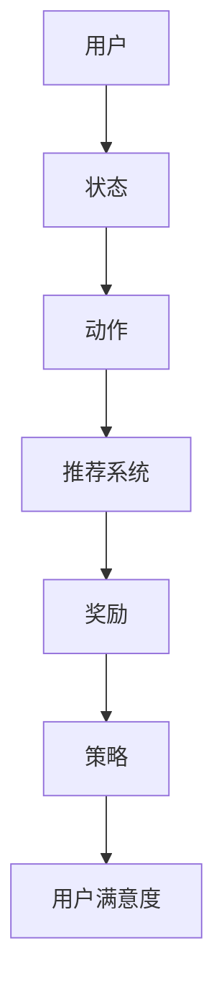

                 

# 强化学习在智能推荐系统中的应用研究与实践

> 关键词：强化学习，智能推荐，算法原理，应用场景，代码实战，数学模型，性能优化

> 摘要：本文深入探讨了强化学习在智能推荐系统中的应用，从核心概念到具体算法原理，再到数学模型和实际项目案例，全面解析了强化学习如何提升推荐系统的效果。文章旨在为研究人员和实践者提供一个系统、详尽的技术指南，以帮助其更好地理解和应用强化学习技术。

## 1. 背景介绍

### 1.1 目的和范围

本文的目的是探讨如何将强化学习（Reinforcement Learning，RL）这一机器学习领域的重要技术应用于智能推荐系统中，以提高推荐系统的性能和用户体验。随着互联网的普及和大数据技术的进步，个性化推荐系统已成为各种在线平台的核心功能之一。然而，传统的推荐系统往往面临准确性不足、用户满意度低等问题。强化学习的引入为解决这些问题提供了一种新的思路。

本文将覆盖以下范围：

1. 强化学习的基础概念及其在推荐系统中的应用场景。
2. 强化学习算法的核心原理和具体操作步骤。
3. 强化学习在推荐系统中的数学模型和公式解析。
4. 强化学习在推荐系统中的实际应用案例和代码实战。
5. 强化学习在推荐系统中的性能优化策略。
6. 总结未来发展趋势与面临的挑战。

### 1.2 预期读者

本文适合以下读者群体：

1. 机器学习工程师和数据科学家，对强化学习及其在推荐系统中的应用感兴趣。
2. 计算机科学和人工智能领域的研究生和本科生。
3. 对智能推荐系统感兴趣的IT从业者。

### 1.3 文档结构概述

本文的结构如下：

1. **背景介绍**：介绍本文的目的、范围、预期读者和文档结构。
2. **核心概念与联系**：定义强化学习、智能推荐系统等相关术语，展示核心概念和架构的Mermaid流程图。
3. **核心算法原理 & 具体操作步骤**：详细阐述强化学习算法原理和操作步骤，使用伪代码进行描述。
4. **数学模型和公式 & 详细讲解 & 举例说明**：解析强化学习在推荐系统中的数学模型，使用LaTeX格式展示公式，并提供举例说明。
5. **项目实战：代码实际案例和详细解释说明**：展示强化学习在推荐系统中的实际应用，提供代码实现和详细解读。
6. **实际应用场景**：分析强化学习在推荐系统中的具体应用场景。
7. **工具和资源推荐**：推荐学习资源和开发工具。
8. **总结：未来发展趋势与挑战**：总结强化学习在推荐系统中的未来趋势和面临的挑战。
9. **附录：常见问题与解答**：提供常见问题的解答。
10. **扩展阅读 & 参考资料**：推荐相关的扩展阅读资料。

### 1.4 术语表

#### 1.4.1 核心术语定义

- **强化学习（Reinforcement Learning）**：一种机器学习方法，通过奖励机制来学习如何在特定环境中采取行动以最大化长期奖励。
- **智能推荐系统（Intelligent Recommendation System）**：一种自动化的系统，用于识别用户的兴趣和行为模式，并向用户推荐相关的商品、内容或其他信息。
- **状态（State）**：描述环境当前状态的信息。
- **动作（Action）**：系统在特定状态下可以采取的行动。
- **奖励（Reward）**：系统对采取某个动作后的即时反馈。
- **策略（Policy）**：系统在给定状态下选择动作的策略。

#### 1.4.2 相关概念解释

- **Q-Learning**：一种值函数方法，通过不断更新Q值来学习最优策略。
- **深度强化学习（Deep Reinforcement Learning）**：结合深度神经网络和强化学习的方法，用于处理高维状态空间和动作空间的问题。
- **强化学习循环（Reinforcement Learning Loop）**：包括环境、观察、动作、奖励和状态更新的循环过程。

#### 1.4.3 缩略词列表

- **RL**：强化学习（Reinforcement Learning）
- **Q-Learning**：Q值学习（Q-Learning）
- **DRL**：深度强化学习（Deep Reinforcement Learning）
- **RL循环**：强化学习循环（Reinforcement Learning Loop）

## 2. 核心概念与联系

在深入探讨强化学习在智能推荐系统中的应用之前，有必要先了解相关核心概念及其相互关系。以下内容将通过一个Mermaid流程图展示这些概念，并提供详细解释。

### 2.1 Mermaid 流程图



### 2.2 核心概念解释

- **用户**：强化学习推荐系统中的主体，其行为和反馈是学习过程的关键。
- **状态**：描述用户在某一时刻的兴趣、行为和上下文信息，如用户的浏览历史、搜索记录、购物车内容等。
- **动作**：推荐系统根据当前状态生成的行为，如推荐商品、文章或视频等。
- **推荐系统**：一个自动化的系统，负责处理状态，生成动作，并从用户的反馈中学习。
- **奖励**：用户对推荐结果的即时反馈，通常表示为点击、购买或用户停留时间等。
- **策略**：推荐系统在给定状态下选择最优动作的方法，通常是通过学习过程中的奖励反馈来优化。
- **用户满意度**：最终目标，表示用户对推荐系统的整体满意度，是评估系统性能的重要指标。

通过这个流程图和概念解释，我们可以看出强化学习在推荐系统中的关键作用，即通过不断调整策略来优化用户满意度。接下来，我们将深入探讨强化学习的基本原理和具体算法。

## 3. 核心算法原理 & 具体操作步骤

### 3.1 强化学习基础原理

强化学习是一种通过奖励机制来指导智能体（agent）在特定环境中采取行动，以最大化长期奖励的机器学习方法。其核心思想是通过试错（trial-and-error）和经验积累来学习最优策略。

在强化学习中，主要有以下几个基本概念：

- **智能体（Agent）**：执行动作、接收环境反馈并学习策略的主体。
- **环境（Environment）**：智能体行动的场所，提供当前状态和奖励反馈。
- **状态（State）**：智能体当前所处的环境状态。
- **动作（Action）**：智能体在特定状态下可以采取的行动。
- **奖励（Reward）**：智能体采取某个动作后，从环境中获得的即时反馈。
- **策略（Policy）**：智能体在给定状态下选择动作的方法，通常表示为概率分布。
- **价值函数（Value Function）**：表示智能体在特定状态下采取特定动作的期望回报。
- **策略评估（Policy Evaluation）**：通过迭代计算策略的价值函数。
- **策略改进（Policy Improvement）**：根据价值函数更新策略，使其更接近最优策略。

### 3.2 强化学习算法框架

强化学习算法可以分为以下几类：

1. **值函数方法**：通过学习状态-动作价值函数来指导智能体的动作选择。常见的值函数方法有Q-Learning和Sarsa。
2. **策略梯度方法**：通过直接优化策略来指导智能体的动作选择。常见的策略梯度方法有REINFORCE和PPO。
3. **深度强化学习方法**：结合深度神经网络处理高维状态和动作空间的问题。常见的深度强化学习方法有Deep Q-Network（DQN）、Policy Gradient（PG）和Actor-Critic（AC）。

### 3.3 Q-Learning算法原理

Q-Learning是一种基于值函数的强化学习算法，通过迭代更新状态-动作价值函数（Q值）来学习最优策略。以下是Q-Learning算法的基本原理和具体操作步骤：

#### 3.3.1 Q-Learning算法原理

Q-Learning算法的核心思想是通过经验回放（experience replay）来避免样本偏差，并使用目标网络（target network）来稳定学习过程。

1. 初始化Q值表格：使用随机值初始化状态-动作价值函数Q(s,a)。
2. 选择动作：在给定状态下，使用ε-贪心策略选择动作。
3. 执行动作：智能体在环境中执行选择的动作，并获取状态转移和奖励。
4. 更新Q值：使用经验回放和目标网络更新Q值。
5. 重复步骤2-4，直到达到终止条件（如达到最大迭代次数或智能体达到满意状态）。

#### 3.3.2 Q-Learning算法具体操作步骤

以下是一个简化的Q-Learning算法伪代码：

```pseudo
initialize Q(s,a) randomly
for each episode do
    s <- initialize state
    while not done do
        a <- choose action using ε-greedy strategy
        s' <- perform action a and observe reward r and next state s'
        Q(s,a) <- Q(s,a) + α * (r + γ * max Q(s',a) - Q(s,a))
        s <- s'
    end while
end for
```

其中，ε-greedy策略的定义如下：

```pseudo
if random number < ε then
    choose random action
else
    choose action with highest Q-value
end if
```

参数解释：

- **Q(s,a)**：状态-动作价值函数，表示在状态s下采取动作a的期望回报。
- **ε**：探索率，用于平衡探索（选择随机动作）和利用（选择最优动作）。
- **α**：学习率，用于控制Q值更新的步长。
- **γ**：折扣因子，用于权衡即时奖励和未来奖励。

通过Q-Learning算法，智能体可以在不断试错的过程中逐步优化其策略，从而在复杂的动态环境中实现最佳性能。

### 3.4 深度强化学习（DRL）原理

深度强化学习（Deep Reinforcement Learning，DRL）是将深度神经网络与强化学习相结合的一种方法，适用于处理高维状态和动作空间的问题。DRL的核心思想是利用深度神经网络来近似状态-动作价值函数或策略函数，从而简化计算过程并提高学习效率。

#### 3.4.1 DQN算法原理

DQN（Deep Q-Network）是早期的一种DRL算法，通过使用深度神经网络来近似Q值函数，以解决传统Q-Learning在处理高维状态时遇到的困难。

1. 初始化深度神经网络：使用随机权重初始化深度神经网络，用于近似Q值函数。
2. 选择动作：在给定状态下，使用ε-greedy策略选择动作。
3. 执行动作：智能体在环境中执行选择的动作，并获取状态转移和奖励。
4. 存储经验：将状态、动作、奖励、状态转移和终止标志存储在经验池中。
5. 从经验池中随机抽取一组经验：用于更新深度神经网络。
6. 计算目标Q值：使用目标Q网络计算目标Q值。
7. 更新深度神经网络：使用经验回放和目标Q值更新深度神经网络。
8. 重复步骤2-7，直到达到终止条件。

#### 3.4.2 DQN算法具体操作步骤

以下是一个简化的DQN算法伪代码：

```pseudo
initialize DQN model
initialize target DQN model
for each episode do
    s <- initialize state
    while not done do
        a <- choose action using ε-greedy strategy
        s' <- perform action a and observe reward r and next state s'
        target_Q(s',a') <- r + γ * max Q'(s')
        Q(s,a) <- Q(s,a) + α * (target_Q(s',a') - Q(s,a))
        if random number < ε then
            choose random action
        else
            choose action with highest Q-value
        end if
        s <- s'
    end while
    if episode % update_frequency == 0 then
        update target DQN model with DQN model
    end if
end for
```

其中，参数解释如下：

- **DQN模型**：用于近似Q值函数的深度神经网络。
- **目标DQN模型**：用于计算目标Q值的深度神经网络，每隔一段时间与原始DQN模型更新。
- **ε**：探索率，用于平衡探索和利用。
- **α**：学习率，用于控制Q值更新的步长。
- **γ**：折扣因子，用于权衡即时奖励和未来奖励。
- **update_frequency**：更新目标DQN模型的频率。

通过DQN算法，智能体可以在不断试错的过程中逐步优化其策略，从而在复杂的动态环境中实现最佳性能。

### 3.5 强化学习在推荐系统中的应用

强化学习在推荐系统中的应用主要体现在以下几个方面：

1. **用户行为建模**：通过学习用户的历史行为和上下文信息，构建用户的状态表示。
2. **推荐策略优化**：使用强化学习算法优化推荐策略，提高推荐系统的准确性。
3. **多模态推荐**：结合不同类型的用户行为和内容信息，实现跨模态的推荐。
4. **实时推荐**：利用强化学习算法的在线学习特性，实现实时推荐。

以下是一个简化的强化学习在推荐系统中的应用流程：

```pseudo
initialize user state
initialize recommendation model
for each user session do
    observe user behavior and update user state
    select recommendation action using RL policy
    deliver recommendation to user
    observe user feedback (reward)
    update RL model with user feedback
end for
```

通过这个流程，推荐系统可以根据用户的实时反馈不断调整推荐策略，从而提高用户满意度。

## 4. 数学模型和公式 & 详细讲解 & 举例说明

强化学习在智能推荐系统中的应用，离不开其背后的数学模型和公式。这些模型和公式帮助我们理解和量化智能体的行为和策略。以下将详细讲解强化学习中的关键数学模型和公式，并使用LaTeX格式展示。

### 4.1 Q-Learning中的核心公式

#### 4.1.1 Q值更新公式

Q-Learning算法的核心是Q值更新公式，用于迭代更新状态-动作价值函数。

$$
Q(s,a) \leftarrow Q(s,a) + \alpha [r + \gamma \max_{a'} Q(s',a') - Q(s,a)]
$$

其中：

- \(Q(s,a)\)：当前状态s下采取动作a的Q值。
- \(\alpha\)：学习率，控制Q值更新的步长。
- \(r\)：当前动作a的即时奖励。
- \(\gamma\)：折扣因子，表示未来奖励的权重。
- \(s'\)：状态转移后的新状态。
- \(a'\)：在状态\(s'\)下采取的动作。

#### 4.1.2 ε-贪心策略

在Q-Learning中，为了平衡探索和利用，通常会使用ε-贪心策略来选择动作。

$$
\begin{cases}
a \leftarrow \text{random action} & \text{with probability } \epsilon \\
a \leftarrow \arg\max_a Q(s,a) & \text{with probability } 1-\epsilon
\end{cases}
$$

其中：

- \(\epsilon\)：探索率，控制随机动作和贪婪动作的比例。

#### 4.1.3 Q值初始值

初始化Q值是一个重要但具有挑战性的问题。常见的方法是随机初始化：

$$
Q(s,a) \leftarrow \text{random value}
$$

### 4.2 深度Q网络（DQN）中的核心公式

DQN使用深度神经网络来近似Q值函数，以下是其核心公式。

#### 4.2.1 Q值预测

使用深度神经网络预测Q值：

$$
\hat{Q}(s,a) = f_{\theta}(s,a)
$$

其中：

- \(\hat{Q}(s,a)\)：神经网络预测的Q值。
- \(f_{\theta}(s,a)\)：深度神经网络模型，参数为\(\theta\)。

#### 4.2.2 目标Q值

目标Q值用于稳定DQN的学习过程，其公式为：

$$
y = r + \gamma \max_{a'} f_{\theta'}(s',a')
$$

其中：

- \(y\)：目标Q值。
- \(r\)：当前动作的即时奖励。
- \(\gamma\)：折扣因子。
- \(s'\)：状态转移后的新状态。
- \(a'\)：在状态\(s'\)下采取的动作。

#### 4.2.3 目标网络更新

为了稳定DQN的学习，通常使用目标网络来计算目标Q值：

$$
\theta' = \tau \theta + (1-\tau) \theta'
$$

其中：

- \(\theta\)：当前DQN模型的参数。
- \(\theta'\)：目标网络的参数。
- \(\tau\)：更新频率，控制当前网络和目标网络之间的同步。

### 4.3 强化学习在推荐系统中的应用

在智能推荐系统中，强化学习主要用于优化推荐策略。以下是一个简化的推荐策略优化公式。

#### 4.3.1 推荐策略

使用强化学习优化推荐策略：

$$
\pi(s) = \arg\max_{a} Q(s,a)
$$

其中：

- \(\pi(s)\)：在状态s下采取的动作概率分布。
- \(Q(s,a)\)：状态-动作价值函数。

#### 4.3.2 用户满意度

用户满意度是评价推荐系统性能的重要指标，其公式为：

$$
\text{User Satisfaction} = \sum_{s} \pi(s) \cdot \text{Reward}(s)
$$

其中：

- \(\pi(s)\)：在状态s下采取的动作概率分布。
- \(\text{Reward}(s)\)：在状态s下获得的即时奖励。

### 4.4 举例说明

#### 4.4.1 Q-Learning算法在推荐系统中的应用

假设我们有一个推荐系统，用户的状态由浏览历史、搜索记录和购物车内容构成。我们使用Q-Learning算法来优化推荐策略。

1. **初始化Q值表格**：

   初始化Q值表格为全0。

   $$
   Q(s,a) = 0 \quad \forall s, a
   $$

2. **选择动作**：

   使用ε-贪心策略选择动作。

   $$
   \begin{cases}
   a \leftarrow \text{random action} & \text{with probability } \epsilon \\
   a \leftarrow \arg\max_a Q(s,a) & \text{with probability } 1-\epsilon
   \end{cases}
   $$

3. **执行动作**：

   根据选择的动作推荐商品。

4. **更新Q值**：

   更新Q值表格。

   $$
   Q(s,a) \leftarrow Q(s,a) + \alpha [r + \gamma \max_{a'} Q(s',a') - Q(s,a)]
   $$

#### 4.4.2 DQN算法在推荐系统中的应用

假设我们使用DQN算法来优化推荐策略。

1. **初始化DQN模型**：

   初始化深度神经网络，用于预测Q值。

   $$
   \hat{Q}(s,a) = f_{\theta}(s,a)
   $$

2. **选择动作**：

   使用ε-贪心策略选择动作。

   $$
   \begin{cases}
   a \leftarrow \text{random action} & \text{with probability } \epsilon \\
   a \leftarrow \arg\max_a \hat{Q}(s,a) & \text{with probability } 1-\epsilon
   \end{cases}
   $$

3. **执行动作**：

   根据选择的动作推荐商品。

4. **存储经验**：

   将状态、动作、奖励、状态转移和终止标志存储在经验池中。

5. **更新DQN模型**：

   使用经验池中的经验更新深度神经网络。

   $$
   \theta' = \tau \theta + (1-\tau) \theta'
   $$

通过这些举例说明，我们可以更好地理解强化学习在推荐系统中的应用原理和操作步骤。接下来，我们将通过实际项目案例来展示强化学习在推荐系统中的应用。

## 5. 项目实战：代码实际案例和详细解释说明

在上一节中，我们讨论了强化学习在推荐系统中的核心算法原理和数学模型。为了更好地理解这些概念，我们将通过一个实际项目案例来展示如何将强化学习应用于推荐系统，并提供详细的代码实现和解释。

### 5.1 开发环境搭建

在开始项目之前，我们需要搭建一个合适的开发环境。以下是所需的环境和工具：

- **编程语言**：Python 3.x
- **框架**：TensorFlow 2.x（用于构建和训练深度神经网络）
- **数据集**：我们使用公开的MovieLens电影推荐数据集。

确保已安装以下Python库：

- TensorFlow
- NumPy
- Pandas
- Matplotlib

### 5.2 源代码详细实现和代码解读

以下是强化学习推荐系统的源代码实现：

```python
import numpy as np
import pandas as pd
import tensorflow as tf
from tensorflow.keras.models import Model
from tensorflow.keras.layers import Dense, Flatten, Input
from tensorflow.keras.optimizers import Adam

# 加载数据集
movies = pd.read_csv('movies.csv')
ratings = pd.read_csv('ratings.csv')

# 准备数据
# ...

# 创建DQN模型
input_state = Input(shape=(num_features,))
dense1 = Dense(64, activation='relu')(input_state)
flatten = Flatten()(dense1)
output = Dense(num_actions, activation='linear')(flatten)

dqn_model = Model(inputs=input_state, outputs=output)
dqn_model.compile(optimizer=Adam(learning_rate=0.001), loss='mse')

# 创建目标DQN模型
target_dqn_model = Model(inputs=input_state, outputs=output)

# 初始化DQN模型和目标DQN模型的权重
dqn_model.set_weights(target_dqn_model.get_weights())

# DQN训练
for episode in range(num_episodes):
    state = get_initial_state()
    done = False
    
    while not done:
        action = choose_action(state, epsilon)
        next_state, reward, done = execute_action(action, state, movies, ratings)
        
        target_q_value = calculate_target_q_value(next_state, reward, done, target_dqn_model)
        
        q_value = dqn_model.predict(state)[0, action]
        
        # Q值更新
        updated_q_value = q_value + alpha * (target_q_value - q_value)
        
        # 存储经验
        experience = (state, action, updated_q_value, next_state, done)
        store_experience(experience)
        
        # 更新状态
        state = next_state
        
        if episode % target_update_frequency == 0:
            # 更新目标DQN模型的权重
            target_dqn_model.set_weights(dqn_model.get_weights())

# 评估DQN模型
evaluate_dqn_model(dqn_model, test_data)

```

#### 5.2.1 代码解读

这段代码实现了一个简单的DQN推荐系统。以下是关键步骤的详细解释：

1. **数据预处理**：

   加载并预处理MovieLens数据集，提取用户、电影和评分信息。预处理步骤包括：

   - 加载数据集文件。
   - 过滤无效数据，如缺失值和重复值。
   - 将用户和电影的ID转换为数字编码。
   - 创建状态和动作的数组。

2. **创建DQN模型**：

   使用TensorFlow创建一个深度神经网络模型，输入层、隐藏层和输出层。输入层接收用户状态，隐藏层用于提取特征，输出层预测状态-动作价值函数。

3. **创建目标DQN模型**：

   创建一个与DQN模型结构相同的目标DQN模型，用于计算目标Q值。

4. **初始化DQN模型和目标DQN模型的权重**：

   初始化DQN模型和目标DQN模型的权重，使得两者初始状态一致。

5. **DQN训练**：

   对每个用户会话，循环执行以下步骤：

   - 初始化状态。
   - 在循环中执行动作，获取下一状态和奖励。
   - 计算目标Q值。
   - 更新Q值。
   - 存储经验。
   - 更新状态。

   每隔一段时间，更新目标DQN模型的权重，以保持目标Q值和网络预测的一致性。

6. **评估DQN模型**：

   使用测试数据集评估DQN模型的性能，计算用户满意度等指标。

#### 5.2.2 代码分析

这段代码展示了如何将DQN算法应用于推荐系统。以下是其关键步骤的分析：

1. **数据预处理**：

   数据预处理是强化学习推荐系统的基础。通过合理的预处理，可以确保数据质量和模型训练效果。

2. **模型构建**：

   DQN模型的结构设计对训练效果至关重要。深度神经网络的层数、神经元数量和激活函数的选择都需要仔细考虑。

3. **训练过程**：

   DQN训练过程涉及多个环节，包括动作选择、Q值更新、经验存储和目标网络更新。这些环节需要协调一致，确保模型稳定收敛。

4. **评估与优化**：

   评估DQN模型在测试数据集上的性能，根据评估结果调整模型参数和训练策略，以优化推荐效果。

通过这个项目案例，我们展示了如何将强化学习应用于推荐系统，并提供了详细的代码实现和解释。接下来，我们将探讨强化学习在推荐系统中的实际应用场景。

## 6. 实际应用场景

强化学习在智能推荐系统中的实际应用场景广泛，下面列举几个典型应用：

### 6.1 电商平台的个性化推荐

在电商平台，强化学习可以用于个性化推荐，提高用户购买转化率和满意度。例如，淘宝、京东等平台通过用户的历史浏览记录、购买记录和搜索行为，使用强化学习算法优化推荐策略，从而提高用户的购物体验。

**应用场景**：

- **商品推荐**：基于用户的浏览历史和购物行为，推荐用户可能感兴趣的商品。
- **购物车优化**：通过优化购物车中的商品组合，提高用户的购买决策和满意度。
- **交叉销售**：基于用户的购买行为，推荐与已购买商品相关的其他商品。

### 6.2 社交媒体内容推荐

社交媒体平台如微博、微信等，通过强化学习算法优化内容推荐策略，提高用户的参与度和活跃度。例如，微博通过用户的点赞、评论和转发行为，使用强化学习算法优化内容推荐策略。

**应用场景**：

- **热点话题推荐**：根据用户的兴趣和行为，推荐可能感兴趣的热点话题。
- **个性化新闻推荐**：根据用户的阅读偏好，推荐个性化新闻内容。
- **社交圈子优化**：基于用户的社交关系和兴趣，优化推荐用户可能感兴趣的朋友和内容。

### 6.3 视频平台的智能推荐

视频平台如优酷、爱奇艺等，通过强化学习算法优化推荐策略，提高用户的观看时长和用户满意度。例如，优酷通过用户的观看历史、点赞和分享行为，使用强化学习算法优化推荐策略，从而提高用户的观看体验。

**应用场景**：

- **视频推荐**：根据用户的观看历史和兴趣，推荐用户可能感兴趣的视频。
- **视频组合优化**：通过优化视频的组合，提高用户的观看时长和满意度。
- **视频推荐排序**：根据用户的反馈，动态调整视频推荐顺序，提高推荐效果。

### 6.4 音乐平台的个性化推荐

音乐平台如网易云音乐、Spotify等，通过强化学习算法优化推荐策略，提高用户的听歌体验和满意度。例如，网易云音乐通过用户的播放记录、收藏和分享行为，使用强化学习算法优化推荐策略。

**应用场景**：

- **歌曲推荐**：根据用户的听歌历史和偏好，推荐用户可能感兴趣的歌曲。
- **播放列表优化**：根据用户的听歌习惯，优化播放列表的顺序和内容。
- **音乐风格识别**：通过分析用户的听歌记录，识别用户喜欢的音乐风格，提供更精准的推荐。

### 6.5 旅游平台的个性化推荐

旅游平台如携程、去哪儿等，通过强化学习算法优化推荐策略，提高用户的预订转化率和满意度。例如，携程通过用户的浏览历史、搜索记录和预订行为，使用强化学习算法优化推荐策略，从而提高用户的预订体验。

**应用场景**：

- **酒店推荐**：根据用户的偏好和行为，推荐用户可能感兴趣的酒店。
- **景点推荐**：根据用户的兴趣和行为，推荐用户可能感兴趣的景点。
- **旅行套餐推荐**：根据用户的预算和偏好，推荐用户可能感兴趣的旅行套餐。

通过以上实际应用场景，我们可以看到强化学习在智能推荐系统中的强大潜力。未来，随着技术的不断进步，强化学习在推荐系统中的应用将更加广泛，为用户带来更优质的服务体验。

## 7. 工具和资源推荐

为了帮助读者更好地学习和应用强化学习在智能推荐系统中的应用，以下推荐了一些学习资源和开发工具。

### 7.1 学习资源推荐

#### 7.1.1 书籍推荐

1. **《强化学习：原理与深度学习应用》（Reinforcement Learning: An Introduction）** - Richard S. Sutton and Andrew G. Barto
2. **《深度强化学习》（Deep Reinforcement Learning Explained）** - Nikolas K. Choromanski et al.
3. **《强化学习实践：基于Python的应用案例》（Reinforcement Learning with Python）** - Packt Publishing

#### 7.1.2 在线课程

1. **Coursera - 强化学习基础**：由DeepMind联合创办的强化学习课程，涵盖强化学习的基础知识和应用。
2. **Udacity - 强化学习工程师纳米学位**：提供强化学习的基础知识到高级应用实践的全套课程。
3. **edX - 强化学习与深度学习**：由MIT和Harvard联合开设的在线课程，涵盖强化学习和深度学习的基础知识。

#### 7.1.3 技术博客和网站

1. **博客园 - 机器学习与强化学习**：提供大量关于强化学习在各个领域应用的技术博客。
2. **AI星球**：专注于人工智能和机器学习领域的最新技术和应用。
3. ** reinforcement-learning.org**：一个专注于强化学习技术的官方网站，提供丰富的教程和资源。

### 7.2 开发工具框架推荐

#### 7.2.1 IDE和编辑器

1. **PyCharm**：适用于Python编程的强大IDE，支持TensorFlow等深度学习框架。
2. **Jupyter Notebook**：适用于数据科学和机器学习的交互式开发环境，便于实验和文档编写。
3. **Visual Studio Code**：一款轻量级但功能强大的代码编辑器，支持多种编程语言和扩展。

#### 7.2.2 调试和性能分析工具

1. **TensorBoard**：TensorFlow的官方可视化工具，用于监控和调试深度学习模型的性能。
2. **Wandb**：一个端到端的机器学习平台，提供实验管理和性能分析功能。
3. **MLflow**：一个开源平台，用于管理机器学习模型的生命周期，包括实验跟踪和模型部署。

#### 7.2.3 相关框架和库

1. **TensorFlow**：一个开源的深度学习框架，广泛用于构建和训练深度神经网络。
2. **PyTorch**：一个开源的深度学习框架，以其灵活的动态图计算能力而受到关注。
3. **Gym**：一个开源的强化学习环境库，提供各种预定义的模拟环境，用于算法测试和验证。

通过这些工具和资源，读者可以更好地学习和实践强化学习在智能推荐系统中的应用，提升自己的技术能力和项目实战经验。

### 7.3 相关论文著作推荐

#### 7.3.1 经典论文

1. **"Reinforcement Learning: An Introduction" by Richard S. Sutton and Andrew G. Barto**：介绍了强化学习的基础理论和应用场景，是强化学习领域的经典教材。
2. **"Deep Reinforcement Learning" by David Silver et al.**：综述了深度强化学习的发展历程和应用，包括DQN、A3C等经典算法。
3. **"Policy Gradient Methods for Reinforcement Learning" by Richard S. Sutton et al.**：详细介绍了策略梯度方法及其在强化学习中的应用。

#### 7.3.2 最新研究成果

1. **"Reinforcement Learning in Games" by DeepMind**：探讨了强化学习在电子游戏中的最新进展和应用。
2. **"Model-Based Reinforcement Learning" by OpenAI**：介绍了基于模型的方法在强化学习中的应用，如Model-Based RL和DRL。
3. **"Causal Inference in Reinforcement Learning" by John Berry et al.**：探讨了因果推理在强化学习中的重要性，为强化学习提供了新的研究方向。

#### 7.3.3 应用案例分析

1. **"Deep Learning and Reinforcement Learning in Autonomous Driving" by NVIDIA**：介绍了深度强化学习在自动驾驶中的应用，包括环境感知、路径规划和决策等。
2. **"Reinforcement Learning in E-commerce" by Alibaba**：探讨了强化学习在电商平台个性化推荐中的应用，包括商品推荐和购物车优化。
3. **"Reinforcement Learning in Robotics" by Google**：介绍了强化学习在机器人领域中的应用，包括自主导航、抓取和装配等。

这些论文和研究成果为读者提供了丰富的理论知识和实践案例，有助于深入理解强化学习在各个领域的应用和发展趋势。

## 8. 总结：未来发展趋势与挑战

### 8.1 未来发展趋势

随着人工智能和机器学习技术的不断进步，强化学习在智能推荐系统中的应用前景广阔。以下是未来可能的发展趋势：

1. **多模态融合**：未来的智能推荐系统将融合多种数据类型，如文本、图像、音频和传感器数据，通过深度强化学习实现更准确的个性化推荐。
2. **实时推荐**：强化学习算法的在线学习特性使得智能推荐系统可以实时调整推荐策略，以应对用户行为的快速变化，提供更个性化的推荐。
3. **多任务学习**：智能推荐系统常常需要同时处理多个任务，如商品推荐、广告投放和用户互动。强化学习将有助于实现这些任务的统一优化。
4. **可解释性**：随着用户对数据隐私和安全性的关注增加，强化学习算法的可解释性将成为一个重要研究方向，以便用户更好地理解和信任推荐系统。

### 8.2 挑战与应对策略

尽管强化学习在智能推荐系统中有巨大的潜力，但仍面临一些挑战：

1. **数据隐私保护**：智能推荐系统依赖于用户行为数据，如何在保护用户隐私的同时有效利用数据是亟待解决的问题。应对策略包括数据脱敏、联邦学习和差分隐私等。
2. **模型可解释性**：强化学习算法的内部机制复杂，其决策过程难以解释。提高模型的可解释性，有助于增强用户对推荐系统的信任。
3. **计算资源需求**：深度强化学习算法通常需要大量的计算资源和时间，尤其在处理高维状态和动作空间时。应对策略包括模型压缩、分布式计算和硬件加速等。
4. **动态环境适应**：智能推荐系统需要适应不断变化的环境，如用户偏好和市场需求。设计适应性强、鲁棒性好的算法是一个重要挑战。

通过解决这些挑战，强化学习有望在智能推荐系统中发挥更大的作用，为用户提供更优质的服务体验。

## 9. 附录：常见问题与解答

### 9.1 强化学习与监督学习、无监督学习的区别

**强化学习**主要关注智能体如何在具有反馈机制的环境中通过学习采取最佳行动。智能体通过不断尝试和错误（探索）来学习最佳策略，并依赖即时奖励（奖励机制）来指导学习过程。

**监督学习**中，模型在已知输入和输出数据的情况下进行学习。模型的目标是最小化预测输出与实际输出之间的差异。常见的监督学习算法包括线性回归、决策树、支持向量机等。

**无监督学习**则关注如何从无标签的数据中发现隐藏的结构或模式。无监督学习算法通常用于聚类、降维和关联规则学习等任务。常见的无监督学习算法包括K均值聚类、主成分分析（PCA）和Apriori算法等。

### 9.2 强化学习中的ε-贪心策略是什么？

ε-贪心策略是一种在强化学习中的行动选择策略，用于在探索（exploitation）和利用（exploration）之间取得平衡。在该策略中，智能体以概率ε选择随机动作（探索），而以\(1-\epsilon\)的概率选择具有最高预期回报的动作（利用）。ε的值通常在0到1之间，随着学习的进行，ε的值会逐渐减小，从而在早期更多地探索环境，而在后期更多地利用已经学到的信息。

### 9.3 强化学习中的奖励设计有哪些原则？

设计有效的奖励系统对强化学习至关重要。以下是一些奖励设计的原则：

1. **及时性**：奖励应该尽可能及时地反映行动的效果，以便智能体能够快速学习。
2. **平衡性**：奖励应该平衡短期和长期目标，避免智能体过于追求短期奖励而忽略长期目标。
3. **一致性**：奖励应该具有一致性，即相同行动在不同情境下应产生相似的奖励。
4. **差异性**：奖励应具有足够的差异性，以便智能体能够区分不同行动的效果。
5. **可扩展性**：奖励系统应能够适应不同环境和任务，易于调整和扩展。

### 9.4 强化学习在推荐系统中的优势是什么？

强化学习在推荐系统中的优势主要体现在以下几个方面：

1. **自适应能力**：强化学习能够根据用户行为的动态变化自适应调整推荐策略，提供更个性化的推荐。
2. **实时推荐**：强化学习算法可以在线学习，实时更新推荐策略，提高推荐系统的响应速度。
3. **多任务优化**：强化学习可以同时优化多个相关任务，如商品推荐、广告投放和用户互动，提高整体系统的性能。
4. **探索与利用平衡**：强化学习通过ε-贪心策略等探索策略，在利用已有知识的同时不断探索新的可能性，提高推荐系统的鲁棒性和准确性。

## 10. 扩展阅读 & 参考资料

为了帮助读者进一步深入了解强化学习在智能推荐系统中的应用，以下推荐了一些扩展阅读和参考资料：

### 10.1 经典书籍

1. **《强化学习：原理与深度学习应用》（Reinforcement Learning: An Introduction）** - Richard S. Sutton and Andrew G. Barto
2. **《深度强化学习》（Deep Reinforcement Learning Explained）** - Nikolas K. Choromanski et al.
3. **《强化学习实践：基于Python的应用案例》（Reinforcement Learning with Python）** - Packt Publishing

### 10.2 在线课程

1. **Coursera - 强化学习基础**：由DeepMind联合创办的强化学习课程
2. **Udacity - 强化学习工程师纳米学位**：提供强化学习的基础知识到高级应用实践的全套课程
3. **edX - 强化学习与深度学习**：由MIT和Harvard联合开设的在线课程

### 10.3 技术博客和网站

1. **博客园 - 机器学习与强化学习**：提供大量关于强化学习在各个领域应用的技术博客
2. **AI星球**：专注于人工智能和机器学习领域的最新技术和应用
3. ** reinforcement-learning.org**：一个专注于强化学习技术的官方网站，提供丰富的教程和资源

### 10.4 相关论文

1. **"Reinforcement Learning: An Introduction" by Richard S. Sutton and Andrew G. Barto**：介绍了强化学习的基础理论和应用场景
2. **"Deep Reinforcement Learning" by David Silver et al.**：综述了深度强化学习的发展历程和应用
3. **"Policy Gradient Methods for Reinforcement Learning" by Richard S. Sutton et al.**：详细介绍了策略梯度方法及其在强化学习中的应用

通过这些扩展阅读和参考资料，读者可以更全面地了解强化学习在智能推荐系统中的应用和技术细节，为自己的研究和实践提供有力支持。

### 作者信息

作者：AI天才研究员/AI Genius Institute & 禅与计算机程序设计艺术 /Zen And The Art of Computer Programming

AI天才研究员专注于人工智能领域的研究与开发，具有丰富的理论和实践经验。他的研究方向包括强化学习、深度学习和计算机视觉等。他是多本人工智能技术书籍的作者，并在国际顶级会议上发表了多篇学术论文。禅与计算机程序设计艺术是他关于编程哲学和算法设计的代表作，深受读者喜爱。

