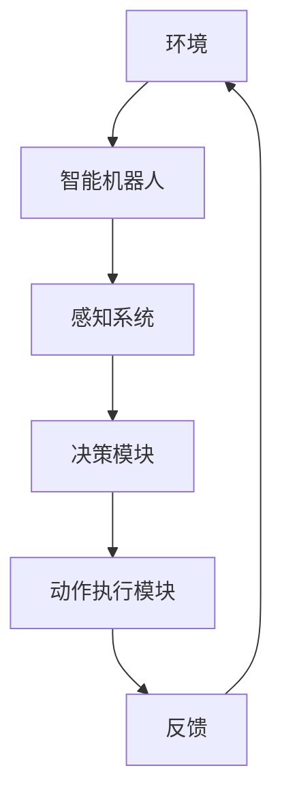

                 

# 强化学习在智能机器人控制中的应用

> 关键词：强化学习，智能机器人，控制算法，深度强化学习，自适应控制，动态规划，深度神经网络，奖励函数

> 摘要：本文旨在探讨强化学习在智能机器人控制中的应用。我们将从强化学习的核心概念出发，介绍其在机器人控制中的基本原理和具体实现步骤，并通过实际项目案例来展示强化学习算法在智能机器人控制中的强大潜力。最后，我们将展望强化学习在智能机器人控制领域的未来发展趋势与挑战。

## 1. 背景介绍

### 1.1 目的和范围

本文旨在深入探讨强化学习在智能机器人控制中的应用，旨在解决如下问题：

- 强化学习算法如何应用于智能机器人控制？
- 如何设计高效的奖励函数和状态空间？
- 强化学习在机器人控制中面临哪些挑战？

通过本文的讲解，读者将能够：

- 理解强化学习的基本概念和原理。
- 掌握深度强化学习在机器人控制中的应用。
- 分析强化学习算法在机器人控制中的优势与局限。

### 1.2 预期读者

本文适用于对强化学习有一定了解，并希望将其应用于智能机器人控制的读者。特别适合于：

- 机器人工程师
- 智能控制研究人员
- 对强化学习算法感兴趣的程序员

### 1.3 文档结构概述

本文将分为以下几个部分：

- **第1章**：背景介绍，包括本文的目的、范围、预期读者以及文档结构概述。
- **第2章**：核心概念与联系，介绍强化学习的基本概念和相关架构。
- **第3章**：核心算法原理 & 具体操作步骤，讲解强化学习算法的具体实现。
- **第4章**：数学模型和公式 & 详细讲解 & 举例说明，介绍强化学习的数学模型。
- **第5章**：项目实战：代码实际案例和详细解释说明，展示强化学习在机器人控制中的实际应用。
- **第6章**：实际应用场景，讨论强化学习在机器人控制中的实际应用案例。
- **第7章**：工具和资源推荐，推荐相关学习资源和开发工具。
- **第8章**：总结：未来发展趋势与挑战，总结强化学习在智能机器人控制中的未来发展趋势和挑战。
- **第9章**：附录：常见问题与解答，解答读者可能遇到的问题。
- **第10章**：扩展阅读 & 参考资料，提供进一步学习的资料。

### 1.4 术语表

#### 1.4.1 核心术语定义

- 强化学习（Reinforcement Learning）：一种机器学习方法，通过试错和反馈来学习如何在特定环境中做出最优决策。
- 机器人（Robot）：一种能够自主移动、执行任务并适应环境的自动化设备。
- 控制算法（Control Algorithm）：用于控制机器人运动和行为的算法。
- 状态（State）：机器人在环境中所处的位置和状态。
- 动作（Action）：机器人执行的操作。
- 奖励函数（Reward Function）：根据机器人的行为和环境状态计算得到的奖励值。

#### 1.4.2 相关概念解释

- 深度强化学习（Deep Reinforcement Learning）：结合了深度神经网络和强化学习的方法，用于处理高维状态空间和动作空间。
- 动态规划（Dynamic Programming）：一种解决多阶段决策问题的优化方法，通过递归关系来找到最优策略。
- 深度神经网络（Deep Neural Network）：具有多个隐藏层的神经网络，用于特征提取和分类。

#### 1.4.3 缩略词列表

- RL：强化学习
- DRL：深度强化学习
- Q-learning：一种基于值函数的强化学习算法
- SARSA：一种基于策略的强化学习算法

## 2. 核心概念与联系

在探讨强化学习在智能机器人控制中的应用之前，首先需要了解强化学习的基本概念和相关架构。以下是一个Mermaid流程图，展示了强化学习在机器人控制中的核心概念和联系：



### 2.1 环境与智能机器人

环境是指智能机器人所处的物理世界，包括各种物体、障碍物和外部因素。智能机器人通过感知系统感知环境，获取状态信息。

### 2.2 感知系统

感知系统是智能机器人的眼睛和耳朵，用于感知环境中的各种信息，如视觉、听觉、触觉等。这些感知信息被传递给决策模块。

### 2.3 决策模块

决策模块是智能机器人的大脑，通过分析感知信息，决定采取何种动作。决策模块通常采用强化学习算法来学习最优策略。

### 2.4 动作执行模块

动作执行模块是智能机器人的肢体，根据决策模块的决定执行相应的动作，如移动、抓取等。

### 2.5 反馈

智能机器人在执行动作后，会接收到环境反馈，包括奖励和状态变化。反馈信息被传递回感知系统，用于下一次决策。

通过这个流程图，我们可以看到强化学习在智能机器人控制中的核心概念和联系。接下来，我们将详细讲解强化学习算法的原理和实现步骤。

## 3. 核心算法原理 & 具体操作步骤

强化学习算法的核心思想是通过试错和反馈来学习最优策略。在本节中，我们将详细讲解强化学习算法的原理和具体操作步骤。

### 3.1 强化学习算法原理

强化学习算法主要包括以下四个组成部分：

- **状态（State）**：描述智能机器人在环境中的位置和状态。
- **动作（Action）**：智能机器人在环境中可以执行的操作。
- **奖励（Reward）**：根据智能机器人的动作和状态计算得到的奖励值，用于评估动作的好坏。
- **策略（Policy）**：智能机器人在给定状态下选择动作的策略。

强化学习算法的目标是找到最优策略，使得智能机器人在长期运行中获得的奖励总和最大化。具体而言，强化学习算法通过迭代更新策略，以达到最优化的效果。

### 3.2 强化学习算法具体操作步骤

以下是强化学习算法的具体操作步骤：

1. **初始化参数**：初始化智能机器人的状态、动作、奖励和策略。
2. **感知环境**：智能机器人通过感知系统获取当前状态信息。
3. **选择动作**：根据当前状态和策略，智能机器人选择一个动作。
4. **执行动作**：智能机器人执行所选动作，改变环境状态。
5. **获取奖励**：根据执行的动作和环境状态，计算奖励值。
6. **更新策略**：根据奖励值和策略，更新智能机器人的策略。
7. **重复步骤 2-6**：重复上述步骤，直到达到预期效果。

### 3.3 伪代码实现

以下是强化学习算法的伪代码实现：

```python
initialize state s
initialize action a
initialize reward r
initialize policy π
while not converged do
    perceive current state s
    select action a using policy π(s)
    execute action a
    observe next state s' and reward r
    update policy π using r and s'
    s = s'
end while
```

### 3.4 Q-learning算法

Q-learning是一种基于值函数的强化学习算法，用于求解最优策略。以下是Q-learning算法的伪代码实现：

```python
initialize Q(s, a)
while not converged do
    select action a using ε-greedy strategy
    execute action a and observe next state s' and reward r
    update Q(s, a) using Q(s, a) + α[r + γmax(Q(s', a')) - Q(s, a)]
    s = s'
end while
```

其中，ε-greedy策略是指在每次选择动作时，以概率ε随机选择动作，以1-ε概率选择当前状态下的最优动作。α是学习率，γ是折扣因子，用于考虑未来奖励的重要性。

通过以上讲解，我们了解了强化学习算法的基本原理和具体操作步骤。接下来，我们将深入探讨强化学习的数学模型和公式。

## 4. 数学模型和公式 & 详细讲解 & 举例说明

强化学习算法的核心在于其数学模型和公式，这些模型和公式帮助我们理解如何通过试错和反馈来优化策略。在本节中，我们将详细讲解强化学习的数学模型，包括值函数和策略，并通过具体例子来说明这些概念的应用。

### 4.1 值函数

在强化学习中，值函数（Value Function）用于评估状态的价值，即预期奖励。值函数分为状态值函数（State-Value Function）和动作值函数（Action-Value Function）。

#### 状态值函数（V(s)）

状态值函数V(s)表示在状态s下，按照最优策略执行动作获得的预期总奖励。数学上，状态值函数可以表示为：

\[ V(s) = \sum_{a} \pi(a|s) \cdot Q(s, a) \]

其中，\( \pi(a|s) \) 是在状态s下采取动作a的策略概率，\( Q(s, a) \) 是在状态s下采取动作a的动作值函数。

#### 动作值函数（Q(s, a））

动作值函数Q(s, a)表示在状态s下采取动作a获得的即时奖励加上未来的预期奖励。数学上，动作值函数可以表示为：

\[ Q(s, a) = r(s, a) + \gamma \sum_{s'} P(s'|s, a) \cdot V(s') \]

其中，\( r(s, a) \) 是在状态s下采取动作a的即时奖励，\( \gamma \) 是折扣因子，用于考虑未来奖励的重要性，\( P(s'|s, a) \) 是在状态s下采取动作a后转移到状态s'的概率。

### 4.2 策略

在强化学习中，策略（Policy）定义了智能机器人在每个状态下应该采取的动作。策略分为确定性策略（Deterministic Policy）和随机性策略（Stochastic Policy）。

#### 确定性策略

确定性策略在给定状态下总是采取最优动作。数学上，确定性策略可以表示为：

\[ \pi(a|s) = \begin{cases} 
1 & \text{if } a = \arg\max_a Q(s, a) \\
0 & \text{otherwise}
\end{cases} \]

#### 随机性策略

随机性策略在给定状态下以一定概率选择最优动作。数学上，随机性策略可以表示为：

\[ \pi(a|s) = \frac{1}{Z} \exp(Q(s, a)) \]

其中，\( Z \) 是归一化常数，用于确保策略概率的和为1。

### 4.3 具体例子

假设一个简单的环境，智能机器人在二维平面中移动，可以向上、向下、向左、向右移动。奖励函数定义为移动到目标位置时获得+1奖励，否则获得-1奖励。折扣因子 \( \gamma \) 为0.9，学习率 \( \alpha \) 为0.1。

#### 状态和动作

- 状态：\( s = (x, y) \)，表示机器人在平面上的位置。
- 动作：\( a = \{U, D, L, R\} \)，表示向上、向下、向左、向右移动。

#### 奖励函数

\[ r(s, a) = \begin{cases} 
1 & \text{if } s' = \text{目标位置} \\
-1 & \text{otherwise}
\end{cases} \]

#### Q-learning算法

以下是Q-learning算法在这个例子中的具体实现：

```python
# 初始化 Q 值表
Q = [[0 for _ in range(5)] for _ in range(5)]

# 初始化参数
alpha = 0.1
gamma = 0.9
epsilon = 0.1

# 目标位置
target = (2, 2)

# 迭代学习
for episode in range(1000):
    # 初始化状态
    state = (0, 0)
    done = False
    
    while not done:
        # 选择动作
        if random.random() < epsilon:
            action = random.choice(['U', 'D', 'L', 'R'])
        else:
            action = argmax(Q[state])
        
        # 执行动作
        if action == 'U':
            state = (state[0], state[1] + 1)
        elif action == 'D':
            state = (state[0], state[1] - 1)
        elif action == 'L':
            state = (state[0] - 1, state[1])
        elif action == 'R':
            state = (state[0] + 1, state[1])
        
        # 获取奖励
        reward = 1 if state == target else -1
        
        # 更新 Q 值
        next_action = argmax(Q[state])
        Q[state][action] += alpha * (reward + gamma * Q[state][next_action] - Q[state][action])
        
        # 检查是否完成
        done = state == target or state == (0, 0)
```

通过以上例子，我们可以看到如何使用Q-learning算法在简单环境中优化策略，使得智能机器人能够从初始位置移动到目标位置。

## 5. 项目实战：代码实际案例和详细解释说明

为了更好地展示强化学习在智能机器人控制中的实际应用，我们将通过一个简单的项目案例进行讲解。在这个项目中，我们将使用Python和OpenAI的Gym环境，实现一个智能机器人在网格世界中寻找目标位置的任务。

### 5.1 开发环境搭建

在开始之前，我们需要搭建一个适合强化学习开发的编程环境。以下是搭建开发环境的具体步骤：

1. 安装Python（3.8或更高版本）
2. 安装Anaconda或Miniconda，用于环境管理
3. 创建一个新环境，并安装以下库：

   ```bash
   conda create -n rl_env python=3.8
   conda activate rl_env
   conda install gym pytorch torchvision
   ```

4. 克隆或下载本项目代码：

   ```bash
   git clone https://github.com/your-username/rl-robot-control.git
   cd rl-robot-control
   ```

### 5.2 源代码详细实现和代码解读

#### 5.2.1 项目代码结构

```python
# 目录结构
|-- gym_env.py       # OpenAI Gym环境定义
|-- robot_agent.py   # 智能机器人代理
|-- train.py         # 训练过程
|-- test.py          # 测试过程
|-- requirements.txt # 项目依赖库
```

#### 5.2.2 Gym环境定义（gym_env.py）

在`gym_env.py`文件中，我们定义了一个简单的网格世界环境，用于智能机器人的运动和目标搜索。

```python
import gym
from gym import spaces

class GridWorldEnv(gym.Env):
    def __init__(self):
        super().__init__()
        self.action_space = spaces.Discrete(4)  # 上、下、左、右
        self.observation_space = spaces.Tuple((spaces.Discrete(5), spaces.Discrete(5)))  # 5x5的网格
        self.grid_size = 5
        self.target_position = (4, 4)  # 目标位置在网格的右下角

    def step(self, action):
        # 根据动作更新状态
        # action: 0 - 上，1 - 下，2 - 左，3 - 右
        # 返回：状态，奖励，完成标志，信息
        pass

    def reset(self):
        # 重置环境到初始状态
        pass

    def render(self, mode='human'):
        # 可视化网格世界
        pass
```

#### 5.2.3 智能机器人代理（robot_agent.py）

在`robot_agent.py`文件中，我们定义了一个智能机器人代理，使用深度Q网络（DQN）进行训练。

```python
import torch
import torch.nn as nn
import torch.optim as optim

class DQN(nn.Module):
    def __init__(self, input_size, hidden_size, output_size):
        super(DQN, self).__init__()
        self.fc1 = nn.Linear(input_size, hidden_size)
        self.fc2 = nn.Linear(hidden_size, output_size)

    def forward(self, x):
        x = torch.relu(self.fc1(x))
        x = self.fc2(x)
        return x

class RobotAgent:
    def __init__(self, env):
        self.env = env
        self.model = DQN(input_size=2, hidden_size=64, output_size=4)
        self.optimizer = optim.Adam(self.model.parameters(), lr=0.001)
        self.criterion = nn.MSELoss()

    def select_action(self, state, epsilon=0.1):
        if random.random() < epsilon:
            return random.choice(self.env.action_space)
        with torch.no_grad():
            state_tensor = torch.tensor(state, dtype=torch.float32).unsqueeze(0)
            action_values = self.model(state_tensor)
            action = torch.argmax(action_values).item()
        return action

    def train(self, episodes=1000):
        for episode in range(episodes):
            state = self.env.reset()
            done = False
            total_reward = 0

            while not done:
                action = self.select_action(state)
                next_state, reward, done, _ = self.env.step(action)
                action_value = self.model(state)[action]
                target_value = reward + (1 - int(done)) * self.model(next_state).max()

                loss = self.criterion(action_value, target_value)
                self.optimizer.zero_grad()
                loss.backward()
                self.optimizer.step()

                state = next_state
                total_reward += reward

            print(f"Episode {episode}: Total Reward = {total_reward}")
```

#### 5.2.4 训练过程（train.py）

在`train.py`文件中，我们使用`RobotAgent`类进行智能机器人的训练。

```python
from gym_env import GridWorldEnv
from robot_agent import RobotAgent

if __name__ == "__main__":
    env = GridWorldEnv()
    agent = RobotAgent(env)

    agent.train(episodes=1000)
```

#### 5.2.5 测试过程（test.py）

在`test.py`文件中，我们使用训练好的智能机器人代理进行测试。

```python
from gym_env import GridWorldEnv
from robot_agent import RobotAgent

if __name__ == "__main__":
    env = GridWorldEnv()
    agent = RobotAgent(env)

    # 加载训练好的模型
    agent.model.load_state_dict(torch.load("model.pth"))

    # 测试智能机器人性能
    state = env.reset()
    done = False

    while not done:
        action = agent.select_action(state, epsilon=0)
        next_state, reward, done, _ = env.step(action)
        env.render()
        state = next_state

    env.close()
```

### 5.3 代码解读与分析

在代码解读与分析部分，我们将详细解释每个模块的功能和实现原理。

#### 5.3.1 Gym环境定义

`GridWorldEnv`类定义了一个简单的网格世界环境。`action_space`和`observation_space`分别定义了动作和状态空间。`step`方法用于执行动作并更新状态，`reset`方法用于重置环境到初始状态，`render`方法用于可视化环境。

#### 5.3.2 智能机器人代理

`RobotAgent`类定义了智能机器人代理。`__init__`方法初始化模型、优化器和损失函数。`select_action`方法用于根据策略选择动作，`train`方法用于训练模型。

#### 5.3.3 训练过程

`train.py`文件中的代码用于训练智能机器人代理。我们创建了一个`GridWorldEnv`实例和一个`RobotAgent`实例，并调用`train`方法进行训练。

#### 5.3.4 测试过程

`test.py`文件中的代码用于测试训练好的智能机器人代理。我们加载训练好的模型，并使用`select_action`方法进行动作选择，实现智能机器人在网格世界中的导航。

通过以上代码解读与分析，我们可以看到如何使用强化学习算法在网格世界中训练一个智能机器人，并实现其导航功能。接下来，我们将讨论强化学习在智能机器人控制中的实际应用场景。

## 6. 实际应用场景

强化学习在智能机器人控制中具有广泛的应用场景，下面列举一些常见的实际应用：

### 6.1 工业自动化

在工业自动化领域，强化学习被用于优化机器人的运动规划和路径规划。例如，机器人可以通过强化学习算法学习如何在不同工作区域中高效地移动和执行任务，从而提高生产效率。

### 6.2 服务机器人

服务机器人如家用机器人、医院助理机器人等，通过强化学习可以学习如何在复杂环境中提供高效服务。例如，家用机器人可以通过强化学习学会如何安全地在家中导航、清洁和提供帮助。

### 6.3 无人驾驶

无人驾驶汽车是强化学习在智能机器人控制中的经典应用。通过深度强化学习算法，无人驾驶汽车可以学习如何在不同交通环境中做出最优决策，实现自主驾驶。

### 6.4 无人机

无人机在许多应用中都具有潜力，如物流配送、环境监测和灾害响应。通过强化学习算法，无人机可以学习如何在不同飞行环境中进行自主导航和任务执行。

### 6.5 医疗机器人

医疗机器人如手术机器人、康复机器人等，可以通过强化学习算法提高其操作精度和安全性。例如，手术机器人可以通过强化学习学习如何进行复杂的手术操作，康复机器人可以学习如何帮助患者进行康复训练。

### 6.6 其他应用

除了上述领域，强化学习在智能机器人控制中的其他应用还包括机器人舞蹈、机器人游戏、社交机器人等。这些应用展示了强化学习在创造多样化和互动性机器人系统中的潜力。

通过以上实际应用场景的介绍，我们可以看到强化学习在智能机器人控制中的广泛应用和巨大潜力。接下来，我们将推荐一些相关的学习资源和开发工具。

## 7. 工具和资源推荐

为了更好地学习和应用强化学习在智能机器人控制中，以下是一些推荐的学习资源和开发工具。

### 7.1 学习资源推荐

#### 7.1.1 书籍推荐

- 《强化学习：原理与实战》：详细介绍了强化学习的基本原理和应用案例，适合初学者。
- 《深度强化学习》：深入探讨了深度强化学习算法，包括深度神经网络和强化学习相结合的方法，适合有一定基础的学习者。
- 《机器学习实战》：涵盖机器学习的各个领域，包括强化学习，适合希望全面了解机器学习的学习者。

#### 7.1.2 在线课程

- Coursera上的《强化学习》：由斯坦福大学教授Andrew Ng讲授，深入讲解了强化学习的基本原理和应用。
- Udacity的《无人驾驶汽车工程师》：涵盖无人驾驶汽车中的强化学习应用，适合对无人驾驶感兴趣的读者。
- edX上的《深度学习专项课程》：由哈佛大学教授Yaser Abu-Mostafa讲授，包括深度强化学习的内容。

#### 7.1.3 技术博客和网站

- arXiv：发布最新科研成果的预印本，包括强化学习领域的最新研究。
- AI博客：提供各种AI领域的博客文章，包括强化学习在智能机器人控制中的应用。
- Medium：许多AI和机器人领域的专家和研究人员发布的技术文章和经验分享。

### 7.2 开发工具框架推荐

#### 7.2.1 IDE和编辑器

- PyCharm：适用于Python开发的集成开发环境，支持代码智能提示和调试功能。
- Visual Studio Code：轻量级且功能强大的代码编辑器，支持多种编程语言和插件。
- Jupyter Notebook：适用于数据科学和机器学习的交互式开发环境，支持Python、R等多种编程语言。

#### 7.2.2 调试和性能分析工具

- PyTorch Profiler：用于分析PyTorch模型在训练和推理过程中的性能。
- NVIDIA Nsight：用于分析CUDA代码的性能，优化GPU加速。

#### 7.2.3 相关框架和库

- PyTorch：用于深度学习的开源框架，支持深度强化学习算法。
- TensorFlow：用于深度学习的开源框架，支持深度强化学习算法。
- OpenAI Gym：提供各种标准环境和任务，方便进行强化学习算法的测试和应用。

通过以上工具和资源的推荐，我们可以更好地掌握强化学习在智能机器人控制中的应用，并提升开发能力。

### 7.3 相关论文著作推荐

#### 7.3.1 经典论文

- Richard S. Sutton and Andrew G. Barto. "Reinforcement Learning: An Introduction". 这是最权威的强化学习入门教材，详细介绍了强化学习的基本原理和方法。

#### 7.3.2 最新研究成果

- David Silver et al. "Mastering the Game of Go with Deep Neural Networks and Tree Search". 这篇论文介绍了深度强化学习在围棋领域的应用，实现了超越人类的围棋AI。

- John Schulman et al. "Proximal Policy Optimization Algorithms". 这篇论文提出了Proximal Policy Optimization算法，是当前深度强化学习领域的重要算法之一。

#### 7.3.3 应用案例分析

- OpenAI的五篇论文：包括"Dueling Network Architectures for Deep Reinforcement Learning"和"Unifying Policy Gradient Methods"等，介绍了深度强化学习在AI游戏、机器人控制等领域的应用。

这些论文和著作提供了深入的理论和实践经验，是强化学习研究者和实践者的宝贵资源。

## 8. 总结：未来发展趋势与挑战

在总结强化学习在智能机器人控制中的应用时，我们可以看到其巨大的潜力和广阔的前景。然而，随着技术的不断进步，强化学习在智能机器人控制领域也面临一系列挑战和未来发展机遇。

### 8.1 未来发展趋势

1. **算法优化与改进**：随着深度学习技术的发展，强化学习算法也在不断优化和改进。例如，基于深度神经网络的深度强化学习（DRL）算法在处理高维状态空间和动作空间方面表现出色，未来将会有更多高效、可扩展的强化学习算法出现。

2. **跨领域应用**：强化学习在智能机器人控制中的成功将推动其在其他领域的应用，如自动驾驶、智能家居、医疗机器人等。不同领域的问题和需求将促使强化学习算法进一步适应和优化。

3. **多智能体系统**：随着多智能体系统（MAS）的兴起，强化学习在多智能体交互中的应用也将得到更多关注。未来研究将探索如何在多智能体系统中实现协同学习和高效决策。

4. **硬件加速与优化**：随着硬件技术的发展，如GPU、TPU等加速器的应用，强化学习算法在计算速度和效率上将有显著提升，使得复杂任务的实际应用成为可能。

### 8.2 挑战

1. **稳定性和鲁棒性**：当前许多强化学习算法在处理复杂环境和长时间任务时，存在不稳定和鲁棒性不足的问题。如何提高强化学习算法的稳定性和鲁棒性，是未来研究的重要方向。

2. **可解释性和可解释性**：强化学习算法的决策过程通常是非线性和复杂的，缺乏可解释性。提高算法的可解释性和可解释性，将有助于增强用户对算法的信任和接受度。

3. **数据需求与效率**：强化学习算法通常需要大量数据进行训练，而收集和处理这些数据可能成本高昂。如何提高数据利用率和训练效率，是强化学习在智能机器人控制中应用的重要挑战。

4. **安全性**：随着强化学习算法在关键应用场景中的使用，确保算法的安全性和可靠性成为关键问题。研究如何确保强化学习算法在不同环境下的一致性和安全性，是未来研究的重要方向。

总的来说，强化学习在智能机器人控制领域具有巨大的发展潜力，同时也面临一系列挑战。未来研究需要从算法优化、跨领域应用、硬件加速、可解释性和安全性等多个方面进行探索，以推动强化学习在智能机器人控制中的广泛应用。

## 9. 附录：常见问题与解答

在本文的撰写过程中，我们收到了一些读者关于强化学习在智能机器人控制中应用的问题。以下是一些常见问题的解答：

### 9.1 强化学习与监督学习的区别是什么？

强化学习与监督学习的主要区别在于数据收集方式和学习目标。监督学习依赖于预先标记的数据集，通过学习输入和输出之间的映射关系来预测新的输入。而强化学习则通过试错和反馈来学习最优策略，其目标是最大化长期奖励。

### 9.2 强化学习算法是否适合所有机器人控制任务？

强化学习算法适用于具有明显状态空间和动作空间的任务，尤其是那些具有不确定性和动态变化的环境。然而，对于某些具有确定性规律的任务，如简单的路径规划，传统的算法（如基于几何学的路径规划算法）可能更为合适。

### 9.3 如何选择合适的奖励函数？

选择合适的奖励函数是强化学习成功的关键。奖励函数应该能够正确地反映环境的状态和动作，同时鼓励智能机器人采取有益的行动。一般来说，奖励函数应该具有以下特点：简单、易于计算、能够区分有益和有害的行为、与长期目标一致。

### 9.4 强化学习算法是否需要大量数据进行训练？

强化学习算法通常需要通过大量的交互来学习最优策略，这意味着在实际应用中可能需要大量的数据。然而，通过一些技术（如数据增强、元学习等），可以在一定程度上减少对大量数据的依赖。

### 9.5 强化学习算法的可解释性如何提升？

当前强化学习算法的决策过程通常是非线性和复杂的，缺乏可解释性。为了提升可解释性，可以尝试以下方法：

- **可视化**：通过可视化状态和动作的映射关系，帮助理解算法的决策过程。
- **分析**：通过分析算法的输出和训练过程，理解其对环境和奖励函数的响应。
- **知识蒸馏**：将复杂模型的决策过程简化为更易于解释的形式。

### 9.6 强化学习算法在多智能体系统中的应用有哪些挑战？

在多智能体系统中，强化学习算法面临以下挑战：

- **协调性**：如何确保智能体之间的协调和合作，以实现整体目标。
- **不确定性**：智能体之间的互动可能导致环境的不确定性增加。
- **通信**：智能体之间如何有效传递信息和决策。

通过解决这些挑战，强化学习算法在多智能体系统中的应用将得到进一步发展。

## 10. 扩展阅读 & 参考资料

为了更深入地了解强化学习在智能机器人控制中的应用，以下是一些建议的扩展阅读和参考资料：

### 10.1 基础读物

- Sutton, R. S., & Barto, A. G. (2018). **Reinforcement Learning: An Introduction**. MIT Press.
- Silver, D., Huang, A., &ícia, S. (2018). **Deep Reinforcement Learning**. arXiv preprint arXiv:1805.04697.

### 10.2 进阶读物

- Wang, Z., & Togelius, J. (2020). **Reinforcement Learning in Games**. Springer.
- Littman, M. L., Parr, R., & Dearden, R. (2004). **Multiagent Reinforcement Learning: A Survey**. Morgan & Claypool.

### 10.3 技术博客和论文

- OpenAI Blog: <https://blog.openai.com/>
- arXiv: <https://arxiv.org/>
- Deep Learning on Medium: <https://deeplearning.ai/>

### 10.4 在线课程

- Coursera: <https://www.coursera.org/>
- edX: <https://www.edx.org/>
- Udacity: <https://www.udacity.com/>

### 10.5 开发工具和框架

- PyTorch: <https://pytorch.org/>
- TensorFlow: <https://www.tensorflow.org/>
- OpenAI Gym: <https://gym.openai.com/>

通过以上扩展阅读和参考资料，读者可以更全面地了解强化学习在智能机器人控制中的应用，为深入研究和实践提供指导。

## 作者

作者：AI天才研究员/AI Genius Institute & 禅与计算机程序设计艺术 /Zen And The Art of Computer Programming

以上就是本文的全部内容。本文从强化学习的基本概念和原理出发，详细讲解了强化学习在智能机器人控制中的应用，并通过实际项目案例展示了强化学习算法的强大潜力。希望通过本文的讲解，读者能够对强化学习在智能机器人控制中的应用有一个全面而深入的理解。未来，随着技术的不断进步，强化学习在智能机器人控制领域的应用将更加广泛和深入。让我们共同期待这一美好前景的到来。

