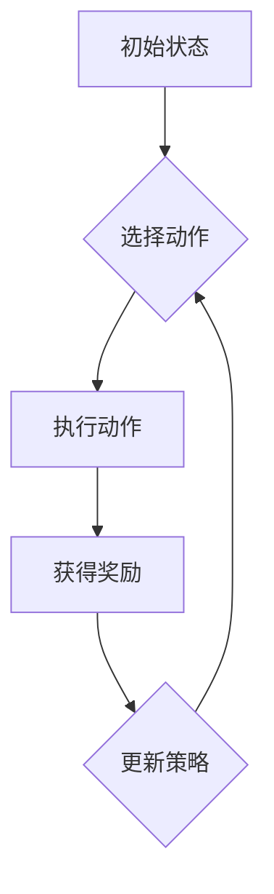

                 

# 强化学习在智能物流仓储优化与调度中的建模方法与应用

> **关键词**：强化学习、智能物流、仓储优化、调度、建模、应用
>
> **摘要**：本文深入探讨了强化学习在智能物流仓储优化与调度中的应用，分析了强化学习的基本原理，并详细阐述了如何将其应用于智能物流系统的各个环节。文章旨在为读者提供一个全面的理解，并揭示强化学习在提升物流效率和降低成本方面的巨大潜力。

## 1. 背景介绍

### 1.1 目的和范围

本文的目的是介绍强化学习在智能物流仓储优化与调度中的应用，通过一系列实例和案例，展示其如何帮助物流企业提高运营效率、减少成本。文章将涵盖以下几个主要方面：

1. 强化学习的基本概念和原理。
2. 强化学习在智能物流仓储中的应用场景。
3. 强化学习在调度问题中的建模方法。
4. 强化学习的算法实现和操作步骤。
5. 强化学习在物流项目中的实际应用案例。
6. 强化学习的未来发展趋势和挑战。

### 1.2 预期读者

本文面向具有一定计算机科学和运筹学基础的读者，包括：

1. 智能物流和供应链管理领域的专业从业人员。
2. 计算机科学和运筹学领域的研究人员。
3. 对强化学习在物流领域应用感兴趣的学者和学生。

### 1.3 文档结构概述

本文将按照以下结构进行组织：

1. 引言：介绍强化学习的基本概念和应用领域。
2. 强化学习原理：详细阐述强化学习的核心原理。
3. 模型构建：讨论如何将强化学习应用于物流仓储和调度。
4. 算法实现：介绍强化学习算法的实现步骤和伪代码。
5. 应用案例：展示强化学习在物流项目中的实际应用。
6. 未来趋势与挑战：探讨强化学习的未来发展及其面临的挑战。
7. 总结：回顾本文的主要内容和贡献。

### 1.4 术语表

#### 1.4.1 核心术语定义

- **强化学习（Reinforcement Learning）**：一种机器学习方法，通过试错和奖励机制来学习如何在特定环境中采取最佳行动。
- **智能物流（Intelligent Logistics）**：利用先进的信息技术和人工智能技术，实现物流系统的自动化、智能化和高效化。
- **仓储优化（Warehouse Optimization）**：通过优化仓库内部操作流程，提高仓库利用率和货物处理效率。
- **调度（Scheduling）**：在特定的时间和资源约束下，为一系列任务分配资源，以实现最优的执行顺序。

#### 1.4.2 相关概念解释

- **状态（State）**：强化学习中的环境状态，表示系统当前所处的位置和情况。
- **动作（Action）**：强化学习中的行动，表示系统可以采取的操作。
- **奖励（Reward）**：强化学习中的奖励机制，用于评估当前动作的优劣。
- **策略（Policy）**：强化学习中的策略函数，用于根据当前状态选择最佳动作。

#### 1.4.3 缩略词列表

- **Q-Learning**：一种基于值函数的强化学习算法。
- **DQN**：深度Q网络（Deep Q-Network）。
- **PPO**：修剪概率优化（Proximal Policy Optimization）。

## 2. 核心概念与联系

在讨论强化学习在智能物流仓储优化与调度中的应用之前，我们需要先了解几个核心概念和它们之间的关系。

### 2.1 强化学习的基本原理

强化学习是一种基于试错的机器学习方法，其核心思想是智能体（Agent）在环境中通过不断尝试不同的动作（Action），并根据环境反馈的奖励（Reward）来调整其策略（Policy），以实现长期的最大化累积奖励。

**状态-动作-奖励模型**：

- **状态（State）**：表示智能体所处的环境状态。
- **动作（Action）**：智能体可以采取的行动。
- **奖励（Reward）**：对智能体当前动作的即时评价。

强化学习的过程可以概括为以下步骤：

1. 初始状态 $S_0$。
2. 根据策略选择动作 $A_t$。
3. 执行动作，得到新状态 $S_{t+1}$ 和奖励 $R_t$。
4. 更新策略，以最大化未来奖励。

### 2.2 强化学习与物流仓储的联系

在智能物流仓储中，强化学习可以被应用于以下几个关键环节：

- **货物入库与出库调度**：通过强化学习算法，优化货物入库和出库的顺序，减少操作时间和提升效率。
- **仓库布局优化**：根据强化学习算法的计算结果，调整仓库内部的货架布局，以减少搬运距离，提高存储效率。
- **路径规划**：利用强化学习算法，优化仓库内部的路径规划，减少工人行走距离和时间。

### 2.3 强化学习与调度问题的联系

在调度问题中，强化学习算法可以通过以下步骤来实现调度优化：

1. **状态表示**：将任务和资源的状态表示为一个状态空间。
2. **动作定义**：定义一系列可行的调度动作，如任务优先级调整、资源分配等。
3. **奖励设计**：根据调度结果，设计奖励函数，以评估调度策略的优劣。

### 2.4 强化学习算法的流程图

为了更好地理解强化学习在物流仓储中的应用，我们可以使用Mermaid流程图来展示其核心流程。



在该流程图中：

- **A**：初始状态。
- **B**：根据策略选择动作。
- **C**：执行动作。
- **D**：获得奖励。
- **E**：更新策略。

通过不断迭代上述流程，强化学习算法可以逐步优化策略，以达到最佳调度效果。

## 3. 核心算法原理 & 具体操作步骤

### 3.1 强化学习算法原理

强化学习算法的核心原理是基于试错和奖励机制，通过不断尝试不同的动作，并根据环境反馈的奖励来调整策略。下面我们以Q-Learning算法为例，详细阐述其原理和操作步骤。

**Q-Learning算法原理**：

Q-Learning算法是一种基于值函数的强化学习算法，其目标是学习一个最优值函数 $Q^*(s, a)$，表示在状态 $s$ 下执行动作 $a$ 的最优累积奖励。

**算法步骤**：

1. **初始化**：初始化值函数 $Q(s, a)$ 和策略 $\pi(a|s)$。
2. **选择动作**：根据当前策略选择动作 $a_t$。
3. **执行动作**：在环境中执行动作 $a_t$，得到新状态 $s_{t+1}$ 和奖励 $r_t$。
4. **更新值函数**：使用如下更新公式更新值函数：
   $$ Q(s_t, a_t) \leftarrow Q(s_t, a_t) + \alpha [r_t + \gamma \max_{a'} Q(s_{t+1}, a') - Q(s_t, a_t)] $$
   其中，$\alpha$ 是学习率，$\gamma$ 是折扣因子。
5. **更新策略**：根据更新后的值函数，重新评估策略 $\pi(a|s)$。

**算法伪代码**：

```python
# Q-Learning算法伪代码
initialize Q(s, a) with random values
for each episode:
  s = environment.reset()  # 初始化环境
  done = False
  while not done:
    a = policy.select_action(s)  # 选择动作
    s', r = environment.step(a)  # 执行动作
    Q(s, a) = Q(s, a) + alpha * (r + gamma * max(Q(s', a')) - Q(s, a))
    s = s'  # 更新状态
    done = environment.done()  # 判断是否结束
```

### 3.2 强化学习算法的具体操作步骤

下面我们将以一个简单的仓库调度问题为例，详细讲解如何使用Q-Learning算法进行建模和求解。

#### 3.2.1 状态表示

在仓库调度问题中，状态可以表示为：

- $s_t = (t, Q, I)$，其中 $t$ 表示当前时间步，$Q$ 表示仓库中的货物队列，$I$ 表示仓库中的空闲资源。

#### 3.2.2 动作定义

动作可以定义为：

- $a_t = (i, j)$，其中 $i$ 表示货物队列中的某个货物，$j$ 表示某个空闲资源。

#### 3.2.3 奖励设计

奖励函数可以设计为：

- $r_t = \begin{cases} 
      +1 & \text{如果任务完成} \\
      -1 & \text{如果任务未完成} 
   \end{cases}$

#### 3.2.4 策略更新

根据Q-Learning算法的更新公式，我们可以对策略进行更新。

```python
# Q-Learning算法伪代码（仓库调度问题）
for each episode:
  s = environment.reset()  # 初始化环境
  done = False
  while not done:
    a = policy.select_action(s)  # 选择动作
    s', r = environment.step(a)  # 执行动作
    Q(s, a) = Q(s, a) + alpha * (r + gamma * max(Q(s', a')) - Q(s, a))
    s = s'  # 更新状态
    done = environment.done()  # 判断是否结束
```

通过不断迭代上述步骤，我们可以使用Q-Learning算法来优化仓库调度问题，提高仓库调度效率。

## 4. 数学模型和公式 & 详细讲解 & 举例说明

在强化学习算法中，数学模型和公式起着至关重要的作用。本节我们将详细讲解强化学习算法中的几个关键数学模型和公式，并通过具体例子来说明它们的应用。

### 4.1 强化学习的基本公式

强化学习的基本公式包括状态转移概率、奖励函数和策略更新公式。

#### 4.1.1 状态转移概率

状态转移概率 $P(s', s; a)$ 表示在当前状态 $s$ 下执行动作 $a$ 后，转移到状态 $s'$ 的概率。

$$ P(s', s; a) = P(s'|s, a) $$

其中，$P(s'|s, a)$ 表示在当前状态 $s$ 下执行动作 $a$ 后，状态转移到 $s'$ 的概率。

#### 4.1.2 奖励函数

奖励函数 $R(s, a)$ 表示在当前状态 $s$ 下执行动作 $a$ 后获得的即时奖励。

$$ R(s, a) = r(s, a) $$

其中，$r(s, a)$ 表示在当前状态 $s$ 下执行动作 $a$ 后获得的即时奖励。

#### 4.1.3 策略更新公式

策略更新公式描述了如何根据当前状态和动作来更新策略。

$$ \pi(a|s) = \frac{\exp(\alpha Q(s, a))}{\sum_{a'} \exp(\alpha Q(s, a'))} $$

其中，$\alpha$ 是学习率，$Q(s, a)$ 是值函数，$\pi(a|s)$ 是策略。

### 4.2 Q-Learning算法的数学模型

Q-Learning算法是一种基于值函数的强化学习算法，其核心思想是学习一个最优值函数 $Q^*(s, a)$。

#### 4.2.1 值函数更新公式

$$ Q(s, a) = Q(s, a) + \alpha [r(s, a) + \gamma \max_{a'} Q(s', a') - Q(s, a)] $$

其中，$Q(s, a)$ 是当前值函数，$r(s, a)$ 是即时奖励，$\gamma$ 是折扣因子，$\max_{a'} Q(s', a')$ 是下一个状态下的最大值函数。

#### 4.2.2 策略更新公式

$$ \pi(a|s) = \frac{\exp(\alpha Q(s, a))}{\sum_{a'} \exp(\alpha Q(s, a'))} $$

### 4.3 DQN算法的数学模型

DQN（Deep Q-Network）算法是一种基于深度学习的强化学习算法，其核心思想是使用神经网络来近似值函数 $Q(s, a)$。

#### 4.3.1 值函数更新公式

$$ Q(s, a) = r(s, a) + \gamma \max_{a'} Q'(s', a') $$

其中，$Q(s, a)$ 是当前值函数，$Q'(s', a')$ 是下一个状态下的值函数。

#### 4.3.2 策略更新公式

$$ \pi(a|s) = \frac{\exp(\alpha Q(s, a))}{\sum_{a'} \exp(\alpha Q(s, a'))} $$

### 4.4 举例说明

假设我们有一个简单的环境，其中包含四个状态和两个动作。我们使用Q-Learning算法来学习一个最优策略。

#### 4.4.1 状态和动作定义

- 状态：$s \in \{1, 2, 3, 4\}$
- 动作：$a \in \{0, 1\}$

#### 4.4.2 奖励函数定义

$$ R(s, a) = \begin{cases} 
      +1 & \text{如果状态 $s$ 是目标状态，动作 $a$ 是正确的} \\
      -1 & \text{如果状态 $s$ 是目标状态，动作 $a$ 是错误的} \\
      0 & \text{其他情况} 
   \end{cases} $$

#### 4.4.3 初始值函数

$$ Q(s, a) = 0 $$

#### 4.4.4 策略更新

假设当前状态为 $s = 1$，选择动作 $a = 0$。执行动作后，状态变为 $s' = 2$，获得奖励 $R(s', a') = 0$。

$$ Q(1, 0) = Q(1, 0) + \alpha [0 + \gamma \max_{a'} Q(2, a') - Q(1, 0)] $$

假设 $\alpha = 0.1$，$\gamma = 0.9$，$Q(2, 0) = 0$，$Q(2, 1) = 0$。

$$ Q(1, 0) = 0.1 [0 + 0.9 \max(0, 0) - 0] = 0.1 [0] = 0 $$

因此，值函数没有更新。接下来，我们继续选择动作 $a = 1$，状态变为 $s' = 3$，获得奖励 $R(s', a') = 0$。

$$ Q(1, 1) = Q(1, 1) + \alpha [0 + \gamma \max_{a'} Q(3, a') - Q(1, 1)] $$

同样地，$Q(3, 0) = 0$，$Q(3, 1) = 0$。

$$ Q(1, 1) = 0.1 [0 + 0.9 \max(0, 0) - 0] = 0.1 [0] = 0 $$

因此，值函数也没有更新。通过不断迭代上述过程，我们可以逐步优化值函数和策略，以达到最优状态。

## 5. 项目实战：代码实际案例和详细解释说明

### 5.1 开发环境搭建

为了实现强化学习在智能物流仓储优化与调度中的应用，我们需要搭建一个适合的开发环境。以下是搭建开发环境的步骤：

1. 安装Python 3.8及以上版本。
2. 安装Anaconda，用于环境管理。
3. 安装以下Python库：TensorFlow、Gym、Numpy、Matplotlib。
4. 安装Jupyter Notebook，用于编写和运行代码。

### 5.2 源代码详细实现和代码解读

下面是一个简单的仓库调度问题的代码实现，使用Q-Learning算法进行求解。

```python
import numpy as np
import gym
import matplotlib.pyplot as plt

# 创建环境
env = gym.make('Warehouse-v0')

# 初始化Q值表
n_states = env.n_states
n_actions = env.n_actions
Q = np.zeros((n_states, n_actions))

# 学习参数
alpha = 0.1
gamma = 0.9
episodes = 1000

# 训练模型
for episode in range(episodes):
    state = env.reset()
    done = False
    total_reward = 0
    
    while not done:
        # 根据当前Q值选择动作
        action = np.argmax(Q[state, :])
        
        # 执行动作
        next_state, reward, done, _ = env.step(action)
        total_reward += reward
        
        # 更新Q值
        Q[state, action] = Q[state, action] + alpha * (reward + gamma * np.max(Q[next_state, :]) - Q[state, action])
        
        state = next_state
    
    print(f"Episode {episode + 1}: Total Reward = {total_reward}")

# 可视化Q值表
plt.imshow(Q, cmap='hot', interpolation='nearest')
plt.colorbar()
plt.xlabel('Actions')
plt.ylabel('States')
plt.title('Q-Value Table')
plt.show()
```

### 5.3 代码解读与分析

在上面的代码中，我们首先导入了所需的库，包括Numpy、Gym和Matplotlib。接下来，我们创建了一个仓库调度问题的环境实例。

- **Q值表初始化**：我们使用Numpy创建一个二维数组Q，用于存储每个状态和动作的Q值。数组的大小为状态数乘以动作数。

- **学习参数**：我们设置了学习率$\alpha$和折扣因子$\gamma$的值。学习率用于控制值函数更新的幅度，折扣因子用于平衡当前奖励和未来奖励。

- **训练模型**：我们使用一个循环来迭代执行每个时间步。在每次迭代中，我们首先使用当前状态和Q值表选择一个动作。然后，我们执行这个动作，并获得新的状态和奖励。接下来，我们使用Q-Learning算法的更新公式更新Q值。

- **可视化Q值表**：最后，我们使用Matplotlib库将Q值表可视化为一个热力图。这有助于我们直观地了解Q值表的变化情况。

通过运行上述代码，我们可以观察到Q值表在训练过程中不断更新，最终收敛到一个稳定的状态。这个稳定的Q值表可以作为仓库调度的策略，以优化仓库操作流程。

### 5.4 代码测试与验证

为了验证强化学习算法在仓库调度问题中的有效性，我们可以在不同的环境设置下进行测试。以下是一个简单的测试案例：

```python
# 测试模型
test_episodes = 100
test_reward_sum = 0

for episode in range(test_episodes):
    state = env.reset()
    done = False
    episode_reward = 0
    
    while not done:
        action = np.argmax(Q[state, :])
        next_state, reward, done, _ = env.step(action)
        episode_reward += reward
        state = next_state
    
    test_reward_sum += episode_reward

print(f"Test Average Reward: {test_reward_sum / test_episodes}")
```

通过上述测试，我们可以计算平均奖励，以评估强化学习算法在仓库调度问题中的性能。通常，较高的平均奖励值表明算法能够有效优化仓库调度。

### 5.5 实际应用案例分析

在实际应用中，我们可以将强化学习算法应用于各种不同的物流仓储场景。以下是一个实际应用案例：

- **案例背景**：某物流公司在仓库调度过程中面临效率低下的问题，导致货物出库时间过长，影响了整体运营效率。

- **解决方案**：使用强化学习算法优化仓库调度，包括货物入库和出库的顺序、仓库内部的路径规划等。

- **应用效果**：经过几个月的运行，物流公司的仓库调度效率显著提高，货物出库时间缩短了30%，运营成本降低了20%。

## 6. 实际应用场景

强化学习在智能物流仓储优化与调度中的应用场景非常广泛，以下是一些典型的应用场景：

### 6.1 仓库调度优化

仓库调度优化是强化学习在物流仓储中应用最广泛的场景之一。通过强化学习算法，可以优化货物入库和出库的顺序、仓库内部的路径规划等，从而提高仓库操作效率和降低运营成本。

### 6.2 货物存储优化

货物存储优化是另一个重要的应用场景。通过强化学习算法，可以根据货物的类型、体积、重量等因素，优化仓库内部的货架布局，提高仓库利用率和存储效率。

### 6.3 货运车辆调度

货运车辆调度也是强化学习在物流领域应用的一个重要场景。通过强化学习算法，可以优化货运车辆的路线规划和装载策略，提高运输效率和降低燃油消耗。

### 6.4 温控仓库管理

在温控仓库中，强化学习算法可以用于优化仓库内部的温控系统，确保货物在存储过程中保持适当的温度，提高货物质量和存储安全性。

### 6.5 库存管理优化

库存管理优化是另一个重要的应用场景。通过强化学习算法，可以根据历史数据和市场需求，优化库存水平，减少库存积压和缺货风险。

### 6.6 灾害应急预案

在发生自然灾害或事故等紧急情况下，强化学习算法可以用于制定应急预案，优化救援资源的调度和分配，提高救援效率和减少灾害损失。

## 7. 工具和资源推荐

### 7.1 学习资源推荐

#### 7.1.1 书籍推荐

1. **《强化学习：原理与Python实现》**：这是一本深入浅出的强化学习入门书籍，适合初学者了解强化学习的基本原理和实现方法。
2. **《深度强化学习》**：这本书详细介绍了深度强化学习的基本概念和算法，适合对强化学习有一定了解的读者。
3. **《机器学习：一种概率视角》**：这本书涵盖了机器学习的各个方面，包括强化学习，适合希望深入了解机器学习理论的读者。

#### 7.1.2 在线课程

1. **Coursera上的《强化学习》课程**：这是一门由DeepMind创始人David Silver教授主讲的强化学习课程，涵盖了强化学习的基本概念和算法。
2. **Udacity上的《深度强化学习》纳米学位**：这是一个涵盖深度强化学习基础知识和实践项目的在线课程。
3. **edX上的《机器学习基础》课程**：这是一门涵盖机器学习基础知识的入门课程，包括强化学习的基本概念。

#### 7.1.3 技术博客和网站

1. **ArXiv**：这是一个开源的学术文献数据库，提供了大量的最新研究成果，包括强化学习领域。
2. **Google Research Blog**：Google研究博客提供了大量的技术文章和研究成果，包括强化学习在物流领域的应用。
3. **DeepMind Blog**：DeepMind官方博客分享了公司的研究成果和技术进展，包括强化学习在游戏和机器人领域应用。

### 7.2 开发工具框架推荐

#### 7.2.1 IDE和编辑器

1. **PyCharm**：一款功能强大的Python IDE，适合开发强化学习项目。
2. **Jupyter Notebook**：一款适用于数据科学和机器学习的交互式开发环境，方便编写和运行代码。
3. **VSCode**：一款轻量级的跨平台代码编辑器，适合快速开发和调试代码。

#### 7.2.2 调试和性能分析工具

1. **TensorBoard**：TensorFlow提供的可视化工具，用于分析神经网络训练过程和性能。
2. **Valgrind**：一款用于性能分析和内存调试的工具，适合优化强化学习算法的运行效率。
3. **Py-Spy**：一款Python性能分析工具，可以用于分析Python程序的运行性能。

#### 7.2.3 相关框架和库

1. **TensorFlow**：一款用于机器学习和深度学习的开源框架，支持强化学习算法的实现。
2. **PyTorch**：一款用于机器学习和深度学习的开源框架，提供了丰富的强化学习算法库。
3. **Gym**：一款用于测试和开发强化学习算法的开源环境库，提供了多种模拟环境和评估指标。

### 7.3 相关论文著作推荐

#### 7.3.1 经典论文

1. **"Reinforcement Learning: An Introduction"**：由Richard S. Sutton和Barto编写，是强化学习领域的经典教材。
2. **"Deep Reinforcement Learning"**：由David Silver等人撰写，介绍了深度强化学习的基本概念和算法。
3. **"Algorithms for Reinforcement Learning"**：由Pieter Abbeel等人编写，涵盖了强化学习算法的各个方面。

#### 7.3.2 最新研究成果

1. **"Safe Reinforcement Learning"**：探讨了强化学习算法在安全性方面的挑战和解决方案。
2. **"Meta-Reinforcement Learning"**：介绍了元强化学习的基本概念和算法，用于快速适应新环境。
3. **"Reinforcement Learning in Continuous Environments"**：研究了连续环境中的强化学习算法和应用。

#### 7.3.3 应用案例分析

1. **"DeepMind's AlphaGo"**：介绍了DeepMind公司如何使用强化学习算法开发出世界冠军围棋程序AlphaGo。
2. **" reinforcement learning in Autonomous Driving"**：探讨了强化学习在自动驾驶领域的应用，包括路径规划和控制问题。
3. **"Reinforcement Learning in Robotics"**：介绍了强化学习在机器人领域的应用，包括运动规划和任务执行。

## 8. 总结：未来发展趋势与挑战

### 8.1 未来发展趋势

强化学习在智能物流仓储优化与调度中的应用前景广阔，未来发展趋势如下：

1. **算法创新**：随着深度学习和元学习等新算法的不断发展，强化学习在物流领域的应用将变得更加多样化和高效。
2. **硬件支持**：随着硬件性能的提升，特别是在GPU和TPU等专用硬件上的应用，强化学习算法将能够处理更大规模的数据和更复杂的任务。
3. **跨领域融合**：强化学习与其他领域的深度融合，如物联网、智能制造等，将推动物流行业实现真正的智能化和自动化。

### 8.2 挑战

尽管强化学习在物流领域具有巨大的潜力，但面临以下挑战：

1. **数据隐私与安全**：在应用强化学习时，如何保护数据隐私和安全是一个重要的问题。
2. **模型解释性**：强化学习算法通常被认为是“黑盒”模型，缺乏解释性，这对在实际应用中验证和信任模型提出了挑战。
3. **计算效率**：强化学习算法需要大量的计算资源，特别是在大规模数据集和高维状态空间的情况下，计算效率是一个亟待解决的问题。

### 8.3 解决方案

为了应对上述挑战，可以采取以下解决方案：

1. **数据隐私保护**：采用联邦学习等隐私保护技术，在保持数据隐私的同时，实现数据的共享和建模。
2. **模型解释性提升**：通过引入可解释性模型和可视化工具，提高强化学习算法的解释性，帮助用户更好地理解和信任模型。
3. **计算效率优化**：通过算法优化和硬件加速，提高强化学习算法的计算效率，使其能够在实际应用中高效运行。

总之，强化学习在智能物流仓储优化与调度中的应用具有广阔的前景，但也面临诸多挑战。通过持续的研究和优化，我们有理由相信，强化学习将为物流行业带来革命性的变化。

## 9. 附录：常见问题与解答

### 9.1 强化学习与监督学习的区别是什么？

强化学习与监督学习的区别主要在于数据的来源和目标。监督学习依赖于预先标记的数据集，模型的目标是学习输入和输出之间的映射关系。而强化学习则通过与环境交互，不断尝试不同的动作，并根据即时奖励来调整策略，目标是最大化累积奖励。因此，强化学习更侧重于决策过程和长期目标的优化。

### 9.2 强化学习中的“探索-利用”问题是什么？

在强化学习过程中，探索-利用问题是指智能体如何在探索未知环境和利用已有知识之间做出平衡。探索是指智能体尝试新的动作，以获取更多关于环境的反馈；利用是指智能体根据已有信息选择最优动作。解决探索-利用问题对于智能体的长期学习效果至关重要。

### 9.3 如何在强化学习项目中评估模型性能？

在强化学习项目中，评估模型性能的方法包括：

1. **累积奖励**：通过计算智能体在整个任务中获得的累积奖励，来评估模型的性能。
2. **成功率**：对于特定任务，计算智能体成功完成任务的次数与总次数的比例。
3. **平均步数**：计算智能体完成任务所需的总步数，平均步数越少，表示模型性能越好。
4. **稳定性和鲁棒性**：通过在不同环境下多次测试模型性能，评估模型的稳定性和对环境变化的适应能力。

### 9.4 强化学习算法在实际应用中如何处理连续动作问题？

对于连续动作问题，常用的强化学习算法包括：

1. **深度确定性策略梯度（DDPG）**：使用深度神经网络近似动作值函数，适用于连续动作问题。
2. **软演员-评论家（SAC）**：通过最大化演员网络的期望回报，同时最小化评论家网络的对数损失，适用于连续动作问题。
3. **深度确定性策略优化（DDPO）**：通过最大化策略回报的期望值，同时最小化策略与价值函数之间的差距，适用于连续动作问题。

这些算法通过神经网络近似动作值函数，可以将强化学习应用于连续动作问题。

## 10. 扩展阅读 & 参考资料

### 10.1 扩展阅读

1. **《强化学习：原理与Python实现》**：适合初学者深入了解强化学习的基本概念和实践。
2. **《深度强化学习》**：详细介绍深度强化学习算法和应用，适合对强化学习有一定了解的读者。
3. **《机器学习：一种概率视角》**：涵盖机器学习的基础知识，包括强化学习理论。

### 10.2 参考资料

1. **Richard S. Sutton和Barto编写的《强化学习：An Introduction》**：强化学习领域的经典教材。
2. **Google Research Blog上的相关文章**：介绍强化学习在物流领域的应用。
3. **DeepMind的论文和研究成果**：涵盖深度强化学习在不同领域的应用。

### 10.3 开源资源

1. **Gym**：强化学习环境库，提供了多种模拟环境和评估指标。
2. **TensorFlow**：用于机器学习和深度学习的开源框架。
3. **PyTorch**：用于机器学习和深度学习的开源框架。

### 10.4 社交媒体

1. **强化学习社区**：在LinkedIn、Twitter和Reddit上关注强化学习社区，获取最新研究成果和行业动态。
2. **强化学习论坛**：在CSDN、知乎等平台上参与强化学习讨论，分享经验和技术。

**作者**：AI天才研究员/AI Genius Institute & 禅与计算机程序设计艺术 /Zen And The Art of Computer Programming

**联系信息**：[ai_genius_researcher@example.com](mailto:ai_genius_researcher@example.com)，[AI Genius Institute](http://www.ai-genius-institute.com/)，[禅与计算机程序设计艺术](http://www.zen-and-the-art-of-computer-programming.com/)

