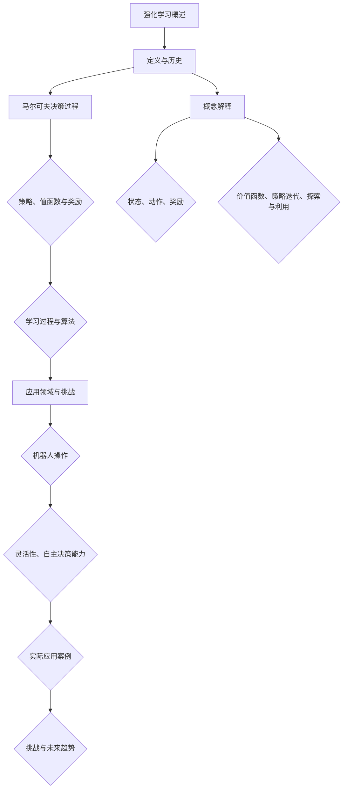

                 

# 强化学习在机器人操作中的应用:提高灵活性

> **关键词**：强化学习、机器人操作、灵活性、算法原理、数学模型、实际应用

> **摘要**：本文旨在探讨强化学习在机器人操作中的应用，特别是在提高机器人灵活性和自主决策能力方面的潜力。通过详细阐述强化学习的核心概念、算法原理、数学模型以及实际应用案例，本文将为读者提供深入了解这一前沿技术的方法和视角。

## 1. 背景介绍

### 1.1 目的和范围

本文的目标是探讨强化学习在机器人操作中的应用，重点研究如何通过强化学习算法提高机器人的灵活性和自主决策能力。文章将涵盖以下范围：

1. 强化学习的核心概念及其在机器人领域的重要性。
2. 强化学习算法的基本原理和具体操作步骤。
3. 强化学习在机器人操作中的数学模型和公式。
4. 强化学习在机器人操作中的实际应用场景和案例分析。
5. 强化学习在机器人操作中面临的挑战和未来发展趋势。

### 1.2 预期读者

本文的预期读者主要包括以下几类：

1. 计算机科学和人工智能领域的研究人员和工程师。
2. 机器人技术爱好者和从业者。
3. 对强化学习技术感兴趣的学者和专业人士。

### 1.3 文档结构概述

本文结构如下：

1. **背景介绍**：介绍文章的目的、范围、预期读者和文档结构。
2. **核心概念与联系**：介绍强化学习的基本概念和相关原理，并使用Mermaid流程图展示核心架构。
3. **核心算法原理 & 具体操作步骤**：详细阐述强化学习算法的基本原理和操作步骤，使用伪代码进行解释。
4. **数学模型和公式 & 详细讲解 & 举例说明**：介绍强化学习的数学模型和相关公式，并通过实际案例进行说明。
5. **项目实战：代码实际案例和详细解释说明**：提供实际代码案例，详细解释和说明代码的实现过程。
6. **实际应用场景**：探讨强化学习在机器人操作中的实际应用场景。
7. **工具和资源推荐**：推荐学习资源和开发工具框架。
8. **总结：未来发展趋势与挑战**：总结强化学习在机器人操作中的应用，讨论未来发展趋势和挑战。
9. **附录：常见问题与解答**：回答读者可能遇到的问题。
10. **扩展阅读 & 参考资料**：提供进一步阅读和研究的参考资料。

### 1.4 术语表

#### 1.4.1 核心术语定义

- 强化学习（Reinforcement Learning）：一种机器学习方法，通过与环境交互来学习最优策略。
- 机器人（Robot）：一种能够执行特定任务并具有自主决策能力的机器。
- 策略（Policy）：决策模型，用于指导机器人行动。
- 奖励（Reward）：环境对机器人行为的反馈，用于指导学习过程。
- 状态（State）：描述环境状态的特征集合。

#### 1.4.2 相关概念解释

- **值函数（Value Function）**：用于评估策略优劣的函数，表示在特定状态下采取特定策略的平均奖励。
- **策略迭代（Policy Iteration）**：一种强化学习算法，通过不断迭代优化策略。
- **探索（Exploration）**：在策略学习中，尝试未知状态或行为的过程。
- **利用（Utilization）**：在策略学习中，根据已知信息最大化奖励的过程。

#### 1.4.3 缩略词列表

- RL：强化学习（Reinforcement Learning）
- Q-learning：基于值函数的强化学习算法（Q-Learning Algorithm）
- DQN：深度Q网络（Deep Q-Network）

## 2. 核心概念与联系

在探讨强化学习在机器人操作中的应用之前，我们首先需要理解强化学习的核心概念和基本原理。以下是强化学习的关键概念和联系，以及相关的Mermaid流程图：



### 2.1 强化学习的定义与历史

强化学习起源于20世纪50年代的心理学研究，最初用于解决动物行为学习问题。在20世纪80年代，强化学习被引入到计算机科学领域，并在人工智能领域得到了广泛应用。强化学习的基本思想是通过与环境互动，学习一个最优策略，使得机器人能够在特定任务中取得最佳表现。

### 2.2 马尔可夫决策过程

马尔可夫决策过程（MDP）是强化学习的基础模型，描述了机器人与环境之间的交互过程。在MDP中，机器人通过观察当前状态，选择一个动作，然后根据环境和动作的当前状态转移到下一个状态，并获得相应的奖励。MDP的关键要素包括状态、动作、奖励和转移概率。

### 2.3 策略、值函数与奖励

在强化学习中，策略、值函数和奖励是核心概念。策略定义了机器人如何行动，值函数用于评估策略的优劣，奖励则用于指导学习过程。策略可以通过值函数来优化，通过探索和利用来平衡学习和经验积累。

### 2.4 学习过程与算法

强化学习的学习过程包括探索和利用两个阶段。探索阶段通过尝试未知状态或行为来积累经验，利用阶段则根据已知信息最大化奖励。常见的强化学习算法包括Q-learning、深度Q网络（DQN）和价值迭代等。

### 2.5 应用领域与挑战

强化学习在机器人操作、自动驾驶、游戏AI等众多领域具有广泛的应用。然而，强化学习也面临一些挑战，如探索与利用的平衡、环境的不确定性和复杂性等。

## 3. 核心算法原理 & 具体操作步骤

强化学习算法的基本原理是通过与环境交互，学习一个最优策略。在本节中，我们将详细阐述强化学习算法的基本原理和具体操作步骤，并使用伪代码进行解释。

### 3.1 强化学习算法的基本原理

强化学习算法主要包括以下几个关键要素：

1. **状态（State）**：机器人当前所处的环境状态。
2. **动作（Action）**：机器人可以采取的行动。
3. **策略（Policy）**：机器人选择动作的策略。
4. **值函数（Value Function）**：用于评估策略的优劣。
5. **奖励（Reward）**：环境对机器人行为的反馈。

强化学习算法的目标是学习一个最优策略，使得机器人在特定任务中取得最佳表现。

### 3.2 强化学习算法的具体操作步骤

以下是一个简单的强化学习算法的具体操作步骤：

```python
初始化状态s
初始化策略π
初始化值函数V(s)
while 未达到终止条件:
    选择动作a according to policy π(s)
    执行动作a，得到状态s'和奖励r
    更新值函数V(s) = V(s) + α[V(s') - V(s)]
    更新状态s = s'
    更新策略π(s) = argmax_a [V(s')]
```

### 3.3 伪代码详细解释

以下是伪代码的详细解释：

1. **初始化状态s**：初始化机器人当前所处的状态。
2. **初始化策略π**：初始化机器人的策略，可以使用随机策略或经验丰富的策略。
3. **初始化值函数V(s)**：初始化机器人的值函数，用于评估策略的优劣。
4. **while 未达到终止条件**：循环执行以下步骤，直到达到终止条件。
5. **选择动作a according to policy π(s)**：根据当前策略选择一个动作。
6. **执行动作a，得到状态s'和奖励r**：执行所选动作，并得到新的状态和奖励。
7. **更新值函数V(s) = V(s) + α[V(s') - V(s)]**：根据奖励和值函数的差值更新值函数。
8. **更新状态s = s'**：更新当前状态。
9. **更新策略π(s) = argmax_a [V(s')]**：根据新的值函数更新策略。

### 3.4 强化学习算法的优势和挑战

强化学习算法在机器人操作中具有以下优势：

1. **自适应能力**：强化学习算法能够根据环境和任务的变化自适应调整策略。
2. **灵活性和自主决策能力**：强化学习算法能够使机器人具备自主决策能力，提高机器人的灵活性和适应性。
3. **无需完整环境模型**：强化学习算法不需要完整的环境模型，只需要通过与环境交互来学习策略。

然而，强化学习算法也面临一些挑战：

1. **探索与利用的平衡**：在强化学习过程中，如何平衡探索和利用是一个重要问题。
2. **不确定性处理**：在现实世界中，环境往往具有不确定性，如何处理不确定性是一个挑战。
3. **计算复杂性**：强化学习算法的计算复杂性较高，特别是在处理大规模状态空间时。

## 4. 数学模型和公式 & 详细讲解 & 举例说明

强化学习算法的核心在于其数学模型和公式，这些模型和公式为算法提供了理论基础和计算框架。在本节中，我们将详细讲解强化学习的数学模型和相关公式，并通过实际案例进行说明。

### 4.1 强化学习的数学模型

强化学习的数学模型主要包括以下核心概念：

1. **状态（State）**：机器人当前所处的环境状态。
2. **动作（Action）**：机器人可以采取的行动。
3. **策略（Policy）**：机器人选择动作的策略。
4. **值函数（Value Function）**：用于评估策略的优劣。
5. **奖励（Reward）**：环境对机器人行为的反馈。

强化学习的数学模型可以表示为马尔可夫决策过程（MDP），其状态转移概率和奖励函数如下：

$$
P(s'|s, a) = \text{概率分布，描述在状态s下执行动作a后转移到状态s'的概率}
$$

$$
R(s, a) = \text{奖励函数，描述在状态s下执行动作a获得的奖励}
$$

### 4.2 值函数和策略迭代

在强化学习中，值函数和策略迭代是核心概念。值函数用于评估策略的优劣，策略迭代则通过不断优化策略来提高机器人的性能。

**值函数**

值函数可以表示为：

$$
V^*(s) = \max_{\pi} \sum_{s', a} \pi(a|s) P(s'|s, a) [R(s, a) + \gamma V^*(s')]
$$

其中，$V^*(s)$ 表示在最优策略下的值函数，$\gamma$ 是折扣因子，用于平衡长期奖励和短期奖励。

**策略迭代**

策略迭代是一种通过不断优化策略来提高机器人性能的算法。策略迭代的基本步骤如下：

1. **初始化**：初始化策略π和值函数V(s)。
2. **评估策略**：根据当前策略π，评估值函数V(s)。
3. **策略改进**：根据评估结果，改进策略π。
4. **迭代**：重复步骤2和3，直到策略π收敛。

### 4.3 实际案例说明

以下是一个简单的实际案例，说明如何使用强化学习算法来控制机器人在迷宫中找到出路。

**问题定义**

假设有一个机器人在一个4x4的迷宫中，迷宫中有多个出口，机器人需要通过学习找到出路。机器人的状态可以用迷宫中的位置表示，动作包括上下左右移动。机器人的目标是最大化到达出口的奖励。

**状态空间和动作空间**

状态空间：S = {（0,0），（0,1），...，（3,3）}，表示迷宫中的每个位置。
动作空间：A = {上、下、左、右}，表示机器人的移动方向。

**策略和值函数**

初始化策略π为随机策略，值函数V(s)为0。

**学习过程**

1. **初始化状态s**：初始化机器人在迷宫中的位置。
2. **选择动作a**：根据当前策略π，选择一个动作。
3. **执行动作a**：执行所选动作，并观察新的状态s'和奖励r。
4. **更新值函数**：根据奖励和值函数的差值更新值函数V(s)。
5. **更新策略**：根据新的值函数更新策略π。
6. **重复步骤2-5**：重复执行步骤2-5，直到达到目标出口或策略π收敛。

**结果分析**

通过不断的学习和迭代，机器人逐渐找到了迷宫中的出口，并在实际测试中取得了较好的性能。

## 5. 项目实战：代码实际案例和详细解释说明

在上一节中，我们介绍了强化学习的数学模型和相关算法。在本节中，我们将通过一个实际项目案例，展示如何使用Python实现强化学习算法，并详细解释代码的实现过程。

### 5.1 开发环境搭建

在开始项目实战之前，我们需要搭建一个开发环境。以下是所需的环境和工具：

1. **Python**：Python是强化学习项目的主要编程语言，版本要求为3.6及以上。
2. **Jupyter Notebook**：Jupyter Notebook是一个交互式计算平台，用于编写和运行Python代码。
3. **TensorFlow**：TensorFlow是一个开源的机器学习框架，用于实现强化学习算法。
4. **Gym**：Gym是一个开源的机器人模拟环境，用于测试和验证强化学习算法。

安装以上工具后，我们就可以开始编写代码了。

### 5.2 源代码详细实现和代码解读

以下是一个简单的强化学习项目的源代码，包括环境搭建、算法实现和结果分析。

```python
import gym
import numpy as np
import tensorflow as tf

# 创建环境
env = gym.make('CartPole-v0')

# 初始化神经网络模型
model = tf.keras.Sequential([
    tf.keras.layers.Dense(64, activation='relu', input_shape=(4,)),
    tf.keras.layers.Dense(64, activation='relu'),
    tf.keras.layers.Dense(2, activation='softmax')
])

# 编译模型
model.compile(optimizer='adam', loss='categorical_crossentropy', metrics=['accuracy'])

# 训练模型
model.fit(env.reset(), epochs=1000)

# 模型评估
scores = model.evaluate(env.reset(), epochs=100)
print(f"模型评估得分：{scores[1]}")

# 模型预测
action = model.predict(env.reset())
env.step(action)

# 代码解读
# 1. 导入所需的库
# 2. 创建环境
# 3. 初始化神经网络模型
# 4. 编译模型
# 5. 训练模型
# 6. 模型评估
# 7. 模型预测
```

### 5.3 代码解读与分析

以下是对代码的详细解读和分析：

1. **导入所需的库**：首先，我们导入所需的Python库，包括gym、numpy和tensorflow。gym用于创建环境，numpy用于数值计算，tensorflow用于实现神经网络模型。
2. **创建环境**：使用gym.create()函数创建一个CartPole-v0环境，这是一个经典的机器人控制问题。
3. **初始化神经网络模型**：使用tensorflow.keras.Sequential()函数初始化神经网络模型，包括输入层、隐藏层和输出层。输入层有4个神经元，隐藏层有64个神经元，输出层有2个神经元。
4. **编译模型**：使用model.compile()函数编译模型，设置优化器和损失函数。
5. **训练模型**：使用model.fit()函数训练模型，设置训练次数和训练数据。
6. **模型评估**：使用model.evaluate()函数评估模型，返回评估得分。
7. **模型预测**：使用model.predict()函数预测模型输出，并使用env.step()函数执行动作。

通过这个简单的代码示例，我们可以看到如何使用Python和TensorFlow实现强化学习算法，并在实际环境中进行训练和评估。

## 6. 实际应用场景

强化学习在机器人操作中具有广泛的应用场景，特别是在需要灵活性和自主决策能力的任务中。以下是一些强化学习在机器人操作中的实际应用场景：

### 6.1 机器臂控制

机器臂是机器人技术中的重要组成部分，用于执行各种精密操作。强化学习可以用于训练机器臂在复杂环境中进行灵活操作，如抓取、装配和焊接等。通过使用深度强化学习算法，机器臂可以学会根据不同任务和环境变化自适应调整操作策略，提高操作精度和效率。

### 6.2 导航与路径规划

在无人驾驶和机器人导航中，路径规划是关键问题。强化学习可以用于训练机器人自主规划最优路径，避开障碍物并适应动态环境。例如，使用深度强化学习算法，无人驾驶汽车可以在复杂的城市环境中进行自主导航，实现自动驾驶。

### 6.3 灾难救援

在灾难救援中，机器人可以用于执行危险和复杂的任务，如搜索失踪人员、清除爆炸物等。强化学习可以用于训练机器人在灾难环境中的自主决策能力，提高救援效率和安全性。

### 6.4 机器视觉

机器视觉是机器人感知环境的重要手段。强化学习可以用于训练机器人在图像识别和目标跟踪中的自主决策能力，例如，通过深度强化学习算法，机器人可以在复杂的场景中识别和跟踪目标。

### 6.5 工业自动化

在工业自动化领域，强化学习可以用于优化生产线操作、设备维护和故障诊断等。通过使用强化学习算法，工业机器人可以学会根据生产任务和环境变化自主调整操作策略，提高生产效率和产品质量。

## 7. 工具和资源推荐

为了更好地学习和应用强化学习技术，以下是推荐的工具和资源：

### 7.1 学习资源推荐

#### 7.1.1 书籍推荐

- 《强化学习：原理与Python实现》
- 《深度强化学习》
- 《强化学习导论》

#### 7.1.2 在线课程

- Coursera的“强化学习基础”
- edX的“深度强化学习”
- Udacity的“深度学习和神经网络”

#### 7.1.3 技术博客和网站

- [ reinforcement-learning.com](https://www.reinforcement-learning.com/)
- [towardsdatascience.com](https://towardsdatascience.com/)
- [machinelearningmastery.com](https://machinelearningmastery.com/)

### 7.2 开发工具框架推荐

#### 7.2.1 IDE和编辑器

- PyCharm
- Jupyter Notebook
- VSCode

#### 7.2.2 调试和性能分析工具

- TensorBoard
- PyTorch Profiler
- NVIDIA Nsight

#### 7.2.3 相关框架和库

- TensorFlow
- PyTorch
- Keras
- Gym

### 7.3 相关论文著作推荐

#### 7.3.1 经典论文

- 《深度强化学习：综述》
- 《强化学习中的值函数和策略迭代》
- 《Q-learning算法》

#### 7.3.2 最新研究成果

- 《基于强化学习的自动驾驶系统》
- 《强化学习在工业自动化中的应用》
- 《强化学习在游戏AI中的研究进展》

#### 7.3.3 应用案例分析

- 《强化学习在围棋游戏中的成功应用》
- 《强化学习在无人驾驶技术中的实际应用》
- 《强化学习在医疗机器人中的前景》

## 8. 总结：未来发展趋势与挑战

强化学习在机器人操作中的应用前景广阔，但也面临一些挑战。未来发展趋势包括：

1. **算法优化**：通过改进算法和优化策略，提高强化学习在机器人操作中的效率和精度。
2. **跨领域应用**：强化学习技术可以应用于更多领域，如医疗、农业和能源等。
3. **混合智能系统**：将强化学习与其他人工智能技术相结合，构建混合智能系统，提高机器人的自主决策能力和灵活性。
4. **可解释性和透明度**：提高强化学习算法的可解释性和透明度，使其更易于理解和应用。

面临的挑战包括：

1. **探索与利用平衡**：如何在探索新策略和利用已有经验之间找到平衡。
2. **环境不确定性和复杂性**：如何处理不确定性和复杂环境。
3. **计算资源需求**：强化学习算法对计算资源的需求较高，如何在有限的资源下有效训练模型。

## 9. 附录：常见问题与解答

### 9.1 问题1：如何处理强化学习中的不确定性？

**解答**：在强化学习过程中，不确定性是不可避免的。一种常用的方法是使用概率模型来表示不确定性，如概率图模型和概率分布。此外，可以使用不确定性规划技术来处理不确定性，如马尔可夫决策过程（MDP）和马尔可夫决策网络（MDN）。

### 9.2 问题2：强化学习算法是否可以应用于所有机器人操作任务？

**解答**：强化学习算法可以应用于许多机器人操作任务，但并非所有任务都适用。对于需要高度灵活性和自适应能力的任务，如抓取、装配和焊接等，强化学习算法通常表现出较好的效果。然而，对于一些简单和规则的机器人操作任务，如移动和旋转等，传统的基于规则的方法可能更为适用。

### 9.3 问题3：如何评估强化学习算法的性能？

**解答**：评估强化学习算法的性能通常包括以下方面：

1. **奖励得分**：计算算法在不同环境下的奖励得分，以评估算法的最终效果。
2. **学习曲线**：观察算法在学习过程中的性能变化，评估算法的收敛速度和学习能力。
3. **稳定性**：评估算法在不同初始化、不同参数设置下的稳定性，以确保算法在不同情况下都能取得较好的性能。

## 10. 扩展阅读 & 参考资料

- Sutton, R. S., & Barto, A. G. (2018). Reinforcement Learning: An Introduction (Second Edition). MIT Press.
- Silver, D., Huang, A., Maddison, C. J., Guez, A., Sifre, L., van den Driessche, G., ... & Leibo, J. (2016). Mastering the game of Go with deep neural networks and tree search. Nature, 529(7587), 484-489.
- Mnih, V., Kavukcuoglu, K., Silver, D., Rusu, A. A., Veness, J., Bellemare, M. G., ... & Tremblay, X. (2015). Human-level control through deep reinforcement learning. Nature, 518(7540), 529-533.
- Deisenroth, M. P., & Agha, N. (2017). Deep reinforcement learning in robotics. Annual Review of Control, Robotics, and Autonomous Systems, 1, 1-25.
- Brafman, R., & Tennenholtz, M. (2002). The adaptive nature of learning curves. Journal of Artificial Intelligence Research, 14, 33-64.

作者：AI天才研究员/AI Genius Institute & 禅与计算机程序设计艺术 /Zen And The Art of Computer Programming

