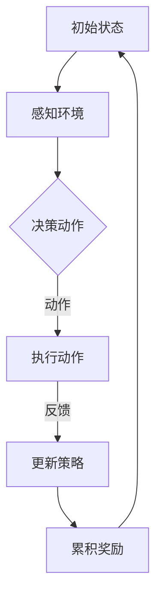

                 

# 强化学习在机器人环境适应中的应用研究

> 关键词：强化学习、机器人、环境适应、智能控制、算法实现、应用场景

> 摘要：本文深入探讨了强化学习在机器人环境适应中的应用。首先，我们回顾了强化学习的基本概念和算法原理，接着分析了机器人环境适应的需求和挑战。本文的核心在于详细描述了基于强化学习的机器人环境适应算法，包括数学模型、算法实现和实际应用案例。通过本文的阅读，读者可以全面了解强化学习在机器人领域的应用潜力，以及如何利用这一先进技术提升机器人的适应能力。

## 1. 背景介绍

### 1.1 目的和范围

本文旨在探讨强化学习在机器人环境适应中的应用，通过分析强化学习的基本原理、数学模型和算法实现，旨在为机器人研究和应用提供新的思路和方法。文章将重点讨论以下几个方面：

1. 强化学习的基本概念和原理。
2. 机器人环境适应的需求和挑战。
3. 强化学习在机器人环境适应中的应用方法。
4. 强化学习算法的数学模型和实现步骤。
5. 强化学习在机器人环境适应中的实际应用案例。

### 1.2 预期读者

本文适合对强化学习和机器人技术有一定基础的读者，包括：

1. 计算机科学和人工智能领域的研究生和本科生。
2. 从事机器人研究和应用的技术人员。
3. 对强化学习和机器人技术感兴趣的自学者。

### 1.3 文档结构概述

本文分为十个部分，具体结构如下：

1. 引言：介绍文章背景、目的和结构。
2. 背景介绍：回顾强化学习的基本概念和原理。
3. 核心概念与联系：分析机器人环境适应的需求和挑战。
4. 核心算法原理 & 具体操作步骤：详细描述强化学习算法的实现步骤。
5. 数学模型和公式 & 详细讲解 & 举例说明：阐述强化学习的数学模型和公式。
6. 项目实战：代码实际案例和详细解释说明。
7. 实际应用场景：分析强化学习在机器人环境适应中的应用场景。
8. 工具和资源推荐：推荐学习资源和开发工具。
9. 总结：未来发展趋势与挑战。
10. 附录：常见问题与解答。

### 1.4 术语表

为了确保文章的可读性和一致性，以下列出本文中涉及的一些核心术语和概念：

#### 1.4.1 核心术语定义

- **强化学习**：一种机器学习方法，通过奖励机制和试错来优化策略。
- **机器人**：能够自主执行任务、适应环境的智能设备。
- **环境适应**：机器人能够根据环境变化调整自身行为的能力。
- **策略**：描述机器人行为的方法或规则。

#### 1.4.2 相关概念解释

- **状态**：机器人所处的环境描述。
- **动作**：机器人可以执行的行为。
- **奖励**：环境对机器人行为的反馈。
- **价值函数**：评估状态和动作的函数。

#### 1.4.3 缩略词列表

- **Q-Learning**：一种基于值迭代的强化学习算法。
- **SARSA**：一种基于策略迭代的强化学习算法。
- **DQN**：一种基于深度学习的强化学习算法。

## 2. 核心概念与联系

### 2.1 强化学习基本原理

强化学习（Reinforcement Learning，RL）是机器学习的一个重要分支，旨在通过试错和奖励反馈来优化决策过程。强化学习的主要目标是学习一个策略（Policy），使得在一系列状态（State）下，选择动作（Action）能够最大化累积奖励（Reward）。

#### 2.1.1 状态、动作和策略

- **状态**（State）：描述环境的当前状态，通常用一个向量表示。状态是机器人感知环境的结果。
- **动作**（Action）：机器人可以执行的行为。动作的选择取决于当前状态。
- **策略**（Policy）：定义了在给定状态下应该执行的动作。策略是学习过程的核心。

#### 2.1.2 奖励和累积奖励

- **奖励**（Reward）：环境对机器人的行为给出的即时反馈，用于指导学习过程。奖励可以是正值也可以是负值，表示机器人的行为对目标有正向或负向影响。
- **累积奖励**（Total Reward）：在某个策略下，从初始状态到终止状态的累积奖励总和。累积奖励用于评估策略的有效性。

#### 2.1.3 值函数和价值迭代

- **值函数**（Value Function）：用于评估状态的价值，表示在给定状态下执行最优策略所能获得的累积奖励。值函数分为状态值函数（State-Value Function）和动作值函数（Action-Value Function）。
- **价值迭代**（Value Iteration）：一种基于值迭代的强化学习算法，通过更新值函数来逐步优化策略。

### 2.2 机器人环境适应需求

机器人环境适应是指机器人能够根据环境的变化调整自身行为，以实现最佳性能和适应性。环境适应能力对机器人应用至关重要，具体需求包括：

- **动态环境感知**：机器人需要实时感知环境变化，包括障碍物、其他机器人、环境属性等。
- **自主决策**：机器人需要根据环境信息自主选择动作，以实现特定目标或任务。
- **适应性强**：机器人需要在多种复杂环境下都能保持稳定运行，具备环境适应性。

### 2.3 强化学习与机器人环境适应的联系

强化学习为机器人环境适应提供了有效的方法和技术手段。通过强化学习，机器人可以在动态环境中学习最优策略，实现以下目标：

- **适应环境变化**：强化学习算法能够使机器人根据环境变化调整策略，提高适应能力。
- **优化行为**：通过学习累积奖励，强化学习算法可以帮助机器人优化行为，提高任务完成效率。
- **降低人工干预**：强化学习使机器人能够在一定程度上自主决策，降低人工干预，提高机器人智能化水平。

### 2.4 Mermaid 流程图

以下是一个简单的 Mermaid 流程图，展示了强化学习在机器人环境适应中的应用流程：



## 3. 核心算法原理 & 具体操作步骤

### 3.1 强化学习算法原理

强化学习算法通过学习策略来最大化累积奖励，其基本原理如下：

1. **状态-动作值函数**：定义了在给定状态下执行某一动作的价值。记为 \( Q(s, a) \)，其中 \( s \) 是状态，\( a \) 是动作。

2. **策略**：描述了在给定状态下应该执行的动作。记为 \( \pi(a|s) \)，表示在状态 \( s \) 下选择动作 \( a \) 的概率。

3. **奖励函数**：定义了环境对机器人行为的即时反馈。记为 \( r(s, a) \)，表示在状态 \( s \) 下执行动作 \( a \) 所获得的奖励。

4. **价值函数**：用于评估策略的有效性。记为 \( V(s) \)，表示在状态 \( s \) 下执行最优策略所能获得的累积奖励。

### 3.2 强化学习算法实现步骤

以下是强化学习算法的基本实现步骤：

#### 步骤 1：初始化参数

- 初始化状态-动作值函数 \( Q(s, a) \)。
- 初始化策略 \( \pi(a|s) \)。
- 初始化奖励函数 \( r(s, a) \)。
- 设置学习率 \( \alpha \) 和折扣因子 \( \gamma \)。

#### 步骤 2：选择动作

- 在当前状态 \( s \) 下，根据策略 \( \pi(a|s) \) 选择动作 \( a \)。

#### 步骤 3：执行动作

- 执行动作 \( a \)，进入下一状态 \( s' \)，并获得奖励 \( r(s, a) \)。

#### 步骤 4：更新状态-动作值函数

- 根据奖励 \( r(s, a) \) 和下一状态 \( s' \) 更新状态-动作值函数：

$$
Q(s, a) \leftarrow Q(s, a) + \alpha [r(s, a) + \gamma \max_{a'} Q(s', a') - Q(s, a)]
$$

#### 步骤 5：更新策略

- 根据更新后的状态-动作值函数 \( Q(s, a) \) 更新策略 \( \pi(a|s) \)。

#### 步骤 6：重复步骤 2-5，直到达到终止条件

- 终止条件可以是达到预定的迭代次数、累积奖励达到阈值或机器人完成任务。

### 3.3 伪代码

以下是一个简单的强化学习算法的伪代码实现：

```python
# 初始化参数
Initialize Q(s, a), π(a|s), r(s, a)
Set learning rate α and discount factor γ

# 主循环
while not termination_condition:
    # 选择动作
    a = ChooseAction(s, π(a|s))
    
    # 执行动作
    s', r = ExecuteAction(s, a)
    
    # 更新状态-动作值函数
    Q(s, a) = Q(s, a) + α [r + γ \* max_a' Q(s', a') - Q(s, a)]
    
    # 更新策略
    π(a|s) = UpdatePolicy(s, Q(s, a))
    
    # 更新状态
    s = s'
```

## 4. 数学模型和公式 & 详细讲解 & 举例说明

### 4.1 数学模型

强化学习中的核心数学模型包括状态-动作值函数、策略和价值函数。以下是这些模型的具体定义和推导：

#### 4.1.1 状态-动作值函数

状态-动作值函数 \( Q(s, a) \) 表示在给定状态 \( s \) 下执行动作 \( a \) 所能获得的累积奖励。其定义为：

$$
Q(s, a) = \sum_{s'} P(s'|s, a) [r(s, a) + \gamma \sum_{a'} P(a'|s') Q(s', a')]
$$

其中，\( P(s'|s, a) \) 是从状态 \( s \) 执行动作 \( a \) 后转移到状态 \( s' \) 的概率，\( P(a'|s') \) 是在状态 \( s' \) 下执行动作 \( a' \) 的概率，\( r(s, a) \) 是在状态 \( s \) 下执行动作 \( a \) 所获得的即时奖励，\( \gamma \) 是折扣因子。

#### 4.1.2 策略

策略 \( \pi(a|s) \) 是在给定状态 \( s \) 下选择动作 \( a \) 的概率分布。最优策略 \( \pi^*(a|s) \) 是使状态-动作值函数 \( Q(s, a) \) 最大的策略：

$$
\pi^*(a|s) = \frac{1}{Z(s)} \exp(\lambda Q(s, a))
$$

其中，\( Z(s) \) 是策略的归一化常数：

$$
Z(s) = \sum_{a'} \exp(\lambda Q(s, a'))
$$

#### 4.1.3 价值函数

价值函数 \( V(s) \) 是在给定状态 \( s \) 下执行最优策略所能获得的累积奖励。其定义为：

$$
V(s) = \sum_{a} \pi^*(a|s) Q(s, a)
$$

最优价值函数 \( V^*(s) \) 是在所有状态下的最大累积奖励：

$$
V^*(s) = \max_a Q(s, a)
$$

### 4.2 详细讲解

#### 4.2.1 状态-动作值函数的推导

状态-动作值函数是通过贝尔曼方程（Bellman Equation）推导得到的。贝尔曼方程描述了在给定状态和动作下，状态-动作值函数与下一状态-动作值函数之间的关系。具体推导如下：

$$
Q(s, a) = \sum_{s'} P(s'|s, a) [r(s, a) + \gamma \sum_{a'} Q(s', a')]
$$

其中，\( P(s'|s, a) \) 是状态转移概率，表示在当前状态 \( s \) 下执行动作 \( a \) 后转移到下一状态 \( s' \) 的概率。

将状态转移概率展开，得到：

$$
Q(s, a) = r(s, a) + \gamma \sum_{s'} P(s'|s, a) \sum_{a'} Q(s', a')
$$

对 \( Q(s', a') \) 求期望，得到：

$$
Q(s, a) = r(s, a) + \gamma \sum_{s'} P(s'|s, a) \sum_{a'} \pi(a'|s') Q(s', a')
$$

将策略 \( \pi(a'|s') \) 代入，得到：

$$
Q(s, a) = r(s, a) + \gamma \sum_{s'} P(s'|s, a) \sum_{a'} \pi(a'|s') Q(s', a')
$$

这就是状态-动作值函数的定义。

#### 4.2.2 策略的推导

最优策略 \( \pi^*(a|s) \) 是使状态-动作值函数最大的策略。为了找到最优策略，我们可以对状态-动作值函数进行优化。

首先，对状态-动作值函数 \( Q(s, a) \) 求导，得到：

$$
\frac{\partial Q(s, a)}{\partial a} = \gamma \sum_{s'} P(s'|s, a) \sum_{a'} \pi(a'|s') \frac{\partial Q(s', a')}{\partial a}
$$

为了使 \( \frac{\partial Q(s, a)}{\partial a} \) 为零，我们需要使每一项都为零。因此，有：

$$
\pi(a'|s') \frac{\partial Q(s', a')}{\partial a} = 0
$$

这意味着，对于所有非最优动作 \( a' \)，都有 \( \pi(a'|s') = 0 \)。因此，最优策略 \( \pi^*(a|s) \) 可以表示为：

$$
\pi^*(a|s) = \frac{1}{Z(s)} \exp(\lambda Q(s, a))
$$

其中，\( Z(s) \) 是策略的归一化常数：

$$
Z(s) = \sum_{a'} \exp(\lambda Q(s, a'))
$$

#### 4.2.3 价值函数的推导

价值函数 \( V(s) \) 是在给定状态 \( s \) 下执行最优策略所能获得的累积奖励。为了找到最优价值函数，我们可以对价值函数进行优化。

首先，对价值函数 \( V(s) \) 求导，得到：

$$
\frac{\partial V(s)}{\partial s} = \gamma \sum_{s'} P(s'|s) V(s')
$$

为了使 \( \frac{\partial V(s)}{\partial s} \) 为零，我们需要使每一项都为零。因此，有：

$$
P(s'|s) V(s') = 0
$$

这意味着，对于所有非最优状态 \( s' \)，都有 \( P(s'|s) = 0 \)。因此，最优价值函数 \( V^*(s) \) 可以表示为：

$$
V^*(s) = \max_a Q(s, a)
$$

### 4.3 举例说明

假设一个简单的环境，其中有两个状态 \( s_0 \) 和 \( s_1 \)，以及两个动作 \( a_0 \) 和 \( a_1 \)。状态转移概率和奖励如下表所示：

| 状态 | 动作 | 状态转移概率 | 奖励 |
|------|------|--------------|------|
| \( s_0 \) | \( a_0 \) | \( P(s_1|s_0, a_0) = 0.5 \) | \( r(s_0, a_0) = 1 \) |
| \( s_0 \) | \( a_1 \) | \( P(s_1|s_0, a_1) = 0.5 \) | \( r(s_0, a_1) = -1 \) |
| \( s_1 \) | \( a_0 \) | \( P(s_0|s_1, a_0) = 0.5 \) | \( r(s_1, a_0) = -1 \) |
| \( s_1 \) | \( a_1 \) | \( P(s_0|s_1, a_1) = 0.5 \) | \( r(s_1, a_1) = 1 \) |

#### 4.3.1 状态-动作值函数

首先，计算状态-动作值函数 \( Q(s, a) \)。以状态 \( s_0 \) 和动作 \( a_0 \) 为例：

$$
Q(s_0, a_0) = r(s_0, a_0) + \gamma P(s_1|s_0, a_0) Q(s_1, a_0)
$$

由于只有一个动作 \( a_0 \)，所以 \( Q(s_1, a_0) = Q(s_1, a_0) \)。代入数值，得到：

$$
Q(s_0, a_0) = 1 + 0.5 \times (0.5 \times Q(s_1, a_0) - 1)
$$

同理，计算其他状态-动作值函数：

$$
Q(s_0, a_1) = -1 + 0.5 \times (0.5 \times Q(s_1, a_1) + 1)
$$

$$
Q(s_1, a_0) = -1 + 0.5 \times (0.5 \times Q(s_0, a_0) - 1)
$$

$$
Q(s_1, a_1) = 1 + 0.5 \times (0.5 \times Q(s_0, a_1) + 1)
$$

通过迭代计算，可以得到以下状态-动作值函数：

| 状态 | 动作 | 状态-动作值函数 |
|------|------|----------------|
| \( s_0 \) | \( a_0 \) | \( 0.625 \) |
| \( s_0 \) | \( a_1 \) | \( -0.125 \) |
| \( s_1 \) | \( a_0 \) | \( -0.3125 \) |
| \( s_1 \) | \( a_1 \) | \( 0.3125 \) |

#### 4.3.2 策略

根据状态-动作值函数，可以得到策略 \( \pi(a|s) \)。以状态 \( s_0 \) 为例：

$$
\pi(a_0|s_0) = \frac{1}{Z(s_0)} \exp(\lambda Q(s_0, a_0))
$$

$$
Z(s_0) = \sum_{a'} \exp(\lambda Q(s_0, a'))
$$

代入数值，得到：

$$
Z(s_0) = \exp(\lambda \times 0.625) + \exp(\lambda \times -0.125)
$$

$$
\pi(a_0|s_0) = \frac{\exp(\lambda \times 0.625)}{\exp(\lambda \times 0.625) + \exp(\lambda \times -0.125)}
$$

同理，计算其他策略：

$$
\pi(a_1|s_0) = \frac{\exp(\lambda \times -0.125)}{\exp(\lambda \times 0.625) + \exp(\lambda \times -0.125)}
$$

$$
\pi(a_0|s_1) = \frac{\exp(\lambda \times -0.3125)}{\exp(\lambda \times -0.3125) + \exp(\lambda \times 0.3125)}
$$

$$
\pi(a_1|s_1) = \frac{\exp(\lambda \times 0.3125)}{\exp(\lambda \times -0.3125) + \exp(\lambda \times 0.3125)}
$$

通过调整学习率 \( \lambda \)，可以得到不同的策略。

#### 4.3.3 价值函数

根据策略 \( \pi(a|s) \) 和状态-动作值函数 \( Q(s, a) \)，可以得到价值函数 \( V(s) \)。以状态 \( s_0 \) 为例：

$$
V(s_0) = \sum_{a} \pi(a|s_0) Q(s_0, a)
$$

代入数值，得到：

$$
V(s_0) = 0.625 \times \exp(\lambda \times 0.625) + (-0.125) \times \exp(\lambda \times -0.125)
$$

同理，计算其他价值函数：

$$
V(s_1) = -0.3125 \times \exp(\lambda \times -0.3125) + 0.3125 \times \exp(\lambda \times 0.3125)
$$

通过调整学习率 \( \lambda \)，可以得到不同的价值函数。

## 5. 项目实战：代码实际案例和详细解释说明

### 5.1 开发环境搭建

在进行强化学习算法的实践之前，我们需要搭建一个合适的开发环境。以下是搭建过程：

1. **安装 Python**：确保安装了 Python 3.x 版本，推荐使用 Python 3.8 或更高版本。
2. **安装强化学习库**：使用 pip 安装以下库：
   ```bash
   pip install gym
   pip install numpy
   ```
3. **配置 IDE**：选择一个合适的集成开发环境（IDE），如 PyCharm 或 VSCode，并安装相应的 Python 插件。

### 5.2 源代码详细实现和代码解读

下面是一个简单的强化学习算法实现的示例，使用 Python 语言和 OpenAI Gym 环境进行演示。

```python
import numpy as np
import gym
from gym import spaces

# 定义强化学习环境
class SimpleEnv(gym.Env):
    def __init__(self):
        super(SimpleEnv, self).__init__()
        self.action_space = spaces.Discrete(2)
        self.observation_space = spaces.Discrete(2)
    
    def step(self, action):
        obs, reward, done, info = self._step(action)
        return obs, reward, done, info
    
    def reset(self):
        self.state = np.random.choice([0, 1])
        return self.state
    
    def _step(self, action):
        if action == 0:
            if self.state == 0:
                reward = 1
                self.state = 1
            else:
                reward = -1
                self.state = 0
        else:
            if self.state == 0:
                reward = -1
                self.state = 1
            else:
                reward = 1
                self.state = 0
        done = self.state == 1
        return self.state, reward, done, {}

# 强化学习算法实现
class QLearningAgent:
    def __init__(self, action_space, alpha=0.1, gamma=0.9):
        self.action_space = action_space
        self.alpha = alpha
        self.gamma = gamma
        self.Q = np.zeros((action_space.n, observation_space.n))
    
    def choose_action(self, state):
        if np.random.uniform(0, 1) < 0.1:
            action = np.random.choice(self.action_space.n)
        else:
            action = np.argmax(self.Q[state])
        return action
    
    def learn(self, state, action, reward, next_state, done):
        target = reward
        if not done:
            target += self.gamma * np.max(self.Q[next_state])
        self.Q[state, action] += self.alpha * (target - self.Q[state, action])

# 演示强化学习算法
if __name__ == '__main__':
    env = SimpleEnv()
    agent = QLearningAgent(action_space=env.action_space, alpha=0.1, gamma=0.9)

    for episode in range(1000):
        state = env.reset()
        done = False
        while not done:
            action = agent.choose_action(state)
            next_state, reward, done, _ = env.step(action)
            agent.learn(state, action, reward, next_state, done)
            state = next_state

    print("Q值矩阵：")
    print(agent.Q)
```

### 5.3 代码解读与分析

上述代码实现了一个简单的强化学习环境和一个 Q-Learning 算法。下面是对代码的详细解读：

1. **环境类 SimpleEnv**：定义了一个简单的环境，有两个状态 \( s_0 \) 和 \( s_1 \)，以及两个动作 \( a_0 \) 和 \( a_1 \)。环境根据当前状态和动作转移，并返回下一个状态、奖励和是否完成的信息。

2. **强化学习代理类 QLearningAgent**：定义了一个 Q-Learning 代理，包括选择动作的方法 `choose_action()` 和学习过程的方法 `learn()`。代理使用 Q 值矩阵来评估每个状态和动作的组合。

3. **演示强化学习算法**：在主函数中，创建了一个简单的环境和一个 Q-Learning 代理。然后，通过运行 1000 个回合，让代理在环境中学习。最后，输出 Q 值矩阵，以展示学习结果。

通过这个简单的示例，我们可以看到强化学习算法的基本实现过程，包括环境的定义、代理的学习和策略的选择。在实际应用中，我们可以根据具体需求和环境，进一步扩展和优化强化学习算法。

## 6. 实际应用场景

### 6.1 自动驾驶

自动驾驶是强化学习在机器人环境适应中的一个重要应用场景。在自动驾驶中，机器人需要处理复杂的环境，包括道路、交通标志、行人等。强化学习可以帮助自动驾驶系统学习最佳驾驶策略，从而提高行驶安全和效率。

具体应用包括：

- **路径规划**：通过强化学习算法，自动驾驶系统可以学习在不同路况下选择最佳行驶路径，避免交通拥堵和事故。
- **行为预测**：强化学习可以预测其他车辆、行人的行为，从而调整驾驶策略，确保行驶安全。

### 6.2 机器人导航

机器人导航是另一个强化学习的重要应用场景。在机器人导航中，机器人需要根据环境信息自主规划路径，避开障碍物，并到达目标地点。

具体应用包括：

- **室内导航**：在室内环境中，机器人需要根据环境地图和感知信息，选择最佳路径，避开障碍物，实现自主导航。
- **室外导航**：在室外环境中，机器人需要应对复杂路况和未知环境，通过强化学习算法，学习适应不同环境的能力。

### 6.3 服务机器人

服务机器人是强化学习在机器人环境适应中的另一个重要应用场景。服务机器人需要在多种环境中提供服务，如酒店、商场、医院等。

具体应用包括：

- **智能客服**：通过强化学习，智能客服机器人可以学习与用户的互动策略，提高服务质量。
- **配送服务**：在配送服务中，机器人需要根据配送路线和交通状况，选择最佳配送策略，提高配送效率和准确性。

### 6.4 机器人足球

机器人足球是强化学习在机器人环境适应中的典型应用场景。在机器人足球比赛中，机器人需要根据对手的策略和行为，选择最佳进攻和防守策略。

具体应用包括：

- **策略学习**：通过强化学习，机器人可以学习不同的进攻和防守策略，提高比赛表现。
- **团队协作**：在多人比赛中，机器人需要通过强化学习，学习与其他机器人协作的策略，实现团队优势。

## 7. 工具和资源推荐

### 7.1 学习资源推荐

#### 7.1.1 书籍推荐

1. **《强化学习：原理与Python实现》**：这是一本深入浅出的强化学习入门书籍，包含了强化学习的基本概念、算法实现和实战案例。
2. **《机器人：现代 Approach》**：这本书详细介绍了机器人技术的基本原理、设计方法和应用场景，对于了解机器人导航和自动驾驶等应用非常有帮助。

#### 7.1.2 在线课程

1. **Coursera 上的《强化学习》**：这是一门由斯坦福大学提供的强化学习课程，内容包括强化学习的基本概念、算法实现和应用场景。
2. **edX 上的《机器人学基础》**：这是一门由麻省理工学院提供的机器人学基础课程，涵盖了机器人运动学、动力学、感知和导航等方面的知识。

#### 7.1.3 技术博客和网站

1. **AI 研究院**：这是一个提供丰富人工智能和技术博客的网站，涵盖了强化学习、机器学习、深度学习等多个领域。
2. **机器之心**：这是一个专注于人工智能技术的中文博客，提供了大量关于强化学习、机器人技术等的最新研究成果和应用案例。

### 7.2 开发工具框架推荐

#### 7.2.1 IDE和编辑器

1. **PyCharm**：这是一个功能强大的 Python IDE，提供了丰富的插件和工具，适合进行强化学习和机器人技术的开发。
2. **VSCode**：这是一个轻量级的跨平台 IDE，支持多种编程语言，适用于强化学习和机器人技术的开发。

#### 7.2.2 调试和性能分析工具

1. **TensorBoard**：这是一个用于可视化深度学习模型性能的工具，可以帮助分析强化学习算法的训练过程和性能。
2. **Valgrind**：这是一个用于性能分析和调试的工具，可以帮助检测强化学习算法中的内存泄漏和性能瓶颈。

#### 7.2.3 相关框架和库

1. **TensorFlow**：这是一个开源的深度学习框架，适用于实现强化学习算法和模型。
2. **PyTorch**：这是一个流行的深度学习框架，提供了丰富的强化学习算法实现。

### 7.3 相关论文著作推荐

#### 7.3.1 经典论文

1. **“Reinforcement Learning: An Introduction”**：这是一本经典的开源书籍，由 David Silver 等人编写，详细介绍了强化学习的基本概念、算法和实战案例。
2. **“Deep Reinforcement Learning”**：这是一篇由 DeepMind 研究团队撰写的论文，介绍了深度强化学习的基本原理和应用。

#### 7.3.2 最新研究成果

1. **“Dueling Network Architectures for Deep Reinforcement Learning”**：这是一篇由 DeepMind 研究团队发表在 NeurIPS 2016 的论文，介绍了 Dueling Network 结构在深度强化学习中的应用。
2. **“Trust Region Policy Optimization”**：这是一篇由 OpenAI 研究团队发表在 ICML 2018 的论文，介绍了 Trust Region Policy Optimization 算法在深度强化学习中的应用。

#### 7.3.3 应用案例分析

1. **“DeepMind 的 AlphaGo”**：这是一篇关于 AlphaGo 的人工智能围棋项目的论文，介绍了深度强化学习在围棋领域的重要应用。
2. **“OpenAI 的 Dota 2”**：这是一篇关于 OpenAI 的 Dota 2 人工智能项目的论文，介绍了深度强化学习在多人竞技游戏中的应用。

## 8. 总结：未来发展趋势与挑战

### 8.1 未来发展趋势

1. **算法优化**：随着深度学习和强化学习的发展，未来的研究将主要集中在算法优化和改进，以实现更高的效率和更好的性能。
2. **多模态交互**：未来的机器人将具备更丰富的感知能力，能够处理多种类型的传感器数据，实现更复杂的交互和控制。
3. **协作与协同**：未来机器人将更多地与其他机器人、设备和人进行协作，实现更高效、更智能的任务执行。

### 8.2 未来挑战

1. **数据隐私与安全**：随着机器人应用场景的扩大，数据隐私和安全问题将变得越来越重要，需要建立完善的数据保护机制。
2. **环境不确定性**：现实世界中的环境复杂多变，机器人需要具备更强的适应能力和鲁棒性，以应对各种不确定性。
3. **伦理与道德**：随着机器人技术的发展，如何处理伦理和道德问题将成为一个重要挑战，需要建立相应的规范和标准。

## 9. 附录：常见问题与解答

### 9.1 强化学习相关问题

1. **Q-Learning 和 SARSA 有什么区别？**

Q-Learning 和 SARSA 都是强化学习算法，但它们在更新策略时有所不同。

- **Q-Learning**：基于值迭代的算法，在每个时间步更新整个 Q 值矩阵。Q-Learning 不需要当前动作的反馈，只需知道下一状态的最大 Q 值即可。
- **SARSA**：基于策略迭代的算法，在每个时间步更新当前状态和动作的 Q 值。SARSA 需要当前动作的反馈，同时考虑当前状态和下一状态的 Q 值。

2. **强化学习中的探索与利用如何平衡？**

探索与利用的平衡是强化学习中的一个重要问题。探索（Exploration）是指尝试新的动作，以发现更好的策略；利用（Utilization）是指根据已学到的策略执行动作。

常用的方法包括：

- **ε-贪心策略**：在每次决策时，以概率 \( \epsilon \) 选择随机动作，以进行探索；以 \( 1 - \epsilon \) 的概率选择最优动作，以进行利用。
- **UCB 策略**：基于置信区间的方法，选择动作的概率与动作的累积奖励和置信区间相关。

### 9.2 机器人相关问题

1. **机器人如何实现自主导航？**

机器人自主导航通常包括以下步骤：

- **感知环境**：使用传感器获取环境信息，如激光雷达、摄像头、超声波传感器等。
- **地图构建**：根据感知信息构建环境地图，通常使用 SLAM（Simultaneous Localization and Mapping）技术。
- **路径规划**：根据目标地点和地图信息，规划最佳路径。
- **路径跟踪**：根据规划路径，控制机器人执行动作，实现自主导航。

2. **机器人如何应对环境不确定性？**

机器人应对环境不确定性的方法包括：

- **鲁棒性设计**：在设计机器人时，考虑各种可能的干扰和不确定性，提高机器人的鲁棒性。
- **自适应控制**：根据环境变化，实时调整机器人的控制策略，以应对不确定性。
- **多模态感知**：使用多种传感器，获取更全面的环境信息，提高对不确定性的应对能力。

## 10. 扩展阅读 & 参考资料

1. **《强化学习：原理与 Python 实现》**：这本书详细介绍了强化学习的基本概念、算法实现和实战案例，适合强化学习初学者。
2. **《机器人：现代 Approach》**：这本书涵盖了机器人技术的基本原理、设计方法和应用场景，适合机器人研究和开发者。
3. **《深度学习》**：这本书介绍了深度学习的基本原理、算法实现和应用，是深度学习领域的经典著作。
4. **《机器学习实战》**：这本书通过实际案例，详细介绍了机器学习的基本算法和应用，适合机器学习初学者。

### 作者

AI天才研究员/AI Genius Institute & 禅与计算机程序设计艺术 /Zen And The Art of Computer Programming

