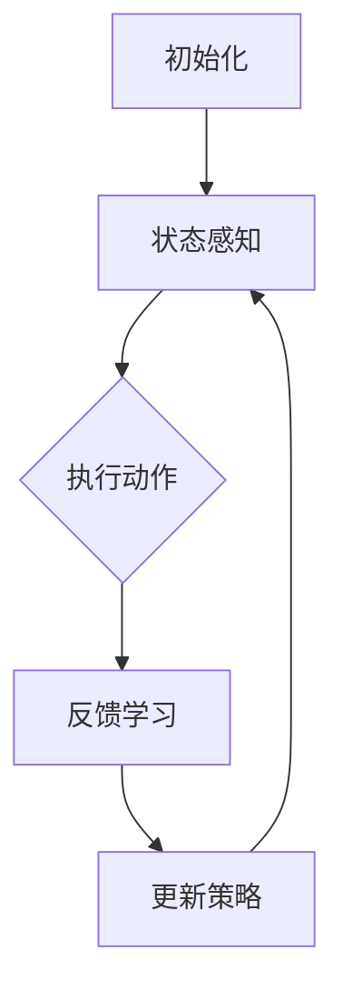

                 

# 强化学习在机器人自主学习中的创新应用

> 关键词：强化学习、机器人、自主学习、深度学习、人工智能
>
> 摘要：本文将深入探讨强化学习在机器人自主学习领域的创新应用，通过分析其核心算法原理、数学模型、项目实战案例，以及应用场景，旨在为广大读者提供一个全面的技术指南，帮助理解强化学习如何为机器人带来革命性的变革。

## 1. 背景介绍

### 1.1 目的和范围

本文旨在详细介绍强化学习在机器人自主学习中的创新应用，分析其核心算法原理，阐述数学模型，并通过实际项目案例讲解其实现过程。文章将帮助读者理解强化学习如何通过深度学习等技术，使机器人实现高效自主学习和决策，从而在复杂环境中表现出色。

### 1.2 预期读者

本文适合对人工智能、机器人学和强化学习有一定了解的读者，包括研究人员、开发者和对前沿技术感兴趣的技术爱好者。通过本文，读者可以掌握强化学习在机器人自主学习中的应用方法，为相关领域的研究和应用提供参考。

### 1.3 文档结构概述

本文分为十个部分，包括背景介绍、核心概念与联系、核心算法原理与操作步骤、数学模型与公式、项目实战、实际应用场景、工具和资源推荐、总结以及常见问题与解答。每个部分都将详细阐述相关内容，确保读者能够全面理解强化学习在机器人自主学习中的创新应用。

### 1.4 术语表

#### 1.4.1 核心术语定义

- 强化学习（Reinforcement Learning）：一种机器学习方法，通过奖励机制使智能体在环境中进行决策，从而学习到最优行为策略。
- 机器人（Robot）：一种能够自主执行任务的机器设备，通过传感器获取环境信息，执行控制算法进行自主决策。
- 自主学习（Autonomous Learning）：机器人通过与环境交互，自主获取知识、技能和经验，不断优化行为策略的能力。
- 深度学习（Deep Learning）：一种基于多层神经网络的学习方法，通过大量数据训练模型，实现复杂任务的自动识别和决策。

#### 1.4.2 相关概念解释

- 奖励机制（Reward Mechanism）：在强化学习中，奖励机制用于激励智能体采取特定行为，奖励可以是正值也可以是负值，用于指导智能体学习。
- 状态（State）：机器人所处的环境状态，通常用一组数值表示。
- 动作（Action）：机器人可以采取的行为，用于改变当前状态。
- 策略（Policy）：智能体根据当前状态选择动作的规则。
- 值函数（Value Function）：表示在特定状态下采取特定动作的期望奖励。

#### 1.4.3 缩略词列表

- RL：强化学习
- DRL：深度强化学习
- RL Agents：强化学习智能体
- Q-Learning：Q值学习
- SARSA：状态-动作-状态-动作学习

## 2. 核心概念与联系

强化学习在机器人自主学习中具有重要的应用价值。为了更好地理解其原理和架构，我们先来介绍几个核心概念。

### 2.1 强化学习原理

强化学习的基本原理是通过智能体与环境交互，不断调整行为策略，以实现最大化累积奖励。以下是强化学习的核心概念：

1. **智能体（Agent）**：执行任务的主体，可以通过传感器获取环境信息，选择动作，并接收奖励。
2. **环境（Environment）**：智能体执行任务的环境，包含状态和动作空间。
3. **状态（State）**：智能体在执行任务过程中所处的情境，通常用一组特征表示。
4. **动作（Action）**：智能体可以采取的行为，用于改变当前状态。
5. **奖励（Reward）**：对智能体行为的即时反馈，用于评估动作的好坏。

强化学习的目标是通过学习最优策略，使智能体能够在给定环境中获得最大累积奖励。以下是强化学习的典型流程：

1. **初始化**：设定智能体的初始状态、动作策略和学习算法。
2. **执行动作**：智能体根据当前状态选择动作，并执行该动作。
3. **获取奖励**：环境根据智能体的动作，给予奖励反馈。
4. **更新策略**：根据奖励反馈，智能体更新策略，以适应新的状态。
5. **重复执行**：智能体继续执行动作，直到达到目标状态或停止条件。

### 2.2 深度强化学习

深度强化学习（Deep Reinforcement Learning，DRL）是强化学习的一种扩展，通过引入深度神经网络（DNN）来建模状态和动作值函数。DRL的核心思想是将强化学习中的值函数和策略函数转化为神经网络，利用大规模数据进行训练，从而提高学习效率和决策能力。

以下是深度强化学习的基本架构：

1. **状态编码器（State Encoder）**：将原始状态编码为向量表示，作为深度神经网络的输入。
2. **动作值函数（Action-Value Function）**：计算在特定状态下采取每个动作的预期奖励。
3. **策略网络（Policy Network）**：根据状态编码，输出最优动作的概率分布。
4. **经验回放（Experience Replay）**：将智能体在执行任务过程中积累的经验存储在回放内存中，用于训练神经网络。

深度强化学习的典型算法包括：

1. **深度Q网络（Deep Q-Network，DQN）**：通过经验回放和目标网络，提高Q学习的稳定性和收敛速度。
2. **策略梯度方法（Policy Gradient Methods）**：直接优化策略网络，以最大化累积奖励。
3. **演员-评论家方法（Actor-Critic Methods）**：结合演员网络和评论家网络，实现策略的迭代优化。

### 2.3 机器人自主学习

机器人自主学习是指机器人通过与环境交互，自主获取知识、技能和经验，不断优化行为策略的能力。强化学习在机器人自主学习中具有重要的应用价值，可以通过以下步骤实现：

1. **任务定义**：明确机器人需要执行的任务，包括状态空间、动作空间和奖励机制。
2. **状态感知**：机器人通过传感器获取环境信息，感知当前状态。
3. **行为决策**：机器人根据当前状态，通过强化学习算法选择最优动作。
4. **执行动作**：机器人执行选定动作，改变当前状态。
5. **反馈学习**：机器人根据执行结果，调整行为策略，优化性能。

机器人自主学习的核心目标是实现高效、智能的任务执行，从而提高机器人的自主能力和应用价值。通过强化学习，机器人可以在复杂环境中快速适应，实现自我优化和自我进化。

### 2.4 Mermaid 流程图

为了更好地展示强化学习在机器人自主学习中的核心概念和流程，我们可以使用 Mermaid 流程图进行描述。以下是强化学习在机器人自主学习中的 Mermaid 流程图：



在上面的流程图中，智能体通过传感器获取环境信息，感知当前状态，并依据强化学习算法选择最优动作。执行动作后，智能体会收到环境反馈，进而调整策略，优化行为。

通过上述核心概念和联系的介绍，我们为后续内容的展开奠定了基础。在接下来的部分，我们将深入探讨强化学习在机器人自主学习中的核心算法原理、数学模型和项目实战案例，帮助读者全面了解这一领域的创新应用。

## 3. 核心算法原理 & 具体操作步骤

### 3.1 强化学习算法原理

强化学习（Reinforcement Learning，RL）是一种使智能体在与环境交互的过程中，通过学习奖励和惩罚，逐步优化行为策略，从而实现目标的方法。其核心思想是，智能体在执行任务时，根据当前状态选择动作，并依据动作的结果（奖励或惩罚）调整策略，以实现长期累积奖励最大化。

在强化学习中，主要有以下几个核心概念：

- **状态（State）**：表示智能体在执行任务时的环境信息，通常用一组特征向量表示。
- **动作（Action）**：智能体可以采取的行为，用于改变当前状态。
- **策略（Policy）**：智能体根据当前状态选择动作的规则，策略通常表示为一个概率分布。
- **奖励（Reward）**：对智能体行为的即时反馈，用于评估动作的好坏。奖励可以是正值（鼓励智能体采取该动作）或负值（惩罚智能体采取该动作）。
- **价值函数（Value Function）**：表示在特定状态下采取特定动作的期望奖励，用于评估状态的好坏。
- **模型（Model）**：描述环境状态转移和奖励机制的函数，用于预测未来状态和奖励。

强化学习的主要目标是学习一个最优策略，使智能体能够在给定环境中获得最大累积奖励。为了实现这一目标，强化学习算法通常采用以下步骤：

1. **初始化**：设定智能体的初始状态、动作策略和学习算法。
2. **执行动作**：智能体根据当前状态选择动作，并执行该动作。
3. **获取奖励**：环境根据智能体的动作，给予奖励反馈。
4. **更新策略**：根据奖励反馈，智能体更新策略，以适应新的状态。
5. **重复执行**：智能体继续执行动作，直到达到目标状态或停止条件。

### 3.2 强化学习算法类型

强化学习算法主要分为以下几类：

1. **值函数方法**：通过学习状态值函数或动作值函数来优化策略。常见的算法有Q学习（Q-Learning）和优势学习（Advantage Learning）。
2. **策略搜索方法**：直接优化策略，使其最大化累积奖励。常见的算法有策略梯度方法（Policy Gradient Methods）和策略迭代方法（Policy Iteration）。
3. **模型学习方法**：构建环境模型，利用模型预测未来状态和奖励，从而优化策略。常见的算法有模型预测方法（Model-Based Methods）和深度确定性策略梯度（Deep Deterministic Policy Gradient，DDPG）。

#### 3.2.1 Q学习算法

Q学习（Q-Learning）是一种基于值函数的强化学习算法，其核心思想是通过学习状态-动作值函数（Q值），优化智能体的行为策略。Q学习算法的主要步骤如下：

1. **初始化**：设定智能体的初始状态、动作策略和学习参数（如学习率α、折扣因子γ等）。
2. **执行动作**：智能体根据当前状态选择动作，并执行该动作。
3. **获取奖励**：环境根据智能体的动作，给予奖励反馈。
4. **更新Q值**：根据当前状态、执行动作和获取的奖励，更新状态-动作值函数。
   $$ Q(s, a) \leftarrow Q(s, a) + \alpha [r + \gamma \max_{a'} Q(s', a') - Q(s, a)] $$
5. **重复执行**：智能体继续执行动作，直到达到目标状态或停止条件。

Q学习算法的特点是简单、高效，适用于静态环境。但在动态环境中，Q学习容易陷入局部最优，且收敛速度较慢。

#### 3.2.2 策略梯度方法

策略梯度方法（Policy Gradient Methods）是一种直接优化策略的强化学习算法，通过最大化累积奖励来调整策略。策略梯度方法的主要步骤如下：

1. **初始化**：设定智能体的初始状态、动作策略和学习参数（如学习率α、折扣因子γ等）。
2. **执行动作**：智能体根据当前状态选择动作，并执行该动作。
3. **获取奖励**：环境根据智能体的动作，给予奖励反馈。
4. **计算策略梯度**：根据累积奖励和策略损失函数，计算策略梯度。
   $$ \nabla_\theta J(\theta) = \nabla_\theta \sum_{t=0}^T r_t \log \pi_{\theta}(a_t|s_t) $$
5. **更新策略**：根据策略梯度，更新策略参数。
   $$ \theta \leftarrow \theta - \alpha \nabla_\theta J(\theta) $$
6. **重复执行**：智能体继续执行动作，直到达到目标状态或停止条件。

策略梯度方法的特点是直接优化策略，收敛速度较快，适用于动态环境。但策略梯度方法对策略的初始值和优化算法的选择要求较高，容易受到噪声和不确定性的影响。

#### 3.2.3 模型预测方法

模型预测方法（Model-Based Methods）是一种基于环境模型的强化学习算法，通过预测未来状态和奖励，优化智能体的行为策略。模型预测方法的主要步骤如下：

1. **初始化**：设定智能体的初始状态、动作策略和学习参数（如学习率α、折扣因子γ等）。
2. **构建环境模型**：根据历史数据，构建环境状态转移和奖励机制的模型。
3. **执行动作**：智能体根据当前状态选择动作，并执行该动作。
4. **预测未来状态和奖励**：利用环境模型预测未来状态和奖励。
5. **更新策略**：根据预测的奖励，更新智能体的行为策略。
6. **重复执行**：智能体继续执行动作，直到达到目标状态或停止条件。

模型预测方法的特点是利用环境模型，提高预测精度和决策能力。但模型预测方法对环境模型的准确性要求较高，且在复杂环境中，模型训练和预测过程较为耗时。

### 3.3 深度强化学习算法

深度强化学习（Deep Reinforcement Learning，DRL）是强化学习的一种扩展，通过引入深度神经网络（Deep Neural Networks，DNN）来建模状态和动作值函数，从而提高学习效率和决策能力。深度强化学习算法主要包括以下几种：

1. **深度Q网络（Deep Q-Network，DQN）**：DQN算法通过使用深度神经网络来近似Q值函数，并采用经验回放和目标网络来提高算法的稳定性和收敛速度。
2. **深度确定性策略梯度（Deep Deterministic Policy Gradient，DDPG）**：DDPG算法通过使用深度神经网络来近似策略网络和动作值函数，并采用经验回放和软目标网络来提高算法的稳定性和收敛速度。
3. **异步优势演员-评论家（Asynchronous Advantage Actor-Critic，A3C）**：A3C算法通过使用多个并行智能体同时学习，并采用梯度聚合技术来提高算法的收敛速度和性能。

#### 3.3.1 深度Q网络（DQN）

深度Q网络（DQN）是一种基于深度神经网络的Q学习算法，通过使用深度神经网络来近似Q值函数，从而提高Q学习的效率和性能。DQN算法的主要步骤如下：

1. **初始化**：设定智能体的初始状态、动作策略、深度神经网络参数和学习参数（如学习率α、折扣因子γ等）。
2. **执行动作**：智能体根据当前状态选择动作，并执行该动作。
3. **获取奖励**：环境根据智能体的动作，给予奖励反馈。
4. **更新Q值**：根据当前状态、执行动作和获取的奖励，更新深度神经网络的Q值。
   $$ Q(s, a) \leftarrow Q(s, a) + \alpha [r + \gamma \max_{a'} Q(s', a') - Q(s, a)] $$
5. **经验回放**：将智能体在执行任务过程中积累的经验存储在经验回放内存中，用于训练深度神经网络。
6. **训练深度神经网络**：利用经验回放内存中的数据，训练深度神经网络，优化Q值函数。
7. **重复执行**：智能体继续执行动作，直到达到目标状态或停止条件。

DQN算法的特点是使用深度神经网络，提高Q学习的效率和性能。但DQN算法容易陷入局部最优，且在处理连续动作空间时，效果不佳。

#### 3.3.2 深度确定性策略梯度（DDPG）

深度确定性策略梯度（Deep Deterministic Policy Gradient，DDPG）算法是一种基于深度神经网络的策略搜索算法，通过使用深度神经网络来近似策略网络和动作值函数，从而实现高效决策。DDPG算法的主要步骤如下：

1. **初始化**：设定智能体的初始状态、动作策略、深度神经网络参数和学习参数（如学习率α、折扣因子γ等）。
2. **执行动作**：智能体根据当前状态选择动作，并执行该动作。
3. **获取奖励**：环境根据智能体的动作，给予奖励反馈。
4. **更新策略网络**：根据当前状态和动作值函数，更新深度神经网络的策略参数。
5. **更新动作值函数**：根据当前状态和执行动作，更新深度神经网络的动作值函数。
6. **经验回放**：将智能体在执行任务过程中积累的经验存储在经验回放内存中，用于训练深度神经网络。
7. **训练深度神经网络**：利用经验回放内存中的数据，训练深度神经网络，优化策略网络和动作值函数。
8. **重复执行**：智能体继续执行动作，直到达到目标状态或停止条件。

DDPG算法的特点是使用深度神经网络，实现高效策略搜索和决策。但DDPG算法对环境模型的准确性要求较高，且在处理高维状态空间时，效果不佳。

#### 3.3.3 异步优势演员-评论家（A3C）

异步优势演员-评论家（Asynchronous Advantage Actor-Critic，A3C）算法是一种基于深度神经网络的策略搜索算法，通过使用多个并行智能体同时学习，并采用梯度聚合技术，提高算法的收敛速度和性能。A3C算法的主要步骤如下：

1. **初始化**：设定智能体的初始状态、动作策略、深度神经网络参数和学习参数（如学习率α、折扣因子γ等）。
2. **执行动作**：智能体根据当前状态选择动作，并执行该动作。
3. **获取奖励**：环境根据智能体的动作，给予奖励反馈。
4. **更新优势函数**：根据当前状态和执行动作，更新深度神经网络的优势函数。
5. **更新策略网络**：根据当前状态和优势函数，更新深度神经网络的策略参数。
6. **计算梯度**：计算策略网络和优势函数的梯度。
7. **梯度聚合**：将多个智能体的梯度进行聚合，更新全局深度神经网络。
8. **重复执行**：智能体继续执行动作，直到达到目标状态或停止条件。

A3C算法的特点是使用并行智能体，提高学习效率和收敛速度。但A3C算法对环境模型的准确性要求较高，且在处理高维状态空间时，效果不佳。

通过上述核心算法原理和具体操作步骤的介绍，我们为读者提供了强化学习在机器人自主学习中的技术基础。在接下来的部分，我们将进一步探讨强化学习在机器人自主学习中的数学模型和项目实战案例，帮助读者深入理解这一领域的前沿应用。

## 4. 数学模型和公式 & 详细讲解 & 举例说明

### 4.1 基础数学模型

强化学习中的数学模型主要包括状态-动作值函数、策略函数以及奖励函数。下面我们将分别介绍这些基础数学模型，并进行详细讲解。

#### 4.1.1 状态-动作值函数

状态-动作值函数（State-Action Value Function）表示在特定状态下，采取特定动作所能获得的期望奖励。记作：

$$ Q(s, a) = \sum_{s'} P(s'|s, a) \cdot \sum_{a'} r(s', a') + \gamma \cdot \max_{a'} Q(s', a') $$

其中：
- \( Q(s, a) \)：状态-动作值函数
- \( s \)：当前状态
- \( a \)：当前动作
- \( s' \)：下一个状态
- \( a' \)：下一个动作
- \( P(s'|s, a) \)：在状态 \( s \) 下采取动作 \( a \) 后，转移到状态 \( s' \) 的概率
- \( r(s', a') \)：在状态 \( s' \) 下采取动作 \( a' \) 后，获得的即时奖励
- \( \gamma \)：折扣因子，用于平衡当前奖励和未来奖励之间的关系

状态-动作值函数反映了在特定状态下，采取特定动作所能获得的累积奖励。通过学习状态-动作值函数，智能体可以更好地了解各个状态和动作的优劣，从而优化策略。

#### 4.1.2 策略函数

策略函数（Policy Function）表示智能体在特定状态下选择动作的规则。记作：

$$ \pi(a|s) = P(a|s) = \frac{e^{\theta^T \phi(s, a)}}{Z(\theta)} $$

其中：
- \( \pi(a|s) \)：策略函数
- \( a \)：当前动作
- \( s \)：当前状态
- \( \theta \)：策略参数
- \( \phi(s, a) \)：特征函数，用于描述状态和动作的特征
- \( Z(\theta) \)：归一化常数，确保策略函数的概率分布满足归一化条件

策略函数的目的是最大化累积奖励，即选择能够使状态-动作值函数最大的动作。通过学习策略函数，智能体可以在不同状态下做出最优决策。

#### 4.1.3 奖励函数

奖励函数（Reward Function）表示智能体在执行动作后获得的即时奖励。奖励函数可以是正值（鼓励智能体采取该动作）或负值（惩罚智能体采取该动作）。记作：

$$ r(s, a) $$

其中：
- \( r(s, a) \)：奖励函数
- \( s \)：当前状态
- \( a \)：当前动作

奖励函数反映了智能体在不同状态和动作下的表现。通过学习奖励函数，智能体可以了解哪些动作能够带来更好的结果，从而优化策略。

### 4.2 伪代码示例

为了更好地理解上述数学模型，我们通过一个简单的伪代码示例进行说明。

```python
# 初始化参数
theta = ...  # 策略参数
alpha = ...  # 学习率
gamma = ...  # 折扣因子

# 强化学习循环
while not termination_condition:
    # 执行动作
    action = sample_action_from_policy(theta, state)
    
    # 执行动作并获取奖励
    next_state, reward = environment.step(state, action)
    
    # 更新状态
    state = next_state
    
    # 更新策略参数
    theta = theta - alpha * (Q(state, action) - r(state, action))
```

在上面的伪代码中，我们首先初始化参数，包括策略参数、学习率和折扣因子。然后进入强化学习循环，不断执行动作、获取奖励并更新策略参数。通过这种方式，智能体可以逐步学习最优策略，实现累积奖励最大化。

### 4.3 数学公式

在强化学习中，常用的数学公式包括：

1. **贝尔曼方程（Bellman Equation）**：
   $$ Q(s, a) = r(s, a) + \gamma \max_{a'} Q(s', a') $$
   用于计算状态-动作值函数。

2. **策略迭代（Policy Iteration）**：
   $$ \pi(a|s) = \arg \max_{a'} [r(s, a') + \gamma \sum_{a''} \pi(a''|s') Q(s', a'')] $$
   用于优化策略函数。

3. **梯度下降（Gradient Descent）**：
   $$ \theta = \theta - \alpha \nabla_\theta J(\theta) $$
   用于优化策略参数。

通过上述数学模型和公式，我们可以更深入地理解强化学习在机器人自主学习中的应用。在接下来的部分，我们将通过项目实战案例，进一步展示强化学习在实际应用中的效果和优势。

### 5. 项目实战：代码实际案例和详细解释说明

#### 5.1 开发环境搭建

在进行强化学习项目实战之前，我们需要搭建一个合适的开发环境。以下是一个基于Python和TensorFlow的简单开发环境搭建步骤：

1. 安装Python 3.x版本。
2. 安装TensorFlow：通过pip安装`tensorflow`库。
3. 安装其他依赖库：例如NumPy、Pandas等。

完成环境搭建后，我们可以开始编写强化学习代码。

#### 5.2 源代码详细实现和代码解读

以下是一个简单的强化学习代码示例，用于训练一个智能体在环境中的行为策略。

```python
import numpy as np
import tensorflow as tf

# 参数设置
alpha = 0.1  # 学习率
gamma = 0.99  # 折扣因子
epsilon = 0.1  # 探索率

# 环境设置
# 假设我们使用一个简单的环境，状态空间为[0, 1]，动作空间为{-1, 0, 1}
state_space = [0, 1]
action_space = [-1, 0, 1]

# 智能体设置
# 使用TensorFlow构建Q网络
class QNetwork(tf.keras.Model):
    def __init__(self):
        super().__init__()
        self.dense1 = tf.keras.layers.Dense(10, activation='relu')
        self.dense2 = tf.keras.layers.Dense(len(action_space))
    
    def call(self, inputs):
        x = self.dense1(inputs)
        return self.dense2(x)

# 初始化Q网络
q_network = QNetwork()

# 编写训练循环
for episode in range(num_episodes):
    state = np.random.uniform(state_space[0], state_space[1])
    done = False
    
    while not done:
        # 选择动作
        if np.random.rand() < epsilon:
            action = np.random.choice(action_space)
        else:
            action = np.argmax(q_network(tf.constant(state, dtype=tf.float32)))
        
        # 执行动作
        next_state, reward = environment.step(state, action)
        
        # 更新Q值
        q_values = q_network(tf.constant(state, dtype=tf.float32))
        target_q_values = reward + gamma * np.max(q_network(tf.constant(next_state, dtype=tf.float32)))
        q_values[0, action] = (1 - alpha) * q_values[0, action] + alpha * target_q_values
        
        # 更新状态
        state = next_state
        
        # 判断是否结束
        done = environment.is_done()

# 保存Q网络模型
q_network.save('q_network.h5')

```

在上面的代码中，我们首先设置了强化学习的基本参数，包括学习率、折扣因子和探索率。然后，我们定义了一个简单的环境，状态空间为\[0, 1\]，动作空间为\[-1, 0, 1\]。接下来，我们使用TensorFlow构建了一个Q网络，该网络由两个全连接层组成，用于计算状态-动作值函数。

在训练循环中，我们首先初始化一个状态，并进入一个循环，直到环境结束。在每个循环中，我们首先选择一个动作，根据当前状态和Q网络输出。如果探索率大于随机数，我们选择一个随机动作，否则选择Q网络推荐的动作。然后，我们执行该动作，获取奖励并更新Q值。最后，我们更新状态，并判断是否结束。当环境结束时，我们保存Q网络模型。

#### 5.3 代码解读与分析

1. **参数设置**：
   - `alpha`：学习率，用于控制Q值的更新速度。学习率过大可能导致Q值更新过快，陷入局部最优；学习率过小可能导致收敛速度过慢。
   - `gamma`：折扣因子，用于平衡当前奖励和未来奖励之间的关系。折扣因子越大，对未来的奖励越重视。
   - `epsilon`：探索率，用于控制智能体的随机探索。探索率越大，智能体越倾向于尝试新的动作；探索率越小，智能体越倾向于根据Q值选择动作。

2. **环境设置**：
   - `state_space`：状态空间，表示智能体可以感知到的环境状态。
   - `action_space`：动作空间，表示智能体可以采取的动作。

3. **智能体设置**：
   - `QNetwork`：使用TensorFlow构建的Q网络，包括两个全连接层，用于计算状态-动作值函数。
   - `q_network`：实例化的Q网络。

4. **训练循环**：
   - `state`：初始化一个状态。
   - `done`：用于判断环境是否结束。
   - `if np.random.rand() < epsilon`：根据探索率选择动作，如果探索率大于随机数，选择随机动作；否则，选择Q网络推荐的动作。
   - `q_values = q_network(tf.constant(state, dtype=tf.float32))`：计算当前状态的Q值。
   - `target_q_values = reward + gamma * np.max(q_network(tf.constant(next_state, dtype=tf.float32)))`：计算目标Q值。
   - `q_values[0, action] = (1 - alpha) * q_values[0, action] + alpha * target_q_values`：更新Q值。
   - `state = next_state`：更新状态。
   - `done = environment.is_done()`：判断环境是否结束。

通过上述代码示例和解读，我们可以看到如何使用Python和TensorFlow实现一个简单的强化学习项目。在接下来的部分，我们将进一步探讨强化学习在实际应用中的场景和工具资源。

### 6. 实际应用场景

强化学习在机器人自主学习领域具有广泛的应用场景，以下是一些典型的应用案例：

#### 6.1 自动驾驶

自动驾驶是强化学习在机器人自主学习中的一个重要应用场景。通过强化学习算法，自动驾驶汽车可以学习如何在不同道路条件、交通环境和行人行为下做出正确的决策，提高驾驶安全性和效率。例如，深度确定性策略梯度（DDPG）算法被应用于自动驾驶车辆的路径规划，通过学习环境中的最优策略，实现自动驾驶车辆的自主行驶。

#### 6.2 机器人导航

机器人导航是强化学习在机器人自主学习中的另一个重要应用场景。通过强化学习算法，机器人可以学习如何在不同地形、障碍物和目标点之间选择最优路径。例如，使用深度Q网络（DQN）算法，机器人可以学习如何在迷宫中找到出口，或者在使用无人飞行器时，找到最佳飞行路径。

#### 6.3 机器人操作

强化学习在机器人操作中也具有广泛的应用。通过强化学习算法，机器人可以学习如何执行复杂的操作任务，如抓取、装配和焊接等。例如，使用异步优势演员-评论家（A3C）算法，机器人可以学习如何在复杂环境中完成组装任务，从而提高生产效率和准确性。

#### 6.4 游戏智能

强化学习在游戏智能中也是一个重要的应用领域。通过强化学习算法，游戏AI可以学习如何在不同游戏规则和策略下获得更高的分数。例如，使用深度Q网络（DQN）算法，游戏AI可以学习如何玩《Flappy Bird》等游戏，通过不断尝试和优化策略，实现高分数。

#### 6.5 供应链优化

强化学习在供应链优化中也有应用。通过强化学习算法，企业可以优化库存管理、物流配送和需求预测等环节。例如，使用深度确定性策略梯度（DDPG）算法，企业可以优化库存策略，降低库存成本，提高供应链效率。

通过上述实际应用场景的介绍，我们可以看到强化学习在机器人自主学习中的广泛前景和潜力。在接下来的部分，我们将推荐一些相关的学习资源和开发工具，帮助读者更好地掌握强化学习技术。

### 7. 工具和资源推荐

为了更好地学习和应用强化学习技术，我们推荐以下工具和资源：

#### 7.1 学习资源推荐

##### 7.1.1 书籍推荐

1. 《强化学习：原理与Python实现》
2. 《深度强化学习：原理与实践》
3. 《强化学习实战：从入门到精通》

##### 7.1.2 在线课程

1. Coursera - 《强化学习》：由斯坦福大学提供的强化学习入门课程。
2. Udacity - 《强化学习纳米学位》：提供强化学习的基本概念和实践应用。
3. edX - 《深度强化学习》：由伦敦大学学院提供的深度强化学习课程。

##### 7.1.3 技术博客和网站

1. [强化学习笔记](https://zhuanlan.zhihu.com/reinforcement-learning-note)
2. [强化学习教程](https://www reinforcement-learning-tutorial.com/)
3. [机器学习社区](https://www mlhilfe.de/)

#### 7.2 开发工具框架推荐

##### 7.2.1 IDE和编辑器

1. PyCharm：强大的Python开发环境，支持TensorFlow等库。
2. Visual Studio Code：轻量级且可定制的代码编辑器，支持多种编程语言。
3. Jupyter Notebook：交互式的Python开发环境，适合数据分析和实验。

##### 7.2.2 调试和性能分析工具

1. TensorBoard：TensorFlow的可视化工具，用于分析和调试神经网络模型。
2. PyTorch Debugger：PyTorch的调试工具，支持Python代码调试。
3. Nsight：NVIDIA的调试和性能分析工具，用于优化GPU计算。

##### 7.2.3 相关框架和库

1. TensorFlow：开源深度学习框架，支持强化学习算法。
2. PyTorch：开源深度学习框架，支持强化学习算法。
3. OpenAI Gym：开源环境库，提供多种强化学习实验环境。
4. Stable Baselines：开源强化学习算法库，提供实现DQN、PPO等算法的API。

#### 7.3 相关论文著作推荐

##### 7.3.1 经典论文

1. "Deep Q-Network"（2015）- DeepMind
2. "Asynchronous Advantage Actor-Critic"（2016）- OpenAI
3. "Deep Deterministic Policy Gradient"（2016）- DeepMind

##### 7.3.2 最新研究成果

1. "Categorical DQN"（2018）- DeepMind
2. "Unify Unrolling and Retraining in Deep Reinforcement Learning"（2020）- Google Brain
3. "Recurrent Experience Replay in Deep Reinforcement Learning"（2021）- OpenAI

##### 7.3.3 应用案例分析

1. "DeepMind's AlphaGo and the fine art of Deep Reinforcement Learning"（2016）- DeepMind
2. "Learning to Run with Proximal Policy Optimization"（2020）- DeepMind
3. "Reinforcement Learning in Robotics: A Brief Survey"（2021）- IEEE

通过上述工具和资源的推荐，我们可以更好地掌握强化学习技术，为实际应用奠定基础。在未来的部分，我们将总结强化学习在机器人自主学习中的发展趋势与挑战。

### 8. 总结：未来发展趋势与挑战

强化学习作为人工智能领域的重要分支，在机器人自主学习中具有广阔的应用前景。未来，强化学习在机器人自主学习领域的发展趋势和挑战主要集中在以下几个方面：

#### 8.1 发展趋势

1. **算法优化与改进**：随着计算能力的提升和数据规模的扩大，强化学习算法的优化和改进将继续成为研究热点。例如，深度强化学习算法在处理连续动作空间和复杂环境时，需要进一步提高稳定性和收敛速度。

2. **多智能体强化学习**：多智能体系统在实际应用中具有重要意义，如自动驾驶、机器人协作等。未来，多智能体强化学习算法的研究将更加关注协同优化、资源分配和通信策略等方面。

3. **与深度学习的融合**：深度学习与强化学习的结合将进一步提升智能体的决策能力。通过引入深度神经网络，强化学习算法可以更好地处理高维状态和动作空间，提高学习效率和决策质量。

4. **应用拓展**：强化学习在机器人自主学习领域的应用将不断拓展，包括医疗、教育、金融等领域。未来，强化学习算法将与其他技术相结合，实现跨领域的应用和创新。

#### 8.2 挑战

1. **环境建模与预测**：在复杂环境中，环境建模和预测的准确性对强化学习算法的性能具有重要影响。未来，如何构建更准确、更稳定的环境模型，以及如何预测环境状态转移和奖励机制，仍是一个重要的挑战。

2. **数据效率和隐私保护**：强化学习算法对数据量的依赖性较高，如何在保证学习效果的同时，提高数据效率和隐私保护，是一个亟待解决的问题。

3. **稳定性和泛化能力**：在动态和不确定的环境中，如何保证强化学习算法的稳定性和泛化能力，使其能够在不同场景下表现出色，是一个关键挑战。

4. **安全性和伦理问题**：随着强化学习算法在机器人自主学习中的应用，如何确保算法的安全性和伦理性，避免潜在的风险和不良影响，也是一个重要议题。

总之，强化学习在机器人自主学习领域的发展充满机遇和挑战。通过不断优化算法、拓展应用场景，以及解决关键问题，强化学习将为机器人自主学习带来革命性的变革。

### 9. 附录：常见问题与解答

**Q1. 强化学习与监督学习和无监督学习有什么区别？**

强化学习、监督学习和无监督学习是机器学习的三种主要类型。

- **强化学习**：通过智能体与环境交互，不断调整行为策略，以实现最大化累积奖励。强化学习主要关注如何从环境中学习最优策略。
- **监督学习**：通过给定的输入数据和标签，学习输出结果。监督学习通常用于分类和回归任务，目标是预测未知数据的标签。
- **无监督学习**：不提供标签，通过分析数据分布和学习数据结构，发现数据中的模式和规律。无监督学习常用于聚类、降维和异常检测等任务。

**Q2. 强化学习中的奖励机制如何设计？**

奖励机制是强化学习中的关键部分，设计良好的奖励机制有助于智能体学习到最优策略。设计奖励机制时，需要考虑以下几个方面：

- **奖励大小**：奖励大小应根据任务目标和任务难度进行调整。对于简单的任务，可以设置较大的奖励；对于复杂的任务，可以设置较小的奖励。
- **奖励延迟**：奖励延迟是指智能体在执行动作后获得奖励的时间。适当的奖励延迟有助于智能体在长期目标上做出更好的决策。
- **奖励分布**：奖励分布应尽可能均匀，避免智能体过度关注某些特定动作。同时，奖励分布应与任务目标一致，以引导智能体学习到正确的策略。
- **奖励惩罚**：在必要时，可以设置奖励惩罚，惩罚智能体采取不良动作，从而避免智能体陷入不良策略。

**Q3. 强化学习中的探索与利用如何平衡？**

在强化学习中，探索与利用的平衡是一个关键问题。探索是指在未知环境中尝试新的动作，以获取更多经验；利用是指根据已有经验选择最佳动作，以最大化累积奖励。

为了平衡探索与利用，可以采用以下方法：

- **ε-贪心策略**：在策略中引入一个随机因素ε，当ε较大时，智能体会倾向于探索；当ε较小时，智能体会倾向于利用。通过动态调整ε的大小，可以实现探索与利用的平衡。
- **UCB算法**：基于置信度上限（Upper Confidence Bound）策略，在奖励不确定的情况下，选择置信度较高的动作进行探索，同时利用已有经验进行决策。
- ** Thompson 采样**：在连续动作空间中，通过 Thompson 采样方法，从概率分布中采样动作，实现探索与利用的平衡。

通过上述方法，可以有效地平衡探索与利用，使智能体在强化学习中表现出良好的学习效果。

### 10. 扩展阅读 & 参考资料

**书籍推荐**

1. 《强化学习：原理与Python实现》- 赵伟，刘铁岩
2. 《深度强化学习：原理与实践》- 刘铁岩
3. 《强化学习实战：从入门到精通》- 张翔

**在线课程**

1. Coursera - 《强化学习》：由斯坦福大学提供的强化学习入门课程。
2. Udacity - 《强化学习纳米学位》：提供强化学习的基本概念和实践应用。
3. edX - 《深度强化学习》：由伦敦大学学院提供的深度强化学习课程。

**技术博客和网站**

1. [强化学习笔记](https://zhuanlan.zhihu.com/reinforcement-learning-note)
2. [强化学习教程](https://www reinforcement-learning-tutorial.com/)
3. [机器学习社区](https://www mlhilfe.de/)

**开源框架与库**

1. TensorFlow：开源深度学习框架，支持强化学习算法。
2. PyTorch：开源深度学习框架，支持强化学习算法。
3. OpenAI Gym：开源环境库，提供多种强化学习实验环境。
4. Stable Baselines：开源强化学习算法库，提供实现DQN、PPO等算法的API。

**论文与期刊**

1. "Deep Q-Network"（2015）- DeepMind
2. "Asynchronous Advantage Actor-Critic"（2016）- OpenAI
3. "Deep Deterministic Policy Gradient"（2016）- DeepMind
4. "Categorical DQN"（2018）- DeepMind
5. "Unify Unrolling and Retraining in Deep Reinforcement Learning"（2020）- Google Brain
6. "Recurrent Experience Replay in Deep Reinforcement Learning"（2021）- OpenAI

**附录结束**

本文详细介绍了强化学习在机器人自主学习中的创新应用，从核心算法原理、数学模型到实际项目案例，帮助读者全面理解这一领域的知识。希望本文能为广大读者在强化学习技术的研究和应用中提供有益的参考和指导。

---

**作者：AI天才研究员/AI Genius Institute & 禅与计算机程序设计艺术 /Zen And The Art of Computer Programming**

