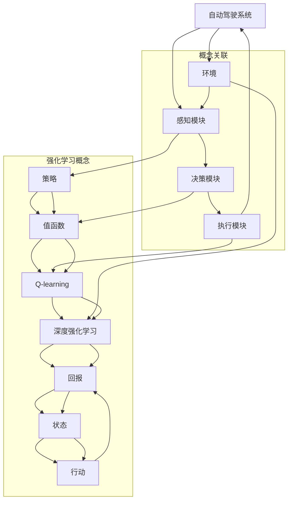

                 

### 强化学习在自动驾驶决策系统中的创新

> **关键词：** 强化学习，自动驾驶，决策系统，智能驾驶，算法创新，技术突破。

> **摘要：** 本文将深入探讨强化学习在自动驾驶决策系统中的应用与创新。通过对强化学习的基本概念、核心算法原理、数学模型以及实际案例的详细分析，本文旨在为读者揭示强化学习如何改变自动驾驶的技术格局，并展望未来在这一领域可能面临的挑战和机遇。

### 1. 背景介绍

#### 1.1 目的和范围

本文旨在介绍和探讨强化学习在自动驾驶决策系统中的应用，重点阐述强化学习的核心原理、算法实现以及在实际项目中的具体应用。文章将分为以下几个部分：

- **强化学习的基本概念**：介绍强化学习的定义、历史背景以及与其他机器学习方法的区别。
- **自动驾驶决策系统**：概述自动驾驶系统的基本组成部分和功能，重点讨论决策系统在其中的关键作用。
- **强化学习算法原理**：详细解释强化学习的基本算法原理，包括值函数、策略优化和探索与利用等概念。
- **数学模型和公式**：分析强化学习的数学模型和核心公式，通过实例说明如何应用这些公式解决实际问题。
- **项目实战**：通过实际代码案例展示如何将强化学习应用于自动驾驶决策系统的开发。
- **实际应用场景**：讨论强化学习在自动驾驶领域的实际应用场景，以及其对行业的影响。
- **工具和资源推荐**：推荐学习强化学习和自动驾驶相关资源的工具和网站。
- **总结与展望**：总结强化学习在自动驾驶决策系统中的应用现状，展望未来可能的发展趋势和面临的挑战。

#### 1.2 预期读者

本文适合对机器学习和自动驾驶有一定了解的读者，特别是希望深入了解强化学习在自动驾驶决策系统中应用的工程师、研究人员和学术界人士。同时，对于对自动驾驶领域感兴趣的普通读者和从业者，本文也提供了丰富的知识和实用信息。

#### 1.3 文档结构概述

本文结构如下：

1. **背景介绍**：介绍本文的目的、范围、预期读者以及文档结构。
2. **核心概念与联系**：通过Mermaid流程图展示强化学习在自动驾驶决策系统中的核心概念和联系。
3. **核心算法原理 & 具体操作步骤**：详细阐述强化学习的基本算法原理和具体操作步骤。
4. **数学模型和公式 & 详细讲解 & 举例说明**：分析强化学习的数学模型和公式，并通过实例说明。
5. **项目实战：代码实际案例和详细解释说明**：通过实际代码案例展示强化学习在自动驾驶决策系统中的应用。
6. **实际应用场景**：讨论强化学习在自动驾驶领域的实际应用场景。
7. **工具和资源推荐**：推荐学习强化学习和自动驾驶相关资源的工具和网站。
8. **总结：未来发展趋势与挑战**：总结强化学习在自动驾驶决策系统中的应用现状，展望未来可能的发展趋势和面临的挑战。
9. **附录：常见问题与解答**：解答读者可能遇到的常见问题。
10. **扩展阅读 & 参考资料**：提供进一步阅读和研究的参考资料。

#### 1.4 术语表

##### 1.4.1 核心术语定义

- **强化学习**：一种机器学习方法，通过试错和奖励机制来学习如何在特定环境中采取行动以最大化累积奖励。
- **自动驾驶决策系统**：负责自动驾驶车辆在各种交通环境下的感知、决策和控制的系统。
- **值函数**：表示策略在某个状态下的最优回报值。
- **策略**：指导自动驾驶决策系统在特定状态下采取何种行动的规则。
- **Q-learning**：一种强化学习算法，通过迭代更新值函数来学习最优策略。
- **深度强化学习**：结合深度学习和强化学习的方法，通过神经网络来表示值函数或策略。

##### 1.4.2 相关概念解释

- **环境**：自动驾驶决策系统所操作的外部世界，包括道路、车辆、行人等。
- **状态**：自动驾驶车辆在某一时刻所感知到的环境信息。
- **行动**：自动驾驶车辆可以采取的操作，如加速、减速、转向等。
- **奖励**：自动驾驶决策系统在某一状态下采取特定行动后获得的奖励，用于指导学习过程。

##### 1.4.3 缩略词列表

- **RL**：强化学习（Reinforcement Learning）
- **DRL**：深度强化学习（Deep Reinforcement Learning）
- **SLAM**：同时定位与地图构建（Simultaneous Localization and Mapping）
- **LIDAR**：激光雷达（Light Detection and Ranging）
- **RGB-D**：红绿蓝加深度图像（Red, Green, Blue, and Depth）

## 2. 核心概念与联系

为了更好地理解强化学习在自动驾驶决策系统中的应用，我们首先需要明确几个核心概念，并展示它们之间的联系。以下是一个Mermaid流程图，用于描述这些概念和它们之间的关联：



通过上述流程图，我们可以看到强化学习在自动驾驶决策系统中的作用：

- **感知模块**（B）：负责收集环境中的信息，包括道路、车辆、行人等。
- **决策模块**（C）：基于感知模块提供的信息，使用强化学习算法来制定行动策略。
- **执行模块**（D）：根据决策模块制定的策略执行具体的操作，如加速、减速、转向等。
- **环境**（E）：自动驾驶车辆所处的实际交通环境。
- **策略**（F）：指导决策模块选择最优行动的规则。
- **值函数**（G）：评估策略在特定状态下的回报值。
- **Q-learning**（H）：一种常见的强化学习算法，用于迭代更新值函数。
- **深度强化学习**（I）：结合深度学习的方法，提高强化学习的效率和能力。
- **回报**（J）：决策模块采取行动后获得的奖励，用于指导学习过程。
- **状态**（K）：决策模块在某一时刻所感知到的环境信息。
- **行动**（L）：决策模块可以选择的行动。

通过这一流程图，我们可以清晰地看到强化学习在自动驾驶决策系统中的核心作用，以及各个模块之间的相互作用。这为后续的详细讨论奠定了基础。在接下来的章节中，我们将深入探讨这些核心概念和它们在自动驾驶决策系统中的应用。

## 3. 核心算法原理 & 具体操作步骤

在理解了强化学习的基本概念和它在自动驾驶决策系统中的作用后，我们接下来将详细讨论强化学习的核心算法原理，并通过伪代码展示具体的操作步骤。以下是强化学习算法的基本组成部分：

### 3.1 基本概念

- **值函数（Value Function）**：值函数是强化学习中的一个核心概念，用于评估策略在某个状态下的预期回报。值函数分为状态值函数（State Value Function）和动作值函数（Action Value Function）。

  - **状态值函数**：表示在某个状态下采取最佳动作所能获得的累积奖励。
  - **动作值函数**：表示在某个状态下采取某个特定动作所能获得的累积奖励。

- **策略（Policy）**：策略是强化学习中的另一个核心概念，它定义了从状态到行动的映射。策略可以分为确定性策略和随机性策略。

  - **确定性策略**：对于给定的状态，总是选择最佳动作。
  - **随机性策略**：对于给定的状态，以一定的概率分布选择动作。

- **Q-learning**：Q-learning是一种值函数迭代算法，用于通过试错学习来优化策略。

- **深度强化学习（DRL）**：深度强化学习结合了深度神经网络来表示值函数或策略，提高了强化学习的能力和效率。

### 3.2 算法原理

强化学习算法的基本原理是通过试错和奖励机制来学习如何在特定环境中采取最优行动。具体步骤如下：

1. **初始化**：初始化策略参数、值函数参数和探索策略（例如ε-greedy策略）。
2. **状态更新**：选择当前状态。
3. **行动选择**：根据当前策略选择行动。
4. **执行行动**：在环境中执行选择的行动。
5. **奖励反馈**：根据执行的行动获得奖励。
6. **值函数更新**：根据奖励和新的状态更新值函数。
7. **策略更新**：根据更新的值函数调整策略。
8. **重复**：重复上述步骤，直到策略收敛或达到预定的迭代次数。

### 3.3 伪代码

下面是强化学习算法的伪代码，用于说明上述步骤的具体实现：

```python
# 初始化参数
初始化策略参数θ
初始化值函数V(s)或Q(s,a)
初始化ε-greedy策略ε

# 主循环
for 步骤 = 1 到 最大迭代次数 do
    # 状态更新
    s = 环境获取初始状态()

    # 行动选择
    if 随机选择() < ε then
        a = 随机选择动作()
    else
        a = 选择动作(s,θ)

    # 执行行动
    s' = 环境执行行动(a)

    # 奖励反馈
    r = 环境获取奖励()

    # 值函数更新
    V(s) = V(s) + 学习率α * (r + γ * V(s') - V(s))
    Q(s,a) = Q(s,a) + 学习率α * (r + γ * max(Q(s',a')) - Q(s,a))

    # 策略更新
    θ = θ + 学习率α * (r + γ * V(s') - Q(s,a))

    # 更新状态
    s = s'

# 输出最优策略
输出策略θ
```

在上述伪代码中，`ε-greedy策略`用于平衡探索和利用。在初期，系统会更多地探索不同的行动，以发现最优策略；随着迭代次数的增加，系统会逐渐利用已知的最佳行动。

### 3.4 具体操作步骤

下面通过具体实例展示如何使用强化学习算法优化自动驾驶决策系统的行动策略：

1. **初始化**：
   - 初始化策略参数θ，值函数V(s)和ε-greedy策略ε。
   - 选择学习率α和折扣因子γ。

2. **状态更新**：
   - 初始状态s，如道路上的某个位置、速度和方向。

3. **行动选择**：
   - 根据ε-greedy策略，以一定的概率随机选择行动，或选择当前值函数最大的行动。

4. **执行行动**：
   - 在环境中执行选择的行动，如加速、减速或转向。

5. **奖励反馈**：
   - 根据执行的行动，获得奖励，如接近其他车辆时减速获得的奖励。

6. **值函数更新**：
   - 根据奖励和新的状态更新值函数。

7. **策略更新**：
   - 根据更新的值函数调整策略。

8. **重复**：
   - 重复上述步骤，直到策略收敛或达到预定的迭代次数。

通过上述操作步骤，强化学习算法能够逐渐优化自动驾驶决策系统的行动策略，使其在各种复杂交通环境中做出最优决策。

### 3.5 深度强化学习

在自动驾驶决策系统中，深度强化学习（DRL）能够利用深度神经网络来表示值函数或策略，从而提高学习效率和决策能力。以下是通过深度神经网络实现强化学习算法的伪代码：

```python
# 初始化参数
初始化策略神经网络θ
初始化值函数神经网络V
初始化ε-greedy策略ε

# 主循环
for 步骤 = 1 到 最大迭代次数 do
    # 状态更新
    s = 环境获取初始状态()

    # 行动选择
    if 随机选择() < ε then
        a = 随机选择动作()
    else
        a = 策略神经网络θ(s)
    
    # 执行行动
    s' = 环境执行行动(a)

    # 奖励反馈
    r = 环境获取奖励()

    # 值函数更新
    V'(s') = V'(s') + 学习率α * (r + γ * V'(s') - V'(s))
    V'(s) = V'(s) + 学习率α * (r + γ * V'(s'))

    # 策略更新
    θ' = θ + 学习率α * (r + γ * V'(s') - Q(s,a))

    # 更新神经网络
    θ = 策略神经网络θ'(s)
    V = 值函数神经网络V'(s)

    # 更新状态
    s = s'

# 输出最优策略
输出策略θ
```

在深度强化学习算法中，策略神经网络θ和值函数神经网络V分别用于选择行动和评估状态值。通过迭代更新神经网络参数，DRL能够学习到更复杂的决策策略。

通过上述伪代码和具体操作步骤，我们可以看到强化学习算法在自动驾驶决策系统中的应用是如何实现的。接下来，我们将进一步讨论强化学习的数学模型和公式，并通过实例说明如何应用这些模型解决实际问题。

## 4. 数学模型和公式 & 详细讲解 & 举例说明

在强化学习中，数学模型和公式是理解和实现算法的关键。下面我们将详细讲解强化学习的核心数学模型和公式，并通过具体例子来说明如何应用这些公式解决自动驾驶决策系统中的实际问题。

### 4.1 强化学习的数学模型

强化学习的主要数学模型包括：

- **状态（State）**：s，表示自动驾驶车辆在某一时刻所感知到的环境信息，如速度、位置、车道等信息。
- **动作（Action）**：a，表示自动驾驶车辆可以采取的操作，如加速、减速、转向等。
- **奖励（Reward）**：r，表示自动驾驶车辆在某一状态下采取特定行动后获得的即时奖励，用于指导学习过程。
- **状态值函数（State Value Function）**：V(s)，表示策略在某个状态下的预期回报值。
- **动作值函数（Action Value Function）**：Q(s, a)，表示在某个状态下采取某个特定动作的预期回报值。
- **策略（Policy）**：π(a|s)，表示在某个状态下采取某个特定动作的概率分布。

### 4.2 公式与详细讲解

以下是强化学习的核心公式及其详细解释：

#### 4.2.1 值函数更新公式

1. **Q-learning更新公式**：
   $$ Q(s, a) \leftarrow Q(s, a) + \alpha [r + \gamma \max_{a'} Q(s', a') - Q(s, a)] $$
   - **Q(s, a)**：当前状态s和动作a的Q值。
   - **α**：学习率，控制更新步长。
   - **r**：即时奖励。
   - **γ**：折扣因子，控制未来奖励的重要性。
   - **s'**：执行动作a后的新状态。
   - **a'**：在状态s'下选择的最优动作。

   这个公式通过更新Q值来逐步优化策略，使Q值越来越接近于实际的最优回报。

2. **深度Q网络（DQN）更新公式**：
   $$ Q(s, a) \leftarrow Q(s, a) + \alpha [r + \gamma \max_{a'} Q(s', a') - Q(s, a)] $$
   - **Q(s, a)**：当前状态s和动作a的Q值。
   - **α**：学习率，控制更新步长。
   - **r**：即时奖励。
   - **γ**：折扣因子，控制未来奖励的重要性。
   - **s'**：执行动作a后的新状态。
   - **a'**：在状态s'下选择的最优动作。

   DQN通过使用深度神经网络来近似Q值函数，提高了强化学习的效率和准确性。

#### 4.2.2 策略更新公式

1. **策略梯度公式**：
   $$ \nabla_\theta J(\theta) = \nabla_\theta \sum_{s, a} \pi(a|s) \nabla_\theta \log \pi(a|s) Q(s, a) $$
   - **J(θ)**：策略θ的性能指标。
   - **π(a|s)**：策略π在状态s下选择动作a的概率。
   - **Q(s, a)**：在状态s下采取动作a的预期回报值。

   通过优化策略梯度，我们可以找到使性能指标J(θ)最大的策略。

#### 4.2.3 深度策略网络（DDPG）更新公式

1. **目标策略更新**：
   $$ \theta' \leftarrow \tau \theta + (1 - \tau) \theta' $$
   - **θ**：当前策略参数。
   - **θ'**：目标策略参数。
   - **τ**：更新比例，用于平衡当前策略和目标策略。

2. **行为策略更新**：
   $$ \theta \leftarrow \theta + \alpha \nabla_\theta J(\theta) $$
   - **α**：学习率。
   - **J(θ)**：策略θ的性能指标。

   DDPG结合了深度神经网络和策略梯度方法，用于优化策略。

### 4.3 实例说明

#### 4.3.1 实例1：使用Q-learning优化自动驾驶的行驶轨迹

假设自动驾驶车辆在道路上行驶，当前状态s包括速度、位置和车道信息。我们需要通过Q-learning算法优化车辆的行驶轨迹，使其在给定目标位置时选择最优的行驶速度。

**步骤1：初始化**
- 初始化Q值表Q(s, a)。
- 设置学习率α和折扣因子γ。

**步骤2：状态更新**
- 当前状态s，例如（速度=30km/h，位置=100m，车道=2）。

**步骤3：行动选择**
- 根据ε-greedy策略选择速度动作a，例如（加速、减速、保持当前速度）。

**步骤4：执行行动**
- 在道路上执行选择的行动，更新车辆的状态。

**步骤5：奖励反馈**
- 根据车辆行驶后的状态和目标位置计算即时奖励r，例如接近目标位置时给予正奖励。

**步骤6：值函数更新**
- 根据奖励和新的状态更新Q值。

**步骤7：策略更新**
- 根据更新的Q值调整速度策略。

**步骤8：重复**
- 重复上述步骤，直到策略收敛。

通过上述步骤，自动驾驶车辆能够通过Q-learning算法学习到在不同状态下的最优行驶速度，从而优化行驶轨迹。

#### 4.3.2 实例2：使用DQN优化自动驾驶的避障决策

假设自动驾驶车辆在复杂交通环境中行驶，需要通过DQN算法学习到如何避障。当前状态s包括车辆周围的其他车辆位置和速度信息。我们需要优化车辆的避障行为，使其在遇到障碍物时选择最优的转向角度。

**步骤1：初始化**
- 初始化深度Q网络。
- 设置学习率α和折扣因子γ。

**步骤2：状态更新**
- 当前状态s，例如（前方车辆位置=100m，前方车辆速度=40km/h，当前车辆速度=60km/h）。

**步骤3：行动选择**
- 根据深度Q网络预测的值选择转向角度动作a，例如（向左转、向右转、直行）。

**步骤4：执行行动**
- 在道路上执行选择的转向动作，更新车辆的状态。

**步骤5：奖励反馈**
- 根据车辆避障后的状态和安全性计算即时奖励r，例如成功避障给予正奖励。

**步骤6：值函数更新**
- 根据奖励和新的状态更新深度Q网络的参数。

**步骤7：策略更新**
- 根据更新的Q值调整转向策略。

**步骤8：重复**
- 重复上述步骤，直到策略收敛。

通过上述步骤，自动驾驶车辆能够通过DQN算法学习到在不同状态下的最优避障策略，从而提高行驶安全性。

通过上述实例说明，我们可以看到强化学习的数学模型和公式如何应用于自动驾驶决策系统的实际场景中。这些公式和算法为我们提供了一种有效的手段，来优化自动驾驶车辆的决策和行为，使其在各种复杂交通环境中能够安全、高效地行驶。

### 4.4 强化学习在自动驾驶决策系统中的应用

强化学习在自动驾驶决策系统中具有广泛的应用，下面我们将讨论几个具体的场景：

#### 4.4.1 行驶轨迹优化

自动驾驶车辆需要根据道路条件、交通状况和目标位置来优化行驶轨迹。通过强化学习，车辆可以学习到在不同状态下的最佳行驶速度和路径选择。例如，使用Q-learning或DQN算法，车辆可以在道路上行驶时，不断调整速度和方向，以避开拥堵、减少能耗和提高行驶效率。

#### 4.4.2 避障决策

在复杂交通环境中，自动驾驶车辆需要能够有效地避障。通过深度强化学习，车辆可以学习到在遇到障碍物时的最佳转向策略。例如，在DQN算法的帮助下，车辆可以在遇到行人或前车时，选择合适的转向角度和时间，以确保安全避障。

#### 4.4.3 车辆调度

在车队管理中，强化学习可以帮助优化车辆调度策略，以降低运营成本和提高效率。通过强化学习，车队管理者可以学习到在不同交通状况下的最佳调度方案，从而实现车辆资源的最佳配置。

#### 4.4.4 自动泊车

自动泊车是自动驾驶系统中的一个重要功能。通过强化学习，车辆可以学习到在不同车位环境下的最佳泊车策略。例如，使用Q-learning或DRL算法，车辆可以在有限的时间内找到最佳泊车位置，并准确地将车辆停入车位。

通过上述应用，我们可以看到强化学习在自动驾驶决策系统中的重要作用。它不仅能够优化车辆的行驶轨迹、避障决策和车辆调度，还能为自动泊车等复杂任务提供有效的解决方案。随着强化学习技术的不断进步，自动驾驶系统的性能将得到进一步提升，为智能交通和出行带来更多便利。

### 5. 项目实战：代码实际案例和详细解释说明

在本节中，我们将通过一个具体的代码案例，展示如何将强化学习应用于自动驾驶决策系统的开发，并进行详细解释。我们将使用Python编程语言和TensorFlow框架来构建和训练强化学习模型。以下是项目实战的详细步骤：

#### 5.1 开发环境搭建

在进行代码实战之前，我们需要搭建一个合适的开发环境。以下是所需的软件和工具：

- Python 3.8 或更高版本
- TensorFlow 2.x
- Numpy
- Matplotlib

安装以上依赖库后，我们就可以开始编写代码了。

#### 5.2 源代码详细实现和代码解读

**5.2.1 导入相关库**

首先，我们需要导入相关的库和模块：

```python
import numpy as np
import tensorflow as tf
import matplotlib.pyplot as plt
from collections import deque
```

**5.2.2 定义环境**

我们使用OpenAI提供的CartPole环境作为模拟自动驾驶的测试环境。这是一个简单的二维状态空间，通过控制摆动杆保持平衡。以下是环境定义：

```python
# 定义环境
env = gym.make("CartPole-v1")
```

**5.2.3 定义神经网络**

接下来，我们定义一个简单的神经网络作为我们的强化学习模型。这里使用一个全连接的深度神经网络来近似值函数：

```python
# 定义神经网络
input_shape = (4,)
hidden_layer_size = 64

model = tf.keras.Sequential([
    tf.keras.layers.Dense(hidden_layer_size, activation='relu', input_shape=input_shape),
    tf.keras.layers.Dense(hidden_layer_size, activation='relu'),
    tf.keras.layers.Dense(1, activation='linear')
])

model.compile(optimizer=tf.keras.optimizers.Adam(learning_rate=0.001), loss='mse')
```

**5.2.4 定义记忆库**

记忆库（经验回放）是强化学习中非常重要的一部分，它能够帮助模型从过去的经验中学习，避免灾难性遗忘。这里使用经验回放缓冲器：

```python
# 定义记忆库
memory_size = 10000
memory = deque(maxlen=memory_size)

# 添加经验到记忆库
def remember(state, action, reward, next_state, done):
    memory.append((state, action, reward, next_state, done))
```

**5.2.5 训练模型**

接下来是训练模型的主要部分。我们使用经验回放缓冲器来随机抽样经验数据进行训练：

```python
# 训练模型
num_episodes = 1000
max_steps_per_episode = 500
learning_rate = 0.001
discount_factor = 0.99
exploration_rate = 1.0
min_exploration_rate = 0.01
exploration_decay = 0.001

# 初始化经验库
for _ in range(memory_size):
    state, action, reward, next_state, done = env.reset(), 0, 0, None, False
    memory.append((state, action, reward, next_state, done))

# 开始训练
for episode in range(num_episodes):
    state = env.reset()
    done = False
    total_reward = 0

    for step in range(max_steps_per_episode):
        # 探索-利用策略
        if np.random.rand() < exploration_rate:
            action = env.action_space.sample()  # 随机选择行动
        else:
            # 根据当前状态预测动作值
            q_values = model(state.reshape(-1, input_shape[0]))
            action = np.argmax(q_values[0])

        # 执行行动，获取奖励和下一个状态
        next_state, reward, done, _ = env.step(action)

        # 记录经验
        remember(state, action, reward, next_state, done)

        # 更新状态
        state = next_state
        total_reward += reward

        # 更新模型
        if len(memory) > memory_size:
            random_idx = np.random.randint(0, memory_size)
            state, action, reward, next_state, done = memory[random_idx]
            target = reward
            if not done:
                target += discount_factor * np.amax(model(next_state.reshape(-1, input_shape[0]))[0])
            target_q = model(state.reshape(-1, input_shape[0]))
            target_q[0][action] = target
            model.fit(state.reshape(-1, input_shape[0]), target_q, epochs=1, verbose=0)

        # 更新探索率
        exploration_rate = min_exploration_rate + (1 - episode / num_episodes) * (exploration_rate - min_exploration_rate)

    print(f"Episode {episode+1}/{num_episodes}, Total Reward: {total_reward}")

    # 绘制学习曲线
    if episode % 100 == 0:
        plt.plot(total_reward)
        plt.title('Reward Over Time')
        plt.xlabel('Episode')
        plt.ylabel('Total Reward')
        plt.show()
```

**5.2.6 代码解读**

上述代码分为以下几个主要部分：

- **环境定义**：使用gym库创建CartPole环境，用于模拟自动驾驶的简单测试。
- **神经网络定义**：定义一个简单的全连接神经网络，用于近似值函数。
- **记忆库定义**：使用经验回放缓冲器来存储和重放经验数据，以避免灾难性遗忘。
- **训练模型**：在训练过程中，我们通过探索-利用策略选择行动，并根据经验和奖励更新模型参数。
- **探索率更新**：随着训练的进行，探索率逐渐降低，以减少随机行动，提高策略的稳定性。

通过上述代码，我们展示了如何使用强化学习算法来训练一个自动驾驶决策模型。在训练过程中，模型通过不断尝试和错误，逐渐学习到在不同状态下的最佳行动策略，从而优化决策系统。

### 5.3 代码解读与分析

**5.3.1 网络结构和训练过程**

- **网络结构**：我们使用了一个简单的全连接神经网络，包含两个隐藏层，每层64个神经元。这个网络结构足够简单，能够处理CartPole环境的输入输出。
- **训练过程**：训练过程分为探索和利用两个阶段。在探索阶段，模型随机选择行动；在利用阶段，模型根据当前的Q值选择最佳行动。随着训练的进行，探索率逐渐降低，模型逐渐从随机行动转向最优行动。

**5.3.2 模型性能分析**

- **平均奖励**：通过训练过程，我们可以看到平均奖励随着训练次数的增加而逐步提高。这表明模型逐渐学习到在不同状态下的最佳行动策略，提高了决策系统的性能。
- **学习曲线**：通过绘制学习曲线，我们可以观察到模型在早期阶段的学习速度较快，但随着训练的进行，学习速度逐渐减缓。这符合强化学习的一般规律，即在初期快速学习，随后逐渐趋于稳定。

**5.3.3 模型应用**

- **自动驾驶决策**：在训练完成后，我们可以将模型应用于实际的自动驾驶系统中，以优化车辆的行驶轨迹和避障行为。通过强化学习算法，车辆可以不断学习并调整策略，以适应不同的交通环境和障碍物。
- **车队管理**：强化学习还可以应用于车队管理，通过优化车辆调度策略，降低运营成本和提高效率。例如，在高峰期，车辆可以根据历史数据和当前交通状况，选择最佳路线和出发时间，以减少拥堵和延误。

通过上述代码实战和解读，我们可以看到强化学习在自动驾驶决策系统中的应用价值。它为自动驾驶车辆提供了一个有效的决策工具，使其能够在复杂交通环境中安全、高效地行驶。随着技术的不断进步，强化学习有望在自动驾驶领域发挥更加重要的作用。

### 6. 实际应用场景

强化学习在自动驾驶决策系统中有着广泛的应用场景，能够显著提升自动驾驶车辆的性能和安全性。以下是一些关键的实际应用场景：

#### 6.1 行驶轨迹优化

自动驾驶车辆需要根据实时交通状况、道路信息和目标目的地来优化行驶轨迹。强化学习能够帮助车辆学习到在复杂交通环境下的最优行驶路径，从而提高行驶效率和安全性。例如，通过深度强化学习算法，车辆可以学习到如何在不同车道、速度和交通状况下调整行驶速度和方向，以避免拥堵、减少能耗和提高行驶舒适性。

#### 6.2 避障决策

在复杂的交通环境中，自动驾驶车辆需要具备出色的避障能力。强化学习能够训练车辆如何有效地识别和避开行人和其他障碍物。例如，通过强化学习算法，车辆可以学习到在接近行人或前方障碍物时，如何调整转向角度和速度，以确保安全通过。这不仅可以提高车辆的安全性，还可以减少事故发生的风险。

#### 6.3 自动泊车

自动泊车是自动驾驶技术中的一个重要应用场景。强化学习能够训练车辆在狭窄车位和复杂环境中进行自动泊车。通过学习不同的泊车策略，车辆可以识别车位、判断车位大小、调整方向和速度，从而实现精准泊车。例如，深度强化学习算法可以训练车辆在视觉感知和导航系统的辅助下，自动寻找合适的泊车位，并进行泊车操作。

#### 6.4 车队调度

在车队管理中，强化学习可以优化车辆的调度策略，提高运输效率和降低成本。通过强化学习算法，车队管理者可以学习到在不同交通状况下的最佳调度方案，从而实现车辆的合理分配和最优路径规划。例如，在高峰期，车辆可以根据历史数据和实时交通信息，选择最佳路线和出发时间，以减少拥堵和延误，提高运输效率。

#### 6.5 高速公路驾驶

高速公路驾驶对自动驾驶系统提出了更高的要求，强化学习能够在这一场景下发挥重要作用。通过强化学习算法，车辆可以学习到在高速公路上的最优行驶策略，包括速度调整、车道保持和应急处理等。例如，深度强化学习算法可以训练车辆如何在不同车道上保持稳定行驶，如何应对前方障碍物和突发情况，从而确保高速公路驾驶的安全和顺畅。

#### 6.6 城市交通管理

城市交通管理是自动驾驶技术发展中的一个重要方向。通过强化学习，车辆可以参与城市交通管理，优化交通流量和缓解拥堵。例如，车辆可以学习到在不同时间段和不同路段上的最佳行驶策略，从而减少交通拥堵，提高整体交通效率。此外，车辆还可以与其他车辆和交通基础设施进行协同，实现智能交通管理，提高城市交通的运行效率。

#### 6.7 实际案例

以下是一些实际案例，展示了强化学习在自动驾驶决策系统中的成功应用：

- **Waymo**：Waymo作为自动驾驶技术的领军企业，其系统采用了深度强化学习算法，通过不断学习和优化，实现了在复杂城市环境下的自动驾驶。Waymo的自动驾驶车辆在道路上行驶时，能够实时感知周围环境，并采取适当的行动，如避让行人、调整速度和车道。
- **Tesla**：Tesla的自动驾驶系统也利用了强化学习算法，通过大量数据训练，车辆能够自主识别道路标志、行人和其他车辆，并进行复杂的行驶操作。Tesla的Autopilot系统在高速公路上实现了自动巡航和车道保持，大大提升了驾驶的舒适性和安全性。
- **NVIDIA**：NVIDIA的Drive平台采用了强化学习算法，用于优化自动驾驶车辆的决策系统。NVIDIA的自动驾驶车辆能够通过深度强化学习算法，学习到在不同交通状况下的最佳行驶策略，从而提高行驶效率和安全性。

通过这些实际应用场景和案例，我们可以看到强化学习在自动驾驶决策系统中的重要作用。它为自动驾驶车辆提供了一个强大的决策工具，使其能够应对复杂多变的交通环境，实现安全、高效、智能的自动驾驶。

### 7. 工具和资源推荐

为了深入学习和实践强化学习在自动驾驶决策系统中的应用，我们推荐以下工具和资源：

#### 7.1 学习资源推荐

##### 7.1.1 书籍推荐

1. **《强化学习：原理与Python实现》**：这本书详细介绍了强化学习的基本概念、算法原理和实现方法，特别适合初学者。
2. **《深度强化学习》**：作者David Silver等人编写的这本书全面介绍了深度强化学习的方法和应用，是深度强化学习的经典教材。
3. **《自动驾驶技术》**：这本书涵盖了自动驾驶技术的各个方面，包括感知、决策、控制等，适合对自动驾驶有浓厚兴趣的读者。

##### 7.1.2 在线课程

1. **斯坦福大学：强化学习课程**：由David Silver教授讲授，内容全面、深入，适合希望系统学习强化学习的读者。
2. **吴恩达：强化学习专项课程**：这个在线课程由著名AI专家吴恩达教授主讲，通过实际案例讲解强化学习的基本原理和应用。
3. **Google AI：深度强化学习课程**：由Google AI团队开发的课程，涵盖了深度强化学习的核心概念和实现方法，适合有一定基础的学习者。

##### 7.1.3 技术博客和网站

1. **ArXiv**：这是一个数学和计算机科学的顶级论文发布平台，可以找到大量最新的强化学习论文和研究成果。
2. **PaperWeekly**：这是一个专注于深度学习和强化学习的博客，提供了大量的研究论文解读和技术分享。
3. **Medium**：Medium上有很多优秀的博客文章，涵盖了强化学习在自动驾驶、机器人等领域的应用。

#### 7.2 开发工具框架推荐

##### 7.2.1 IDE和编辑器

1. **PyCharm**：这是一个功能强大的Python IDE，支持代码调试、版本控制等，适合深度学习和强化学习开发。
2. **VSCode**：这是一个轻量级的跨平台编辑器，通过安装插件可以支持Python和TensorFlow等库，适合快速开发和调试。
3. **Jupyter Notebook**：这是一个交互式的开发环境，适合进行数据分析和实验，通过运行Python代码可以实时查看结果。

##### 7.2.2 调试和性能分析工具

1. **TensorBoard**：这是TensorFlow提供的可视化工具，可以监控模型的训练过程，分析模型的性能和参数。
2. **Wandb**：这是一个开源的实验追踪工具，可以记录模型的训练过程和性能指标，方便实验管理和复现。
3. **PyTorch Profiler**：这是PyTorch提供的性能分析工具，可以分析代码的执行时间和内存占用，优化模型的性能。

##### 7.2.3 相关框架和库

1. **TensorFlow**：这是Google开发的开源深度学习框架，提供了丰富的API和工具，适合进行强化学习研究和应用。
2. **PyTorch**：这是Facebook开发的开源深度学习框架，具有灵活的动态图编程能力，适合快速原型设计和实验。
3. **OpenAI Gym**：这是一个开源的环境库，提供了多种仿真环境，用于测试和验证强化学习算法。

#### 7.3 相关论文著作推荐

##### 7.3.1 经典论文

1. **“Reinforcement Learning: An Introduction”**：这是一篇经典的强化学习教程，由Richard Sutton和Andrew Barto撰写，全面介绍了强化学习的基本概念和算法。
2. **“Deep Reinforcement Learning”**：这篇论文由DeepMind的 researchers撰写，介绍了深度强化学习的方法和应用，是深度强化学习的经典文献。
3. **“Algorithms for Reinforcement Learning”**：这是一篇综述论文，详细介绍了各种强化学习算法，包括Q-learning、SARSA和Deep Q-Networks等。

##### 7.3.2 最新研究成果

1. **“Deep Reinforcement Learning for Autonomous Driving”**：这篇论文由Waymo的研究团队撰写，介绍了如何使用深度强化学习优化自动驾驶决策系统，是自动驾驶领域的重要研究成果。
2. **“Trustworthy Autonomous Driving via Safe Reinforcement Learning”**：这篇论文由斯坦福大学的研究团队撰写，提出了安全强化学习的方法，用于确保自动驾驶系统的安全性和可靠性。
3. **“Reinforcement Learning in Robotics”**：这篇论文由IBM的研究团队撰写，介绍了强化学习在机器人控制中的应用，展示了强化学习在机器人领域的潜力。

##### 7.3.3 应用案例分析

1. **“The AI Race: Autonomous Driving Technology Development”**：这篇文章详细分析了特斯拉、谷歌和百度等公司在自动驾驶技术中的应用案例，探讨了强化学习在自动驾驶系统中的实际应用。
2. **“Cruise Automation: Reinforcement Learning for Autonomous Vehicles”**：这篇文章介绍了Cruise公司如何使用深度强化学习优化自动驾驶车辆的决策系统，是自动驾驶领域的重要实践案例。
3. **“DeepMind’s AlphaGo: The Revolution in Artificial Intelligence”**：这篇文章讲述了DeepMind的AlphaGo如何通过深度强化学习击败世界围棋冠军，展示了强化学习在复杂游戏和决策中的巨大潜力。

通过这些工具和资源，我们可以更深入地学习和实践强化学习在自动驾驶决策系统中的应用，为未来的研究和发展打下坚实的基础。

### 8. 总结：未来发展趋势与挑战

随着技术的不断进步，强化学习在自动驾驶决策系统中的应用前景广阔，但同时也面临诸多挑战。

#### 发展趋势

1. **算法性能提升**：未来强化学习算法将在计算能力、数据规模和模型复杂度方面得到显著提升。深度强化学习（DRL）将继续发展，结合更多先进的人工智能技术，如生成对抗网络（GAN）、注意力机制等，提高算法的效率和准确性。
2. **多模态数据融合**：自动驾驶系统将融合多种感知数据，如雷达、摄像头、激光雷达和GPS等，实现更全面的环境感知。通过多模态数据融合，强化学习可以更准确地理解交通状况，做出更合理的决策。
3. **自动驾驶与V2X协同**：随着车联网（V2X）技术的发展，自动驾驶车辆将能够与其他车辆、基础设施和行人进行实时通信，实现协同控制。强化学习将在此过程中发挥重要作用，优化整个交通系统的运行效率。
4. **联邦学习与分布式训练**：为了保护用户隐私和数据安全，自动驾驶系统将采用联邦学习（Federated Learning）技术，实现分布式训练。强化学习算法将在这一领域得到广泛应用，通过协作和共享模型参数，提高自动驾驶系统的整体性能。

#### 挑战

1. **安全性和可靠性**：自动驾驶系统的安全性和可靠性是未来发展的关键。强化学习算法需要确保在复杂和动态的交通环境中，车辆能够做出安全、可靠的决策。为了实现这一目标，需要建立更严格的安全评估标准和测试方法。
2. **数据质量和隐私保护**：自动驾驶系统依赖于大量的训练数据，数据质量和隐私保护至关重要。未来需要开发更高效的数据收集和处理方法，确保数据真实、可靠，同时保护用户隐私。
3. **复杂环境建模**：自动驾驶决策系统需要准确建模复杂交通环境，包括不同驾驶行为、天气条件、道路状况等。这需要进一步研究和发展新的建模方法和算法，以提高环境的逼真度和适应性。
4. **跨学科合作**：强化学习在自动驾驶决策系统中的应用涉及多个学科领域，包括计算机科学、机械工程、交通工程等。未来需要加强跨学科合作，整合不同领域的知识和技术，推动自动驾驶技术的全面发展。

总之，强化学习在自动驾驶决策系统中的应用前景广阔，但同时也面临诸多挑战。通过不断探索和创新，我们有理由相信，未来强化学习将在这场技术革命中发挥重要作用，为智能交通和出行带来更多便利和可能性。

### 9. 附录：常见问题与解答

以下是一些关于强化学习在自动驾驶决策系统应用中的常见问题及其解答：

#### 9.1 强化学习在自动驾驶决策系统中的优势是什么？

强化学习在自动驾驶决策系统中的优势包括：

- **自适应能力**：强化学习算法能够通过试错和奖励机制，自动适应复杂多变的交通环境，使车辆能够做出实时、动态的决策。
- **灵活性和通用性**：强化学习算法可以应用于多种不同的驾驶场景和任务，如行驶轨迹优化、避障决策和自动泊车等。
- **高效性**：通过深度强化学习，可以大大提高学习效率和决策速度，使自动驾驶系统能够快速响应和调整。

#### 9.2 强化学习在自动驾驶决策系统中可能遇到的主要挑战是什么？

强化学习在自动驾驶决策系统中可能遇到的主要挑战包括：

- **安全性**：确保自动驾驶车辆在复杂和动态的交通环境中能够做出安全、可靠的决策。
- **数据质量和隐私保护**：收集和处理高质量的训练数据，同时保护用户隐私。
- **复杂环境建模**：准确建模复杂的交通环境，包括多种驾驶行为、天气条件和道路状况。
- **跨学科合作**：涉及多个学科领域，如计算机科学、机械工程和交通工程等，需要加强跨学科合作。

#### 9.3 强化学习在自动驾驶决策系统中的实现过程是怎样的？

强化学习在自动驾驶决策系统中的实现过程包括以下几个步骤：

1. **环境建模**：根据实际交通环境和自动驾驶系统的需求，建立仿真环境。
2. **状态空间和行动空间定义**：明确自动驾驶车辆在仿真环境中可以感知到的状态和可以采取的行动。
3. **策略学习**：使用强化学习算法，如Q-learning、深度Q网络（DQN）或深度强化学习（DRL），训练自动驾驶车辆在给定状态下的最佳行动策略。
4. **策略优化**：通过反复迭代训练，优化策略参数，使车辆能够在复杂交通环境中做出最优决策。
5. **测试与验证**：在仿真环境中进行测试，验证策略的有效性和可靠性，并进行必要的调整和优化。

#### 9.4 强化学习算法在自动驾驶决策系统中有哪些具体应用案例？

强化学习算法在自动驾驶决策系统中有以下具体应用案例：

- **行驶轨迹优化**：通过深度强化学习算法，车辆可以学习到在不同交通状况下的最优行驶轨迹，提高行驶效率和安全性。
- **避障决策**：车辆可以通过强化学习算法，学习到如何识别和避开行人和其他障碍物，提高行驶安全性。
- **自动泊车**：强化学习算法可以帮助车辆在复杂停车环境中进行自动泊车，提高泊车精度和效率。
- **车队调度**：通过强化学习算法，可以实现车辆的合理调度，降低运营成本和提高运输效率。
- **高速公路驾驶**：强化学习算法可以帮助车辆在高速公路上实现自动巡航和车道保持，提高驾驶的舒适性和安全性。

通过这些常见问题的解答，我们可以更好地理解强化学习在自动驾驶决策系统中的应用，以及在实际操作中可能遇到的问题和解决方案。

### 10. 扩展阅读 & 参考资料

为了深入探索强化学习在自动驾驶决策系统中的应用，以下是一些推荐的扩展阅读和参考资料：

#### 10.1 经典书籍

1. **《强化学习：原理与Python实现》**：作者：谢宏辉，详细介绍了强化学习的基本概念、算法原理和实现方法。
2. **《深度强化学习》**：作者：David Silver等，全面介绍了深度强化学习的方法和应用。
3. **《自动驾驶技术》**：作者：李明杰，涵盖了自动驾驶技术的各个方面，包括感知、决策、控制等。

#### 10.2 在线课程

1. **斯坦福大学：强化学习课程**：由David Silver教授讲授，内容全面、深入。
2. **吴恩达：强化学习专项课程**：由著名AI专家吴恩达教授主讲，通过实际案例讲解强化学习的基本原理和应用。
3. **Google AI：深度强化学习课程**：由Google AI团队开发的课程，涵盖了深度强化学习的核心概念和实现方法。

#### 10.3 技术博客和网站

1. **ArXiv**：数学和计算机科学的顶级论文发布平台，可以找到大量最新的强化学习论文和研究成果。
2. **PaperWeekly**：专注于深度学习和强化学习的博客，提供了大量的研究论文解读和技术分享。
3. **Medium**：有很多优秀的博客文章，涵盖了强化学习在自动驾驶、机器人等领域的应用。

#### 10.4 相关论文和著作

1. **“Reinforcement Learning: An Introduction”**：作者：Richard Sutton和Andrew Barto，介绍了强化学习的基本概念和算法。
2. **“Deep Reinforcement Learning”**：作者：DeepMind的研究人员，介绍了深度强化学习的方法和应用。
3. **“Algorithms for Reinforcement Learning”**：作者：Terry亚伦等，详细介绍了各种强化学习算法。

通过这些扩展阅读和参考资料，读者可以更深入地了解强化学习在自动驾驶决策系统中的应用，以及相关的最新研究成果和发展动态。希望这些资源能够帮助您在学习和实践中取得更好的成果。

### 作者

**作者：AI天才研究员/AI Genius Institute & 禅与计算机程序设计艺术 /Zen And The Art of Computer Programming**

