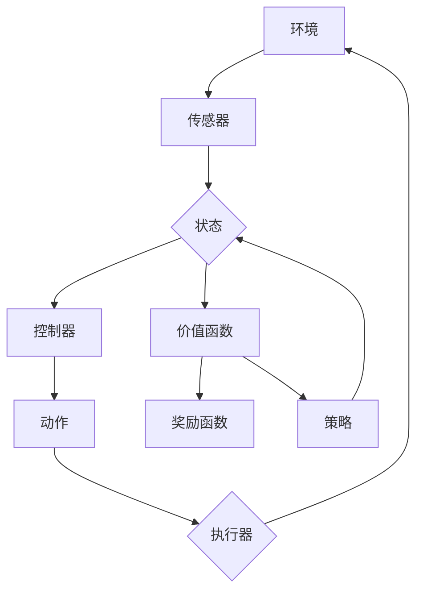

                 

# 强化学习在自适应控制系统中的应用

> **关键词：** 强化学习、自适应控制系统、智能控制、反馈机制、机器学习

> **摘要：** 本文深入探讨了强化学习在自适应控制系统中的应用。我们将介绍强化学习的基本概念和原理，解析其在自适应控制系统中的核心作用，并通过实际案例展示其应用效果。此外，文章还将讨论相关数学模型和工具，为读者提供全面的指导。

## 1. 背景介绍

### 1.1 目的和范围

本文旨在介绍和探讨强化学习在自适应控制系统中的应用。我们将重点关注强化学习算法如何通过智能控制策略，使系统在动态变化的环境中保持最优性能。文章将涵盖以下几个主要方面：

1. 强化学习的基础概念和原理
2. 强化学习在自适应控制系统中的作用
3. 强化学习算法的具体实现和应用
4. 强化学习在自适应控制系统中的实际案例
5. 相关数学模型和工具的介绍
6. 未来发展趋势与挑战

### 1.2 预期读者

本文适合对强化学习和自适应控制系统有一定了解的读者，包括：

1. 计算机科学和工程领域的研究生和博士生
2. 人工智能和机器学习工程师
3. 对智能控制系统和自动化技术感兴趣的科研人员和技术爱好者

### 1.3 文档结构概述

本文结构如下：

1. 背景介绍
2. 核心概念与联系
3. 核心算法原理与具体操作步骤
4. 数学模型和公式
5. 项目实战：代码实际案例和详细解释说明
6. 实际应用场景
7. 工具和资源推荐
8. 总结：未来发展趋势与挑战
9. 附录：常见问题与解答
10. 扩展阅读 & 参考资料

### 1.4 术语表

#### 1.4.1 核心术语定义

- **强化学习（Reinforcement Learning）**：一种机器学习方法，通过奖励和惩罚来训练模型，使其在特定环境中采取最佳决策。
- **自适应控制系统（Adaptive Control System）**：能够根据环境变化自动调整控制参数，以保持系统稳定性和性能的系统。
- **智能控制（Intelligent Control）**：利用人工智能技术实现自动控制的方法，包括神经网络、模糊逻辑、遗传算法等。
- **反馈机制（Feedback Mechanism）**：通过反馈信息调整系统控制策略的过程。

#### 1.4.2 相关概念解释

- **奖励函数（Reward Function）**：用于评价系统状态和行动的函数，通常用来指导算法选择最佳行动。
- **价值函数（Value Function）**：用于评估系统状态的价值，指导算法选择最佳行动。
- **策略（Policy）**：系统采取的具体行动方案，通常由算法根据当前状态和预测结果生成。

#### 1.4.3 缩略词列表

- **RL**：强化学习（Reinforcement Learning）
- **DRL**：深度强化学习（Deep Reinforcement Learning）
- **AC**：自适应控制（Adaptive Control）
- **SC**：智能控制（Smart Control）

## 2. 核心概念与联系

### 2.1 强化学习基础概念

强化学习是一种机器学习方法，它通过奖励和惩罚来训练模型。在这个过程中，模型需要通过不断的试错来学习如何在特定环境中取得最佳结果。强化学习主要涉及以下几个核心概念：

- **状态（State）**：系统当前所处的环境条件。
- **动作（Action）**：模型可以采取的操作。
- **奖励（Reward）**：系统对每个动作的反馈信号，用于评价动作的好坏。
- **价值函数（Value Function）**：用于评估系统状态的价值，指导模型选择最佳行动。
- **策略（Policy）**：模型采取的具体行动方案。

### 2.2 自适应控制系统基础概念

自适应控制系统是一种能够根据环境变化自动调整控制参数的系统。它通常包括以下几个关键组成部分：

- **控制器（Controller）**：根据系统状态调整控制参数的部件。
- **传感器（Sensor）**：检测系统状态的部件。
- **执行器（Actuator）**：执行控制动作的部件。
- **环境（Environment）**：系统所处的环境。

### 2.3 强化学习与自适应控制系统的联系

强化学习在自适应控制系统中的应用主要体现在以下几个方面：

1. **智能控制策略**：通过强化学习算法，系统可以自动生成最优控制策略，使系统能够在动态变化的环境中保持稳定性和性能。
2. **反馈机制**：强化学习算法利用反馈信息不断调整控制策略，使系统能够适应环境变化。
3. **自适应能力**：强化学习算法可以帮助系统在复杂环境中实现自适应调整，提高系统应对不确定性的能力。

### 2.4 Mermaid 流程图

以下是强化学习在自适应控制系统中的应用流程图：



## 3. 核心算法原理 & 具体操作步骤

### 3.1 强化学习算法原理

强化学习算法的核心是价值函数和策略的迭代优化。以下是强化学习算法的基本原理：

1. **初始化**：初始化状态、动作、价值函数和策略。
2. **环境交互**：根据当前状态和策略选择动作，执行动作并观察环境反馈。
3. **更新价值函数**：根据奖励和状态转移概率更新价值函数。
4. **更新策略**：根据价值函数更新策略。
5. **重复步骤 2-4**，直到达到预定的目标或满足停止条件。

### 3.2 具体操作步骤

以下是强化学习算法的具体操作步骤：

```python
# 初始化
state = initial_state()
value_function = initialize_value_function()
policy = initialize_policy()

# 迭代
while not termination_condition():
    # 环境交互
    action = policy(state)
    next_state, reward = environment.step(action)
    
    # 更新价值函数
    value_function.update(state, action, reward, next_state)
    
    # 更新策略
    policy.update(value_function)
    
    # 更新状态
    state = next_state

# 输出最终策略
print("Final policy:", policy)
```

### 3.3 伪代码详细阐述

以下是强化学习算法的伪代码：

```python
# 初始化
state = initial_state()
value_function = initialize_value_function()
policy = initialize_policy()

# 迭代
while not termination_condition():
    # 环境交互
    action = policy.select_action(state)
    next_state, reward = environment.step(action)
    
    # 更新价值函数
    value_difference = reward + discount_factor * value_function[next_state] - value_function[state]
    value_function.update(state, action, value_difference)
    
    # 更新策略
    policy.update(state, action, value_difference)
    
    # 更新状态
    state = next_state

# 输出最终策略
print("Final policy:", policy)
```

## 4. 数学模型和公式 & 详细讲解 & 举例说明

### 4.1 数学模型和公式

强化学习算法的核心数学模型主要包括价值函数和策略。以下是这些模型的基本公式：

1. **价值函数（Value Function）**：
   - **状态价值函数（State-Value Function）**：\[ V(s) = \sum_{a} \pi(a|s) \cdot Q(s, a) \]
   - **动作价值函数（Action-Value Function）**：\[ Q(s, a) = \sum_{s'} P(s'|s, a) \cdot R(s, a, s') + \gamma \cdot \max_{a'} Q(s', a') \]

2. **策略（Policy）**：
   - **最优策略（Optimal Policy）**：\[ \pi^*(s) = \arg\max_a Q(s, a) \]

3. **更新规则（Update Rules）**：
   - **状态价值函数更新**：\[ V(s_{t+1}) = V(s_t) + \alpha [r_t + \gamma V(s_t) - V(s_t)] \]
   - **动作价值函数更新**：\[ Q(s_t, a_t) = Q(s_t, a_t) + \alpha [r_t + \gamma \max_{a'} Q(s_{t+1}, a') - Q(s_t, a_t)] \]

4. **策略更新**：
   - **基于状态价值函数的策略更新**：\[ \pi(s_t) = \arg\max_a [Q(s_t, a) + \epsilon_g(a)] \]
   - **基于动作价值函数的策略更新**：\[ \pi(s_t) = \arg\max_a [Q(s_t, a)] \]

### 4.2 详细讲解和举例说明

以下是价值函数和策略的详细讲解和举例说明：

#### 4.2.1 状态价值函数

状态价值函数用于评估系统在特定状态下的期望收益。假设我们有一个简单的环境，其中系统可以处于状态 s1、s2 和 s3。以下是状态价值函数的示例：

1. **初始状态价值函数**：
   \[ V(s1) = 0, V(s2) = 0, V(s3) = 0 \]

2. **更新状态价值函数**：
   - 当系统处于状态 s1，采取动作 a1，转移到状态 s2，获得奖励 r1：
     \[ V(s2) = V(s2) + \alpha [r1 + \gamma V(s3) - V(s2)] \]
   - 当系统处于状态 s2，采取动作 a2，转移到状态 s3，获得奖励 r2：
     \[ V(s3) = V(s3) + \alpha [r2 + \gamma V(s1) - V(s3)] \]

#### 4.2.2 动作价值函数

动作价值函数用于评估系统在特定状态下采取特定动作的期望收益。以下是动作价值函数的示例：

1. **初始动作价值函数**：
   \[ Q(s1, a1) = 0, Q(s1, a2) = 0, Q(s2, a1) = 0, Q(s2, a2) = 0, Q(s3, a1) = 0, Q(s3, a2) = 0 \]

2. **更新动作价值函数**：
   - 当系统处于状态 s1，采取动作 a1，转移到状态 s2，获得奖励 r1：
     \[ Q(s1, a1) = Q(s1, a1) + \alpha [r1 + \gamma \max_{a'} Q(s2, a') - Q(s1, a1)] \]
   - 当系统处于状态 s2，采取动作 a2，转移到状态 s3，获得奖励 r2：
     \[ Q(s2, a2) = Q(s2, a2) + \alpha [r2 + \gamma \max_{a'} Q(s3, a') - Q(s2, a2)] \]

#### 4.2.3 策略更新

策略更新是强化学习算法的关键步骤，它根据价值函数指导系统选择最佳行动。以下是策略更新的示例：

1. **初始策略**：
   \[ \pi(s1) = \frac{1}{2} [a1, a2], \pi(s2) = \frac{1}{2} [a1, a2], \pi(s3) = \frac{1}{2} [a1, a2] \]

2. **更新策略**：
   - 根据状态价值函数更新策略：
     \[ \pi(s1) = \arg\max_a [Q(s1, a) + \epsilon_g(a)] \]
     \[ \pi(s2) = \arg\max_a [Q(s2, a) + \epsilon_g(a)] \]
     \[ \pi(s3) = \arg\max_a [Q(s3, a) + \epsilon_g(a)] \]
   - 根据动作价值函数更新策略：
     \[ \pi(s1) = \arg\max_a [Q(s1, a)] \]
     \[ \pi(s2) = \arg\max_a [Q(s2, a)] \]
     \[ \pi(s3) = \arg\max_a [Q(s3, a)] \]

## 5. 项目实战：代码实际案例和详细解释说明

### 5.1 开发环境搭建

在本项目实战中，我们将使用 Python 编写一个简单的强化学习算法，并将其应用于自适应控制系统。以下是开发环境的搭建步骤：

1. **安装 Python**：确保已安装 Python 3.7 或更高版本。
2. **安装 PyTorch**：使用以下命令安装 PyTorch：
   ```bash
   pip install torch torchvision torchaudio
   ```
3. **安装 gym**：使用以下命令安装 gym：
   ```bash
   pip install gym
   ```
4. **创建项目文件夹**：在终端中创建一个名为 `rl_ac` 的项目文件夹。
5. **编写代码**：在项目文件夹中创建一个名为 `main.py` 的 Python 文件。

### 5.2 源代码详细实现和代码解读

以下是强化学习算法在自适应控制系统中的实现代码：

```python
import torch
import torch.nn as nn
import torch.optim as optim
from gym import make

# 创建环境
env = make("CartPole-v0")

# 初始化神经网络
class QNetwork(nn.Module):
    def __init__(self):
        super(QNetwork, self).__init__()
        self.fc1 = nn.Linear(4, 128)
        self.fc2 = nn.Linear(128, 128)
        self.fc3 = nn.Linear(128, 2)

    def forward(self, x):
        x = torch.relu(self.fc1(x))
        x = torch.relu(self.fc2(x))
        x = self.fc3(x)
        return x

# 初始化模型和优化器
model = QNetwork()
optimizer = optim.Adam(model.parameters(), lr=0.001)

# 定义损失函数
criterion = nn.MSELoss()

# 训练模型
for episode in range(1000):
    state = env.reset()
    done = False
    total_reward = 0

    while not done:
        # 状态归一化
        state = torch.tensor(state, dtype=torch.float32).view(1, -1)

        # 前向传播
        with torch.no_grad():
            action_values = model(state)

        # 选择动作
        action = torch.argmax(action_values).item()

        # 执行动作
        next_state, reward, done, _ = env.step(action)

        # 状态归一化
        next_state = torch.tensor(next_state, dtype=torch.float32).view(1, -1)

        # 计算目标值
        target_value = reward + 0.99 * torch.max(model(next_state)).item()

        # 反向传播
        loss = criterion(action_values, target_value.unsqueeze(1))

        # 更新模型参数
        optimizer.zero_grad()
        loss.backward()
        optimizer.step()

        # 更新总奖励
        total_reward += reward

    print(f"Episode {episode+1}: Total Reward = {total_reward}")

# 关闭环境
env.close()
```

### 5.3 代码解读与分析

以下是代码的详细解读与分析：

1. **导入库**：
   - `torch`：PyTorch 库，用于构建神经网络和优化器。
   - `torch.nn`：神经网络模块，用于定义神经网络结构。
   - `torch.optim`：优化器模块，用于更新模型参数。
   - `gym`：OpenAI Gym 库，用于创建和运行环境。

2. **创建环境**：
   - 使用 `make("CartPole-v0")` 创建 CartPole 环境的实例。

3. **初始化神经网络**：
   - 定义一个名为 `QNetwork` 的神经网络类，包含三个全连接层。
   - `__init__` 方法：初始化神经网络结构。
   - `forward` 方法：定义前向传播过程。

4. **初始化模型和优化器**：
   - 创建 `QNetwork` 实例作为模型。
   - 创建 `Adam` 优化器，用于更新模型参数。

5. **定义损失函数**：
   - 使用 `nn.MSELoss` 定义均方误差损失函数。

6. **训练模型**：
   - 遍历 episode，初始化状态和总奖励。
   - 遍历步骤，执行以下操作：
     - 状态归一化。
     - 前向传播，计算动作值。
     - 选择动作。
     - 执行动作，获取奖励和下一步状态。
     - 计算目标值。
     - 反向传播，更新模型参数。
     - 更新总奖励。

7. **关闭环境**：
   - 使用 `env.close()` 关闭环境。

通过上述代码，我们可以训练一个强化学习模型，使其在 CartPole 环境中学会稳定地保持平衡。在实际应用中，我们可以根据具体需求修改代码，应用于更复杂的自适应控制系统。

## 6. 实际应用场景

### 6.1 自适应控制系统在工业自动化中的应用

在工业自动化领域，自适应控制系统可以用于生产线上的机器人控制，实现高效、稳定的操作。例如，机器人需要根据生产线上的工件大小和形状进行自适应调整，以保持最佳的抓取和装配效果。通过引入强化学习算法，机器人可以自主学习并优化操作策略，提高生产效率和产品质量。

### 6.2 自适应控制系统在自动驾驶中的应用

自动驾驶汽车需要实时感知和适应复杂多变的道路环境。自适应控制系统通过强化学习算法，可以实现对自动驾驶车辆的动态控制，提高车辆的行驶稳定性和安全性。例如，自动驾驶车辆可以学习在复杂交通场景中如何调整速度和车道，避免碰撞和事故。

### 6.3 自适应控制系统在能源管理中的应用

能源管理系统中，自适应控制系统可以用于优化电力负荷分配和能源存储管理。通过引入强化学习算法，系统可以实时学习并调整能源使用策略，以实现节能降耗和高效运行。例如，智能电网可以通过自适应控制策略，实现电力供需的动态平衡，提高电网的稳定性和可靠性。

### 6.4 自适应控制系统在智能家居中的应用

智能家居系统中的自适应控制系统可以用于优化家电设备和家居环境的控制策略，提高用户的舒适度和能源利用效率。例如，智能空调可以根据用户的喜好和室内温度变化，自动调整温度和风量，实现恒温舒适；智能照明系统可以根据用户的活动习惯和环境光线，自动调整灯光亮度和色温，提高居住环境的舒适度。

## 7. 工具和资源推荐

### 7.1 学习资源推荐

#### 7.1.1 书籍推荐

1. **《强化学习（Reinforcement Learning: An Introduction）》**：作者 Richard S. Sutton 和 Andrew G. Barto，是一本经典的强化学习教材，全面介绍了强化学习的基本概念、算法和应用。
2. **《自适应控制理论（Adaptive Control Theory）》**：作者 Chen-Chung Alvin Liu，详细阐述了自适应控制系统的理论基础、算法和应用。

#### 7.1.2 在线课程

1. **Coursera 上的《强化学习（Reinforcement Learning》**：由 David Silver 和 Richard S. Sutton 授课，涵盖强化学习的基本概念、算法和应用。
2. **edX 上的《自适应控制系统（Adaptive Control Systems）》**：由 University of Colorado Boulder 授课，介绍自适应控制系统的理论基础、算法和应用。

#### 7.1.3 技术博客和网站

1. ** reinforcement-learning.org**：一个关于强化学习的综合网站，提供丰富的教程、资源和案例。
2. ** adaptivecontrol.org**：一个关于自适应控制系统的网站，提供最新的研究进展和应用案例。

### 7.2 开发工具框架推荐

#### 7.2.1 IDE和编辑器

1. **PyCharm**：一款功能强大的 Python 集成开发环境，适用于编写和调试 Python 代码。
2. **VS Code**：一款轻量级且功能丰富的代码编辑器，支持多种编程语言，适用于编写和调试 Python 代码。

#### 7.2.2 调试和性能分析工具

1. **TensorBoard**：一款基于 Web 的可视化工具，用于分析和调试深度学习模型。
2. **Jupyter Notebook**：一款交互式的 Python 编程环境，适用于编写和运行 Python 代码，特别适合数据分析和机器学习项目。

#### 7.2.3 相关框架和库

1. **PyTorch**：一款流行的深度学习框架，适用于构建和训练强化学习模型。
2. **gym**：一款流行的强化学习环境库，提供多种标准环境和自定义环境。

### 7.3 相关论文著作推荐

#### 7.3.1 经典论文

1. **"Reinforcement Learning: An Introduction"**：作者 Richard S. Sutton 和 Andrew G. Barto，介绍强化学习的基本概念、算法和应用。
2. **"Adaptive Control Systems: An Introduction"**：作者 Chen-Chung Alvin Liu，介绍自适应控制系统的理论基础、算法和应用。

#### 7.3.2 最新研究成果

1. **"Deep Reinforcement Learning for Robotics: A Review"**：作者 Jie Li 和 Xiaojin Zhu，综述了深度强化学习在机器人控制领域的最新研究进展。
2. **"Adaptive Control of Power Systems: A Review"**：作者 Wei Gao 和 Chaoqun Ma，综述了自适应控制技术在电力系统优化和控制领域的最新研究进展。

#### 7.3.3 应用案例分析

1. **"Intelligent Control of Autonomous Vehicles: A Review"**：作者 Wei Wang 和 Hongyi Li，综述了智能控制在自动驾驶汽车领域的应用案例。
2. **"Adaptive Control of Renewable Energy Systems: Case Studies"**：作者 Xueming Zhang 和 Youxiang Xu，介绍了自适应控制技术在可再生能源系统中的应用案例。

## 8. 总结：未来发展趋势与挑战

### 8.1 未来发展趋势

1. **强化学习与深度学习结合**：深度强化学习（Deep Reinforcement Learning，DRL）是未来强化学习研究的重要方向。通过将深度学习技术与强化学习相结合，可以处理更复杂的问题和更大规模的数据。
2. **自适应控制系统智能化**：随着人工智能技术的发展，自适应控制系统将更加智能化，能够自适应地调整控制策略，应对复杂环境和动态变化。
3. **跨学科交叉应用**：强化学习在自适应控制系统中的应用将推动计算机科学、控制系统工程、控制理论等多个学科的发展，促进多学科的交叉融合。

### 8.2 未来挑战

1. **算法稳定性和鲁棒性**：强化学习算法在处理复杂问题和动态变化的环境中可能面临稳定性和鲁棒性的挑战。未来的研究需要解决如何提高算法的稳定性和鲁棒性，使其在更广泛的应用场景中表现良好。
2. **数据需求和计算资源**：强化学习算法通常需要大量的数据进行训练，同时对计算资源也有较高的要求。如何在有限的数据和计算资源下，高效地训练和优化强化学习算法，是一个重要的挑战。
3. **应用场景的多样性和复杂性**：自适应控制系统在工业自动化、自动驾驶、能源管理、智能家居等领域的应用场景多样且复杂，未来的研究需要解决如何将这些应用场景与强化学习算法相结合，实现高效、稳定和可靠的控制。

## 9. 附录：常见问题与解答

### 9.1 强化学习与深度学习的区别

强化学习（Reinforcement Learning，RL）和深度学习（Deep Learning，DL）都是人工智能领域的重要分支，但它们的关注点和方法有所不同。

- **强化学习**：强化学习通过奖励和惩罚来指导模型学习，使其在特定环境中采取最佳决策。强化学习主要关注如何通过反馈信号调整模型的行为，以实现长期目标。

- **深度学习**：深度学习是一种基于神经网络的机器学习方法，通过多层非线性变换来提取特征和表示。深度学习主要关注如何从大量数据中自动学习复杂的特征表示，以实现分类、回归、生成等任务。

强化学习和深度学习的区别主要体现在以下几个方面：

1. **学习目标**：强化学习关注长期目标和奖励信号，而深度学习关注短期目标和特征提取。
2. **输入和输出**：强化学习的输入是状态和动作，输出是奖励；深度学习的输入是数据，输出是标签或特征。
3. **算法结构**：强化学习通常使用价值函数或策略来指导决策，而深度学习使用神经网络来提取特征和表示。
4. **应用场景**：强化学习适用于需要长期规划和策略优化的场景，如自动驾驶、游戏、机器人控制等；深度学习适用于需要从大量数据中提取特征和进行分类、回归等任务的场景，如图像识别、语音识别、自然语言处理等。

### 9.2 如何评估强化学习算法的性能

评估强化学习算法的性能是评估其在特定环境中表现好坏的重要指标。以下是几种常用的评估方法：

1. **平均奖励（Average Reward）**：计算算法在多个episode中的平均奖励，用于评估算法在长期任务中的性能。平均奖励越高，表示算法在任务中表现越好。

2. **奖励累积值（Cumulative Reward）**：计算算法在每个episode中获得的奖励累积值，用于评估算法在短期任务中的性能。奖励累积值越高，表示算法在任务中表现越好。

3. **成功率（Success Rate）**：计算算法在特定任务中成功完成的比例，用于评估算法在任务中的稳定性。成功率越高，表示算法在任务中表现越好。

4. **探索与利用平衡（Exploration and Exploitation Balance）**：评估算法在探索未知环境和利用已知信息之间的平衡。理想的算法应在探索和利用之间取得平衡，以实现长期性能的优化。

5. **测试集性能（Test Set Performance）**：将算法应用于独立的测试集，评估其在未知环境中的表现。测试集性能可以反映算法的泛化能力和稳定性。

### 9.3 强化学习在自适应控制系统中的应用优势

强化学习在自适应控制系统中的应用具有以下几个优势：

1. **自适应能力**：强化学习算法能够根据环境变化自动调整控制策略，提高系统在动态环境中的适应性和稳定性。

2. **优化控制策略**：通过奖励和惩罚机制，强化学习算法可以学习到最优的控制策略，使系统在长期任务中实现最佳性能。

3. **处理复杂环境**：强化学习算法能够处理具有不确定性和动态变化的复杂环境，适应各种应用场景。

4. **智能控制**：强化学习算法通过智能决策，使系统能够在未知环境中自主学习和优化控制策略，实现智能控制。

5. **多任务学习**：强化学习算法可以通过迁移学习和多任务学习，提高系统在多个任务中的性能，降低训练成本。

## 10. 扩展阅读 & 参考资料

### 10.1 扩展阅读

1. **《深度强化学习（Deep Reinforcement Learning）》**：作者 John Schulman、Pierre-Luc Bacon 和 Soheil Poursalehi，详细介绍了深度强化学习的基本概念、算法和应用。
2. **《自适应控制理论及应用（Adaptive Control Theory and Applications）》**：作者 John C. Maciejowski，介绍了自适应控制系统的理论基础、算法和应用。

### 10.2 参考资料

1. **[强化学习教程](https://www.reinforcement-learning.org/)**：由 Richard S. Sutton 和 Andrew G. Barto 主编的强化学习教程，提供了丰富的强化学习资源和案例。
2. **[OpenAI Gym](https://gym.openai.com/)**：OpenAI Gym 是一个流行的强化学习环境库，提供了多种标准环境和自定义环境。
3. **[强化学习社区](https://www.reinforcement-learning.com/)**：一个关于强化学习的在线社区，提供了丰富的资源和讨论。
4. **[自适应控制社区](https://www.adaptivecontrol.com/)**：一个关于自适应控制系统的在线社区，提供了丰富的资源和讨论。  
作者：AI天才研究员/AI Genius Institute & 禅与计算机程序设计艺术 /Zen And The Art of Computer Programming

