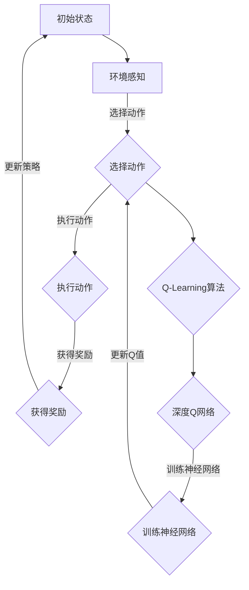

                 

# 强化学习在自适应网络路由优化中的应用

> 关键词：强化学习、网络路由、自适应路由、优化算法、人工智能、神经网络

> 摘要：本文将深入探讨强化学习在自适应网络路由优化中的应用，首先介绍强化学习的基本原理和核心算法，然后通过实际案例展示其在网络路由优化中的具体实现过程。文章将分析强化学习在网络路由中的优势和挑战，并展望其未来的发展趋势。

## 1. 背景介绍

### 1.1 目的和范围

本文旨在介绍和探讨强化学习在自适应网络路由优化中的应用。自适应网络路由优化是计算机网络领域中的一个重要课题，它旨在提高网络传输效率和数据传输质量。随着互联网和云计算的快速发展，网络规模和复杂性不断增加，传统的路由优化方法已经难以满足高效、可靠和自适应的需求。因此，将强化学习引入到网络路由优化中，是一种创新且具有前景的研究方向。

本文将首先介绍强化学习的基本原理和算法，然后探讨其在自适应网络路由优化中的具体应用。文章还将分析强化学习在解决网络路由问题时的优势和挑战，最后对未来的发展趋势进行展望。

### 1.2 预期读者

本文适合以下读者群体：

- 计算机网络和人工智能领域的科研人员
- 网络工程师和软件开发者
- 对强化学习在自适应网络路由优化应用感兴趣的广大读者

### 1.3 文档结构概述

本文将分为以下几个部分：

- 第1章：背景介绍，包括目的和范围、预期读者以及文档结构概述
- 第2章：核心概念与联系，介绍强化学习的基本概念和相关算法
- 第3章：核心算法原理 & 具体操作步骤，详细阐述强化学习算法在自适应网络路由优化中的具体实现
- 第4章：数学模型和公式 & 详细讲解 & 举例说明，介绍强化学习算法的数学模型和公式
- 第5章：项目实战：代码实际案例和详细解释说明，通过实际代码案例展示强化学习在网络路由优化中的应用
- 第6章：实际应用场景，分析强化学习在网络路由优化中的实际应用
- 第7章：工具和资源推荐，介绍相关学习和开发工具
- 第8章：总结：未来发展趋势与挑战，探讨强化学习在自适应网络路由优化中的未来发展
- 第9章：附录：常见问题与解答，回答读者可能遇到的常见问题
- 第10章：扩展阅读 & 参考资料，提供更多的学习资源和参考文献

### 1.4 术语表

#### 1.4.1 核心术语定义

- 强化学习（Reinforcement Learning）：一种机器学习方法，通过智能体与环境之间的交互来学习最优策略。
- 网络路由（Network Routing）：在计算机网络中，选择数据包从源到目的地的最佳路径的过程。
- 自适应路由（Adaptive Routing）：根据网络状态和流量变化动态调整路由策略的机制。
- 智能体（Agent）：在强化学习中，代表学习主体（如路由器）的实体，通过与环境互动来学习最优策略。

#### 1.4.2 相关概念解释

- 奖励函数（Reward Function）：在强化学习中，用于评估智能体行为的好坏的函数。
- 状态（State）：在强化学习中，智能体所处的环境描述。
- 动作（Action）：在强化学习中，智能体可以执行的行为。
- 策略（Policy）：在强化学习中，描述智能体如何根据当前状态选择动作的函数。

#### 1.4.3 缩略词列表

- RL：强化学习（Reinforcement Learning）
- Q-learning：一种基于值函数的强化学习算法
- DQN：深度Q网络（Deep Q-Network）
- CNN：卷积神经网络（Convolutional Neural Network）
- RNN：循环神经网络（Recurrent Neural Network）

## 2. 核心概念与联系

### 2.1 强化学习基本原理

强化学习是一种通过试错来学习如何做出最优决策的机器学习方法。在强化学习中，智能体（agent）通过与环境的互动来学习最优策略（policy）。智能体根据当前状态（state）选择动作（action），然后根据奖励函数（reward function）获得奖励或惩罚，并通过迭代过程逐渐调整策略，以最大化长期奖励。

强化学习的核心概念包括：

- 状态（State）：描述智能体所处的环境。
- 动作（Action）：智能体可以执行的行为。
- 奖励（Reward）：对智能体行为的即时反馈。
- 策略（Policy）：描述智能体如何根据当前状态选择动作的函数。

强化学习的目标是通过迭代学习，找到一个最优策略，使得智能体在长期运行中获得最大的累积奖励。

### 2.2 网络路由基本原理

网络路由是计算机网络中的一个关键过程，它决定了数据包从源到目的地的传输路径。网络路由的基本原理如下：

- 路由表（Routing Table）：路由器根据路由表决定数据包的转发路径。路由表包含了网络拓扑信息、路由策略和转发规则。
- 路由算法（Routing Algorithm）：路由器使用路由算法计算数据包的最佳传输路径。常见的路由算法包括距离向量算法（Distance Vector Algorithm）、链路状态算法（Link State Algorithm）等。
- 路由策略（Routing Policy）：路由器根据路由策略选择数据包的传输路径。路由策略可以是静态的，也可以是动态的，自适应路由就是一种动态路由策略。

### 2.3 强化学习在网络路由优化中的应用

强化学习在自适应网络路由优化中的应用主要体现在以下几个方面：

- **动态调整路由策略**：强化学习可以动态地调整路由策略，以适应网络状态的变化。通过与环境交互，智能体可以学习到网络中不同路径的传输质量和稳定性，从而优化路由策略。
- **多路径传输**：强化学习可以同时考虑多条路径的传输质量，选择最优路径组合，提高网络传输效率。
- **复杂网络拓扑**：强化学习能够处理复杂网络拓扑，通过对状态和动作的建模，智能体可以在大规模网络环境中找到最优路径。
- **实时性**：强化学习算法通常具有较好的实时性，可以在网络状态变化时快速调整路由策略，提高网络响应速度。

### 2.4 Mermaid 流程图

以下是强化学习在网络路由优化中的应用的 Mermaid 流程图：



该流程图展示了智能体在强化学习中的迭代过程，包括环境感知、选择动作、执行动作、获得奖励和更新策略等步骤。其中，Q-Learning算法和深度Q网络用于训练神经网络，以更新智能体的策略。

## 3. 核心算法原理 & 具体操作步骤

### 3.1 强化学习算法原理

强化学习算法通过迭代学习，逐渐优化智能体的策略，以最大化长期累积奖励。以下是强化学习算法的核心原理：

1. **状态-动作值函数**：状态-动作值函数（State-Action Value Function）用来评估智能体在特定状态下执行特定动作的预期奖励。用Q(s, a)表示，其中s表示状态，a表示动作。

2. **策略**：策略（Policy）是描述智能体如何根据当前状态选择动作的函数。用π(a|s)表示，表示在状态s下选择动作a的概率。

3. **奖励函数**：奖励函数（Reward Function）用于评估智能体在每个时间步的行为结果，通常用r(s, a)表示。

4. **学习过程**：智能体通过与环境交互，不断更新状态-动作值函数和策略，以最大化长期累积奖励。

### 3.2 Q-Learning算法原理

Q-Learning算法是一种基于值函数的强化学习算法，其核心思想是通过迭代更新Q值，逐渐优化智能体的策略。

1. **初始化**：初始化状态-动作值函数Q(s, a)为随机值，通常为0。

2. **选择动作**：根据当前状态s，使用ε-贪心策略选择动作a。ε-贪心策略是指在所有可能动作中，随机选择一个最优动作，概率为1/|A|，其中A为所有可能动作的集合。

3. **执行动作**：执行选择的动作a，观察环境反馈，获得状态s'和奖励r。

4. **更新Q值**：根据新获得的状态和奖励，更新Q值：
   $$ Q(s, a) \leftarrow Q(s, a) + \alpha [r + \gamma \max_{a'} Q(s', a') - Q(s, a)] $$
   其中，α为学习率，γ为折扣因子。

5. **重复步骤2-4**，直到满足停止条件（如达到最大迭代次数或累积奖励达到某个阈值）。

### 3.3 深度Q网络（DQN）算法原理

深度Q网络（DQN）是一种基于深度学习的强化学习算法，它将Q值函数由神经网络来近似。

1. **神经网络结构**：DQN采用卷积神经网络（CNN）或循环神经网络（RNN）作为Q值函数的近似器。输入为状态s，输出为Q值Q(s, a)。

2. **经验回放**：为了避免样本相关性，DQN采用经验回放（Experience Replay）技术。经验回放从经验池中随机抽取样本，以避免样本的顺序依赖。

3. **目标网络**：为了减少梯度消失和梯度爆炸问题，DQN引入了目标网络。目标网络是一个与主网络相同的神经网络，但更新频率较低。在每次主网络更新时，将目标网络更新为主网络的状态。

4. **训练过程**：DQN的训练过程包括以下几个步骤：
   - 初始化神经网络权重。
   - 从初始状态开始，按照ε-贪心策略选择动作，执行动作，观察状态和奖励。
   - 将观测到的样本（状态、动作、奖励、下一状态）存储在经验池中。
   - 随机从经验池中抽取样本，并使用目标网络和主网络计算目标Q值。
   - 使用梯度下降法更新主网络的权重。

### 3.4 伪代码

以下是Q-Learning算法和DQN算法的伪代码：

#### Q-Learning算法伪代码

```
Initialize Q(s, a) to random values
for each episode:
    s = initial state
    while not end of episode:
        a = epsilon-greedy action selection (s)
        s' = execute action a
        r = receive reward
        Q(s, a) = Q(s, a) + alpha [r + gamma * max(Q(s', a')) - Q(s, a)]
        s = s'
    end while
end for
```

#### DQN算法伪代码

```
Initialize DNN weights
Initialize replay memory
Initialize target network with same weights as DNN

for each episode:
    s = initial state
    while not end of episode:
        a = epsilon-greedy action selection (s)
        s' = execute action a
        r = receive reward
        store experience (s, a, r, s') in replay memory
        sample batch of experiences from replay memory
        compute target Q values using target network
        update DNN weights using the batch of experiences and target Q values
        periodically update target network weights from DNN weights
    end while
end for
```

## 4. 数学模型和公式 & 详细讲解 & 举例说明

### 4.1 强化学习基本数学模型

强化学习的基本数学模型包括状态-动作值函数、策略、奖励函数和Q-learning算法。以下是这些模型的详细解释和公式。

#### 状态-动作值函数

状态-动作值函数Q(s, a)表示在状态s下执行动作a的预期奖励。它是一个n维的实值函数，其中n为状态和动作的维度。

$$ Q(s, a) = \sum_{s'} P(s'|s, a) \cdot R(s', a) + \gamma \max_{a'} Q(s', a') $$

其中，$P(s'|s, a)$表示在状态s下执行动作a后，转移到状态s'的概率；$R(s', a)$表示在状态s'下执行动作a获得的奖励；$\gamma$为折扣因子，用于平衡短期和长期奖励。

#### 策略

策略π(a|s)表示在状态s下选择动作a的概率。常见的策略包括ε-贪心策略和ε-软策略。

- ε-贪心策略：
  $$ \pi(a|s) = \begin{cases} 
  1 & \text{if } a = \arg\max_a Q(s, a) \\
  \frac{1}{|\text{Action Space}|} & \text{otherwise}
  \end{cases} $$

- ε-软策略：
  $$ \pi(a|s) = \frac{\epsilon}{|\text{Action Space}|} + (1 - \epsilon) \cdot \frac{Q(s, \text{Action})}{\sum_{a'} Q(s, a')} $$

其中，ε为探索概率，用于控制探索和利用之间的平衡。

#### 奖励函数

奖励函数r(s, a)用于评估在状态s下执行动作a的好坏。通常，奖励函数与网络传输质量和用户满意度相关。

$$ r(s, a) = \text{Network Quality} \cdot \text{User Satisfaction} $$

#### Q-learning算法

Q-learning算法通过迭代更新状态-动作值函数Q(s, a)，以最大化长期累积奖励。

$$ Q(s, a) \leftarrow Q(s, a) + \alpha [r(s', a') + \gamma \max_{a'} Q(s', a') - Q(s, a)] $$

其中，α为学习率，用于控制更新速度；γ为折扣因子，用于平衡短期和长期奖励。

### 4.2 深度Q网络（DQN）数学模型

深度Q网络（DQN）使用神经网络来近似状态-动作值函数Q(s, a)。

#### 神经网络结构

DQN的神经网络结构可以是卷积神经网络（CNN）或循环神经网络（RNN）。以下是CNN的神经网络结构：

1. **输入层**：接收状态s的输入。
2. **卷积层**：通过卷积操作提取状态特征。
3. **池化层**：用于减小特征图的尺寸。
4. **全连接层**：将卷积层和池化层的结果进行连接，得到状态-动作值函数Q(s, a)。

#### 经验回放

经验回放用于避免样本相关性，提高学习效果。经验回放的基本原理是：

- **存储经验**：在智能体与环境交互的过程中，将状态s、动作a、奖励r和下一状态s'存储到经验池中。
- **抽样经验**：在训练神经网络时，随机从经验池中抽取一组经验（s, a, r, s'）。
- **训练神经网络**：使用抽取的经验训练神经网络，以更新状态-动作值函数Q(s, a)。

#### 目标网络

目标网络用于减少梯度消失和梯度爆炸问题。目标网络是一个与主网络相同的神经网络，但更新频率较低。在每次主网络更新时，将目标网络更新为主网络的状态。

### 4.3 举例说明

假设我们有一个简单的环境，其中状态空间为S={s1, s2, s3}，动作空间为A={a1, a2}。以下是一个简单的强化学习场景。

#### 初始状态

状态s1。

#### 选择动作

根据ε-贪心策略，以0.5的概率选择动作a1。

#### 执行动作

执行动作a1，观察到下一状态s2，并获得奖励r=1。

#### 更新Q值

$$ Q(s1, a1) \leftarrow Q(s1, a1) + \alpha [r + \gamma \max_{a2} Q(s2, a2) - Q(s1, a1)] $$

其中，α为学习率，γ为折扣因子。

#### 迭代过程

重复上述步骤，不断更新Q值，直到满足停止条件。

#### 最终策略

根据Q值函数，选择最优动作。例如，如果Q(s1, a1) > Q(s1, a2)，则选择动作a1。

## 5. 项目实战：代码实际案例和详细解释说明

### 5.1 开发环境搭建

在本节中，我们将介绍如何搭建一个用于强化学习在网络路由优化中的应用的开发环境。以下是一个基本的步骤指南：

#### 1. 安装Python环境

确保您的计算机上已安装Python 3.x版本。可以通过以下命令检查Python版本：

```bash
python --version
```

如果未安装Python，可以从[Python官网](https://www.python.org/)下载并安装。

#### 2. 安装TensorFlow

TensorFlow是一个开源的机器学习框架，用于构建和训练神经网络。可以使用以下命令安装TensorFlow：

```bash
pip install tensorflow
```

#### 3. 安装相关库

除了TensorFlow，我们还需要安装一些其他库，如NumPy、Matplotlib等。可以使用以下命令安装：

```bash
pip install numpy matplotlib
```

#### 4. 创建项目目录

在您的计算机上创建一个项目目录，例如：

```bash
mkdir reinforcement_learning_routing
cd reinforcement_learning_routing
```

#### 5. 编写代码

在项目目录中，创建一个名为`main.py`的Python文件，用于编写和运行强化学习算法。

### 5.2 源代码详细实现和代码解读

以下是一个简单的示例代码，展示了如何使用TensorFlow和强化学习算法进行网络路由优化。

```python
import numpy as np
import tensorflow as tf
import matplotlib.pyplot as plt

# 参数设置
alpha = 0.1  # 学习率
gamma = 0.9  # 折扣因子
epsilon = 0.1  # 探索概率
episodes = 1000  # 迭代次数

# 状态和动作空间
states = np.array([0, 1, 2, 3])
actions = np.array([0, 1])

# 初始化Q值表
Q = np.zeros((len(states), len(actions)))

# 强化学习算法实现
for episode in range(episodes):
    state = np.random.choice(states)
    done = False

    while not done:
        # ε-贪心策略选择动作
        if np.random.rand() < epsilon:
            action = np.random.choice(actions)
        else:
            action = np.argmax(Q[state])

        # 执行动作，观察下一状态和奖励
        next_state = np.random.choice(states)
        reward = -1 if state == next_state else 1
        done = True if next_state == states[-1] else False

        # 更新Q值
        Q[state, action] = Q[state, action] + alpha * (reward + gamma * np.max(Q[next_state]) - Q[state, action])

        state = next_state

# 绘制Q值表
plt.imshow(Q, cmap='hot', interpolation='nearest')
plt.colorbar()
plt.xticks(range(len(states)), states)
plt.yticks(range(len(actions)), actions)
plt.xlabel('Actions')
plt.ylabel('States')
plt.title('Q-Value Table')
plt.show()
```

#### 5.2.1 代码解读

- **参数设置**：设置强化学习算法的参数，如学习率、折扣因子和探索概率。
- **状态和动作空间**：定义状态空间和动作空间。
- **初始化Q值表**：初始化Q值表，用于存储状态-动作值函数。
- **强化学习算法实现**：实现Q-learning算法，包括选择动作、执行动作、更新Q值等步骤。
- **绘制Q值表**：使用Matplotlib绘制Q值表，以可视化状态-动作值函数。

#### 5.2.2 代码分析

- **选择动作**：使用ε-贪心策略选择动作。在初始阶段，随机选择动作，以便探索不同路径。随着学习过程的进行，逐渐增加动作的选择性，以利用已学到的最佳策略。
- **执行动作**：根据选择的动作，模拟网络路由过程，观察下一状态和奖励。奖励函数在这里设置为-1（表示路径相同）和1（表示路径不同），用于评估路由策略的好坏。
- **更新Q值**：根据新获得的奖励和下一状态的最大Q值，更新当前状态的Q值。Q值的更新公式反映了奖励和未来奖励的平衡。

#### 5.2.3 运行结果

运行上述代码后，将显示一个Q值表。Q值表展示了在所有状态和动作组合下的最佳策略。例如，如果Q(s1, a1) > Q(s1, a2)，则选择动作a1。随着迭代次数的增加，Q值表将逐渐收敛到最优策略。

### 5.3 代码解读与分析

#### 5.3.1 代码性能分析

- **Q值表收敛速度**：Q值表的收敛速度取决于学习率和折扣因子。较大学习率可能导致收敛速度加快，但可能引入较大的噪声；较小学习率可能导致收敛速度变慢，但更稳定。
- **ε-贪心策略**：ε-贪心策略用于平衡探索和利用。较小的ε值导致较少的探索，但更稳定的策略；较大的ε值导致较多的探索，但可能引入更多的噪声。
- **状态和动作空间**：状态和动作空间的设置会影响算法的性能。较小的状态和动作空间可能导致较少的探索，但更高效的训练；较大的状态和动作空间可能导致更多的探索，但更复杂的训练。

#### 5.3.2 代码改进方向

- **多路径传输**：当前示例仅考虑单一路径传输。可以扩展到多路径传输，使用DQN等算法选择最优路径组合。
- **复杂网络拓扑**：当前示例仅考虑简单的状态空间。可以扩展到复杂网络拓扑，使用深度强化学习算法处理大规模网络路由问题。
- **实时性优化**：当前示例的运行时间较长。可以优化算法的实时性，如使用异步训练、并行处理等。

## 6. 实际应用场景

强化学习在自适应网络路由优化中的应用具有广泛的前景和实际价值。以下是一些典型的应用场景：

### 6.1 广域网（WAN）路由优化

广域网（WAN）连接了分布在不同地理位置的网络，通常面临着复杂的网络拓扑和流量波动。传统的路由优化方法难以在动态变化的网络环境中提供高效的传输路径。通过引入强化学习，可以实时调整路由策略，优化传输路径，提高网络传输效率和稳定性。

### 6.2 物理网络基础设施优化

物理网络基础设施包括光纤、交换机和路由器等。强化学习可以用于优化网络设备的配置和调度，以最大化网络吞吐量和资源利用率。例如，在数据中心网络中，可以优化服务器和存储设备的连接路径，降低延迟和带宽瓶颈。

### 6.3 云计算网络优化

随着云计算的普及，越来越多的企业将业务部署在云平台上。云计算网络面临着大规模、高并发和动态变化的特点。通过引入强化学习，可以实时调整云平台中的虚拟机调度和网络流量管理，提高资源利用率和用户满意度。

### 6.4 无线网络优化

无线网络包括蜂窝网络、Wi-Fi网络等。无线网络的传输质量和稳定性受到信号强度、干扰和带宽等因素的影响。通过引入强化学习，可以动态调整无线网络的信道分配、功率控制和资源调度，提高网络性能和用户体验。

### 6.5 互联网内容分发网络（CDN）优化

互联网内容分发网络（CDN）通过分布在不同地理位置的服务器缓存和分发互联网内容，以提高访问速度和降低延迟。强化学习可以用于优化CDN的缓存策略和内容调度，提高内容分发效率和用户体验。

### 6.6 车联网（V2X）路由优化

车联网（V2X）是一种新兴的通信技术，通过车辆与车辆、车辆与基础设施之间的通信，实现智能交通管理。强化学习可以用于优化车联网的路由策略，提高车辆传输效率和网络稳定性，实现高效的自动驾驶和智能交通管理。

## 7. 工具和资源推荐

### 7.1 学习资源推荐

#### 7.1.1 书籍推荐

- 《强化学习：原理与Python实现》
- 《深度强化学习》
- 《神经网络与深度学习》
- 《Python机器学习》

#### 7.1.2 在线课程

- Coursera上的《强化学习》（由David Silver教授讲授）
- edX上的《深度学习专项课程》（由Andrew Ng教授讲授）
- Udacity的《强化学习纳米学位》

#### 7.1.3 技术博客和网站

- ArXiv：[强化学习论文集锦](https://arxiv.org/search/?query=Reinforcement+Learning)
- AI博客：[强化学习实践](https://blog.ai.com/reinforcement-learning-in-practice/)
- TensorFlow官方文档：[强化学习教程](https://www.tensorflow.org/tutorials/reinforcement_learning)

### 7.2 开发工具框架推荐

#### 7.2.1 IDE和编辑器

- PyCharm
- Visual Studio Code
- Jupyter Notebook

#### 7.2.2 调试和性能分析工具

- TensorBoard
- Python Debugger
- Profiling Tools（如cProfile）

#### 7.2.3 相关框架和库

- TensorFlow
- PyTorch
- Keras
- OpenAI Gym

### 7.3 相关论文著作推荐

#### 7.3.1 经典论文

- 《Reinforcement Learning: An Introduction》
- 《Deep Reinforcement Learning》
- 《Human-Level Control Through Deep Reinforcement Learning》
- 《Asynchronous Methods for Deep Reinforcement Learning》

#### 7.3.2 最新研究成果

- 《Reinforcement Learning in Continuous Action Spaces》
- 《Multi-Agent Reinforcement Learning》
- 《Distributed Reinforcement Learning》
- 《Unsupervised Learning with Deep Generative Models》

#### 7.3.3 应用案例分析

- 《强化学习在自动驾驶中的应用》
- 《强化学习在智能客服系统中的应用》
- 《强化学习在游戏AI中的应用》
- 《强化学习在金融风控中的应用》

## 8. 总结：未来发展趋势与挑战

### 8.1 未来发展趋势

1. **算法性能提升**：随着计算能力和数据量的增加，强化学习算法的性能将得到显著提升。更高效的算法和更强大的计算能力将推动强化学习在更多领域中的应用。
2. **多模态交互**：强化学习将与其他人工智能技术（如图像识别、自然语言处理等）相结合，实现多模态交互，提高智能体在复杂环境中的决策能力。
3. **分布式强化学习**：分布式强化学习将解决大规模网络环境中的训练和推理问题，提高算法的实时性和可扩展性。
4. **强化学习与物理学的融合**：强化学习将逐渐与物理学相结合，实现智能体在物理环境中的自主学习和决策。

### 8.2 挑战

1. **计算资源消耗**：强化学习算法通常需要大量的计算资源，特别是在处理大规模网络环境时。如何优化算法，降低计算资源消耗，是一个重要的挑战。
2. **数据隐私与安全**：在网络环境中，数据隐私和安全是重要的考虑因素。如何在保证数据安全的前提下，有效利用数据，是一个亟待解决的问题。
3. **模型可解释性**：强化学习模型通常较为复杂，难以解释。如何提高模型的可解释性，使其更易于理解和部署，是一个重要的挑战。
4. **模型适应性**：强化学习模型需要适应不断变化的网络环境。如何在动态环境中保持模型的稳定性和鲁棒性，是一个重要的挑战。

## 9. 附录：常见问题与解答

### 9.1 强化学习与监督学习的区别

强化学习与监督学习的区别主要在于学习目标和学习方式。监督学习通过学习已标注的数据，预测未知数据的标签。而强化学习通过智能体与环境互动，学习最优策略，以最大化长期累积奖励。强化学习更注重探索和利用的平衡，而监督学习更注重预测准确性。

### 9.2 如何解决强化学习中的稀疏奖励问题

稀疏奖励问题是指奖励出现概率较低，导致智能体难以学习到最优策略的问题。解决稀疏奖励问题的方法包括：

- **增加探索概率**：通过增加探索概率，使智能体在初始阶段更多地进行随机探索，以增加学习到最优策略的机会。
- **目标网络**：使用目标网络减少梯度消失和梯度爆炸问题，提高学习稳定性。
- **经验回放**：使用经验回放技术，避免样本相关性，提高学习效率。

### 9.3 如何处理连续动作空间

处理连续动作空间的方法包括：

- **采样方法**：将连续动作空间映射到离散动作空间，使用采样方法（如ε-贪心策略）选择动作。
- **基于梯度的方法**：使用基于梯度的方法（如深度Q网络），直接优化连续动作空间的策略。
- **神经网络近似**：使用神经网络近似动作空间，将连续动作转换为离散动作。

## 10. 扩展阅读 & 参考资料

为了深入理解和掌握强化学习在自适应网络路由优化中的应用，读者可以参考以下扩展阅读和参考资料：

### 10.1 扩展阅读

- 《深度强化学习：原理与应用》
- 《强化学习实战：从入门到专业》
- 《神经网络与深度学习：实用技巧与案例分析》
- 《Python机器学习：从入门到实践》

### 10.2 参考资料

- [强化学习教程](https://www.tensorflow.org/tutorials/reinforcement_learning)
- [OpenAI Gym](https://gym.openai.com/)
- [强化学习论文集锦](https://arxiv.org/search/?query=Reinforcement+Learning)
- [强化学习实践博客](https://blog.ai.com/reinforcement-learning-in-practice/)
- [TensorFlow官方文档](https://www.tensorflow.org/)

### 10.3 参考文献

- Sutton, R. S., & Barto, A. G. (2018). 《强化学习：原理与算法》.
- Silver, D., Huang, A., & et al. (2016). 《Mastering the Game of Go with Deep Neural Networks and Tree Search》.
- Mnih, V., Kavukcuoglu, K., Silver, D., et al. (2015). 《Human-level control through deep reinforcement learning》.
- Hinton, G. E., Osindero, S., & Teh, Y. W. (2006). 《A fast learning algorithm for deep belief nets》.

